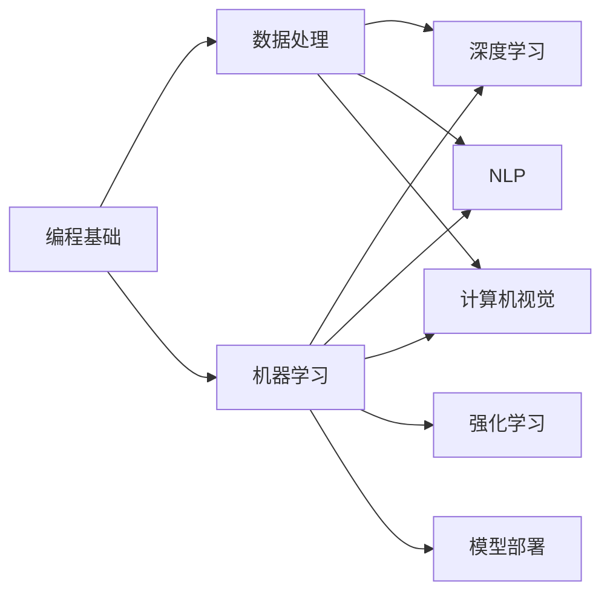

                 

# 技能和培训：为人类计算时代做好准备

## 1. 背景介绍

### 1.1 问题由来

随着人工智能（AI）和机器学习（ML）技术的发展，计算能力已经达到了一个全新的阶段。这种迅速发展的背后，是一个巨大的技能和知识缺口，许多潜在的用户和从业人员都在努力适应这一变革。计算能力的提升不仅仅影响了技术领域，更在医疗、教育、金融、交通等多个行业产生了深远的影响。

为了应对这一挑战，本博文旨在深入探讨如何通过技能和培训，为即将到来的“人类计算时代”做好准备。我们将会讨论不同行业对AI技能的需求，介绍如何利用现有的学习资源来提高技能，并探讨未来AI技术的走向和应对策略。

### 1.2 问题核心关键点

技能和培训的核心在于如何通过教育和训练，使更多人才具备适应未来AI时代的能力。关键点包括：

- **技能和知识缺口**：技术快速发展带来的知识更新速度，远超人类的学习速度。
- **多领域需求**：AI技术在医疗、教育、金融等领域的广泛应用，要求从业者具备多样化的技能。
- **终身学习**：AI技术的持续迭代，要求从业者不断更新和提升自身技能。
- **技能转换**：AI技能与传统技能之间的转换和融合，是一个重要的学习和培训方向。

### 1.3 问题研究意义

本博文的目的是为即将到来的AI时代做好准备，具体意义如下：

1. **提高生产力**：通过培训，使得更多的从业者能够高效地使用AI工具，提升工作效率。
2. **推动创新**：AI技能培训能够激发新的想法和创意，推动技术创新。
3. **减少失业**：通过技能培训，帮助那些可能被AI技术替代的劳动力，找到新的工作机会。
4. **增强竞争力**：对于企业和个人，掌握AI技能能够增强市场竞争力。
5. **促进教育公平**：为不同背景和年龄段的人群提供平等的AI教育机会。

## 2. 核心概念与联系

### 2.1 核心概念概述

在AI时代，技能的范围变得更为广泛，涵盖从基础编程到深度学习的各个方面。以下是几个核心概念的概述：

- **编程基础**：学习一门或几门编程语言（如Python、Java、C++等），这是进入AI领域的基础。
- **数据处理**：理解数据清洗、处理和预处理技术，为机器学习提供数据基础。
- **机器学习**：掌握各种机器学习算法和模型，包括监督学习、无监督学习、强化学习等。
- **深度学习**：深入学习深度学习框架（如TensorFlow、PyTorch等），掌握神经网络设计和技术。
- **自然语言处理（NLP）**：掌握NLP技术，包括文本分析、情感分析、语音识别等。
- **计算机视觉**：掌握计算机视觉技术，包括图像识别、目标检测、图像分割等。
- **强化学习**：了解强化学习算法，如Q-learning、深度强化学习等。
- **模型部署**：掌握将模型部署到生产环境中的技术和工具。

这些核心概念之间存在紧密的联系，形成了AI技能培训的整体架构。

### 2.2 概念间的关系

这些核心概念之间的联系可以通过以下Mermaid流程图来展示：



这个流程图展示了核心概念之间的相互依赖和转换关系。

## 3. 核心算法原理 & 具体操作步骤

### 3.1 算法原理概述

AI技能培训的核心在于理解和学习AI算法和模型的工作原理。以下是对一些核心算法原理的概述：

- **监督学习**：通过有标签的数据集训练模型，使其能够预测新数据点的标签。
- **无监督学习**：利用无标签的数据集，通过聚类、降维等技术发现数据的内在结构。
- **深度学习**：通过多层神经网络，自动提取数据特征并进行分类或预测。
- **自然语言处理（NLP）**：通过各种技术，将自然语言转换为计算机可处理的形式，包括分词、词向量、语言模型等。
- **计算机视觉**：通过图像处理技术，提取图像中的特征，并进行分类、识别等任务。
- **强化学习**：通过智能体与环境交互，学习最优策略以最大化奖励。

### 3.2 算法步骤详解

AI技能培训一般包括以下几个关键步骤：

**Step 1: 确定培训目标和需求**
- 明确培训目标，如掌握Python编程、理解机器学习算法等。
- 根据目标，选择相应的培训课程和资源。

**Step 2: 选择学习资源**
- 选择优质的在线课程、书籍、教程、实践项目等学习资源。
- 推荐一些流行的平台，如Coursera、edX、Udacity、Kaggle等。

**Step 3: 制定学习计划**
- 制定一个合理的学习计划，包括学习顺序、学习时间、复习周期等。
- 确保计划既覆盖全面，又具有实际操作性。

**Step 4: 实践和项目练习**
- 通过实际项目来加深对理论知识的理解。
- 参加开源项目、竞赛等，提升实际应用能力。

**Step 5: 获取认证和证书**
- 通过完成课程、项目，获取认证和证书，提升职业竞争力。
- 参加相关的认证考试，如Google的机器学习工程师认证等。

**Step 6: 持续学习和更新**
- 定期更新知识，了解最新的AI技术和算法。
- 关注行业动态，参加相关的研讨会、会议等。

### 3.3 算法优缺点

AI技能培训的优点包括：

- **广泛适用性**：覆盖从入门到高级的各个层次，适合不同背景的人群。
- **资源丰富**：互联网上有大量的免费和付费资源，易于获取和利用。
- **灵活性**：学习时间和地点都可以自由安排，适应不同人群的需求。

缺点则包括：

- **难度较大**：涉及的知识面广，需要时间和精力进行深入学习。
- **缺乏系统性**：有些资源零散且缺乏系统性，学习者需要自行规划。
- **自主学习能力要求高**：需要较强的自学能力和自律性。

### 3.4 算法应用领域

AI技能培训在多个领域都有广泛的应用，包括但不限于：

- **教育**：通过培训提升教师的AI技术水平，推动教育改革。
- **医疗**：帮助医疗从业人员掌握AI工具，提高诊断和治疗效果。
- **金融**：为金融从业人员提供AI技能培训，提升风险管理和投资决策能力。
- **制造业**：提升制造业从业人员的自动化和智能化技能。
- **物流和供应链**：提升物流和供应链管理的智能化水平。
- **智能家居**：为智能家居设备开发者提供技能培训。
- **农业**：提升农业生产中的智能化管理能力。

## 4. 数学模型和公式 & 详细讲解 & 举例说明

### 4.1 数学模型构建

以监督学习为例，构建一个简单的线性回归模型：

$$
y = \theta_0 + \theta_1x_1 + \theta_2x_2 + \cdots + \theta_nx_n
$$

其中，$y$ 为输出值，$x_i$ 为输入特征，$\theta_i$ 为模型参数。

### 4.2 公式推导过程

线性回归的损失函数为均方误差损失（MSE Loss）：

$$
L(\theta) = \frac{1}{2m} \sum_{i=1}^m (y_i - \hat{y}_i)^2
$$

其中，$m$ 为样本数，$y_i$ 为真实标签，$\hat{y}_i$ 为模型预测值。

使用梯度下降算法更新模型参数：

$$
\theta_i = \theta_i - \eta \frac{\partial L(\theta)}{\partial \theta_i}
$$

其中，$\eta$ 为学习率，$\frac{\partial L(\theta)}{\partial \theta_i}$ 为损失函数对参数的偏导数。

### 4.3 案例分析与讲解

以一个简单的房价预测项目为例，使用线性回归模型进行房价预测：

1. 收集房价数据，包括房屋面积、位置、装修情况等特征。
2. 对数据进行预处理，包括归一化、缺失值处理等。
3. 构建线性回归模型，训练并评估模型性能。
4. 使用模型对新房屋的房价进行预测。

## 5. 项目实践：代码实例和详细解释说明

### 5.1 开发环境搭建

安装Python和相关库，如NumPy、Pandas、Scikit-learn等。创建一个虚拟环境，确保代码的可重现性和一致性。

### 5.2 源代码详细实现

下面是一个简单的线性回归模型的实现：

```python
import numpy as np
from sklearn.linear_model import LinearRegression

# 定义输入和输出
X = np.array([[1, 2, 3], [4, 5, 6], [7, 8, 9]])
y = np.array([2, 4, 6])

# 创建线性回归模型
model = LinearRegression()

# 训练模型
model.fit(X, y)

# 预测新样本
new_X = np.array([[10, 20, 30]])
predicted_y = model.predict(new_X)
print(predicted_y)
```

### 5.3 代码解读与分析

以上代码实现了线性回归模型的训练和预测。解释如下：

- `np.array` 用于创建NumPy数组。
- `LinearRegression` 是Scikit-learn库中的线性回归模型。
- `fit` 方法用于训练模型，接受训练数据作为参数。
- `predict` 方法用于预测新样本，接受待预测数据作为参数。

## 6. 实际应用场景

### 6.1 智能客服

AI技能在智能客服中的应用非常广泛，包括智能应答、情感分析、意图识别等。通过培训，客服人员可以掌握AI工具，提升服务质量和效率。

### 6.2 医疗诊断

AI技能在医疗诊断中的应用包括图像识别、病理分析、基因组学等。医疗从业人员通过培训，可以掌握AI技术，提高诊断和治疗的准确性和效率。

### 6.3 金融分析

AI技能在金融分析中的应用包括风险评估、投资策略、市场预测等。金融从业人员通过培训，可以掌握AI技术，提升风险管理和投资决策能力。

### 6.4 未来应用展望

随着AI技术的不断发展，未来AI技能培训将更加普及和深入。可以预见，AI技能将在更多领域得到应用，如教育、交通、农业等。

## 7. 工具和资源推荐

### 7.1 学习资源推荐

1. **Coursera**：提供各种AI和数据科学课程，涵盖从入门到高级的各个层次。
2. **edX**：提供来自世界顶尖大学的AI课程，包括深度学习、机器学习等。
3. **Udacity**：提供职业导向的AI和机器学习课程，适合职业人士。
4. **Kaggle**：提供数据科学竞赛平台，通过实际项目提升技能。
5. **GitHub**：提供开源项目和学习资源，通过实际项目学习技能。
6. **Stack Overflow**：提供编程和技术问题解答，快速解决学习过程中遇到的问题。

### 7.2 开发工具推荐

1. **Python**：广泛用于AI和数据科学开发，支持各种AI库和框架。
2. **Jupyter Notebook**：支持交互式编程和数据分析，适合学习和实验。
3. **Git**：版本控制工具，方便协作和管理项目。
4. **RStudio**：数据分析和可视化工具，适合统计学和数据科学。
5. **Google Colab**：免费提供GPU算力，适合大规模深度学习实验。

### 7.3 相关论文推荐

1. **《深度学习》（Deep Learning）**：Ian Goodfellow等人著，深度学习领域的经典教材。
2. **《机器学习实战》（Machine Learning in Action）**：Peter Harrington著，介绍各种机器学习算法和实践。
3. **《Python数据科学手册》（Python Data Science Handbook）**：Jake VanderPlas著，涵盖数据处理和分析的各个方面。

## 8. 总结：未来发展趋势与挑战

### 8.1 研究成果总结

AI技能培训已经取得了显著成果，推动了多个领域的技术发展和应用。

### 8.2 未来发展趋势

未来AI技能培训将呈现出以下趋势：

- **技术更新速度快**：AI技术发展迅猛，培训课程需要不断更新。
- **跨领域融合**：AI技能与其他领域的融合将更加深入，如AI与医疗、教育、金融等的结合。
- **个性化培训**：通过数据分析和人工智能，提供个性化的培训方案。
- **在线培训普及**：在线培训将成为主流，使得更多人能够方便地获取培训资源。
- **实践导向**：更多培训课程将注重实际应用，通过项目练习提升技能。

### 8.3 面临的挑战

AI技能培训面临以下挑战：

- **师资力量不足**：缺乏经验丰富的AI教师，难以满足培训需求。
- **学习资源分散**：现有资源较为分散，缺乏系统性和连贯性。
- **学习动力不足**：部分学习者缺乏学习动力和自律性。
- **技能转换困难**：传统技能与AI技能的转换和融合，存在一定难度。

### 8.4 研究展望

未来AI技能培训的研究方向包括：

- **建立标准化培训体系**：制定统一的标准和认证，提升培训质量。
- **开发智能学习工具**：利用AI技术，提供个性化和智能化的学习方案。
- **加强行业合作**：企业和教育机构共同开发和推广培训课程。
- **提高教育公平性**：为不同背景和年龄段的人群提供平等的AI教育机会。

## 9. 附录：常见问题与解答

**Q1：如何选择合适的培训课程？**

A: 选择培训课程时，应该考虑以下几个因素：
1. 目标明确：选择与个人职业目标相匹配的课程。
2. 资源丰富：选择具有优质资源和教学平台的课程。
3. 师资力量：选择有经验丰富的教师和讲师的课程。
4. 实践导向：选择注重实践和项目练习的课程。

**Q2：AI技能培训如何平衡理论与实践？**

A: 在AI技能培训中，理论与实践应该相辅相成：
1. 理论学习：掌握AI基础理论和技术。
2. 实践练习：通过项目和实验，巩固理论知识。
3. 跨学科应用：将AI技能应用于实际场景，提升综合能力。

**Q3：如何保持持续学习？**

A: 持续学习可以通过以下几个方法实现：
1. 定期复习：定期回顾和复习已学内容。
2. 参加研讨会：参加行业内的研讨会和会议，了解最新技术。
3. 加入社区：加入相关的技术社区，与同行交流学习。
4. 不断尝试：尝试新的项目和工具，保持对新技术的敏感度。

**Q4：AI技能培训对个人职业发展有哪些帮助？**

A: AI技能培训对个人职业发展有以下帮助：
1. 提升竞争力：掌握AI技能，增强市场竞争力。
2. 提高工作效率：通过自动化和智能化工具，提升工作效率。
3. 促进职业转型：通过培训，帮助从业者实现职业转型。
4. 拓展职业路径：AI技能与传统技能的结合，拓展新的职业路径。

**Q5：AI技能培训有哪些推荐平台？**

A: 以下是几个推荐的AI技能培训平台：
1. Coursera：提供各种AI和数据科学课程，涵盖从入门到高级的各个层次。
2. edX：提供来自世界顶尖大学的AI课程，包括深度学习、机器学习等。
3. Udacity：提供职业导向的AI和机器学习课程，适合职业人士。
4. Kaggle：提供数据科学竞赛平台，通过实际项目提升技能。
5. GitHub：提供开源项目和学习资源，通过实际项目学习技能。
6. Stack Overflow：提供编程和技术问题解答，快速解决学习过程中遇到的问题。

---

作者：禅与计算机程序设计艺术 / Zen and the Art of Computer Programming

