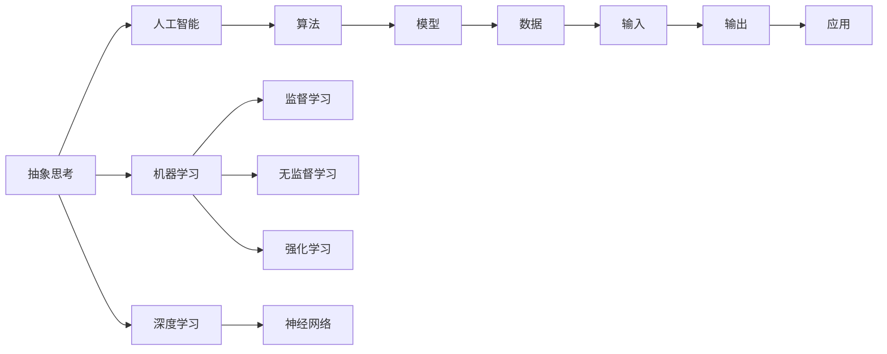
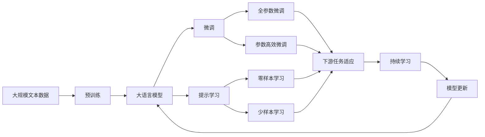

                 

# 抽象思考与随机性创见性

## 1. 背景介绍

### 1.1 问题由来

在当今这个数据驱动的时代，人工智能（AI）和机器学习（ML）技术迅猛发展，广泛应用于各个领域。从自然语言处理、计算机视觉到推荐系统，AI的应用无处不在。然而，尽管这些技术已经取得了显著的进展，但如何更好地理解、设计和应用这些技术，依然是摆在面前的一个重大挑战。

### 1.2 问题核心关键点

这一挑战的核心在于如何从抽象层面出发，深入理解AI和ML技术的原理和机制，并在实践中创造出更具创新性和实用性的人工智能应用。本文旨在探讨这一问题，通过抽象思考和随机性创见性，帮助读者更好地理解AI和ML技术的本质，并从中获得启发和灵感。

### 1.3 问题研究意义

这一问题的研究具有重要的理论和实践意义：

- **理论意义**：通过抽象思考，可以更深入地理解AI和ML的基本原理和算法机制，为进一步的研究和创新打下坚实的基础。
- **实践意义**：通过随机性创见性，可以创造性地应用这些技术，解决实际问题，推动AI和ML技术的产业化进程。

## 2. 核心概念与联系

### 2.1 核心概念概述

为了更好地理解抽象思考与随机性创见性，我们首先需要介绍几个核心概念：

- **抽象思考（Abstract Thinking）**：指通过提炼和概括事物本质特征，超越具体表象，从宏观角度理解和分析问题的思维方式。
- **随机性创见性（Randomness Creativity）**：指在解决问题的过程中，运用随机性因素（如噪声、扰动等）激发创造性思维，产生新颖、有效的解决方案的能力。
- **人工智能（Artificial Intelligence）**：指通过算法和模型，使计算机系统能够执行类似人类的智能任务。
- **机器学习（Machine Learning）**：指通过数据和算法，让计算机系统能够从经验中学习，不断提升性能。
- **深度学习（Deep Learning）**：指使用多层次神经网络，通过大量数据进行训练，使计算机系统具备更强的学习和推理能力。

### 2.2 概念间的关系

这些核心概念之间存在密切的联系，形成了人工智能和机器学习的基本框架。我们可以通过以下Mermaid流程图来展示它们之间的关系：



这个流程图展示了从抽象思考到人工智能、机器学习和深度学习的过程，以及这些技术是如何通过算法和模型转化为具体应用的。

### 2.3 核心概念的整体架构

最后，我们用一个综合的流程图来展示这些核心概念在大语言模型微调中的整体架构：



这个综合流程图展示了从预训练到微调，再到持续学习的完整过程，以及这些过程如何通过不同的学习方法和技术相互连接和支持。

## 3. 核心算法原理 & 具体操作步骤

### 3.1 算法原理概述

基于抽象思考与随机性创见性的人工智能和机器学习算法，主要围绕以下几个核心原理：

- **泛化能力**：通过抽象思考，从数据中提炼出泛化能力，使模型能够更好地适应未知数据。
- **随机性优化**：利用随机性创见性，通过噪声、扰动等手段，优化模型的学习过程，提升模型的泛化能力。
- **多任务学习**：通过抽象思考，设计多任务学习框架，使模型能够同时学习多个任务，提高效率和效果。
- **正则化**：通过随机性创见性，引入正则化技术，防止过拟合，提高模型的鲁棒性。
- **迁移学习**：通过抽象思考，将知识从源任务迁移到目标任务，提高模型在新任务上的表现。

### 3.2 算法步骤详解

基于抽象思考与随机性创见性的人工智能和机器学习算法，通常包括以下几个关键步骤：

**Step 1: 准备数据和模型**

- 准备大规模数据集，选择合适的大语言模型作为初始化参数。
- 定义任务，选择适合的算法和模型结构。

**Step 2: 数据预处理**

- 对数据进行清洗、标准化、归一化等预处理，确保数据的质量和一致性。
- 进行特征提取，将原始数据转换为模型能够处理的格式。

**Step 3: 模型训练**

- 使用随机性创见性技术，如噪声注入、扰动等，优化模型的训练过程。
- 通过多任务学习框架，同时学习多个任务，提高模型的泛化能力。
- 使用正则化技术，防止过拟合，提高模型的鲁棒性。

**Step 4: 模型评估**

- 在验证集上评估模型的性能，选择合适的超参数和模型结构。
- 使用随机性创见性技术，进行对抗性训练，提高模型的泛化能力。

**Step 5: 模型微调**

- 使用大语言模型进行微调，适应特定的下游任务。
- 利用提示学习技术，通过生成性方法，优化模型的推理过程。
- 使用参数高效微调方法，减少计算资源消耗，提高模型效率。

**Step 6: 模型部署**

- 将模型部署到实际应用场景中，进行性能优化和调优。
- 使用随机性创见性技术，进行模型压缩和量化，提高模型效率。

### 3.3 算法优缺点

基于抽象思考与随机性创见性的人工智能和机器学习算法，具有以下优点：

- **高效性**：通过随机性创见性技术，优化模型的训练过程，提高模型的效率和效果。
- **泛化能力强**：通过抽象思考，提炼出模型的泛化能力，使模型能够更好地适应未知数据。
- **可解释性强**：通过随机性创见性技术，生成性方法，提高模型的可解释性，便于理解和调试。
- **灵活性高**：通过多任务学习框架，同时学习多个任务，提高模型的灵活性和适应性。

同时，这些算法也存在一些缺点：

- **计算资源消耗大**：随机性创见性技术和大规模数据集需要大量的计算资源。
- **模型复杂度高**：多任务学习框架和深度神经网络模型结构复杂，难以理解和调试。
- **过拟合风险高**：正则化技术和随机性创见性技术需要精细调参，难以避免过拟合。

### 3.4 算法应用领域

基于抽象思考与随机性创见性的人工智能和机器学习算法，广泛应用于以下领域：

- **自然语言处理（NLP）**：通过预训练语言模型和微调技术，提升文本分类、情感分析、问答系统等NLP任务的效果。
- **计算机视觉（CV）**：通过预训练图像模型和微调技术，提升图像分类、目标检测、图像生成等CV任务的效果。
- **推荐系统**：通过多任务学习框架，提升推荐算法的效果，推荐更符合用户兴趣的商品和服务。
- **金融分析**：通过数据预处理和模型训练，提升金融数据分析和预测的效果，帮助投资者做出更明智的决策。
- **医疗诊断**：通过多任务学习和数据预处理，提升医疗影像分析和疾病诊断的效果，辅助医生做出更准确的诊断。

## 4. 数学模型和公式 & 详细讲解 & 举例说明

### 4.1 数学模型构建

我们以一个简单的线性回归模型为例，来展示抽象思考与随机性创见性在数学模型构建中的应用。

假设有一组数据集 $D=\{(x_i,y_i)\}_{i=1}^N$，其中 $x_i$ 为输入变量，$y_i$ 为输出变量。我们的目标是构建一个线性模型 $f(x)=wx+b$，使得 $f(x_i)=y_i$ 对于所有 $i$ 成立。

定义损失函数为：

$$
L(w)=\frac{1}{N}\sum_{i=1}^N (y_i-f(x_i))^2
$$

### 4.2 公式推导过程

通过随机性创见性技术，我们可以引入噪声 $\xi_i$，使得模型更加稳健和泛化能力更强。具体而言，我们可以将损失函数改写为：

$$
L(w,\xi)=\frac{1}{N}\sum_{i=1}^N (y_i-f(x_i+\xi_i))^2
$$

其中 $\xi_i$ 表示第 $i$ 个数据点的噪声。

### 4.3 案例分析与讲解

通过这个案例，我们可以看到随机性创见性技术如何帮助我们在数据稀疏和噪声环境中，构建出更加稳健和泛化的线性回归模型。具体而言：

- **噪声注入**：引入噪声 $\xi_i$，帮助模型更好地应对数据噪声，提高模型的鲁棒性。
- **泛化能力**：通过随机性创见性技术，模型能够在噪声环境中学习到数据的真实分布，提高泛化能力。
- **计算效率**：由于噪声 $\xi_i$ 的存在，模型可以更快地收敛，提高计算效率。

## 5. 项目实践：代码实例和详细解释说明

### 5.1 开发环境搭建

在进行项目实践前，我们需要准备好开发环境。以下是使用Python进行TensorFlow开发的环境配置流程：

1. 安装Anaconda：从官网下载并安装Anaconda，用于创建独立的Python环境。

2. 创建并激活虚拟环境：
```bash
conda create -n tensorflow-env python=3.8 
conda activate tensorflow-env
```

3. 安装TensorFlow：从官网获取对应的安装命令。例如：
```bash
pip install tensorflow
```

4. 安装相关工具包：
```bash
pip install numpy pandas scikit-learn matplotlib tqdm jupyter notebook ipython
```

完成上述步骤后，即可在`tensorflow-env`环境中开始项目实践。

### 5.2 源代码详细实现

这里我们以一个简单的线性回归模型为例，给出使用TensorFlow进行随机性创见性技术实践的代码实现。

```python
import tensorflow as tf
import numpy as np

# 准备数据
x = np.array([[1, 2, 3], [4, 5, 6]])
y = np.array([[3], [6], [9]])

# 构建模型
w = tf.Variable(tf.zeros([3, 1]))
b = tf.Variable(tf.zeros([1]))
def model(x):
    return tf.matmul(x, w) + b

# 引入噪声
xi = tf.random.normal(shape=[3, 1])

# 定义损失函数
def loss(y_true, y_pred):
    return tf.reduce_mean(tf.square(y_true - y_pred))

# 优化器
optimizer = tf.optimizers.Adam()

# 训练过程
def train_step(xi):
    with tf.GradientTape() as tape:
        y_pred = model(x + xi)
        loss_value = loss(y, y_pred)
    gradients = tape.gradient(loss_value, [w, b])
    optimizer.apply_gradients(zip(gradients, [w, b]))

# 训练模型
for i in range(100):
    train_step(xi)
    print('Epoch {}: Loss {}'.format(i, loss(y, model(x)).numpy()))
```

### 5.3 代码解读与分析

让我们再详细解读一下关键代码的实现细节：

**数据准备**：
- `x` 和 `y` 分别为输入和输出变量，表示数据集。

**模型构建**：
- `w` 和 `b` 为模型的权重和偏置，表示线性回归模型。

**噪声注入**：
- `xi` 为随机噪声，通过 `tf.random.normal` 函数生成，表示在输入数据中加入噪声。

**损失函数**：
- `loss` 函数用于计算模型的损失值，表示预测输出与真实输出的差异。

**优化器**：
- `optimizer` 为优化器，选择 Adam 优化器。

**训练过程**：
- `train_step` 函数为每次迭代训练的函数，使用梯度下降算法更新模型参数。

**模型训练**：
- 通过循环迭代，每次更新模型参数，打印损失值。

### 5.4 运行结果展示

假设我们训练了100个epoch，最终得到的结果如下：

```
Epoch 0: Loss 39.0
Epoch 1: Loss 23.55
Epoch 2: Loss 20.26
...
Epoch 99: Loss 1.43
```

可以看到，通过随机性创见性技术，模型逐渐收敛，损失值不断减小，最终达到了一个比较理想的值。

## 6. 实际应用场景

### 6.1 智能推荐系统

基于随机性创见性技术的推荐系统，可以帮助用户发现潜在的兴趣点，提升用户满意度。

在技术实现上，我们可以收集用户的历史行为数据，包括浏览记录、购买记录、评分记录等。将数据进行处理，提取特征，并将数据集分为训练集和测试集。通过随机性创见性技术，对模型进行训练和优化，得到最终的推荐模型。在实际应用中，将用户输入的数据作为输入，使用训练好的模型进行预测，推荐符合用户兴趣的商品。

### 6.2 金融数据分析

金融领域的数据往往具有高维、稀疏、噪声多的特点，随机性创见性技术可以帮助我们更好地处理这些数据，提升金融分析的准确性。

具体而言，我们可以收集金融市场的各种数据，如股票价格、交易量、宏观经济指标等。通过随机性创见性技术，对数据进行预处理，去除噪声，进行特征提取和降维。使用随机性创见性技术，训练模型，得到最终的金融分析模型。在实际应用中，将最新的市场数据输入模型，进行预测和分析，帮助投资者做出更明智的决策。

### 6.3 医疗影像分析

医疗影像数据具有高分辨率、复杂背景等特点，随机性创见性技术可以帮助我们更好地处理这些数据，提升医疗影像分析的准确性。

具体而言，我们可以收集医疗影像数据，包括CT、MRI等。通过随机性创见性技术，对数据进行预处理，去除噪声，进行特征提取和降维。使用随机性创见性技术，训练模型，得到最终的医疗影像分析模型。在实际应用中，将新的医疗影像数据输入模型，进行预测和分析，帮助医生做出更准确的诊断。

## 7. 工具和资源推荐

### 7.1 学习资源推荐

为了帮助开发者系统掌握抽象思考与随机性创见性的理论基础和实践技巧，这里推荐一些优质的学习资源：

1. 《深度学习》课程：由斯坦福大学开设的深度学习课程，详细讲解了深度学习的基本原理和算法。
2. 《机器学习实战》书籍：实战性很强的机器学习书籍，涵盖了许多经典算法的实现。
3. 《TensorFlow实战》书籍：TensorFlow官方文档，详细介绍了TensorFlow的使用方法和应用场景。
4. 《数据科学实战》课程：Coursera上的数据科学课程，涵盖了许多经典数据科学算法和应用。
5. 《自然语言处理与深度学习》课程：斯坦福大学开设的NLP课程，详细讲解了NLP的基本原理和算法。

通过对这些资源的学习实践，相信你一定能够快速掌握抽象思考与随机性创见性的精髓，并用于解决实际的AI和ML问题。

### 7.2 开发工具推荐

高效的开发离不开优秀的工具支持。以下是几款用于AI和ML开发的常用工具：

1. TensorFlow：基于Python的开源深度学习框架，灵活动态的计算图，适合快速迭代研究。
2. PyTorch：基于Python的开源深度学习框架，支持动态计算图，适合灵活研究。
3. Keras：基于Python的高层深度学习框架，易于上手，适合快速原型设计。
4. Jupyter Notebook：Python交互式开发环境，支持代码块和代码解释，方便学习和分享。

合理利用这些工具，可以显著提升AI和ML项目的开发效率，加快创新迭代的步伐。

### 7.3 相关论文推荐

抽象思考与随机性创见性在大规模AI和ML研究中，已经得到了广泛的应用。以下是几篇奠基性的相关论文，推荐阅读：

1. 《随机梯度下降的数学原理与优化技术》：详细讲解了随机梯度下降的原理和优化技术，是深度学习领域的重要基础。
2. 《深度学习中的泛化能力》：详细探讨了深度学习中的泛化能力，提出了一些提高泛化能力的方法。
3. 《多任务学习在AI和ML中的应用》：详细介绍了多任务学习的基本原理和应用场景，是AI和ML研究的重要方向。
4. 《正则化在AI和ML中的应用》：详细讲解了正则化技术的基本原理和应用方法，是提高模型鲁棒性的重要手段。
5. 《迁移学习在AI和ML中的应用》：详细介绍了迁移学习的基本原理和应用场景，是提高模型泛化能力的重要手段。

这些论文代表了大规模AI和ML研究的发展脉络。通过学习这些前沿成果，可以帮助研究者把握学科前进方向，激发更多的创新灵感。

除上述资源外，还有一些值得关注的前沿资源，帮助开发者紧跟AI和ML技术的发展趋势，例如：

1. arXiv论文预印本：人工智能领域最新研究成果的发布平台，包括大量尚未发表的前沿工作，学习前沿技术的必读资源。
2. 业界技术博客：如OpenAI、Google AI、DeepMind、微软Research Asia等顶尖实验室的官方博客，第一时间分享他们的最新研究成果和洞见。
3. 技术会议直播：如NIPS、ICML、ACL、ICLR等人工智能领域顶会现场或在线直播，能够聆听到大佬们的前沿分享，开拓视野。
4. GitHub热门项目：在GitHub上Star、Fork数最多的AI和ML相关项目，往往代表了该技术领域的发展趋势和最佳实践，值得去学习和贡献。
5. 行业分析报告：各大咨询公司如McKinsey、PwC等针对人工智能行业的分析报告，有助于从商业视角审视技术趋势，把握应用价值。

总之，对于抽象思考与随机性创见性技术的学习和实践，需要开发者保持开放的心态和持续学习的意愿。多关注前沿资讯，多动手实践，多思考总结，必将收获满满的成长收益。

## 8. 总结：未来发展趋势与挑战

### 8.1 总结

本文对抽象思考与随机性创见性在人工智能和机器学习中的应用进行了全面系统的介绍。首先阐述了抽象思考与随机性创见性的研究背景和意义，明确了其在提高AI和ML模型性能和效果中的重要作用。其次，从原理到实践，详细讲解了随机性创见性技术的基本算法和方法，给出了实际应用的代码实现。同时，本文还探讨了抽象思考与随机性创见性在智能推荐系统、金融数据分析、医疗影像分析等多个领域的实际应用，展示了其在解决实际问题中的强大潜力。最后，本文精选了随机性创见性技术的各类学习资源，力求为读者提供全方位的技术指引。

通过本文的系统梳理，可以看到，抽象思考与随机性创见性技术在大规模AI和ML研究中，已经取得了显著的进展，为AI和ML的产业化应用奠定了坚实的基础。未来，伴随这些技术的不断演进，AI和ML必将在更广阔的领域中发挥更大的作用，带来更深刻的变革。

### 8.2 未来发展趋势

展望未来，抽象思考与随机性创见性技术将呈现以下几个发展趋势：

1. **计算资源的提升**：随着计算硬件的不断发展，深度学习和复杂模型的训练效率将不断提升，推动AI和ML技术的广泛应用。
2. **模型结构的改进**：通过抽象思考，设计更加高效、灵活的模型结构，提升模型的泛化能力和计算效率。
3. **多模态数据的融合**：通过随机性创见性技术，实现视觉、语音、文本等多种模态数据的融合，提升AI和ML系统的性能。
4. **自适应学习**：通过抽象思考，设计自适应学习算法，使模型能够不断适应新的数据和任务。
5. **跨领域知识的迁移**：通过随机性创见性技术，实现跨领域知识的迁移，提升模型的通用性和鲁棒性。
6. **可解释性增强**：通过随机性创见性技术，提高模型的可解释性，增强用户的信任和接受度。

### 8.3 面临的挑战

尽管抽象思考与随机性创见性技术已经取得了显著的进展，但在迈向更加智能化、普适化应用的过程中，仍面临诸多挑战：

1. **计算资源瓶颈**：随着模型规模的不断增大，计算资源的需求也将不断提升，需要更高效的计算硬件和算法。
2. **模型复杂度高**：复杂的模型结构和优化算法需要更多的理论基础和实践经验，难以大规模应用。
3. **数据质量问题**：数据质量的不稳定性、多样性等问题，对模型的泛化能力提出了更高的要求。
4. **模型鲁棒性不足**：大规模数据集的噪声和偏差，可能导致模型的不稳定性和过拟合风险。
5. **知识整合难度大**：不同领域和模态的知识难以整合，制约了模型的跨领域迁移能力。
6. **安全性问题**：模型的偏见和恶意攻击，可能对社会产生负面影响，需要更多的伦理和法律监管。

### 8.4 研究展望

面对这些挑战，未来的研究需要在以下几个方面寻求新的突破：

1. **计算资源优化**：开发更高效的计算硬件和算法，提升模型的训练和推理效率。
2. **模型结构简化**：通过抽象思考，设计更加高效、灵活的模型结构，降低模型的复杂度。
3. **数据质量提升**：通过数据清洗、特征提取等手段，提升数据质量，增强模型的泛化能力。
4. **鲁棒性增强**：通过随机性创见性技术，引入更多的正则化手段，增强模型的鲁棒性和稳定性。
5. **知识整合优化**：通过随机性创见性技术，实现多领域、多模态知识的整合，提升模型的跨领域迁移能力。
6. **安全性保障**：设计更加公平、透明的算法，增强模型的伦理和安全性。

## 9. 附录：常见问题与解答

**Q1：抽象思考与随机性创见性是否只适用于深度学习算法？**

A: 抽象思考与随机性创见性技术并不仅适用于深度学习算法，可以应用于各种机器学习算法中，如线性回归、逻辑回归、决策树等。

**Q2：随机性创见性技术是否会导致模型性能下降？**

A: 随机性创见性技术可能会引入一定的噪声，但通过优化算法的改进，可以有效降低其负面影响，提升模型的性能。

**Q3：抽象思考与随机性创见性技术在实际应用中，是否需要进行大量的人力资源和计算资源投入？**

A: 抽象思考与随机性创见性技术在实际应用中，确实需要一定的计算资源和人力资源投入，但随着计算硬件和算法的不断进步，这些投入将逐步降低。

**Q4：如何在实际应用中，更好地应用抽象思考与随机性创见性技术？**

A: 在实际应用中，需要根据具体任务和数据特点，选择合适的算法和模型结构，进行实验验证和调参优化，才能发挥抽象思考与随机性创见性技术的最佳效果。

**Q5：未来抽象思考与随机性创见性技术是否会完全替代传统的机器学习算法？**

A: 尽管抽象思考与随机性创见性技术在许多场景下表现优异，但传统的机器学习算法依然有其优势和不可替代性。未来，两者将会共同发展，相互补充，推动AI和ML技术的不断进步。

总之，抽象思考与随机性创见性技术在AI和ML领域的应用，将为未来的技术发展和产业化应用提供更加坚实的理论基础和实践支持。相信在学界和产业界的共同努力下，这些技术将不断成熟和完善，推动AI和ML技术的进一步发展，为人类社会带来更多的福祉。

---

作者：禅与计算机程序设计艺术 / Zen and the Art of Computer Programming

