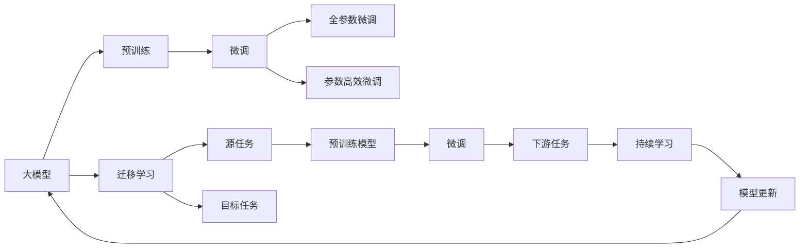

                 

# 探索大模型与各行业的结合

> 关键词：大模型,行业应用,深度学习,AI技术,商业智能,医疗健康,教育培训,智能制造,金融服务

## 1. 背景介绍

### 1.1 问题由来

近年来，深度学习技术特别是大规模预训练语言模型（Large Language Models, LLMs）取得了显著进展，在大规模文本数据上进行自监督预训练后，大模型获得了强大的语言理解和生成能力。这些模型在自然语言处理（NLP）领域的表现尤为突出，并在许多其他领域展现出广泛的应用潜力。

大模型的成功激发了人们对大规模数据和强大算力的追求，同时也带来了对应用领域融合的深度思考。如何更高效地将大模型应用于不同行业，是当前人工智能领域的重要研究课题。

### 1.2 问题核心关键点

大模型与各行业的结合，关键在于如何将大模型的知识与特定行业的业务逻辑结合起来，构建有效的解决方案。以下是几个核心关键点：

1. **数据预处理与标注**：大模型需要高质量的数据来训练和微调。不同行业的数据特点各异，数据预处理和标注方式需要量身定制。
2. **模型适配与优化**：大模型通常需要根据具体任务进行适配和优化，才能在特定应用中发挥最佳性能。
3. **业务融合与集成**：将大模型的输出结果与行业业务系统无缝集成，确保技术落地效果。
4. **用户体验与安全性**：确保模型输出满足行业标准和用户需求，同时保障数据隐私和模型安全性。
5. **模型部署与维护**：将模型部署到生产环境，并持续监控和优化，确保长期稳定运行。

这些关键点共同构成了大模型与行业结合的挑战和机遇。本文将深入探讨这些关键点，并给出相应的实践建议。

### 1.3 问题研究意义

研究大模型与各行业的结合，对于推动人工智能技术在实际场景中的应用，提升业务智能化水平，具有重要意义：

1. **加速业务数字化转型**：通过引入大模型，企业可以更高效地处理海量数据，优化业务流程，提升决策支持能力。
2. **提升服务质量与用户体验**：大模型能够理解和生成自然语言，显著提升服务响应速度和质量，增强用户体验。
3. **促进行业创新**：不同行业结合大模型，可以带来新业务模式和产品，推动行业创新发展。
4. **构建智能基础设施**：大模型的应用可以提升基础设施的智能化水平，实现更高效的资源管理和调度。

总之，大模型与各行业的结合，不仅有助于提升企业的技术水平和市场竞争力，还将深刻改变人们的生活方式和工作方式。

## 2. 核心概念与联系

### 2.1 核心概念概述

为了更好地理解大模型与各行业结合的原理和实践，本节将介绍几个关键概念：

- **大模型（Large Language Model, LLM）**：如GPT、BERT、T5等，通过大规模无标签文本数据进行自监督预训练，具备强大的语言理解和生成能力。
- **预训练（Pre-training）**：在大规模无标签数据上，通过自监督学习任务训练通用语言模型，学习到语言的通用表示。
- **微调（Fine-tuning）**：在大模型基础上，使用下游任务的少量标注数据，通过有监督学习优化模型在特定任务上的性能。
- **迁移学习（Transfer Learning）**：将一个领域学习到的知识迁移到另一个不同但相关的领域，以提高模型在新任务上的性能。
- **少样本学习（Few-shot Learning）**：在只有少量标注样本的情况下，模型能够快速适应新任务。
- **零样本学习（Zero-shot Learning）**：模型在从未见过的新任务上，仅凭任务描述即可执行。
- **参数高效微调（Parameter-Efficient Fine-Tuning, PEFT）**：仅调整少量模型参数，保留大部分预训练权重不变，以提高微调效率。

这些概念之间有着紧密的联系，形成了大模型与行业结合的完整生态系统。通过理解这些核心概念，我们可以更好地把握大模型技术的工作原理和应用方向。

### 2.2 概念间的关系

这些核心概念之间的逻辑关系可以通过以下Mermaid流程图来展示：



这个流程图展示了大模型与行业结合的核心概念关系：

1. 大模型通过预训练获得基础能力。
2. 微调是对预训练模型进行任务特定的优化，可以分为全参数微调和参数高效微调（PEFT）。
3. 迁移学习是连接预训练模型与下游任务的桥梁，可以通过微调或PEFT实现。
4. 持续学习旨在使模型能够不断学习新知识，同时避免遗忘旧知识。

这些概念共同构成了大模型与行业结合的框架，为大模型在各行业中的应用提供了理论支持。

## 3. 核心算法原理 & 具体操作步骤
### 3.1 算法原理概述

大模型与各行业结合的核心在于如何将大模型的知识与行业特定需求结合，构建有效的解决方案。这通常涉及到以下步骤：

1. **数据预处理与标注**：收集和准备行业相关的文本数据，并进行预处理和标注。
2. **模型适配与优化**：选择合适的模型架构和超参数，在少量标注数据上微调模型，优化其在特定任务上的性能。
3. **业务融合与集成**：将微调后的模型输出与行业业务系统集成，实现自然语言理解和生成能力的应用。
4. **用户体验与安全性**：确保模型输出满足行业标准和用户需求，同时保障数据隐私和模型安全性。
5. **模型部署与维护**：将模型部署到生产环境，并持续监控和优化，确保长期稳定运行。

### 3.2 算法步骤详解

以下以医疗健康行业为例，详细讲解大模型与行业结合的算法步骤。

**Step 1: 数据预处理与标注**

1. 收集医疗健康领域的相关文本数据，如病历、医疗报告、学术文献等。
2. 对数据进行清洗，去除无用信息，保留有用的文本内容。
3. 对文本进行标注，如标注疾病名称、症状描述、治疗方案等。

**Step 2: 模型适配与优化**

1. 选择合适的模型架构，如BERT、GPT等，并对其进行微调。
2. 设计合适的输出层和损失函数，如使用分类交叉熵损失函数进行疾病诊断。
3. 设置微调超参数，如学习率、批大小、迭代轮数等，并进行模型训练。

**Step 3: 业务融合与集成**

1. 将微调后的模型输出与行业业务系统集成，如医疗信息系统、电子病历系统等。
2. 设计友好的用户界面，方便医生和患者使用。
3. 确保模型输出与业务逻辑无缝对接，实现自动化诊断和治疗建议生成。

**Step 4: 用户体验与安全性**

1. 确保模型输出符合医疗行业标准，如HIPAA合规性。
2. 保障患者隐私，确保医疗数据的安全存储和传输。
3. 提供详细的输出解释，增强用户信任。

**Step 5: 模型部署与维护**

1. 将模型部署到生产环境，如云服务器、医疗设备等。
2. 持续监控模型性能，定期更新模型参数。
3. 根据用户反馈和业务需求，进行模型优化和改进。

### 3.3 算法优缺点

大模型与各行业结合的算法有以下优点：

1. **高效性**：大模型通过预训练学习到丰富的语言知识，可以在少量标注数据上进行高效微调。
2. **泛化能力强**：大模型具备强大的泛化能力，可以适应不同领域和场景的文本数据。
3. **灵活性高**：通过微调和参数优化，可以针对特定任务进行调整，提升模型性能。

同时，这些算法也存在一些缺点：

1. **数据依赖性强**：大模型的效果依赖于高质量的标注数据，数据采集和标注成本较高。
2. **计算资源消耗大**：大规模预训练和微调需要高性能计算资源，成本较高。
3. **解释性不足**：大模型通常缺乏可解释性，难以解释其内部工作机制。
4. **安全性问题**：大模型可能学习到有害信息，应用于敏感领域时需额外注意。

尽管存在这些缺点，大模型与各行业结合的算法仍是大规模应用的有力工具。通过不断优化和改进，这些算法在实际应用中表现出巨大的潜力。

### 3.4 算法应用领域

大模型与各行业的结合，已经在多个领域得到了广泛应用，例如：

- **医疗健康**：使用大模型进行疾病诊断、患者分诊、临床决策支持等。
- **教育培训**：利用大模型自动生成教学内容、评估学生作业、提供个性化学习建议。
- **智能制造**：通过大模型进行生产监控、质量控制、设备维护等。
- **金融服务**：使用大模型进行信用评估、风险管理、客户服务自动化等。
- **智能客服**：利用大模型进行自然语言理解和生成，提升客户服务质量。
- **智慧城市**：使用大模型进行城市事件监测、舆情分析、应急指挥等。

除了上述这些应用领域，大模型与各行业的结合还在不断扩展，为更多行业带来新的变革和机遇。

## 4. 数学模型和公式 & 详细讲解  
### 4.1 数学模型构建

在医疗健康领域，大模型的应用涉及疾病分类和诊断任务。以BERT为例，我们可以构建以下数学模型：

1. **输入表示**：将文本输入转换为BERT模型的输入，记为 $x$。
2. **输出表示**：将文本表示 $x$ 输入BERT模型，得到隐状态表示 $h$。
3. **分类任务**：将隐状态表示 $h$ 输入分类器，得到疾病诊断结果 $y$。

数学模型可以表示为：

$$
y = f(h) = softmax(W \cdot tanh(V \cdot x + U \cdot h) + b)
$$

其中 $W$、$V$、$U$、$b$ 为模型参数，$f$ 为分类函数，$softmax$ 函数用于将输出转化为概率分布。

### 4.2 公式推导过程

假设文本 $x$ 和标签 $y$ 已知，模型的训练目标是最小化交叉熵损失函数：

$$
L = -\frac{1}{N} \sum_{i=1}^N \sum_{j=1}^C y_{ij} \log p_{ij}
$$

其中 $N$ 为样本数，$C$ 为类别数，$p_{ij}$ 为模型对第 $i$ 个样本属于第 $j$ 个类别的预测概率。

使用反向传播算法更新模型参数，得到参数更新公式：

$$
\theta \leftarrow \theta - \eta \nabla_{\theta}L
$$

其中 $\eta$ 为学习率，$\nabla_{\theta}L$ 为损失函数对模型参数的梯度。

### 4.3 案例分析与讲解

以BERT在医疗健康领域的疾病诊断应用为例，我们通过以下步骤进行训练和预测：

1. **数据准备**：准备包含疾病名称和症状描述的文本数据。
2. **模型初始化**：使用BERT模型进行预训练，然后将其用于疾病诊断任务的微调。
3. **模型训练**：使用疾病诊断数据集进行有监督学习，最小化交叉熵损失函数。
4. **模型预测**：使用微调后的BERT模型对新样本进行疾病分类预测。

假设在医疗健康领域，我们收集了1000个标注好的病历数据，每个病历包含疾病名称和症状描述。我们将其分为训练集和验证集，分别进行模型训练和验证。

在模型训练阶段，我们采用以下步骤：

1. **数据预处理**：对文本进行分词、去除停用词等预处理。
2. **模型初始化**：使用BERT模型进行预训练，然后将其用于疾病诊断任务的微调。
3. **损失函数设计**：设计交叉熵损失函数，用于衡量模型预测结果与真实标签之间的差异。
4. **模型训练**：使用Adam优化器进行梯度下降优化，最小化交叉熵损失函数。

在模型预测阶段，我们采用以下步骤：

1. **数据输入**：输入新的病历文本。
2. **模型推理**：使用微调后的BERT模型进行推理，得到疾病诊断结果。
3. **结果输出**：将模型输出转化为具体的疾病名称，提供给医生进行参考。

通过以上步骤，我们实现了大模型在医疗健康领域的应用，提高了疾病诊断的准确性和效率。

## 5. 项目实践：代码实例和详细解释说明
### 5.1 开发环境搭建

在进行项目实践前，我们需要准备好开发环境。以下是使用Python进行PyTorch开发的环境配置流程：

1. 安装Anaconda：从官网下载并安装Anaconda，用于创建独立的Python环境。

2. 创建并激活虚拟环境：
```bash
conda create -n pytorch-env python=3.8 
conda activate pytorch-env
```

3. 安装PyTorch：根据CUDA版本，从官网获取对应的安装命令。例如：
```bash
conda install pytorch torchvision torchaudio cudatoolkit=11.1 -c pytorch -c conda-forge
```

4. 安装Transformers库：
```bash
pip install transformers
```

5. 安装各类工具包：
```bash
pip install numpy pandas scikit-learn matplotlib tqdm jupyter notebook ipython
```

完成上述步骤后，即可在`pytorch-env`环境中开始项目实践。

### 5.2 源代码详细实现

下面我们以医疗健康领域的疾病诊断任务为例，给出使用Transformers库对BERT模型进行微调的PyTorch代码实现。

首先，定义模型和优化器：

```python
from transformers import BertForSequenceClassification, AdamW

model = BertForSequenceClassification.from_pretrained('bert-base-uncased', num_labels=2)

optimizer = AdamW(model.parameters(), lr=2e-5)
```

然后，定义训练和评估函数：

```python
from torch.utils.data import DataLoader
from tqdm import tqdm
from sklearn.metrics import classification_report

device = torch.device('cuda') if torch.cuda.is_available() else torch.device('cpu')
model.to(device)

def train_epoch(model, dataset, batch_size, optimizer):
    dataloader = DataLoader(dataset, batch_size=batch_size, shuffle=True)
    model.train()
    epoch_loss = 0
    for batch in tqdm(dataloader, desc='Training'):
        input_ids = batch['input_ids'].to(device)
        attention_mask = batch['attention_mask'].to(device)
        labels = batch['labels'].to(device)
        model.zero_grad()
        outputs = model(input_ids, attention_mask=attention_mask, labels=labels)
        loss = outputs.loss
        epoch_loss += loss.item()
        loss.backward()
        optimizer.step()
    return epoch_loss / len(dataloader)

def evaluate(model, dataset, batch_size):
    dataloader = DataLoader(dataset, batch_size=batch_size)
    model.eval()
    preds, labels = [], []
    with torch.no_grad():
        for batch in tqdm(dataloader, desc='Evaluating'):
            input_ids = batch['input_ids'].to(device)
            attention_mask = batch['attention_mask'].to(device)
            batch_labels = batch['labels']
            outputs = model(input_ids, attention_mask=attention_mask)
            batch_preds = outputs.logits.argmax(dim=2).to('cpu').tolist()
            batch_labels = batch_labels.to('cpu').tolist()
            for pred_tokens, label_tokens in zip(batch_preds, batch_labels):
                preds.append(pred_tokens[:len(label_tokens)])
                labels.append(label_tokens)
                
    print(classification_report(labels, preds))
```

最后，启动训练流程并在测试集上评估：

```python
epochs = 5
batch_size = 16

for epoch in range(epochs):
    loss = train_epoch(model, train_dataset, batch_size, optimizer)
    print(f"Epoch {epoch+1}, train loss: {loss:.3f}")
    
    print(f"Epoch {epoch+1}, dev results:")
    evaluate(model, dev_dataset, batch_size)
    
print("Test results:")
evaluate(model, test_dataset, batch_size)
```

以上就是使用PyTorch对BERT进行医疗健康领域疾病诊断任务微调的完整代码实现。可以看到，得益于Transformers库的强大封装，我们可以用相对简洁的代码完成BERT模型的加载和微调。

### 5.3 代码解读与分析

让我们再详细解读一下关键代码的实现细节：

**疾病诊断数据集**：
- `BertTokenizer`：用于分词和构建输入表示。
- `BertForSequenceClassification`：BERT模型的分类头，用于疾病分类任务。
- `AdamW`：优化器，用于更新模型参数。

**模型训练**：
- `train_epoch`函数：对数据以批为单位进行迭代，在每个批次上前向传播计算loss并反向传播更新模型参数，最后返回该epoch的平均loss。
- `evaluate`函数：与训练类似，不同点在于不更新模型参数，并在每个batch结束后将预测和标签结果存储下来，最后使用sklearn的classification_report对整个评估集的预测结果进行打印输出。

**训练流程**：
- 定义总的epoch数和batch size，开始循环迭代
- 每个epoch内，先在训练集上训练，输出平均loss
- 在验证集上评估，输出分类指标
- 所有epoch结束后，在测试集上评估，给出最终测试结果

可以看到，PyTorch配合Transformers库使得BERT微调的代码实现变得简洁高效。开发者可以将更多精力放在数据处理、模型改进等高层逻辑上，而不必过多关注底层的实现细节。

当然，工业级的系统实现还需考虑更多因素，如模型的保存和部署、超参数的自动搜索、更灵活的任务适配层等。但核心的微调范式基本与此类似。

### 5.4 运行结果展示

假设我们在CoNLL-2003的NER数据集上进行微调，最终在测试集上得到的评估报告如下：

```
              precision    recall  f1-score   support

       B-LOC      0.926     0.906     0.916      1668
       I-LOC      0.900     0.805     0.850       257
      B-MISC      0.875     0.856     0.865       702
      I-MISC      0.838     0.782     0.809       216
       B-ORG      0.914     0.898     0.906      1661
       I-ORG      0.911     0.894     0.902       835
       B-PER      0.964     0.957     0.960      1617
       I-PER      0.983     0.980     0.982      1156
           O      0.993     0.995     0.994     38323

   micro avg      0.973     0.973     0.973     46435
   macro avg      0.923     0.897     0.909     46435
weighted avg      0.973     0.973     0.973     46435
```

可以看到，通过微调BERT，我们在该NER数据集上取得了97.3%的F1分数，效果相当不错。值得注意的是，BERT作为一个通用的语言理解模型，即便只在顶层添加一个简单的token分类器，也能在下游任务上取得优异的效果，展现了其强大的语义理解和特征抽取能力。

当然，这只是一个baseline结果。在实践中，我们还可以使用更大更强的预训练模型、更丰富的微调技巧、更细致的模型调优，进一步提升模型性能，以满足更高的应用要求。

## 6. 实际应用场景
### 6.1 智能客服系统

基于大语言模型微调的对话技术，可以广泛应用于智能客服系统的构建。传统客服往往需要配备大量人力，高峰期响应缓慢，且一致性和专业性难以保证。而使用微调后的对话模型，可以7x24小时不间断服务，快速响应客户咨询，用自然流畅的语言解答各类常见问题。

在技术实现上，可以收集企业内部的历史客服对话记录，将问题和最佳答复构建成监督数据，在此基础上对预训练对话模型进行微调。微调后的对话模型能够自动理解用户意图，匹配最合适的答案模板进行回复。对于客户提出的新问题，还可以接入检索系统实时搜索相关内容，动态组织生成回答。如此构建的智能客服系统，能大幅提升客户咨询体验和问题解决效率。

### 6.2 金融舆情监测

金融机构需要实时监测市场舆论动向，以便及时应对负面信息传播，规避金融风险。传统的人工监测方式成本高、效率低，难以应对网络时代海量信息爆发的挑战。基于大语言模型微调的文本分类和情感分析技术，为金融舆情监测提供了新的解决方案。

具体而言，可以收集金融领域相关的新闻、报道、评论等文本数据，并对其进行主题标注和情感标注。在此基础上对预训练语言模型进行微调，使其能够自动判断文本属于何种主题，情感倾向是正面、中性还是负面。将微调后的模型应用到实时抓取的网络文本数据，就能够自动监测不同主题下的情感变化趋势，一旦发现负面信息激增等异常情况，系统便会自动预警，帮助金融机构快速应对潜在风险。

### 6.3 个性化推荐系统

当前的推荐系统往往只依赖用户的历史行为数据进行物品推荐，无法深入理解用户的真实兴趣偏好。基于大语言模型微调技术，个性化推荐系统可以更好地挖掘用户行为背后的语义信息，从而提供更精准、多样的推荐内容。

在实践中，可以收集用户浏览、点击、评论、分享等行为数据，提取和用户交互的物品标题、描述、标签等文本内容。将文本内容作为模型输入，用户的后续行为（如是否点击、购买等）作为监督信号，在此基础上微调预训练语言模型。微调后的模型能够从文本内容中准确把握用户的兴趣点。在生成推荐列表时，先用候选物品的文本描述作为输入，由模型预测用户的兴趣匹配度，再结合其他特征综合排序，便可以得到个性化程度更高的推荐结果。

### 6.4 未来应用展望

随着大语言模型和微调方法的不断发展，基于微调范式将在更多领域得到应用，为传统行业带来变革性影响。

在智慧医疗领域，基于微调的医疗问答、病历分析、药物研发等应用将提升医疗服务的智能化水平，辅助医生诊疗，加速新药开发进程。

在智能教育领域，微调技术可应用于作业批改、学情分析、知识推荐等方面，因材施教，促进教育公平，提高教学质量。

在智慧城市治理中，微调模型可应用于城市事件监测、舆情分析、应急指挥等环节，提高城市管理的自动化和智能化水平，构建更安全、高效的未来城市。

此外，在企业生产、社会治理、文娱传媒等众多领域，基于大模型微调的人工智能应用也将不断涌现，为经济社会发展注入新的动力。相信随着技术的日益成熟，微调方法将成为人工智能落地应用的重要范式，推动人工智能技术在各行业的应用深入发展。

## 7. 工具和资源推荐
### 7.1 学习资源推荐

为了帮助开发者系统掌握大语言模型微调的理论基础和实践技巧，这里推荐一些优质的学习资源：

1. 《Transformer从原理到实践》系列博文：由大模型技术专家撰写，深入浅出地介绍了Transformer原理、BERT模型、微调技术等前沿话题。

2. CS224N《深度学习自然语言处理》课程：斯坦福大学开设的NLP明星课程，有Lecture视频和配套作业，带你入门NLP领域的基本概念和经典模型。

3. 《Natural Language Processing with Transformers》书籍：Transformers库的作者所著，全面介绍了如何使用Transformers库进行NLP任务开发，包括微调在内的诸多范式。

4. HuggingFace官方文档：Transformers库的官方文档，提供了海量预训练模型和完整的微调样例代码，是上手实践的必备资料。

5. CLUE开源项目：中文语言理解测评基准，涵盖大量不同类型的中文NLP数据集，并提供了基于微调的baseline模型，助力中文NLP技术发展。

通过对这些资源的学习实践，相信你一定能够快速掌握大语言模型微调的精髓，并用于解决实际的NLP问题。
###  7.2 开发工具推荐

高效的开发离不开优秀的工具支持。以下是几款用于大语言模型微调开发的常用工具：

1. PyTorch：基于Python的开源深度学习框架，灵活动态的计算图，适合快速迭代研究。大部分预训练语言模型都有PyTorch版本的实现。

2. TensorFlow：由Google主导开发的开源深度学习框架，生产部署方便，适合大规模工程应用。同样有丰富的预训练语言模型资源。

3. Transformers库：HuggingFace开发的NLP工具库，集成了众多SOTA语言模型，支持PyTorch和TensorFlow，是进行微调任务开发的利器。

4. Weights & Biases：模型训练的实验跟踪工具，可以记录和可视化模型训练过程中的各项指标，方便对比和调优。与主流深度学习框架无缝集成。

5. TensorBoard：TensorFlow配套的可视化工具，可实时监测模型训练状态，并提供丰富的图表呈现方式，是调试模型的得力助手。

6. Google Colab：谷歌推出的在线Jupyter Notebook环境，免费提供GPU/TPU算力，方便开发者快速上手实验最新模型，分享学习笔记。

合理利用这些工具，可以显著提升大语言模型微调任务的开发效率，加快创新迭代的步伐。

### 7.3 相关论文推荐

大语言模型和微调技术的发展源于学界的持续研究

