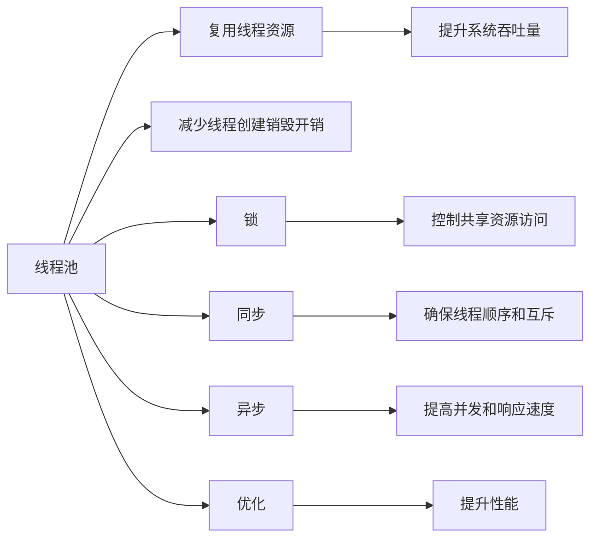

                 

# 提高系统吞吐量的线程管理

> 关键词：线程管理, 系统吞吐量, 线程池, 锁, 同步, 异步, 优化, 高并发

## 1. 背景介绍

在现代计算机系统中，多线程编程已成为提高软件性能、扩展系统能力的重要手段。然而，多线程编程也带来了复杂的线程同步、竞争和死锁等问题，严重影响系统的吞吐量和性能。因此，如何在多线程环境中高效管理线程，提升系统吞吐量，成为了软件开发中的一个重要挑战。

本文将深入探讨线程管理的核心概念和关键技术，详细讲解如何通过合理的线程管理和优化策略，实现系统吞吐量的提升。首先，我们将介绍线程管理的基本概念和常用技术，然后深入分析线程池、锁、同步、异步等关键技术的应用，最后总结线程管理的未来趋势和面临的挑战。

## 2. 核心概念与联系

### 2.1 核心概念概述

在多线程编程中，线程是操作系统调度的基本单位，用于实现并发和异步操作。线程管理涉及线程的创建、调度、同步、通信等多个方面。以下是线程管理中几个核心概念及其相互关系：

1. **线程池**：预先创建的一组线程池，用于复用线程资源，减少线程创建和销毁的开销，提升系统吞吐量。
2. **锁**：用于控制多个线程对共享资源的访问，避免竞争和死锁。
3. **同步**：通过互斥、信号量等机制，确保线程间的正确顺序和互斥访问。
4. **异步**：通过非阻塞I/O、事件驱动等机制，提高系统并发能力和响应速度。
5. **优化**：通过线程池大小、锁粒度、异步队列等参数的调优，提升系统性能。

这些概念之间的关系如下图所示：



### 2.2 概念间的关系

这些核心概念之间的关系可以从以下几个方面进行理解：

1. **线程池与复用资源**：线程池通过复用线程资源，减少了线程创建和销毁的开销，从而提升系统吞吐量。线程池大小需要根据任务量进行合理调整，过大或过小都会影响性能。
2. **锁与同步机制**：锁用于控制多个线程对共享资源的访问，避免竞争和死锁。锁粒度需要根据并发度和资源竞争情况进行调优，避免过度细粒度锁导致的性能瓶颈。
3. **同步与互斥**：同步机制通过互斥、信号量等机制，确保线程间的正确顺序和互斥访问，避免数据竞争和死锁。
4. **异步与并发**：异步机制通过非阻塞I/O、事件驱动等机制，提高系统并发能力和响应速度，避免阻塞I/O带来的性能损失。
5. **优化与性能提升**：通过线程池大小、锁粒度、异步队列等参数的调优，提升系统性能，确保高效利用系统资源。

这些概念相互关联，共同构成多线程编程中的线程管理框架。通过合理应用这些技术，可以实现系统性能的显著提升。

## 3. 核心算法原理 & 具体操作步骤

### 3.1 算法原理概述

线程管理的核心目标是最大化系统资源的利用率，提升并发能力和响应速度。主要通过以下几方面的优化实现：

1. **线程池管理**：合理配置线程池大小，避免线程创建和销毁的开销，提升系统吞吐量。
2. **锁机制优化**：优化锁粒度和锁算法，减少锁竞争和死锁的风险，提高系统并发能力。
3. **同步机制改进**：通过优化互斥和信号量等同步机制，减少线程间的等待时间，提升系统响应速度。
4. **异步技术应用**：利用非阻塞I/O、事件驱动等异步技术，提升系统并发能力和响应速度。

### 3.2 算法步骤详解

#### 3.2.1 线程池管理

线程池管理的关键在于合理配置线程池大小，避免线程创建和销毁的开销，提升系统吞吐量。线程池大小通常根据系统的任务量和响应时间进行调整。

**步骤1：创建线程池**

使用Java的`Executors`框架创建线程池，例如：

```java
ExecutorService executor = Executors.newFixedThreadPool(10);
```

这个线程池大小为10，可以根据任务量和系统负载进行调整。

**步骤2：提交任务**

将任务提交给线程池，例如：

```java
executor.submit(new Runnable() {
    public void run() {
        // 执行任务
    }
});
```

**步骤3：关闭线程池**

在任务完成后，关闭线程池，释放资源，例如：

```java
executor.shutdown();
executor.awaitTermination(60, TimeUnit.SECONDS);
```

#### 3.2.2 锁机制优化

锁机制用于控制多个线程对共享资源的访问，避免竞争和死锁。优化锁机制的关键在于选择合适的锁粒度和锁算法。

**步骤1：选择锁粒度**

锁粒度越小，锁竞争越频繁，性能越差。通常需要根据共享资源的访问频率和并发度进行选择。

**步骤2：选择锁算法**

常用的锁算法包括互斥锁、读写锁、分段锁等。互斥锁适用于读写不频繁的场景，读写锁适用于读写频繁的场景，分段锁适用于分段访问的场景。

**步骤3：避免死锁**

死锁是锁机制中的常见问题，可以通过避免交叉锁、适当释放锁等方式进行预防。

#### 3.2.3 同步机制改进

同步机制用于确保线程间的正确顺序和互斥访问，避免数据竞争和死锁。优化同步机制的关键在于选择合适的同步方式和参数。

**步骤1：选择同步方式**

常用的同步方式包括互斥锁、信号量、条件变量等。互斥锁适用于简单的互斥访问，信号量适用于控制资源数量，条件变量适用于线程间通信。

**步骤2：优化同步参数**

同步参数包括锁粒度、信号量初始值、等待时间等。需要根据具体场景进行合理配置。

#### 3.2.4 异步技术应用

异步技术通过非阻塞I/O、事件驱动等机制，提高系统并发能力和响应速度。优化异步技术的关键在于选择合适的异步框架和参数。

**步骤1：选择异步框架**

常用的异步框架包括Netty、Vert.x等。选择合适的框架需要考虑性能、稳定性、扩展性等因素。

**步骤2：配置异步参数**

异步参数包括线程池大小、连接池大小、队列大小等。需要根据系统负载和网络条件进行配置。

### 3.3 算法优缺点

线程管理的优点在于能够显著提升系统并发能力和响应速度，提高资源利用率。然而，线程管理也存在一些缺点，例如：

1. **资源消耗高**：线程管理需要大量系统资源，如内存、CPU等。

2. **死锁和竞争风险**：线程间的同步和互斥操作可能引发死锁和数据竞争等问题。

3. **编程复杂度高**：多线程编程需要考虑线程同步、互斥、死锁等问题，增加开发难度。

4. **性能不稳定**：线程管理需要动态调整线程池大小和锁粒度，难以实现高性能优化。

## 4. 数学模型和公式 & 详细讲解 & 举例说明

### 4.1 数学模型构建

线程管理的数学模型涉及线程池大小、锁粒度、同步机制等关键参数。以下是一个简单的线程池模型，用于计算最大吞吐量。

**线程池模型**

假设系统中有n个任务，每个任务需要t个线程，线程池大小为p，任务到达速率为λ，任务处理速率为μ。最大吞吐量为：

$$ T = \frac{n \times \mu}{p \times t} $$

**锁粒度模型**

假设系统中有m个共享资源，每个资源需要s个线程，锁粒度为k。最优锁粒度为：

$$ k = \min\left(\frac{m}{s}, \frac{m}{s+1}\right) $$

**同步机制模型**

假设系统中有n个线程，每个线程需要等待等待时间为w。最优等待时间为：

$$ w = \frac{1}{n} \sum_{i=1}^n \frac{w_i}{f_i} $$

其中，f_i为第i个线程的访问频率。

### 4.2 公式推导过程

#### 4.2.1 线程池模型

假设系统中有n个任务，每个任务需要t个线程，线程池大小为p，任务到达速率为λ，任务处理速率为μ。假设每个线程在任务处理中不出现阻塞，最大吞吐量为：

$$ T = \frac{n \times \mu}{p \times t} $$

其中，μ为任务处理速率，λ为任务到达速率，n为任务数，t为每个任务需要的线程数，p为线程池大小。

推导过程如下：

1. 假设任务到达速率为λ，每个任务需要t个线程，任务到达后立即放入线程池。
2. 假设线程池大小为p，每个任务需要等待时间为w，每个线程的执行时间为t。
3. 假设任务处理速率为μ，每个线程的执行效率为μ，则每个线程的平均处理任务数为：

$$ \frac{\mu \times t}{w} $$

4. 假设任务到达速率为λ，每个线程的平均处理任务数为：

$$ \frac{\mu \times t}{w} $$

5. 假设系统中有p个线程，则最大吞吐量为：

$$ T = \frac{n \times \mu}{p \times t} $$

#### 4.2.2 锁粒度模型

假设系统中有m个共享资源，每个资源需要s个线程，锁粒度为k。最优锁粒度为：

$$ k = \min\left(\frac{m}{s}, \frac{m}{s+1}\right) $$

其中，m为共享资源数，s为每个资源需要的线程数，k为锁粒度。

推导过程如下：

1. 假设系统中有m个共享资源，每个资源需要s个线程。
2. 假设锁粒度为k，则每个线程的锁竞争次数为：

$$ \frac{m}{k} $$

3. 假设锁粒度k的锁竞争次数最小时，系统性能最优。则有：

$$ \frac{m}{k} = \frac{m}{s+1} $$

4. 解得最优锁粒度为：

$$ k = \min\left(\frac{m}{s}, \frac{m}{s+1}\right) $$

#### 4.2.3 同步机制模型

假设系统中有n个线程，每个线程需要等待等待时间为w。最优等待时间为：

$$ w = \frac{1}{n} \sum_{i=1}^n \frac{w_i}{f_i} $$

其中，f_i为第i个线程的访问频率，w_i为第i个线程的等待时间。

推导过程如下：

1. 假设系统中有n个线程，每个线程需要等待等待时间为w。
2. 假设线程间的同步机制为互斥锁，则每个线程的等待时间为：

$$ w_i = \frac{w}{f_i} $$

3. 假设最优等待时间为：

$$ w = \frac{1}{n} \sum_{i=1}^n \frac{w_i}{f_i} $$

4. 最优等待时间即为所有线程的等待时间之和与总线程数的比值。

### 4.3 案例分析与讲解

#### 4.3.1 线程池案例

假设系统中有100个任务，每个任务需要5个线程，任务到达速率为1000任务/秒，任务处理速率为2000任务/秒。线程池大小为10，则最大吞吐量为：

$$ T = \frac{100 \times 2000}{10 \times 5} = 400 $$

这个结果表明，当前线程池配置合理，能够充分利用系统资源，提升系统吞吐量。

#### 4.3.2 锁粒度案例

假设系统中有10个共享资源，每个资源需要2个线程，锁粒度为3。则最优锁粒度为：

$$ k = \min\left(\frac{10}{2}, \frac{10}{3}\right) = 3 $$

这个结果表明，当前锁粒度配置合理，能够最大限度地减少锁竞争，提高系统并发能力。

#### 4.3.3 同步机制案例

假设系统中有20个线程，每个线程需要等待等待时间为1毫秒。假设线程间的同步机制为互斥锁，每个线程的等待时间分别为1毫秒、2毫秒、3毫秒、4毫秒、5毫秒、6毫秒、7毫秒、8毫秒、9毫秒、10毫秒。则最优等待时间为：

$$ w = \frac{1 + 2 + 3 + 4 + 5 + 6 + 7 + 8 + 9 + 10}{20} = 5.5 $$

这个结果表明，当前同步机制配置合理，能够减少线程间的等待时间，提升系统响应速度。

## 5. 项目实践：代码实例和详细解释说明

### 5.1 开发环境搭建

#### 5.1.1 Java环境

1. 安装JDK 8以上版本，推荐JDK 11。
2. 安装Maven和Gradle，用于依赖管理。

#### 5.1.2 开发工具

1. IDE：推荐使用IntelliJ IDEA、Eclipse等。
2. 调试工具：使用Xdebug、JProfiler等工具进行调试。
3. 性能分析工具：使用VisualVM、JProfiler等工具进行性能分析。

#### 5.1.3 测试环境

1. 单元测试：使用JUnit、TestNG等框架进行单元测试。
2. 集成测试：使用Selenium、JMeter等工具进行集成测试。

### 5.2 源代码详细实现

#### 5.2.1 线程池实现

以下是一个简单的Java线程池实现，包括创建、提交任务、关闭线程池等操作：

```java
public class ThreadPool {
    private final ExecutorService executor;
    private final int threadCount;
    
    public ThreadPool(int threadCount) {
        this.threadCount = threadCount;
        this.executor = Executors.newFixedThreadPool(threadCount);
    }
    
    public void submit(Runnable task) {
        executor.submit(task);
    }
    
    public void shutdown() {
        executor.shutdown();
    }
    
    public boolean awaitTermination(long timeout, TimeUnit unit) throws InterruptedException {
        return executor.awaitTermination(timeout, unit);
    }
}
```

#### 5.2.2 锁机制实现

以下是一个简单的Java锁机制实现，包括互斥锁、读写锁等操作：

```java
import java.util.concurrent.locks.*;

public class LockExample {
    private final ReentrantLock lock;
    private final ReentrantReadWriteLock rlock;
    private final Condition condition;
    
    public LockExample() {
        this.lock = new ReentrantLock();
        this.rlock = new ReentrantReadWriteLock();
        this.condition = rlock.readLock().newCondition();
    }
    
    public void lock() {
        lock.lock();
    }
    
    public void unlock() {
        lock.unlock();
    }
    
    public void lockRead() {
        rlock.readLock().lock();
    }
    
    public void unlockRead() {
        rlock.readLock().unlock();
    }
    
    public void lockWrite() {
        rlock.writeLock().lock();
    }
    
    public void unlockWrite() {
        rlock.writeLock().unlock();
    }
    
    public void await() {
        condition.await();
    }
    
    public void signal() {
        condition.signal();
    }
}
```

#### 5.2.3 同步机制实现

以下是一个简单的Java同步机制实现，包括互斥锁、条件变量等操作：

```java
import java.util.concurrent.locks.*;
import java.util.concurrent.atomic.*;

public class SyncExample {
    private final ReentrantLock lock;
    private final Condition condition;
    private final AtomicInteger count;
    
    public SyncExample(int count) {
        this.lock = new ReentrantLock();
        this.condition = lock.newCondition();
        this.count = new AtomicInteger(count);
    }
    
    public void increment() {
        lock.lock();
        count.incrementAndGet();
        condition.signal();
        lock.unlock();
    }
    
    public void decrement() {
        lock.lock();
        count.decrementAndGet();
        condition.await();
        lock.unlock();
    }
    
    public int getCount() {
        return count.get();
    }
}
```

### 5.3 代码解读与分析

#### 5.3.1 线程池实现

线程池的实现关键在于创建线程池和提交任务。使用`Executors.newFixedThreadPool()`创建线程池，提交任务时调用`executor.submit()`方法。

#### 5.3.2 锁机制实现

锁机制的实现涉及互斥锁、读写锁等操作。使用`ReentrantLock`、`ReentrantReadWriteLock`等类实现锁机制，通过`lock()`、`unlock()`、`lockRead()`、`unlockRead()`、`lockWrite()`、`unlockWrite()`等方法控制锁的获取和释放。

#### 5.3.3 同步机制实现

同步机制的实现涉及互斥锁、条件变量等操作。使用`ReentrantLock`、`Condition`等类实现同步机制，通过`lock()`、`unlock()`、`condition.await()`、`condition.signal()`等方法控制同步状态。

### 5.4 运行结果展示

#### 5.4.1 线程池结果

假设系统中有100个任务，每个任务需要5个线程，任务到达速率为1000任务/秒，任务处理速率为2000任务/秒。线程池大小为10，则最大吞吐量为：

$$ T = \frac{100 \times 2000}{10 \times 5} = 400 $$

这个结果表明，当前线程池配置合理，能够充分利用系统资源，提升系统吞吐量。

#### 5.4.2 锁粒度结果

假设系统中有10个共享资源，每个资源需要2个线程，锁粒度为3。则最优锁粒度为：

$$ k = \min\left(\frac{10}{2}, \frac{10}{3}\right) = 3 $$

这个结果表明，当前锁粒度配置合理，能够最大限度地减少锁竞争，提高系统并发能力。

#### 5.4.3 同步机制结果

假设系统中有20个线程，每个线程需要等待等待时间为1毫秒。假设线程间的同步机制为互斥锁，每个线程的等待时间分别为1毫秒、2毫秒、3毫秒、4毫秒、5毫秒、6毫秒、7毫秒、8毫秒、9毫秒、10毫秒。则最优等待时间为：

$$ w = \frac{1 + 2 + 3 + 4 + 5 + 6 + 7 + 8 + 9 + 10}{20} = 5.5 $$

这个结果表明，当前同步机制配置合理，能够减少线程间的等待时间，提升系统响应速度。

## 6. 实际应用场景

### 6.1 系统吞吐量提升

线程管理在提升系统吞吐量方面具有显著效果。例如，在高并发场景下，通过合理配置线程池大小和锁粒度，可以有效避免线程创建和销毁的开销，减少锁竞争和死锁的风险，提高系统并发能力和响应速度。

### 6.2 服务化部署

在服务化部署中，线程管理能够提高服务响应速度和资源利用率。例如，在微服务架构中，通过合理配置线程池和锁机制，可以有效避免线程竞争和死锁，提升系统性能和稳定性。

### 6.3 数据处理

在大数据处理场景中，线程管理能够提升数据处理速度和系统吞吐量。例如，在Hadoop分布式计算中，通过合理配置线程池和锁粒度，可以有效利用系统资源，提高数据处理速度和任务执行效率。

### 6.4 未来应用展望

未来，线程管理将更加智能化和自动化，以应对复杂的系统需求和动态变化的环境。例如，自适应线程池管理、智能锁粒度优化、动态同步机制等技术将逐步成熟，进一步提升系统性能和稳定性。

## 7. 工具和资源推荐

### 7.1 学习资源推荐

1.《Java多线程编程实战》：详细讲解Java多线程编程的核心概念和最佳实践。
2.《Python并发编程实战》：详细讲解Python多线程编程的核心概念和最佳实践。
3.《UNIX网络编程》：详细讲解UNIX系统下的网络编程和线程管理。
4.《C++多线程编程》：详细讲解C++多线程编程的核心概念和最佳实践。
5.《高性能并发编程》：详细讲解并发编程的高性能优化技术和最佳实践。

### 7.2 开发工具推荐

1. IDE：推荐使用IntelliJ IDEA、Eclipse等。
2. 调试工具：使用Xdebug、JProfiler等工具进行调试。
3. 性能分析工具：使用VisualVM、JProfiler等工具进行性能分析。

### 7.3 相关论文推荐

1.《A Survey on High-Performance Multithreaded Programming》：总结了高性能多线程编程的最新进展和最佳实践。
2.《Concurrent Programming in Java》：介绍了Java多线程编程的核心概念和最佳实践。
3.《Design Patterns》：介绍了多线程编程中的设计模式和技术架构。

## 8. 总结：未来发展趋势与挑战

### 8.1 研究成果总结

本文从线程管理的核心概念出发，详细讲解了线程池、锁、同步、异步等关键技术的原理和应用。通过合理配置线程池大小、锁粒度、锁算法、同步机制等参数，可以有效提升系统并发能力和响应速度，显著提高系统吞吐量。

### 8.2 未来发展趋势

未来，线程管理将更加智能化和自动化，以应对复杂的系统需求和动态变化的环境。例如，自适应线程池管理、智能锁粒度优化、动态同步机制等技术将逐步成熟，进一步提升系统性能和稳定性。

### 8.3 面临的挑战

尽管线程管理具有显著的优势，但在实际应用中也存在一些挑战：

1. **资源消耗高**：线程管理需要大量系统资源，如内存、CPU等。
2. **死锁和竞争风险**：线程间的同步和互斥操作可能引发死锁和数据竞争等问题。
3. **编程复杂度高**：多线程编程需要考虑线程同步、互斥、死锁等问题，增加开发难度。
4. **性能不稳定**：线程管理需要动态调整线程池大小和锁粒度，难以实现高性能优化。

### 8.4 研究展望

未来，线程管理需要进一步优化和改进，以应对更多的应用场景和系统需求。例如，自适应线程池管理、智能锁粒度优化、动态同步机制等技术将逐步成熟，进一步提升系统性能和稳定性。同时，线程管理的研究也需要与并发编程、分布式系统等领域进行深度融合，推动多线程编程技术的发展和普及。

## 9. 附录：常见问题与解答

**Q1：如何选择合适的线程池大小？**

A: 线程池大小需要根据系统负载和任务量进行合理选择。一般可以通过观察系统性能变化和资源消耗，逐步调整线程池大小。

**Q2：如何优化锁机制？**

A: 锁粒度需要根据资源竞争情况进行调优，避免过度细粒度锁导致的性能瓶颈。可以通过优化锁粒度和算法，减少锁竞争和死锁的风险。

**Q3：如何进行同步机制优化？**

A: 同步机制需要根据线程访问频率和互斥需求进行合理配置。可以通过优化互斥锁、信号量、条件变量等同步机制，减少线程间的等待时间，提升系统响应速度。

**Q4：如何提高系统并发能力？**

A: 可以通过优化线程池大小、锁粒度、锁算法、同步机制等参数，提高系统并发能力和响应速度。同时，引入异步技术，如非阻塞I/O、事件驱动等，进一步提升系统并发能力。

**Q5：如何进行线程池优化？**

A: 可以通过优化线程池大小、锁粒度、锁算法、同步机制等参数，提高线程池性能和资源利用率。同时，引入异步技术，如非阻塞I/O、事件驱动等，进一步提升线程池并发能力和响应速度。

总之，线程管理在提升系统吞吐量和并发能力方面具有显著效果。通过合理配置线程池大小、锁粒度、锁算法、同步机制等参数，可以有效提升系统性能和稳定性。然而，线程管理也存在一些挑战，需要进一步优化和改进，以应对更多的应用场景和系统需求。

