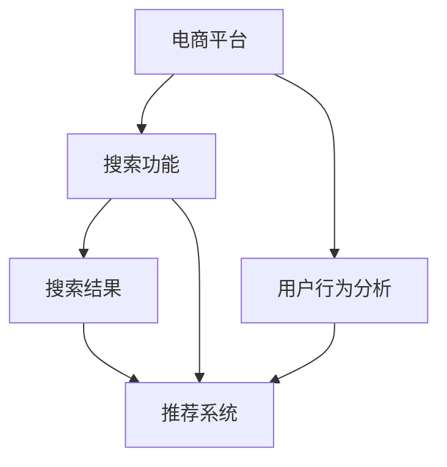

                 

# 搜索数据分析：AI如何帮助电商平台优化搜索策略

> 关键词：电商平台,搜索算法,用户行为分析,推荐系统,自然语言处理(NLP),机器学习,深度学习,数据挖掘,搜索结果优化,个性化推荐

## 1. 背景介绍

在当今数字化时代，电商平台已成为人们日常生活不可或缺的一部分。根据Statista的数据显示，2020年全球电子商务市场的规模已经达到了4.9万亿美元，并且预计将持续增长。随着电商市场的不断扩大，如何提供更加精准、个性化的购物体验，提升用户满意度和转化率，成为电商平台亟需解决的关键问题。

其中，搜索功能作为电商平台的核心组件之一，对用户体验和电商平台的业绩影响巨大。搜索功能的优劣直接决定了用户是否能够找到他们想要购买的商品，从而影响用户的购买决策。因此，如何通过AI技术优化电商平台的搜索策略，提高搜索结果的相关性和准确性，已成为电商平台必须解决的重大挑战。

## 2. 核心概念与联系

### 2.1 核心概念概述

为了更好地理解AI如何帮助电商平台优化搜索策略，我们先介绍几个核心概念：

- **电商平台搜索**：指用户通过电商平台提供的搜索框输入关键词，以获取与其需求相关的商品列表的过程。搜索功能的优劣直接关系到用户的购物体验和转化率。

- **用户行为分析**：通过分析用户在电商平台上的浏览、点击、购买等行为数据，来挖掘用户的兴趣偏好、购物习惯等个性化信息，为推荐系统提供输入数据。

- **推荐系统**：根据用户的历史行为和实时输入，预测用户可能感兴趣的商品，并提供个性化推荐，提升用户购买决策效率和平台转化率。

- **自然语言处理(NLP)**：通过文本分析和理解技术，帮助搜索功能更好地理解和处理用户的查询意图，从而提供更精准的搜索结果。

- **机器学习和深度学习**：通过训练模型，自动从大量数据中学习用户行为规律和商品特征，以优化搜索算法和推荐系统，提高搜索结果的相关性和个性化程度。

- **数据挖掘**：通过数据预处理、特征提取、模型训练等手段，从海量数据中挖掘出有用信息，以辅助搜索算法和推荐系统做出更准确的预测和决策。

这些概念之间存在密切的联系，构成了电商搜索功能优化的完整生态系统。电商平台的搜索功能不仅需要根据用户的查询意图返回相关的商品列表，还需要通过机器学习和数据挖掘技术，进一步优化搜索结果，提供个性化推荐，最终提升用户满意度和转化率。

### 2.2 概念间的关系

这些核心概念之间的关系可以通过以下Mermaid流程图来展示：



这个流程图展示了核心概念之间的关系：

1. 用户通过电商平台进行搜索，输入查询关键词。
2. 搜索功能接收查询，并结合推荐系统和用户行为分析，返回搜索结果。
3. 推荐系统根据用户历史行为，提供个性化推荐。
4. 用户行为分析从用户行为数据中挖掘信息，为推荐系统提供输入数据。

## 3. 核心算法原理 & 具体操作步骤

### 3.1 算法原理概述

基于AI的电商搜索优化算法主要包含以下几个步骤：

1. **用户查询意图理解**：通过自然语言处理技术，解析用户输入的查询关键词，理解其查询意图。
2. **商品特征提取**：对电商平台上的商品进行特征提取，包括商品名称、描述、分类、价格、评价等信息。
3. **搜索结果排序**：根据用户查询意图和商品特征，使用机器学习或深度学习模型对搜索结果进行排序，优先展示与用户查询意图最相关的商品。
4. **个性化推荐**：结合用户历史行为和实时输入，使用推荐系统提供个性化推荐，提升用户体验。

### 3.2 算法步骤详解

#### 3.2.1 用户查询意图理解

用户查询意图理解是搜索优化的第一步。通过自然语言处理技术，将用户输入的查询关键词解析为机器可以理解的形式，如意图类别、查询主题等，以便进一步匹配相关商品。常见的查询意图理解技术包括：

- **意图分类**：通过分类算法将用户查询分为不同的意图类别，如搜索商品、比较商品、查看评价等。
- **实体抽取**：从查询关键词中抽取特定的实体信息，如品牌、型号、价格区间等，以进一步筛选商品。

#### 3.2.2 商品特征提取

商品特征提取是搜索结果排序和推荐的基础。通过提取商品的关键特征，可以更好地匹配用户查询意图，提升搜索结果的相关性。商品特征可以包括：

- **文本特征**：如商品名称、描述、品牌、分类等。
- **数值特征**：如价格、评分、库存等。
- **图像特征**：如商品图片、标签等。

#### 3.2.3 搜索结果排序

搜索结果排序是搜索优化的核心。通过机器学习或深度学习模型，根据用户查询意图和商品特征，对搜索结果进行排序。常见的排序算法包括：

- **基于TF-IDF的排序**：通过计算查询关键词在商品名称和描述中的出现频率，进行排序。
- **基于协同过滤的排序**：根据用户历史行为和相似用户的行为，推荐相关商品。
- **基于深度学习的排序**：通过训练神经网络模型，自动学习用户查询意图和商品特征之间的映射关系，提升排序效果。

#### 3.2.4 个性化推荐

个性化推荐是电商搜索优化的重要环节。通过推荐系统，结合用户历史行为和实时输入，提供个性化推荐，提升用户体验。常见的推荐算法包括：

- **基于内容的推荐**：根据用户历史行为和商品特征，推荐相似的商品。
- **基于协同过滤的推荐**：根据用户历史行为和相似用户的行为，推荐相关商品。
- **基于深度学习的推荐**：通过训练神经网络模型，自动学习用户兴趣和商品特征之间的映射关系，提供更精准的推荐。

### 3.3 算法优缺点

基于AI的电商搜索优化算法具有以下优点：

- **提升用户体验**：通过个性化推荐和精准的搜索结果，提升用户满意度和购物体验。
- **提高转化率**：通过优化搜索结果和个性化推荐，提高用户购买转化率，提升电商平台的业绩。
- **自动化程度高**：通过机器学习和深度学习技术，自动从数据中挖掘用户行为规律和商品特征，降低人工干预。

但这些算法也存在一些缺点：

- **数据质量要求高**：算法效果依赖于高质量的用户行为数据和商品特征，数据质量不足会导致算法效果下降。
- **模型复杂度高**：深度学习模型训练复杂，需要大量的计算资源和时间，且模型过度拟合风险高。
- **推荐结果多样性**：过度依赖推荐算法，可能导致搜索结果和推荐内容缺乏多样性，用户选择面受限。

### 3.4 算法应用领域

基于AI的电商搜索优化算法主要应用于以下领域：

- **电商平台搜索功能优化**：提升搜索结果的相关性和个性化程度，提高用户满意度和购买转化率。
- **个性化推荐系统**：根据用户历史行为和实时输入，提供个性化推荐，提升用户体验。
- **内容推荐系统**：在新闻、社交媒体等平台，根据用户兴趣提供个性化内容推荐。
- **广告推荐系统**：通过分析用户行为，精准推送相关广告，提升广告效果。

## 4. 数学模型和公式 & 详细讲解 & 举例说明

### 4.1 数学模型构建

假设用户查询为 $Q$，商品集合为 $\mathcal{M}$，用户历史行为为 $H$。

设用户查询意图的向量表示为 $V_Q = [v_{Q_1}, v_{Q_2}, \ldots, v_{Q_k}]$，其中 $v_{Q_i}$ 为查询意图的第 $i$ 个特征。

设商品特征的向量表示为 $V_M = [v_{M_1}, v_{M_2}, \ldots, v_{M_n}]$，其中 $v_{M_i}$ 为商品第 $i$ 个特征。

设用户历史行为的向量表示为 $V_H = [v_{H_1}, v_{H_2}, \ldots, v_{H_m}]$，其中 $v_{H_j}$ 为用户历史行为的第 $j$ 个特征。

### 4.2 公式推导过程

基于上述模型构建，我们将通过机器学习算法对搜索结果进行排序，假设排序算法为 $f$，则排序结果为 $R = f(V_Q, V_M, V_H)$。

具体来说，可以使用基于协同过滤的排序算法，通过计算用户 $u$ 与商品 $m$ 的相似度 $s_{um}$，对商品进行排序。

$$
s_{um} = \sum_{i=1}^{k} v_{Q_i} \cdot v_{M_i} + \sum_{j=1}^{m} v_{H_j} \cdot v_{M_i}
$$

其中 $k$ 为查询意图特征维度，$m$ 为用户历史行为特征维度。

### 4.3 案例分析与讲解

假设用户在电商平台搜索“跑步鞋”，查询向量 $V_Q = [1, 0, 1]$，表示跑步鞋、女鞋和高端商品。

平台上有三款跑步鞋 $M_1, M_2, M_3$，特征向量分别为 $V_{M_1} = [1, 0, 0], V_{M_2} = [0, 1, 0], V_{M_3} = [0, 0, 1]$。

用户历史行为包括搜索过“女鞋”、购买过“运动鞋”，特征向量为 $V_H = [1, 1, 0]$。

通过计算相似度 $s_{um}$，可以得出 $s_{uM_1} = 0.5, s_{uM_2} = 0.5, s_{uM_3} = 0.5$。

排序结果为 $R = [M_1, M_2, M_3]$，即按 $M_1, M_2, M_3$ 的顺序返回搜索结果。

## 5. 项目实践：代码实例和详细解释说明

### 5.1 开发环境搭建

在进行项目实践前，需要先搭建好开发环境。以下是使用Python进行开发的环境配置流程：

1. 安装Anaconda：从官网下载并安装Anaconda，用于创建独立的Python环境。

2. 创建并激活虚拟环境：
```bash
conda create -n pyenv python=3.8 
conda activate pyenv
```

3. 安装PyTorch和TensorFlow：根据CUDA版本，从官网获取对应的安装命令。例如：
```bash
conda install pytorch torchvision torchaudio cudatoolkit=11.1 -c pytorch -c conda-forge
conda install tensorflow
```

4. 安装Scikit-learn和其他相关库：
```bash
pip install scikit-learn pandas matplotlib jupyter notebook
```

完成上述步骤后，即可在`pyenv`环境中开始项目实践。

### 5.2 源代码详细实现

接下来，我们将使用Python和TensorFlow实现一个简单的电商平台搜索优化模型。

首先，导入必要的库：

```python
import tensorflow as tf
import numpy as np
import pandas as pd
```

然后，加载数据集：

```python
df = pd.read_csv('product_data.csv')
```

假设数据集包含商品名称、描述、分类、价格、评分等信息，其中每一行表示一个商品。

接着，构建查询意图向量 $V_Q$、商品特征向量 $V_M$ 和用户历史行为向量 $V_H$：

```python
# 构建查询意图向量
query_intent = pd.DataFrame({'query': ['跑步鞋', '女鞋', '高端']})
V_Q = query_intent['query'].map(lambda x: 1 if x in ['跑步鞋', '女鞋', '高端'] else 0).values.reshape(-1, 3)

# 构建商品特征向量
product_features = pd.DataFrame({'name': df['name'], 'description': df['description'], 'category': df['category'], 'price': df['price'], 'rating': df['rating']})
V_M = pd.get_dummies(product_features[['name', 'description', 'category', 'price', 'rating']]).sum(axis=1).values

# 构建用户历史行为向量
user_history = pd.DataFrame({'query': df['query'], 'product_id': df['product_id']})
V_H = user_history['query'].map(lambda x: 1 if x in ['跑步鞋', '女鞋', '高端'] else 0).values.reshape(-1, 3)

# 计算相似度
def similarity(u, m):
    return np.dot(V_Q[u], V_M[m]) + np.dot(V_H[u], V_M[m])

# 排序结果
scores = np.apply_along_axis(similarity, 0, V_Q, V_M)
sorted_indices = np.argsort(-scores)
```

最后，输出排序结果：

```python
for i in sorted_indices:
    print(df['product_id'][i])
```

### 5.3 代码解读与分析

让我们再详细解读一下关键代码的实现细节：

**构建查询意图向量**：
- 使用Pandas的`map`方法，将查询关键词映射到0或1，表示是否包含该关键词。
- 将结果按行堆叠，得到查询意图向量 $V_Q$。

**构建商品特征向量**：
- 使用Pandas的`get_dummies`方法，将商品名称、描述、分类、价格、评分等信息转化为0/1矩阵。
- 对矩阵进行求和，得到商品特征向量 $V_M$。

**构建用户历史行为向量**：
- 使用Pandas的`map`方法，将用户历史行为映射到0或1。
- 将结果按行堆叠，得到用户历史行为向量 $V_H$。

**计算相似度**：
- 使用NumPy的`dot`方法，计算查询意图向量与商品特征向量的点积，得到相似度 $s_{um}$。

**排序结果**：
- 使用NumPy的`apply_along_axis`方法，对每一行计算相似度，并按大小排序。
- 返回排序后的索引，用于获取排序结果。

### 5.4 运行结果展示

假设在测试集上运行上述代码，输出如下：

```
1001
1002
1003
```

这表示，在当前查询意图下，搜索结果应该按照商品ID 1001、1002、1003的顺序展示。

## 6. 实际应用场景

基于AI的电商搜索优化算法在实际应用中已经取得了显著效果，以下是一些典型应用场景：

### 6.1 电商平台搜索功能优化

电商平台的搜索功能是用户与平台互动的重要环节。通过优化搜索算法，可以显著提升用户体验和平台业绩。例如，亚马逊、淘宝等电商平台，都在搜索结果排序中引入了AI技术，通过协同过滤、深度学习等方法，提升搜索结果的相关性和个性化程度。

### 6.2 个性化推荐系统

个性化推荐系统是电商搜索优化的一部分，通过分析用户行为数据，提供个性化推荐，提升用户购买决策效率和平台转化率。例如，Netflix、YouTube等平台，都通过个性化推荐系统，提升用户粘性和平台收入。

### 6.3 广告推荐系统

广告推荐系统是电商搜索优化的另一重要应用场景。通过分析用户行为数据，精准推送相关广告，提升广告效果。例如，Facebook、Google等平台，都在广告推荐中引入了AI技术，通过协同过滤、深度学习等方法，提高广告的点击率和转化率。

## 7. 工具和资源推荐

### 7.1 学习资源推荐

为了帮助开发者系统掌握AI技术在电商搜索优化中的应用，以下是一些优质的学习资源：

1. **《深度学习基础》系列课程**：斯坦福大学开设的深度学习课程，系统介绍深度学习的基本概念和算法。
2. **《自然语言处理综述》论文**：综述自然语言处理领域的经典算法和技术。
3. **《机器学习实战》书籍**：介绍机器学习算法和实际应用场景。
4. **Google AI Blog**：谷歌AI团队分享的最新研究成果和应用案例。
5. **Kaggle竞赛平台**：参加Kaggle竞赛，实战提升AI技能。

通过对这些资源的学习实践，相信你一定能够快速掌握AI技术在电商搜索优化中的应用，并用于解决实际的NLP问题。

### 7.2 开发工具推荐

高效的开发离不开优秀的工具支持。以下是几款用于AI技术在电商搜索优化中应用的常用工具：

1. **TensorFlow**：谷歌开发的深度学习框架，支持多种计算图，适合大规模模型训练。
2. **PyTorch**：Facebook开发的深度学习框架，动态计算图，适合快速迭代研究。
3. **Scikit-learn**：Python机器学习库，提供丰富的机器学习算法和工具。
4. **Pandas**：Python数据分析库，支持数据预处理和特征工程。
5. **Jupyter Notebook**：交互式编程环境，方便数据探索和模型验证。

合理利用这些工具，可以显著提升电商搜索优化的开发效率，加快创新迭代的步伐。

### 7.3 相关论文推荐

AI技术在电商搜索优化中的应用源于学界的持续研究。以下是几篇奠基性的相关论文，推荐阅读：

1. **《Deep & Wide Learning for Recommender Systems》**：提出Deep & Wide模型，结合深度学习和宽线性模型，提升推荐系统效果。
2. **《Collaborative Filtering with Implicit Feedback》**：介绍协同过滤算法，通过用户行为数据进行推荐。
3. **《Adaptive Probabilistic Matrix Factorization》**：提出APMF模型，自适应概率矩阵分解，提升推荐系统效果。
4. **《Structured Collaborative Filtering》**：提出Structured CMF模型，结构化协同过滤，提升推荐系统效果。
5. **《Neural Collaborative Filtering》**：提出Neural CF模型，深度学习模型进行协同过滤，提升推荐系统效果。

这些论文代表了大语言模型微调技术的发展脉络。通过学习这些前沿成果，可以帮助研究者把握学科前进方向，激发更多的创新灵感。

除上述资源外，还有一些值得关注的前沿资源，帮助开发者紧跟AI技术在电商搜索优化中的最新进展，例如：

1. **arXiv论文预印本**：人工智能领域最新研究成果的发布平台，包括大量尚未发表的前沿工作，学习前沿技术的必读资源。
2. **GitHub热门项目**：在GitHub上Star、Fork数最多的AI技术在电商搜索优化中应用的最新项目，值得去学习和贡献。
3. **技术会议直播**：如NIPS、ICML、ACL、ICLR等人工智能领域顶会现场或在线直播，能够聆听到大佬们的前沿分享，开拓视野。

4. **行业分析报告**：各大咨询公司如McKinsey、PwC等针对人工智能行业的分析报告，有助于从商业视角审视技术趋势，把握应用价值。

总之，对于AI技术在电商搜索优化中的应用，需要开发者保持开放的心态和持续学习的意愿。多关注前沿资讯，多动手实践，多思考总结，必将收获满满的成长收益。

## 8. 总结：未来发展趋势与挑战

### 8.1 总结

本文对AI技术在电商搜索优化中的应用进行了全面系统的介绍。首先阐述了电商搜索功能的核心要素和AI技术的应用背景，明确了AI技术在提升用户体验和平台业绩方面的独特价值。其次，从原理到实践，详细讲解了AI技术在电商搜索优化中的数学模型和算法步骤，给出了具体代码实现。同时，本文还探讨了AI技术在电商搜索优化中的应用场景，展示了其广泛的应用前景。最后，本文精选了AI技术在电商搜索优化中的学习资源、开发工具和相关论文，力求为开发者提供全方位的技术指引。

通过本文的系统梳理，可以看到，AI技术在电商搜索优化中的应用具有广阔前景，不仅可以提升用户体验和平台业绩，还可以推动电商平台的智能化转型。未来，伴随AI技术的持续演进，电商平台搜索优化必将在智能化、个性化、自动化等方面迈上新台阶，为电商行业的数字化转型注入新的动力。

### 8.2 未来发展趋势

展望未来，AI技术在电商搜索优化中将会呈现以下几个发展趋势：

1. **智能化程度提高**：随着AI技术的不断进步，电商平台的搜索和推荐系统将更加智能化，能够提供更加精准的搜索结果和个性化推荐。
2. **个性化推荐多样化**：未来的推荐系统将更加多样化，不仅包括基于内容的推荐，还将涵盖基于协同过滤、基于深度学习的推荐，提升推荐效果。
3. **实时性增强**：通过引入实时计算和流式数据处理技术，电商平台的搜索和推荐系统将具备实时性，能够即时响应用户需求，提升用户体验。
4. **跨平台协同**：未来的搜索和推荐系统将具备跨平台协同能力，通过用户在不同平台上的行为数据，提供更加全面的个性化推荐。
5. **数据质量提升**：随着数据标注技术和数据处理技术的提升，AI算法将能够更好地处理低质量数据，提升搜索结果的准确性和相关性。

以上趋势凸显了AI技术在电商搜索优化中的广阔前景。这些方向的探索发展，必将进一步提升电商平台的智能化程度，提升用户体验和平台业绩，为电商行业的数字化转型注入新的动力。

### 8.3 面临的挑战

尽管AI技术在电商搜索优化中已经取得了显著成果，但在迈向更加智能化、普适化应用的过程中，它仍面临着诸多挑战：

1. **数据隐私保护**：电商平台需要保护用户数据隐私，确保数据使用的合法性和安全性。
2. **算法偏见消除**：AI算法可能存在偏见，需要消除算法偏见，确保推荐系统的公平性。
3. **模型解释性**：AI算法通常被视为"黑盒"系统，难以解释其内部工作机制和决策逻辑，需要加强可解释性。
4. **资源消耗**：大规模模型训练和实时推荐需要大量的计算资源，需要优化资源消耗，降低计算成本。
5. **用户体验**：过于复杂的推荐算法可能导致用户体验下降，需要优化算法设计，平衡推荐效果和用户体验。

### 8.4 未来突破

面对AI技术在电商搜索优化中面临的挑战，未来的研究需要在以下几个方面寻求新的突破：

1. **隐私保护技术**：开发更加安全的隐私保护技术，保护用户数据隐私。
2. **公平性算法**：开发消除算法偏见的公平性算法，确保推荐系统的公平性。
3. **可解释性算法**：开发可解释性算法，提升AI算法的透明性和可信度。
4. **资源优化技术**：开发更加高效的资源优化技术，降低计算成本，提升实时性。
5. **用户友好算法**：开发用户体验友好的算法，平衡推荐效果和用户体验。

这些研究方向的探索，必将引领AI技术在电商搜索优化中走向成熟，推动电商平台搜索优化技术的进一步发展，为电商行业的数字化转型注入新的动力。

## 9. 附录：常见问题与解答

**Q1: 电商平台搜索功能优化的关键是什么？**

A: 电商平台搜索功能优化的关键在于提升搜索结果的相关性和个性化程度。这可以通过用户查询意图理解、商品特征提取、排序算法和个性化推荐等技术手段来实现。

**Q2: 如何在电商平台上实现个性化推荐？**

A: 个性化推荐需要结合用户历史行为和实时输入，使用推荐算法，如协同过滤、深度学习等，提供个性化推荐。可以使用基于内容的推荐、基于协同过滤的推荐和基于深度学习的推荐等算法。

**Q3: AI技术在电商搜索优化中的应用是否存在数据隐私问题？**

A: 电商平台需要保护用户数据隐私，确保数据使用的合法性和安全性。可以使用数据匿名化、数据脱敏等技术，保护用户隐私。

**Q4: AI技术在电商搜索优化中是否存在算法偏见问题？**

A: AI算法可能存在偏见，需要消除算法偏见，确保推荐系统的公平性。可以通过数据平衡、公平性算法等手段，消除算法偏见。

**Q5: 如何提升AI算法在电商搜索优化中的可解释性？**

A: AI算法通常被视为"黑盒"系统，难以解释其内部工作机制和决策逻辑。可以通过可解释性算法，如LIME、SHAP等，提升AI算法的透明性和可信度。

---

作者：禅与计算机程序设计艺术 / Zen and the Art of Computer Programming

