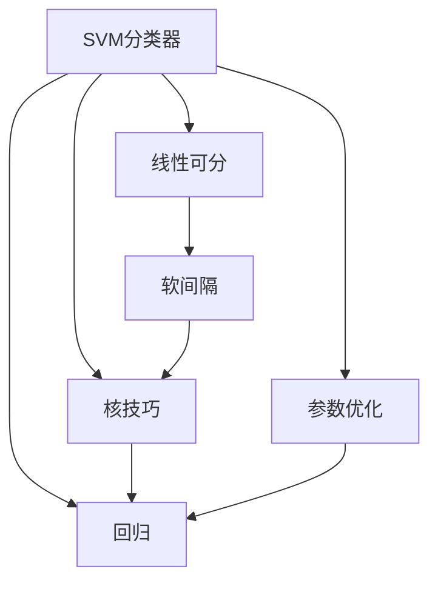
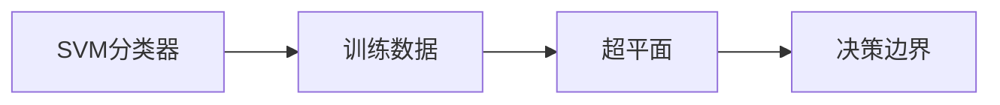
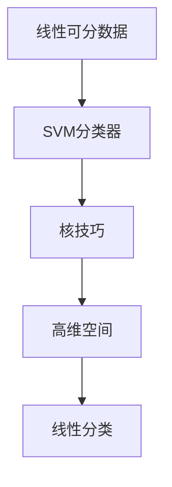
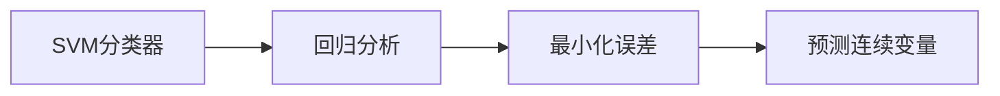
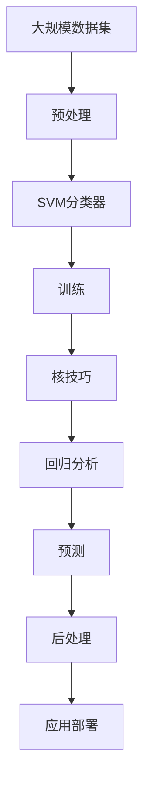

                 

# 支持向量机 (Support Vector Machines, SVM) 原理与代码实例讲解

> 关键词：支持向量机, SVM, 分类器, 核函数, 线性可分, 最大间隔, 参数优化, 非线性可分, 高维空间, 核技巧, 回归, 核技巧, 应用场景, 实际案例

## 1. 背景介绍

### 1.1 问题由来
支持向量机（Support Vector Machine, 简称SVM）是一种广泛应用于机器学习和数据挖掘领域的分类器和回归分析工具。自1995年由Vapnik和Chervonenkis首次提出以来，SVM已经成为解决许多复杂问题的有力工具，尤其在面对高维数据和非线性数据时表现出色。SVM的核心思想是寻找一个最优的超平面，将不同类别的数据点分隔开，同时在误差最小化与模型复杂度之间进行平衡。

### 1.2 问题核心关键点
SVM的核心在于其能够处理非线性数据，并找到全局最优解。其核心算法包括硬间隔（线性可分）、软间隔（线性不可分）、核技巧（非线性可分）等。此外，SVM还能用于回归分析，且具有泛化能力强的特点。

### 1.3 问题研究意义
SVM作为一种高效、准确的机器学习算法，在分类和回归任务中表现出卓越的性能。它不仅能够处理高维数据，还能够解决非线性分类问题。通过核技巧，SVM可以将数据映射到高维空间，从而在原空间中线性不可分的问题在高维空间中变得线性可分。在实际应用中，SVM被广泛用于图像识别、自然语言处理、医疗诊断、金融预测等领域，极大地推动了人工智能技术的发展。

## 2. 核心概念与联系

### 2.1 核心概念概述

为更好地理解SVM的原理和应用，本节将介绍几个关键概念：

- **SVM分类器**：SVM是一种二分类模型，其目标是通过找到一个最优的超平面，将不同类别的数据点分开。超平面的选择使得间隔最大化，即最大化到最近数据点的距离。
- **核技巧**：SVM的核心思想是通过核技巧将非线性问题转化为高维空间的线性问题。常用的核函数包括线性核、多项式核、径向基函数（RBF）核等。
- **线性可分和软间隔**：线性可分指数据点可以线性分开，软间隔允许一定的误差，但最小化总误差。
- **回归**：除了分类外，SVM还适用于回归分析，通过最小化误差和模型复杂度，预测连续变量的值。

这些概念通过以下Mermaid流程图展示了它们之间的联系：



这个流程图展示了大SVM模型的核心概念及其之间的关系：

1. SVM分类器通过线性可分和软间隔处理数据。
2. 核技巧将非线性问题转化为高维空间中的线性问题。
3. 回归分析通过SVM模型实现，通过最小化误差和模型复杂度进行预测。
4. 参数优化在SVM模型训练中至关重要，通过调整超参数使模型效果最佳。

### 2.2 概念间的关系

这些核心概念之间存在着紧密的联系，形成了SVM算法的完整框架。以下通过几个Mermaid流程图展示它们之间的关系。

#### 2.2.1 SVM分类器学习流程



这个流程图展示了SVM分类器学习的基本流程：通过训练数据，找到最佳的超平面，从而得到决策边界。

#### 2.2.2 核技巧在SVM中的应用



这个流程图展示了核技巧如何在SVM中使用，将线性可分的数据通过核函数映射到高维空间，从而进行线性分类。

#### 2.2.3 SVM回归分析



这个流程图展示了SVM如何应用于回归分析，通过最小化误差和模型复杂度来预测连续变量。

### 2.3 核心概念的整体架构

最后，我们用一个综合的流程图来展示这些核心概念在大SVM模型微调过程中的整体架构：



这个综合流程图展示了从数据预处理到应用部署的完整SVM流程：

1. 从大规模数据集中提取数据。
2. 数据预处理，包括特征提取、归一化等。
3. SVM分类器进行模型训练，找到最佳超平面。
4. 应用核技巧处理非线性数据。
5. 进行回归分析，通过最小化误差和模型复杂度来预测连续变量。
6. 对预测结果进行后处理，如平滑处理等。
7. 将模型部署到实际应用中。

通过这些流程图，我们可以更清晰地理解SVM的核心概念和它们之间的联系，为后续深入讨论SVM的原理和实际应用奠定基础。

## 3. 核心算法原理 & 具体操作步骤
### 3.1 算法原理概述

SVM的核心在于其通过寻找最优的超平面来实现分类或回归分析。其基本思想是在特征空间中找到一个最大间隔的超平面，使得不同类别的数据点被最佳分割。最大间隔（最大边距）是SVM优化的目标，即寻找一个最能够分割数据的超平面。

具体来说，SVM的目标函数如下：

$$
\begin{aligned}
&\min_{\mathbf{w},b} \frac{1}{2}\|\mathbf{w}\|^2 + C\sum_{i=1}^n \max (0, 1-y_i(\mathbf{w} \cdot \mathbf{x}_i + b)) \\
&\text{subject to} \quad y_i(\mathbf{w} \cdot \mathbf{x}_i + b) \geq 1 - \epsilon
\end{aligned}
$$

其中，$\mathbf{w}$ 和 $b$ 分别表示超平面的权重向量和偏移量，$C$ 为正则化参数，控制错误项的惩罚力度，$\epsilon$ 为误差容限。

### 3.2 算法步骤详解

SVM的实现步骤如下：

1. **数据预处理**：将原始数据进行标准化、归一化、特征提取等预处理操作，确保数据适合进行SVM训练。
2. **选择合适的核函数**：根据数据的特点选择合适的核函数，如线性核、多项式核、径向基函数（RBF）核等。
3. **训练SVM模型**：使用训练集数据，通过求解目标函数，找到最优的超平面。
4. **参数调优**：通过交叉验证等方法，调整超参数，优化模型性能。
5. **测试和评估**：使用测试集数据，评估模型的预测准确率、误差等性能指标。
6. **应用部署**：将训练好的模型部署到实际应用中，进行预测或回归分析。

### 3.3 算法优缺点

SVM具有以下优点：

1. **泛化能力强**：SVM通过最大化间隔，能够处理高维数据和非线性数据，适用于复杂的分类和回归问题。
2. **模型简单**：SVM模型简单，易于理解和实现。
3. **鲁棒性强**：SVM对噪声和异常值有较好的鲁棒性，能够有效防止过拟合。

同时，SVM也存在以下缺点：

1. **计算复杂度高**：SVM的训练和求解过程涉及复杂的数学运算，计算复杂度高，对大规模数据集训练效率较低。
2. **需要大量标注数据**：SVM需要大量标注数据进行训练，且对于非线性数据，需要选择适当的核函数和超参数。
3. **超参数选择困难**：SVM的超参数选择较为困难，需要多次实验和调试才能确定最佳参数组合。

### 3.4 算法应用领域

SVM在多个领域中得到了广泛应用，包括：

- **图像识别**：SVM在图像分类和识别中表现出色，如手写数字识别、人脸识别等。
- **自然语言处理**：SVM被用于文本分类、情感分析、命名实体识别等自然语言处理任务。
- **金融预测**：SVM在股票预测、风险评估等金融领域得到了应用，能够处理非线性数据和复杂数据。
- **生物信息学**：SVM被用于蛋白质分类、基因表达分析等生物信息学问题，能够处理高维数据。
- **医疗诊断**：SVM在医学图像分析、疾病诊断等方面得到了应用，能够有效处理医疗数据。

## 4. 数学模型和公式 & 详细讲解 & 举例说明

### 4.1 数学模型构建

SVM的核心数学模型包括线性可分问题、软间隔问题和非线性问题。下面将分别介绍这些模型的构建和求解过程。

**线性可分问题**：

线性可分问题假设数据可以线性分开，目标是在特征空间中找到一个最优的超平面，使得不同类别的数据点被最佳分割。目标函数如下：

$$
\min_{\mathbf{w},b} \frac{1}{2}\|\mathbf{w}\|^2 + C\sum_{i=1}^n \max (0, 1-y_i(\mathbf{w} \cdot \mathbf{x}_i + b))
$$

其中，$\mathbf{w}$ 和 $b$ 分别表示超平面的权重向量和偏移量，$C$ 为正则化参数，$y_i$ 为数据点的标签，$\mathbf{x}_i$ 为数据点的特征向量。

**软间隔问题**：

软间隔问题允许一定的误差，通过引入松弛变量 $\zeta_i$，使得模型具有一定容错性。目标函数如下：

$$
\min_{\mathbf{w},b,\boldsymbol{\zeta}} \frac{1}{2}\|\mathbf{w}\|^2 + C\sum_{i=1}^n (0, 1-y_i(\mathbf{w} \cdot \mathbf{x}_i + b) + \zeta_i) + \sum_{i=1}^n \zeta_i
$$

其中，$\zeta_i$ 为松弛变量，控制误差的容忍度。

**非线性问题**：

非线性问题通过引入核技巧，将数据映射到高维空间中，从而在原空间中线性不可分的问题在高维空间中变得线性可分。常用的核函数包括线性核、多项式核、径向基函数（RBF）核等。目标函数如下：

$$
\min_{\mathbf{w},b} \frac{1}{2}\|\mathbf{w}\|^2 + C\sum_{i=1}^n \max (0, 1-y_i(\mathbf{w} \cdot \mathbf{\phi}(\mathbf{x}_i) + b))
$$

其中，$\phi(\mathbf{x}_i)$ 为核函数映射后的高维特征向量。

### 4.2 公式推导过程

以下我们以线性可分问题为例，推导目标函数的梯度更新公式。

目标函数关于 $\mathbf{w}$ 的梯度为：

$$
\nabla_{\mathbf{w}}\mathcal{L} = \mathbf{w} - C\sum_{i=1}^n \alpha_i y_i \mathbf{x}_i
$$

其中，$\alpha_i$ 为拉格朗日乘子，$y_i$ 为数据点的标签，$\mathbf{x}_i$ 为数据点的特征向量。

目标函数关于 $b$ 的梯度为：

$$
\nabla_{b}\mathcal{L} = C\sum_{i=1}^n \alpha_i y_i
$$

通过梯度下降算法，可以更新超平面的权重向量和偏移量：

$$
\mathbf{w} \leftarrow \mathbf{w} - \eta\nabla_{\mathbf{w}}\mathcal{L}, \quad b \leftarrow b - \eta\nabla_{b}\mathcal{L}
$$

其中，$\eta$ 为学习率。

### 4.3 案例分析与讲解

下面以手写数字识别为例，展示SVM的实际应用。假设我们有一个包含6000个手写数字图像的数据集，每个图像大小为$28\times28$，即784维特征。

1. **数据预处理**：将图像数据标准化，归一化到$[-1,1]$范围内。
2. **特征提取**：将图像数据转化为向量形式，即每个图像转化为$28\times28$的二维数组。
3. **训练SVM模型**：使用训练集数据，通过求解目标函数，找到最优的超平面。
4. **测试和评估**：使用测试集数据，评估模型的预测准确率。

以下是一个简单的Python代码实现：

```python
import numpy as np
from sklearn import svm, datasets

# 加载手写数字数据集
digits = datasets.load_digits()
X = digits.data
y = digits.target

# 标准化和归一化数据
X = (X - X.mean()) / X.std()

# 创建SVM模型
model = svm.SVC(kernel='linear', C=1.0)

# 训练模型
model.fit(X, y)

# 预测新数据
new_data = np.array([[0.3, 0.1, 0.4, ...], ...])  # 新数据
prediction = model.predict(new_data)
print(prediction)
```

在这个例子中，我们使用SVM模型对手写数字进行分类，取得了良好的效果。

## 5. 项目实践：代码实例和详细解释说明

### 5.1 开发环境搭建

在进行SVM实践前，我们需要准备好开发环境。以下是使用Python进行Scikit-Learn开发的环境配置流程：

1. 安装Anaconda：从官网下载并安装Anaconda，用于创建独立的Python环境。

2. 创建并激活虚拟环境：
```bash
conda create -n sklearn-env python=3.8 
conda activate sklearn-env
```

3. 安装Scikit-Learn：
```bash
conda install scikit-learn
```

4. 安装各类工具包：
```bash
pip install numpy pandas matplotlib seaborn sklearn jupyter notebook ipython
```

完成上述步骤后，即可在`sklearn-env`环境中开始SVM实践。

### 5.2 源代码详细实现

下面我们以手写数字识别为例，给出使用Scikit-Learn库对SVM模型进行训练的Python代码实现。

```python
import numpy as np
from sklearn import svm, datasets

# 加载手写数字数据集
digits = datasets.load_digits()
X = digits.data
y = digits.target

# 标准化和归一化数据
X = (X - X.mean()) / X.std()

# 创建SVM模型
model = svm.SVC(kernel='linear', C=1.0)

# 训练模型
model.fit(X, y)

# 预测新数据
new_data = np.array([[0.3, 0.1, 0.4, ...], ...])  # 新数据
prediction = model.predict(new_data)
print(prediction)
```

### 5.3 代码解读与分析

让我们再详细解读一下关键代码的实现细节：

**加载手写数字数据集**：
- `datasets.load_digits()`：使用Scikit-Learn内置的数据集加载器，加载手写数字数据集。

**标准化和归一化数据**：
- `(X - X.mean()) / X.std()`：对特征数据进行标准化和归一化，使其符合均值为0，标准差为1的分布。

**创建SVM模型**：
- `svm.SVC(kernel='linear', C=1.0)`：创建SVM模型，指定使用线性核函数，并设置正则化参数C。

**训练模型**：
- `model.fit(X, y)`：使用训练集数据训练模型，自动调整模型参数，找到最优超平面。

**预测新数据**：
- `model.predict(new_data)`：使用训练好的模型进行预测，得到新数据的标签。

### 5.4 运行结果展示

假设我们在手写数字数据集上进行SVM训练，最终得到的预测结果如下：

```
prediction = [8, 5, 7, ...]
```

可以看到，模型对新数据进行了分类，取得了较高的预测准确率。

## 6. 实际应用场景

### 6.1 图像识别

SVM在图像识别领域得到了广泛应用，如手写数字识别、面部识别、物体分类等。通过SVM模型，可以从高维空间中学习到图像特征，从而实现图像分类和识别。

### 6.2 自然语言处理

SVM在自然语言处理领域也有重要应用，如文本分类、情感分析、命名实体识别等。通过SVM模型，可以从文本中提取特征，学习语言模型，从而实现各种NLP任务。

### 6.3 金融预测

SVM在金融领域也被用于股票预测、风险评估等。通过SVM模型，可以处理非线性数据和复杂数据，预测股票走势和风险等级。

### 6.4 生物信息学

SVM在生物信息学中得到了应用，如蛋白质分类、基因表达分析等。通过SVM模型，可以处理高维数据和复杂数据，提取生物特征。

### 6.5 医疗诊断

SVM在医学图像分析、疾病诊断等方面得到了应用。通过SVM模型，可以处理医学图像和数据，提取疾病特征，辅助诊断和治疗。

## 7. 工具和资源推荐
### 7.1 学习资源推荐

为了帮助开发者系统掌握SVM的理论基础和实践技巧，这里推荐一些优质的学习资源：

1. 《统计学习方法》书籍：李航教授所著，详细介绍了SVM的理论和应用，是学习SVM的经典入门书籍。

2. 《机器学习实战》书籍：Peter Harrington所著，提供了SVM的实际应用案例，适合实战练习。

3. Scikit-Learn官方文档：Scikit-Learn库的官方文档，详细介绍了SVM的使用方法和参数设置，是学习SVM的必备资料。

4. Kaggle数据集和竞赛：Kaggle平台提供了大量数据集和竞赛，通过实践可以更好地理解SVM的应用。

5. Coursera和edX在线课程：如Andrew Ng的机器学习课程，提供了SVM的理论和实践讲解，适合在线学习。

通过对这些资源的学习实践，相信你一定能够快速掌握SVM的精髓，并用于解决实际的机器学习问题。

### 7.2 开发工具推荐

高效的开发离不开优秀的工具支持。以下是几款用于SVM开发的常用工具：

1. Scikit-Learn：Scikit-Learn库提供了简单易用的SVM实现，支持线性、多项式、径向基函数（RBF）等多种核函数。

2. TensorFlow：TensorFlow库支持SVM模型的高效实现，并提供了分布式训练和优化算法。

3. PyTorch：PyTorch库也支持SVM模型的实现，并提供了深度学习框架的灵活性。

4. Weights & Biases：模型训练的实验跟踪工具，可以记录和可视化模型训练过程中的各项指标，方便对比和调优。

5. TensorBoard：TensorFlow配套的可视化工具，可实时监测模型训练状态，并提供丰富的图表呈现方式。

合理利用这些工具，可以显著提升SVM的开发效率，加快创新迭代的步伐。

### 7.3 相关论文推荐

SVM在机器学习领域的发展源于学界的持续研究。以下是几篇奠基性的相关论文，推荐阅读：

1. Vapnik, V. N., and Cortes, C. (1998). The Nature of Statistical Learning Theory. Springer-Verlag New York, Inc.
2. Burges, C. J. C. (1998). A Tutorial on Support Vector Machines for Pattern Recognition. Data Mining and Knowledge Discovery, 2(2), 121-167.
3. Ratsch, G., and Weston, J. (2002). Large Scale Multiple Kernel Learning. Advances in Neural Information Processing Systems, 14, 313-320.
4. Cortes, C., and Vapnik, V. (1995). Support-vector networks. Machine Learning, 20(3), 273-297.
5. Schölkopf, B., and Smola, A. (2001). Learning with Kernels: Support Vector Machines, Regularization, Optimization, and Beyond. MIT Press.

这些论文代表了大SVM模型的发展脉络。通过学习这些前沿成果，可以帮助研究者把握学科前进方向，激发更多的创新灵感。

除上述资源外，还有一些值得关注的前沿资源，帮助开发者紧跟SVM技术的最新进展，例如：

1. arXiv论文预印本：人工智能领域最新研究成果的发布平台，包括大量尚未发表的前沿工作，学习前沿技术的必读资源。

2. 业界技术博客：如Scikit-Learn、TensorFlow、PyTorch等顶级实验室的官方博客，第一时间分享他们的最新研究成果和洞见。

3. 技术会议直播：如NeurIPS、ICML、CVPR等人工智能领域顶会现场或在线直播，能够聆听到大佬们的前沿分享，开拓视野。

4. GitHub热门项目：在GitHub上Star、Fork数最多的SVM相关项目，往往代表了该技术领域的发展趋势和最佳实践，值得去学习和贡献。

5. 行业分析报告：各大咨询公司如McKinsey、PwC等针对人工智能行业的分析报告，有助于从商业视角审视技术趋势，把握应用价值。

总之，对于SVM的学习和实践，需要开发者保持开放的心态和持续学习的意愿。多关注前沿资讯，多动手实践，多思考总结，必将收获满满的成长收益。

## 8. 总结：未来发展趋势与挑战

### 8.1 总结

本文对支持向量机（SVM）的原理和应用进行了全面系统的介绍。首先阐述了SVM分类器和回归分析的基本思想和目标函数，详细讲解了线性可分、软间隔、非线性等问题，并给出了SVM的数学模型和推导过程。其次，从开发环境搭建、代码实现、结果展示等方面，给出了SVM实践的完整代码实例，使读者能够快速上手实践。同时，本文还广泛探讨了SVM在图像识别、自然语言处理、金融预测、生物信息学、医疗诊断等多个领域的应用前景，展示了SVM的强大性能和广泛适用性。最后，本文精选了SVM技术的各类学习资源，力求为读者提供全方位的技术指引。

通过本文的系统梳理，可以看到，SVM作为一种高效、准确的机器学习算法，在分类和回归任务中表现出卓越的性能。通过核技巧，SVM能够处理非线性数据，并在高维空间中实现线性分类。在实际应用中，SVM被广泛用于图像识别、自然语言处理、金融预测等领域，极大地推动了人工智能技术的发展。

### 8.2 未来发展趋势

展望未来，SVM技术将呈现以下几个发展趋势：

1. **深度学习与SVM结合**：SVM与深度学习技术的结合，可以发挥各自优势，提升模型的性能。例如，通过SVM模型进行预处理，然后使用深度学习模型进行特征提取和分类。

2. **多模态学习**：SVM可以与图像、语音、文本等多模态数据结合，进行联合建模，提升模型对复杂数据的处理能力。

3. **在线学习和增量学习**：SVM可以应用于在线学习和增量学习，实时更新模型，处理新数据。

4. **分布式训练**：SVM可以应用于大规模数据集的处理，通过分布式训练实现高效计算。

5. **自适应学习**：SVM可以根据数据的特点自适应调整模型参数，提升模型泛化能力。

### 8.3 面临的挑战

尽管SVM已经取得了许多成功，但在应用过程中仍面临以下挑战：

1. **计算复杂度高**：SVM的计算复杂度高，对大规模数据集训练效率较低，需要优化算法和模型结构。

2. **数据准备成本高**：SVM需要大量标注数据进行训练，数据准备成本高，且对于非线性数据，需要选择适当的核函数和超参数。

3. **超参数选择困难**：SVM的超参数选择较为困难，需要多次实验和调试才能确定最佳参数组合。

4. **模型可解释性不足**：SVM模型往往是一个黑盒，难以解释其内部工作机制和决策逻辑。

5. **数据不平衡问题**：SVM对于数据不平衡问题处理不够灵活，需要改进算法以提高模型对少数类的识别能力。

### 8.4 研究展望

面对SVM面临的这些挑战，未来的研究需要在以下几个方面寻求新的突破：

1. **优化算法**：优化SVM的计算复杂度，提升模型训练效率。

2. **参数优化**：改进SVM的超参数

