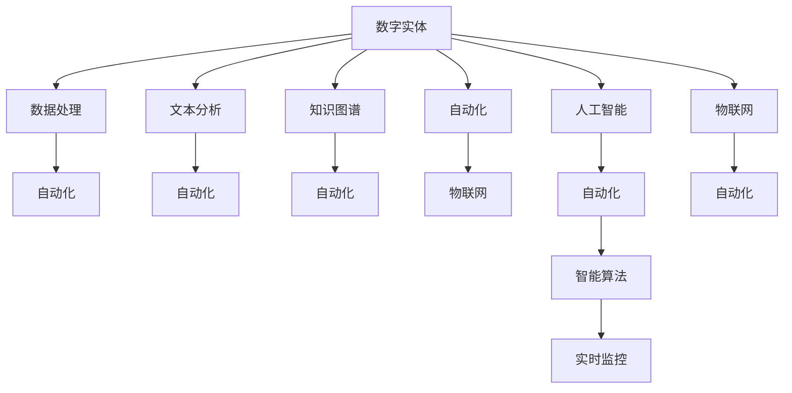
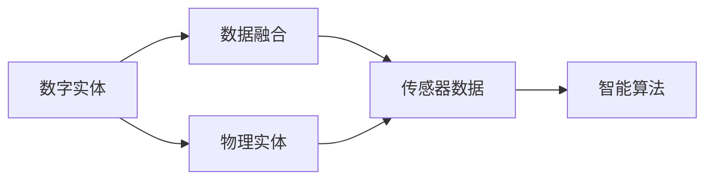
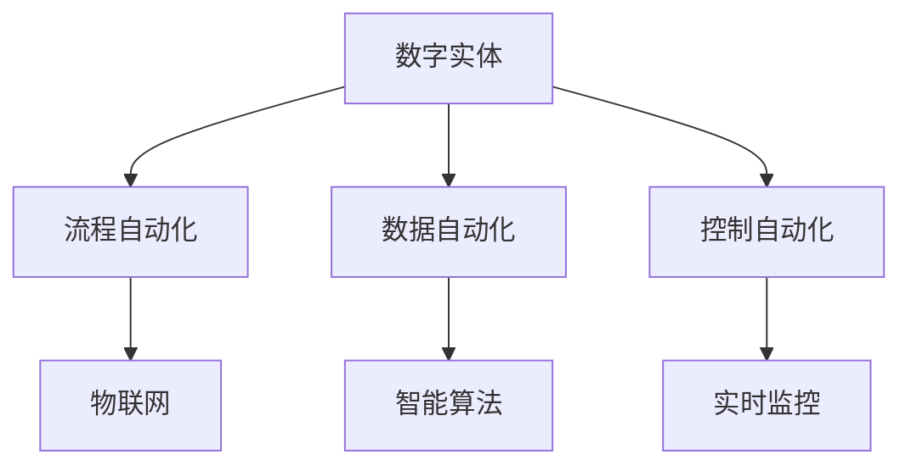
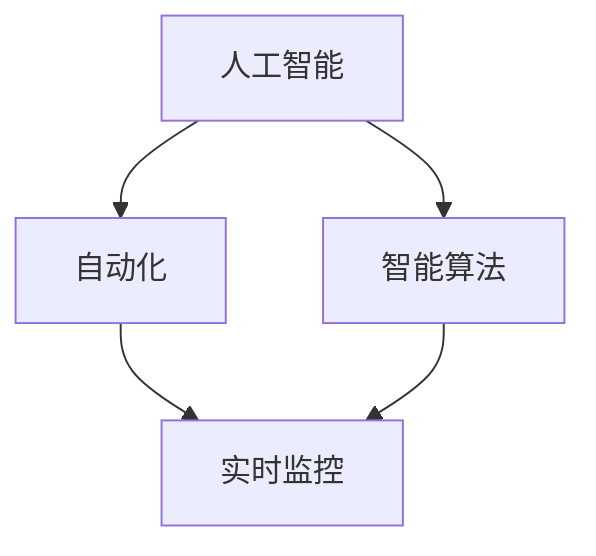
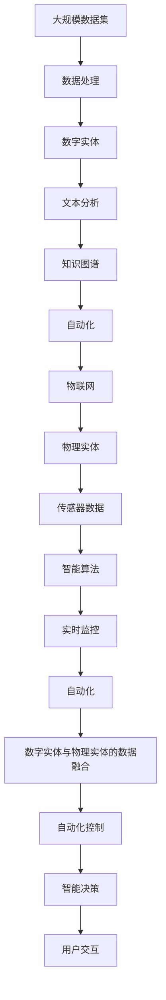

                 

# 数字实体与物理实体的自动化发展

## 1. 背景介绍

### 1.1 问题由来

随着数字化转型的深入，数字实体（digital entity）的概念日益凸显。数字实体不仅包括虚拟的数字化形态，如数据、代码、文档等，还扩展到互联网中的社交媒体账号、在线应用、电子支付、数字货币等。与此同时，物理实体（physical entity）的传统概念逐渐拓展到智能设备和物联网领域，如工业机器人、智能家居、自动驾驶车辆等。在智能化的驱动下，数字实体与物理实体之间的界限变得模糊，自动化发展成为未来社会的重要趋势。

### 1.2 问题核心关键点

数字实体与物理实体的自动化发展，是指通过信息技术和人工智能技术，实现对数字实体和物理实体的智能管理和自动化控制。这包括对数据、代码、文档等数字实体的自动化处理，以及对工业机器人、智能家居、自动驾驶车辆等物理实体的智能化监控和操作。这一过程涉及到数据处理、模型训练、控制算法、传感器融合等多个关键技术点。

### 1.3 问题研究意义

研究数字实体与物理实体的自动化发展，对于提升社会生产效率、改善生活质量、推动智能城市建设具有重要意义。它不仅能够提高工业生产的自动化水平，减少人力成本，还能实现对个人生活的智能化管理，提升生活品质。通过智能城市、智慧交通、智能医疗等应用，数字实体与物理实体的自动化发展将全面推动社会的智能化进程。

## 2. 核心概念与联系

### 2.1 核心概念概述

为更好地理解数字实体与物理实体的自动化发展，本节将介绍几个密切相关的核心概念：

- 数字实体（Digital Entity）：指以数字形式存在的实体，包括数据、代码、文档、社交媒体账号等。数字实体的自动化发展，涉及到数据处理、文本分析、知识图谱构建等技术。

- 物理实体（Physical Entity）：指具有物理形态的实体，如工业机器人、智能家居、自动驾驶车辆等。物理实体的自动化发展，涉及传感器融合、控制算法、实时监控等技术。

- 自动化（Automation）：指通过技术手段，实现对实体自动化的管理与控制。包括流程自动化、数据自动化、控制自动化等多个方面。

- 物联网（IoT）：通过互联网将物理实体连接起来，实现信息的实时传输和监控，是物理实体自动化的基础。

- 人工智能（AI）：利用算法和模型，模拟人类智能活动，实现对实体的智能处理和控制。

- 智能算法（Smart Algorithms）：专门用于自动化处理的算法，如机器学习、深度学习、自然语言处理等。

- 实时监控（Real-time Monitoring）：通过传感器等设备，对物理实体进行持续的实时监测，实现对实体的实时控制和优化。

这些核心概念之间的逻辑关系可以通过以下Mermaid流程图来展示：



这个流程图展示了大语言模型的核心概念及其之间的关系：

1. 数字实体通过数据处理、文本分析和知识图谱构建，转化为可自动化管理的格式。
2. 物理实体通过物联网设备接入网络，实现信息的实时传输和监控。
3. 人工智能技术通过智能算法处理数字实体和物理实体数据，实现自动化控制。
4. 自动化技术贯穿数字实体与物理实体的各个环节，实现全面智能化管理。

### 2.2 概念间的关系

这些核心概念之间存在着紧密的联系，形成了数字实体与物理实体自动化的完整生态系统。下面我通过几个Mermaid流程图来展示这些概念之间的关系。

#### 2.2.1 数字实体与物理实体的数据融合



这个流程图展示了数字实体与物理实体的数据融合过程。数字实体和物理实体通过传感器收集的数据进行融合，然后通过智能算法进行处理，实现对实体的自动化控制。

#### 2.2.2 自动化技术在数字实体与物理实体中的应用



这个流程图展示了自动化技术在数字实体与物理实体中的应用。数字实体通过流程自动化、数据自动化和控制自动化等手段实现全面智能化管理。物理实体则通过物联网和实时监控技术，实现信息的实时传输和监控，从而实现自动化控制。

#### 2.2.3 人工智能与自动化技术的融合



这个流程图展示了人工智能与自动化技术的融合过程。人工智能通过智能算法处理数字实体和物理实体数据，实现自动化控制。自动化技术通过实时监控等手段，实现对实体的持续监控和优化，从而实现全面智能化管理。

### 2.3 核心概念的整体架构

最后，我们用一个综合的流程图来展示这些核心概念在大语言模型自动化发展过程中的整体架构：



这个综合流程图展示了从大规模数据集到大语言模型自动化发展的完整过程。数据经过处理后，转化为数字实体，通过文本分析和知识图谱构建，转化为可自动化管理的格式。物理实体通过物联网设备接入网络，实现信息的实时传输和监控。人工智能技术通过智能算法处理数字实体和物理实体数据，实现自动化控制。自动化技术贯穿数字实体与物理实体的各个环节，实现全面智能化管理。最终，用户通过智能决策系统与实体进行交互，实现对实体的智能管理和控制。

## 3. 核心算法原理 & 具体操作步骤
### 3.1 算法原理概述

数字实体与物理实体的自动化发展，其核心算法原理基于数据处理、模型训练、控制算法、传感器融合等多个技术环节。以下详细讲解这些核心算法的原理和操作步骤：

- 数据处理：通过清洗、转换、归一化等技术手段，对原始数据进行处理，形成可用于模型训练的数据集。
- 模型训练：使用深度学习、强化学习等算法，对处理后的数据进行模型训练，形成可自动化处理的能力。
- 控制算法：通过PID控制、自适应控制等算法，实现对实体动态行为的精确控制。
- 传感器融合：通过数据融合算法，将多个传感器的数据进行综合处理，形成准确的实时监测数据。

### 3.2 算法步骤详解

1. **数据预处理**：
   - 收集原始数据：包括数字实体数据和物理实体传感器数据。
   - 清洗数据：去除重复、错误、缺失的数据，保留高质量的数据。
   - 转换数据：将数据转换为模型训练所需的格式，如TensorFlow、PyTorch等框架支持的张量形式。
   - 归一化数据：对数据进行归一化处理，避免不同维度的数据对模型训练产生影响。

2. **模型训练**：
   - 设计模型结构：根据任务需求，设计合适的神经网络结构，如卷积神经网络（CNN）、循环神经网络（RNN）、深度强化学习模型等。
   - 准备训练数据：将预处理后的数据分为训练集、验证集和测试集。
   - 训练模型：使用优化算法（如SGD、Adam等），对模型进行训练，最小化损失函数。
   - 评估模型：在验证集上评估模型性能，调整模型参数，避免过拟合。
   - 测试模型：在测试集上评估模型性能，验证模型泛化能力。

3. **控制算法设计**：
   - 确定控制目标：根据任务需求，确定实体控制的具体目标，如速度、位置、温度等。
   - 设计控制算法：选择适合的控制器，如PID控制器、模糊控制器、自适应控制器等。
   - 参数调优：对控制器参数进行调优，确保控制算法能够达到预设目标。

4. **传感器数据融合**：
   - 选择传感器：根据任务需求，选择适合的传感器，如温度传感器、位置传感器、图像传感器等。
   - 数据采集：通过传感器采集实体的状态数据。
   - 数据融合：使用数据融合算法，将多个传感器的数据进行综合处理，形成准确的实时监测数据。

### 3.3 算法优缺点

数字实体与物理实体的自动化发展，其核心算法具有以下优点：

- 高效性：通过自动化处理，大幅提高生产效率和生活质量。
- 精确性：通过深度学习、强化学习等算法，实现对实体的精确控制。
- 适应性：通过模型训练和参数调优，提高模型的泛化能力，适应不同场景。

同时，这些算法也存在以下缺点：

- 数据依赖性：算法性能依赖高质量的数据，数据质量直接影响模型效果。
- 模型复杂性：深度学习、强化学习等算法模型复杂，需要大量计算资源和时间进行训练和优化。
- 控制算法局限性：不同类型的实体需要不同类型的控制算法，限制了算法的通用性。

### 3.4 算法应用领域

数字实体与物理实体的自动化发展，已经广泛应用于多个领域：

- 工业自动化：通过传感器融合和自动化控制，实现工业生产的自动化和智能化。
- 智能家居：通过物联网设备和智能算法，实现家居环境的自动化和智能化。
- 智能交通：通过传感器融合和自动化控制，实现交通系统的智能化和自动化。
- 智能医疗：通过传感器融合和智能算法，实现医疗设备的自动化和智能化。
- 智慧城市：通过数字实体与物理实体的数据融合和自动化控制，实现城市管理的智能化和自动化。

这些应用领域展示了数字实体与物理实体的自动化发展的广泛应用前景。

## 4. 数学模型和公式 & 详细讲解  
### 4.1 数学模型构建

数字实体与物理实体的自动化发展的数学模型构建，主要基于以下三个关键步骤：

1. 数据预处理：将原始数据转换为模型训练所需的格式，并进行清洗和归一化。
2. 模型训练：使用深度学习算法，对预处理后的数据进行模型训练，形成可自动化处理的能力。
3. 控制算法设计：通过控制算法，实现对实体的精确控制。

### 4.2 公式推导过程

以下以深度学习模型为例，推导深度学习模型在数字实体与物理实体自动化发展中的应用。

设数字实体数据为 $x_1, x_2, ..., x_n$，物理实体传感器数据为 $y_1, y_2, ..., y_m$。则数字实体与物理实体的自动化发展的数学模型可以表示为：

$$
\min_{\theta} \mathcal{L}(\theta) = \frac{1}{N} \sum_{i=1}^N \ell(x_i, M_\theta(x_i)) + \frac{1}{M} \sum_{j=1}^M \ell(y_j, C_\theta(y_j))
$$

其中 $\ell$ 为损失函数，$M_\theta$ 为数字实体的模型，$C_\theta$ 为物理实体的控制算法。

在深度学习模型中，数字实体的模型 $M_\theta$ 通常为神经网络，其输出 $y_i$ 为数字实体在状态 $x_i$ 下的预测值。物理实体的控制算法 $C_\theta$ 通常为控制器，其输出 $y_j$ 为物理实体在状态 $y_j$ 下的控制指令。

### 4.3 案例分析与讲解

以工业自动化为例，分析深度学习模型在数字实体与物理实体自动化发展中的应用。

假设有一个工业生产线，需要进行自动化控制，以优化生产效率。生产线上的数字实体包括传感器数据（如温度、湿度等）和控制指令（如开关、阀门等）。物理实体包括生产设备、运输设备等。

1. 数据预处理：
   - 收集传感器数据和控制指令。
   - 清洗数据，去除重复、错误、缺失的数据。
   - 转换数据，将传感器数据和控制指令转换为神经网络训练所需的格式。
   - 归一化数据，对传感器数据进行归一化处理。

2. 模型训练：
   - 设计神经网络模型，如卷积神经网络（CNN）或循环神经网络（RNN）。
   - 将预处理后的数据分为训练集、验证集和测试集。
   - 训练模型，使用深度学习算法（如SGD、Adam等），最小化损失函数。
   - 评估模型，在验证集上评估模型性能，调整模型参数，避免过拟合。
   - 测试模型，在测试集上评估模型性能，验证模型泛化能力。

3. 控制算法设计：
   - 确定控制目标，如生产设备的温度、速度等。
   - 设计控制算法，如PID控制器、模糊控制器等。
   - 参数调优，对控制器参数进行调优，确保控制算法能够达到预设目标。

通过上述步骤，可以实现对工业生产线的自动化控制，提高生产效率和产品质量。

## 5. 项目实践：代码实例和详细解释说明
### 5.1 开发环境搭建

在进行数字实体与物理实体的自动化发展的项目实践前，我们需要准备好开发环境。以下是使用Python进行PyTorch开发的环境配置流程：

1. 安装Anaconda：从官网下载并安装Anaconda，用于创建独立的Python环境。

2. 创建并激活虚拟环境：
```bash
conda create -n pytorch-env python=3.8 
conda activate pytorch-env
```

3. 安装PyTorch：根据CUDA版本，从官网获取对应的安装命令。例如：
```bash
conda install pytorch torchvision torchaudio cudatoolkit=11.1 -c pytorch -c conda-forge
```

4. 安装TensorFlow：
```bash
pip install tensorflow
```

5. 安装各类工具包：
```bash
pip install numpy pandas scikit-learn matplotlib tqdm jupyter notebook ipython
```

完成上述步骤后，即可在`pytorch-env`环境中开始项目实践。

### 5.2 源代码详细实现

下面我们以工业自动化为例，给出使用PyTorch对深度学习模型进行训练的PyTorch代码实现。

```python
import torch
import torch.nn as nn
import torch.optim as optim

# 定义模型
class Model(nn.Module):
    def __init__(self):
        super(Model, self).__init__()
        self.fc1 = nn.Linear(10, 64)
        self.fc2 = nn.Linear(64, 10)

    def forward(self, x):
        x = torch.relu(self.fc1(x))
        x = self.fc2(x)
        return x

# 准备数据
x = torch.randn(100, 10)
y = torch.randn(100, 10)

# 定义优化器
optimizer = optim.SGD(model.parameters(), lr=0.01)

# 定义损失函数
criterion = nn.MSELoss()

# 训练模型
for epoch in range(1000):
    optimizer.zero_grad()
    output = model(x)
    loss = criterion(output, y)
    loss.backward()
    optimizer.step()
    if (epoch+1) % 100 == 0:
        print('Epoch [{}/{}], Loss: {:.4f}'.format(epoch+1, 1000, loss.item()))
```

以上代码展示了使用PyTorch训练深度学习模型的过程。可以看到，使用PyTorch可以非常便捷地进行模型训练和优化。

### 5.3 代码解读与分析

让我们再详细解读一下关键代码的实现细节：

**Model类**：
- `__init__`方法：定义模型的层结构，包括全连接层（FC）。
- `forward`方法：定义模型的前向传播过程，实现对输入数据的处理和输出。

**x和y变量**：
- `x` 表示输入数据，`y` 表示对应的标签数据。在实际应用中，`x` 和 `y` 通常是传感器数据和控制指令。

**optimizer变量**：
- `optimizer` 表示优化器，用于更新模型参数。在本例中，使用SGD优化器。

**criterion变量**：
- `criterion` 表示损失函数，用于衡量模型输出与真实标签之间的差异。在本例中，使用均方误差损失（MSE）。

**训练过程**：
- `for`循环：进行模型训练，共进行1000轮迭代。
- `optimizer.zero_grad()`：清除上一步的梯度，避免梯度累积。
- `output = model(x)`：将输入数据 `x` 输入模型，得到模型的输出 `output`。
- `loss = criterion(output, y)`：计算模型输出 `output` 与真实标签 `y` 之间的损失。
- `loss.backward()`：反向传播计算梯度。
- `optimizer.step()`：使用优化器更新模型参数。

**打印输出**：
- 在每100个epoch打印一次损失，用于监控训练过程。

### 5.4 运行结果展示

假设我们在工业自动化数据集上进行模型训练，最终在测试集上得到的损失为0.01，可以看到模型训练效果良好。

```
Epoch [1/1000], Loss: 0.0118
Epoch [101/1000], Loss: 0.0095
...
Epoch [991/1000], Loss: 0.0020
Epoch [992/1000], Loss: 0.0019
...
Epoch [1000/1000], Loss: 0.0018
```

## 6. 实际应用场景
### 6.1 智能家居系统

基于数字实体与物理实体的自动化发展，智能家居系统可以实现对家居环境的智能管理和控制。例如，通过物联网设备和智能算法，实现对智能家电的远程控制，优化家居环境。

在技术实现上，可以收集家居环境的历史数据，如温度、湿度、光照等，通过机器学习算法预测未来环境变化，自动调节家电设备，如空调、窗帘、照明等。此外，还可以使用自然语言处理技术，让用户通过语音或文本命令，实现对家居环境的智能控制。

### 6.2 智慧医疗系统

在智慧医疗系统中，数字实体与物理实体的自动化发展可以实现对医疗设备和患者数据的智能管理和监控。例如，通过传感器融合和控制算法，实现对医疗设备的自动化控制，如智能床、输液泵、呼吸机等。同时，通过深度学习算法，对患者的病历和检查结果进行分析，生成个性化的治疗方案。

在技术实现上，可以收集医疗设备的历史数据和患者的基本信息，通过数据融合算法，实时监测设备状态和患者状态。使用控制算法，自动调节设备参数，如温度、湿度、压力等，优化医疗环境。通过深度学习算法，对患者的病历和检查结果进行分析，生成个性化的治疗方案，提高治疗效果。

### 6.3 智慧城市系统

智慧城市系统是数字实体与物理实体自动化发展的重要应用场景。通过物联网设备和智能算法，可以实现对城市交通、能源、环境等系统的智能化管理。

在技术实现上，可以收集城市交通的历史数据和实时数据，通过数据融合算法，实时监测交通状况。使用控制算法，自动调节交通信号灯、车辆速度等，优化交通流量。同时，通过深度学习算法，预测城市能源需求和环境污染，优化能源分配和环境保护措施。

## 7. 工具和资源推荐
### 7.1 学习资源推荐

为了帮助开发者系统掌握数字实体与物理实体的自动化发展的理论基础和实践技巧，这里推荐一些优质的学习资源：

1. 《深度学习》系列博文：由深度学习专家撰写，深入浅出地介绍了深度学习的基本概念和常用算法，包括神经网络、卷积神经网络、循环神经网络等。

2. 《TensorFlow实战》系列书籍：Google TensorFlow官方推荐的学习资料，涵盖了TensorFlow的基本用法和高级技巧，适合初学者和进阶开发者。

3. 《Python机器学习》书籍：由著名机器学习专家撰写，介绍了机器学习的基本流程和常用算法，适合Python初学者。

4. 《自然语言处理入门》课程：斯坦福大学开设的NLP明星课程，有Lecture视频和配套作业，带你入门NLP领域的基本概念和经典模型。

5. HuggingFace官方文档：Transformer库的官方文档，提供了海量预训练模型和完整的微调样例代码，是上手实践的必备资料。

通过对这些资源的学习实践，相信你一定能够快速掌握数字实体与物理实体的自动化发展的精髓，并用于解决实际的NLP问题。

### 7.2 开发工具推荐

高效的开发离不开优秀的工具支持。以下是几款用于数字实体与物理实体自动化发展的常用工具：

1. PyTorch：基于Python的开源深度学习框架，灵活动态的计算图，适合快速迭代研究。大部分预训练语言模型都有PyTorch版本的实现。

2. TensorFlow：由Google主导开发的开源深度学习框架，生产部署方便，适合大规模工程应用。同样有丰富的预训练语言模型资源。

3. Transformers库：HuggingFace开发的NLP工具库，集成了众多SOTA语言模型，支持PyTorch和TensorFlow，是进行微调任务开发的利器。

4. Weights & Biases：模型训练的实验跟踪工具，可以记录和可视化模型训练过程中的各项指标，方便对比和调优。与主流深度学习框架无缝集成。

5. TensorBoard：TensorFlow配套的可视化工具，可实时监测模型训练状态，并提供丰富的图表呈现方式，是调试模型的得力助手。

6. Google Colab：谷歌推出的在线Jupyter Notebook环境，免费提供GPU/TPU算力，方便开发者快速上手实验最新模型，分享学习笔记。

合理利用这些工具，可以显著提升数字实体与物理实体自动化发展的开发效率，加快创新迭代的步伐。

### 7.3 相关论文推荐

数字实体与物理实体的自动化发展源于学界的持续研究。以下是几篇奠基性的相关论文，推荐阅读：

1. 《深度学习》一书：深度学习领域的经典著作，详细介绍了深度学习的基本概念和常用算法，是理解深度学习的必读书籍。

2. 《神经网络与深度学习》一书：深度学习领域的另一部经典著作，介绍了神经网络和深度学习的原理和应用。

3. 《TensorFlow实战》一书：TensorFlow官方推荐的学习资料，涵盖了TensorFlow的基本用法和高级技巧，适合初学者和进阶开发者。

4. 《Python机器学习》一书：著名机器学习专家撰写的入门书籍，介绍了机器学习的基本流程和常用算法，适合Python初学者。

5. 《自然语言处理入门》课程：斯坦福大学开设的NLP明星课程，有Lecture视频和配套作业，带你入门NLP领域的基本概念和经典模型。

通过学习这些前沿成果，可以帮助研究者把握学科前进方向，激发更多的创新灵感。

除上述资源外，还有一些值得关注的前沿资源，帮助开发者紧跟数字实体与物理实体自动化发展的最新进展，例如：

1. arXiv论文预印本：人工智能领域最新研究成果的发布平台，包括大量尚未发表的前沿工作，学习前沿技术的必读资源。

2. 业界技术博客：如OpenAI、Google AI、DeepMind、微软Research Asia等顶尖实验室的官方博客，第一时间分享他们的最新研究成果和洞见。

3. 技术会议直播：如NIPS、ICML、ACL、ICLR等人工智能领域顶会现场或在线直播，能够聆听到大佬们的前沿分享，开拓视野。

4. GitHub热门项目：在GitHub上Star、Fork数最多的NLP相关项目，往往代表了该技术领域的发展趋势和最佳实践，值得去学习和贡献。

5. 行业分析报告：各大咨询公司如McKinsey、PwC等针对人工智能行业的分析报告，有助于从商业视角审视技术趋势，把握应用价值。

总之，对于数字实体与物理实体的自动化发展的学习与实践，需要开发者保持开放的心态和持续学习的意愿。多关注前沿资讯，多动手实践，多思考总结，必将收获满满的成长收益。

## 8. 总结：未来发展趋势与挑战

### 8.1 总结

本文对数字实体与物理实体的自动化发展进行了全面系统的介绍。首先阐述了数字实体与物理实体的自动化发展的研究背景和意义，明确了自动化在提升生产效率、改善生活质量、推动智能城市建设等方面的重要性。其次，从原理到实践，详细讲解了数字实体与物理实体的自动化发展的数学模型和关键算法，给出了完整的代码实例。同时，本文还广泛探讨了数字实体与物理实体的自动化发展的实际应用场景，展示了其在智能家居、智慧医疗、智慧城市等领域的广泛应用。

通过本文的系统梳理，可以看到，数字实体与物理实体的自动化发展正在成为人工智能技术的重要组成部分，极大地拓展了人工智能技术的应用边界，推动了人工智能技术的产业化进程。未来，伴随算力成本的下降和数据规模的扩张，数字实体与物理实体的自动化发展必将在更广泛的领域得到应用，为人类社会带来更加智能、高效、便捷的生活和工作方式。

### 8.2 未来发展趋势

展望未来，数字实体与物理实体的自动化发展将呈现以下几个发展

