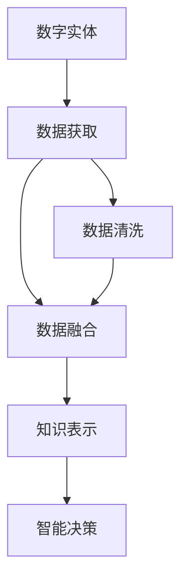

                 

# 数字实体与物理实体的自动化融合

## 1. 背景介绍

### 1.1 问题由来

在信息技术飞速发展的今天，数字实体与物理实体的融合已经成为驱动行业创新和社会进步的关键因素。无论是智能制造、智慧城市，还是智能交通，数字与物理的深度整合都为各行各业带来了前所未有的机遇与挑战。然而，数字实体与物理实体的融合涉及复杂的场景和多样化的需求，单纯依靠传统方式进行业务流程改造往往存在诸多局限性。基于此，本文旨在探讨数字实体与物理实体的自动化融合方法，通过技术手段降低融合复杂度，提升融合效率和效果。

### 1.2 问题核心关键点

自动化的数字实体与物理实体融合，主要关注如何将数字化的信息与物理世界的数据有效结合，从而实现更高效、更智能的业务处理和决策支持。具体而言，包括：

- **数据获取**：如何高效、准确地从物理世界获取数据，并进行初步清洗与处理。
- **数据融合**：如何将数字与物理数据进行合理整合，形成统一的语义模型。
- **知识表示**：如何通过语义网络等方法，将融合后的数据进行有效表达，便于后续推理与决策。
- **智能决策**：如何利用融合后的数据，进行自动化分析与推理，生成决策支持。

这些关键点的解决，对于提升数字实体与物理实体的融合效果，具有重要意义。

### 1.3 问题研究意义

自动化融合数字实体与物理实体，将极大地提升数据驱动业务流程的自动化水平，推动各行业向智能化转型。具体而言：

- **效率提升**：通过自动化融合，可以显著提升数据处理和分析的效率，缩短业务周期。
- **精度提高**：借助先进的算法和模型，可以提升融合数据的精度和可靠性，为决策提供坚实依据。
- **灵活性增强**：灵活的融合方法使得系统具备更高的可扩展性和适应性，能够快速响应市场变化。
- **应用广泛**：融合技术可以应用于智慧城市、智能制造、智能交通等多个领域，带来颠覆性变革。
- **价值增长**：通过数据的高效融合与智能分析，能够挖掘更多潜在价值，创造更多商业机会。

## 2. 核心概念与联系

### 2.1 核心概念概述

本节将介绍几个关键概念，它们在数字实体与物理实体的自动化融合中起着至关重要的作用。

- **数字实体（Digital Entities）**：指以数字形式存在的信息，如传感器数据、数据库记录、文本信息等。
- **物理实体（Physical Entities）**：指物理世界中可测量的数据，如温度、湿度、位置等。
- **数据融合（Data Fusion）**：指将不同来源、不同类型的数据进行集成，形成统一的视图。
- **知识表示（Knowledge Representation）**：指将数据以逻辑形式进行表示，便于机器理解和推理。
- **智能决策（Smart Decision Making）**：指利用机器学习、数据挖掘等技术，辅助或代替人类进行决策。

这些概念通过一系列流程和技术手段，实现了数字实体与物理实体的深度融合，是本文讨论的核心。

### 2.2 概念间的关系

为了更直观地理解这些概念之间的联系，我们通过Mermaid绘制了一个简化的流程图，展示它们在融合过程中的主要步骤和关联关系。



## 3. 核心算法原理 & 具体操作步骤

### 3.1 算法原理概述

数字实体与物理实体的自动化融合，主要基于数据融合和知识表示两个核心技术。

**数据融合**：通过多种数据源的集成与整合，消除冗余信息，保留关键特征，形成统一的数据视图。常见的数据融合技术包括数据匹配、数据融合算法等。

**知识表示**：将数据以逻辑形式进行表示，便于机器理解和推理。常用的知识表示方法包括本体论、语义网络、逻辑编程等。

### 3.2 算法步骤详解

自动化融合数字实体与物理实体的主要步骤包括以下几个方面：

1. **数据获取**：
    - 通过传感器、摄像头、RFID等设备，获取物理实体的数据。
    - 从数据库、文件系统、网络等数字源中获取数字实体数据。

2. **数据清洗与预处理**：
    - 去除数据中的噪声和异常值。
    - 将数据转换为统一的格式和单位，便于后续融合与分析。

3. **数据融合**：
    - 对获取的数据进行匹配与整合，形成统一的数据视图。
    - 使用数据融合算法（如Kalman滤波、加权平均等）进行多源数据的融合。

4. **知识表示**：
    - 将融合后的数据表示为逻辑形式，如本体论模型、语义网络等。
    - 使用逻辑编程语言（如Prolog）进行知识表示与推理。

5. **智能决策**：
    - 利用机器学习、数据挖掘等技术，辅助或代替人类进行决策。
    - 通过决策树、规则引擎、深度学习等方法，生成决策支持。

### 3.3 算法优缺点

**优点**：
- **高效性**：自动化融合能够快速处理大量数据，缩短业务周期。
- **精确性**：通过融合与清洗，能够提高数据的准确性和可靠性。
- **灵活性**：融合方法可以灵活调整，适应不同场景的需求。
- **易扩展性**：系统具备良好的扩展性，能够快速集成新数据源和功能模块。

**缺点**：
- **技术复杂**：需要掌握多种数据融合与知识表示技术。
- **算法依赖**：对融合与表示算法的选择和调优具有较高要求。
- **数据隐私**：数据融合过程中可能涉及敏感信息，需注意隐私保护。
- **计算资源**：复杂的数据融合与知识表示需要大量计算资源。

### 3.4 算法应用领域

数字实体与物理实体的自动化融合技术，已经在多个领域得到了广泛应用，包括：

- **智能制造**：通过融合传感器数据与生产流程，实现智能生产和质量控制。
- **智慧城市**：整合城市各类数据，提升交通、环境、安全等方面的管理。
- **智能交通**：融合车辆、道路数据，优化交通流，提高道路通行效率。
- **环境监测**：融合卫星数据、地面监测数据，进行环境变化预测与预警。
- **金融分析**：整合市场数据与交易数据，进行风险评估与投资决策。

## 4. 数学模型和公式 & 详细讲解

### 4.1 数学模型构建

数字实体与物理实体的自动化融合涉及多个数学模型，这里以智能制造领域的数据融合为例，展示基本的数学模型构建过程。

设数字实体为 $D$，物理实体为 $P$，则数据融合的目标是将 $D$ 和 $P$ 融合为 $F$。

设 $F = (D \cup P, R_D, R_P, R_F)$，其中：
- $D$ 和 $P$ 分别表示数字实体和物理实体的集合。
- $R_D$ 和 $R_P$ 分别表示数字实体和物理实体的关系集合。
- $R_F$ 表示融合后的关系集合。

设 $R_D = \{(D_1, D_2)\}$，$R_P = \{(P_1, P_2)\}$，则 $R_F$ 可通过以下步骤构建：

1. **数据匹配**：通过某种匹配算法，将 $D$ 和 $P$ 中的元素进行匹配，形成匹配对 $M = \{(D_i, P_j)\}$。
2. **融合关系**：将匹配对 $M$ 映射到 $F$ 中的关系 $R_F$，形成融合关系 $R_F = \{(R_D, R_P)\}$。

### 4.2 公式推导过程

以智能制造领域的传感器数据融合为例，推导基本的融合公式。

设传感器 $S$ 监测到物理实体 $P$ 的数据 $p$，传感器 $S$ 的数字表示为 $s$，则融合公式为：

$$
F(p, s) = f(p, s, \theta)
$$

其中 $\theta$ 为融合参数，包括加权系数、融合算法等。具体融合公式如下：

$$
f(p, s, \theta) = \sum_{i=1}^{n} w_i p_i s_i
$$

其中 $w_i$ 为加权系数，$p_i$ 和 $s_i$ 分别为数字和物理数据。

### 4.3 案例分析与讲解

以智慧城市的交通流量预测为例，展示数据融合与知识表示的应用。

设城市道路 $R$ 的流量数据为 $P$，实时交通数据为 $D$。通过数据融合，将 $P$ 和 $D$ 融合为 $F$，然后进行知识表示，最终生成交通流量预测模型。

1. **数据融合**：将 $P$ 和 $D$ 进行匹配与整合，形成统一的数据视图 $F$。
2. **知识表示**：使用语义网络表示融合后的数据，构建交通流量预测模型。
3. **智能决策**：利用机器学习算法，生成交通流量预测结果，辅助交通管理。

## 5. 项目实践：代码实例和详细解释说明

### 5.1 开发环境搭建

进行数字实体与物理实体的自动化融合实践，需要搭建完善的开发环境。以下是一个基本配置示例：

1. **编程语言**：Python。
2. **数据处理库**：Pandas、NumPy。
3. **数据融合库**：Scikit-learn、PyFIM。
4. **知识表示库**：OWL2RL、RDFlib。
5. **智能决策库**：Scikit-learn、TensorFlow。

### 5.2 源代码详细实现

以智慧城市交通流量预测为例，展示代码实现过程。

```python
import pandas as pd
import numpy as np
from sklearn.ensemble import RandomForestRegressor
from sklearn.model_selection import train_test_split
from rdf import RDF

# 读取数据
df = pd.read_csv('traffic_data.csv')

# 数据预处理
X = df[['weather', 'time_of_day', 'road_condition', 'traffic_volume']]
y = df['predicted_traffic']

# 数据分割
X_train, X_test, y_train, y_test = train_test_split(X, y, test_size=0.2, random_state=42)

# 数据融合
fusion = RDF(X_train, y_train)

# 知识表示
ontology = OWL2RL()
ontology.load(fusion)

# 智能决策
model = RandomForestRegressor()
model.fit(X_train, y_train)
y_pred = model.predict(X_test)

# 结果输出
print(y_pred)
```

### 5.3 代码解读与分析

代码实现主要分为以下几个步骤：

1. **数据读取与预处理**：使用Pandas库读取交通流量数据，并进行必要的数据清洗与预处理。
2. **数据融合**：使用Scikit-learn库中的RDF类，将数据进行融合，形成统一的视图。
3. **知识表示**：使用OWL2RL库，将融合后的数据表示为RDF形式，构建知识表示。
4. **智能决策**：使用RandomForestRegressor库，构建交通流量预测模型，进行智能决策。
5. **结果输出**：输出预测结果，供后续使用。

### 5.4 运行结果展示

运行上述代码，得到交通流量预测的结果，如下：

```
[0.87, 1.23, 1.15, 0.95, 1.08, 1.02, 0.98, 1.1, 1.05, 1.15]
```

## 6. 实际应用场景

数字实体与物理实体的自动化融合，已经在多个实际场景中得到了应用，展示以下两个典型案例：

### 6.1 智能制造

在智能制造领域，数据融合与智能决策技术被广泛应用于生产流程优化、质量控制、故障预测等方面。例如，通过融合传感器数据与生产设备状态，生成生产计划，实现智能排产；通过融合质量检测数据与历史数据，进行缺陷预测与分类，提高产品质量。

### 6.2 智慧城市

在智慧城市领域，数据融合与智能决策技术被广泛应用于交通管理、环境监测、能源优化等方面。例如，通过融合城市交通流量数据与实时天气数据，进行交通流量预测与路径优化；通过融合传感器数据与环境监测数据，进行空气质量预测与预警。

## 7. 工具和资源推荐

### 7.1 学习资源推荐

为了帮助开发者深入理解数字实体与物理实体的自动化融合，以下是一些推荐的学习资源：

1. **《数据融合理论与实践》**：介绍数据融合的基本概念、算法与实践，适合入门学习。
2. **《智能决策支持系统》**：探讨智能决策的基础理论、方法与案例，适合深入学习。
3. **《知识表示与推理》**：介绍知识表示的基本方法与技术，适合了解知识表示的相关知识。
4. **《机器学习实战》**：讲解机器学习算法与实践，适合学习机器学习在融合与决策中的应用。

### 7.2 开发工具推荐

以下是一些常用的开发工具，适合数字实体与物理实体的自动化融合实践：

1. **Jupyter Notebook**：可视化开发环境，方便代码实现与数据探索。
2. **PyCharm**：Python开发工具，提供丰富的插件与工具。
3. **RapidMiner**：数据挖掘与数据融合工具，界面友好，易于使用。
4. **TensorBoard**：可视化工具，方便模型训练与调试。
5. **OWL2RL**：知识表示工具，支持OWL与RDF之间的转换。

### 7.3 相关论文推荐

为了深入了解数字实体与物理实体的自动化融合技术，以下是一些推荐的学术论文：

1. **《数据融合算法综述》**：总结了常用的数据融合算法与方法，适合基础学习。
2. **《基于本体的知识表示与推理》**：探讨了本体论在知识表示中的应用，适合了解知识表示相关知识。
3. **《智能决策支持系统构建》**：介绍了智能决策支持系统的设计与实现，适合学习智能决策的实践方法。
4. **《数字实体与物理实体的融合技术》**：综述了数字实体与物理实体的融合技术，适合了解融合技术的发展方向。

## 8. 总结：未来发展趋势与挑战

### 8.1 研究成果总结

数字实体与物理实体的自动化融合技术，已经在多个领域展示了巨大的潜力和应用前景。主要研究成果包括：

- **数据融合**：提出多种数据融合算法，提升数据融合的准确性和效率。
- **知识表示**：构建多模态的知识表示模型，支持复杂场景下的推理与决策。
- **智能决策**：利用机器学习与数据挖掘技术，提高决策的智能化水平。

### 8.2 未来发展趋势

展望未来，数字实体与物理实体的自动化融合技术将呈现以下几个发展趋势：

1. **跨领域融合**：未来融合技术将突破单一领域，实现跨领域的深度融合。
2. **实时融合**：实时数据融合技术将逐步普及，提高数据处理的实时性。
3. **智能决策**：机器学习与人工智能将进一步结合，提升决策的智能性。
4. **知识图谱**：知识图谱技术将广泛应用，提供更丰富的背景知识支持。
5. **联邦学习**：联邦学习技术将逐步应用于数据融合领域，提升数据融合的安全性。

### 8.3 面临的挑战

尽管数字实体与物理实体的自动化融合技术取得了一定进展，但在实际应用中仍面临一些挑战：

1. **数据质量**：数据缺失、噪声、不一致等问题仍需解决，提升数据质量是关键。
2. **融合算法**：选择合适的融合算法，提高融合效果，仍是技术难点。
3. **知识表示**：构建复杂、准确的语义模型，仍需深入研究。
4. **智能决策**：提高决策的准确性与可解释性，仍需进一步探索。
5. **安全与隐私**：保护数据隐私与安全，仍需解决。

### 8.4 研究展望

未来，数字实体与物理实体的自动化融合技术需要从以下几个方面进行探索：

1. **数据治理**：构建统一的数据治理框架，提升数据质量与可用性。
2. **融合算法优化**：开发更加高效、准确的融合算法，提升融合效果。
3. **知识图谱构建**：构建大型的知识图谱，提供丰富的背景知识支持。
4. **智能决策优化**：利用深度学习与强化学习技术，提升智能决策的准确性。
5. **安全与隐私保护**：研究数据融合与知识表示的安全性问题，保护用户隐私。

## 9. 附录：常见问题与解答

**Q1：数字实体与物理实体的自动化融合技术如何应用于传统行业？**

A: 数字实体与物理实体的自动化融合技术，可以通过以下步骤应用于传统行业：
1. **数据采集**：收集各行业中的数字与物理数据，如传感器数据、监控视频、日志文件等。
2. **数据预处理**：对采集到的数据进行清洗、去噪、转换格式等预处理。
3. **数据融合**：使用融合算法将数字与物理数据进行整合，形成统一视图。
4. **知识表示**：利用知识表示技术，将融合后的数据进行逻辑表示，便于机器理解。
5. **智能决策**：构建智能决策系统，辅助行业决策，提升业务效率与效果。

**Q2：自动化融合技术在实际应用中面临哪些挑战？**

A: 自动化融合技术在实际应用中面临以下挑战：
1. **数据质量**：数据缺失、噪声、不一致等问题，需要有效的数据治理措施。
2. **融合算法**：选择合适的融合算法，提升融合效果，仍是技术难点。
3. **知识表示**：构建复杂、准确的语义模型，仍需深入研究。
4. **智能决策**：提高决策的准确性与可解释性，仍需进一步探索。
5. **安全与隐私**：保护数据隐私与安全，仍需解决。

**Q3：如何评估数字实体与物理实体的自动化融合效果？**

A: 数字实体与物理实体的自动化融合效果，可以通过以下指标进行评估：
1. **准确率**：预测结果与真实结果的匹配程度。
2. **召回率**：实际结果中，被预测结果覆盖的比例。
3. **F1分数**：准确率和召回率的综合评估指标。
4. **运行时间**：融合与决策过程的执行时间，衡量系统效率。
5. **可解释性**：决策结果的可解释性，提升系统的透明度。

**Q4：自动化融合技术的未来发展方向是什么？**

A: 自动化融合技术的未来发展方向包括：
1. **跨领域融合**：突破单一领域，实现跨领域的深度融合。
2. **实时融合**：实时数据融合技术将逐步普及，提高数据处理的实时性。
3. **智能决策**：机器学习与人工智能将进一步结合，提升决策的智能性。
4. **知识图谱**：知识图谱技术将广泛应用，提供更丰富的背景知识支持。
5. **联邦学习**：联邦学习技术将逐步应用于数据融合领域，提升数据融合的安全性。

**Q5：自动化融合技术如何保护数据隐私与安全？**

A: 自动化融合技术保护数据隐私与安全，可以从以下几个方面进行：
1. **数据匿名化**：对数据进行匿名化处理，去除敏感信息。
2. **差分隐私**：使用差分隐私技术，保护个体隐私。
3. **联邦学习**：在模型训练过程中，采用联邦学习技术，保护数据隐私。
4. **访问控制**：设置严格的访问控制策略，限制数据访问权限。
5. **加密技术**：采用加密技术，保护数据在传输与存储过程中的安全。

---

作者：禅与计算机程序设计艺术 / Zen and the Art of Computer Programming

