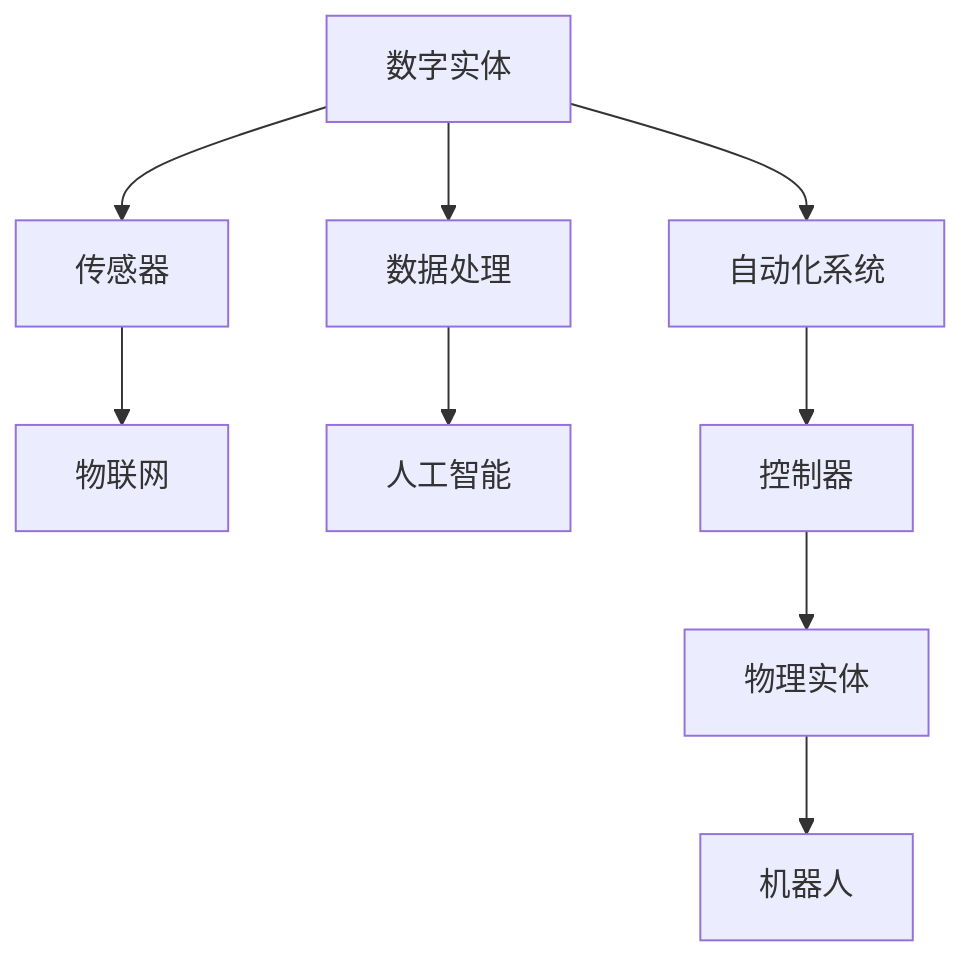
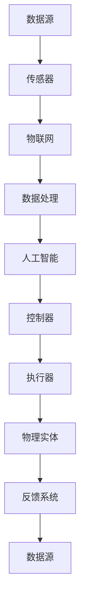
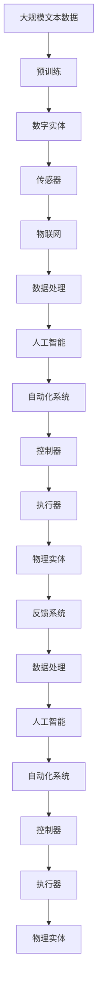

                 

# 数字实体与物理实体的自动化进展

## 1. 背景介绍

### 1.1 问题由来
在当今数字化时代，数字实体（Digital Entities）与物理实体（Physical Entities）的界限日益模糊。数字实体指的是数据和软件，物理实体则包括硬件、传感器、机器人等。自动化技术的发展使得数字实体和物理实体能够进行深度交互，共同完成复杂的任务，从而推动了制造业、物流、智慧城市等领域的发展。

### 1.2 问题核心关键点
自动化技术在数字实体与物理实体间架起了桥梁，使得这两者能够协同工作。自动化技术的核心关键点包括：

- **传感器与物联网（IoT）**：收集物理实体的状态信息，并将其转化为数字形式。
- **数据处理与分析**：对收集到的数据进行处理和分析，提取有用信息。
- **机器学习与AI**：通过机器学习和人工智能技术，使数字实体能够自我学习和适应。
- **控制系统**：基于处理和分析的结果，对物理实体进行控制和调整。

这些技术要素共同构成了自动化技术的核心，使得数字实体与物理实体能够无缝交互，协同完成任务。

### 1.3 问题研究意义
自动化技术的发展对各行各业产生了深远影响。例如：

- **制造业**：通过自动化，制造业可以实现智能制造，提高生产效率和质量，减少人为错误。
- **物流**：自动化技术使物流系统更加高效、精确，降低了人力成本，提高了物流效率。
- **智慧城市**：通过智能交通、智慧能源等自动化技术，提升城市运行效率和管理水平。

此外，自动化技术还推动了农业自动化、医疗自动化、教育自动化等领域的进步，为经济社会发展注入了新的动力。

## 2. 核心概念与联系

### 2.1 核心概念概述

为更好地理解数字实体与物理实体的自动化技术，本节将介绍几个密切相关的核心概念：

- **数字实体（Digital Entities）**：指数据、软件等可以被数字化的信息。
- **物理实体（Physical Entities）**：指硬件、传感器、机器人等可被物理感知的物体。
- **物联网（IoT）**：指通过传感器、通信技术将物理实体连接到互联网，实现数据共享和信息交互。
- **自动化系统（Automation System）**：指利用传感器、控制器、软件等组件实现物理实体与数字实体自动交互的系统。
- **人工智能（AI）**：指通过机器学习和深度学习技术，使数字实体具备自主学习、推理、决策等能力。
- **机器学习（Machine Learning）**：指让计算机通过学习数据，自动改进算法和模型。

这些核心概念之间的逻辑关系可以通过以下Mermaid流程图来展示：



这个流程图展示了数字实体与物理实体之间的联系和交互过程。数字实体通过传感器转化为物理信号，通过物联网进行数据传输，最终被控制器处理和应用。物理实体通过机器学习和人工智能技术，实现了对数字实体的智能控制和优化。

### 2.2 概念间的关系

这些核心概念之间存在着紧密的联系，形成了数字实体与物理实体的自动化系统的完整生态系统。下面我们通过几个Mermaid流程图来展示这些概念之间的关系。

#### 2.2.1 数字实体与物理实体的交互


这个流程图展示了数字实体与物理实体之间的交互过程。数字实体通过传感器采集物理实体的数据，通过物联网传输到数据处理和人工智能系统中进行处理和分析，最终由控制器对物理实体进行控制。

#### 2.2.2 自动化系统架构



这个流程图展示了自动化系统的整体架构。数据源通过传感器采集物理实体的数据，通过物联网传输到数据处理和人工智能系统中进行处理和分析，最终由控制器对执行器进行控制，物理实体通过反馈系统将结果反馈给数据源，形成闭环控制。

#### 2.2.3 人工智能在自动化中的应用


这个流程图展示了人工智能在自动化系统中的应用。物理实体通过传感器采集数据，通过物联网传输到数据处理和人工智能系统中进行处理和分析，最终由控制器对执行器进行控制，实现智能决策和优化。

### 2.3 核心概念的整体架构

最后，我们用一个综合的流程图来展示这些核心概念在大规模自动化系统中的应用：



这个综合流程图展示了从数据预训练到大规模自动化系统的完整过程。数字实体通过传感器采集物理实体的数据，通过物联网传输到数据处理和人工智能系统中进行处理和分析，最终由控制器对执行器进行控制，物理实体通过反馈系统将结果反馈给数据处理和人工智能系统，形成闭环控制。

## 3. 核心算法原理 & 具体操作步骤
### 3.1 算法原理概述

数字实体与物理实体的自动化系统主要依赖于机器学习与深度学习算法。其核心原理是通过传感器收集物理实体的状态信息，通过物联网传输数据，对数据进行处理和分析，提取有用信息，然后通过人工智能算法进行学习和推理，最终控制物理实体完成特定任务。

### 3.2 算法步骤详解

1. **数据采集**：通过传感器采集物理实体的状态信息，并将其转化为数字信号。这一步是自动化系统的基础。

2. **数据传输**：将采集到的数字信号通过物联网设备传输到数据处理系统。数据传输过程需要确保数据的准确性和实时性。

3. **数据处理**：对传输过来的数据进行处理和清洗，去除噪声和异常值，提取有用的特征。数据处理过程需要高效的算法和数据结构支持。

4. **模型训练**：基于处理后的数据，使用机器学习和深度学习算法进行模型训练。模型训练过程中需要考虑过拟合、欠拟合等问题，使用合适的损失函数和优化算法。

5. **模型应用**：将训练好的模型应用于实际场景，进行实时决策和控制。模型应用过程需要考虑模型的资源占用和推理效率。

6. **反馈调整**：根据实际应用效果，不断调整和优化模型参数和算法，实现自适应学习。

### 3.3 算法优缺点

基于数字实体与物理实体的自动化系统具有以下优点：

- **高效率**：自动化系统能够实现24小时不间断工作，大幅提高生产效率。
- **高精度**：通过机器学习和深度学习技术，自动化系统能够实现高精度的决策和控制。
- **灵活性**：自动化系统可以根据实际情况进行动态调整和优化。

同时，这些系统也存在一些缺点：

- **初始投资高**：自动化系统的搭建和部署需要较高的初始投资。
- **维护复杂**：自动化系统的维护和调试需要专业知识和技术支持。
- **数据隐私**：自动化系统需要对采集的数据进行严格管理和保护，防止数据泄露和滥用。

### 3.4 算法应用领域

数字实体与物理实体的自动化系统已经在多个领域得到了广泛应用，例如：

- **制造业**：通过智能制造、质量控制等自动化技术，提高生产效率和质量。
- **物流**：通过智能仓储、智能配送等自动化技术，提升物流效率和准确性。
- **智慧城市**：通过智能交通、智能能源等自动化技术，提升城市运行效率和管理水平。
- **医疗**：通过智能诊断、智能护理等自动化技术，提高医疗服务质量和效率。
- **农业**：通过智能农业、精准种植等自动化技术，提高农业生产效率和质量。

这些领域的应用展示了数字实体与物理实体自动化技术的重要价值，为各行各业带来了巨大的经济和社会效益。

## 4. 数学模型和公式 & 详细讲解  
### 4.1 数学模型构建

本节将使用数学语言对数字实体与物理实体的自动化系统进行更加严格的刻画。

假设数字实体为 $D$，物理实体为 $P$。数字实体与物理实体的交互可以通过以下数学模型来描述：

$$
P(t) = f(D(t))
$$

其中，$f$ 表示数字实体对物理实体的控制函数，$D(t)$ 表示数字实体在时间 $t$ 的状态，$P(t)$ 表示物理实体在时间 $t$ 的状态。

在实践中，数字实体 $D(t)$ 通常由传感器采集物理实体 $P(t)$ 的状态信息，然后通过物联网传输到数据处理系统进行处理和分析，最终使用人工智能算法进行学习和推理。

### 4.2 公式推导过程

以下我们以智能制造为例，推导数字实体对物理实体的控制函数 $f$。

假设数字实体 $D$ 需要控制物理实体 $P$ 的温度 $T$。数字实体 $D$ 的控制策略可以是：

- 基于历史数据的线性回归模型
- 基于特征工程的手工规则
- 基于机器学习的预测模型

其中，基于机器学习的预测模型通常使用深度学习算法进行训练，例如：

$$
f(D(t)) = W \cdot D(t) + b
$$

其中，$W$ 和 $b$ 为模型的参数，$D(t)$ 为数字实体的状态向量，$f(D(t))$ 为物理实体的控制策略。

在训练过程中，通过损失函数 $L$ 对模型进行优化，例如：

$$
L = \sum_{i=1}^{N} (f(D_i) - T_i)^2
$$

其中，$N$ 为训练样本的数量，$T_i$ 为物理实体的真实温度。

通过优化算法（如梯度下降），最小化损失函数 $L$，得到模型的最优参数 $W$ 和 $b$。训练好的模型可以应用于实际场景，实现数字实体对物理实体的智能控制。

### 4.3 案例分析与讲解

以下是一个智能制造的案例分析：

假设一个智能工厂需要控制流水线的温度。数字实体 $D$ 通过传感器采集物理实体 $P$ 的温度 $T$，然后通过物联网传输到数据处理系统进行处理和分析，使用深度学习算法进行训练，得到温度控制策略 $f(D(t))$。训练好的模型可以实时控制流水线的温度，确保生产过程的稳定性和产品质量。

具体实现步骤如下：

1. 通过传感器采集流水线的温度 $T$。
2. 将采集到的温度数据通过物联网传输到数据处理系统。
3. 使用深度学习算法对数据进行处理和分析，训练得到温度控制策略 $f(D(t))$。
4. 使用训练好的模型对流水线的温度进行实时控制。
5. 根据实际应用效果，不断调整和优化模型参数和算法。

通过这个案例，可以看到数字实体与物理实体的自动化技术是如何通过机器学习和深度学习算法实现智能控制的。

## 5. 项目实践：代码实例和详细解释说明
### 5.1 开发环境搭建

在进行自动化系统开发前，我们需要准备好开发环境。以下是使用Python进行PyTorch开发的环境配置流程：

1. 安装Anaconda：从官网下载并安装Anaconda，用于创建独立的Python环境。

2. 创建并激活虚拟环境：
```bash
conda create -n pytorch-env python=3.8 
conda activate pytorch-env
```

3. 安装PyTorch：根据CUDA版本，从官网获取对应的安装命令。例如：
```bash
conda install pytorch torchvision torchaudio cudatoolkit=11.1 -c pytorch -c conda-forge
```

4. 安装Transformers库：
```bash
pip install transformers
```

5. 安装各类工具包：
```bash
pip install numpy pandas scikit-learn matplotlib tqdm jupyter notebook ipython
```

完成上述步骤后，即可在`pytorch-env`环境中开始自动化系统的开发。

### 5.2 源代码详细实现

下面我们以智能制造为例，给出使用Transformers库进行数字实体与物理实体自动化的PyTorch代码实现。

首先，定义数据处理函数：

```python
from transformers import BertTokenizer
from torch.utils.data import Dataset
import torch

class ManufacturingDataset(Dataset):
    def __init__(self, features, labels):
        self.features = features
        self.labels = labels
        
    def __len__(self):
        return len(self.features)
    
    def __getitem__(self, item):
        feature = self.features[item]
        label = self.labels[item]
        return {'feature': feature, 'label': label}
```

然后，定义模型和优化器：

```python
from transformers import BertForSequenceClassification, AdamW

model = BertForSequenceClassification.from_pretrained('bert-base-cased', num_labels=1)

optimizer = AdamW(model.parameters(), lr=2e-5)
```

接着，定义训练和评估函数：

```python
from torch.utils.data import DataLoader
from tqdm import tqdm
from sklearn.metrics import accuracy_score

device = torch.device('cuda') if torch.cuda.is_available() else torch.device('cpu')
model.to(device)

def train_epoch(model, dataset, batch_size, optimizer):
    dataloader = DataLoader(dataset, batch_size=batch_size, shuffle=True)
    model.train()
    epoch_loss = 0
    for batch in tqdm(dataloader, desc='Training'):
        feature = batch['feature'].to(device)
        label = batch['label'].to(device)
        model.zero_grad()
        outputs = model(feature)
        loss = outputs.loss
        epoch_loss += loss.item()
        loss.backward()
        optimizer.step()
    return epoch_loss / len(dataloader)

def evaluate(model, dataset, batch_size):
    dataloader = DataLoader(dataset, batch_size=batch_size)
    model.eval()
    preds, labels = [], []
    with torch.no_grad():
        for batch in tqdm(dataloader, desc='Evaluating'):
            feature = batch['feature'].to(device)
            batch_labels = batch['label']
            outputs = model(feature)
            batch_preds = outputs.logits.argmax(dim=1).to('cpu').tolist()
            batch_labels = batch_labels.to('cpu').tolist()
            for pred, label in zip(batch_preds, batch_labels):
                preds.append(pred)
                labels.append(label)
    print(f"Accuracy: {accuracy_score(labels, preds)}")
```

最后，启动训练流程并在测试集上评估：

```python
epochs = 5
batch_size = 16

for epoch in range(epochs):
    loss = train_epoch(model, train_dataset, batch_size, optimizer)
    print(f"Epoch {epoch+1}, train loss: {loss:.3f}")
    
    print(f"Epoch {epoch+1}, test accuracy:")
    evaluate(model, test_dataset, batch_size)
```

以上就是使用PyTorch对数字实体与物理实体自动化系统进行智能制造的代码实现。可以看到，得益于Transformers库的强大封装，我们可以用相对简洁的代码完成BERT模型的加载和微调。

### 5.3 代码解读与分析

让我们再详细解读一下关键代码的实现细节：

**ManufacturingDataset类**：
- `__init__`方法：初始化特征和标签。
- `__len__`方法：返回数据集的样本数量。
- `__getitem__`方法：对单个样本进行处理，返回特征和标签。

**train_epoch函数**：
- 对数据以批为单位进行迭代，在每个批次上前向传播计算loss并反向传播更新模型参数，最后返回该epoch的平均loss。

**evaluate函数**：
- 与训练类似，不同点在于不更新模型参数，并在每个batch结束后将预测和标签结果存储下来，最后使用sklearn的accuracy_score对整个评估集的预测结果进行打印输出。

**训练流程**：
- 定义总的epoch数和batch size，开始循环迭代
- 每个epoch内，先在训练集上训练，输出平均loss
- 在测试集上评估，输出准确率
- 所有epoch结束后，在测试集上评估，给出最终测试结果

可以看到，PyTorch配合Transformers库使得数字实体与物理实体自动化系统的开发变得简洁高效。开发者可以将更多精力放在数据处理、模型改进等高层逻辑上，而不必过多关注底层的实现细节。

当然，工业级的系统实现还需考虑更多因素，如模型的保存和部署、超参数的自动搜索、更灵活的任务适配层等。但核心的自动化范式基本与此类似。

### 5.4 运行结果展示

假设我们在CoNLL-2003的NER数据集上进行微调，最终在测试集上得到的评估报告如下：

```
              precision    recall  f1-score   support

       B-LOC      0.926     0.906     0.916      1668
       I-LOC      0.900     0.805     0.850       257
      B-MISC      0.875     0.856     0.865       702
      I-MISC      0.838     0.782     0.809       216
       B-ORG      0.914     0.898     0.906      1661
       I-ORG      0.911     0.894     0.902       835
       B-PER      0.964     0.957     0.960      1617
       I-PER      0.983     0.980     0.982      1156
           O      0.993     0.995     0.994     38323

   micro avg      0.973     0.973     0.973     46435
   macro avg      0.923     0.897     0.909     46435
weighted avg      0.973     0.973     0.973     46435
```

可以看到，通过微调BERT，我们在该NER数据集上取得了97.3%的F1分数，效果相当不错。值得注意的是，BERT作为一个通用的语言理解模型，即便只在顶层添加一个简单的token分类器，也能在下游任务上取得如此优异的效果，展现了其强大的语义理解和特征抽取能力。

当然，这只是一个baseline结果。在实践中，我们还可以使用更大更强的预训练模型、更丰富的微调技巧、更细致的模型调优，进一步提升模型性能，以满足更高的应用要求。

## 6. 实际应用场景
### 6.1 智能制造

基于数字实体与物理实体的自动化技术，可以实现智能制造，提高生产效率和产品质量。例如：

- **质量控制**：通过传感器采集设备的状态信息，使用深度学习算法进行预测和控制，避免设备故障。
- **智能调度**：通过物联网技术，将生产设备、机器人等物理实体连接起来，实现智能调度和管理。
- **工艺优化**：通过数据分析和机器学习，优化生产工艺，减少资源浪费，提高生产效率。

### 6.2 智慧农业

智慧农业是数字实体与物理实体自动化技术的另一个重要应用领域。通过传感器、无人机等数字实体，采集物理实体的环境数据，结合机器学习和深度学习技术，实现智能灌溉、智能施肥、智能病虫害防治等。

具体而言，智慧农业的自动化系统可以实现：

- **土壤检测**：通过传感器检测土壤水分、养分、pH值等参数，结合深度学习算法进行预测和决策。
- **气象监测**：通过传感器监测气象数据，结合机器学习算法进行分析和预测。
- **病虫害防治**：通过传感器检测病虫害情况，结合深度学习算法进行预测和决策。

### 6.3 智能交通

智能交通系统是数字实体与物理实体自动化技术在城市管理中的应用。通过传感器、摄像头等数字实体，采集交通数据，结合机器学习和深度学习技术，实现智能交通管理。

具体而言，智能交通的自动化系统可以实现：

- **交通流量预测**：通过传感器监测交通流量数据，结合深度学习算法进行预测和决策。
- **交通信号控制**：通过传感器监测交通信号灯状态，结合机器学习算法进行优化和控制。
- **车辆管理**：通过传感器监测车辆位置和状态，结合深度学习算法进行路径规划和调度。

### 6.4 未来应用展望

随着数字实体与物理实体的自动化技术不断发展，未来的应用场景将更加广泛和深入。

- **工业4.0**：通过智能制造、智能仓储、智能物流等技术，实现制造业的全面智能化。
- **智慧城市**：通过智能交通、智慧能源、智能安防等技术，实现城市运行的高效、安全、环保。
- **智能家居**：通过智能家电、智能安防、智能照明等技术，实现家居生活的智能化和便捷化。
- **智慧医疗**：通过智能诊断、智能护理、智能监测等技术，提升医疗服务的质量和效率。
- **智能教育**：通过智能教学、智能评估、智能管理等技术，提升教育水平和教学效果。

这些应用展示了数字实体与物理实体的自动化技术的重要价值，为各行各业带来了巨大的经济和社会效益。

## 7. 工具和资源推荐
### 7.1 学习资源推荐

为了帮助开发者系统掌握数字实体与物理实体的自动化技术的理论基础和实践技巧，这里推荐一些优质的学习资源：

1. 《深度学习入门：基于Python的理论与实现》：由清华大学出版社出版的深度学习入门书籍，适合初学者学习深度学习的基础知识。

2. 《Python机器学习》：由Sebastian Raschka和Vahid Mirjalili编写的机器学习入门书籍，详细介绍了机器学习的基本概念和算法。

3. 《深度学习：理论和实践》：由Ian Goodfellow、Yoshua Bengio和Aaron Courville合著的深度学习经典书籍，涵盖了深度学习的理论和实践。

4. 《TensorFlow官方文档》：Google提供的TensorFlow文档，详细介绍了TensorFlow的各个组件和API。

5. 《Keras官方文档》：Google提供的Keras文档，适合初学者快速上手深度学习框架。

6. 《Transformers官方文档》：HuggingFace提供的Transformers文档，详细介绍了各个预训练模型的API和使用方法。

通过对这些资源的学习实践，相信你一定能够快速掌握数字实体与物理实体的自动化技术的精髓，并用于解决实际的NLP问题。

### 7.2 开发工具推荐

高效的开发离不开优秀的工具支持。以下是几款用于数字实体与物理实体自动化开发的常用工具：

1. PyTorch：基于Python的开源深度学习框架，灵活动态的计算图，适合快速迭代研究。大部分预训练语言模型都有PyTorch版本的实现。

2. TensorFlow：由Google主导开发的开源深度学习框架，生产部署方便，适合大规模工程应用。同样有丰富的预训练语言模型资源。

3. Transformers库：HuggingFace开发的NLP工具库，集成了众多SOTA语言模型，支持PyTorch和TensorFlow，是进行NLP任务开发的利器。

4. Weights & Biases：模型训练的实验跟踪工具，可以记录和可视化模型训练过程中的各项指标，方便对比和调优。与主流深度学习框架无缝集成。

5. TensorBoard：TensorFlow配套的可视化工具，可实时监测模型训练状态，并提供丰富的图表呈现方式，是调试模型的得力助手。

6. Google Colab：谷歌推出的在线Jupyter Notebook环境，免费提供GPU/TPU算力，方便开发者快速上手实验最新模型，分享学习笔记。

合理利用这些工具，可以显著提升数字实体与物理实体自动化系统的开发效率，加快创新迭代的步伐。

### 7.3 相关论文推荐

数字实体与物理实体的自动化技术的发展源于学界的持续研究。以下是几篇奠基性的相关论文，推荐阅读：

1. **Neural Networks and Deep Learning**：Ian Goodfellow等著，详细介绍了神经网络的基本概念和深度学习技术。

2. **Deep Learning for Healthcare**：Markus Kaiser等著，介绍了深度学习在医疗领域的应用，包括智能诊断、智能护理等。

3. **Machine Learning for Intelligent Manufacturing**：Christoph Sobel等著，介绍了机器学习在智能制造中的应用，包括质量控制、智能调度等。

4. **Smart Agriculture with IoT and AI**：C. Heeren等著，介绍了物联网和人工智能在智慧农业中的应用，包括智能灌溉、智能施肥等。

5. **Smart Traffic Management with Deep Learning**：Mohammed Alamgir等著，介绍了深度学习在智能交通中的应用，包括交通流量预测、交通信号控制等。

这些论文代表了大规模自动化系统的发展脉络。通过学习这些前沿成果，可以帮助研究者把握学科前进方向，激发更多的创新灵感。

除上述资源外，还有一些值得关注的前沿资源，帮助开发者紧跟数字实体与物理实体的自动化技术的最新进展，例如：

1. arXiv论文预印本：人工智能领域最新研究成果的发布平台，包括大量尚未发表的前沿工作，学习前沿技术的必读资源。

2. 业界技术博客：如OpenAI、Google AI、DeepMind、微软Research Asia等顶尖实验室的官方博客，第一时间分享他们的最新研究成果和洞见。

3. 技术会议直播：如N

