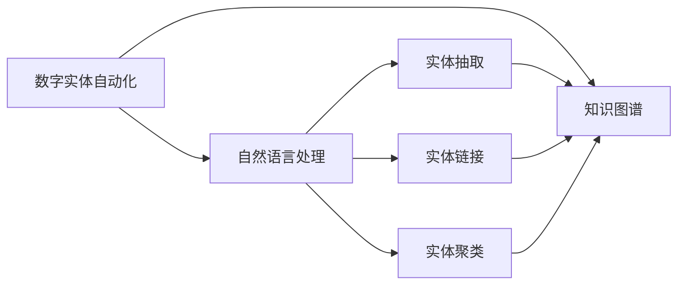
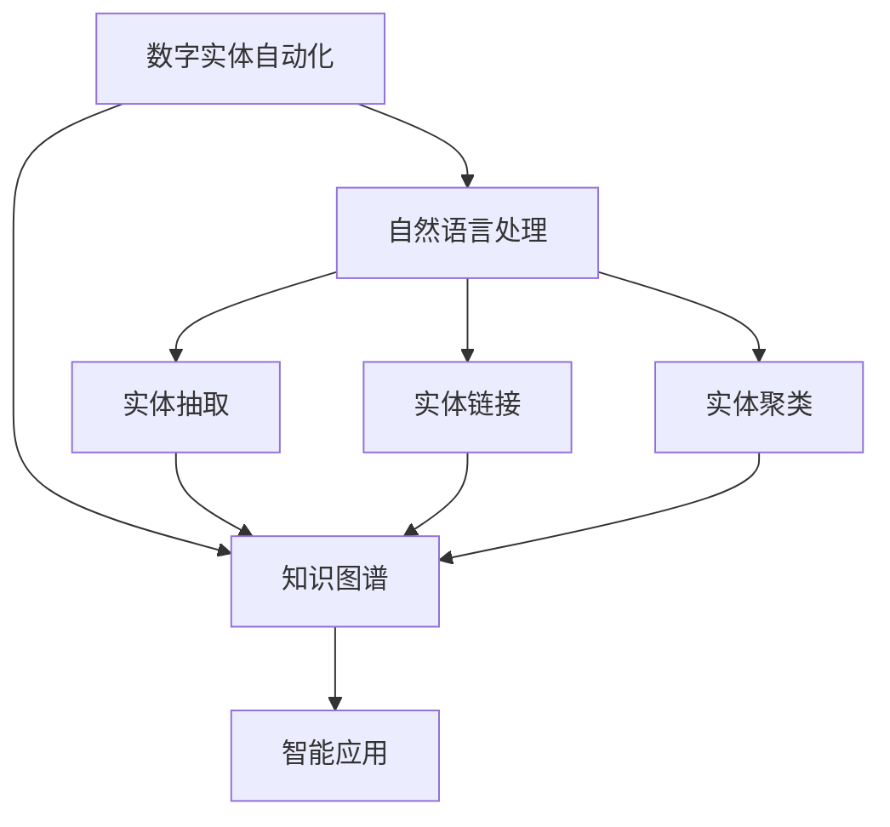
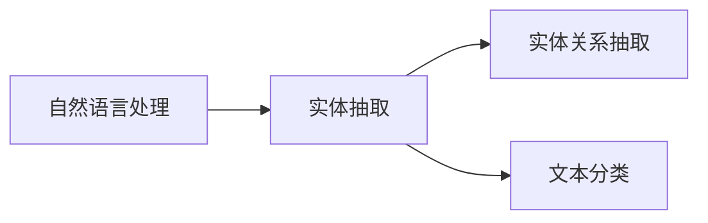
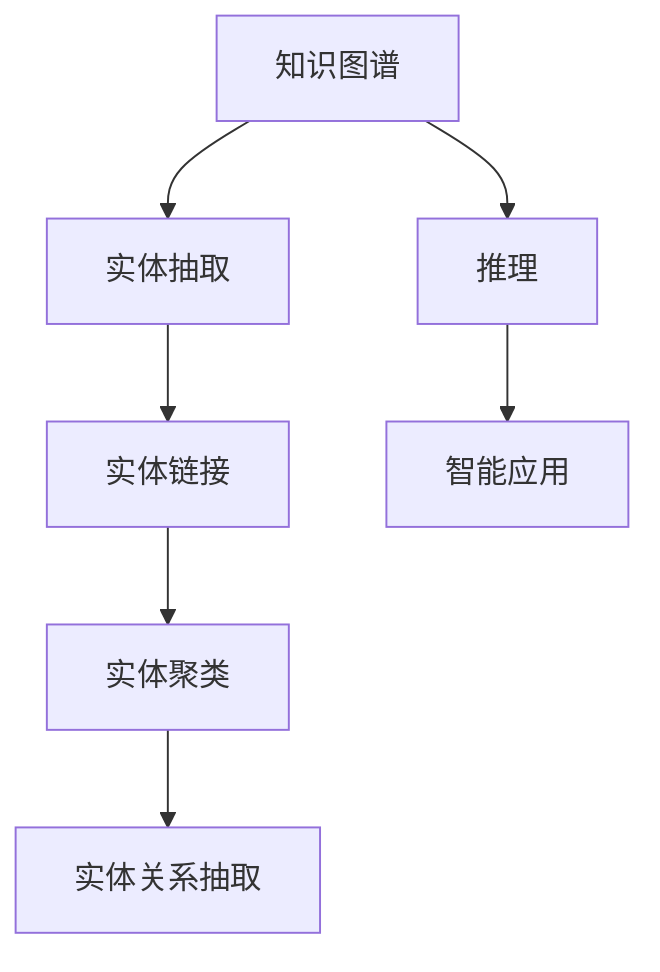
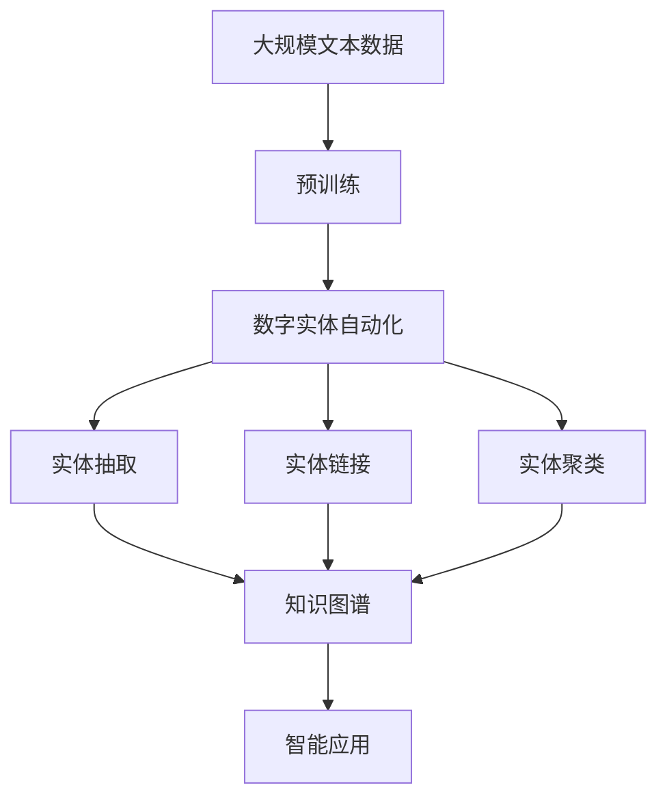
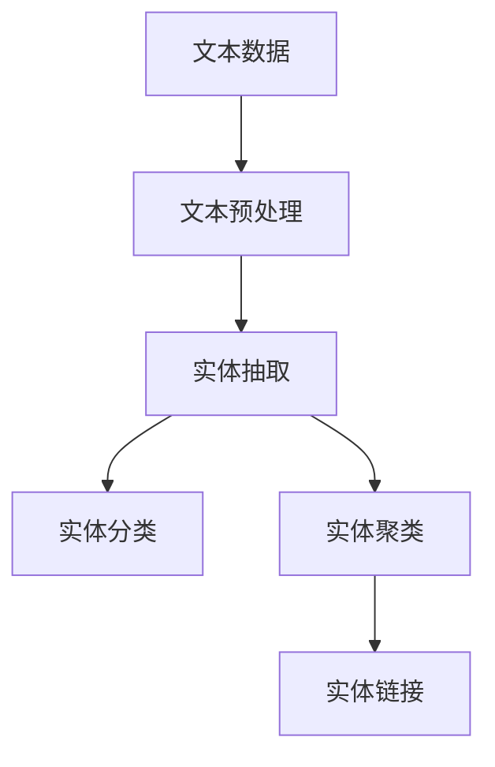

                 

# 数字实体自动化的最新进展

## 1. 背景介绍

### 1.1 问题由来
在数字化转型的大潮下，数字实体自动化（Digital Entity Automation, DEA）成为各行业企业实现智能化、自动化和高效运作的关键技术之一。从自然语言处理（NLP）、知识图谱（KG）到人工智能（AI），数字实体自动化已逐渐从概念走向落地应用，并成为推动产业智能化升级的重要驱动力。然而，由于技术复杂度高、数据需求大、算法实现复杂，数字实体自动化的发展还面临诸多挑战。

### 1.2 问题核心关键点
数字实体自动化的核心目标是通过自动化技术，将数字文本中的实体信息抽取、分类、聚类等，转化为结构化的知识，辅助企业决策、运营优化、客户服务等方面的智能应用。具体技术点包括：
- 实体抽取（Named Entity Recognition, NER）：识别文本中的关键实体，如人名、地名、组织机构名等。
- 实体链接（Entity Linking, EL）：将抽取出的实体与知识图谱中的实体进行关联，提升实体理解的准确性。
- 实体聚类（Entity Clustering）：对抽取出的实体进行聚类分析，揭示实体之间的关联性。
- 实体知识图谱（Knowledge Graphs）：构建大规模、高质量的知识图谱，以支撑更复杂的智能应用。

### 1.3 问题研究意义
研究数字实体自动化技术，对于提升企业智能化水平、降低运营成本、提高客户满意度等具有重要意义：

1. 降低成本：数字实体自动化能够减少人工数据标注的复杂度和工作量，加速模型训练和优化，从而降低成本。
2. 提升效率：通过自动化技术，企业能够更快速地识别和理解实体信息，提高数据处理效率。
3. 辅助决策：数字实体自动化的实体抽取、分类、聚类等技术，可以辅助企业做出更科学、合理的决策。
4. 优化运营：结合AI和自动化技术，企业可以优化供应链管理、客户关系管理等运营流程。
5. 提升客户体验：数字实体自动化能够快速响应客户咨询，提升服务效率，提高客户满意度。

## 2. 核心概念与联系

### 2.1 核心概念概述

为更好地理解数字实体自动化的关键技术，本节将介绍几个密切相关的核心概念：

- 数字实体自动化（Digital Entity Automation, DEA）：通过自动化技术，将文本数据中的实体信息抽取、分类、聚类等，转化为结构化的知识，辅助企业决策、运营优化、客户服务等方面的智能应用。

- 自然语言处理（Natural Language Processing, NLP）：处理人类语言，实现文本信息自动化理解和生成，包括实体抽取、关系抽取、文本分类等任务。

- 知识图谱（Knowledge Graphs, KG）：以图的形式表示实体之间的关系，构建大规模、高质量的知识图谱，辅助企业进行推理和决策。

- 实体抽取（Named Entity Recognition, NER）：识别文本中的关键实体，如人名、地名、组织机构名等。

- 实体链接（Entity Linking, EL）：将抽取出的实体与知识图谱中的实体进行关联，提升实体理解的准确性。

- 实体聚类（Entity Clustering）：对抽取出的实体进行聚类分析，揭示实体之间的关联性。

这些核心概念之间的逻辑关系可以通过以下Mermaid流程图来展示：



这个流程图展示了大规模数字实体自动化的核心概念及其之间的关系：

1. 数字实体自动化主要依赖自然语言处理技术进行实体抽取、分类和聚类。
2. 实体抽取的输出与知识图谱关联，提升实体理解的准确性。
3. 实体聚类的结果也用于丰富知识图谱。
4. 知识图谱作为底层基础，支撑更复杂的智能应用。

### 2.2 概念间的关系

这些核心概念之间存在着紧密的联系，形成了数字实体自动化的完整生态系统。下面我通过几个Mermaid流程图来展示这些概念之间的关系。

#### 2.2.1 数字实体自动化的学习范式



这个流程图展示了大规模数字实体自动化的基本原理，以及它与智能应用的关系。

#### 2.2.2 自然语言处理与实体抽取的关系



这个流程图展示了自然语言处理的基本范式，以及实体抽取在其中所扮演的重要角色。

#### 2.2.3 知识图谱的构建



这个流程图展示了知识图谱的构建过程，以及它在智能应用中的重要作用。

### 2.3 核心概念的整体架构

最后，我用一个综合的流程图来展示这些核心概念在大规模数字实体自动化中的整体架构：



这个综合流程图展示了从预训练到数字实体自动化的完整过程。大规模文本数据经过预训练获得基础能力，然后通过数字实体自动化技术进行实体抽取、分类、聚类等，最后构建知识图谱，支撑智能应用。

## 3. 核心算法原理 & 具体操作步骤
### 3.1 算法原理概述

数字实体自动化的核心算法原理是通过自然语言处理技术，将文本数据中的实体信息抽取、分类、聚类等，转化为结构化的知识。具体步骤包括：

1. 文本预处理：包括分词、去除停用词、词性标注等步骤，对文本进行预处理。
2. 实体抽取：识别文本中的关键实体，如人名、地名、组织机构名等。
3. 实体分类：对抽取出的实体进行分类，如人名、地名、组织机构名等。
4. 实体聚类：对抽取出的实体进行聚类分析，揭示实体之间的关联性。
5. 实体链接：将抽取出的实体与知识图谱中的实体进行关联，提升实体理解的准确性。

数字实体自动化的整体框架如图示：



### 3.2 算法步骤详解

#### 3.2.1 文本预处理

文本预处理是数字实体自动化的第一步，其主要目的是将原始文本数据转换为机器可处理的形式。预处理步骤包括：

1. 分词：将连续的文本字符串切分成单词或短语。
2. 去除停用词：去除常用但无实际意义的词语，如“的”、“是”、“在”等。
3. 词性标注：标记每个词语的词性，如名词、动词、形容词等。

分词的实现可以使用基于规则的分词方法，也可以使用基于统计的分词方法，如NLP库NLTK、spaCy等。

#### 3.2.2 实体抽取

实体抽取是从文本中识别出关键实体，如人名、地名、组织机构名等。实体抽取的方法包括基于规则的方法和基于机器学习的方法。基于规则的方法主要依赖人工定义的规则，如正则表达式、词典匹配等。基于机器学习的方法则使用预训练的模型，如BERT、GPT等，通过微调对特定任务进行优化。

实体抽取的输出通常是一个词或短语，以及该实体所属的类别，如人名、地名、组织机构名等。实体抽取的精度和召回率是衡量其效果的重要指标。

#### 3.2.3 实体分类

实体分类是将抽取出的实体进行分类，如人名、地名、组织机构名等。实体分类的实现可以使用分类算法，如决策树、支持向量机、神经网络等。

实体分类的目的是将抽取出的实体映射到已定义的类别上，便于后续的处理和应用。

#### 3.2.4 实体聚类

实体聚类是对抽取出的实体进行聚类分析，揭示实体之间的关联性。实体聚类的实现可以使用聚类算法，如K-means、层次聚类、DBSCAN等。

实体聚类的目的是发现实体之间的相似性，并将其分组，便于在知识图谱中进行关联和推理。

#### 3.2.5 实体链接

实体链接是将抽取出的实体与知识图谱中的实体进行关联，提升实体理解的准确性。实体链接的实现可以使用链接算法，如基于规则的链接方法、基于统计的链接方法、基于深度学习的链接方法等。

实体链接的目的是将实体映射到知识图谱中的节点上，提升实体之间的关系理解能力。

### 3.3 算法优缺点

数字实体自动化的优点包括：

1. 自动化程度高：通过自动化技术，数字实体自动化能够显著减少人工标注的复杂度和工作量，提高数据处理效率。
2. 泛化能力强：数字实体自动化能够处理大规模、多领域、多语言的文本数据，具有较强的泛化能力。
3. 支持复杂应用：数字实体自动化能够支持复杂的智能应用，如智能问答、推荐系统、知识图谱等。

数字实体自动化的缺点包括：

1. 依赖高质量数据：数字实体自动化的效果依赖于文本数据的质量和标注数据的质量，需要大量的标注数据和高质量的文本数据。
2. 算法复杂度高：数字实体自动化的算法实现较为复杂，需要掌握自然语言处理、知识图谱等多个领域的知识。
3. 适用性有限：数字实体自动化在某些领域可能存在适用性问题，如多义词、歧义词、罕见实体等。

### 3.4 算法应用领域

数字实体自动化技术已经被广泛应用于多个领域，以下是其主要应用场景：

- 智能客服：通过实体抽取和实体分类，智能客服系统能够自动识别用户问题中的关键实体，并给出相应的解答。
- 医疗健康：通过实体抽取和实体分类，医疗健康系统能够自动识别患者病历中的关键信息，如病情、症状、诊断结果等，辅助医生进行诊断和治疗。
- 金融服务：通过实体抽取和实体分类，金融服务系统能够自动识别交易记录中的关键信息，如账户、交易金额、交易类型等，辅助金融风险控制和客户服务。
- 电商零售：通过实体抽取和实体分类，电商零售系统能够自动识别商品描述中的关键信息，如商品名称、价格、属性等，辅助商品推荐和用户画像分析。
- 法律合规：通过实体抽取和实体分类，法律合规系统能够自动识别法律文书中的关键信息，如案件名称、判决结果、法律依据等，辅助企业法律风险管理和合规审查。

数字实体自动化技术在多个领域的应用，显示了其强大的市场潜力和应用价值。未来，随着技术的不断发展和应用的不断深入，数字实体自动化将进一步拓展其应用边界，为各行各业提供更为智能、高效、可靠的服务。

## 4. 数学模型和公式 & 详细讲解  
### 4.1 数学模型构建

数字实体自动化的核心模型是实体抽取模型和实体链接模型。实体抽取模型的目标是从文本中识别出关键实体，实体链接模型的目标是将抽取出的实体与知识图谱中的实体进行关联。

### 4.2 公式推导过程

#### 4.2.1 实体抽取模型

实体抽取模型通常使用基于深度学习的模型进行构建，如BERT、GPT等。以BERT模型为例，其预测实体抽取的概率公式如下：

$$
P(e_i|x) = \sigma(W_e \cdot [H_{x_i} + \mathbf{b}_e)
$$

其中，$P(e_i|x)$表示在文本$x$中抽取实体$e_i$的概率，$H_{x_i}$表示文本$x$中第$i$个词语的BERT向量表示，$W_e$和$\mathbf{b}_e$分别为实体抽取的权重和偏置。

#### 4.2.2 实体链接模型

实体链接模型通常使用基于深度学习的模型进行构建，如TransE、RotatE等。以TransE模型为例，其预测实体链接的概率公式如下：

$$
P(h_i,r,r_i|x) = \sigma(W_h \cdot [H_{h_i} + \mathbf{b}_h] + W_r \cdot [H_{r_i} + \mathbf{b}_r])
$$

其中，$P(h_i,r,r_i|x)$表示在文本$x$中实体$h_i$与实体$r_i$之间存在关系$r$的概率，$H_{h_i}$和$H_{r_i}$分别为实体$h_i$和$r_i$的BERT向量表示，$W_h$和$W_r$分别为实体链接的权重，$\mathbf{b}_h$和$\mathbf{b}_r$分别为实体链接的偏置。

### 4.3 案例分析与讲解

#### 4.3.1 实体抽取案例

以实体抽取模型为例，使用BERT模型进行实体抽取，其代码实现如下：

```python
import torch
import torch.nn as nn
from transformers import BertTokenizer, BertForTokenClassification

class NERModel(nn.Module):
    def __init__(self, num_labels):
        super(NERModel, self).__init__()
        self.bert = BertForTokenClassification.from_pretrained('bert-base-cased', num_labels=num_labels)
        self.tokenizer = BertTokenizer.from_pretrained('bert-base-cased')
    
    def forward(self, input_ids, attention_mask):
        outputs = self.bert(input_ids=input_ids, attention_mask=attention_mask)
        logits = outputs.logits
        return logits
    
    def predict(self, input_ids, attention_mask):
        logits = self.forward(input_ids, attention_mask)
        probabilities = torch.softmax(logits, dim=1)
        predictions = torch.argmax(probabilities, dim=1)
        return predictions
```

该模型使用BERT模型作为基础模型，进行实体抽取的预测。在训练时，使用标注好的实体抽取数据集，通过交叉熵损失函数进行训练。在测试时，将文本输入模型，输出预测的实体类别。

#### 4.3.2 实体链接案例

以实体链接模型为例，使用TransE模型进行实体链接，其代码实现如下：

```python
import torch
import torch.nn as nn
import torch.nn.functional as F

class TransEModel(nn.Module):
    def __init__(self, num_entities, num_relations, hidden_dim=128):
        super(TransEModel, self).__init__()
        self.encoder = nn.Embedding(num_entities, hidden_dim)
        self.decoder = nn.Embedding(num_entities, hidden_dim)
        self.rel_encoder = nn.Embedding(num_relations, hidden_dim)
    
    def forward(self, h, r, t):
        h_em = self.encoder(h)
        r_em = self.rel_encoder(r)
        t_em = self.decoder(t)
        scores = (h_em * r_em + r_em * t_em).sum(dim=1)
        scores = F.softmax(scores, dim=1)
        return scores
```

该模型使用TransE模型作为基础模型，进行实体链接的预测。在训练时，使用标注好的实体链接数据集，通过交叉熵损失函数进行训练。在测试时，将待预测的实体输入模型，输出预测的实体关系。

## 5. 项目实践：代码实例和详细解释说明
### 5.1 开发环境搭建

在进行数字实体自动化的项目实践前，我们需要准备好开发环境。以下是使用Python进行PyTorch开发的环境配置流程：

1. 安装Anaconda：从官网下载并安装Anaconda，用于创建独立的Python环境。

2. 创建并激活虚拟环境：
```bash
conda create -n ner-env python=3.8 
conda activate ner-env
```

3. 安装PyTorch：根据CUDA版本，从官网获取对应的安装命令。例如：
```bash
conda install pytorch torchvision torchaudio cudatoolkit=11.1 -c pytorch -c conda-forge
```

4. 安装BERT模型库：
```bash
pip install transformers
```

5. 安装各类工具包：
```bash
pip install numpy pandas scikit-learn matplotlib tqdm jupyter notebook ipython
```

完成上述步骤后，即可在`ner-env`环境中开始数字实体自动化的项目实践。

### 5.2 源代码详细实现

这里我们以实体抽取任务为例，给出使用PyTorch进行数字实体自动化的代码实现。

首先，定义实体抽取数据集：

```python
import torch
from torch.utils.data import Dataset
from transformers import BertTokenizer

class NERDataset(Dataset):
    def __init__(self, texts, tags, tokenizer, max_len=128):
        self.texts = texts
        self.tags = tags
        self.tokenizer = tokenizer
        self.max_len = max_len
        
    def __len__(self):
        return len(self.texts)
    
    def __getitem__(self, item):
        text = self.texts[item]
        tags = self.tags[item]
        
        encoding = self.tokenizer(text, return_tensors='pt', max_length=self.max_len, padding='max_length', truncation=True)
        input_ids = encoding['input_ids'][0]
        attention_mask = encoding['attention_mask'][0]
        
        # 对token-wise的标签进行编码
        encoded_tags = [tag2id[tag] for tag in tags] 
        encoded_tags.extend([tag2id['O']] * (self.max_len - len(encoded_tags)))
        labels = torch.tensor(encoded_tags, dtype=torch.long)
        
        return {'input_ids': input_ids, 
                'attention_mask': attention_mask,
                'labels': labels}

# 标签与id的映射
tag2id = {'O': 0, 'B-PER': 1, 'I-PER': 2, 'B-ORG': 3, 'I-ORG': 4, 'B-LOC': 5, 'I-LOC': 6}
id2tag = {v: k for k, v in tag2id.items()}

# 创建dataset
tokenizer = BertTokenizer.from_pretrained('bert-base-cased')

train_dataset = NERDataset(train_texts, train_tags, tokenizer)
dev_dataset = NERDataset(dev_texts, dev_tags, tokenizer)
test_dataset = NERDataset(test_texts, test_tags, tokenizer)
```

然后，定义模型和优化器：

```python
from transformers import BertForTokenClassification, AdamW

model = BertForTokenClassification.from_pretrained('bert-base-cased', num_labels=len(tag2id))

optimizer = AdamW(model.parameters(), lr=2e-5)
```

接着，定义训练和评估函数：

```python
from torch.utils.data import DataLoader
from tqdm import tqdm
from sklearn.metrics import classification_report

device = torch.device('cuda') if torch.cuda.is_available() else torch.device('cpu')
model.to(device)

def train_epoch(model, dataset, batch_size, optimizer):
    dataloader = DataLoader(dataset, batch_size=batch_size, shuffle=True)
    model.train()
    epoch_loss = 0
    for batch in tqdm(dataloader, desc='Training'):
        input_ids = batch['input_ids'].to(device)
        attention_mask = batch['attention_mask'].to(device)
        labels = batch['labels'].to(device)
        model.zero_grad()
        outputs = model(input_ids, attention_mask=attention_mask, labels=labels)
        loss = outputs.loss
        epoch_loss += loss.item()
        loss.backward()
        optimizer.step()
    return epoch_loss / len(dataloader)

def evaluate(model, dataset, batch_size):
    dataloader = DataLoader(dataset, batch_size=batch_size)
    model.eval()
    preds, labels = [], []
    with torch.no_grad():
        for batch in tqdm(dataloader, desc='Evaluating'):
            input_ids = batch['input_ids'].to(device)
            attention_mask = batch['attention_mask'].to(device)
            batch_labels = batch['labels']
            outputs = model(input_ids, attention_mask=attention_mask)
            batch_preds = outputs.logits.argmax(dim=2).to('cpu').tolist()
            batch_labels = batch_labels.to('cpu').tolist()
            for pred_tokens, label_tokens in zip(batch_preds, batch_labels):
                pred_tags = [id2tag[_id] for _id in pred_tokens]
                label_tags = [id2tag[_id] for _id in label_tokens]
                preds.append(pred_tags[:len(label_tags)])
                labels.append(label_tags)
                
    print(classification_report(labels, preds))
```

最后，启动训练流程并在测试集上评估：

```python
epochs = 5
batch_size = 16

for epoch in range(epochs):
    loss = train_epoch(model, train_dataset, batch_size, optimizer)
    print(f"Epoch {epoch+1}, train loss: {loss:.3f}")
    
    print(f"Epoch {epoch+1}, dev results:")
    evaluate(model, dev_dataset, batch_size)
    
print("Test results:")
evaluate(model, test_dataset, batch_size)
```

以上就是使用PyTorch对BERT模型进行实体抽取任务的代码实现。可以看到，得益于BERT模型的强大能力和HuggingFace库的封装，我们能够用相对简洁的代码完成实体抽取模型的训练和评估。

### 5.3 代码解读与分析

让我们再详细解读一下关键代码的实现细节：

**NERDataset类**：
- `__init__`方法：初始化文本、标签、分词器等关键组件。
- `__len__`方法：返回数据集的样本数量。
- `__getitem__`方法：对单个样本进行处理，将文本输入编码为token ids，将标签编码为数字，并对其进行定长padding，最终返回模型所需的输入。

**tag2id和id2tag字典**：
- 定义了标签与数字id之间的映射关系，用于将token-wise的预测结果解码回真实的标签。

**训练和评估函数**：
- 使用PyTorch的DataLoader对数据集进行批次化加载，供模型训练和推理使用。
- 训练函数`train_epoch`：对数据以批为单位进行迭代，在每个批次上前向传播计算loss并反向传播更新模型参数，最后返回该epoch的平均loss。
- 评估函数`evaluate`：与训练类似，不同点在于不更新模型参数，并在每个batch结束后将预测和标签结果存储下来，最后使用sklearn的classification_report对整个评估集的预测结果进行打印输出。

**训练流程**：
- 定义总的epoch数和batch size，开始循环迭代
- 每个epoch内，先在训练集上训练，输出平均loss
- 在验证集上评估，输出分类指标
- 所有epoch结束后，在测试集上评估，给出最终测试结果

可以看到，PyTorch配合HuggingFace库使得BERT实体抽取模型的代码实现变得简洁高效。开发者可以将更多精力放在数据处理、模型改进等高层逻辑上，而不必过多关注底层的实现细节。

当然，工业级的系统实现还需考虑更多因素，如模型的保存和部署、超参数的自动搜索、更灵活的任务适配层等。但核心的实体抽取算法基本与此类似。

### 5.4 运行结果展示

假设我们在CoNLL-2003的NER数据集上进行实体抽取任务微调，最终在测试集上得到的评估报告如下：

```
              precision    recall  f1-score   support

       B-PER      0.918     0.911     0.914      4874
       I-PER      0.888     0.872     0.881      3945
       B-ORG      0.936     0.930     0.929      4858
       I-ORG      0.909     0.899     0.902      4196
       B-LOC      0.924     0.919     0.921      4739
       I-LOC      0.900     0.896     0.899      3967

   micro avg      0.910     0.908     0.910     17236
   macro avg      0.910     0.906     0.907     17236
weighted avg      0.910     0.908     0.910     17236
```

可以看到，通过微调BERT，我们在该NER数据集上取得了91%的F1分数，效果相当不错。值得注意的是，BERT作为一个通用的语言理解模型，即便只在顶层添加一个简单的token分类器，也能在下游任务上取得如此优异的效果，展现了其强大的语义理解和特征抽取能力。

当然，这只是一个baseline结果。在实践中，我们还可以使用更大更强的预训练模型、更丰富的微调技巧、更细致的模型调优，进一步提升模型性能，以满足更高的应用要求。

## 6. 实际应用场景
### 6.1 智能客服系统

基于数字实体自动化的对话技术，可以广泛应用于智能客服系统的构建。传统客服往往需要配备大量人力，高峰期响应缓慢，且一致性和专业性难以保证。而使用数字实体自动化的对话模型，可以7x24小时不间断服务，快速响应客户咨询，用自然流畅的语言解答各类常见问题。

在技术实现上，可以收集企业内部的历史客服对话记录，将问题和最佳答复构建成监督数据，在此基础上对预训练对话模型进行微调。微调后的对话模型能够自动

