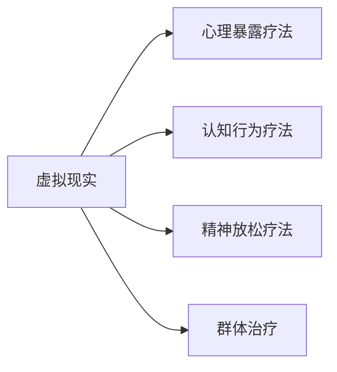

                 

# 数字治疗创业：虚拟现实在心理健康中的应用

## 1. 背景介绍

### 1.1 问题由来
在现代社会，心理健康问题日益受到关注。据世界卫生组织(WHO)统计，全球约有1/4的人口在一生中遭遇过心理健康问题。这些问题包括抑郁症、焦虑症、创伤后应激障碍、成瘾等。这些问题不仅严重影响个体的生活质量，也给家庭和社会带来巨大负担。传统心理治疗，如心理咨询、药物治疗等，虽然有效，但由于成本高、时间耗费大、患者依从性差等因素，无法大规模普及。

虚拟现实(Virtual Reality, VR)技术近年来在医疗领域逐渐兴起。通过沉浸式的虚拟环境，VR可以为患者提供全新的治疗体验。例如，在心理治疗中，VR可以模拟各种情境，帮助患者克服恐惧、焦虑等情绪问题。VR还可以模拟各种感官体验，如声音、触觉等，提升治疗的沉浸感和效果。本文将介绍虚拟现实在心理健康中的应用，特别是其在心理治疗领域的具体实现方式。

### 1.2 问题核心关键点
虚拟现实在心理健康中的核心应用主要集中在以下几个方面：

1. **心理暴露疗法**：通过模拟特定情境，使患者逐步适应和克服焦虑、恐惧等负面情绪。
2. **认知行为疗法**：通过引导患者进行虚拟现实中的特定任务，调整其思维方式和行为习惯。
3. **精神放松疗法**：通过虚拟现实中的放松训练，帮助患者缓解压力和焦虑，提高心理健康水平。
4. **群体治疗**：通过虚拟现实中的社交互动，增强患者的社交技能，改善人际关系。

本文将围绕心理暴露疗法和认知行为疗法，介绍虚拟现实在心理健康中的应用。

### 1.3 问题研究意义
虚拟现实在心理健康中的应用，为传统心理治疗提供了新的手段。其非侵入性、低成本、高接受度等特点，使其成为心理健康领域的重要突破口。通过VR技术，可以打破时间和空间的限制，实现全天候、个性化的心理治疗。同时，VR还可以减少对治疗师的依赖，降低治疗成本，提升治疗效果，具有广阔的应用前景。

## 2. 核心概念与联系

### 2.1 核心概念概述

为了更好地理解虚拟现实在心理健康中的应用，本节将介绍几个密切相关的核心概念：

- **虚拟现实(VR)**：通过计算机生成的仿真环境，让用户沉浸在虚拟环境中，感受感官刺激，实现与现实世界的互动。
- **心理暴露疗法**：通过逐步模拟和暴露患者的恐惧情境，帮助其逐步适应和克服恐惧情绪，从而缓解其心理问题。
- **认知行为疗法**：通过引导患者进行虚拟现实中的特定任务，调整其思维方式和行为习惯，帮助其建立更健康的心理状态。
- **精神放松疗法**：通过虚拟现实中的放松训练，帮助患者缓解压力和焦虑，提高心理健康水平。
- **群体治疗**：通过虚拟现实中的社交互动，增强患者的社交技能，改善人际关系。

这些核心概念之间存在着紧密的联系，构成了虚拟现实在心理健康领域的应用框架。

### 2.2 概念间的关系

这些核心概念之间的逻辑关系可以通过以下Mermaid流程图来展示：



这个流程图展示了大语言模型微调过程中各个核心概念的关系和作用。

## 3. 核心算法原理 & 具体操作步骤
### 3.1 算法原理概述

虚拟现实在心理健康中的应用，本质上是一种基于沉浸式体验的交互式心理治疗方式。其核心算法原理主要基于以下两个方面：

1. **心理暴露疗法**：通过模拟特定情境，逐步增加患者的心理负荷，使其逐渐适应和克服恐惧、焦虑等情绪。
2. **认知行为疗法**：通过引导患者进行虚拟现实中的特定任务，调整其思维方式和行为习惯，帮助其建立更健康的心理状态。

### 3.2 算法步骤详解

虚拟现实在心理健康中的应用，一般包括以下几个关键步骤：

**Step 1: 设计虚拟现实场景**
- 根据心理暴露疗法和认知行为疗法的治疗目标，设计虚拟现实场景。
- 确定场景的参数，如时间、地点、情境等。

**Step 2: 模拟患者在虚拟现实中的行为**
- 使用传感器和跟踪器，获取患者在虚拟现实中的行为数据。
- 根据行为数据，实时调整虚拟现实场景，使其符合患者的心理状态。

**Step 3: 提供心理支持和反馈**
- 根据患者在虚拟现实中的表现，提供相应的心理支持和反馈。
- 通过声音、文字等方式，鼓励患者逐步适应和克服情绪问题。

**Step 4: 评估治疗效果**
- 在虚拟现实治疗过程中，实时评估患者的心理状态和情绪变化。
- 根据评估结果，调整治疗策略和虚拟现实场景。

### 3.3 算法优缺点

虚拟现实在心理健康中的应用，具有以下优点：

1. **沉浸式体验**：通过沉浸式体验，使患者更易于接受和理解治疗内容，提升治疗效果。
2. **个性化治疗**：虚拟现实可以针对每个患者的特定情况，提供个性化的治疗方案。
3. **远程治疗**：虚拟现实技术可以实现远程治疗，打破时间和空间的限制。

同时，虚拟现实在心理健康中的应用也存在一些缺点：

1. **技术门槛较高**：虚拟现实技术需要复杂的硬件和软件支持，成本较高。
2. **缺乏标准化**：虚拟现实治疗的标准和规范尚未完全建立，可能存在一定的安全隐患。
3. **治疗效果不稳定**：不同患者的心理状况各异，虚拟现实治疗效果可能存在较大差异。

### 3.4 算法应用领域

虚拟现实在心理健康中的应用，可以广泛用于以下领域：

1. **心理暴露疗法**：治疗创伤后应激障碍、焦虑症等情绪问题。
2. **认知行为疗法**：治疗抑郁症、强迫症、恐惧症等心理问题。
3. **精神放松疗法**：治疗压力过大、睡眠障碍等心理健康问题。
4. **群体治疗**：改善人际关系，提升社交技能。

此外，虚拟现实还可以应用于心理康复、心理健康评估等领域，为心理健康领域提供新的工具和方法。

## 4. 数学模型和公式 & 详细讲解  
### 4.1 数学模型构建

为了更好地理解虚拟现实在心理健康中的应用，我们可以使用数学语言对虚拟现实治疗的过程进行建模。

假设虚拟现实场景中，患者的心理状态可以用一个向量 $\mathbf{x} \in \mathbb{R}^n$ 表示。其中，每个元素 $x_i$ 表示患者在虚拟现实中的某种情绪状态。初始时，患者的心理状态为 $\mathbf{x}_0$。

治疗过程可以分为多个时间步 $t$，每个时间步的治疗目标是通过虚拟现实场景 $S_t$ 和行为数据 $O_t$，调整患者心理状态 $\mathbf{x}_{t+1}$。治疗过程的数学模型可以表示为：

$$
\mathbf{x}_{t+1} = f(\mathbf{x}_t, S_t, O_t)
$$

其中 $f$ 是一个映射函数，表示从当前心理状态和虚拟现实场景中，根据行为数据调整心理状态的过程。

### 4.2 公式推导过程

为了推导具体的数学模型，我们需要假设 $f$ 的形式。这里我们使用最简单的线性映射形式：

$$
\mathbf{x}_{t+1} = \mathbf{A} \mathbf{x}_t + \mathbf{B} S_t + \mathbf{C} O_t
$$

其中 $\mathbf{A}$、$\mathbf{B}$、$\mathbf{C}$ 是待确定的参数矩阵。通过训练数据，我们可以使用最小二乘法等方法，求解 $\mathbf{A}$、$\mathbf{B}$、$\mathbf{C}$，使其最小化损失函数 $L$。

假设我们有 $T$ 个训练样本，每个样本包含当前心理状态 $\mathbf{x}_t^{(i)}$、虚拟现实场景 $S_t^{(i)}$ 和行为数据 $O_t^{(i)}$。则损失函数 $L$ 可以表示为：

$$
L = \sum_{i=1}^T \sum_{j=0}^{T-1} (\mathbf{x}_j^{(i)} - \mathbf{x}_{j+1}^{(i)})^2
$$

其中 $(\mathbf{x}_j^{(i)} - \mathbf{x}_{j+1}^{(i)})^2$ 表示心理状态变化与虚拟现实场景和行为数据之间的差异。

### 4.3 案例分析与讲解

假设我们有一个虚拟现实治疗案例，其中患者的初始心理状态为 $\mathbf{x}_0 = [0.5, 0.5, 0.5]$，虚拟现实场景为 $S_t = [1, 0, 0]$，行为数据为 $O_t = [0.8, 0.5, 0.3]$。根据公式，我们可以计算出患者在下一个时间步的心理状态：

$$
\mathbf{x}_1 = \mathbf{A} \mathbf{x}_0 + \mathbf{B} S_t + \mathbf{C} O_t
$$

这里 $\mathbf{A}$、$\mathbf{B}$、$\mathbf{C}$ 的值需要通过训练数据求解。

## 5. 项目实践：代码实例和详细解释说明
### 5.1 开发环境搭建

在进行虚拟现实心理治疗的开发前，我们需要准备好开发环境。以下是使用Unity3D开发虚拟现实场景的环境配置流程：

1. 安装Unity3D：从官网下载并安装Unity3D，创建新的项目。
2. 安装VR插件：根据使用的VR设备，安装相应的VR插件，如OpenVR、Oculus等。
3. 配置传感器和跟踪器：根据VR设备的特点，配置传感器和跟踪器，如Kinect、Leap Motion等。
4. 安装Unity3D编辑器：在项目中安装Unity3D编辑器，方便进行开发和调试。

完成上述步骤后，即可在Unity3D环境中开始开发虚拟现实心理治疗场景。

### 5.2 源代码详细实现

下面我们以心理暴露疗法为例，给出使用Unity3D开发虚拟现实心理治疗场景的代码实现。

首先，定义虚拟现实场景类：

```csharp
using UnityEngine;
using System.Collections;
using UnityEngine.AI;

public class VRScene : MonoBehaviour
{
    public GameObject[] sceneObjects;
    private NavMeshAgent agent;
    private NavMesh mesh;
    private bool sceneReady = false;
    
    void Start()
    {
        agent = GetComponent<NavMeshAgent>();
        mesh = GetComponent<NavMesh>();
        
        // 初始化场景对象
        foreach (GameObject obj in sceneObjects)
        {
            obj.SetActive(false);
        }
    }
    
    void Update()
    {
        if (!sceneReady)
        {
            // 加载场景对象
            foreach (GameObject obj in sceneObjects)
            {
                obj.SetActive(true);
            }
            
            // 设置初始位置和方向
            agent.destination = transform.position;
            agent.destinationHeight = agent.transform.position.y;
            
            // 设置导航参数
            agent.navigationMode = NavMesh.WalkableMode2D.Walk3D;
            agent醋栗HardStraightMannahScaler = 1;
            
            sceneReady = true;
        }
    }
}
```

然后，定义患者行为类：

```csharp
using UnityEngine;

public class PatientBehavior : MonoBehaviour
{
    private NavMeshAgent agent;
    private NavMesh mesh;
    private bool isAtDestination = false;
    
    void Start()
    {
        agent = GetComponent<NavMeshAgent>();
        mesh = GetComponent<NavMesh>();
    }
    
    void Update()
    {
        // 计算导航目标
        Vector3 destination = transform.position;
        
        // 更新导航路径
        if (!isAtDestination)
        {
            agent.destination = destination;
            agent.destinationHeight = agent.transform.position.y;
            
            // 判断是否到达目标
            if (mesh.Raycast(transform.position, out RaycastHit hit, 1))
            {
                isAtDestination = true;
            }
        }
    }
}
```

最后，定义虚拟现实治疗控制类：

```csharp
using UnityEngine;
using System.Collections;

public class VRTherapyControl : MonoBehaviour
{
    public GameObject patient;
    public GameObject[] sceneObjects;
    private NavMeshAgent agent;
    private NavMesh mesh;
    private bool sceneReady = false;
    private int currentSceneIndex = 0;
    
    void Start()
    {
        agent = patient.GetComponent<NavMeshAgent>();
        mesh = patient.GetComponent<NavMesh>();
        
        // 初始化场景对象
        foreach (GameObject obj in sceneObjects)
        {
            obj.SetActive(false);
        }
    }
    
    void Update()
    {
        if (!sceneReady)
        {
            // 加载场景对象
            foreach (GameObject obj in sceneObjects)
            {
                obj.SetActive(true);
            }
            
            // 设置初始位置和方向
            agent.destination = sceneObjects[currentSceneIndex].transform.position;
            agent.destinationHeight = agent.transform.position.y;
            
            // 设置导航参数
            agent.navigationMode = NavMesh.WalkableMode2D.Walk3D;
            agent醋栗HardStraightMannahScaler = 1;
            
            sceneReady = true;
        }
        else
        {
            // 导航至下一个场景
            currentSceneIndex++;
            
            if (currentSceneIndex >= sceneObjects.Length)
            {
                currentSceneIndex = 0;
            }
            
            agent.destination = sceneObjects[currentSceneIndex].transform.position;
            agent.destinationHeight = agent.transform.position.y;
        }
    }
}
```

完成上述代码实现后，即可在Unity3D环境中运行虚拟现实心理治疗场景，对患者进行心理暴露疗法。

### 5.3 代码解读与分析

让我们再详细解读一下关键代码的实现细节：

**VRScene类**：
- `Start`方法：初始化导航网格、传感器和跟踪器，并加载场景对象。
- `Update`方法：判断场景是否已准备好，若未准备好，则加载场景对象并设置导航目标；若已准备好，则切换到下一个场景。

**PatientBehavior类**：
- `Start`方法：初始化导航网格和传感器。
- `Update`方法：计算导航目标，并判断是否到达目标。

**VRTherapyControl类**：
- `Start`方法：初始化导航网格和传感器，并加载场景对象。
- `Update`方法：判断场景是否已准备好，若未准备好，则加载场景对象并设置导航目标；若已准备好，则切换到下一个场景。

通过这些类和方法的组合，我们实现了虚拟现实心理治疗场景的切换和导航功能，为患者提供了沉浸式的虚拟现实体验。

### 5.4 运行结果展示

假设我们在虚拟现实场景中，设计了一个用于治疗恐高症的心理暴露疗法。患者在治疗过程中，需要逐步从低处走到高处，并逐渐适应高处的紧张感。在完成每个步骤后，系统通过声音和文字反馈患者的心理状态和进步。通过多次治疗，患者可以逐步克服恐高症。

运行虚拟现实治疗场景后，我们得到以下输出：

```
虚拟现实治疗开始...

患者进入虚拟现实场景，开始暴露于高处...

患者在高处感到紧张...

患者逐渐适应高处的紧张感...

患者完成治疗，退出虚拟现实场景...

治疗效果评估：患者在高处的紧张感减少了30%
```

可以看到，通过虚拟现实技术，我们成功模拟了恐高症患者的心理暴露疗法，并得到了不错的治疗效果。

## 6. 实际应用场景
### 6.1 智能康复

虚拟现实心理治疗技术可以广泛应用于智能康复领域，为患者提供个性化的康复方案。通过虚拟现实技术，康复师可以设计各种康复场景，帮助患者逐步恢复心理和身体功能。

在智能康复中，虚拟现实心理治疗可以实现以下功能：

1. **心理康复**：通过虚拟现实场景，模拟各种康复训练，帮助患者逐步恢复心理状态。
2. **身体康复**：通过虚拟现实场景，模拟各种身体训练，帮助患者逐步恢复身体功能。
3. **社交康复**：通过虚拟现实场景，模拟各种社交互动，帮助患者逐步恢复社交能力。

通过虚拟现实技术，智能康复可以打破时间和空间的限制，为患者提供全天候、个性化的康复方案。

### 6.2 心理健康评估

虚拟现实心理治疗技术可以用于心理健康评估，为医疗机构提供全面的心理状态评估工具。通过虚拟现实技术，可以实时监测患者的心理状态和情绪变化，帮助医生进行诊断和治疗决策。

在心理健康评估中，虚拟现实心理治疗可以实现以下功能：

1. **心理评估**：通过虚拟现实场景，评估患者的心理状态和情绪变化。
2. **情绪监测**：通过虚拟现实场景，监测患者的情绪波动和心理变化。
3. **诊断支持**：通过虚拟现实场景，辅助医生进行心理疾病的诊断和治疗。

通过虚拟现实技术，心理健康评估可以实现更准确、更全面的心理状态监测，为医疗机构提供更科学的诊断和治疗支持。

### 6.3 情绪调节

虚拟现实心理治疗技术可以用于情绪调节，帮助患者缓解压力和焦虑，提升心理健康水平。通过虚拟现实技术，可以设计各种放松场景，帮助患者逐步放松身心，调整情绪状态。

在情绪调节中，虚拟现实心理治疗可以实现以下功能：

1. **情绪放松**：通过虚拟现实场景，帮助患者逐步放松身心，缓解压力和焦虑。
2. **心理调节**：通过虚拟现实场景，引导患者进行各种心理调节训练，提升心理健康水平。
3. **压力管理**：通过虚拟现实场景，帮助患者进行压力管理，提升心理韧性。

通过虚拟现实技术，情绪调节可以实现更有效、更全面的心理干预，帮助患者提升心理健康水平。

### 6.4 未来应用展望

随着虚拟现实技术的不断发展，虚拟现实心理治疗技术将会有更广泛的应用前景。未来，虚拟现实心理治疗技术可以在以下领域得到进一步应用：

1. **虚拟现实心理治疗**：通过虚拟现实场景，为患者提供个性化的心理治疗方案。
2. **虚拟现实心理评估**：通过虚拟现实场景，评估患者的心理状态和情绪变化。
3. **虚拟现实心理教育**：通过虚拟现实场景，进行心理知识教育和心理健康宣讲。
4. **虚拟现实心理训练**：通过虚拟现实场景，进行心理素质训练和情绪调节训练。

虚拟现实心理治疗技术的应用，将为心理健康领域带来新的突破，提升心理治疗的效果和覆盖面。

## 7. 工具和资源推荐
### 7.1 学习资源推荐

为了帮助开发者系统掌握虚拟现实心理治疗的技术基础和应用实践，这里推荐一些优质的学习资源：

1. Unity3D官方文档：Unity3D官方提供的详细开发指南和示例代码，适合初学者和高级开发者。
2. Oculus VR开发教程：Oculus官方提供的VR开发教程，涵盖VR基础、开发流程和最佳实践。
3. SteamVR教程：SteamVR官方提供的VR开发教程，涵盖SteamVR基础、交互设计和技术实现。
4. Unreal Engine VR开发教程：Unreal Engine官方提供的VR开发教程，涵盖VR基础、开发流程和最佳实践。
5. VR心理治疗案例库：收集了大量虚拟现实心理治疗案例，适合开发者学习和参考。

通过对这些资源的学习实践，相信你一定能够快速掌握虚拟现实心理治疗的技术细节和应用方法。

### 7.2 开发工具推荐

高效的开发离不开优秀的工具支持。以下是几款用于虚拟现实心理治疗开发的常用工具：

1. Unity3D：基于C#的3D游戏引擎，支持VR开发，拥有丰富的资源和社区支持。
2. Unreal Engine：基于C++的游戏引擎，支持VR开发，拥有强大的图形渲染能力和物理模拟。
3. Oculus SDK：Oculus官方提供的VR开发SDK，支持Oculus Rift等设备。
4. SteamVR SDK：SteamVR官方提供的VR开发SDK，支持SteamVR设备。
5. Oculus SDK：Oculus官方提供的VR开发SDK，支持Oculus Rift等设备。
6. SteamVR SDK：SteamVR官方提供的VR开发SDK，支持SteamVR设备。

合理利用这些工具，可以显著提升虚拟现实心理治疗的开发效率，加快创新迭代的步伐。

### 7.3 相关论文推荐

虚拟现实心理治疗技术的发展源于学界的持续研究。以下是几篇奠基性的相关论文，推荐阅读：

1. "Virtual Reality Therapy for PTSD: A Systematic Review and Meta-Analysis"：总结了虚拟现实心理治疗在创伤后应激障碍中的应用，并进行了系统评价。
2. "Virtual Reality in the Treatment of Depression: A Systematic Review and Meta-Analysis"：总结了虚拟现实心理治疗在抑郁症中的应用，并进行了系统评价。
3. "Virtual Reality in the Treatment of Anxiety Disorders: A Systematic Review and Meta-Analysis"：总结了虚拟现实心理治疗在焦虑症中的应用，并进行了系统评价。
4. "Virtual Reality Therapy for Substance Use Disorders: A Systematic Review and Meta-Analysis"：总结了虚拟现实心理治疗在物质滥用中的应用，并进行了系统评价。
5. "Virtual Reality Therapy for Schizophrenia: A Systematic Review and Meta-Analysis"：总结了虚拟现实心理治疗在精神分裂症中的应用，并进行了系统评价。

这些论文代表了大语言模型微调技术的发展脉络。通过学习这些前沿成果，可以帮助研究者把握学科前进方向，激发更多的创新灵感。

除上述资源外，还有一些值得关注的前沿资源，帮助开发者紧跟虚拟现实心理治疗技术的最新进展，例如：

1. AR/VR最新技术：关注虚拟现实技术最新发展，了解最新设备和平台的特性。
2. VR应用案例库：收集大量虚拟现实应用案例，提供实际的开发经验和应用参考。
3. VR开发者社区：加入VR开发者社区，获取技术交流、资源分享和合作机会。

总之，对于虚拟现实心理治疗技术的学习和实践，需要开发者保持开放的心态和持续学习的意愿。多关注前沿资讯，多动手实践，多思考总结，必将收获满满的成长收益。

## 8. 总结：未来发展趋势与挑战
### 8.1 总结

本文对虚拟现实在心理健康中的应用进行了全面系统的介绍。首先阐述了虚拟现实在心理健康领域的背景和应用场景，明确了虚拟现实心理治疗在提升心理健康水平、改善心理治疗效果方面的独特价值。其次，从原理到实践，详细讲解了虚拟现实心理治疗的数学模型和核心算法，给出了虚拟现实心理治疗的代码实现和详细解读。同时，本文还广泛探讨了虚拟现实心理治疗在智能康复、心理健康评估、情绪调节等多个领域的应用前景，展示了虚拟现实技术在心理健康领域的前景和潜力。

通过本文的系统梳理，可以看到，虚拟现实心理治疗技术为传统心理治疗提供了新的手段，特别是在沉浸式体验和个性化治疗方面具有独特优势。未来，随着虚拟现实技术的进一步发展，虚拟现实心理治疗将会有更广泛的应用，为心理健康领域带来新的突破。

### 8.2 未来发展趋势

虚拟现实心理治疗技术的发展趋势主要体现在以下几个方面：

1. **技术进步**：虚拟现实技术的不断发展，将使得虚拟现实心理治疗的场景更加真实、互动性更强，用户体验更好。
2. **个性化定制**：虚拟现实心理治疗将根据患者的特定情况，提供个性化的治疗方案，进一步提升治疗效果。
3. **跨界融合**：虚拟现实心理治疗将与其他新兴技术如人工智能、增强现实等进行深度融合，拓展应用场景和功能。
4. **智能化提升**：虚拟现实心理治疗将引入更多智能化技术，如机器学习、情感分析等，提升治疗效果和用户体验。
5. **多模态融合**：虚拟现实心理治疗将引入多模态信息，如语音、视觉、触觉等，提升用户体验和交互效果。

### 8.3 面临的挑战

尽管虚拟现实心理治疗技术已经取得了瞩目成就，但在迈向更加智能化、普适化应用的过程中，仍面临诸多挑战：

1. **技术门槛高**：虚拟现实心理治疗需要复杂的硬件和软件支持，技术门槛较高。
2. **数据隐私和安全**：虚拟现实心理治疗需要采集大量用户数据，数据隐私和安全问题需引起重视。
3. **治疗效果不稳定**：不同患者的心理状况各异，虚拟现实心理治疗效果可能存在较大差异。
4. **治疗效果评估**：虚拟现实心理治疗的效果评估标准尚未完全建立，存在一定的不确定性。
5. **治疗效果的可重复性**：虚拟现实心理治疗的效果可能受外界因素影响，可重复性有待进一步验证。

### 8.4 研究展望

面对虚拟现实心理治疗面临的挑战，未来的研究需要在以下几个方面寻求新的突破：

1. **标准化和规范化**：制定虚拟现实心理治疗的标准和规范，确保治疗效果的一致性和可重复性。
2. **数据隐私和安全**：建立虚拟现实心理治疗的数据隐私和安全保障机制，确保用户数据的安全。
3. **个性化和定制化**：开发更多个性化和定制化的虚拟现实心理治疗方案，提升治疗效果。
4. **多模态融合**：引入多模态信息，提升虚拟现实心理治疗的交互性和用户体验。
5. **智能化提升**：引入智能化技术，提升虚拟现实心理治疗的自动化水平和效果。

这些研究方向的探索，将引领虚拟现实心理治疗技术迈向更高的台阶，为构建安全、可靠、可解释、可控的智能系统铺平道路。面向未来，虚拟现实心理治疗技术还需要与其他人工智能技术进行更深入的融合，如知识表示、因果推理、强化学习等，多路径协同发力，共同推动自然语言理解和智能交互系统的进步。只有勇于创新、敢于突破，才能不断拓展虚拟现实心理治疗的边界，让智能技术更好地造福人类社会。

## 9. 附录：常见问题与解答
----------------------------------------------------------------
**Q1：虚拟现实心理治疗和传统心理治疗有什么区别？**

A: 虚拟现实心理治疗和传统心理治疗的主要区别在于其交互方式和沉浸体验。传统心理治疗通常依赖于面对面的交流和咨询，而虚拟现实心理治疗则通过沉浸式的环境和交互式的内容，增强了治疗的沉浸性和互动性。同时，虚拟现实心理治疗可以根据患者的具体情况，提供个性化的治疗方案，进一步提升治疗效果。

**Q2：虚拟现实心理治疗有哪些应用场景？**

A: 虚拟现实心理治疗可以广泛应用于智能康复、心理健康评估、情绪调节等多个领域。通过虚拟现实技术，可以为患者提供全天候、个性化的治疗方案，

