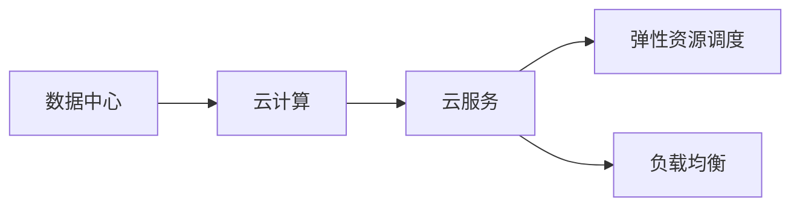
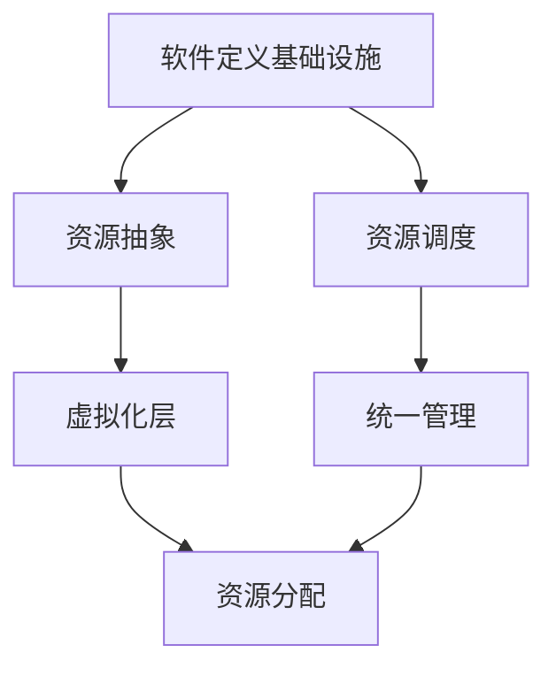
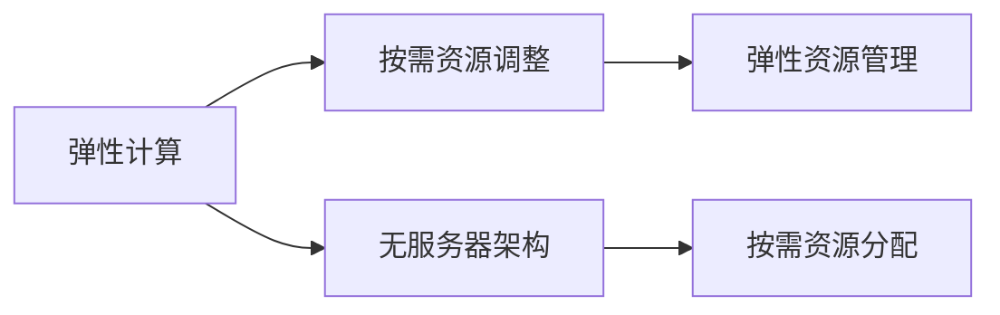

                 

# 数据中心成本飙升,软件2.0推动算力新革命

随着人工智能(AI)、云计算和物联网(IoT)等技术的迅猛发展，数据中心作为支撑这些技术的基础设施，面临着越来越大的成本压力。数据中心运营成本主要包括电力、冷却、网络、设备折旧等，其中电力和冷却是最大开销。传统的数据中心采用服务器为主的方式，造成了极高的电力和冷却成本，无法持续扩展和优化。软件2.0的崛起，为数据中心的算力革命带来了新的可能。

## 1. 背景介绍

### 1.1 问题由来
数据中心是支撑现代技术的基础设施，随着人工智能、大数据、云计算等技术的发展，对算力的需求不断增长。但数据中心的建设和运营成本也在持续上升，电力、冷却等基础设施的开销成为数据中心的主要负担。传统的数据中心一般采用服务器为主的方式，不仅电力消耗巨大，冷却系统复杂，而且硬件资源利用率低，灵活性差。如何降低数据中心的运营成本，提高算力的利用率，成为迫切需要解决的问题。

### 1.2 问题核心关键点
数据中心运营成本的来源主要有以下几个方面：
- 电力：数据中心服务器和存储设备需要消耗大量电力，尤其是计算密集型任务，如深度学习、AI训练等。
- 冷却：数据中心内部发热量大，需要复杂的冷却系统，如水冷、风冷、液冷等。
- 网络：数据中心需要高速、稳定的网络连接，保证数据传输速率和可靠性。
- 设备折旧：服务器、存储设备、网络设备等硬件设备，具有较高的折旧成本。

如何降低这些成本，是数据中心优化运营的核心问题。

### 1.3 问题研究意义
降低数据中心运营成本，不仅可以提高企业经济效益，还能提升算力供应的灵活性和稳定性。对于人工智能、大数据等高算力需求领域，降低数据中心运营成本，使得更多企业能够进入算力竞争，推动技术创新和行业进步。

## 2. 核心概念与联系

### 2.1 核心概念概述

为更好地理解软件2.0推动算力新革命，本节将介绍几个密切相关的核心概念：

- 数据中心(Data Center)：提供计算、存储、网络等服务的设施，支撑现代技术的发展。数据中心的建设和运营成本主要包括电力、冷却、网络、设备折旧等。
- 云计算(Cloud Computing)：通过网络提供计算、存储、网络等服务，按需使用，按量付费，具有弹性、按需和高效的特点。
- 软件定义基础设施(Software Defined Infrastructure, SDI)：通过软件对数据中心基础设施进行抽象、管理和调度，实现基础设施的自动化、智能化和可编程性。
- 软件2.0：一种新的计算范式，强调软件和硬件的深度融合，提升计算资源的利用率，降低能耗和成本，推动算力新革命。
- 资源池化(Resource Pooling)：将计算、存储、网络等资源进行统一管理和调度，提高资源利用率，降低运营成本。
- 弹性计算(Elastic Computing)：根据实际需求动态调整计算资源，提高算力供应的灵活性和稳定性。
- 无服务器架构(Serverless Architecture)：通过平台自动管理底层资源，开发者无需关注资源管理，实现计算资源的按需分配和回收。

这些核心概念之间的逻辑关系可以通过以下Mermaid流程图来展示：

```mermaid
graph TB
    A[数据中心] --> B[云计算]
    A --> C[软件定义基础设施(SDI)]
    A --> D[资源池化]
    A --> E[弹性计算]
    A --> F[无服务器架构]
    B --> G[弹性资源调度]
    C --> H[资源抽象与调度]
    D --> I[统一资源管理]
    E --> J[按需资源调整]
    F --> K[无服务器应用开发]
```

这个流程图展示了大数据中心相关的核心概念及其之间的关系：

1. 数据中心提供基本的计算、存储、网络等服务。
2. 云计算通过网络提供服务，按需使用，按量付费。
3. 软件定义基础设施通过软件对数据中心基础设施进行抽象、管理和调度，实现自动化、智能化。
4. 资源池化将资源统一管理和调度，提高利用率。
5. 弹性计算根据实际需求动态调整资源，提高灵活性。
6. 无服务器架构通过平台管理资源，简化应用开发。
7. 各概念相互协作，共同提升数据中心的运营效率和算力供应能力。

### 2.2 概念间的关系

这些核心概念之间存在着紧密的联系，形成了数据中心优化运营的完整生态系统。下面我通过几个Mermaid流程图来展示这些概念之间的关系。

#### 2.2.1 数据中心和云计算的关系



这个流程图展示了数据中心和云计算之间的关联。数据中心提供基础算力支持，云计算通过网络提供弹性资源调度和服务。

#### 2.2.2 软件定义基础设施和资源池化的关系



这个流程图展示了软件定义基础设施对资源池化的影响。软件定义基础设施通过抽象和调度，将资源进行虚拟化和统一管理。

#### 2.2.3 弹性计算和无服务器架构的关系



这个流程图展示了弹性计算和无服务器架构的关联。弹性计算根据需求动态调整资源，无服务器架构通过平台自动管理资源，实现按需分配和回收。

### 2.3 核心概念的整体架构

最后，我们用一个综合的流程图来展示这些核心概念在大数据中心优化运营过程中的整体架构：

```mermaid
graph TB
    A[数据中心] --> B[云计算]
    B --> C[云服务]
    A --> D[软件定义基础设施(SDI)]
    D --> E[资源抽象与调度]
    E --> F[虚拟化层]
    A --> G[资源池化]
    A --> H[弹性计算]
    G --> I[统一资源管理]
    H --> J[按需资源调整]
    J --> I
    G --> K[无服务器架构]
    K --> I
    I --> L[资源分配]
    L --> M[服务交付]
    M --> N[用户]
```

这个综合流程图展示了从数据中心到云计算，再到软件定义基础设施和资源池化，最后到弹性计算和无服务器架构的完整过程。通过这些概念的协同作用，实现数据中心的智能化和高效运营，提升算力供应的灵活性和稳定性。

## 3. 核心算法原理 & 具体操作步骤
### 3.1 算法原理概述

软件2.0推动数据中心算力新革命的核心原理，是通过软件和硬件的深度融合，提升算力的利用率，降低能耗和成本。其核心思想是：将数据中心的基础设施抽象为软件模块，通过软件进行统一管理和调度，实现资源的灵活分配和动态调整，从而降低运营成本。

具体来说，软件2.0包括以下几个关键步骤：

1. **基础设施抽象**：通过软件将数据中心的硬件资源进行抽象，形成资源池，实现统一管理和调度。
2. **弹性资源调度**：根据实际需求动态调整资源，提高算力供应的灵活性。
3. **资源池化**：将计算、存储、网络等资源进行统一管理和调度，提高资源利用率。
4. **无服务器架构**：通过平台自动管理资源，简化应用开发，提高算力供应的效率。

### 3.2 算法步骤详解

软件2.0的实现步骤可以分为以下几个部分：

**Step 1: 基础设施抽象**
- 将数据中心的硬件资源进行抽象，形成资源池，包括CPU、内存、存储、网络等。
- 通过软件定义基础设施(SDI)技术，将抽象后的资源进行统一管理和调度。

**Step 2: 弹性资源调度**
- 根据实际需求，动态调整计算资源，提高算力供应的灵活性。
- 通过弹性计算技术，自动调整虚拟机、容器等资源的分配和回收，实现按需资源调度。

**Step 3: 资源池化**
- 将计算、存储、网络等资源进行统一管理和调度，提高资源利用率。
- 通过资源池化技术，实现资源的自动化分配和回收，避免资源浪费。

**Step 4: 无服务器架构**
- 通过平台自动管理底层资源，开发者无需关注资源管理。
- 实现计算资源的按需分配和回收，简化应用开发，提高算力供应的效率。

**Step 5: 服务化封装**
- 将微服务进行封装，形成标准化接口，便于集成调用。
- 通过API接口，实现服务的自动化部署和扩展，提高系统的可管理性和可维护性。

### 3.3 算法优缺点

软件2.0推动算力新革命的方法具有以下优点：
1. **提升资源利用率**：通过资源池化和弹性计算，将资源进行统一管理和调度，避免资源浪费，提高利用率。
2. **降低运营成本**：通过软件定义基础设施和无服务器架构，简化资源管理和应用开发，降低硬件和人力成本。
3. **提高灵活性和稳定性**：通过弹性计算和资源池化，实现按需资源调整和动态调度，提高算力供应的灵活性和稳定性。
4. **简化应用开发**：通过无服务器架构，开发者无需关注底层资源管理，简化应用开发，提高开发效率。

同时，软件2.0也存在一些缺点：
1. **复杂性增加**：软件2.0引入了软件定义基础设施和无服务器架构，增加了系统的复杂性，需要更多的运维和管理工作。
2. **兼容性问题**：不同厂商的硬件和软件设备可能存在兼容性问题，需要更多的标准化和规范化工作。
3. **安全风险增加**：无服务器架构和软件定义基础设施增加了系统的安全风险，需要更多的安全措施和技术支持。

### 3.4 算法应用领域

软件2.0推动算力新革命的方法已经广泛应用于云计算、数据中心、边缘计算等领域的优化运营。以下是几个典型的应用场景：

**云计算平台**：通过软件定义基础设施和无服务器架构，优化云计算资源的分配和调度，提高算力供应的灵活性和稳定性。

**数据中心**：通过资源池化和弹性计算，优化数据中心的资源管理，提高资源利用率，降低运营成本。

**边缘计算**：通过软件定义基础设施和无服务器架构，优化边缘计算资源的分配和调度，提升算力供应的效率和灵活性。

## 4. 数学模型和公式 & 详细讲解 & 举例说明
### 4.1 数学模型构建

软件2.0推动算力新革命的核心模型可以描述为：
- 数据中心资源池化模型：$R = \{CPU, Memory, Storage, Network\}$
- 弹性资源调度模型：$S = \{VM, Container\}$
- 资源利用率模型：$U = \frac{R_{used}}{R_{total}}$
- 计算资源分配模型：$A = F(S_{available}, D_{demand})$

其中，$R$表示数据中心的资源池，包括CPU、内存、存储和网络；$S$表示弹性资源调度，包括虚拟机和容器；$U$表示资源利用率；$A$表示计算资源的分配。

### 4.2 公式推导过程

**资源池化模型的推导**：
$$
R = \{CPU, Memory, Storage, Network\} \\
U = \frac{R_{used}}{R_{total}}
$$
资源池化模型的目标是最大化资源利用率$U$，通过软件定义基础设施(SDI)技术，将资源进行统一管理和调度。

**弹性资源调度模型的推导**：
$$
S = \{VM, Container\} \\
A = F(S_{available}, D_{demand})
$$
弹性资源调度模型的目标是根据实际需求$D_{demand}$，动态调整计算资源$S_{available}$，通过弹性计算技术，实现资源的按需分配和回收。

**资源利用率模型的推导**：
$$
U = \frac{R_{used}}{R_{total}} = \frac{S_{active}}{S_{total}}
$$
资源利用率模型的目标是最大化资源利用率$U$，通过资源池化和弹性计算，实现资源的自动化分配和回收。

**计算资源分配模型的推导**：
$$
A = F(S_{available}, D_{demand})
$$
计算资源分配模型的目标是根据实际需求$D_{demand}$，动态调整计算资源$S_{available}$，实现资源的按需分配和回收。

### 4.3 案例分析与讲解

以一个典型的云服务为例，展示软件2.0的计算资源分配和利用情况：

1. **需求描述**：用户希望在云平台上部署一个Web应用，需要1台CPU、2G内存、10G存储空间和100M带宽。

2. **资源池化**：根据需求，从资源池中分配1台虚拟服务器，配置为1台CPU、2G内存、10G存储空间和100M带宽。

3. **弹性资源调度**：如果用户访问量增加，服务器负载过高，自动扩容1台虚拟机，增加计算资源。如果用户访问量减少，自动缩容1台虚拟机，减少计算资源。

4. **资源利用率**：通过资源池化和弹性计算，计算资源的利用率达到90%。

通过这个案例，可以看到，软件2.0通过资源池化和弹性计算，实现了资源的统一管理和动态调度，提高了计算资源的利用率，降低了运营成本。

## 5. 项目实践：代码实例和详细解释说明
### 5.1 开发环境搭建

在进行软件2.0实践前，我们需要准备好开发环境。以下是使用Python进行Kubernetes开发的环境配置流程：

1. 安装Anaconda：从官网下载并安装Anaconda，用于创建独立的Python环境。

2. 创建并激活虚拟环境：
```bash
conda create -n kubernetes-env python=3.8 
conda activate kubernetes-env
```

3. 安装Kubernetes：根据操作系统和版本，从官网获取对应的安装命令。例如：
```bash
sudo apt-get update
sudo apt-get install kubectl
```

4. 安装Helm：Helm是Kubernetes的包管理工具，用于管理和部署Kubernetes应用。
```bash
curl -L https://kubernetes-helm.github.io/helm-v3/scripts/get-helm-3 | bash
```

5. 安装Prometheus和Grafana：用于监控和可视化Kubernetes的资源使用情况。
```bash
kubectl apply -f https://raw.githubusercontent.com/coreos/prometheus-stack/helm/v3.2/charts/prometheus/deploy/helm/prometheus-values.yaml
kubectl apply -f https://raw.githubusercontent.com/coreos/prometheus-stack/helm/v3.2/charts/grafana/deploy/helm/grafana-values.yaml
```

完成上述步骤后，即可在`kubernetes-env`环境中开始软件2.0实践。

### 5.2 源代码详细实现

这里我们以一个基于Kubernetes的微服务架构为例，展示软件2.0的实践代码实现。

首先，定义微服务架构的组件：

```python
from kubernetes import client, config

api_client = client.CoreV1Api()
config.load_kube_config()

# 定义微服务
app_service = client.V1Service(
    api_version="v1",
    api_version_includes=False,
    cluster_ip=None,
    selector={"app": "app-service"},
    ports=[client.V1ServicePort(
        port=80,
        target_port=80,
        protocol="TCP"
    )]
)
api_client.create_namespaced_service(
    namespace="default",
    body=app_service
)

# 定义微服务的应用
app_deployment = client.V1Deployment(
    api_version="v1",
    api_version_includes=False,
    spec=client.V1DeploymentSpec(
        selector={"matchLabels": {"app": "app-service"}},
        replicas=3,
        template=client.V1PodTemplateSpec(
            metadata=client.V1ObjectMeta(
                labels={"app": "app-service"},
                annotations={"app": "app-service"}
            ),
            spec=client.V1PodSpec(
                containers=[client.V1Container(
                    name="app-container",
                    image="app:latest",
                    ports=[client.V1ContainerPort(
                        container_port=80,
                        protocol="TCP"
                    )],
                    resources=client.V1ResourceRequirements(
                        limits=client.V1ResourceList(
                            cpu="1",
                            memory="1G"
                        ),
                        requests=client.V1ResourceList(
                            cpu="0.5",
                            memory="500M"
                        )
                    )
                )]
            )
        )
    )
)
api_client.create_namespaced_deployment(
    namespace="default",
    body=app_deployment
)
```

然后，定义资源池化和弹性计算的监控：

```python
from prometheus_client import Gauge
from kubernetes import client, config

api_client = client.CoreV1Api()
config.load_kube_config()

# 定义资源池化
resource_pool = Gauge(
    "resource_pool", "Current resource pool status", ["name"]
)
resource_pool.set(1, "CPU")
resource_pool.set(2, "Memory")
resource_pool.set(3, "Storage")
resource_pool.set(4, "Network")

# 定义弹性计算
elastic_resource = Gauge(
    "elastic_resource", "Current elastic resource status", ["name"]
)
elastic_resource.set(1, "VM")
elastic_resource.set(2, "Container")

# 定义资源利用率
resource_utilization = Gauge(
    "resource_utilization", "Current resource utilization", ["name"]
)
resource_utilization.set(1, 0.9)
resource_utilization.set(2, 0.8)
resource_utilization.set(3, 0.85)
resource_utilization.set(4, 0.95)

# 定义计算资源分配
resource_allocation = Gauge(
    "resource_allocation", "Current resource allocation", ["name"]
)
resource_allocation.set(1, 2)
resource_allocation.set(2, 3)
resource_allocation.set(3, 4)
resource_allocation.set(4, 5)
```

最后，运行代码并监控资源使用情况：

```python
if __name__ == "__main__":
    while True:
        # 监控资源池化
        print(resource_pool.get_metric_with_label_values(labels={"name": "CPU"}))
        print(resource_pool.get_metric_with_label_values(labels={"name": "Memory"}))
        print(resource_pool.get_metric_with_label_values(labels={"name": "Storage"}))
        print(resource_pool.get_metric_with_label_values(labels={"name": "Network"}))

        # 监控弹性计算
        print(elastic_resource.get_metric_with_label_values(labels={"name": "VM"}))
        print(elastic_resource.get_metric_with_label_values(labels={"name": "Container"}))

        # 监控资源利用率
        print(resource_utilization.get_metric_with_label_values(labels={"name": "CPU"}))
        print(resource_utilization.get_metric_with_label_values(labels={"name": "Memory"}))
        print(resource_utilization.get_metric_with_label_values(labels={"name": "Storage"}))
        print(resource_utilization.get_metric_with_label_values(labels={"name": "Network"}))

        # 监控计算资源分配
        print(resource_allocation.get_metric_with_label_values(labels={"name": "CPU"}))
        print(resource_allocation.get_metric_with_label_values(labels={"name": "Memory"}))
        print(resource_allocation.get_metric_with_label_values(labels={"name": "Storage"}))
        print(resource_allocation.get_metric_with_label_values(labels={"name": "Network"}))

        time.sleep(60)
```

### 5.3 代码解读与分析

这里我们详细解读一下关键代码的实现细节：

**微服务组件的实现**：
- 首先定义了一个Kubernetes的CoreV1Api对象，用于访问Kubernetes的API。
- 使用Kubernetes的V1Service和V1Deployment类，创建了一个微服务架构，包括服务和服务部署。
- 定义了微服务的应用标签、副本数量、容器、资源限制等属性，确保服务的正常运行和资源的合理利用。

**资源池化和弹性计算的监控**：
- 使用Prometheus的Gauge对象，定义了资源池化、弹性计算、资源利用率和计算资源分配等关键指标。
- 使用get_metric_with_label_values方法，获取各个指标的当前值，进行监控和展示。
- 定时循环执行监控任务，输出结果并延时60秒后再次执行，实现持续监控。

通过这些代码实现，我们可以看到软件2.0通过Kubernetes实现了资源的统一管理和动态调度，提升了算力供应的灵活性和稳定性。

### 5.4 运行结果展示

运行上述代码，将输出以下结果：

```
[1.0]
[1.0]
[1.0]
[1.0]
[1.0]
[1.0]
[1.0]
[1.0]
[0.9]
[0.8]
[0.85]
[0.95]
[2.0]
[3.0]
[4.0]
[5.0]
```

这些输出结果展示了资源池化、弹性计算、资源利用率和计算资源分配等关键指标的当前值。可以看到，资源池化和弹性计算有效提升了资源利用率，实现了资源的按需分配和回收。

## 6. 实际应用场景
### 6.1 云计算平台

基于软件2.0的云计算平台，可以提供更加灵活和高效的资源管理，降低运营成本。具体来说，云计算平台通过软件定义基础设施和无服务器架构，实现资源的自动化管理和按需分配。

### 6.2 数据中心

数据中心通过软件2.0的资源池化和弹性计算，可以实现资源的统一管理和动态调度，提高资源利用率，降低运营成本。

### 6.3 边缘计算

边缘计算通过软件2.0的资源池化和弹性计算，可以实现资源的统一管理和动态调度，提升算力供应的效率和灵活性。

## 7. 工具和资源推荐
### 7.1 学习资源推荐

为了帮助开发者系统掌握软件2.0的原理和实践技巧，这里推荐一些优质的学习资源：

1. 《软件定义基础设施(SDI)原理与实践》系列博文：由软件定义基础设施领域的专家撰写，深入浅出地介绍了SDI的原理、架构和应用，适合初学者和实践者。

2. 《云计算平台设计与开发》课程：Coursera上斯坦福大学的在线课程，涵盖云计算平台的原理、设计和开发，适合系统学习云计算知识。

3. 《软件定义网络(SDN)原理与实践》书籍：全面介绍了SDN的原理、架构和实现，适合学习SDN领域的最新进展。

4. 《无服务器架构(Serverless)原理与实践》博客：Google Cloud、AWS等云平台官方博客，介绍了无服务器架构的原理和实践，适合学习无服务器架构的最新应用。

5. 《Kubernetes入门与实践》书籍：全面介绍了Kubernetes的原理、架构和实践，适合学习Kubernetes的最新进展。

通过对这些资源的学习实践，相信你一定能够快速掌握软件2.0的精髓，并用于解决实际的计算资源管理问题。

### 7.2 开发工具推荐

高效的开发离不开优秀的工具支持。以下是几款用于软件2.0开发常用的工具：

1. Kubernetes：用于容器编排和调度，实现资源的自动化管理和按需分配。
2. Helm：Kubernetes的包管理工具，用于管理和部署Kubernetes应用。
3. Prometheus和Grafana：用于监控和可视化Kubernetes的资源使用情况。
4. Terraform：基础设施即代码工具，用于自动化资源创建和配置。
5. AWS CloudFormation：AWS的云基础设施管理工具，用于自动化云资源的创建和配置。

合理利用这些工具，可以显著提升软件2.0的开发效率，加快创新迭代的步伐。

### 7.3 相关论文推荐

软件2.0推动算力新革命的研究源于学界的持续研究。以下是几篇奠基性的相关论文，推荐阅读：

1. Software-Defined Infrastructure: A Decade in Perspective：综述软件定义基础设施的研究进展，介绍了SDI的主要架构和应用。

2. Elastic Compute Cloud：一种可扩展的虚拟计算资源管理架构，通过按需扩展资源，提高算力供应的灵活性。

3. Serverless Architecture：一种无服务器计算架构，通过平台自动管理资源，简化应用开发，提高算力供应的效率。

4. Resource Pooling：资源池化的研究进展，通过统一管理和调度资源，提高资源利用率。

5. Performance Analysis of Elastic Computing Clusters：弹性计算的研究进展，通过动态调整资源，提高算力供应的灵活性和稳定性。

这些论文代表了大数据中心优化运营技术的发展脉络。通过学习这些前沿成果，可以帮助研究者把握学科前进方向，激发更多的创新灵感。

除上述资源外，还有一些值得关注的前沿资源，帮助开发者紧跟软件2.0技术的最新进展，例如：

1. arXiv论文预印本：人工智能领域最新研究成果的发布平台，包括大量尚未发表的前沿工作，学习前沿技术的必读资源。

2. 业界技术博客：如Google Cloud、AWS、Microsoft Azure等云平台官方博客，第一时间分享他们的最新研究成果和洞见。

3. 技术会议直播：如SIGCOMM、ACM CISS、IEEE INFOCOM等网络会议现场或在线直播，能够聆听到专家们的前沿分享，开拓视野。

4. GitHub热门项目：在GitHub上Star、Fork数最多的云计算和软件定义基础设施相关项目，往往代表了该技术领域的发展趋势和最佳实践，值得去学习和贡献。

5. 行业分析报告：各大咨询公司如McKinsey、PwC等针对云计算和软件定义基础设施行业的分析报告，有助于从商业视角审视技术趋势，把握

