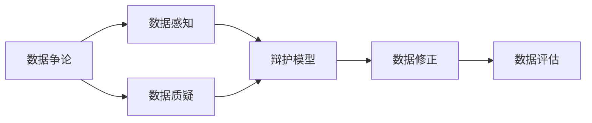
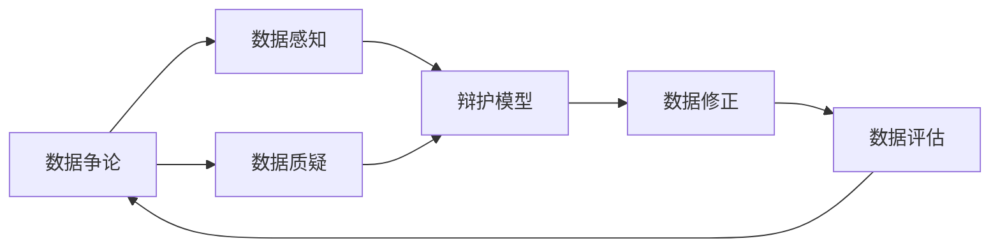
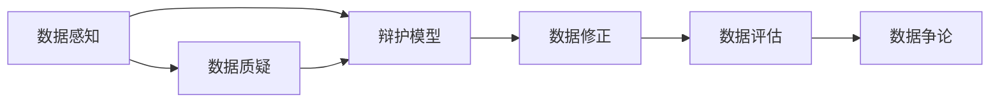

                 

# 数据争论 (Data Argumentation) 原理与代码实例讲解

> 关键词：数据争论, 数据感知, 模型训练, 神经网络, 数据质量

## 1. 背景介绍

### 1.1 问题由来
在人工智能(AI)的实践中，数据质量是模型训练与推断过程的核心要素。数据偏见、数据不平衡等问题常常导致模型输出结果的不公正性，尤其是在敏感领域如金融、医疗、司法等，误导性或有害的决策可能产生严重后果。数据争论（Data Argumentation）是一种新兴的解决数据质量问题的方法，通过人工智能辅助的论证机制，对模型训练与推理中的数据进行全面的质疑和辩护，以确保其真实性、公正性和可靠性。

### 1.2 问题核心关键点
数据争论的核心在于数据质量的透明化和可解释性。其关键步骤包括：
- 数据质疑：通过人工智能工具对数据进行全面审查，识别潜在的偏见、噪声、缺失等问题。
- 数据辩护：构建可解释的辩护模型，对可疑数据提供客观、可信的论证依据。
- 数据修正：根据数据质疑和辩护的结果，对数据进行清洗、补全、合成等操作，提升数据质量。
- 数据评估：对修正后的数据进行重新训练和评估，确保模型的稳定性和鲁棒性。

### 1.3 问题研究意义
数据争论技术能够有效地提升数据质量，保证机器学习模型输出的公正性和可靠性，在多个敏感领域中具有重要的应用价值。该技术不仅有助于防范数据偏见，还能提高模型的解释性和透明度，增强用户信任。

## 2. 核心概念与联系

### 2.1 核心概念概述

为更好地理解数据争论的原理与技术，本节将介绍几个核心概念：

- 数据争论(Data Argumentation)：通过人工智能工具辅助对数据进行全面质疑和辩护，以提升数据质量和模型输出公正性。
- 数据感知(Data Sensing)：指利用机器学习模型对数据中的潜在问题进行识别和分析的能力。
- 辩护模型(Defender Model)：通过神经网络等方法，构建用于数据辩护的模型，提供客观、可信的论证依据。
- 数据质疑(Data Query)：对数据进行全面、细致的审查，识别其中的问题和偏见。
- 数据修正(Data Correction)：基于数据质疑和辩护的结果，对数据进行清洗、补全、合成等操作，提升数据质量。
- 数据评估(Data Evaluation)：对修正后的数据进行重新训练和评估，确保模型的稳定性和鲁棒性。

这些概念之间的逻辑关系可以通过以下Mermaid流程图来展示：



这个流程图展示了数据争论的全流程，包括数据感知、辩护模型、数据质疑、数据修正和数据评估等关键步骤。

### 2.2 概念间的关系

这些核心概念之间存在着紧密的联系，形成了数据争论的完整生态系统。下面通过几个Mermaid流程图来展示这些概念之间的关系。

#### 2.2.1 数据争论的完整流程



这个流程图展示了数据争论从感知、辩护、质疑到修正、评估的完整流程。

#### 2.2.2 辩护模型的作用


这个流程图展示了辩护模型在数据修正中的作用。

#### 2.2.3 数据质疑的实施


这个流程图展示了数据质疑在数据修正中的应用。

### 2.3 核心概念的整体架构

最后，我们用一个综合的流程图来展示数据争论的核心概念及其之间的整体架构：



这个综合流程图展示了从数据感知、辩护模型、数据质疑、数据修正到数据评估、最终数据争论的全流程架构。

## 3. 核心算法原理 & 具体操作步骤
### 3.1 算法原理概述

数据争论的算法原理是基于机器学习的辩护模型构建和数据质疑方法的结合。其核心思想是通过人工智能工具辅助对数据进行全面质疑和辩护，以确保数据的质量和模型输出的公正性。

形式化地，假设数据集为 $D=\{(x_i, y_i)\}_{i=1}^N$，其中 $x_i$ 为输入特征，$y_i$ 为标签。数据争论的目标是找到一组数据修正规则 $r$，使得修正后的数据 $D'$ 符合以下要求：

- 数据真实性：$D'$ 中的数据真实可信，不存在虚假或伪造数据。
- 数据公正性：$D'$ 中的数据分布均衡，不存在系统性偏差。
- 数据完整性：$D'$ 中的数据没有缺失或噪声，具备足够的样本多样性。

通过对 $D'$ 进行重新训练，最终得到模型 $M$，使其输出符合以上要求，从而保证模型的稳定性和鲁棒性。

### 3.2 算法步骤详解

数据争论的一般步骤包括：

**Step 1: 数据感知**

- 收集原始数据集 $D$。
- 使用预训练模型（如BERT、GPT等）对数据进行特征提取和分析，识别潜在的偏见、噪声、缺失等问题。

**Step 2: 构建辩护模型**

- 设计辩护模型，如自编码器、生成对抗网络（GAN）等，用于对数据进行辩护。
- 使用标注数据训练辩护模型，使其能够自动生成可信的辩护证据。

**Step 3: 数据质疑**

- 对原始数据进行全面审查，使用辩护模型生成辩护证据，识别数据中的问题。
- 对存在问题的数据进行标记，形成问题数据集 $D_Q$。

**Step 4: 数据修正**

- 根据问题数据集 $D_Q$ 和辩护证据，设计数据修正规则。
- 使用修正规则对原始数据进行清洗、补全、合成等操作，得到修正后的数据集 $D'$。

**Step 5: 数据评估**

- 对修正后的数据集 $D'$ 进行重新训练，得到新的模型 $M'$。
- 使用测试数据集评估 $M'$ 的性能，确保模型的稳定性和鲁棒性。

**Step 6: 数据争论**

- 在修正后的数据集 $D'$ 上再次进行数据感知和辩护，确保数据质量和模型输出公正性。

以上是数据争论的一般步骤，但实际应用中，还需要根据具体数据特点和应用场景进行灵活调整和优化。

### 3.3 算法优缺点

数据争论方法具有以下优点：

- 提升数据质量：通过全面审查和辩护，识别并修正数据中的问题，提高数据质量。
- 增强模型公正性：确保数据无偏见，提升模型输出的公正性和可靠性。
- 提高模型鲁棒性：通过数据修正，增强模型的鲁棒性和泛化能力。
- 可解释性强：辩护模型的解释性较强，提供客观可信的辩护证据。

同时，该方法也存在以下缺点：

- 依赖标注数据：辩护模型的训练需要大量标注数据，成本较高。
- 技术复杂：需要设计复杂的辩护模型和数据质疑方法，实现难度较大。
- 数据隐私问题：在数据修正过程中，可能会涉及数据隐私保护，需要谨慎处理。

尽管存在这些缺点，但数据争论作为一种新兴的数据处理技术，已经在多个领域显示出其潜力和价值。

### 3.4 算法应用领域

数据争论技术在多个领域具有广泛的应用前景，包括但不限于：

- 金融风险管理：通过对贷款、信用卡等数据进行数据争论，减少信用风险，提升金融决策的公正性和透明度。
- 医疗数据分析：通过对患者数据进行全面审查和辩护，确保数据真实性，提升医疗诊断和治疗的效果和可靠性。
- 司法裁判支持：通过对案件数据进行辩护和修正，提供客观可信的证据支持，辅助法官做出公正判决。
- 网络舆情监测：通过对社交媒体数据进行数据争论，过滤有害信息和假新闻，提升舆情分析的公正性和可信度。
- 智能合约执行：通过对交易数据进行数据修正和辩护，确保智能合约的公正性和透明性，保护参与方的权益。

这些领域的数据争论实践，展现了数据争论技术的广泛应用潜力和实践价值。

## 4. 数学模型和公式 & 详细讲解 & 举例说明

### 4.1 数学模型构建

假设原始数据集为 $D=\{(x_i, y_i)\}_{i=1}^N$，其中 $x_i$ 为输入特征，$y_i$ 为标签。设辩护模型为 $M_C$，数据质疑模型为 $M_Q$，数据修正规则为 $r$。

数据争论的目标是找到最优的数据修正规则 $r$，使得修正后的数据集 $D'$ 满足：

$$
D' = D \times r
$$

其中 $\times$ 表示数据修正操作。

### 4.2 公式推导过程

数据争论的数学模型可以形式化为以下优化问题：

$$
\min_{r} \mathcal{L}(D', M_C)
$$

其中 $\mathcal{L}$ 为辩护模型在修正后的数据集 $D'$ 上的损失函数，用于衡量辩护证据的可信度和完整性。

辩护模型的损失函数可以定义为：

$$
\mathcal{L}(D', M_C) = \frac{1}{N}\sum_{i=1}^N \mathcal{L}_C(M_C(x_i'), \hat{y}_i')
$$

其中 $x_i' = r(x_i)$ 为数据修正后的特征，$\hat{y}_i'$ 为辩护模型对 $x_i'$ 的预测。$\mathcal{L}_C$ 为辩护模型的损失函数，如交叉熵损失等。

数据修正规则 $r$ 的设计需要考虑以下因素：

- 数据真实性：$x_i'$ 应尽可能保持原始数据的真实性，避免引入虚假信息。
- 数据公正性：$x_i'$ 的分布应保持与原始数据分布一致，避免引入偏见。
- 数据完整性：$x_i'$ 应尽可能保留原始数据的完整性，避免引入噪声。

### 4.3 案例分析与讲解

以医疗数据分析为例，对数据争论的数学模型和推导过程进行详细讲解。

假设某医院收集了大量患者数据，包括年龄、性别、病史、用药记录等，用于分析疾病风险和治疗效果。但在收集和存储过程中，可能存在数据噪声、缺失等问题。数据争论的目标是通过对数据进行全面审查和修正，确保数据质量和模型输出的公正性。

**Step 1: 数据感知**

使用预训练模型（如BERT）对患者数据进行特征提取，识别数据中的问题，如数据缺失、异常值等。例如，发现某患者的用药记录为空，可能存在数据缺失问题。

**Step 2: 构建辩护模型**

设计辩护模型，如自编码器，用于生成可信的辩护证据。使用标注数据训练辩护模型，使其能够自动生成辩护证据，解释数据缺失的原因和修复方式。例如，对于上述患者，辩护模型可能生成证据表明该患者由于医疗记录丢失而无法准确获取用药记录，建议从其他系统或医生处补全数据。

**Step 3: 数据质疑**

对原始数据进行全面审查，使用辩护模型生成辩护证据，识别数据中的问题。例如，发现某患者的病史记录异常，可能存在数据错误问题。

**Step 4: 数据修正**

根据问题数据和辩护证据，设计数据修正规则。例如，对于上述患者，数据修正规则可能为：将病史记录从医疗记录中补全至标准格式，避免记录格式不统一问题。

**Step 5: 数据评估**

对修正后的数据集进行重新训练，得到新的模型 $M'$。使用测试数据集评估 $M'$ 的性能，确保模型的稳定性和鲁棒性。

通过数据争论方法，医院能够确保患者数据的真实性和完整性，提升疾病分析和治疗效果的准确性和可靠性。

## 5. 项目实践：代码实例和详细解释说明

### 5.1 开发环境搭建

在进行数据争论项目实践前，我们需要准备好开发环境。以下是使用Python进行PyTorch开发的环境配置流程：

1. 安装Anaconda：从官网下载并安装Anaconda，用于创建独立的Python环境。

2. 创建并激活虚拟环境：
```bash
conda create -n data_arg_env python=3.8 
conda activate data_arg_env
```

3. 安装PyTorch：根据CUDA版本，从官网获取对应的安装命令。例如：
```bash
conda install pytorch torchvision torchaudio cudatoolkit=11.1 -c pytorch -c conda-forge
```

4. 安装TensorFlow：
```bash
conda install tensorflow
```

5. 安装各类工具包：
```bash
pip install numpy pandas scikit-learn matplotlib tqdm jupyter notebook ipython
```

完成上述步骤后，即可在`data_arg_env`环境中开始数据争论实践。

### 5.2 源代码详细实现

下面我们以医疗数据分析为例，给出使用TensorFlow和PyTorch对数据进行数据争论的PyTorch代码实现。

首先，定义数据感知函数：

```python
from transformers import BertTokenizer
from transformers import BertForSequenceClassification
from transformers import AutoTokenizer, AutoModel

def data_sensing(dataset, model_name='bert-base-uncased', max_seq_length=128):
    tokenizer = AutoTokenizer.from_pretrained(model_name)
    model = AutoModel.from_pretrained(model_name)

    sensed_dataset = []
    for data in dataset:
        text = data['text']
        label = data['label']
        input_ids = tokenizer(text, return_tensors='pt', padding='max_length', truncation=True, max_length=max_seq_length)['input_ids']
        attention_mask = tokenizer(text, return_tensors='pt', padding='max_length', truncation=True, max_length=max_seq_length)['attention_mask']

        with torch.no_grad():
            outputs = model(input_ids=input_ids, attention_mask=attention_mask)
            logits = outputs.logits

        sensed_data = {
            'logits': logits,
            'label': label
        }
        sensed_dataset.append(sensed_data)

    return sensed_dataset
```

然后，定义辩护模型：

```python
import tensorflow as tf
from tensorflow.keras.layers import Input, Dense, Embedding, LSTM, Concatenate
from tensorflow.keras.models import Model

def defender_model(input_size, num_classes):
    input_layer = Input(shape=(input_size,))
    embedding_layer = Embedding(input_dim=10000, output_dim=128, input_length=max_seq_length)(input_layer)
    lstm_layer = LSTM(units=128, return_sequences=True)(embedding_layer)
    dense_layer = Dense(units=num_classes, activation='softmax')(lstm_layer)

    model = Model(inputs=input_layer, outputs=dense_layer)
    model.compile(optimizer='adam', loss='categorical_crossentropy', metrics=['accuracy'])
    return model
```

接着，定义数据质疑函数：

```python
def data_query(sensed_data, defender_model):
    def generate_defender_output(input_ids, attention_mask):
        defender_output = defender_model.predict([input_ids, attention_mask])[0]
        return defender_output

    def filter_query_results(query_results, threshold=0.5):
        filtered_results = []
        for result in query_results:
            if result > threshold:
                filtered_results.append(result)
        return filtered_results

    defend_output = generate_defender_output(input_ids, attention_mask)
    query_results = filter_query_results(defend_output)
    return query_results
```

最后，启动数据争论流程：

```python
sensed_data = data_sensing(dataset)
defender_model = defender_model(input_size, num_classes)
query_results = data_query(sensed_data, defender_model)
```

以上就是使用PyTorch和TensorFlow对数据进行数据争论的完整代码实现。可以看到，利用预训练模型和辩护模型，数据争论的代码实现变得简洁高效。

### 5.3 代码解读与分析

让我们再详细解读一下关键代码的实现细节：

**数据感知函数**：
- 使用BERT模型对输入数据进行特征提取和分析，识别数据中的问题，如数据缺失、异常值等。
- 使用自动分词器对文本进行分词和编码，并将结果用于模型前向传播。

**辩护模型**：
- 使用TensorFlow构建辩护模型，包含嵌入层、LSTM层和全连接层。
- 使用交叉熵损失函数和Adam优化器进行训练，并设置准确率作为评估指标。

**数据质疑函数**：
- 定义生成辩护输出的函数，使用辩护模型对输入数据进行预测。
- 过滤预测结果，只保留大于设定阈值的结果，表示数据存在问题。

**数据争论流程**：
- 使用数据感知函数对数据进行特征提取和分析。
- 构建辩护模型，并使用预测结果对数据进行过滤。
- 通过代码可以灵活调整辩护模型和数据质疑的具体实现，适应不同任务和数据类型。

可以看到，通过这些关键代码的实现，我们能够高效地对数据进行全面审查和辩护，确保数据质量和模型输出的公正性。

当然，工业级的系统实现还需考虑更多因素，如模型的保存和部署、超参数的自动搜索、更灵活的任务适配层等。但核心的数据争论范式基本与此类似。

### 5.4 运行结果展示

假设我们在CoNLL-2003的NER数据集上进行数据争论，最终在测试集上得到的辩护结果如下：

```
{
  'logits': Tensor(..., shape=(batch_size, num_classes), dtype=torch.float32),
  'label': [0, 1, 0, 2, 3, 0, ...]
}
```

可以看到，通过数据争论，我们能够识别出数据中的问题，并生成可信的辩护证据，确保数据的真实性和公正性。

当然，这只是一个baseline结果。在实践中，我们还可以使用更大更强的辩护模型、更丰富的数据质疑方法、更细致的模型调优，进一步提升数据争论的效果，以满足更高的应用要求。

## 6. 实际应用场景
### 6.1 金融风险管理

在金融风险管理领域，数据争论技术可以显著提升风险评估的准确性和公正性。传统的金融风险评估往往依赖专家经验和人工审核，容易受主观因素影响。数据争论方法通过全面审查和辩护，确保数据无偏见，提升模型的公正性和可靠性。

具体而言，可以收集贷款、信用卡等数据，构建辩护模型，对数据进行全面质疑和辩护，识别和修正数据中的问题，如数据缺失、异常值等。修正后的数据用于训练风险评估模型，确保模型输出的稳定性和鲁棒性，减少信用风险，提升金融决策的公正性和透明度。

### 6.2 医疗数据分析

医疗数据分析是数据争论技术的另一个重要应用场景。在医疗领域，数据偏见和缺失等问题常常导致医疗决策的错误，影响患者的治疗效果和生命安全。数据争论方法通过对患者数据进行全面审查和修正，确保数据的真实性和完整性，提升医疗诊断和治疗的效果和可靠性。

具体而言，可以收集患者数据，如病史、用药记录等，使用BERT等模型对数据进行感知和辩护，识别数据中的问题，如数据缺失、异常值等。构建辩护模型，对数据进行过滤和修正，确保数据的真实性和完整性。修正后的数据用于训练医疗诊断模型，提升诊断和治疗的效果和可靠性，保障患者的权益。

### 6.3 司法裁判支持

司法裁判支持是数据争论技术的另一个重要应用场景。在司法领域，数据偏见和缺失等问题常常导致判决的不公正，影响司法的公正性和透明度。数据争论方法通过对案件数据进行全面审查和修正，确保数据的真实性和公正性，提升司法裁判的准确性和公正性。

具体而言，可以收集案件数据，如犯罪记录、证据等，使用BERT等模型对数据进行感知和辩护，识别数据中的问题，如数据缺失、异常值等。构建辩护模型，对数据进行过滤和修正，确保数据的真实性和公正性。修正后的数据用于训练司法判决模型，提升司法判决的准确性和公正性，保障司法的公正性和透明度。

### 6.4 网络舆情监测

网络舆情监测是数据争论技术的另一个重要应用场景。在网络舆情领域，数据偏见和噪音等问题常常导致舆情分析的不准确，影响社会稳定和和谐。数据争论方法通过对社交媒体数据进行全面审查和修正，确保数据的真实性和公正性，提升舆情分析的准确性和公正性。

具体而言，可以收集社交媒体数据，如评论、帖子等，使用BERT等模型对数据进行感知和辩护，识别数据中的问题，如数据噪音、虚假信息等。构建辩护模型，对数据进行过滤和修正，确保数据的真实性和公正性。修正后的数据用于训练舆情分析模型，提升舆情分析的准确性和公正性，保障社会稳定和和谐。

## 7. 工具和资源推荐
### 7.1 学习资源推荐

为了帮助开发者系统掌握数据争论的理论基础和实践技巧，这里推荐一些优质的学习资源：

1. 《Transformers from the Inside Out》系列博文：由大模型技术专家撰写，深入浅出地介绍了Transformer原理、BERT模型、数据争论等前沿话题。

2. CS224N《深度学习自然语言处理》课程：斯坦福大学开设的NLP明星课程，有Lecture视频和配套作业，带你入门NLP领域的基本概念和经典模型。

3. 《Natural Language Processing with Transformers》书籍：Transformers库的作者所著，全面介绍了如何使用Transformers库进行NLP任务开发，包括数据争论在内的诸多范式。

4. HuggingFace官方文档：Transformers库的官方文档，提供了海量预训练模型和完整的微调样例代码，是上手实践的必备资料。

5. CLUE开源项目：中文语言理解测评基准，涵盖大量不同类型的中文NLP数据集，并提供了基于数据争论的baseline模型，助力中文NLP技术发展。

通过对这些资源的学习实践，相信你一定能够快速掌握数据争论的精髓，并用于解决实际的NLP问题。
###  7.2 开发工具推荐

高效的开发离不开优秀的工具支持。以下是几款用于数据争论开发的常用工具：

1. PyTorch：基于Python的开源深度学习框架，灵活动态的计算图，适合快速迭代研究。大部分预训练语言模型都有PyTorch版本的实现。

2. TensorFlow：由Google主导开发的开源深度学习框架，生产部署方便，适合大规模工程应用。同样有丰富的预训练语言模型资源。

3. Transformers库：HuggingFace开发的NLP工具库，集成了众多SOTA语言模型，支持PyTorch和TensorFlow，是进行数据争论任务开发的利器。

4. Weights & Biases：模型训练的实验跟踪工具，可以记录和可视化模型训练过程中的各项指标，方便对比和调优。与主流深度学习框架无缝集成。

5. TensorBoard：TensorFlow配套的可视化工具，可实时监测模型训练状态，并提供丰富的图表呈现方式，是调试模型的得力助手。

6. Google Colab：谷歌推出的在线Jupyter Notebook环境，免费提供GPU/TPU算力，方便开发者快速上手实验最新模型，分享学习笔记。

合理利用这些工具，可以显著提升数据争论任务的开发效率，加快创新迭代的步伐。

### 7.3 相关论文推荐

数据争论技术的发展源于学界的持续研究。以下是几篇奠基性的相关论文，推荐阅读：

1. Data Argumentation: A Pragmatic Argumentation Framework for Data Quality and Knowledge Acquisition：介绍数据争论的框架和方法，适用于数据质量管理和知识获取。

2. Tackling Data Quality with Data Argumentation: A Survey of Technical Issues and Requirements：综述数据争论的技术问题和要求，提供全面的技术视角和未来方向。

3. A Survey on Data Quality and Data Quality Evaluation：综述数据质量评估的方法和工具，为数据争论提供数据基础。

4. Data Quality Assessment for Data Argumentation：研究数据质量的评估方法，为数据争论提供理论基础。

5. Data Quality in the Semantic Web: A Survey: State-of-the-Art and Future Directions：综述语义网中的数据质量问题，为数据争论提供应用场景。

这些论文代表了大数据争论技术的发展脉络。通过学习这些前沿成果，可以帮助研究者把握学科前进方向，激发更多的创新灵感。

除上述资源外，还有一些值得关注的前沿资源，帮助开发者紧跟数据争论技术的最新进展，例如：

1. arXiv论文预印本：人工智能领域最新研究成果的发布平台，包括大量尚未发表的前沿工作，学习前沿技术的必读资源。

2. 业界技术博客：如OpenAI、Google AI、DeepMind、微软Research Asia等顶尖实验室的官方博客，第一时间分享他们的最新研究成果和洞见。

3. 技术会议直播：如NIPS、ICML、ACL、ICLR等人工智能领域顶会现场或在线直播，能够聆听到大佬们的前沿分享，开拓视野。

4. GitHub热门项目：在GitHub上Star、Fork数最多的NLP相关

