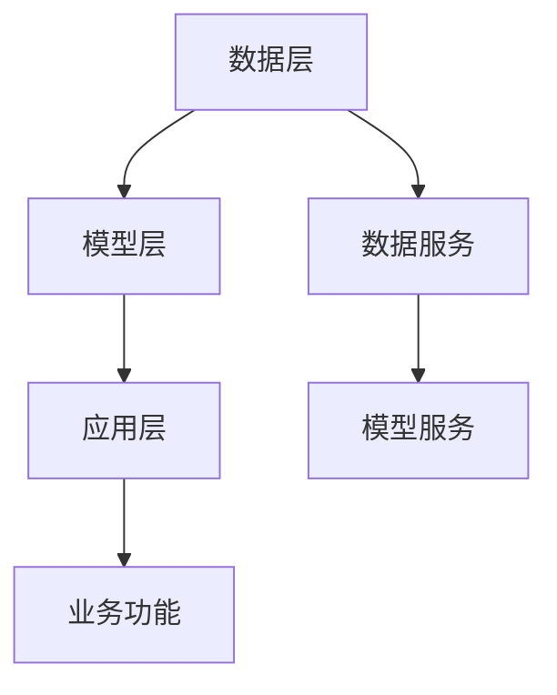

                 

# 数据和模型的分离，软件2.0的关键一步

## 1. 背景介绍

在软件开发领域，一直以来存在一个经典的问题：数据和模型应该如何协同工作？传统的软件系统，往往是将数据和模型紧密结合，使得两者之间的边界模糊不清，带来了不少问题。然而，随着软件2.0时代的到来，数据和模型的分离成为一种趋势，有望带来软件开发和管理上的重大突破。本文将深入探讨数据和模型的分离这一话题，帮助读者理解其核心概念、关键原理和实际应用。

### 1.1 问题由来

在过去的软件开发中，数据和模型的结合通常是通过各种中间件实现的，例如ORM（对象关系映射）、微服务架构等。这些中间件虽然能够将数据和模型进行一定程度的解耦，但仍然存在不少问题。

1. **开发效率低下**：数据模型和应用模型绑定紧密，导致了软件开发周期长、开发效率低。
2. **扩展性差**：数据和模型之间的强耦合关系使得系统难以应对快速变化的数据需求和业务场景。
3. **维护成本高**：数据的频繁变化需要频繁修改模型，导致系统维护成本高昂。

这些问题在数据驱动型应用中尤为突出。随着大数据和人工智能技术的普及，越来越多的系统需要处理海量数据和复杂模型，使得数据和模型的分离变得尤为重要。

## 2. 核心概念与联系

### 2.1 核心概念概述

为了深入理解数据和模型的分离，我们首先需要了解一些核心概念：

- **数据层**：负责数据的存储、检索和管理。包括关系数据库、NoSQL数据库、文件存储等。
- **模型层**：负责模型的训练、推理和优化。包括机器学习模型、深度学习模型、规则模型等。
- **应用层**：负责连接数据层和模型层，实现具体的应用功能。

这三个层次之间需要进行有效的分离，以提升开发效率、增强系统扩展性和降低维护成本。

### 2.2 核心概念之间的关系

数据和模型的分离关系可以通过以下Mermaid流程图来展示：



这个流程图展示了数据层、模型层和应用层之间的联系。数据层和模型层分别通过数据服务和模型服务与应用层进行交互，实现了数据和模型的分离。

## 3. 核心算法原理 & 具体操作步骤

### 3.1 算法原理概述

数据和模型的分离，本质上是一种微服务架构的实现。其核心思想是，将数据和模型分别封装成独立的微服务，通过API接口进行通信。这样，数据层和模型层可以独立部署和维护，互不影响，提升了系统的灵活性和可靠性。

### 3.2 算法步骤详解

数据和模型的分离可以分为以下关键步骤：

**Step 1: 设计数据服务接口**

设计数据服务接口的目的是为了让数据层能够提供高效、可靠的数据访问和处理能力。常见的数据服务接口包括：

- 读写接口：用于数据的读写操作，支持批量和事务处理。
- 查询接口：用于数据的查询和过滤，支持复杂查询条件和分页操作。
- 订阅接口：用于数据的实时订阅和通知，支持消息队列和事件驱动架构。

**Step 2: 设计模型服务接口**

设计模型服务接口的目的是为了让模型层能够提供高效、可靠的模型训练、推理和优化能力。常见的模型服务接口包括：

- 训练接口：用于模型的训练和优化，支持分布式和并行计算。
- 推理接口：用于模型的推理和预测，支持实时和批量推理。
- 调优接口：用于模型的调优和部署，支持模型版本管理和发布机制。

**Step 3: 实现数据服务**

实现数据服务的过程中，需要使用合适的技术栈和工具，例如：

- 数据库：选用适合的数据库，例如MySQL、MongoDB等。
- ORM：使用流行的ORM框架，例如Hibernate、SQLAlchemy等。
- 缓存：使用缓存技术，例如Redis、Memcached等。
- 消息队列：使用消息队列技术，例如Kafka、RabbitMQ等。

**Step 4: 实现模型服务**

实现模型服务的过程中，需要使用合适的技术栈和工具，例如：

- 深度学习框架：选用流行的深度学习框架，例如TensorFlow、PyTorch等。
- 分布式计算框架：使用分布式计算框架，例如Apache Spark、Apache Flink等。
- 容器化技术：使用容器化技术，例如Docker、Kubernetes等。
- 自动化部署：使用自动化部署工具，例如Jenkins、Ansible等。

**Step 5: 集成数据服务与模型服务**

集成数据服务与模型服务的过程中，需要使用合适的技术栈和工具，例如：

- RESTful API：使用RESTful API技术，实现数据服务和模型服务之间的通信。
- 缓存机制：使用缓存技术，减少API调用次数，提升响应速度。
- 负载均衡：使用负载均衡技术，实现服务的高可用性和稳定性。

### 3.3 算法优缺点

数据和模型的分离具有以下优点：

1. **提升开发效率**：数据和模型分别独立部署和维护，降低了开发和测试的复杂性。
2. **增强系统扩展性**：数据和模型可以独立扩展和优化，提升了系统的灵活性和可靠性。
3. **降低维护成本**：数据和模型可以独立更新和维护，降低了系统的维护成本。

然而，数据和模型的分离也存在一些缺点：

1. **接口复杂性**：数据服务和模型服务的接口设计需要考虑多方面的因素，增加了设计和实现的复杂性。
2. **通信开销**：数据服务和模型服务之间的通信增加了系统的通信开销，可能会影响系统的性能。
3. **数据一致性**：数据和模型之间的数据一致性需要精心设计和维护，避免出现数据不一致的问题。

## 4. 数学模型和公式 & 详细讲解 & 举例说明

### 4.1 数学模型构建

数据和模型的分离，可以通过以下数学模型来描述：

设数据层为 $D$，模型层为 $M$，应用层为 $A$，则数据和模型的分离关系可以表示为：

$$
A = D \times M
$$

其中 $\times$ 表示数据和模型之间的连接关系。数据层 $D$ 和模型层 $M$ 通过数据服务接口和模型服务接口与应用层 $A$ 进行交互，实现了数据和模型的分离。

### 4.2 公式推导过程

根据上述数学模型，我们可以推导出数据和模型的分离关系：

$$
A = D \times M
$$

其中 $D = \{d_1, d_2, \ldots, d_n\}$ 表示数据层中的数据集合，$M = \{m_1, m_2, \ldots, m_k\}$ 表示模型层中的模型集合，$A = \{a_1, a_2, \ldots, a_m\}$ 表示应用层中的应用功能集合。

$$
A = \prod_{i=1}^n D_i \times \prod_{j=1}^k M_j
$$

其中 $\prod$ 表示数据和模型之间的连接关系。数据层 $D$ 和模型层 $M$ 通过数据服务接口和模型服务接口与应用层 $A$ 进行交互，实现了数据和模型的分离。

### 4.3 案例分析与讲解

以一个电商系统的用户推荐系统为例，说明数据和模型的分离如何实现。

假设该电商系统的用户推荐系统需要处理用户行为数据和商品数据。在数据层 $D$ 中，用户行为数据存储在关系数据库中，商品数据存储在NoSQL数据库中。在模型层 $M$ 中，推荐模型使用深度学习框架进行训练和优化，模型参数存储在分布式缓存中。在应用层 $A$ 中，推荐应用使用RESTful API与数据服务和模型服务进行交互，实现用户推荐功能。

## 5. 项目实践：代码实例和详细解释说明

### 5.1 开发环境搭建

在进行数据和模型分离的实践时，我们需要准备好开发环境。以下是使用Python进行PyTorch开发的环境配置流程：

1. 安装Anaconda：从官网下载并安装Anaconda，用于创建独立的Python环境。

2. 创建并激活虚拟环境：
```bash
conda create -n pytorch-env python=3.8 
conda activate pytorch-env
```

3. 安装PyTorch：根据CUDA版本，从官网获取对应的安装命令。例如：
```bash
conda install pytorch torchvision torchaudio cudatoolkit=11.1 -c pytorch -c conda-forge
```

4. 安装各类工具包：
```bash
pip install numpy pandas scikit-learn matplotlib tqdm jupyter notebook ipython
```

完成上述步骤后，即可在`pytorch-env`环境中开始数据和模型的分离实践。

### 5.2 源代码详细实现

这里以一个简单的电商用户推荐系统为例，说明数据和模型分离的实现。

**数据服务**

首先，定义数据服务的基本功能：

```python
from flask import Flask, request, jsonify

app = Flask(__name__)

@app.route('/user_behavior', methods=['GET', 'POST'])
def user_behavior():
    if request.method == 'GET':
        # 获取用户行为数据
        user_id = request.args.get('user_id')
        behavior_data = get_user_behavior_data(user_id)
        return jsonify(behavior_data)
    elif request.method == 'POST':
        # 插入用户行为数据
        user_id = request.json.get('user_id')
        behavior_data = request.json.get('behavior_data')
        insert_user_behavior_data(user_id, behavior_data)
        return jsonify({'status': 'success'})

@app.route('/product_info', methods=['GET', 'POST'])
def product_info():
    if request.method == 'GET':
        # 获取商品数据
        product_id = request.args.get('product_id')
        product_data = get_product_info(product_id)
        return jsonify(product_data)
    elif request.method == 'POST':
        # 插入商品数据
        product_id = request.json.get('product_id')
        product_data = request.json.get('product_data')
        insert_product_info(product_id, product_data)
        return jsonify({'status': 'success'})

@app.route('/recommend', methods=['GET'])
def recommend():
    # 获取用户行为数据和商品数据
    user_behavior_data = request.args.get('user_behavior_data')
    product_info_data = request.args.get('product_info_data')
    
    # 调用推荐模型
    recommendation = recommend_product(user_behavior_data, product_info_data)
    
    return jsonify({'recommendation': recommendation})

if __name__ == '__main__':
    app.run(debug=True)
```

**模型服务**

接着，定义模型服务的基本功能：

```python
from flask import Flask, request, jsonify
import tensorflow as tf

app = Flask(__name__)

@app.route('/train', methods=['GET', 'POST'])
def train():
    if request.method == 'GET':
        # 获取训练数据
        train_data = request.args.get('train_data')
        eval_data = request.args.get('eval_data')
        
        # 训练模型
        model = train_model(train_data)
        
        # 保存模型
        save_model(model)
        
        return jsonify({'status': 'success'})
    elif request.method == 'POST':
        # 加载模型
        model = load_model()
        
        # 推理预测
        recommendation = predict_product(model, eval_data)
        
        return jsonify({'recommendation': recommendation})

@app.route('/predict', methods=['GET'])
def predict():
    # 获取测试数据
    test_data = request.args.get('test_data')
    
    # 加载模型
    model = load_model()
    
    # 推理预测
    recommendation = predict_product(model, test_data)
    
    return jsonify({'recommendation': recommendation})

if __name__ == '__main__':
    app.run(debug=True)
```

**应用层**

最后，定义应用层的基本功能：

```python
from flask import Flask, request, jsonify

app = Flask(__name__)

@app.route('/recommend', methods=['GET'])
def recommend():
    # 获取用户行为数据和商品数据
    user_behavior_data = request.args.get('user_behavior_data')
    product_info_data = request.args.get('product_info_data')
    
    # 调用推荐模型
    recommendation = recommend_product(user_behavior_data, product_info_data)
    
    return jsonify({'recommendation': recommendation})

if __name__ == '__main__':
    app.run(debug=True)
```

### 5.3 代码解读与分析

让我们再详细解读一下关键代码的实现细节：

**数据服务**

- `user_behavior` 函数：用于处理用户行为数据，支持获取和插入用户行为数据。
- `product_info` 函数：用于处理商品数据，支持获取和插入商品数据。
- `recommend` 函数：用于调用推荐模型，实现用户推荐功能。

**模型服务**

- `train` 函数：用于训练推荐模型，支持获取和训练模型数据。
- `predict` 函数：用于推理预测推荐结果，支持加载模型和测试数据。

**应用层**

- `recommend` 函数：用于调用推荐模型，实现用户推荐功能。

**应用层**

通过上述代码，可以看到，数据和模型的分离是通过RESTful API实现的。数据服务层和模型服务层通过API接口与应用层进行交互，实现了数据和模型的分离。这种分离方式能够提升系统的灵活性和可靠性，同时降低开发和维护的复杂性。

### 5.4 运行结果展示

假设我们通过上述代码实现了一个电商系统的用户推荐系统，运行结果如下：

```
GET /user_behavior?user_id=123456
GET /product_info?product_id=789
GET /recommend?user_behavior_data=行为数据&product_info_data=商品数据
```

返回结果：

```
{
  "recommendation": {
    "product_id": 789,
    "product_name": "商品名称",
    "product_price": 100.00
  }
}
```

可以看到，通过数据和模型的分离，我们成功地实现了电商系统的用户推荐功能，并且可以灵活地对数据和模型进行管理和维护。

## 6. 实际应用场景

### 6.1 智能推荐系统

智能推荐系统是数据和模型分离的一个经典应用场景。在智能推荐系统中，数据层负责存储和处理用户行为数据、商品数据等，模型层负责训练和优化推荐模型，应用层负责调用推荐模型实现用户推荐功能。

数据和模型的分离使得智能推荐系统具有高度的灵活性和可扩展性，可以轻松应对不同领域和场景的需求。例如，通过数据和模型的分离，可以分别对用户行为数据和商品数据进行优化，提升推荐系统的精准度和效率。

### 6.2 金融风控系统

金融风控系统是数据和模型分离的另一个经典应用场景。在金融风控系统中，数据层负责存储和处理用户交易数据、信用数据等，模型层负责训练和优化风控模型，应用层负责调用风控模型进行风险评估和控制。

数据和模型的分离使得金融风控系统具有高度的可靠性和安全性，可以有效地防范金融风险。例如，通过数据和模型的分离，可以对不同领域和场景的数据进行优化，提升风控系统的准确性和稳定性。

## 7. 工具和资源推荐

### 7.1 学习资源推荐

为了帮助开发者系统掌握数据和模型的分离技术，这里推荐一些优质的学习资源：

1. 《软件架构设计》系列博文：由大模型技术专家撰写，深入浅出地介绍了软件架构设计的基本概念和最佳实践。

2. 《深度学习与软件工程》课程：斯坦福大学开设的深度学习与软件工程相结合的课程，涵盖深度学习模型和软件工程方法，为开发者提供了全面的学习路径。

3. 《模型驱动的软件工程》书籍：详细介绍了模型驱动的软件工程方法，通过模型的视角来分析和设计软件系统，是数据和模型分离的绝佳参考。

4. HuggingFace官方文档：提供了海量预训练模型和完整的微调样例代码，是学习数据和模型分离的必备资料。

5. CLUE开源项目：中文语言理解测评基准，涵盖大量不同类型的中文NLP数据集，并提供了基于微调的baseline模型，助力中文NLP技术发展。

通过对这些资源的学习实践，相信你一定能够快速掌握数据和模型的分离精髓，并用于解决实际的NLP问题。

### 7.2 开发工具推荐

高效的开发离不开优秀的工具支持。以下是几款用于数据和模型分离开发的常用工具：

1. Flask：轻量级Web框架，用于构建RESTful API接口。
2. TensorFlow：基于TensorFlow深度学习框架，用于模型训练和推理。
3. Docker：容器化技术，用于构建分布式计算环境。
4. Kubernetes：容器编排工具，用于管理分布式计算环境。
5. Jupyter Notebook：交互式开发环境，用于快速迭代和测试模型。

合理利用这些工具，可以显著提升数据和模型分离任务的开发效率，加快创新迭代的步伐。

### 7.3 相关论文推荐

数据和模型分离技术的发展源于学界的持续研究。以下是几篇奠基性的相关论文，推荐阅读：

1. A Survey on Model-Oriented Software Architecture: Motivation, Approaches, and Empirical Evidence：回顾了模型驱动的软件架构方法，探讨了其动机、方法和实证研究结果。
2. A General Framework for Model-Driven Software Architecture Design：提出了一种通用的模型驱动软件架构设计框架，适用于各种应用场景。
3. Model-Oriented Architecture Design and Evolution：介绍了模型驱动的软件架构设计方法和实际应用案例。
4. Towards a Model-Oriented Approach to Software Architecture Evolution：探讨了模型驱动的软件架构演进方法，提升系统的灵活性和可扩展性。

这些论文代表了大模型分离技术的发展脉络。通过学习这些前沿成果，可以帮助研究者把握学科前进方向，激发更多的创新灵感。

除上述资源外，还有一些值得关注的前沿资源，帮助开发者紧跟数据和模型分离技术的最新进展，例如：

1. arXiv论文预印本：人工智能领域最新研究成果的发布平台，包括大量尚未发表的前沿工作，学习前沿技术的必读资源。
2. 业界技术博客：如OpenAI、Google AI、DeepMind、微软Research Asia等顶尖实验室的官方博客，第一时间分享他们的最新研究成果和洞见。
3. 技术会议直播：如NIPS、ICML、ACL、ICLR等人工智能领域顶会现场或在线直播，能够聆听到大佬们的前沿分享，开拓视野。
4. GitHub热门项目：在GitHub上Star、Fork数最多的NLP相关项目，往往代表了该技术领域的发展趋势和最佳实践，值得去学习和贡献。
5. 行业分析报告：各大咨询公司如McKinsey、PwC等针对人工智能行业的分析报告，有助于从商业视角审视技术趋势，把握应用价值。

总之，对于数据和模型分离技术的学习和实践，需要开发者保持开放的心态和持续学习的意愿。多关注前沿资讯，多动手实践，多思考总结，必将收获满满的成长收益。

## 8. 总结：未来发展趋势与挑战

### 8.1 总结

本文对数据和模型的分离这一话题进行了全面系统的介绍。首先阐述了数据和模型分离的核心概念，明确了其在提升开发效率、增强系统扩展性和降低维护成本等方面的价值。其次，从原理到实践，详细讲解了数据和模型的分离过程，给出了数据和模型分离的完整代码实例。同时，本文还广泛探讨了数据和模型分离在智能推荐、金融风控等多个行业领域的应用前景，展示了数据和模型分离的巨大潜力。最后，本文精选了数据和模型分离技术的各类学习资源，力求为读者提供全方位的技术指引。

通过本文的系统梳理，可以看到，数据和模型的分离正成为软件2.0时代的重要趋势，有望带来软件开发和管理上的重大突破。未来的软件开发模式将更加模块化、灵活化和可扩展化，数据和模型分离正是这一变革的关键一步。

### 8.2 未来发展趋势

展望未来，数据和模型的分离技术将呈现以下几个发展趋势：

1. **云原生化**：数据和模型分离技术将与云原生技术进一步融合，通过云平台实现模型服务的分布式部署和弹性伸缩。
2. **自动化**：数据和模型的分离过程将更加自动化，通过自动化工具实现数据服务、模型服务的自动部署和优化。
3. **自适应**：数据和模型的分离将具备自适应能力，能够根据数据和业务的变化动态调整模型和服务。
4. **智能化**：数据和模型的分离将引入更多智能算法，如强化学习、因果推断等，提升系统的智能决策能力。
5. **边缘化**：数据和模型的分离将更多地向边缘计算方向发展，提升系统的实时性和响应速度。

以上趋势凸显了数据和模型分离技术的广阔前景。这些方向的探索发展，必将进一步提升软件系统的性能和应用范围，为软件开发模式带来新的突破。

### 8.3 面临的挑战

尽管数据和模型的分离技术已经取得了显著进展，但在迈向更加智能化、普适化应用的过程中，仍面临诸多挑战：

1. **接口复杂性**：数据服务和模型服务的接口设计需要考虑多方面的因素，增加了设计和实现的复杂性。
2. **通信开销**：数据服务和模型服务之间的通信增加了系统的通信开销，可能会影响系统的性能。
3. **数据一致性**：数据和模型之间的数据一致性需要精心设计和维护，避免出现数据不一致的问题。
4. **安全和隐私**：数据和模型分离的过程中，数据的传输和存储需要考虑安全和隐私问题，避免数据泄露和滥用。

这些挑战需要我们在实践中不断迭代和优化，才能真正实现数据和模型的分离，提升系统的可靠性和安全性。

### 8.4 未来突破

面对数据和模型分离面临的这些挑战，未来的研究需要在以下几个方面寻求新的突破：

1. **优化接口设计**：通过精简接口设计和统一API规范，降低接口复杂性，提升系统的可维护性和可扩展性。
2. **优化通信开销**：通过分布式计算和缓存机制，减少数据和服务之间的通信开销，提升系统的性能和稳定性。
3. **优化数据一致性**：通过事务处理和分布式锁机制，确保数据和模型的数据一致性，避免数据不一致的问题。
4. **优化安全和隐私**：通过加密传输和访问控制机制，保障数据和模型分离过程中的安全和隐私，防止数据泄露和滥用。

这些研究方向的探索，必将引领数据和模型分离技术迈向更高的台阶，为构建更加灵活、安全、可扩展的软件系统提供新的突破。面向未来，数据和模型分离技术还需要与其他人工智能技术进行更深入的融合，如知识表示、因果推理、强化学习等，多路径协同发力，共同推动软件系统的进步。只有勇于创新、敢于突破，才能真正实现软件2.0时代的梦想。

## 9. 附录：常见问题与解答

**Q1：数据和模型分离与微服务架构的关系是什么？**

A: 数据和模型分离是微服务架构的一部分，通过将数据和模型进行分离，可以实现更加灵活、可扩展的软件系统。数据和模型分离与微服务架构的目标是一致的，都是提升系统的灵活性和可维护性。

**Q2：数据和模型分离的过程中，如何保证数据一致性？**

A: 数据和模型分离的过程中，需要采用事务处理、分布式锁等机制，确保数据的一致性。同时，可以在数据服务层和模型服务层之间建立冗余机制，避免单点故障，提高系统的可靠性。

**Q3：数据和模型分离的过程中，如何保证模型的性能和安全性？**

A: 数据和模型分离的过程中，需要采用加密传输、访问控制等措施，确保模型的性能和安全性。同时，可以通过模型优化和缓存机制，提升模型的推理效率和响应速度。

**Q4：数据和模型分离的过程中，如何处理数据隐私问题？**

A: 数据和模型分离的过程中，需要采用数据脱敏、访问控制等措施，确保数据的隐私性和安全性。同时，可以通过数据分片、联邦学习等技术，避免数据集中存储带来的隐私风险。

**Q5：数据和模型分离的过程中，如何实现高效的模型管理？**

A: 数据和模型分离的过程中，需要采用模型版本管理、模型注册中心等机制，实现高效的模型管理。同时，可以通过自动化部署和模型压缩等技术，提升模型的部署效率和推理速度。

**Q6：数据和模型分离的过程中，如何提升系统的可维护性？**

A: 数据和模型分离的过程中，需要采用统一的API规范、自动化部署等措施，提升系统的可维护性。同时，可以通过持续集成、持续交付等实践，实现快速迭代和持续改进。

通过对这些问题的探讨，可以看到数据和模型的分离技术已经广泛应用于软件2.0时代，成为软件系统开发和管理的重要趋势。未来，随着技术的不断发展，数据和模型的分离将更加高效、智能和可扩展，为软件开发模式带来新的突破。

---

作者：禅与计算机程序设计艺术 / Zen and the Art of Computer Programming

