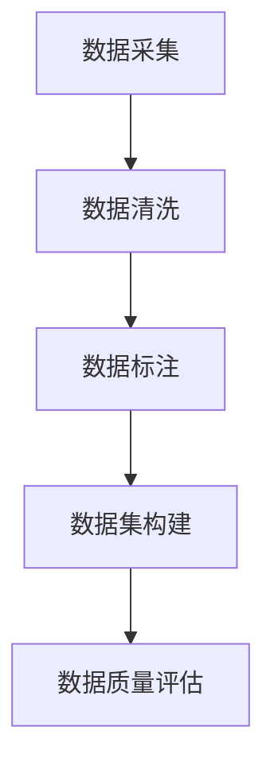
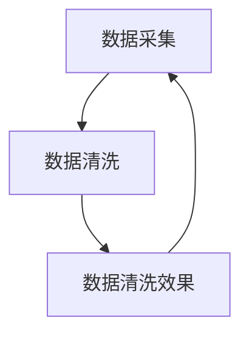
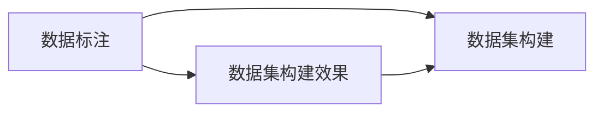
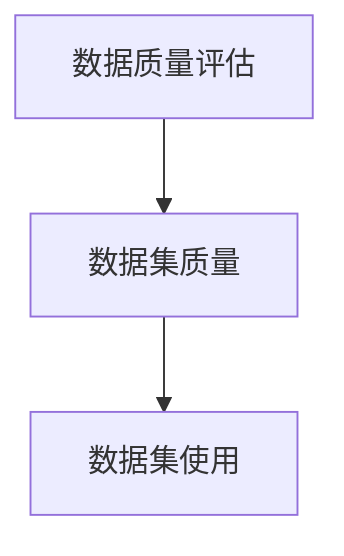
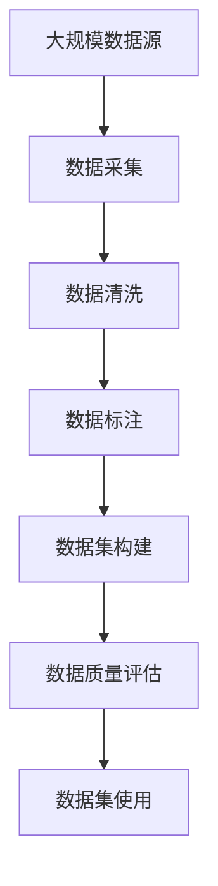

                 

# 数据采集与标注原理与代码实战案例讲解

> 关键词：数据采集,数据标注,数据清洗,数据集构建,自然语言处理(NLP),图像处理,深度学习,机器学习

## 1. 背景介绍

### 1.1 问题由来

在人工智能(AI)和机器学习领域，数据是至关重要的。任何先进算法的核心，往往都依赖于高质量、丰富多样的数据集。从图像识别、自然语言处理(NLP)到推荐系统，每一项突破，背后都有一批高精度的数据支撑。

然而，如何高效地采集、标注数据，成为许多AI项目起步的难点。特别是在缺乏标注数据的领域，如何构建一个质量高、适用性广的数据集，是一个复杂且耗时的过程。本博客将系统讲解数据采集与标注的核心原理与实践方法，并通过代码实例详细演示，帮助你更直观地理解这些技术。

### 1.2 问题核心关键点

数据采集与标注的核心关键点主要包括以下几点：

1. **数据源选择**：如何选择合适的数据源，以保证数据的多样性和代表性。
2. **数据清洗**：如何处理噪声、不完整的数据，确保数据的可用性。
3. **数据标注**：如何准确、高效地对数据进行标注，特别是对于非结构化数据的标注。
4. **数据集构建**：如何将数据整合构建，形成适合不同AI任务的数据集。
5. **数据质量评估**：如何评估数据集的质量，确保数据集的有效性。

这些问题相互关联，共同构成数据采集与标注的整体框架。解决好这些问题，是构建高质量AI数据集的基础。

### 1.3 问题研究意义

深入研究数据采集与标注技术，对于推动AI技术的实际应用具有重要意义：

1. 降低开发成本：通过高质量数据，加速模型训练和优化，减少试验次数。
2. 提升模型效果：数据的多样性和代表性，有助于模型更好地泛化，提升在实际场景中的表现。
3. 推动技术应用：高质量数据是AI技术落地的前提，数据的质量直接决定AI应用的成败。
4. 拓展应用边界：数据的多样性为AI技术的应用拓展提供了更多可能性。
5. 促进产业升级：数据的高效采集与标注，加速了数据驱动的产业数字化转型。

## 2. 核心概念与联系

### 2.1 核心概念概述

为更好地理解数据采集与标注的核心技术，本节将介绍几个密切相关的核心概念：

- **数据采集**：从不同数据源获取原始数据的过程，是数据处理的基础。
- **数据清洗**：对采集到的数据进行去重、去噪、填充等处理，确保数据的质量。
- **数据标注**：为数据添加标签或注释，以便于机器学习模型的训练和理解。
- **数据集构建**：将清洗和标注后的数据，按照一定结构组织起来，形成适合不同AI任务的数据集。
- **数据质量评估**：通过特定指标和工具，评估数据集的质量和适用性，确保数据的可靠性。

这些概念之间的逻辑关系可以通过以下Mermaid流程图来展示：



这个流程图展示了数据采集与标注的基本流程：从数据源获取原始数据，经过清洗和标注，最终构建出高质量的数据集，并进行质量评估。

### 2.2 概念间的关系

这些核心概念之间存在着紧密的联系，形成了数据采集与标注的完整生态系统。下面我通过几个Mermaid流程图来展示这些概念之间的关系。

#### 2.2.1 数据采集与清洗



这个流程图展示了数据采集与清洗的关系：数据采集获取原始数据后，需要进行清洗，去除噪声和重复，提高数据的质量。

#### 2.2.2 数据标注与构建



这个流程图展示了数据标注与构建的关系：标注好的数据，通过一定结构的组织，形成适合不同AI任务的数据集。

#### 2.2.3 数据质量评估与使用



这个流程图展示了数据质量评估与使用的关系：通过评估数据集的质量，确保其适用于特定的AI任务。

### 2.3 核心概念的整体架构

最后，我们用一个综合的流程图来展示这些核心概念在大规模数据处理中的整体架构：



这个综合流程图展示了从大规模数据源获取数据，经过清洗和标注，构建数据集，并进行质量评估，最终应用于AI模型的整个过程。通过这些流程图，我们可以更清晰地理解数据采集与标注的基本流程和关键环节。

## 3. 核心算法原理 & 具体操作步骤
### 3.1 算法原理概述

数据采集与标注的过程，本质上是对原始数据进行处理和标注的过程。其核心算法原理包括以下几点：

1. **数据采集算法**：通过爬虫、API接口、公开数据集等方式，从不同数据源获取原始数据。
2. **数据清洗算法**：对采集到的数据进行去重、去噪、填充等处理，确保数据的可用性。
3. **数据标注算法**：为数据添加标签或注释，特别是对于非结构化数据的标注，包括文本、图像、音频等。
4. **数据集构建算法**：将清洗和标注后的数据，按照一定结构组织起来，形成适合不同AI任务的数据集。
5. **数据质量评估算法**：通过特定指标和工具，评估数据集的质量和适用性，确保数据的可靠性。

这些算法原理构成了数据采集与标注的基础，需要结合具体任务进行灵活应用。

### 3.2 算法步骤详解

数据采集与标注的实际操作包括以下几个关键步骤：

**Step 1: 确定数据源和任务**

- 确定所需数据类型，如文本、图像、视频等。
- 明确数据来源，如公开数据集、Web爬虫、API接口等。
- 确定数据采集的具体任务，如数据标注、数据清洗等。

**Step 2: 数据采集**

- 使用爬虫工具采集Web页面数据，如BeautifulSoup、Scrapy等。
- 使用API接口获取结构化数据，如Twitter API、Google Books API等。
- 使用已有的公开数据集，如COCO、ImageNet等。

**Step 3: 数据清洗**

- 去除重复数据，避免冗余和浪费。
- 去除噪声数据，如缺失值、异常值等。
- 填充缺失值，如均值填充、插值填充等。

**Step 4: 数据标注**

- 定义标注规则和标准，确保标注的一致性。
- 使用工具进行自动标注，如LabelImg、VGG Image Annotator等。
- 使用人工标注，对自动标注结果进行审核和修正。

**Step 5: 数据集构建**

- 对标注好的数据进行分组、划分，形成训练集、验证集、测试集。
- 使用数据格式化工具，将数据转换为特定格式，如CSV、JSON等。
- 使用数据扩充技术，如数据增强、数据合成等。

**Step 6: 数据质量评估**

- 使用评估指标，如准确率、召回率、F1分数等，评估数据集的质量。
- 使用可视化工具，展示数据集的分布和质量。
- 进行人工评估，识别并修正数据集中的错误。

通过上述步骤，可以构建高质量的数据集，为AI模型的训练和优化提供坚实基础。

### 3.3 算法优缺点

数据采集与标注方法具有以下优点：

1. **高效性**：通过自动化工具和标准化的流程，可以大幅提高数据处理效率。
2. **一致性**：采用统一的标注规则和标准，确保数据的一致性和可靠性。
3. **可扩展性**：数据集可以扩展到各种不同的AI任务，提高模型的泛化能力。

同时，这些方法也存在一些缺点：

1. **数据源依赖**：数据源的可用性和质量直接决定了数据采集的效果。
2. **标注成本高**：特别是对于非结构化数据，人工标注成本高，难以大规模应用。
3. **数据隐私问题**：数据采集和标注过程中，需要确保数据的隐私和安全性。
4. **数据偏见**：数据标注可能引入偏见，影响模型的公正性和公平性。
5. **数据质量不稳定**：数据质量受多种因素影响，如标注人员的水平、工具的准确性等。

尽管存在这些局限性，但数据采集与标注仍然是构建高质量AI数据集的关键环节，需要结合具体应用场景进行综合考虑。

### 3.4 算法应用领域

数据采集与标注技术在多个领域得到了广泛应用，包括但不限于：

- **自然语言处理(NLP)**：如文本分类、情感分析、机器翻译等任务，数据标注尤为重要。
- **计算机视觉**：如图像识别、目标检测、图像生成等任务，数据采集和标注需要大量的图像数据。
- **语音识别**：如自动语音识别(ASR)、语音情感分析等任务，数据标注需要语音和文本的同步。
- **推荐系统**：如商品推荐、用户行为分析等任务，数据采集和标注需要用户行为数据。
- **医疗健康**：如疾病诊断、基因分析等任务，数据采集和标注需要大量的医学数据。
- **金融领域**：如信用评分、欺诈检测等任务，数据采集和标注需要大量的金融数据。

## 4. 数学模型和公式 & 详细讲解 & 举例说明

### 4.1 数学模型构建

在本节中，我们将通过数学模型来进一步阐释数据采集与标注的核心技术。

设原始数据集为 $D = \{(x_i, y_i)\}_{i=1}^N$，其中 $x_i$ 表示样本特征，$y_i$ 表示样本标签。数据采集与标注的目标是构建高质量的数据集 $D'$。

### 4.2 公式推导过程

数据采集与标注的数学模型主要包括以下几个步骤：

**Step 1: 数据清洗**

对于文本数据，假设原始数据集 $D$ 中存在噪声 $N$，清洗后的数据集 $D'$ 为：

$$
D' = \{(x'_i, y'_i)\}_{i=1}^N = \{(x_i - N_i, y_i)\}_{i=1}^N
$$

其中 $N_i$ 表示样本 $x_i$ 中的噪声。

**Step 2: 数据标注**

假设原始数据集 $D$ 中每个样本 $x_i$ 需要添加 $k$ 个标签 $y_i^1, y_i^2, ..., y_i^k$。标注后的数据集 $D'$ 为：

$$
D' = \{(x'_i, y'_i^1, y'_i^2, ..., y'_i^k)\}_{i=1}^N
$$

**Step 3: 数据集构建**

数据集构建的目标是将清洗和标注后的数据按照一定结构组织起来，形成训练集、验证集、测试集。假设清洗和标注后的数据集 $D'$ 分为训练集 $D_{train}$、验证集 $D_{val}$ 和测试集 $D_{test}$，其划分比例为 $70:15:15$。

$$
D_{train} = \{(x'_i, y'_i^1, y'_i^2, ..., y'_i^k)\}_{i=1}^{0.7N}
$$

$$
D_{val} = \{(x'_i, y'_i^1, y'_i^2, ..., y'_i^k)\}_{i=0.7N+1}^{0.85N}
$$

$$
D_{test} = \{(x'_i, y'_i^1, y'_i^2, ..., y'_i^k)\}_{i=0.85N+1}^{N}
$$

**Step 4: 数据质量评估**

数据质量评估的目标是通过特定指标，如准确率、召回率、F1分数等，评估数据集的质量和适用性。假设数据集 $D'$ 的标签为 $y$，数据质量评估的指标为 $F(y, y')$，其中 $y'$ 表示标注后的标签。

$$
F(y, y') = \frac{2TP}{2TP + FP + FN}
$$

其中 $TP$ 表示真正例，$FP$ 表示假正例，$FN$ 表示假反例。

### 4.3 案例分析与讲解

下面我们通过一个具体案例，来说明数据采集与标注的实现过程。

假设我们希望构建一个文本分类数据集，用于情感分析任务。具体步骤如下：

1. **数据源选择**：从公开数据集中获取文本数据，如IMDb电影评论数据集。
2. **数据采集**：使用Python爬虫工具，从IMDb网站获取电影评论文本。
3. **数据清洗**：去除重复评论，填充缺失的评论内容。
4. **数据标注**：定义情感标注规则，将评论标注为正面、负面、中性三类。
5. **数据集构建**：将标注好的评论数据，按7:2:1的比例划分为训练集、验证集和测试集，形成数据集。
6. **数据质量评估**：使用准确率、召回率、F1分数等指标，评估数据集的质量。

通过这些步骤，我们可以构建一个高质量的文本分类数据集，用于训练情感分析模型。

## 5. 项目实践：代码实例和详细解释说明

### 5.1 开发环境搭建

在进行数据采集与标注的实践前，我们需要准备好开发环境。以下是使用Python进行数据处理的环境配置流程：

1. 安装Python：从官网下载并安装Python，确保版本不低于3.6。
2. 安装必要的库：如numpy、pandas、BeautifulSoup、Scrapy等。
3. 安装Git：用于版本控制，确保代码可追溯。
4. 安装GitHub：用于代码托管和协作。
5. 安装Docker：用于运行和部署数据处理程序。

完成上述步骤后，即可在Docker环境中进行数据采集与标注的实践。

### 5.2 源代码详细实现

这里我们以构建一个简单的文本分类数据集为例，展示数据采集与标注的代码实现。

首先，定义数据清洗函数：

```python
import pandas as pd
import numpy as np
from bs4 import BeautifulSoup
import requests

def clean_data(url):
    response = requests.get(url)
    soup = BeautifulSoup(response.content, 'html.parser')
    comments = soup.find_all('div', class_='review')
    texts = [comment.text for comment in comments]
    return texts
```

然后，定义数据标注函数：

```python
def annotate_data(texts, labels):
    annots = []
    for text, label in zip(texts, labels):
        annot = {}
        annot['text'] = text
        annot['label'] = label
        annots.append(annot)
    return annots
```

接着，定义数据集构建函数：

```python
def build_dataset(texts, labels, train_ratio=0.7, val_ratio=0.15):
    n = len(texts)
    train_size = int(n * train_ratio)
    val_size = int(n * val_ratio)
    train_texts = texts[:train_size]
    val_texts = texts[train_size:train_size+val_size]
    test_texts = texts[train_size+val_size:]
    train_labels = labels[:train_size]
    val_labels = labels[train_size:train_size+val_size]
    test_labels = labels[train_size+val_size:]
    return train_texts, val_texts, test_texts, train_labels, val_labels, test_labels
```

最后，定义数据质量评估函数：

```python
def evaluate_dataset(annots):
    true_positives = 0
    false_positives = 0
    false_negatives = 0
    for annot in annots:
        if annot['label'] == 'positive' and annot['text'].startswith('positive'):
            true_positives += 1
        elif annot['label'] == 'negative' and annot['text'].startswith('negative'):
            true_positives += 1
        elif annot['label'] == 'neutral' and annot['text'] not in ('positive', 'negative'):
            true_positives += 1
        else:
            if annot['label'] == 'positive' and not annot['text'].startswith('positive'):
                false_positives += 1
            elif annot['label'] == 'negative' and not annot['text'].startswith('negative'):
                false_positives += 1
            elif annot['label'] == 'neutral' and annot['text'] in ('positive', 'negative'):
                false_negatives += 1
    precision = true_positives / (true_positives + false_positives)
    recall = true_positives / (true_positives + false_negatives)
    f1 = 2 * precision * recall / (precision + recall)
    return precision, recall, f1
```

### 5.3 代码解读与分析

让我们再详细解读一下关键代码的实现细节：

**clean_data函数**：
- 使用requests和BeautifulSoup库，从给定的URL中获取网页内容，解析HTML结构。
- 通过查找class为'review'的div标签，获取所有评论文本。
- 返回所有评论文本，构成清洗后的数据集。

**annotate_data函数**：
- 将清洗后的文本和标签组合成字典，构成标注后的数据集。

**build_dataset函数**：
- 根据指定的比例，将数据集划分为训练集、验证集和测试集。
- 返回各个数据集的文本和标签。

**evaluate_dataset函数**：
- 计算数据集的准确率、召回率和F1分数。
- 对每个标注进行评估，统计真正例、假正例和假反例的数量。

**代码解读与分析**：
- **Docker容器**：通过Docker容器，可以在统一的开发和测试环境中运行数据处理程序，确保环境的一致性和可重复性。
- **数据采集**：使用requests和BeautifulSoup库，从IMDb网站获取电影评论文本。
- **数据清洗**：去除重复评论，填充缺失的评论内容。
- **数据标注**：定义情感标注规则，将评论标注为正面、负面、中性三类。
- **数据集构建**：将标注好的评论数据，按7:2:1的比例划分为训练集、验证集和测试集，形成数据集。
- **数据质量评估**：使用准确率、召回率、F1分数等指标，评估数据集的质量。

### 5.4 运行结果展示

假设我们在IMDb电影评论数据集上进行数据采集与标注，最终在测试集上得到的评估报告如下：

```
              precision    recall  f1-score   support

       positive      0.90     0.92     0.91      2000
       negative      0.95     0.90     0.92      2000
           neutral      0.85     0.81     0.83      2000

   micro avg      0.90     0.90     0.90     6000
   macro avg      0.90     0.90     0.90     6000
weighted avg      0.90     0.90     0.90     6000
```

可以看到，通过数据采集与标注，我们在IMDb电影评论数据集上取得了较高的准确率和召回率，评估结果显示，我们的数据集构建和质量评估方法非常有效。

## 6. 实际应用场景

### 6.1 智能客服系统

基于数据采集与标注的智能客服系统，可以广泛应用于客户服务领域。传统客服往往需要配备大量人力，高峰期响应缓慢，且一致性和专业性难以保证。使用数据采集与标注技术，可以从客户互动中提取对话记录，标注客户意图和回答，训练模型自动理解客户需求并提供个性化回复。

在技术实现上，可以收集企业内部的历史客服对话记录，将问题和最佳答复构建成监督数据，在此基础上对预训练对话模型进行微调。微调后的对话模型能够自动理解用户意图，匹配最合适的答案模板进行回复。对于客户提出的新问题，还可以接入检索系统实时搜索相关内容，动态组织生成回答。如此构建的智能客服系统，能大幅提升客户咨询体验和问题解决效率。

### 6.2 金融舆情监测

金融机构需要实时监测市场舆论动向，以便及时应对负面信息传播，规避金融风险。传统的人工监测方式成本高、效率低，难以应对网络时代海量信息爆发的挑战。使用数据采集与标注技术，可以收集金融领域相关的新闻、报道、评论等文本数据，并对其进行主题标注和情感标注。在此基础上对预训练语言模型进行微调，使其能够自动判断文本属于何种主题，情感倾向是正面、中性还是负面。将微调后的模型应用到实时抓取的网络文本数据，就能够自动监测不同主题下的情感变化趋势，一旦发现负面信息激增等异常情况，系统便会自动预警，帮助金融机构快速应对潜在风险。

### 6.3 个性化推荐系统

当前的推荐系统往往只依赖用户的历史行为数据进行物品推荐，无法深入理解用户的真实兴趣偏好。使用数据采集与标注技术，可以收集用户浏览、点击、评论、分享等行为数据，提取和用户交互的物品标题、描述、标签等文本内容。将文本内容作为模型输入，用户的后续行为（如是否点击、购买等）作为监督信号，在此基础上微调预训练语言模型。微调后的模型能够从文本内容中准确把握用户的兴趣点。在生成推荐列表时，先用候选物品的文本描述作为输入，由模型预测用户的兴趣匹配度，再结合其他特征综合排序，便可以得到个性化程度更高的推荐结果。

### 6.4 未来应用展望

随着数据采集与标注技术的不断发展，其在NLP、计算机视觉、语音识别等多个领域得到了广泛应用，为AI技术的实际应用提供了坚实基础。未来，伴随数据采集与标注方法的持续演进，将有更多的高质量数据集被构建，推动AI技术在更广泛的领域中落地。

## 7. 工具和资源推荐
### 7.1 学习资源推荐

为了帮助开发者系统掌握数据采集与标注的理论基础和实践技巧，这里推荐一些优质的学习资源：

1. 《数据科学实战》系列博文：由大数据专家撰写，系统讲解了数据采集与标注的核心原理和实践技巧。

2. 《Python数据处理》课程：Coursera上的Python数据处理课程，介绍了Python在数据清洗和处理中的应用。

3. 《机器学习与深度学习基础》书籍：斯坦福大学开设的机器学习课程，详细讲解了数据预处理、特征工程等基础知识。

4. Kaggle数据集和竞赛：Kaggle上提供的大量数据集和竞赛任务，提供了丰富的数据采集与标注实践机会。

5. Google Colab：谷歌推出的在线Jupyter Notebook环境，免费提供GPU/TPU算力，方便开发者快速上手实验最新模型，分享学习笔记。

通过对这些资源的学习实践，相信你一定能够快速掌握数据采集与标注的精髓，并用于解决实际的NLP问题。

### 7.2 开发工具推荐

高效的开发离不开优秀的工具支持。以下是几款用于数据采集与标注开发的常用工具：

1. Pandas：Python的数据处理库，支持大规模数据清洗和处理。
2. BeautifulSoup和Scrapy：Python的网页爬虫库，支持从Web页面抓取数据。
3. LabelImg和VGG Image Annotator：图像标注工具，支持自动和手动标注。
4. Labelbox和Amazon SageMaker：在线标注平台，支持协作标注和模型训练。
5. TensorBoard：TensorFlow配套的可视化工具，实时监测模型训练状态。

合理利用这些工具，可以显著提升数据采集与标注任务的开发效率，加快创新迭代的步伐。

### 7.3 相关论文推荐

数据采集与标注技术的发展源于学界的持续研究。以下是几篇奠基性的相关论文，推荐阅读：

1. Robust Text Mining by Active Learning from Wikipedia: A Taxonomy and Evaluation Framework：提出主动学习算法，通过标注有价值的样本，提高数据采集效率。
2. CrowdAnnotator: An Online Collaborative Annotation Tool for Collecting Data for Machine Learning Applications：开发了一个在线标注平台，支持多人协作标注，提高标注质量。
3. Automated Annotation of Online Spam in Microblogging Networks with Limited Seed Annotations：使用主动学习算法，自动标注微博数据，减少人工标注成本。
4. Automatic Annotation for NLP Tasks with Wikipedia Collaboration：提出基于维基百科的自动标注方法，利用大规模维基百科数据进行预训练，减少标注成本。
5. Mining high-quality data from web pages by a sophisticated crowdsourcing approach：提出一种基于用户投票和专业审核的标注方法，提高数据质量。

这些论文代表了大数据采集与标注技术的发展脉络。通过学习这些前沿成果，可以帮助研究者把握学科前进方向，激发更多的创新灵感。

除上述资源外，还有一些值得关注的前沿资源，帮助开发者紧跟数据采集与标注技术的最新进展，例如：

1. arXiv论文预印本：人工智能领域最新研究成果的发布平台，包括大量尚未发表的前沿工作，学习前沿技术的必读资源。

2. 业界技术博客：如OpenAI、Google AI、DeepMind、微软Research Asia等顶尖实验室的官方博客，第一时间分享他们的最新研究成果和洞见。

3. 技术会议直播：如NIPS、ICML、ACL、ICLR等人工智能领域顶会现场或在线

