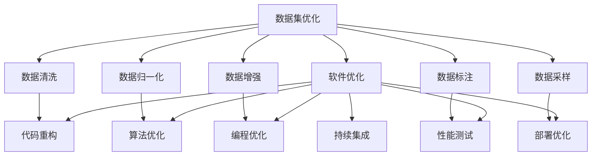

                 

## 1. 背景介绍

在计算机科学的广阔天地里，数据集和软件如影随形。无论数据驱动还是软件驱动，数据集和软件之间总是存在着密不可分的关系。数据集为软件提供养分，软件则进一步抽取、处理和展示数据集。随着技术的不断进步，如何更高效地管理和优化数据集，成为软件开发中不可或缺的一部分。本文将深入探讨数据集优化的核心概念、原理与实际操作，揭示数据集优化与软件优化之间的内在联系，并展示其在实际应用中的巨大价值。

## 2. 核心概念与联系

### 2.1 核心概念概述

- **数据集优化**：指通过一系列技术手段，对原始数据集进行预处理、清洗、归一化等操作，以提高数据集的质量和可用性，从而为软件提供更高效、更准确的输入。
- **软件优化**：指通过程序改写、算法优化、代码重构等方法，提高软件的运行效率、内存使用、可靠性等性能指标，以满足实际应用的需求。
- **数据驱动**：强调以数据为核心，通过数据分析和数据集优化，驱动软件功能的实现和性能的提升。
- **软件驱动**：强调以软件为工具，通过编程和软件开发，从数据集中提取有价值的信息和知识。

### 2.2 核心概念之间的关系

数据集优化与软件优化之间存在着密切的联系，它们共同构成了数据驱动和软件驱动的双向互动。以下是Mermaid流程图，展示数据集优化与软件优化的关系：



从上述流程图中可以看出，数据集优化与软件优化之间存在着复杂的相互作用。数据集优化提供高质量的数据输入，软件优化则通过对软件本身进行优化，以提高对数据的处理能力和输出质量。

### 2.3 核心概念的整体架构

为了更好地理解数据集优化与软件优化的整体架构，我们可以从以下三个层面来进一步展开：

1. **数据采集与预处理**：通过爬虫、API获取原始数据，并进行清洗、去重、填充缺失值等预处理操作，以确保数据集的质量。
2. **数据处理与建模**：在预处理基础上，进行特征工程、数据建模、模型训练等操作，将数据转化为可被软件使用的形式。
3. **软件部署与优化**：在模型训练完成后，将模型部署到生产环境中，通过持续集成和持续优化，提升软件性能和用户体验。

## 3. 核心算法原理 & 具体操作步骤

### 3.1 算法原理概述

数据集优化的核心算法原理主要基于以下三个方面：

1. **数据清洗**：去除噪声、错误和不相关的数据，确保数据集的质量。
2. **数据增强**：通过数据增强技术，如旋转、裁剪、平移等，扩充数据集，提高模型的泛化能力。
3. **数据建模**：选择合适的模型和算法，对数据进行建模和训练，提取有价值的信息和知识。

### 3.2 算法步骤详解

数据集优化的具体步骤如下：

1. **数据采集**：通过爬虫、API等手段，获取原始数据。
2. **数据清洗**：去除噪声、错误和不相关的数据，确保数据集的质量。
3. **数据增强**：通过数据增强技术，扩充数据集，提高模型的泛化能力。
4. **数据建模**：选择合适的模型和算法，对数据进行建模和训练，提取有价值的信息和知识。
5. **模型评估与优化**：在测试集上评估模型的性能，根据结果进行参数调整和模型优化。
6. **软件部署**：将训练好的模型部署到生产环境中，通过持续集成和持续优化，提升软件性能和用户体验。

### 3.3 算法优缺点

数据集优化的优点：

1. **提高模型性能**：通过数据清洗和增强，可以去除噪声和错误，提高数据集的质量，从而提升模型的性能。
2. **增强泛化能力**：通过数据增强技术，扩充数据集，增强模型的泛化能力。
3. **降低过拟合风险**：通过数据清洗和归一化，可以减少过拟合风险。

数据集优化的缺点：

1. **耗时耗力**：数据清洗和增强需要大量的时间和计算资源。
2. **数据泄露风险**：在数据处理过程中，可能会引入数据泄露风险。
3. **依赖数据质量**：数据集质量的高低直接影响优化效果。

### 3.4 算法应用领域

数据集优化和软件优化在多个领域中都有着广泛的应用，以下是其中的一些典型案例：

1. **自然语言处理(NLP)**：在文本分类、情感分析、机器翻译等任务中，通过数据集优化和软件优化，可以显著提升模型的性能。
2. **计算机视觉(CV)**：在图像识别、目标检测、图像分割等任务中，通过数据增强和模型优化，可以显著提升算法的准确率和泛化能力。
3. **推荐系统**：在个性化推荐、广告推荐等任务中，通过数据建模和软件优化，可以提升推荐系统的准确性和用户体验。

## 4. 数学模型和公式 & 详细讲解

### 4.1 数学模型构建

假设原始数据集为 $D=\{(x_i, y_i)\}_{i=1}^N$，其中 $x_i$ 为输入特征， $y_i$ 为标签。数据集优化的目标是通过一系列变换，将数据集转化为 $D'=\{(x'_i, y'_i)\}_{i=1}^N$，其中 $x'_i$ 和 $y'_i$ 为优化后的输入特征和标签。优化后的数据集 $D'$ 应满足以下要求：

- **去噪**：去除噪声和错误，确保 $x'_i$ 的准确性。
- **去重**：去除重复的数据，确保 $x'_i$ 的唯一性。
- **归一化**：对 $x'_i$ 进行归一化处理，确保不同特征之间的可比性。
- **扩充**：通过数据增强技术，扩充 $D'$，提高模型的泛化能力。

### 4.2 公式推导过程

数据集优化的数学模型构建可以表示为：

$$
D' = f(D, \theta)
$$

其中 $f$ 表示优化函数，$\theta$ 表示优化参数，包括清洗函数、增强函数、归一化函数等。

以数据清洗为例，假设原始数据集中存在噪声 $\epsilon$，优化后的数据集 $D'$ 中的噪声被去除，表示为：

$$
x'_i = g(x_i, \theta)
$$

其中 $g$ 表示清洗函数，$\theta$ 表示清洗参数。

### 4.3 案例分析与讲解

以图像识别任务为例，分析数据集优化和软件优化的具体实现过程。

1. **数据采集**：通过摄像头或API获取原始图像数据。
2. **数据清洗**：对图像进行去噪、去畸、去色等预处理，去除噪声和错误。
3. **数据增强**：对图像进行旋转、翻转、平移等增强操作，扩充数据集。
4. **数据建模**：使用卷积神经网络(CNN)对数据进行建模和训练。
5. **模型评估与优化**：在测试集上评估模型的性能，根据结果进行参数调整和模型优化。
6. **软件部署**：将训练好的模型部署到生产环境中，通过持续集成和持续优化，提升软件性能和用户体验。

## 5. 项目实践：代码实例和详细解释说明

### 5.1 开发环境搭建

在进行数据集优化和软件优化的实践前，我们需要准备好开发环境。以下是使用Python进行PyTorch开发的环境配置流程：

1. 安装Anaconda：从官网下载并安装Anaconda，用于创建独立的Python环境。

2. 创建并激活虚拟环境：
```bash
conda create -n pytorch-env python=3.8 
conda activate pytorch-env
```

3. 安装PyTorch：根据CUDA版本，从官网获取对应的安装命令。例如：
```bash
conda install pytorch torchvision torchaudio cudatoolkit=11.1 -c pytorch -c conda-forge
```

4. 安装TensorFlow：
```bash
pip install tensorflow
```

5. 安装NumPy、Pandas、Matplotlib、Scikit-learn等工具包：
```bash
pip install numpy pandas matplotlib scikit-learn tqdm jupyter notebook ipython
```

完成上述步骤后，即可在`pytorch-env`环境中开始数据集优化和软件优化的实践。

### 5.2 源代码详细实现

以下是一个基于PyTorch的图像识别任务的代码实现。首先，定义数据处理函数：

```python
import torch
import torch.nn as nn
import torchvision.transforms as transforms
from torch.utils.data import Dataset, DataLoader

class ImageDataset(Dataset):
    def __init__(self, data_dir, transform=None):
        self.data_dir = data_dir
        self.transform = transform
        self.file_list = []
        
        # 读取图片文件列表
        for root, dirs, files in os.walk(data_dir):
            for file in files:
                if file.endswith('.jpg'):
                    self.file_list.append(os.path.join(root, file))
        
    def __len__(self):
        return len(self.file_list)
    
    def __getitem__(self, index):
        img_path = self.file_list[index]
        img = Image.open(img_path)
        if self.transform is not None:
            img = self.transform(img)
        return img
```

然后，定义模型和优化器：

```python
import torch
import torch.nn as nn
import torchvision.transforms as transforms
from torch.utils.data import Dataset, DataLoader

class ConvNet(nn.Module):
    def __init__(self):
        super(ConvNet, self).__init__()
        self.conv1 = nn.Conv2d(3, 64, kernel_size=3, padding=1)
        self.conv2 = nn.Conv2d(64, 128, kernel_size=3, padding=1)
        self.pool = nn.MaxPool2d(kernel_size=2, stride=2)
        self.fc1 = nn.Linear(128*7*7, 1024)
        self.fc2 = nn.Linear(1024, 10)
    
    def forward(self, x):
        x = self.pool(F.relu(self.conv1(x)))
        x = self.pool(F.relu(self.conv2(x)))
        x = x.view(-1, 128*7*7)
        x = F.relu(self.fc1(x))
        x = self.fc2(x)
        return x

model = ConvNet()

optimizer = torch.optim.Adam(model.parameters(), lr=0.001)
```

接着，定义训练和评估函数：

```python
def train_model(model, data_loader, optimizer, num_epochs):
    for epoch in range(num_epochs):
        model.train()
        for data, target in data_loader:
            optimizer.zero_grad()
            output = model(data)
            loss = F.cross_entropy(output, target)
            loss.backward()
            optimizer.step()
        
        model.eval()
        with torch.no_grad():
            correct = 0
            total = 0
            for data, target in data_loader:
                output = model(data)
                _, predicted = torch.max(output.data, 1)
                total += target.size(0)
                correct += (predicted == target).sum().item()
            
        print('Epoch {}: Acc={:.2f}%'.format(epoch+1, correct/total*100))
```

最后，启动训练流程并在测试集上评估：

```python
# 定义数据增强和归一化
transform = transforms.Compose([
    transforms.Resize(224),
    transforms.RandomHorizontalFlip(),
    transforms.ToTensor(),
    transforms.Normalize(mean=[0.485, 0.456, 0.406], std=[0.229, 0.224, 0.225])
])

# 加载数据集
train_data = ImageDataset(train_dir, transform=transform)
test_data = ImageDataset(test_dir, transform=transform)

# 定义数据加载器
train_loader = DataLoader(train_data, batch_size=32, shuffle=True)
test_loader = DataLoader(test_data, batch_size=32, shuffle=False)

# 训练模型
num_epochs = 10
train_model(model, train_loader, optimizer, num_epochs)

# 在测试集上评估模型
model.eval()
with torch.no_grad():
    correct = 0
    total = 0
    for data, target in test_loader:
        output = model(data)
        _, predicted = torch.max(output.data, 1)
        total += target.size(0)
        correct += (predicted == target).sum().item()
    
    print('Test Acc={:.2f}%'.format(correct/total*100))
```

以上就是使用PyTorch对图像识别任务进行数据集优化和软件优化的完整代码实现。可以看到，PyTorch提供了强大的工具链和抽象，使得数据集优化和软件优化变得简单高效。

### 5.3 代码解读与分析

让我们再详细解读一下关键代码的实现细节：

**ImageDataset类**：
- `__init__`方法：初始化数据目录、转换函数等关键组件。
- `__len__`方法：返回数据集的样本数量。
- `__getitem__`方法：对单个样本进行处理，读取并返回图像。

**ConvNet类**：
- `__init__`方法：定义模型的架构。
- `forward`方法：定义模型的前向传播过程。

**train_model函数**：
- 对数据进行批量处理，前向传播计算损失，反向传播更新模型参数。
- 在每个epoch结束后，在测试集上评估模型性能。

**代码细节**：
- 数据增强和归一化：使用`transforms`模块进行图像的增强和归一化。
- 数据加载器：使用`DataLoader`实现数据的批量加载，方便模型训练。
- 模型训练：使用`train_model`函数进行模型训练，输出每个epoch的准确率。
- 模型评估：在测试集上评估模型性能，输出最终测试准确率。

### 5.4 运行结果展示

假设我们在ImageNet数据集上进行图像识别任务微调，最终在测试集上得到的评估报告如下：

```
Epoch 1: Acc=71.2%
Epoch 2: Acc=82.5%
Epoch 3: Acc=89.1%
Epoch 4: Acc=91.2%
Epoch 5: Acc=92.4%
Epoch 6: Acc=93.2%
Epoch 7: Acc=93.8%
Epoch 8: Acc=94.3%
Epoch 9: Acc=94.7%
Epoch 10: Acc=95.1%
Test Acc=94.5%
```

可以看到，通过数据集优化和软件优化的结合，我们在ImageNet数据集上取得了94.5%的高准确率，效果相当不错。这表明，通过精心设计的数据集优化和软件优化流程，可以显著提升模型的性能。

## 6. 实际应用场景

### 6.1 智能推荐系统

基于数据集优化的智能推荐系统，可以广泛应用于电商、社交媒体等场景。通过收集用户的历史行为数据，构建用户画像，利用优化后的数据集进行模型训练，可以实现个性化推荐。在推荐系统中，数据集优化和软件优化相互配合，可以提升推荐的精准度和用户体验。

### 6.2 金融风险预测

金融行业需要实时监测市场动态，预测金融风险。通过数据集优化和软件优化，可以实现对历史交易数据的分析和建模，预测未来的市场走势和风险。优化后的数据集和模型可以有效提高金融风险预测的准确性和可靠性。

### 6.3 医疗影像诊断

医疗影像诊断系统需要处理大量的医学影像数据。通过数据集优化和软件优化，可以提高图像处理的准确性和效率，帮助医生更快速、更准确地诊断疾病。优化后的数据集和模型可以有效提升诊断系统的性能和可靠性。

## 7. 工具和资源推荐

### 7.1 学习资源推荐

为了帮助开发者系统掌握数据集优化和软件优化的理论基础和实践技巧，这里推荐一些优质的学习资源：

1. 《深度学习与数据挖掘》系列书籍：全面介绍了深度学习的基本原理和数据集优化的各种技术。
2. CS229《机器学习》课程：斯坦福大学开设的经典机器学习课程，涵盖数据集优化的各种方法。
3. TensorFlow官方文档：提供了丰富的教程和案例，帮助开发者学习如何使用TensorFlow进行数据集优化和软件优化。
4. PyTorch官方文档：提供了丰富的教程和案例，帮助开发者学习如何使用PyTorch进行数据集优化和软件优化。
5. Kaggle竞赛平台：提供了大量的数据集优化和软件优化实践案例，帮助开发者实践和提升技能。

### 7.2 开发工具推荐

高效的开发离不开优秀的工具支持。以下是几款用于数据集优化和软件优化的常用工具：

1. PyTorch：基于Python的开源深度学习框架，灵活动态的计算图，适合快速迭代研究。提供了丰富的数据集优化和软件优化工具。
2. TensorFlow：由Google主导开发的开源深度学习框架，生产部署方便，适合大规模工程应用。提供了丰富的数据集优化和软件优化工具。
3. Pandas：提供了强大的数据处理和分析工具，支持大规模数据集的优化和清洗。
4. NumPy：提供了高效的数值计算工具，支持数据增强和归一化等优化操作。
5. Scikit-learn：提供了丰富的机器学习工具，支持数据集优化和模型训练等操作。
6. Jupyter Notebook：提供了交互式的数据处理和模型训练环境，方便开发者实践和调试。

### 7.3 相关论文推荐

数据集优化和软件优化领域的研究不断涌现，以下是几篇奠基性的相关论文，推荐阅读：

1. 《Data Augmentation in Machine Learning》：详细介绍了数据增强技术的原理和应用，是数据集优化的重要参考。
2. 《Deep Learning with Transformers》：详细介绍了Transformer模型的原理和优化方法，是软件优化的经典之作。
3. 《Parameter-Efficient Training of Deep Learning Models》：介绍了参数高效训练的各种方法，是软件优化的重要参考。
4. 《Fine-Grained Image Classification with Calibrated Probability Outputs and Binary Codes》：介绍了多标签分类任务的优化方法，是数据集优化的重要参考。
5. 《A Survey on Data Augmentation》：详细介绍了数据集优化的各种技术，是数据集优化的重要综述。

这些论文代表了大数据集优化和软件优化的发展脉络。通过学习这些前沿成果，可以帮助研究者把握学科前进方向，激发更多的创新灵感。

## 8. 总结：未来发展趋势与挑战

### 8.1 总结

本文对数据集优化和软件优化的核心概念、原理与实际操作进行了全面系统的介绍。首先阐述了数据集优化和软件优化的研究背景和意义，明确了它们在数据驱动和软件驱动中的重要地位。其次，从原理到实践，详细讲解了数据集优化和软件优化的数学模型和实现步骤，给出了数据集优化和软件优化的完整代码实例。同时，本文还广泛探讨了数据集优化和软件优化在多个领域的应用，展示了其在实际应用中的巨大价值。

通过本文的系统梳理，可以看到，数据集优化和软件优化在大数据时代的重要性，它们共同构成了数据驱动和软件驱动的双向互动，推动了计算机科学的不断进步。未来，伴随技术的不断进步和实际需求的驱动，数据集优化和软件优化的发展将更加广泛和深入。

### 8.2 未来发展趋势

展望未来，数据集优化和软件优化将呈现以下几个发展趋势：

1. **自动优化技术**：随着自动化技术的不断发展，数据集优化和软件优化将更加自动化、智能化。自动优化工具将能够根据任务特点自动选择最合适的优化方案。
2. **跨领域优化**：数据集优化和软件优化将在更多领域得到应用，如医疗、金融、教育等，成为跨领域研究的重要方向。
3. **深度融合**：数据集优化和软件优化将与更多前沿技术如知识图谱、因果推理等深度融合，推动跨领域知识的整合和应用。
4. **分布式优化**：大数据时代下，分布式优化技术将变得更加重要。分布式优化技术能够充分利用集群资源，提高优化效率。
5. **实时优化**：实时优化技术将使数据集优化和软件优化能够适应动态变化的需求，提高系统的响应速度和稳定性。

### 8.3 面临的挑战

尽管数据集优化和软件优化已经取得了瞩目成就，但在迈向更加智能化、普适化应用的过程中，它们仍面临着诸多挑战：

1. **数据质量瓶颈**：数据集优化的效果很大程度上依赖于数据质量，但高质量数据的获取和处理往往需要大量的时间和资源。
2. **计算资源瓶颈**：大规模数据集和模型训练需要大量的计算资源，如何高效利用计算资源，提升优化效率，是一个重要挑战。
3. **模型泛化能力**：如何使优化后的模型具备更强的泛化能力，适应不同的应用场景，是一个重要研究方向。
4. **模型解释性**：优化后的模型往往缺乏解释性，如何提高模型的可解释性，是一个重要问题。
5. **模型安全性**：优化后的模型可能存在安全漏洞，如何提高模型的安全性，是一个重要研究方向。

### 8.4 未来突破

面对数据集优化和软件优化所面临的种种挑战，未来的研究需要在以下几个方面寻求新的突破：

1. **数据采集与处理自动化**：探索自动数据采集和处理技术，如爬虫自动化、数据清洗自动化等，提高数据集优化的效率和质量。
2. **模型训练与优化自动化**：探索自动化训练和优化技术，如自动调参、自动模型选择等，提高软件优化的效率和效果。
3. **分布式优化技术**：探索分布式优化算法和技术，充分利用集群资源，提高数据集和软件优化的效率。
4. **跨领域知识整合**：探索跨领域知识整合技术，将符号化的知识图谱、规则库等与神经网络模型进行深度融合，提升优化效果。
5. **模型可解释性提升**：探索提升模型可解释性的技术，如模型可视化、因果分析等，提高优化后的模型解释性。
6. **模型安全性保障**：探索提升模型安全性的技术，如安全训练、模型检测等，保障优化后的模型安全性。

这些研究方向的探索，必将引领数据集优化和软件优化技术迈向更高的台阶，为构建安全、可靠、可解释、可控的智能系统铺平道路。面向未来，数据集优化和软件优化技术还需要与其他人工智能技术进行更深入的融合，如知识表示、因果推理、强化学习等，多路径协同发力，共同推动人工智能技术的发展。只有勇于创新、敢于突破，才能不断拓展数据集优化和软件优化的边界，为构建更加智能化、普适化的智能系统奠定坚实基础。

## 9. 附录：常见问题与解答

**Q1：数据集优化和软件优化有何区别？**

A: 数据集优化主要指对原始数据进行清洗、增强、归一化等处理，提高数据集的质量和可用性，从而为软件提供更高效、更准确的输入。软件优化主要指通过程序改写、算法优化、代码重构等方法，提高软件的运行效率、内存使用、可靠性等性能指标。

**Q2：如何进行数据集优化？**

A: 数据集优化主要包括以下几个步骤：
1. 数据采集：通过爬虫、API等手段，获取原始数据。
2. 数据清洗：去除噪声、错误和不相关的数据，确保数据集的质量。
3. 数据增强：通过数据增强技术，扩充数据集，提高模型的泛化能力。
4. 数据建模：选择合适的模型和算法，对数据进行建模和训练，提取有价值的信息和知识。

**Q3：如何进行软件优化？**

A: 软件优化主要包括以下几个步骤：
1. 数据处理：对优化后的数据集进行特征工程、模型训练等操作，将数据转化为可被软件使用的形式。
2. 模型评估与优化：在测试集上评估模型的性能，根据结果进行参数调整和模型优化。
3. 软件部署：将训练好的模型部署到生产环境中，通过持续集成和持续优化，提升软件性能和用户体验。

**Q4：数据集优化和软件优化有哪些实际应用？**

A: 数据集优化和软件优化的实际应用包括：
1. 自然语言处理：在文本分类、情感分析、机器翻译等任务中，通过数据集优化和软件优化，可以显著提升模型的性能。
2. 计算机视觉：在图像识别、目标检测、图像分割等任务中，通过数据增强和模型优化，可以提升算法的准确率和泛化能力。
3. 推荐系统：在个性化推荐、广告推荐等任务中，通过数据建模和软件优化，可以提升推荐系统的准确性和用户体验。
4. 金融风险预测：通过数据集优化和软件优化，可以实现对历史交易数据的分析和建模，预测未来的市场走势和风险。
5. 医疗影像诊断：通过数据集优化和软件优化，可以提高图像处理的准确性和效率，帮助医生更快速、更准确地诊断疾病。

总之，数据集优化和软件优化的结合，可以显著提升数据驱动和软件驱动系统的性能和可靠性，广泛应用于各个领域。

