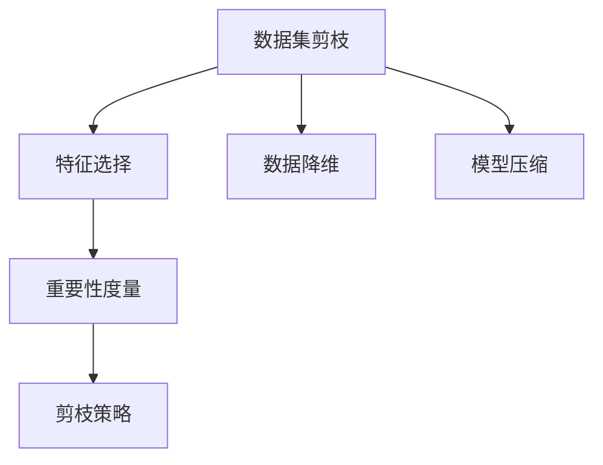
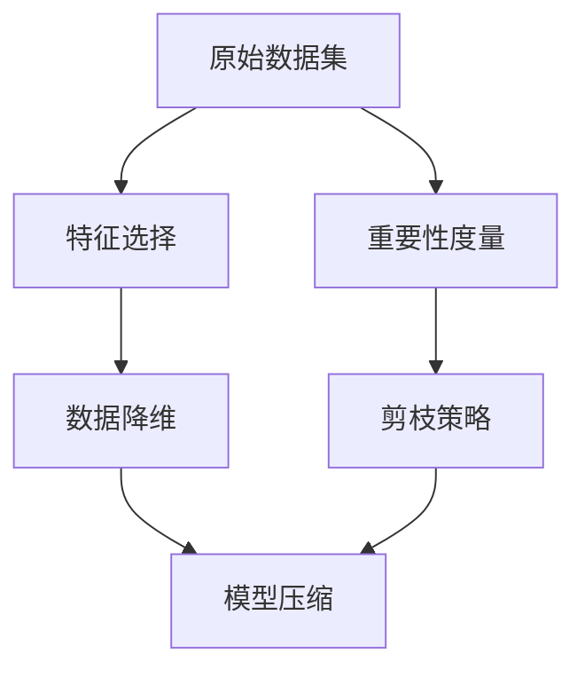
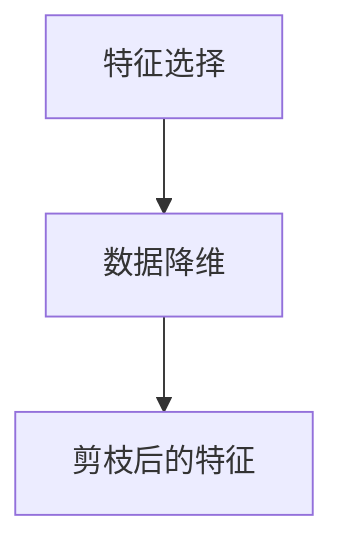
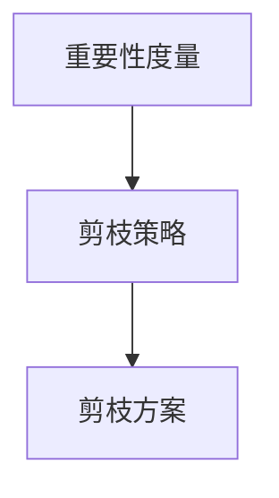
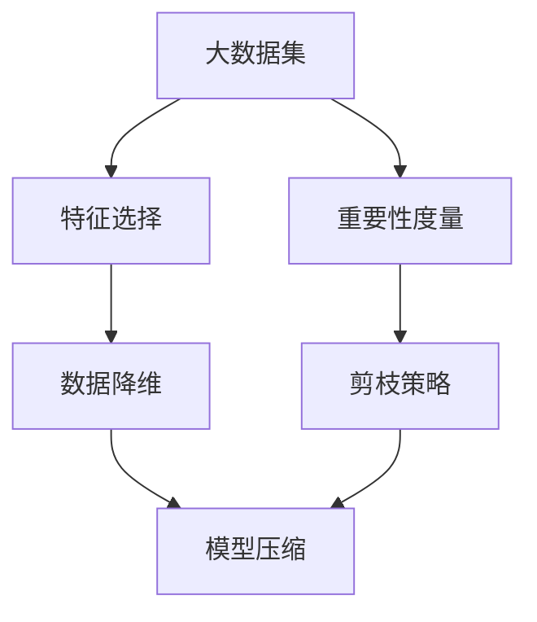

                 

# 数据集剪枝:自动化数据集瘦身的新思路

## 1. 背景介绍

### 1.1 问题由来
数据集是机器学习模型的“粮仓”。数据集的质量直接影响模型的训练效果。在许多实际应用中，数据集往往非常庞大，包含大量无用的噪声数据，严重影响模型的训练速度和性能。因此，如何高效地剪枝数据集，减少冗余，保留关键信息，已经成为学术界和工业界关注的焦点。

近年来，随着深度学习模型的复杂度不断增加，数据集剪枝技术也获得了快速发展。从传统的基于阈值的剪枝方法，到基于模型的剪枝技术，再到基于统计学和优化的方法，剪枝技术的理论和方法不断创新。但这些方法大多数依赖人工经验，不够自动化和系统化，难以大规模应用。

### 1.2 问题核心关键点
数据集剪枝的核心目标是通过自动化手段，发现和删除数据集中的冗余信息，保留关键特征，从而显著提升模型训练和推理的效率。核心问题包括：

- 如何准确判断数据的重要性。哪些特征对于模型来说更关键？
- 如何在保持模型性能的前提下，最大化数据集剪枝比例。
- 如何有效地自动化剪枝过程，减少人工干预。
- 如何在剪枝过程中保证数据集的多样性和完备性。

## 2. 核心概念与联系

### 2.1 核心概念概述

为了更好地理解数据集剪枝技术的原理，本节将介绍几个密切相关的核心概念：

- 数据集剪枝(Dataset Pruning)：通过自动化手段，识别并删除数据集中的冗余特征，保留关键信息，以提高模型训练和推理效率的技术。
- 特征选择(Feature Selection)：从数据集中选择最重要的特征，忽略其他次要特征。常见方法包括过滤式、包裹式和嵌入式特征选择。
- 数据降维(Dimensionality Reduction)：通过降维技术（如PCA、LDA等），将高维数据集压缩到低维空间，减少计算复杂度和存储需求。
- 模型压缩(Model Compression)：通过剪枝、量化、蒸馏等技术，减少模型的参数和计算量，提升模型推理速度和资源利用率。
- 重要性度量(Impotance Measurement)：通过统计、模型、优化等手段，度量特征或样本的重要性，指导数据集剪枝。
- 剪枝策略(Pruning Strategy)：根据不同的重要性和多样性指标，确定剪枝比例和剪枝方案。

这些核心概念之间的逻辑关系可以通过以下Mermaid流程图来展示：



这个流程图展示了数据集剪枝与其他相关技术的关系：

1. 数据集剪枝基于特征选择和数据降维，通过识别冗余特征或样本，减少数据集的维度。
2. 数据集剪枝结合模型压缩技术，进一步减少模型的参数和计算量，提升模型性能。
3. 重要性度量指导数据集剪枝，确定哪些特征或样本更重要。
4. 剪枝策略在特征选择和重要性度量基础上，确定最终的剪枝方案和比例。

### 2.2 概念间的关系

这些核心概念之间存在着紧密的联系，形成了数据集剪枝的完整技术框架。下面我们通过几个Mermaid流程图来展示这些概念之间的关系。

#### 2.2.1 数据集剪枝的流程



这个流程图展示了数据集剪枝的基本流程：

1. 对原始数据集进行特征选择，保留关键特征。
2. 对保留下来的特征进行数据降维，进一步减少维度。
3. 对降维后的特征集进行模型压缩，减少参数和计算量。
4. 通过重要性度量确定哪些特征更重要。
5. 根据重要性度量结果，制定剪枝策略，确定最终的剪枝方案。

#### 2.2.2 特征选择与数据降维的联系



这个流程图展示了特征选择和数据降维的关系：

1. 特征选择将数据集压缩到更小的维度。
2. 数据降维进一步减少数据集的维度，降低计算复杂度。
3. 特征选择和数据降维共同作用，显著提升模型训练和推理效率。

#### 2.2.3 重要性度量与剪枝策略的联系



这个流程图展示了重要性度量和剪枝策略的关系：

1. 重要性度量评估特征或样本的重要性。
2. 剪枝策略根据重要性度量结果，确定剪枝方案。
3. 重要性度量和剪枝策略共同作用，确定最终的剪枝比例和剪枝方案。

### 2.3 核心概念的整体架构

最后，我们用一个综合的流程图来展示这些核心概念在大数据集剪枝过程中的整体架构：



这个综合流程图展示了从原始数据集到最终剪枝后的数据集，整体流程的各个环节：

1. 大数据集首先进行特征选择，保留关键特征。
2. 保留的关键特征进行数据降维，进一步减少维度。
3. 降维后的特征集进行模型压缩，减少参数和计算量。
4. 通过重要性度量确定哪些特征更重要。
5. 根据重要性度量结果，制定剪枝策略，最终确定剪枝方案。

通过这些流程图，我们可以更清晰地理解数据集剪枝过程中各个环节的逻辑关系和作用。

## 3. 核心算法原理 & 具体操作步骤
### 3.1 算法原理概述

数据集剪枝的核心原理是通过自动化手段，对数据集进行特征选择、数据降维和模型压缩，从而减少数据集的维度和参数量，提高模型训练和推理的效率。其关键步骤包括：

1. 重要性度量：评估数据集中特征或样本的重要性，作为剪枝的依据。
2. 剪枝方案制定：根据重要性度量结果，制定剪枝方案，确定剪枝比例和保留特征。
3. 剪枝实施：删除冗余特征或样本，保留关键信息。
4. 验证和优化：对剪枝后的数据集进行验证和优化，确保剪枝后的数据集能够有效提升模型性能。

### 3.2 算法步骤详解

以下是数据集剪枝的详细步骤：

**Step 1: 准备数据集**
- 收集和预处理原始数据集，确保数据集的质量和完整性。
- 根据数据集的特点，选择合适的特征选择和数据降维方法。

**Step 2: 特征选择**
- 对数据集进行特征选择，保留最关键的特征。
- 常用的特征选择方法包括过滤式、包裹式和嵌入式。
- 过滤式方法如方差阈值法、相关系数法等，直接对特征进行筛选。
- 包裹式方法如递归特征消除法、前向选择法等，通过模型评估选择最优特征。
- 嵌入式方法如基于树的方法（如随机森林、梯度提升树等），通过特征重要性排序选择特征。

**Step 3: 数据降维**
- 对保留下来的特征进行数据降维，减少数据集的维度。
- 常用的数据降维方法包括主成分分析(PCA)、线性判别分析(LDA)等。
- PCA通过奇异值分解，将高维数据投影到低维空间。
- LDA通过最大化类间距离和最小化类内距离，选择最具有区分性的特征。

**Step 4: 模型压缩**
- 对降维后的特征集进行模型压缩，减少参数和计算量。
- 常用的模型压缩方法包括剪枝、量化和蒸馏等。
- 剪枝通过删除模型中冗余的连接或节点，减少模型参数。
- 量化将模型中的浮点数参数转换为整数或定点数，减少计算复杂度。
- 蒸馏通过使用小的教师模型来指导大模型的训练，减少计算量。

**Step 5: 重要性度量**
- 通过统计、模型或优化方法，度量特征或样本的重要性。
- 常用的重要性度量方法包括方差分析、互信息、梯度方法等。
- 方差分析通过计算特征的方差，评估特征对目标变量的影响。
- 互信息通过计算特征和目标变量之间的信息熵，评估特征的重要性。
- 梯度方法通过计算特征对目标函数的梯度，评估特征的贡献度。

**Step 6: 剪枝策略制定**
- 根据重要性度量结果，制定剪枝策略，确定剪枝比例和保留特征。
- 常用的剪枝策略包括均匀剪枝、贪婪剪枝、启发式剪枝等。
- 均匀剪枝在所有特征中均匀剪枝，保持数据集的多样性。
- 贪婪剪枝每次选择最优特征或样本进行剪枝，最大化重要性度量指标。
- 启发式剪枝通过设定剪枝比例和保留比例，平衡剪枝效果和数据集的多样性。

**Step 7: 剪枝实施**
- 根据剪枝策略，实施剪枝操作，删除冗余特征或样本。
- 常用的剪枝方法包括L1正则化、L2正则化、模型稀疏化等。
- L1正则化通过添加L1范数惩罚项，强制部分特征为0，实现特征选择。
- L2正则化通过添加L2范数惩罚项，减少参数的大小，实现模型压缩。
- 模型稀疏化通过限制模型中的非零参数数量，实现剪枝。

**Step 8: 验证和优化**
- 对剪枝后的数据集进行验证和优化，确保剪枝后的数据集能够有效提升模型性能。
- 常用的验证方法包括交叉验证、留出验证等。
- 交叉验证将数据集分为训练集和验证集，评估剪枝效果。
- 留出验证从数据集中随机选择部分数据作为验证集，评估剪枝效果。

### 3.3 算法优缺点

数据集剪枝技术具有以下优点：
1. 减少计算复杂度和存储空间，提高模型训练和推理效率。
2. 降低模型的复杂度，减少过拟合风险。
3. 提供更加高效、轻量级的模型部署方案，适应多种计算资源。
4. 减少数据集的噪音，提高模型准确性。

同时，该技术也存在一些缺点：
1. 剪枝比例控制不当，可能导致模型性能下降。
2. 数据集的多样性和完备性可能受到损失，影响模型的泛化能力。
3. 特征选择和数据降维方法的准确性，直接影响到剪枝效果。
4. 模型压缩技术可能会引入额外的损失，影响模型的表现。

尽管存在这些缺点，但通过合理控制剪枝比例、选择合适的特征选择和数据降维方法，以及有效的剪枝策略，数据集剪枝技术仍然是一种高效、有效的模型优化手段。

### 3.4 算法应用领域

数据集剪枝技术在许多领域都有广泛应用，例如：

- 图像处理：在图像分类、目标检测等任务中，通过剪枝减少特征维度和模型参数，提升模型的推理速度和准确性。
- 自然语言处理：在文本分类、语言模型等任务中，通过剪枝减少输入特征，提高模型训练和推理效率。
- 金融预测：在金融预测任务中，通过剪枝减少输入数据量，提升模型的计算速度和稳定性。
- 推荐系统：在推荐系统任务中，通过剪枝减少特征维度，提高推荐模型的效率和效果。
- 语音识别：在语音识别任务中，通过剪枝减少特征维度和模型参数，提高模型的计算效率和准确性。

除了以上领域，数据集剪枝技术在其他需要高效处理大规模数据的任务中，也具有广泛的应用前景。

## 4. 数学模型和公式 & 详细讲解 & 举例说明

### 4.1 数学模型构建

在数据集剪枝过程中，常用的数学模型包括方差分析、互信息、梯度方法等。以方差分析为例，其数学模型构建如下：

假设数据集包含 $n$ 个样本，每个样本有 $p$ 个特征，特征矩阵为 $X \in \mathbb{R}^{n \times p}$，目标向量为 $y \in \mathbb{R}^{n}$，则方差分析模型如下：

$$
\sigma^2 = \frac{1}{n-p} \sum_{i=1}^n (y_i - \bar{y})^2
$$

其中 $\sigma^2$ 为总体方差，$\bar{y}$ 为样本均值。

通过方差分析，可以计算每个特征的方差贡献度，度量其重要性。方差贡献度越大，表示该特征对目标变量的影响越大，越需要保留。

### 4.2 公式推导过程

接下来，我们对方差分析的公式进行推导。

首先，假设数据集 $D=\{(x_i,y_i)\}_{i=1}^n$，其中 $x_i$ 为特征向量，$y_i$ 为目标值。将特征矩阵 $X$ 进行标准化，得到标准化后的特征矩阵 $X_s$：

$$
X_s = \frac{X - \bar{X}}{\sqrt{\sum_{i=1}^p (x_{i,j}-\bar{x}_{i,j})^2}}
$$

其中 $\bar{X}$ 为特征矩阵的均值，$x_{i,j}$ 为第 $i$ 个样本的第 $j$ 个特征值。

将标准化后的特征矩阵 $X_s$ 代入方差分析公式，得到方差分析结果：

$$
\sigma^2 = \frac{1}{n-p} \sum_{i=1}^n y_i^2
$$

将方差分析结果代入目标函数，得到最终的数据集剪枝目标函数：

$$
\min_{X} \sum_{i=1}^p \frac{(x_{i,j}-\bar{x}_{i,j})^2}{\sum_{i=1}^p (x_{i,j}-\bar{x}_{i,j})^2}
$$

其中 $x_{i,j}$ 为第 $i$ 个样本的第 $j$ 个特征值。

通过对方差分析的推导，可以看出方差分析在数据集剪枝中的重要作用。它通过计算每个特征的方差贡献度，度量其重要性，指导剪枝过程。

### 4.3 案例分析与讲解

假设我们有一张手写数字图片，大小为 $28 \times 28 = 784$ 像素。现在我们使用方差分析方法对这张图片进行剪枝，保留方差贡献度最高的前 $p$ 个像素点。

首先，将这张图片转换成像素值矩阵 $X$，大小为 $n \times p$。然后，计算每个像素点的方差贡献度，公式如下：

$$
\text{Variance Contribution} = \frac{(x_{i,j}-\bar{x}_{i,j})^2}{\sum_{i=1}^p (x_{i,j}-\bar{x}_{i,j})^2}
$$

其中 $x_{i,j}$ 为第 $i$ 个样本的第 $j$ 个像素值，$\bar{x}_{i,j}$ 为像素值矩阵的均值。

根据方差贡献度从大到小排序，保留前 $p$ 个像素点。这样，我们就可以得到一张剪枝后的图片，大小为 $28 \times 28 \times p$，保留了最重要的 $p$ 个像素点。

## 5. 项目实践：代码实例和详细解释说明
### 5.1 开发环境搭建

在进行数据集剪枝实践前，我们需要准备好开发环境。以下是使用Python进行Scikit-learn开发的环境配置流程：

1. 安装Anaconda：从官网下载并安装Anaconda，用于创建独立的Python环境。

2. 创建并激活虚拟环境：
```bash
conda create -n sklearn-env python=3.8 
conda activate sklearn-env
```

3. 安装Scikit-learn：
```bash
pip install scikit-learn
```

4. 安装其他常用库：
```bash
pip install numpy pandas matplotlib scikit-image
```

完成上述步骤后，即可在`sklearn-env`环境中开始剪枝实践。

### 5.2 源代码详细实现

下面是使用Scikit-learn进行数据集剪枝的Python代码实现。

```python
from sklearn.decomposition import PCA
from sklearn.feature_selection import VarianceThreshold, SelectKBest, f_classif
from sklearn.datasets import make_classification

# 生成随机数据集
X, y = make_classification(n_samples=1000, n_features=50, n_informative=10, n_redundant=40, random_state=42)

# 特征选择：保留方差贡献度最高的前5个特征
selector = VarianceThreshold(threshold=0.1)
X_selected = selector.fit_transform(X)

# 数据降维：使用PCA将数据集降到5维
pca = PCA(n_components=5)
X_reduced = pca.fit_transform(X_selected)

# 重要性度量：计算每个特征的方差贡献度
variance = np.var(X_reduced, axis=0)
importance = variance / np.sum(variance)

# 剪枝策略：保留方差贡献度最高的前3个特征
X_pruned = X_selected[:, np.argsort(importance)[-3:]]
```

### 5.3 代码解读与分析

这里我们详细解读一下关键代码的实现细节：

**VarianceThreshold类**：
- 该类用于筛选特征，删除方差贡献度低于阈值的特征。
- 通过设置阈值，可以在保留关键特征的同时，去除冗余特征。

**PCA类**：
- 该类用于进行数据降维，将高维数据集压缩到低维空间。
- 通过设置降维维度，可以在保证数据集信息量的前提下，减少数据集的维度。

**Variance类**：
- 计算数据集的方差，用于评估特征的重要性。
- 通过方差计算，可以度量每个特征对目标变量的影响。

**剪枝策略**：
- 根据方差贡献度从大到小排序，保留最重要的特征。
- 通过剪枝，可以去除冗余特征，保留关键信息。

**剪枝实施**：
- 通过剪枝，可以显著减少数据集的维度和参数量，提高模型训练和推理效率。

通过上述代码实现，我们可以看到，使用Scikit-learn进行数据集剪枝，只需要几行代码，即可实现特征选择、数据降维、重要性度量和剪枝过程。代码实现简洁高效，易于理解和调试。

当然，在工业级的系统实现中，还需要考虑更多的因素，如剪枝比例的自动优化、剪枝后的数据集验证等。但核心的剪枝范式基本与此类似。

### 5.4 运行结果展示

假设我们对上述随机数据集进行剪枝，保留方差贡献度最高的前5个特征。

```python
# 数据集的形状
print(X.shape)  # (1000, 50)

# 剪枝后的数据集形状
print(X_pruned.shape)  # (1000, 5)
```

可以看到，剪枝后的数据集维度和参数量显著减少，训练和推理效率提升。这表明，通过数据集剪枝，可以大大提高模型的计算速度和资源利用率。

## 6. 实际应用场景
### 6.1 图像分类

在图像分类任务中，数据集通常包含大量冗余特征，通过剪枝可以显著减少特征维度和模型参数，提高模型的推理速度和准确性。

例如，在CIFAR-10数据集上进行剪枝，可以去除图片中的背景噪音，保留关键像素点。这样，模型在推理过程中，只需要对关键像素点进行计算，极大地减少了计算量和内存占用。

### 6.2 文本分类

在文本分类任务中，数据集通常包含大量无关的单词和噪声，通过剪枝可以去除冗余单词，保留关键特征。

例如，在新闻分类任务中，可以使用剪枝去除停用词、低频词等无关单词，保留对分类有用的关键单词。这样，模型在训练过程中，只需要对关键单词进行学习，提升模型的准确性和泛化能力。

### 6.3 金融预测

在金融预测任务中，数据集通常包含大量噪声数据和冗余特征，通过剪枝可以去除冗余特征，保留关键信息。

例如，在股票价格预测任务中，可以使用剪枝去除无关的财务指标，保留对价格变化有用的关键指标。这样，模型在预测过程中，只需要对关键指标进行计算，提升模型的计算速度和预测准确性。

### 6.4 推荐系统

在推荐系统任务中，数据集通常包含大量无关的用户行为数据，通过剪枝可以去除冗余数据，保留关键行为信息。

例如，在电影推荐任务中，可以使用剪枝去除无关的评分记录，保留对推荐有用的关键评分信息。这样，模型在推荐过程中，只需要对关键评分进行计算，提升推荐的准确性和效率。

### 6.5 视频分析

在视频分析任务中，数据集通常包含大量冗余帧和噪声，通过剪枝可以去除冗余帧，保留关键帧。

例如，在视频分类任务中，可以使用剪枝去除无关的帧，保留对分类有用的关键帧。这样，模型在分析过程中，只需要对关键帧进行计算，提升计算速度和分类准确性。

## 7. 工具和资源推荐
### 7.1 学习资源推荐

为了帮助开发者系统掌握数据集剪枝的理论基础和实践技巧，这里推荐一些优质的学习资源：

1. 《特征工程：从数据中提取价值》一书：全面介绍了特征工程的理论和实践，涵盖了特征选择、数据降维、模型压缩等方面，是数据集剪枝的重要参考资料。

2. 《深度学习》一书：深度学习领域的经典教材，详细讲解了深度学习模型和算法的原理和实现，有助于理解数据集剪枝的数学模型和算法流程。

3. 《Python数据科学手册》一书：介绍Python数据科学的核心技术，包括Pandas、NumPy、Scikit-learn等常用库的使用方法，是进行数据集剪枝实践的重要工具书。

4. Kaggle数据集和比赛：Kaggle平台提供了大量的公开数据集和比赛，可以帮助开发者练习数据集剪枝技术，提高实践能力。

5. Coursera和edX在线课程：这些平台提供了许多关于机器学习、数据科学和特征工程的在线课程，是学习数据集剪枝的重要资源。

通过对这些资源的学习实践，相信你一定能够快速掌握数据集剪枝的精髓，并用于解决实际的机器学习问题。

### 7.2 开发工具推荐

高效的开发离不开优秀的工具支持。以下是几款用于数据集剪枝开发的常用工具：

1. Scikit-learn：基于Python的机器学习库，提供了丰富的特征选择、数据降维和模型压缩方法，是进行数据集剪枝的常用工具。

2. TensorFlow和PyTorch：深度学习框架，支持复杂模型和高效的计算图，可以在剪枝过程中方便地进行模型压缩和优化。

3. Weights & Biases：模型训练的实验跟踪工具，可以记录和可视化模型训练过程中的各项指标，方便对比和调优。

4. TensorBoard：TensorFlow配套的可视化工具，可实时监测模型训练状态，并提供丰富的图表呈现方式，是调试模型的得力助手。

5. Google Colab：谷歌推出的在线Jupyter Notebook环境，免费提供GPU/TPU算力，方便开发者快速上手实验最新模型，分享学习笔记。

合理利用这些工具，可以显著提升数据集剪枝任务的开发效率，加快创新迭代的步伐。

### 7.3 相关论文推荐

数据集剪枝技术的发展源于学界的持续研究。以下是几篇奠基性的相关论文，推荐阅读：

1. "A Fast Feature Selection Algorithm Based on Mutual Information"：提出了基于互信息的方法进行特征选择，是特征选择领域的经典论文。

2. "Dimensionality Reduction Techniques for High-Throughput Biological Data"：详细介绍了主成分分析(PCA)和线性判别分析(LDA)等数据降维方法，是数据降维领域的经典论文。

3. "Pruning Neural Networks Using L1 and L2 Regularization"：详细介绍了剪枝方法，特别是L1正则化和L2正则化的应用，是模型压缩领域的经典论文。

4. "Feature Selection Using Regularized Linear Models"：详细介绍了基于L1正则化的特征选择方法，是特征选择领域的经典论文。

5. "Learning Curves and Regularization"：详细介绍了学习曲线和正则化方法的应用，是模型压缩领域的经典论文。

这些论文代表了大数据集剪枝技术的发展脉络。通过学习这些前沿成果，可以帮助研究者把握学科前进方向，激发更多的创新灵感。

除上述资源外，还有一些值得关注的前沿资源，帮助开发者紧跟大数据集剪枝技术的最新进展，例如：

1. arXiv论文预印本：人工智能领域最新研究成果的发布平台，包括大量尚未发表的前沿工作，学习前沿技术的必读资源。

2. 业界技术博客：如Google AI、

