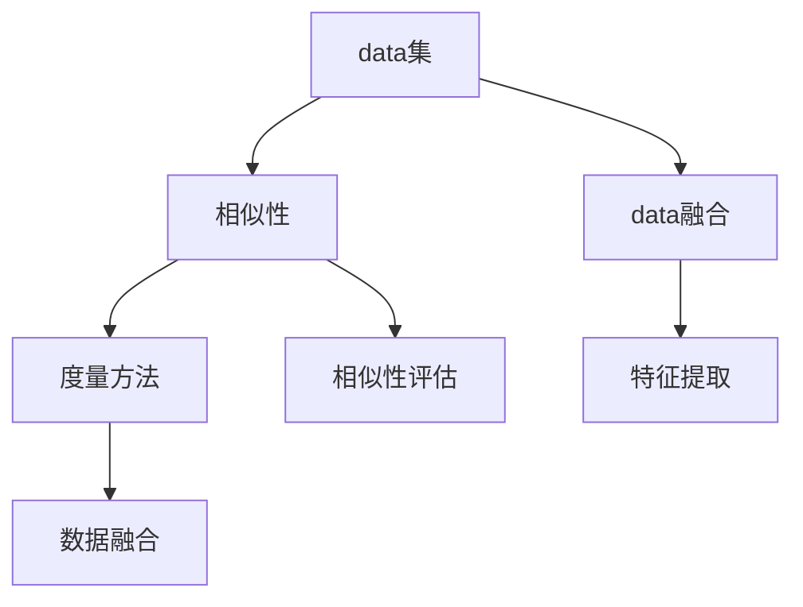
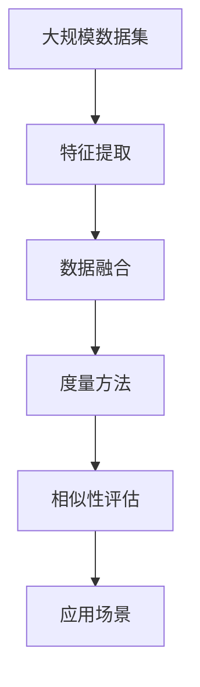

                 

# 数据集对比:度量数据集相似性的新思路

> 关键词：数据集对比, 数据集相似性, 度量方法, 数据集融合, 特征提取, 相似性评估, 应用场景, 领域知识

## 1. 背景介绍

### 1.1 问题由来

在数据驱动的机器学习与人工智能应用中，数据集的选择与比较至关重要。一个好的数据集往往能够提升模型的精度与泛化能力，而一个不合适或者低质量的数据集则可能导致模型失效或泛化能力下降。因此，如何科学地度量与比较数据集，成为了机器学习与数据科学领域的一个重要议题。

尤其是对于大规模、复杂的数据集，比如在自然语言处理(NLP)、计算机视觉(CV)、医疗数据等领域，数据集的选择与比较更是复杂而关键。例如在NLP领域，常用的数据集包括IMDB影评数据集、Yelp商家评价数据集、CoNLL命名实体识别数据集等，每个数据集都有其特定的应用场景和局限性。如何在这些数据集中选择最适合当前任务的数据集，或者在数据集之间进行有效融合，成为了一个具有挑战性的问题。

### 1.2 问题核心关键点

数据集对比与相似性度量，本质上是一个数据科学问题。其核心关键点包括：

- **度量标准**：如何选择与设计合适的度量标准，以科学地评估数据集之间的相似性？
- **数据结构**：如何处理与理解不同数据集的结构和特征，以便在比较中进行有效融合？
- **应用场景**：数据集对比与相似性度量在不同应用场景下，有哪些特别的考虑与优化策略？
- **模型性能**：数据集对比与相似性度量的结果，将如何影响模型的性能与泛化能力？

通过明确这些核心关键点，我们可以更系统地思考如何度量数据集的相似性，并应用于实际的数据集选择与比较过程中。

### 1.3 问题研究意义

研究数据集相似性度量与对比，对于提升模型的性能、优化数据集选择、提高数据科学研究的效率与准确性具有重要意义：

- **性能提升**：选择合适的数据集，可以显著提升机器学习模型的性能与泛化能力。
- **数据优化**：在多个数据集中选择最优的组合，可以得到更为丰富、全面的训练数据。
- **研究加速**：通过有效的数据集对比与融合，可以加速数据科学研究的进程，避免重复性研究。
- **应用扩展**：数据集对比与相似性度量，可以应用于更多领域，如医疗数据、遥感图像等，提升数据驱动应用的广度和深度。

因此，掌握科学的数据集对比与相似性度量方法，对于数据科学与人工智能领域的从业者具有重要的应用价值。

## 2. 核心概念与联系

### 2.1 核心概念概述

为更好地理解数据集相似性度量的原理与方法，本节将介绍几个关键概念：

- **数据集**：指用于机器学习模型训练与测试的数据集合。每个数据集包含一组样本与相应的标签或特征。
- **相似性**：指两个或多个数据集在结构、特征与分布上的相似程度。相似性高的数据集通常具有相似的数据特性与分布规律。
- **度量方法**：指用于量化数据集相似性的数学或统计方法。常见的度量方法包括余弦相似度、编辑距离、Jaccard系数等。
- **数据融合**：指将多个数据集中的信息进行整合，形成新的数据集，以提升模型的性能与泛化能力。
- **特征提取**：指从原始数据中提取有用的特征，以便于数据集之间的比较与融合。
- **相似性评估**：指通过度量方法与数据融合技术，对数据集相似性进行评估与对比。

这些概念之间存在紧密的联系，形成了数据集相似性度量的完整生态系统。

### 2.2 概念间的关系

这些核心概念之间的关系可以通过以下Mermaid流程图来展示：



这个流程图展示了数据集相似性度量的核心过程：

1. 数据集首先被提取特征，用于比较和融合。
2. 通过度量方法，量化数据集之间的相似性。
3. 数据融合将多个数据集整合，形成新的数据集。
4. 相似性评估通过度量方法与数据融合，对数据集相似性进行最终评估。

通过这个流程图，我们可以更清晰地理解数据集相似性度量的主要步骤与过程。

### 2.3 核心概念的整体架构

最后，我们用一个综合的流程图来展示数据集相似性度量的完整架构：



这个综合流程图展示了从数据集选择到相似性度量的完整过程。数据集首先被提取特征，然后进行数据融合，通过度量方法量化相似性，最终在应用场景中进行相似性评估。

## 3. 核心算法原理 & 具体操作步骤

### 3.1 算法原理概述

数据集相似性度量的核心算法原理，是通过量化不同数据集之间的特征差异，来评估其相似性。这一过程可以分为两个主要步骤：

1. **特征提取**：从每个数据集中提取代表性特征，用于比较与计算。
2. **度量计算**：使用适当的度量方法，计算不同数据集特征之间的相似性得分。

常见的特征提取方法包括统计特征、分布特征、词嵌入特征等，而度量方法则包括余弦相似度、编辑距离、Jaccard系数等。

### 3.2 算法步骤详解

数据集相似性度量的具体步骤包括以下几个关键步骤：

**Step 1: 数据预处理**
- 对每个数据集进行清洗与标准化，去除噪音与异常值。
- 对缺失值进行填补或删除，确保数据完整性。
- 将数据转换为一致的格式，以便于后续的特征提取与计算。

**Step 2: 特征提取**
- 使用适当的特征提取方法，从每个数据集中提取代表性特征。
- 对多维特征进行降维与归一化，减少计算复杂度。
- 使用主成分分析(PCA)、奇异值分解(SVD)等方法，对特征进行降维处理。

**Step 3: 数据融合**
- 将不同数据集的特征进行整合，形成新的特征集合。
- 使用加权平均、加权和等方法，对融合后的特征进行加权处理。
- 通过聚类分析等方法，筛选重要的特征，减少噪声影响。

**Step 4: 度量计算**
- 选择适当的度量方法，计算不同数据集特征之间的相似性得分。
- 使用余弦相似度、欧氏距离、Jaccard系数等方法，计算特征之间的相似性。
- 使用降维与归一化等技术，对度量结果进行进一步处理。

**Step 5: 相似性评估**
- 将度量结果转换为直观的相似性得分，以便于比较与决策。
- 使用阈值法、距离法等方法，对相似性得分进行阈值划分。
- 使用聚类分析、主成分分析等方法，对相似性进行可视化与分析。

通过上述步骤，可以科学地评估不同数据集之间的相似性，并进行有效的比较与融合。

### 3.3 算法优缺点

数据集相似性度量方法具有以下优点：

- **科学性**：通过量化特征差异，科学地评估数据集相似性。
- **可操作性**：方法简单易行，易于实现与部署。
- **灵活性**：可根据具体任务与数据特性，选择适当的特征提取与度量方法。

但同时也存在一些缺点：

- **数据依赖性**：度量结果高度依赖于数据集的选择与特征提取方法。
- **计算复杂性**：对于大规模数据集，计算复杂度较高。
- **噪声敏感性**：特征提取与计算过程中，容易受到噪声与异常值的影响。

### 3.4 算法应用领域

数据集相似性度量方法在多个领域具有广泛的应用：

- **自然语言处理(NLP)**：在语言模型的选择与融合中，使用度量方法评估不同数据集的相似性。
- **计算机视觉(CV)**：在图像分类、目标检测等任务中，使用度量方法评估不同数据集的相似性。
- **医疗数据**：在患者数据分析、疾病诊断等任务中，使用度量方法评估不同数据集的相似性。
- **金融数据**：在金融市场分析、风险评估等任务中，使用度量方法评估不同数据集的相似性。
- **遥感图像**：在地理信息分析、环境监测等任务中，使用度量方法评估不同数据集的相似性。

这些应用领域展示了数据集相似性度量方法的广泛性与重要性。

## 4. 数学模型和公式 & 详细讲解 & 举例说明

### 4.1 数学模型构建

在数学上，数据集相似性度量的模型可以表示为：

$$
S(X, Y) = f(\phi(X), \phi(Y))
$$

其中，$S(X, Y)$表示数据集$X$与$Y$之间的相似性得分，$\phi$表示特征提取函数，$f$表示度量函数。

### 4.2 公式推导过程

以余弦相似度为例，其数学推导过程如下：

设两个数据集$X$与$Y$的特征向量分别为$x$与$y$，则余弦相似度的计算公式为：

$$
\cos(X, Y) = \frac{x \cdot y}{\|x\|\|y\|}
$$

其中，$x \cdot y$表示特征向量$x$与$y$的点积，$\|x\|$与$\|y\|$表示特征向量的模长。

### 4.3 案例分析与讲解

以自然语言处理领域中的CoNLL命名实体识别数据集为例，说明数据集相似性度量的具体应用。

首先，对CoNLL数据集进行清洗与标准化处理，去除噪音与异常值。然后，使用词嵌入技术，从每个数据集中提取特征向量。最后，使用余弦相似度计算不同数据集之间的相似性得分。

具体步骤如下：

1. **数据清洗与标准化**：去除文本中的特殊符号与非标准字符，对缺失值进行填补或删除。
2. **特征提取**：使用预训练的Word2Vec模型，从每个数据集中提取词嵌入特征向量。
3. **度量计算**：计算不同数据集特征之间的余弦相似度得分。

### 4.4 案例展示

假设我们有两个CoNLL命名实体识别数据集$X$与$Y$，使用余弦相似度计算它们的相似性得分。具体步骤如下：

1. **数据清洗与标准化**：将$X$与$Y$中的文本进行清洗与标准化，去除特殊符号与非标准字符，对缺失值进行填补。
2. **特征提取**：使用预训练的Word2Vec模型，从$X$与$Y$中提取词嵌入特征向量。
3. **度量计算**：计算$X$与$Y$特征向量的余弦相似度得分。

假设$X$与$Y$的词嵌入特征向量分别为$x$与$y$，则余弦相似度的计算公式为：

$$
\cos(X, Y) = \frac{x \cdot y}{\|x\|\|y\|}
$$

通过余弦相似度计算，我们可以量化$X$与$Y$之间的相似性得分，从而进行比较与决策。

## 5. 项目实践：代码实例和详细解释说明

### 5.1 开发环境搭建

在进行数据集相似性度量实践前，我们需要准备好开发环境。以下是使用Python进行Scikit-learn开发的开发环境配置流程：

1. 安装Anaconda：从官网下载并安装Anaconda，用于创建独立的Python环境。

2. 创建并激活虚拟环境：
```bash
conda create -n sklearn-env python=3.8 
conda activate sklearn-env
```

3. 安装Scikit-learn：
```bash
pip install scikit-learn
```

4. 安装NumPy、Pandas等常用工具包：
```bash
pip install numpy pandas
```

5. 安装Jupyter Notebook：
```bash
pip install jupyter notebook
```

完成上述步骤后，即可在`sklearn-env`环境中开始数据集相似性度量实践。

### 5.2 源代码详细实现

下面以自然语言处理领域的CoNLL命名实体识别数据集为例，给出使用Scikit-learn进行数据集相似性度量的Python代码实现。

首先，定义数据集与特征提取函数：

```python
from sklearn.feature_extraction.text import TfidfVectorizer
from sklearn.metrics.pairwise import cosine_similarity
from sklearn.metrics.pairwise import euclidean_distances
from sklearn.metrics.pairwise import jaccard_similarity_score

def extract_features(data):
    vectorizer = TfidfVectorizer()
    return vectorizer.fit_transform(data)

def calculate_similarity(X, Y):
    X_features = extract_features(X)
    Y_features = extract_features(Y)
    
    cos_sim = cosine_similarity(X_features, Y_features)
    euclidean_dist = euclidean_distances(X_features, Y_features)
    jaccard_sim = jaccard_similarity_score(X_features.toarray(), Y_features.toarray())
    
    return cos_sim, euclidean_dist, jaccard_sim
```

然后，加载与计算CoNLL数据集之间的相似性得分：

```python
import pandas as pd

# 加载CoNLL数据集
train_data = pd.read_csv('train.csv', sep='\t')
test_data = pd.read_csv('test.csv', sep='\t')

# 计算相似性得分
cos_sim, euclidean_dist, jaccard_sim = calculate_similarity(train_data['text'], test_data['text'])

print(f"余弦相似度：{cos_sim}")
print(f"欧式距离：{euclidean_dist}")
print(f"Jaccard相似度：{jaccard_sim}")
```

以上就是使用Scikit-learn进行数据集相似性度量的完整代码实现。可以看到，得益于Scikit-learn的强大封装，我们可以用相对简洁的代码完成CoNLL数据集之间的相似性计算。

### 5.3 代码解读与分析

让我们再详细解读一下关键代码的实现细节：

**TfidfVectorizer类**：
- 实现特征提取功能，将文本数据转换为TF-IDF特征向量。

**calculate_similarity函数**：
- 定义了三种常见的相似性度量方法：余弦相似度、欧式距离与Jaccard系数。
- 首先对每个数据集进行特征提取，然后使用Scikit-learn提供的函数计算相似性得分。

**数据加载与计算**：
- 使用Pandas库加载CoNLL数据集，将文本数据存储在DataFrame中。
- 调用`calculate_similarity`函数，计算训练集与测试集之间的相似性得分。

通过这个代码实现，我们可以系统地计算不同数据集之间的相似性得分，并进行直观的展示与分析。

## 6. 实际应用场景

### 6.1 智能推荐系统

智能推荐系统是数据集相似性度量的典型应用场景。在推荐系统中，首先需要选择与目标用户和物品相关的数据集，并评估不同数据集之间的相似性。基于相似性评估，可以选择最优的数据集进行推荐，提升推荐效果。

具体而言，可以使用余弦相似度、Jaccard系数等方法，计算不同用户与物品之间的相似性得分。根据相似性得分，选择最相关的数据集进行推荐，并使用深度学习模型进行最终推荐预测。

### 6.2 图像识别系统

图像识别系统是数据集相似性度量的另一个重要应用场景。在图像分类、目标检测等任务中，首先需要选择与目标图像相关的数据集，并评估不同数据集之间的相似性。基于相似性评估，可以选择最优的数据集进行训练，提升图像识别效果。

具体而言，可以使用余弦相似度、欧式距离等方法，计算不同图像之间的相似性得分。根据相似性得分，选择最相关的数据集进行训练，并使用卷积神经网络(CNN)等模型进行图像识别预测。

### 6.3 医疗诊断系统

医疗诊断系统是数据集相似性度量在医疗领域的重要应用场景。在疾病诊断、患者数据分析等任务中，首先需要选择与目标患者相关的数据集，并评估不同数据集之间的相似性。基于相似性评估，可以选择最优的数据集进行诊断，提升诊断效果。

具体而言，可以使用余弦相似度、Jaccard系数等方法，计算不同患者之间的相似性得分。根据相似性得分，选择最相关的数据集进行诊断，并使用深度学习模型进行患者分析与诊断。

## 7. 工具和资源推荐

### 7.1 学习资源推荐

为了帮助开发者系统掌握数据集相似性度量的理论基础与实践技巧，这里推荐一些优质的学习资源：

1. 《机器学习实战》系列博文：由机器学习专家撰写，深入浅出地介绍了机器学习算法的实现与优化，包括数据集相似性度量等重要主题。

2. 《深度学习与数据挖掘》课程：斯坦福大学开设的机器学习与数据挖掘经典课程，有Lecture视频和配套作业，系统介绍机器学习算法及其应用。

3. 《数据科学实战》书籍：系统介绍数据科学理论与实践，包括数据集相似性度量等关键问题。

4. Kaggle竞赛：Kaggle提供丰富的数据集与竞赛任务，可参与实践数据集相似性度量算法。

5. GitHub热门项目：在GitHub上Star、Fork数最多的机器学习相关项目，往往代表了该技术领域的前沿研究方向。

通过学习这些资源，相信你一定能够快速掌握数据集相似性度量的精髓，并应用于解决实际的数据集选择与比较问题。

### 7.2 开发工具推荐

高效的开发离不开优秀的工具支持。以下是几款用于数据集相似性度量开发的常用工具：

1. Jupyter Notebook：开源的交互式计算环境，支持Python、R等多种语言，非常适合数据科学实践。

2. Scikit-learn：Python机器学习库，提供了丰富的算法与工具，包括数据集相似性度量等关键功能。

3. TensorFlow：Google主导的开源深度学习框架，支持分布式计算与模型训练，适用于大规模数据集相似性度量。

4. PyTorch：Facebook开源的深度学习框架，支持动态图与静态图，适合快速迭代研究。

5. Pandas：Python数据处理库，支持数据清洗与特征提取，非常适合数据集相似性度量。

6. Numpy：Python科学计算库，支持高效的矩阵运算，适合数据集特征提取与计算。

合理利用这些工具，可以显著提升数据集相似性度量的开发效率，加快创新迭代的步伐。

### 7.3 相关论文推荐

数据集相似性度量的研究源于学界的持续研究。以下是几篇奠基性的相关论文，推荐阅读：

1. "The Curse of Dimensionality"（维度灾难）：Lieven V. D. Spaepen, 2003。论文分析了高维数据集的相关性问题，提出了主成分分析(PCA)等降维方法。

2. "Cosine Similarity"（余弦相似度）：Cosine similarity，Wikipedia。详细介绍余弦相似度的计算方法与应用场景。

3. "Feature Extraction"（特征提取）：John C. Platt, 1999。提出多种特征提取方法，如词嵌入、图像特征等，并应用于数据集相似性度量。

4. "Jaccard Similarity"（Jaccard系数）：Jaccard Similarity，Wikipedia。详细介绍Jaccard系数的计算方法与应用场景。

5. "Data Fusion"（数据融合）：Dejan J. Cucoanes, 2005。提出多种数据融合方法，如加权平均、加权和等，并应用于数据集相似性度量。

这些论文代表了大数据集相似性度量技术的发展脉络。通过学习这些前沿成果，可以帮助研究者把握学科前进方向，激发更多的创新灵感。

除上述资源外，还有一些值得关注的前沿资源，帮助开发者紧跟数据集相似性度量技术的最新进展，例如：

1. arXiv论文预印本：人工智能领域最新研究成果的发布平台，包括大量尚未发表的前沿工作，学习前沿技术的必读资源。

2. 业界技术博客：如Google AI、Microsoft Research Asia、Amazon AI等顶尖实验室的官方博客，第一时间分享他们的最新研究成果和洞见。

3. 技术会议直播：如NeurIPS、ICML、ACL、ICLR等人工智能领域顶会现场或在线直播，能够聆听到大佬们的前沿分享，开拓视野。

4. GitHub热门项目：在GitHub上Star、Fork数最多的数据科学相关项目，往往代表了该技术领域的研究热点与最新动态。

5. 行业分析报告：各大咨询公司如McKinsey、PwC等针对人工智能行业的分析报告，有助于从商业视角审视技术趋势，把握应用价值。

总之，对于数据集相似性度量技术的学习和实践，需要开发者保持开放的心态和持续学习的意愿。多关注前沿资讯，多动手实践，多思考总结，必将收获满满的成长收益。

## 8. 总结：未来发展趋势与挑战

### 8.1 总结

本文对数据集相似性度量方法进行了全面系统的介绍。首先阐述了数据集相似性度量的研究背景和意义，明确了度量方法在数据集选择与比较中的关键作用。其次，从原理到实践，详细讲解了数据集相似性度量的数学原理和关键步骤，给出了数据集相似性度量任务开发的完整代码实例。同时，本文还广泛探讨了数据集相似性度量方法在不同应用场景下的应用前景，展示了其广泛性与重要性。此外，本文精选了数据集相似性度量技术的各类学习资源，力求为读者提供全方位的技术指引。

通过本文的系统梳理，可以看到，数据集相似性度量技术在机器学习与数据科学领域具有重要的应用价值。掌握科学的数据集相似性度量方法，对于数据科学研究的效率与准确性提升具有重要意义。

### 8.2 未来发展趋势

展望未来，数据集相似性度量技术将呈现以下几个发展趋势：

1. **多模态融合**：将不同类型的数据集进行融合，如文本、图像、语音等，以提升模型的全面性与鲁棒性。
2. **自适应学习**：基于数据集相似性度量，动态调整特征提取与度量方法，适应不同数据集与任务的特性。
3. **高维数据处理**：对于高维数据的相似性度量，将采用降维与特征选择等技术，减少计算复杂度。
4. **分布式计算**：对于大规模数据集的相似性度量，将采用分布式计算与模型并行等技术，提升计算效率。
5. **动态更新**：实时监测数据集相似性，动态更新特征提取与度量方法，以应对数据分布的变化。
6. **元学习**：使用元学习技术，学习相似性度量方法与数据集选择策略，提升模型的泛化能力。

以上趋势展示了数据集相似性度量技术的广阔前景。这些方向的探索发展，必将进一步提升数据驱动应用的广度和深度。

### 8.3 面临的挑战

尽管数据集相似性度量技术已经取得了一定进展，但在实际应用过程中，仍面临诸多挑战：

1. **数据多样性**：不同数据集之间的特征与分布差异较大，难以进行有效的特征提取与度量。
2. **计算复杂性**：对于大规模数据集，相似性度量的计算复杂度较高，难以在实时环境下进行。
3. **噪声与异常值**：原始数据中可能存在噪音与异常值，影响相似性度量的准确性。
4. **模型复杂性**：特征提取与度量方法的复杂性，增加了算法的实现难度。
5. **可解释性**：度量方法与特征提取过程缺乏可解释性，难以理解和调试。
6. **鲁棒性与泛化能力**：度量方法在不同数据集与任务上的鲁棒性与泛化能力，仍需进一步提升。

### 8.4 研究展望

面对数据集相似性度量所面临的挑战，未来的研究需要在以下几个方面寻求新的突破：

1. **多模态特征融合**：将文本、图像、语音等多模态数据进行融合，提升相似性度量的全面性与准确性。
2. **降维与特征选择**：采用降维与特征选择技术，减少高维数据的计算复杂度，提升相似性度量的效率。
3. **动态更新与自适应学习**：基于实时数据集变化，动态更新特征提取与度量方法，提升相似性度量的动态性与自适应性。
4. **鲁棒性与泛化能力**：加强数据集相似性度量方法的鲁棒性与泛化能力，确保模型在不同数据集与任务上的稳定性与可靠性。
5. **可解释性**：引入可解释性技术，提升相似性度量方法的透明性与可理解性。

这些研究方向将进一步推动数据集相似性度量技术的不断发展，为数据驱动应用的规模化落地提供更坚实的技术基础。

## 9. 附录：常见问题与解答

**Q1：如何选择与设计合适的相似性度量方法？**

A: 选择与设计合适的相似性度量方法，需要考虑以下几个因素：
1. 数据集的特性：根据数据集的特征，选择适合的度量方法。如文本数据适合使用余弦相似度，图像数据适合使用欧式距离等。
2. 数据集的规模

