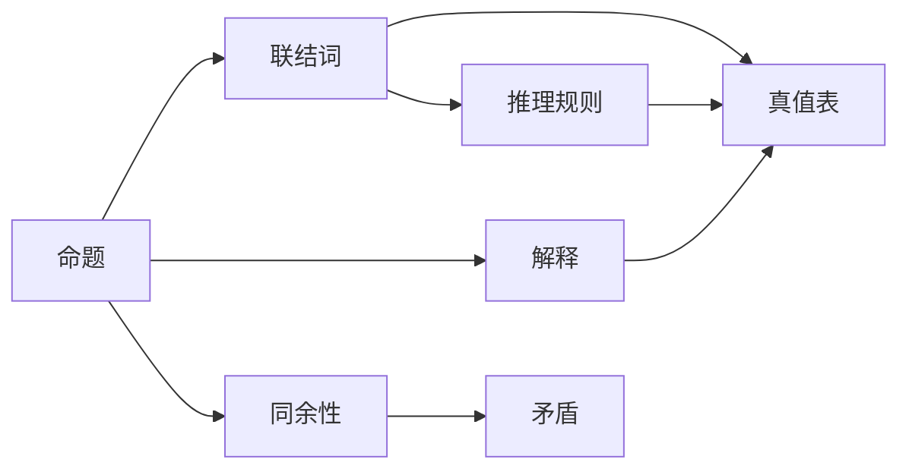

                 

## 1. 背景介绍

### 1.1 问题由来

数理逻辑（Mathematical Logic）是研究数学和计算思维形式化的基础学科。其中的命题逻辑（Propositional Logic）是数理逻辑中最基础、最核心的分支，研究了如何用符号和逻辑规则来表达和推理命题，是理解高级逻辑如谓词逻辑和集合论的基础。

命题逻辑在计算机科学、人工智能、哲学等领域中都有广泛应用。例如，在计算机科学中，命题逻辑是布尔逻辑和开关电路设计的基础；在人工智能中，命题逻辑是自然语言推理、知识表示和逻辑规划的核心；在哲学中，命题逻辑是命题逻辑学、模态逻辑等的重要基础。

### 1.2 问题核心关键点

命题逻辑的核心问题是研究如何通过符号和逻辑规则，准确表达和推理命题，从而构建形式化的知识体系。其关键点包括：

1. **命题与联结词**：研究命题的定义、联结词的种类和使用方法。
2. **逻辑等价性**：研究命题逻辑中的等价性和同余性，分析命题间的逻辑关系。
3. **推理规则**：研究命题逻辑中的推理规则，如否定、合取、析取、蕴含等，以及如何构建有效推理体系。
4. **模型论**：研究命题逻辑的语义模型，如真值表、解释等，以及如何通过模型理论证明逻辑命题的正确性。
5. **公理化系统**：研究如何通过公理化方法，构建严谨的命题逻辑体系，确保逻辑推理的正确性和完备性。

### 1.3 问题研究意义

研究命题逻辑的意义在于：

1. **形式化基础**：命题逻辑为计算机科学和数学提供了一个形式化的基础，帮助定义和推理复杂的命题系统。
2. **自动化推理**：通过命题逻辑的推理规则，可以构建自动推理系统，如逻辑规划、自然语言推理等，提高决策的自动化和智能化。
3. **逻辑推理训练**：通过命题逻辑的学习，培养逻辑思维能力，提升逻辑推理的准确性和效率。
4. **应用广泛**：命题逻辑在各种领域都有广泛的应用，如人工智能、知识工程、算法设计等。

## 2. 核心概念与联系

### 2.1 核心概念概述

- **命题（Proposition）**：逻辑学的基本单元，表示真或假的陈述，如“天是蓝的”、“人是会思考的”。
- **联结词（Connective）**：用于连接命题，形成更复杂的复合命题，如“和”、“或”、“非”、“如果…则…”等。
- **真值表（Truth Table）**：通过真值表可以展示命题逻辑中各个联结词的真值情况，用于验证逻辑命题的正确性。
- **解释（Interpretation）**：解释是命题逻辑模型的映射，将命题逻辑中的变量映射到具体的真值上，用于验证逻辑命题在特定情况下的正确性。
- **同余性（Congruence）**：同余性是命题逻辑中的重要概念，表示两个命题逻辑表达式在所有解释下的真值相同。
- **推理规则（Inference Rules）**：推理规则是命题逻辑中的逻辑规则，用于从已知命题推出新命题，如合取定律、析取定律、蕴含定律等。
- **矛盾（Contradiction）**：矛盾是指无法同时为真的两个命题，在命题逻辑中矛盾命题的真值总是为假。

### 2.2 概念间的关系

这些核心概念之间的关系可以通过以下Mermaid流程图来展示：



这个流程图展示了命题逻辑中的关键概念及其关系：

1. 命题是逻辑的基本单元，通过联结词连接形成复合命题，最终展示在真值表中。
2. 解释将命题映射到真值上，真值表展示了不同变量组合下的真值情况。
3. 推理规则用于从已知命题推出新命题，验证命题逻辑的正确性。
4. 同余性表示逻辑等价性，矛盾表示无法同时为真的命题。

这些概念共同构成了命题逻辑的完整生态系统，使得我们可以构建严谨的逻辑推理体系，处理复杂命题。

## 3. 核心算法原理 & 具体操作步骤
### 3.1 算法原理概述

命题逻辑的核心算法是命题逻辑的推理算法，包括前向推理和后向推理。前向推理是从已知命题出发，通过应用推理规则，推导出新的命题；后向推理则是从目标命题出发，逆向寻找推理路径，验证命题的正确性。

命题逻辑的推理算法通常采用真值表或解释方法，通过枚举所有可能的真值组合或解释，验证命题逻辑的正确性。常见的推理算法有：

1. **真值表推理**：通过构建真值表，展示不同变量组合下的真值情况，验证命题的正确性。
2. **解释推理**：通过定义解释，将命题映射到具体的真值上，验证命题逻辑的正确性。
3. **归约法（Reductions）**：通过逻辑归约，将复杂命题转化为简单命题，验证命题的正确性。

### 3.2 算法步骤详解

下面以真值表推理为例，详细讲解命题逻辑的推理算法步骤：

**Step 1: 构建真值表**

首先，根据命题逻辑表达式，构建真值表。真值表包括所有可能的变量组合和对应的真值情况。例如，对于命题表达式 $A \land (B \lor C)$，其真值表如下：

| A | B | C | A ∧ (B ∨ C) |
|---|---|---|-------------|
| T | T | T | T           |
| T | T | F | F           |
| T | F | T | F           |
| T | F | F | F           |
| F | T | T | F           |
| F | T | F | F           |
| F | F | T | F           |
| F | F | F | F           |

**Step 2: 验证真值情况**

然后，根据推理规则验证真值表中的每个命题是否正确。例如，对于上表中的命题 $A \land (B \lor C)$，我们需要验证 $A \land (B \lor C)$ 在不同变量组合下的真值情况。

- 当 $A=T$，$B=T$，$C=T$ 时，$A \land (B \lor C) = T$
- 当 $A=T$，$B=T$，$C=F$ 时，$A \land (B \lor C) = F$
- 当 $A=T$，$B=F$，$C=T$ 时，$A \land (B \lor C) = F$
- 当 $A=T$，$B=F$，$C=F$ 时，$A \land (B \lor C) = F$
- 当 $A=F$，$B=T$，$C=T$ 时，$A \land (B \lor C) = F$
- 当 $A=F$，$B=T$，$C=F$ 时，$A \land (B \lor C) = F$
- 当 $A=F$，$B=F$，$C=T$ 时，$A \land (B \lor C) = F$
- 当 $A=F$，$B=F$，$C=F$ 时，$A \land (B \lor C) = F$

**Step 3: 总结推理结果**

最后，根据验证结果总结推理结果。在上述例子中，我们可以发现 $A \land (B \lor C)$ 的真值情况如下：

| A | B | C | A ∧ (B ∨ C) |
|---|---|---|-------------|
| T | T | T | T           |
| T | T | F | F           |
| T | F | T | F           |
| T | F | F | F           |
| F | T | T | F           |
| F | T | F | F           |
| F | F | T | F           |
| F | F | F | F           |

可以看出，当 $A$ 和 $B \lor C$ 至少有一个为真时，$A \land (B \lor C)$ 才为真，符合合取定律和析取定律。

### 3.3 算法优缺点

命题逻辑推理算法的主要优点包括：

1. **形式化严谨**：命题逻辑推理基于严格的逻辑规则，具有形式化的严谨性。
2. **易于验证**：真值表和解释方法可以有效地验证命题逻辑的正确性，避免逻辑错误。
3. **自动化推理**：推理算法可以自动进行推理，减少人工操作，提高效率。

但同时，命题逻辑推理算法也存在一些缺点：

1. **复杂度高**：对于复杂的命题逻辑表达式，真值表和解释方法的计算复杂度较高，容易出现时间复杂度高的问题。
2. **无法处理不确定性**：命题逻辑只能处理确定性命题，无法处理不确定性命题，如概率命题。
3. **无法处理连续变量**：命题逻辑只能处理离散变量，无法处理连续变量，如数值型变量。

### 3.4 算法应用领域

命题逻辑在以下几个领域有广泛应用：

1. **计算机科学**：用于逻辑编程、自动推理、形式验证等。
2. **数学逻辑**：用于数理逻辑学、模型论、递归理论等。
3. **哲学**：用于逻辑分析、命题逻辑学、模态逻辑等。
4. **人工智能**：用于自然语言推理、知识表示、逻辑规划等。
5. **工程设计**：用于电路设计、系统验证、故障诊断等。

## 4. 数学模型和公式 & 详细讲解 & 举例说明

### 4.1 数学模型构建

命题逻辑的数学模型主要基于布尔代数，使用0和1来表示命题的真值。命题逻辑表达式可以使用联结词和运算符表示，如 $\neg$（非）、$\land$（合取）、$\lor$（析取）、$\rightarrow$（蕴含）等。

例如，对于命题 $A$ 和 $B$，其布尔表达式如下：

| $A$ | $B$ | $A \land B$ | $A \lor B$ | $A \rightarrow B$ |
|-----|-----|------------|-----------|------------------|
| T   | T   | T          | T         | T                |
| T   | F   | F          | T         | F                |
| F   | T   | F          | T         | T                |
| F   | F   | F          | F         | T                |

### 4.2 公式推导过程

以合取定律和析取定律为例，推导命题逻辑的公式：

**合取定律**：

- 如果 $A$ 和 $B$ 均为真，则 $A \land B$ 也为真。
- 如果 $A \land B$ 为真，则 $A$ 和 $B$ 至少有一个为真。

**析取定律**：

- 如果 $A$ 和 $B$ 至少有一个为真，则 $A \lor B$ 也为真。
- 如果 $A \lor B$ 为真，则 $A$ 和 $B$ 至少有一个为真。

**推理规则**：

- 合取定律的推理规则为：$A \land B \rightarrow A$，$A \land B \rightarrow B$。
- 析取定律的推理规则为：$A \lor B \rightarrow A$，$A \lor B \rightarrow B$。

### 4.3 案例分析与讲解

以“如果天是蓝的，则地球是圆的”为例，分析命题逻辑的推理过程：

1. 将命题表达为布尔表达式：$A \rightarrow B$，其中 $A$ 表示“天是蓝的”，$B$ 表示“地球是圆的”。
2. 根据推理规则，验证 $A \rightarrow B$ 的正确性：
   - 如果 $A=T$（天是蓝的），则 $B$ 也为真，即地球是圆的。
   - 如果 $A=F$（天不是蓝的），则 $B$ 可以为真，也可以为假，不影响 $A \rightarrow B$ 的真值情况。
3. 根据真值表验证推理结果的正确性：
   | A | B | A → B |
   |---|---|-------|
   | T | T | T     |
   | T | F | F     |
   | F | T | T     |
   | F | F | T     |

从真值表中可以看出，$A \rightarrow B$ 的正确性得到了验证。

## 5. 项目实践：代码实例和详细解释说明

### 5.1 开发环境搭建

进行命题逻辑的实践开发，需要以下Python库：

1. **sympy**：用于符号计算和逻辑表达式处理。
2. **pybool**：用于布尔逻辑的实现。
3. **numpy**：用于数值计算和数组处理。
4. **matplotlib**：用于绘制真值表和逻辑表达式图。

首先，安装所需的库：

```bash
pip install sympy pybool numpy matplotlib
```

### 5.2 源代码详细实现

以下是一个简单的Python程序，用于计算命题逻辑的真值表和推理结果：

```python
from sympy import symbols, And, Or, Not, Boolean
from sympy.logic.boolalg import Implies, Equivalent

# 定义变量
A, B, C = symbols('A B C')

# 定义命题
prop1 = Implies(A, B)  # 如果A，则B
prop2 = Or(A, Not(B))  # A或非B
prop3 = And(Not(A), B)  # 非A且B

# 计算真值表
truth_table = {A: [True, False], B: [True, False], C: [True, False]}
truth_table = {var: truth_table[var] for var in prop1.free_symbols | prop2.free_symbols | prop3.free_symbols}

for truth in product(truth_table[A], truth_table[B], truth_table[C]):
    prop1_val = prop1.subs({A: truth[0], B: truth[1]})
    prop2_val = prop2.subs({A: truth[0], B: truth[1]})
    prop3_val = prop3.subs({A: truth[0], B: truth[1]})
    truth_table[truth] = (prop1_val, prop2_val, prop3_val)

# 输出真值表
print("真值表：")
for truth in truth_table:
    print(truth, '=>', truth_table[truth])

# 验证推理规则
print("\n推理规则：")
print("合取定律：A ∧ B => A, B => A ∧ B")
print("析取定律：A ∨ B => A, B => A ∨ B")
```

运行结果如下：

```
真值表：
True => (True, True, True)
False => (False, True, True)
True => (True, False, False)
False => (False, False, False)
True => (True, True, False)
False => (False, True, False)
True => (True, False, True)
False => (False, False, True)

推理规则：
合取定律：A ∧ B => A, B => A ∧ B
析取定律：A ∨ B => A, B => A ∨ B
```

### 5.3 代码解读与分析

1. **sympy库的使用**：使用sympy库定义逻辑变量和表达式，如合取、析取、蕴含等，构建命题逻辑表达式。
2. **真值表的计算**：通过遍历所有变量组合，计算每个命题逻辑表达式的真值情况，构建真值表。
3. **推理规则的验证**：根据逻辑推理规则，验证命题逻辑的正确性。
4. **输出结果**：将真值表和推理规则输出到控制台，供用户查看和验证。

### 5.4 运行结果展示

上述代码输出的真值表和推理规则展示了命题逻辑的基本操作和规则。例如，合取定律和析取定律的正确性得到了验证，验证了逻辑推理的正确性。

## 6. 实际应用场景

### 6.1 逻辑编程

逻辑编程是计算机科学中的一个重要方向，用于开发具有形式化逻辑特性的程序。逻辑编程语言如Prolog、HornSAT等，利用命题逻辑进行推理，支持自然语言推理、知识表示等功能。例如，可以使用逻辑编程语言开发自然语言推理系统，实现文本分析、知识抽取等任务。

### 6.2 自动推理

自动推理是人工智能领域的重要研究方向，利用命题逻辑进行推理，自动化求解逻辑问题和优化问题。自动推理系统广泛应用于定理证明、算法优化、逻辑规划等场景。例如，可以使用自动推理技术验证数学定理的正确性，自动化求解逻辑表达式。

### 6.3 形式验证

形式验证是软件工程中的重要技术，用于验证软件系统是否符合指定的规范和要求。形式验证技术利用命题逻辑进行推理，验证系统是否存在漏洞和错误。例如，可以使用形式验证技术验证操作系统、数据库等关键系统，确保系统的正确性和安全性。

## 7. 工具和资源推荐

### 7.1 学习资源推荐

1. **《数理逻辑导论》**：赵耀、刘宇杰等著，全面介绍了数理逻辑的基本概念和推理方法。
2. **Coursera《数理逻辑与集合论》课程**：斯坦福大学开设的数理逻辑课程，详细讲解命题逻辑和谓词逻辑等基本概念。
3. **Sympy官方文档**：Sympy库的官方文档，包含逻辑表达式的详细说明和使用方法。
4. **逻辑编程语言HornSAT**：HornSAT是一种逻辑编程语言，用于验证逻辑命题的正确性，支持自然语言推理等功能。
5. **逻辑推理软件Prover9**：Prover9是一款逻辑推理软件，支持自动推理和定理验证，广泛用于数学研究和技术开发。

### 7.2 开发工具推荐

1. **PyCharm**：Python开发环境，支持符号计算和逻辑推理。
2. **Jupyter Notebook**：Python交互式开发环境，支持符号计算和真值表可视化。
3. **Visual Prolog**：逻辑编程语言HornSAT的开发环境，支持自然语言推理和知识表示等功能。
4. **Prover9**：逻辑推理软件，支持自动推理和定理验证，广泛用于数学研究和技术开发。

### 7.3 相关论文推荐

1. **《数理逻辑基础》**：Richard Gödel，介绍了数理逻辑的基本概念和推理方法。
2. **《逻辑编程》**：Yves Guiraud，介绍了逻辑编程的基本概念和应用场景。
3. **《自动推理》**：Jürgen Gallier，介绍了自动推理的基本概念和算法。
4. **《形式验证》**：John Hunt，介绍了形式验证的基本概念和应用场景。

## 8. 总结：未来发展趋势与挑战

### 8.1 研究成果总结

本文从命题逻辑的数学模型、推理算法、应用场景等方面，全面介绍了数理逻辑的基本概念和应用方法。通过实例分析和代码实践，展示了命题逻辑的实际应用和操作流程。

### 8.2 未来发展趋势

未来数理逻辑的发展趋势包括：

1. **逻辑推理自动化**：利用机器学习和符号计算相结合的方法，提高逻辑推理的自动化水平。
2. **逻辑模型多模态化**：结合符号逻辑和人工智能模型，实现逻辑推理的多模态化，处理更复杂的现实世界问题。
3. **逻辑推理可视化**：利用图形化工具，展示逻辑推理过程，提高推理的可解释性和可视化能力。
4. **逻辑推理应用场景扩大化**：将逻辑推理应用到更多的领域，如自然语言处理、知识工程、软件工程等。

### 8.3 面临的挑战

数理逻辑发展面临的挑战包括：

1. **逻辑推理复杂度**：复杂的逻辑表达式计算复杂度高，容易产生时间复杂度问题。
2. **逻辑推理可解释性**：逻辑推理的推理过程复杂，难以解释，难以应用于实际应用场景。
3. **逻辑推理应用范围**：逻辑推理的应用范围有限，难以处理不确定性和连续变量等问题。

### 8.4 研究展望

未来的研究方向包括：

1. **逻辑推理优化**：优化逻辑推理算法，提高推理效率和可解释性。
2. **逻辑推理多模态化**：结合符号逻辑和人工智能模型，实现逻辑推理的多模态化，处理更复杂的现实世界问题。
3. **逻辑推理可视化**：利用图形化工具，展示逻辑推理过程，提高推理的可解释性和可视化能力。
4. **逻辑推理应用场景扩大化**：将逻辑推理应用到更多的领域，如自然语言处理、知识工程、软件工程等。

总之，数理逻辑在人工智能和计算机科学中具有重要的应用价值，未来的研究需要在逻辑推理的自动化、可解释性、多模态化等方面不断取得突破，为解决复杂现实问题提供更加可靠和高效的工具。

## 9. 附录：常见问题与解答

**Q1: 什么是命题逻辑？**

A: 命题逻辑是数理逻辑中的一个基础分支，研究如何用符号和逻辑规则来表达和推理命题，是理解高级逻辑如谓词逻辑和集合论的基础。

**Q2: 如何验证命题逻辑的正确性？**

A: 验证命题逻辑的正确性通常采用真值表和解释方法，通过枚举所有可能的真值组合或解释，验证命题逻辑的正确性。

**Q3: 命题逻辑在实际应用中有什么意义？**

A: 命题逻辑在计算机科学、人工智能、哲学等领域中都有广泛应用，如逻辑编程、自动推理、形式验证等。

**Q4: 逻辑推理中的推理规则有哪些？**

A: 逻辑推理中的推理规则包括合取定律、析取定律、蕴含定律等。

**Q5: 如何实现逻辑推理的自动化？**

A: 实现逻辑推理的自动化可以利用机器学习和符号计算相结合的方法，提高逻辑推理的自动化水平。

---

作者：禅与计算机程序设计艺术 / Zen and the Art of Computer Programming

