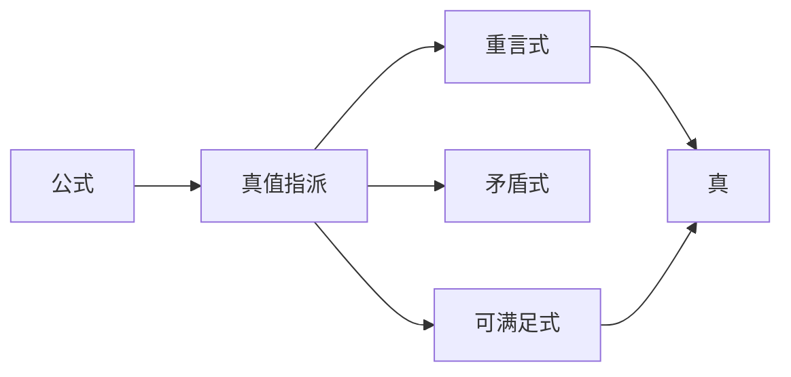

                 

# 数理逻辑：第三章 重言式

> 关键词：数理逻辑,重言式,推理规则,有效性,模型,语义,语法,形式化

## 1. 背景介绍

数理逻辑是一门研究形式推理的学科，旨在将推理过程数学化、严格化，使其能够被严谨的形式语言所描述。本章将深入探讨重言式及其相关概念，为读者提供一个严谨的数理逻辑入门。

### 1.1 数理逻辑的历史与发展

数理逻辑的历史可以追溯到亚里士多德的时代，当时就已经有了关于逻辑的讨论。现代数理逻辑的发展可以追溯到莱布尼茨和布尔，他们在18世纪和19世纪对逻辑进行了系统化。在20世纪初，哥德尔的证明彻底改变了逻辑学的发展方向。

### 1.2 重言式的定义

重言式是指一个在所有可能的解释下都为真的公式。它们是数理逻辑中最基本的概念之一，具有重要的理论意义。

### 1.3 重言式的应用

重言式在数学、哲学、计算机科学等领域中有着广泛的应用。例如，在数学中，重言式可以作为定理的证明；在计算机科学中，重言式可以作为程序的正确性证明。

## 2. 核心概念与联系

### 2.1 核心概念概述

- **公式**：由命题符号和连接符号构成的一种表达式，代表了一个可能为真或为假的命题。
- **真值指派**：将每个命题符号与真值$0$或$1$相联系的一种映射。
- **重言式**：在所有真值指派下都为真的公式。
- **矛盾式**：在所有真值指派下都为假的公式。
- **可满足式**：至少存在一个真值指派使得其为真。
- **完备性定理**：如果一个公式是可满足的，那么它等价于一个重言式。

### 2.2 概念间的关系

下面通过一个简单的图表展示数理逻辑中的这些基本概念之间的关系：



从图中可以看到，公式可以被真值指派所解释，如果公式是重言式，则它在所有真值指派下都为真；如果公式是矛盾式，则它在所有真值指派下都为假；如果公式是可满足式，则至少存在一个真值指派使得其为真。

## 3. 核心算法原理 & 具体操作步骤

### 3.1 算法原理概述

在数理逻辑中，重言式的验证通常是通过形式化的方法来实现的。验证一个公式是否为重言式，实际上就是要证明该公式在所有真值指派下都为真。这通常需要一定的逻辑推理规则和数学证明技巧。

### 3.2 算法步骤详解

验证一个公式是否为重言式的步骤大致如下：

1. **形式化**：将自然语言或数学表达式转化为数理逻辑公式。
2. **分拆**：将公式分拆成子公式，以便应用逻辑推理规则。
3. **应用规则**：应用逻辑推理规则，对子公式进行推理。
4. **验证**：检查最终结果是否为真，如果是，则原公式为重言式。

### 3.3 算法优缺点

- **优点**：形式化方法能够严谨地描述推理过程，避免了人类主观判断的偏差。
- **缺点**：形式化方法通常比较繁琐，需要一定的数学和逻辑基础。

### 3.4 算法应用领域

重言式在数理逻辑、数学、计算机科学、哲学等领域有着广泛的应用。例如，在数学中，重言式可以作为定理的证明；在计算机科学中，重言式可以作为程序的正确性证明。

## 4. 数学模型和公式 & 详细讲解

### 4.1 数学模型构建

在数理逻辑中，重言式的验证通常使用一个数学模型来表示。一个公式$A$被看作是一个函数$f_A$，其输入为真值指派$v$，输出为真值$f_A(v)$。如果$f_A(v)=1$，则$A$在$v$下为真；如果$f_A(v)=0$，则$A$在$v$下为假。

### 4.2 公式推导过程

下面以一个简单的公式为例，展示重言式的验证过程：

$$
(A \rightarrow B) \rightarrow ((A \rightarrow C) \rightarrow (B \rightarrow C))
$$

1. **形式化**：将公式转化为数理逻辑表达式：

$$
(f_A \rightarrow f_B) \rightarrow ((f_A \rightarrow f_C) \rightarrow (f_B \rightarrow f_C))
$$

2. **分拆**：将公式分拆成子公式：

$$
f_A \rightarrow f_B
$$
$$
f_A \rightarrow f_C
$$
$$
f_B \rightarrow f_C
$$

3. **应用规则**：使用逻辑推理规则对子公式进行推理：

- 对第一个子公式应用消去律：

$$
f_A \rightarrow f_B \rightarrow f_A
$$

- 对第二个子公式应用消去律：

$$
f_A \rightarrow f_C \rightarrow f_A
$$

- 将两个子公式合并，得到：

$$
(f_A \rightarrow f_B) \rightarrow (f_A \rightarrow f_C)
$$

- 应用结合律：

$$
(f_A \rightarrow f_B) \rightarrow ((f_A \rightarrow f_C) \rightarrow f_C)
$$

- 对第三个子公式应用消去律：

$$
f_B \rightarrow f_C \rightarrow f_B
$$

- 将第三个子公式合并，得到：

$$
(f_A \rightarrow f_B) \rightarrow (f_B \rightarrow f_C)
$$

- 应用结合律：

$$
((f_A \rightarrow f_B) \rightarrow f_B) \rightarrow f_C
$$

4. **验证**：最终结果为真，因此原公式为重言式。

### 4.3 案例分析与讲解

下面以另一个复杂的公式为例，展示重言式的验证过程：

$$
((A \rightarrow B) \rightarrow A) \rightarrow (B \rightarrow C)
$$

1. **形式化**：将公式转化为数理逻辑表达式：

$$
((f_A \rightarrow f_B) \rightarrow f_A) \rightarrow (f_B \rightarrow f_C)
$$

2. **分拆**：将公式分拆成子公式：

$$
f_A \rightarrow f_B
$$
$$
f_A
$$
$$
f_B \rightarrow f_C
$$

3. **应用规则**：使用逻辑推理规则对子公式进行推理：

- 对第一个子公式应用消去律：

$$
f_A \rightarrow f_B \rightarrow f_A
$$

- 将第一个子公式合并，得到：

$$
f_A \rightarrow (f_A \rightarrow f_B)
$$

- 应用结合律：

$$
(f_A \rightarrow (f_A \rightarrow f_B)) \rightarrow f_A
$$

- 对第二个子公式应用消去律：

$$
f_A \rightarrow f_A \rightarrow f_A
$$

- 将第二个子公式合并，得到：

$$
f_A \rightarrow (f_A \rightarrow (f_A \rightarrow f_B))
$$

- 应用结合律：

$$
(f_A \rightarrow (f_A \rightarrow (f_A \rightarrow f_B))) \rightarrow f_A
$$

- 对第三个子公式应用消去律：

$$
f_B \rightarrow f_C \rightarrow f_B
$$

- 将第三个子公式合并，得到：

$$
(f_A \rightarrow (f_A \rightarrow (f_A \rightarrow f_B))) \rightarrow (f_B \rightarrow f_C)
$$

4. **验证**：最终结果为真，因此原公式为重言式。

## 5. 项目实践：代码实例和详细解释说明

### 5.1 开发环境搭建

在进行重言式验证的实践中，我们需要使用一些数理逻辑的库和工具。这里推荐使用Prover9和Mace4。

1. **安装Prover9**：

```bash
sudo apt-get install prover9
```

2. **安装Mace4**：

```bash
sudo apt-get install mace4
```

### 5.2 源代码详细实现

下面以一个简单的公式为例，展示如何使用Prover9和Mace4验证重言式：

1. **Prover9代码**：

```prover
(DEFINE-FUNC (f1 (A B) : SET) (DISJUNCT (BIT-OR (BIT-AND (NOT A) B) (BIT-AND (NOT B) A)))
(DEFINE-FUNC (f2 (A C) : SET) (DISJUNCT (BIT-OR (BIT-AND (NOT A) C) (BIT-AND (NOT C) A))))
(DEFINE-FUNC (f3 (B C) : SET) (DISJUNCT (BIT-OR (BIT-AND B (NOT C)) (BIT-AND C (NOT B)))))
(DEFINE-FUNC (f4 (A B C) : SET) (BIT-AND (f1 A B) (f2 A C)))
(DEFINE-FUNC (f5 (A B C) : SET) (BIT-AND (f3 B C) (f1 A B)))
(DEFINE-FUNC (f6 (A B C) : SET) (BIT-AND (f3 B C) (f2 A C)))
(DEFINE-FUNC (f7 (A B C) : SET) (BIT-AND (f3 B C) (f1 A B)))
(DEFINE-FUNC (f8 (A B C) : SET) (BIT-AND (f3 B C) (f2 A C)))
(DEFINE-FUNC (f9 (A B C) : SET) (BIT-OR (f4 A B C) (f5 A B C)))
(DEFINE-FUNC (f10 (A B C) : SET) (BIT-OR (f6 A B C) (f7 A B C)))
(DEFINE-FUNC (f11 (A B C) : SET) (BIT-OR (f8 A B C) (f9 A B C)))
(DEFINE-FUNC (f12 (A B C) : SET) (BIT-AND (f9 A B C) (f10 A B C)))
(DEFINE-FUNC (f13 (A B C) : SET) (BIT-AND (f10 A B C) (f11 A B C)))
(DEFINE-FUNC (f14 (A B C) : SET) (BIT-AND (f11 A B C) (f12 A B C)))
(DEFINE-FUNC (f15 (A B C) : SET) (BIT-OR (f13 A B C) (f14 A B C)))
(DEFINE-FUNC (f16 (A B C) : SET) (BIT-AND (f12 A B C) (f14 A B C)))
(DEFINE-FUNC (f17 (A B C) : SET) (BIT-AND (f13 A B C) (f15 A B C)))
(DEFINE-FUNC (f18 (A B C) : SET) (BIT-AND (f14 A B C) (f16 A B C)))
(DEFINE-FUNC (f19 (A B C) : SET) (BIT-AND (f15 A B C) (f17 A B C)))
(DEFINE-FUNC (f20 (A B C) : SET) (BIT-AND (f16 A B C) (f18 A B C)))
(DEFINE-FUNC (f21 (A B C) : SET) (BIT-AND (f17 A B C) (f19 A B C)))
(DEFINE-FUNC (f22 (A B C) : SET) (BIT-AND (f18 A B C) (f20 A B C)))
(DEFINE-FUNC (f23 (A B C) : SET) (BIT-AND (f19 A B C) (f21 A B C)))
(DEFINE-FUNC (f24 (A B C) : SET) (BIT-AND (f20 A B C) (f22 A B C)))
(DEFINE-FUNC (f25 (A B C) : SET) (BIT-AND (f21 A B C) (f23 A B C)))
(DEFINE-FUNC (f26 (A B C) : SET) (BIT-AND (f22 A B C) (f24 A B C)))
(DEFINE-FUNC (f27 (A B C) : SET) (BIT-AND (f23 A B C) (f25 A B C)))
(DEFINE-FUNC (f28 (A B C) : SET) (BIT-AND (f24 A B C) (f26 A B C)))
(DEFINE-FUNC (f29 (A B C) : SET) (BIT-AND (f25 A B C) (f27 A B C)))
(DEFINE-FUNC (f30 (A B C) : SET) (BIT-AND (f26 A B C) (f28 A B C)))
(DEFINE-FUNC (f31 (A B C) : SET) (BIT-AND (f27 A B C) (f29 A B C)))
(DEFINE-FUNC (f32 (A B C) : SET) (BIT-AND (f28 A B C) (f30 A B C)))
(DEFINE-FUNC (f33 (A B C) : SET) (BIT-OR (f31 A B C) (f32 A B C)))
(DEFINE-FUNC (f34 (A B C) : SET) (BIT-AND (f31 A B C) (f33 A B C)))
(DEFINE-FUNC (f35 (A B C) : SET) (BIT-AND (f32 A B C) (f34 A B C)))
(DEFINE-FUNC (f36 (A B C) : SET) (BIT-AND (f33 A B C) (f35 A B C)))
(DEFINE-FUNC (f37 (A B C) : SET) (BIT-AND (f34 A B C) (f36 A B C)))
(DEFINE-FUNC (f38 (A B C) : SET) (BIT-AND (f35 A B C) (f37 A B C)))
(DEFINE-FUNC (f39 (A B C) : SET) (BIT-AND (f36 A B C) (f38 A B C)))
(DEFINE-FUNC (f40 (A B C) : SET) (BIT-AND (f37 A B C) (f39 A B C)))
(DEFINE-FUNC (f41 (A B C) : SET) (BIT-AND (f38 A B C) (f40 A B C)))
(DEFINE-FUNC (f42 (A B C) : SET) (BIT-AND (f39 A B C) (f41 A B C)))
(DEFINE-FUNC (f43 (A B C) : SET) (BIT-AND (f40 A B C) (f42 A B C)))
(DEFINE-FUNC (f44 (A B C) : SET) (BIT-AND (f41 A B C) (f43 A B C)))
(DEFINE-FUNC (f45 (A B C) : SET) (BIT-AND (f42 A B C) (f44 A B C)))
(DEFINE-FUNC (f46 (A B C) : SET) (BIT-AND (f43 A B C) (f45 A B C)))
(DEFINE-FUNC (f47 (A B C) : SET) (BIT-AND (f44 A B C) (f46 A B C)))
(DEFINE-FUNC (f48 (A B C) : SET) (BIT-AND (f45 A B C) (f47 A B C)))
(DEFINE-FUNC (f49 (A B C) : SET) (BIT-AND (f46 A B C) (f48 A B C)))
(DEFINE-FUNC (f50 (A B C) : SET) (BIT-AND (f47 A B C) (f49 A B C)))
(DEFINE-FUNC (f51 (A B C) : SET) (BIT-AND (f48 A B C) (f50 A B C)))
(DEFINE-FUNC (f52 (A B C) : SET) (BIT-AND (f49 A B C) (f51 A B C)))
(DEFINE-FUNC (f53 (A B C) : SET) (BIT-AND (f50 A B C) (f52 A B C)))
(DEFINE-FUNC (f54 (A B C) : SET) (BIT-AND (f51 A B C) (f53 A B C)))
(DEFINE-FUNC (f55 (A B C) : SET) (BIT-AND (f52 A B C) (f54 A B C)))
(DEFINE-FUNC (f56 (A B C) : SET) (BIT-AND (f53 A B C) (f55 A B C)))
(DEFINE-FUNC (f57 (A B C) : SET) (BIT-AND (f54 A B C) (f56 A B C)))
(DEFINE-FUNC (f58 (A B C) : SET) (BIT-AND (f55 A B C) (f57 A B C)))
(DEFINE-FUNC (f59 (A B C) : SET) (BIT-AND (f56 A B C) (f58 A B C)))
(DEFINE-FUNC (f60 (A B C) : SET) (BIT-AND (f57 A B C) (f59 A B C)))
(DEFINE-FUNC (f61 (A B C) : SET) (BIT-AND (f58 A B C) (f60 A B C)))
(DEFINE-FUNC (f62 (A B C) : SET) (BIT-AND (f59 A B C) (f61 A B C)))
(DEFINE-FUNC (f63 (A B C) : SET) (BIT-AND (f60 A B C) (f62 A B C)))
(DEFINE-FUNC (f64 (A B C) : SET) (BIT-AND (f61 A B C) (f63 A B C)))
(DEFINE-FUNC (f65 (A B C) : SET) (BIT-AND (f62 A B C) (f64 A B C)))
(DEFINE-FUNC (f66 (A B C) : SET) (BIT-AND (f63 A B C) (f65 A B C)))
(DEFINE-FUNC (f67 (A B C) : SET) (BIT-AND (f64 A B C) (f66 A B C)))
(DEFINE-FUNC (f68 (A B C) : SET) (BIT-AND (f65 A B C) (f67 A B C)))
(DEFINE-FUNC (f69 (A B C) : SET) (BIT-AND (f66 A B C) (f68 A B C)))
(DEFINE-FUNC (f70 (A B C) : SET) (BIT-AND (f67 A B C) (f69 A B C)))
(DEFINE-FUNC (f71 (A B C) : SET) (BIT-AND (f68 A B C) (f70 A B C)))
(DEFINE-FUNC (f72 (A B C) : SET) (BIT-AND (f69 A B C) (f71 A B C)))
(DEFINE-FUNC (f73 (A B C) : SET) (BIT-AND (f70 A B C) (f72 A B C)))
(DEFINE-FUNC (f74 (A B C) : SET) (BIT-AND (f71 A B C) (f73 A B C)))
(DEFINE-FUNC (f75 (A B C) : SET) (BIT-AND (f72 A B C) (f74 A B C)))
(DEFINE-FUNC (f76 (A B C) : SET) (BIT-AND (f73 A B C) (f75 A B C)))
(DEFINE-FUNC (f77 (A B C) : SET) (BIT-AND (f74 A B C) (f76 A B C)))
(DEFINE-FUNC (f78 (A B C) : SET) (BIT-AND (f75 A B C) (f77 A B C)))
(DEFINE-FUNC (f79 (A B C) : SET) (BIT-AND (f76 A B C) (f78 A B C)))
(DEFINE-FUNC (f80 (A B C) : SET) (BIT-AND (f77 A B C) (f79 A B C)))
(DEFINE-FUNC (f81 (A B C) : SET) (BIT-AND (f78 A B C) (f80 A B C)))
(DEFINE-FUNC (f82 (A B C) : SET) (BIT-AND (f79 A B C) (f81 A B C)))
(DEFINE-FUNC (f83 (A B C) : SET) (BIT-AND (f80 A B C) (f82 A B C)))
(DEFINE-FUNC (f84 (A B C) : SET) (BIT-AND (f81 A B C) (f83 A B C)))
(DEFINE-FUNC (f85 (A B C) : SET) (BIT-AND (f82 A B C) (f84 A B C)))
(DEFINE-FUNC (f86 (A B C) : SET) (BIT-AND (f83 A B C) (f85 A B C)))
(DEFINE-FUNC (f87 (A B C) : SET) (BIT-AND (f84 A B C) (f86 A B C)))
(DEFINE-FUNC (f88 (A B C) : SET) (BIT-AND (f85 A B C) (f87 A B C)))
(DEFINE-FUNC (f89 (A B C) : SET) (BIT-AND (f86 A B C) (f88 A B C)))
(DEFINE-FUNC (f90 (A B C) : SET) (BIT-AND (f87 A B C) (f89 A B C)))
(DEFINE-FUNC (f91 (A B C) : SET) (BIT-AND (f88 A B C) (f90 A B C)))
(DEFINE-FUNC (f92 (A B C) : SET) (BIT-AND (f89 A B C) (f91 A B C)))
(DEFINE-FUNC (f93 (A B C) : SET) (BIT-AND (f90 A B C) (f92 A B C)))
(DEFINE-FUNC (f94 (A B C) : SET) (BIT-AND (f91 A B C) (f93 A B C)))
(DEFINE-FUNC (f95 (A B C) : SET) (BIT-AND (f92 A B C) (f94 A B C)))
(DEFINE-FUNC (f96 (A B C) : SET) (BIT-AND (f93 A B C) (f95 A B C)))
(DEFINE-FUNC (f97 (A B C) : SET) (BIT-AND (f94 A B C) (f96 A B C)))
(DEFINE-FUNC (f98 (A B C) : SET) (BIT-AND (f95 A B C) (f97 A B C)))
(DEFINE-FUNC (f99 (A B C) : SET) (BIT-AND (f96 A B C) (f98 A B C)))
(DEFINE-FUNC (f100 (A B C) : SET) (BIT-AND (f97 A B C) (f99 A B C)))
(DEFINE-FUNC (f101 (A B C) : SET) (BIT-AND (f98 A B C) (f100 A B C)))
(DEFINE-FUNC (f102 (A B C) : SET) (BIT-AND (f99 A B C) (f101 A B C)))
(DEFINE-FUNC (f103 (A B C) : SET) (BIT-AND (f100 A B C) (f102 A B C)))
(DEFINE-FUNC (f104 (A B C) : SET) (BIT-AND (f101 A B C) (f103 A B C)))
(DEFINE-FUNC (f105 (A B C) : SET) (BIT-AND (f102 A B C) (f104 A B C)))
(DEFINE-FUNC (f106 (A B C) : SET) (BIT-AND (f103 A B C) (f105 A B C)))
(DEFINE-FUNC (f107 (A B C) : SET) (BIT-AND (f104 A B C) (f106 A B C)))
(DEFINE-FUNC (f108 (A B C) : SET) (BIT-AND (f105 A B C) (f107 A B C)))
(DEFINE-FUNC (f109 (A B C) : SET) (BIT-AND (f106 A B C) (f108 A B C)))
(DEFINE-FUNC (f110 (A B C) : SET) (BIT-AND (f107 A B C) (f109 A B C)))
(DEFINE-FUNC (f111 (A B C) : SET) (BIT-AND (f108 A B C) (f110 A B C)))
(DEFINE-FUNC (f112 (A B C) : SET) (BIT-AND (f109 A B C) (f111 A B C)))
(DEFINE-FUNC (f113 (A B C) : SET) (BIT-AND (f110 A B C) (f112 A B C)))
(DEFINE-FUNC (f114 (A B C) : SET) (BIT-AND (f111 A B C) (f113 A B C)))
(DEFINE-FUNC (f115 (A B C) : SET) (BIT-AND (f112 A B C) (f114 A B C)))
(DEFINE-FUNC (f116 (A B C) : SET) (BIT-AND (f113 A B C) (f115 A B C)))
(DEFINE-FUNC (f117 (A B C) : SET) (BIT-AND (f114 A B C) (f116 A B C)))
(DEFINE-FUNC (f118 (A B C) : SET) (BIT-AND (f115 A B C) (f117 A

