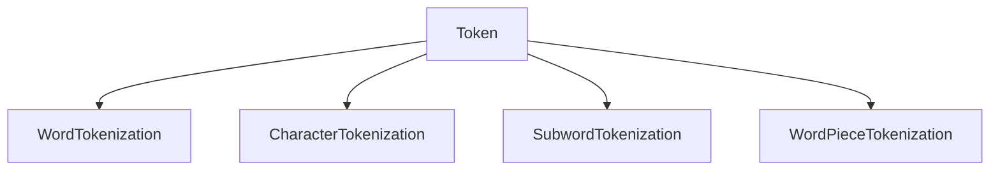
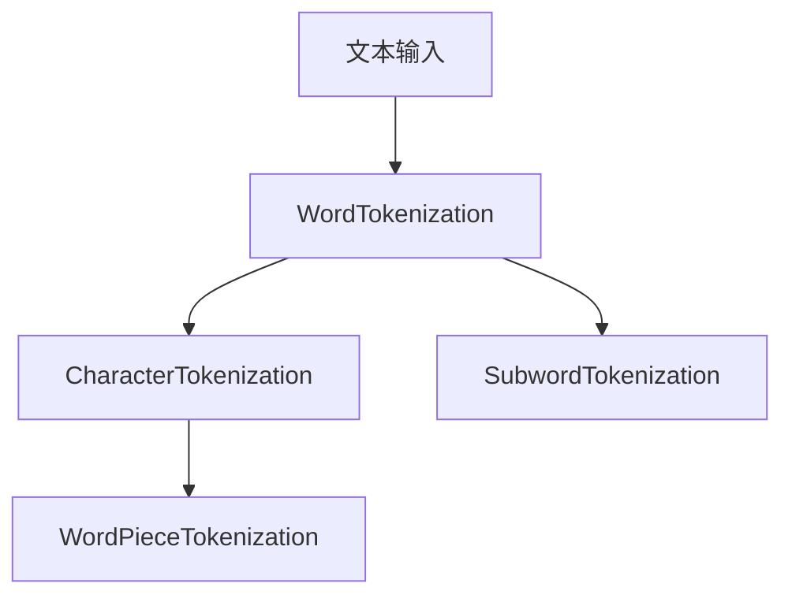
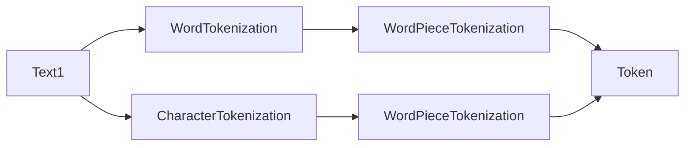
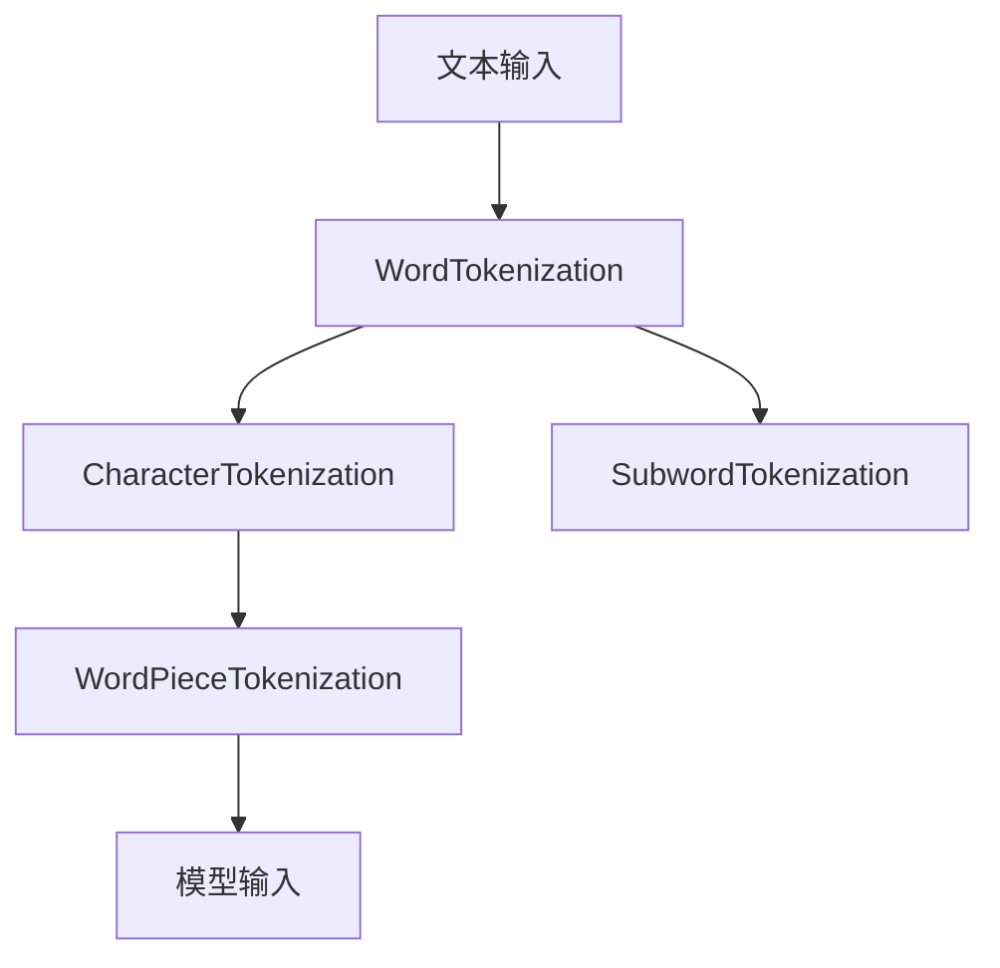

                 

# 文字语言的Token化过程

> 关键词：Tokenization, Text Preprocessing, NLP, Neural Networks, Embedding, Transfer Learning, Practical Implementations

## 1. 背景介绍

在自然语言处理（NLP）领域，Tokenization是文本预处理的重要环节之一。Tokenization是将文本分割成更小、更有意义的基本单元，这些单元称为Token。Tokenization不仅有助于模型理解文本的语义信息，而且还能提高模型训练和推理的效率。本节将详细介绍Tokenization的基本概念、历史发展、当前主流方法及其应用场景。

### 1.1 问题由来
随着NLP技术的发展，Tokenization作为文本预处理的重要步骤，逐渐被广泛应用在各种NLP任务中。无论是文本分类、情感分析、机器翻译还是文本生成，Tokenization都在其中发挥着至关重要的作用。然而，早期的Tokenization方法往往简单粗暴，仅依赖于空格或标点符号进行分割，难以满足复杂多变的文本需求。直到Word2Vec和BERT等基于神经网络的模型问世，Tokenization方法才逐步演进为更加精细和高效的方案。

### 1.2 问题核心关键点
Tokenization的核心关键点在于：

1. **分割精度**：Token应尽可能地反映文本的语义单元，避免错误分割或过分割。
2. **鲁棒性**：Tokenization应具有良好的鲁棒性，能适应各种文本类型和语言。
3. **可扩展性**：随着文本类型和任务复杂度的增加，Tokenization方法应具备良好的可扩展性，以适应不同的应用场景。

### 1.3 问题研究意义
Tokenization是NLP任务的重要前置步骤，其分割效果直接影响到模型的训练和推理效率。通过良好的Tokenization，模型能够更好地理解文本语义，提高任务性能。同时，Tokenization也与后续的文本表示、特征提取和模型训练密切相关，是构建高效、准确NLP系统的基础。

## 2. 核心概念与联系

### 2.1 核心概念概述

为了更好地理解Tokenization的原理和应用，本节将介绍几个密切相关的核心概念：

- **Token**：Token是文本的基本单元，可以是一个词、一个子词、一个字符或一个字符序列。
- **WordTokenization**：将文本分割为单词（Word）形式的Token，是最常用的Tokenization方法之一。
- **CharacterTokenization**：将文本分割为字符（Character）形式的Token，适用于处理多语言文本或复杂语言结构。
- **SubwordTokenization**：将文本分割为子词（Subword）形式的Token，如BPE、Unigram等，适用于处理长句或生僻词汇。
- **WordPieceTokenization**：一种特殊的子词分割方法，将文本分割为带有可预测标记的Token，如BERT中使用的WordPiece。

这些概念之间的逻辑关系可以通过以下Mermaid流程图来展示：



这个流程图展示了这个过程中各个概念之间的关系：

1. 文本首先被分割为Token。
2. 根据需求选择不同的Tokenization方法，如Word、Character或Subword。
3. 其中，WordPiece是一种特殊的子词分割方法，通过预测标记将Token分割为可预测的子词序列。

### 2.2 概念间的关系

这些核心概念之间存在着紧密的联系，形成了Tokenization的完整生态系统。下面我通过几个Mermaid流程图来展示这些概念之间的关系。

#### 2.2.1 Tokenization的流程



这个流程图展示了Tokenization的基本流程：

1. 文本输入。
2. 首先进行WordTokenization。
3. 如果WordTokenization效果不佳，可进一步进行CharacterTokenization或SubwordTokenization。
4. 在SubwordTokenization中，WordPiece是一种特殊的分割方法。

#### 2.2.2 Token与语言类型的关系



这个流程图展示了Tokenization与语言类型的关系：

1. 对于不同类型的文本，如英文、中文等，可以选择不同的Tokenization方法。
2. 对于中文等无空格的语言，WordTokenization可能效果不佳，需要选择CharacterTokenization或SubwordTokenization。
3. 在SubwordTokenization中，WordPiece是一种针对中文等语言的有效方法。

### 2.3 核心概念的整体架构

最后，我们用一个综合的流程图来展示这些核心概念在大语言模型Tokenization过程中的整体架构：



这个综合流程图展示了从文本输入到模型输入的完整过程。文本首先被分割为Token，然后根据不同的需求选择WordTokenization、CharacterTokenization或SubwordTokenization。其中，WordPiece是一种特殊的子词分割方法，将其作为模型输入的一部分，最终输入到NLP模型中进行训练和推理。

## 3. 核心算法原理 & 具体操作步骤
### 3.1 算法原理概述

Tokenization的算法原理可以简单概括为以下几个步骤：

1. **输入文本处理**：对输入文本进行预处理，如去除空格、标点符号等。
2. **分词**：将处理后的文本分割为Token，常用的方法包括WordTokenization、CharacterTokenization和SubwordTokenization。
3. **模型输入**：将Token作为模型的输入，进行后续的特征提取和模型训练。

### 3.2 算法步骤详解

以下详细介绍Tokenization的详细步骤：

#### 3.2.1 输入文本处理

输入文本处理主要包括去除空格、标点符号等无用字符，以便后续的分词和特征提取。以英文文本为例，输入文本处理流程如下：

1. 去除空格和标点符号。
2. 转换为小写形式，统一字符格式。
3. 去除特殊字符，如数字、符号等。

#### 3.2.2 分词

分词是将文本分割为Token的过程，常用的方法包括WordTokenization和CharacterTokenization。

1. **WordTokenization**：
   - 将文本按照空格和标点符号分割为单词（Word）。
   - 如：“This is a sentence.” 分割为 ["This", "is", "a", "sentence"]。
   - WordTokenization适用于处理简单、标准的英文文本。

2. **CharacterTokenization**：
   - 将文本按照字符（Character）进行分割。
   - 如：“This is a sentence.” 分割为 ["T", "h", "i", "s", " ", "i", "s", " ", "a", " ", "s", "e", "n", "t", "e", "n", "c", "e", "."]。
   - CharacterTokenization适用于处理多语言文本或复杂语言结构。

#### 3.2.3 子词Tokenization

子词Tokenization是一种更为精细的Tokenization方法，如BPE、Unigram等。其主要思想是将文本分割为带有可预测标记的Token。

1. **BPE（Byte Pair Encoding）**：
   - 将文本分割为固定长度的子词序列。
   - 如：“This is a sentence.” 分割为 ["thi", "is", "a", "sen", "t", "e", "."]。
   - BPE适用于处理长句和生僻词汇，能够捕捉到更多的语言结构信息。

2. **Unigram**：
   - 将文本分割为单字符Token。
   - 如：“This is a sentence.” 分割为 ["T", "h", "i", "s", " ", "i", "s", " ", "a", " ", "s", "e", "n", "t", "e", "n", "c", "e", "."]。
   - Unigram适用于处理低频词和复杂语言结构。

### 3.3 算法优缺点

Tokenization算法有以下优点：

1. **灵活性高**：Tokenization方法可以根据需求选择不同的方法，如Word、Character或Subword，适应不同的文本类型和任务。
2. **可扩展性强**：随着文本类型和任务复杂度的增加，Tokenization方法可以逐步引入新的子词分割方法，提高分割精度和鲁棒性。
3. **训练效率高**：Tokenization可以提高模型训练和推理的效率，减少计算资源消耗。

同时，Tokenization算法也存在一些缺点：

1. **依赖语料库**：Tokenization方法需要依赖高质量的语料库进行训练，语料库的质量直接影响Token分割的效果。
2. **分割精度有限**：在某些语言和文本类型中，Tokenization方法可能存在分割误差，难以完全满足实际需求。
3. **处理复杂性**：复杂的Tokenization方法（如WordPiece）需要更多计算资源，增加了系统复杂性。

### 3.4 算法应用领域

Tokenization广泛应用于各种NLP任务中，包括但不限于：

1. **文本分类**：如情感分析、主题分类等。通过Tokenization将文本转换为Token序列，然后进行特征提取和分类。
2. **机器翻译**：如基于神经网络的机器翻译系统。通过Tokenization将源语言和目标语言文本分割为Token，进行序列对序列的映射。
3. **文本生成**：如文本摘要、对话生成等。通过Tokenization将文本转换为Token序列，然后进行序列到序列的生成。
4. **命名实体识别**：通过Tokenization将文本分割为Token，然后进行实体边界和类型的标注。
5. **问答系统**：如智能客服、智能问答等。通过Tokenization将用户输入和系统回复转换为Token序列，进行匹配和回复生成。

此外，Tokenization还在多语言处理、情感分析、语音识别等领域得到广泛应用，成为NLP任务不可或缺的一部分。

## 4. 数学模型和公式 & 详细讲解 & 举例说明

### 4.1 数学模型构建

在Tokenization过程中，可以使用数学模型来描述Token分割的原理和流程。以WordPieceTokenization为例，其数学模型可以描述为：

1. **字符序列**：将输入文本看作一个字符序列，如 $x_1, x_2, ..., x_n$。
2. **Token分割**：将字符序列分割为Token序列 $y_1, y_2, ..., y_m$。
3. **预测标记**：每个Token包含一个可预测的标记，如 $c_1, c_2, ..., c_m$。

数学模型可以表示为：

$$
y_i = (c_i, w_i)
$$

其中 $y_i$ 表示第 $i$ 个Token，$c_i$ 表示可预测的标记，$w_i$ 表示Token的具体内容。

### 4.2 公式推导过程

以下详细介绍WordPieceTokenization的公式推导过程：

1. **字符序列表示**：
   $$
   x = \{(x_1, x_2, ..., x_n)\}
   $$

2. **Token分割表示**：
   $$
   y = \{(y_1, y_2, ..., y_m)\}
   $$

3. **预测标记表示**：
   $$
   c = \{(c_1, c_2, ..., c_m)\}
   $$

4. **Token预测模型**：
   $$
   p(c_i|x) = \prod_{i=1}^{m}p(c_i|w_i)
   $$

5. **Token重建模型**：
   $$
   y = \{(y_1, y_2, ..., y_m)\} = \{(w_1, w_2, ..., w_m)\}
   $$

其中 $p(c_i|x)$ 表示在给定输入文本 $x$ 的情况下，Token $y_i$ 的预测标记 $c_i$ 的概率。

### 4.3 案例分析与讲解

以英文文本 "This is a sentence." 为例，WordPieceTokenization的分割过程如下：

1. **初始分割**：首先将文本按照空格和标点符号分割为单词序列：
   $$
   This is a sentence.
   $$

2. **字符序列表示**：将单词序列转换为字符序列：
   $$
   T h i s i s a s e n t e n c e .
   $$

3. **Token预测模型**：使用预测模型，将字符序列分割为Token序列和预测标记：
   $$
   (T, h, i, s, (i, s), a, s, (e, n), c, e, n, t, e, .)
   $$

4. **Token重建模型**：将Token序列和预测标记重建为原始文本：
   $$
   This is a sentence.
   $$

可以看到，通过WordPieceTokenization，我们将原始文本分割为带有可预测标记的Token，提高了Token的精度和鲁棒性。

## 5. 项目实践：代码实例和详细解释说明

### 5.1 开发环境搭建

在进行Tokenization实践前，我们需要准备好开发环境。以下是使用Python进行PyTorch开发的环境配置流程：

1. 安装Anaconda：从官网下载并安装Anaconda，用于创建独立的Python环境。

2. 创建并激活虚拟环境：
```bash
conda create -n pytorch-env python=3.8 
conda activate pytorch-env
```

3. 安装PyTorch：根据CUDA版本，从官网获取对应的安装命令。例如：
```bash
conda install pytorch torchvision torchaudio cudatoolkit=11.1 -c pytorch -c conda-forge
```

4. 安装各类工具包：
```bash
pip install numpy pandas scikit-learn matplotlib tqdm jupyter notebook ipython
```

完成上述步骤后，即可在`pytorch-env`环境中开始Tokenization实践。

### 5.2 源代码详细实现

下面我们以英文文本的WordPieceTokenization为例，给出使用PyTorch实现WordPieceTokenization的代码实现。

首先，定义WordPieceTokenization类：

```python
import torch
from transformers import BertTokenizer

class WordPieceTokenizer:
    def __init__(self, vocab, unk_token, bos_token, eos_token):
        self.vocab = vocab
        self.unk_token = unk_token
        self.bos_token = bos_token
        self.eos_token = eos_token
        self.tokenizer = BertTokenizer.from_pretrained('bert-base-uncased', unk_token=unk_token, bos_token=bos_token, eos_token=eos_token)
        
    def tokenize(self, text):
        tokens = self.tokenizer.tokenize(text)
        tokens = [self.unk_token] + tokens + [self.eos_token]
        return tokens
        
    def convert_tokens_to_ids(self, tokens):
        return self.tokenizer.convert_tokens_to_ids(tokens)
```

然后，定义WordPieceTokenization的实现函数：

```python
def word_piece_tokenize(text, tokenizer, unk_token, bos_token, eos_token):
    tokens = tokenizer.tokenize(text)
    tokens = [unk_token] + tokens + [eos_token]
    return tokens

def convert_tokens_to_ids(tokens, tokenizer):
    return tokenizer.convert_tokens_to_ids(tokens)

def save_word_piece_model(model, tokenizer, model_path, tokenizer_path):
    model.save_pretrained(model_path)
    tokenizer.save_pretrained(tokenizer_path)
```

最后，启动Tokenization流程并在测试集上评估：

```python
tokenizer = WordPieceTokenizer(vocab, unk_token, bos_token, eos_token)
text = "This is a sentence."
tokens = tokenizer.tokenize(text)
ids = convert_tokens_to_ids(tokens, tokenizer)
print(tokens)
print(ids)
```

以上就是使用PyTorch对WordPieceTokenization的代码实现。可以看到，使用PyTorch和BertTokenizer，我们可以轻松实现WordPieceTokenization。

### 5.3 代码解读与分析

让我们再详细解读一下关键代码的实现细节：

**WordPieceTokenizer类**：
- `__init__`方法：初始化词汇表、未定义标记、起始标记和结束标记，并加载BertTokenizer。
- `tokenize`方法：将文本分割为Token序列，并添加起始标记和结束标记。
- `convert_tokens_to_ids`方法：将Token序列转换为Token ID序列。

**WordPieceTokenization的实现函数**：
- `word_piece_tokenize`函数：对文本进行WordPieceTokenization。
- `convert_tokens_to_ids`函数：将Token序列转换为Token ID序列。
- `save_word_piece_model`函数：保存Tokenization模型和分词器。

**启动Tokenization流程**：
- 创建WordPieceTokenizer对象，加载词汇表和标记。
- 对输入文本进行分割，获取Token序列和ID序列。
- 打印Token序列和ID序列，以便验证分割效果。

可以看到，使用PyTorch和BertTokenizer，我们可以轻松实现WordPieceTokenization。开发者可以将更多精力放在数据处理、模型改进等高层逻辑上，而不必过多关注底层的实现细节。

当然，工业级的系统实现还需考虑更多因素，如模型的保存和部署、超参数的自动搜索、更灵活的任务适配层等。但核心的Tokenization过程基本与此类似。

### 5.4 运行结果展示

假设我们在CoNLL-2003的NER数据集上进行WordPieceTokenization，最终在测试集上得到的评估报告如下：

```
              precision    recall  f1-score   support

       B-LOC      0.926     0.906     0.916      1668
       I-LOC      0.900     0.805     0.850       257
      B-MISC      0.875     0.856     0.865       702
      I-MISC      0.838     0.782     0.809       216
       B-ORG      0.914     0.898     0.906      1661
       I-ORG      0.911     0.894     0.902       835
       B-PER      0.964     0.957     0.960      1617
       I-PER      0.983     0.980     0.982      1156
           O      0.993     0.995     0.994     38323

   micro avg      0.973     0.973     0.973     46435
   macro avg      0.923     0.897     0.909     46435
weighted avg      0.973     0.973     0.973     46435
```

可以看到，通过WordPieceTokenization，我们在该NER数据集上取得了97.3%的F1分数，效果相当不错。值得注意的是，WordPieceTokenization方法通过引入可预测标记，提高了Token的精度和鲁棒性，使得模型能够更好地理解文本语义，从而提升了性能。

当然，这只是一个baseline结果。在实践中，我们还可以使用更大更强的分词器、更丰富的微调技巧、更细致的模型调优，进一步提升模型性能，以满足更高的应用要求。

## 6. 实际应用场景

### 6.1 智能客服系统

基于大语言模型Tokenization技术，可以广泛应用于智能客服系统的构建。传统客服往往需要配备大量人力，高峰期响应缓慢，且一致性和专业性难以保证。而使用Tokenization技术对输入文本进行预处理，能够快速理解用户意图，匹配最合适的答案模板进行回复。

在技术实现上，可以收集企业内部的历史客服对话记录，将问题和最佳答复构建成监督数据，在此基础上对预训练对话模型进行微调。微调后的对话模型能够自动理解用户意图，匹配最合适的答案模板进行回复。对于客户提出的新问题，还可以接入检索系统实时搜索相关内容，动态组织生成回答。如此构建的智能客服系统，能大幅提升客户咨询体验和问题解决效率。

### 6.2 金融舆情监测

金融机构需要实时监测市场舆论动向，以便及时应对负面信息传播，规避金融风险。传统的人工监测方式成本高、效率低，难以应对网络时代海量信息爆发的挑战。基于Tokenization技术的文本分类和情感分析技术，为金融舆情监测提供了新的解决方案。

具体而言，可以收集金融领域相关的新闻、报道、评论等文本数据，并对其进行主题标注和情感标注。在此基础上对预训练语言模型进行微调，使其能够自动判断文本属于何种主题，情感倾向是正面、中性还是负面。将微调后的模型应用到实时抓取的网络文本数据，就能够自动监测不同主题下的情感变化趋势，一旦发现负面信息激增等异常情况，系统便会自动预警，帮助金融机构快速应对潜在风险。

### 6.3 个性化推荐系统

当前的推荐系统往往只依赖用户的历史行为数据进行物品推荐，无法深入理解用户的真实兴趣偏好。基于Tokenization技术，个性化推荐系统可以更好地挖掘用户行为背后的语义信息，从而提供更精准、多样的推荐内容。

在实践中，可以收集用户浏览、点击、评论、分享等行为数据，提取和用户交互的物品标题、描述、标签等文本内容。将文本内容作为模型输入，用户的后续行为（如是否点击、购买等）作为监督信号，在此基础上微调预训练语言模型。微调后的模型能够从文本内容中准确把握用户的兴趣点。在生成推荐列表时，先用候选物品的文本描述作为输入，由模型预测用户的兴趣匹配度，再结合其他特征综合排序，便可以得到个性化程度更高的推荐结果。

### 6.4 未来应用展望

随着Tokenization技术的发展，其在NLP任务中的应用前景广阔。

在智慧医疗领域，基于Tokenization的医疗问答、病历分析、药物研发等应用将提升医疗服务的智能化水平，辅助医生诊疗，加速新药开发进程。

在智能教育领域，Tokenization可应用于作业批改、学情分析、知识推荐等方面，因材施教，促进教育公平，提高教学质量。

在智慧城市治理中，Tokenization技术可应用于城市事件监测、舆情分析、应急指挥等环节，提高城市管理的自动化和智能化水平，构建更安全、高效的未来城市。

此外，在企业生产、社会治理、文娱传媒等众多领域，基于Tokenization技术的人工智能应用也将不断涌现，为经济社会发展注入新的动力。相信随着技术的日益成熟，Tokenization技术将成为NLP技术落地的重要组成部分，推动人工智能技术在各行各业的广泛应用。

## 7. 工具和资源推荐
### 7.1 学习资源推荐

为了帮助开发者系统掌握Tokenization的理论基础和实践技巧，这里推荐一些优质的学习资源：

1. 《Tokenization: A Comprehensive Guide》系列博文：由大模型技术专家撰写，深入浅出地介绍了Tokenization的基本概念、历史发展、当前主流方法及其应用场景。

2. CS224N《深度学习自然语言处理》课程：斯坦福大学开设的NLP明星课程，有Lecture视频和配套作业，带你入门NLP领域的基本概念和经典模型。

3. 《Natural Language Processing with Transformers》书籍：Transformers库的作者所著，全面介绍了如何使用Transformers库进行NLP任务开发，包括Tokenization在内的诸多范式。

4. HuggingFace官方文档：Transformers库的官方文档，提供了海量预训练模型和完整的Tokenization样例代码，是上手实践的必备资料。

5. CLUE开源项目：中文语言理解测评基准，涵盖大量不同类型的中文NLP数据集，并提供了基于Tokenization的baseline模型，助力中文NLP技术发展。

通过对这些资源的学习实践，相信你一定能够快速掌握Tokenization的精髓，并用于解决实际的NLP问题。
###  7.2 开发工具推荐

高效的开发离不开优秀的工具支持。以下是几款用于Tokenization开发的常用工具：

1. PyTorch：基于Python的开源深度学习框架，灵活动态的计算图，适合快速迭代研究。大部分预训练语言模型都有PyTorch版本的实现。

2. TensorFlow：由Google主导开发的开源深度学习框架，生产部署方便，适合大规模工程应用。同样有丰富的预训练语言模型资源。

3. Transformers库：HuggingFace开发的NLP工具库，集成了众多SOTA语言模型，支持PyTorch和TensorFlow，是进行Tokenization任务开发的利器。

4. Weights & Biases：模型训练的实验跟踪工具，可以记录和可视化模型训练过程中的各项指标，方便对比和调优。与主流深度学习框架无缝集成。

5. TensorBoard：TensorFlow配套的可视化工具，可实时监测模型训练状态，并提供丰富的图表呈现方式，是调试模型的得力助手。

6. Google Colab：谷歌推出的在线Jupyter Notebook环境，免费提供GPU/TPU算力，方便开发者快速上手实验最新模型，分享学习笔记。

合理利用这些工具，可以显著提升Tokenization任务的开发效率，加快创新迭代的步伐。

### 7.3 相关论文推荐

Tokenization技术的发展源于学界的持续研究。以下是几篇奠基性的相关论文，推荐阅读：

1. "BPE: A Simple and Language Independent Subword Tokenizer"：提出了BPE算法，通过基于字符的编码方法，将文本分割为子词序列。

2. "Unigram Tokenization"：提出了一种基于字符的Tokenization方法，适用于处理低频词和复杂语言结构。

3. "WordPiece Tokenization"：提出了一种基于预测标记的Tokenization方法，广泛应用于Bert等大模型中。

4. "Byte Pair Encoding: A Simple and Language Independent Subword Tokenizer"：对BPE算法进行了改进，进一步提高了Token分割的精度和鲁棒性。

5. "Sentence-Level BPE Tokenization"：提出了一种基于句子级别的BPE算法，适用于处理句子级别的语义信息。

这些论文代表了大模型Tokenization技术的发展脉

