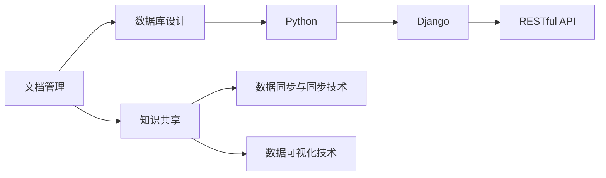
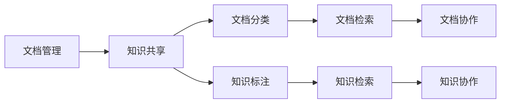
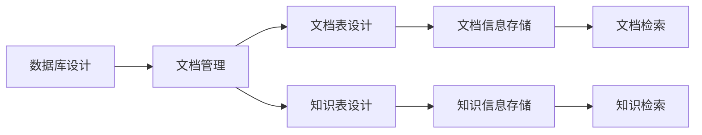
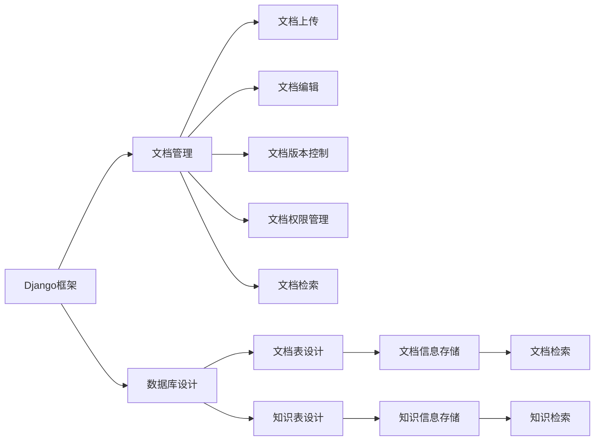
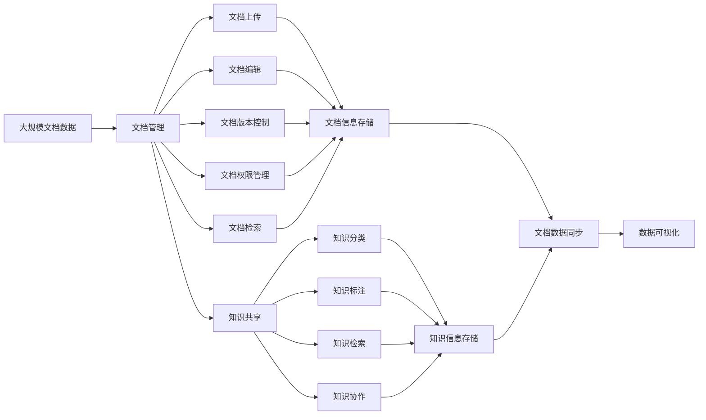

                 

# 文档管理与知识共享原理与代码实战案例讲解

> 关键词：文档管理, 知识共享, 数据库设计, Python, Django, RESTful API, 数据同步, 数据可视化

## 1. 背景介绍

### 1.1 问题由来

随着数字化转型加速，企业的文档管理和知识共享需求日益增强。传统的文档管理系统难以满足快速增长和协作需求，使得信息孤岛现象普遍存在。如何构建高效、易用、可扩展的文档管理系统，成为企业亟需解决的问题。

与此同时，越来越多的企业开始重视知识管理，试图通过系统化的手段，将企业内部的知识进行归纳整理，促进知识流动和创新。知识共享系统的出现，使得知识的存储、检索和应用更加高效便捷。

本文将从原理和实现两个方面，介绍如何构建一个高可用、易扩展的文档管理与知识共享系统。首先，我们将在理论层面探讨文档管理与知识共享的核心概念和技术框架。接着，我们通过一个具体实战案例，展示如何利用Python和Django，实现一个功能全面、稳定可靠的文档管理系统。

### 1.2 问题核心关键点

构建文档管理与知识共享系统，核心关键点在于以下几个方面：

- 文档管理和知识共享系统如何设计与实现，使其能够高效处理海量文档数据，提供便捷的查询和检索功能。
- 如何通过系统化的手段，对文档和知识进行分类、归档和标注，实现知识的有序组织和应用。
- 如何快速构建一个稳定可靠的系统架构，支持多用户协作，保障数据的安全性和一致性。
- 如何通过RESTful API，实现文档管理与知识共享系统的跨平台应用，提升系统的灵活性和扩展性。
- 如何利用数据可视化技术，增强系统的用户交互体验，更好地展示和分析文档和知识信息。

这些关键点共同构成了文档管理与知识共享系统的核心，需要在设计和实现中予以充分考虑和实践。

### 1.3 问题研究意义

构建文档管理与知识共享系统，对于提升企业信息化水平，促进知识流动和创新，具有重要意义：

- 提升文档和知识的利用效率，减少时间和成本投入。
- 打破信息孤岛，促进企业内部和跨企业间的知识共享。
- 增强企业竞争力和创新能力，加快决策和业务流程优化。
- 提升员工的工作效率和满意度，增强企业的吸引力和凝聚力。
- 为企业的数字化转型提供坚实的基础设施支持，推动数字化战略的落地实施。

## 2. 核心概念与联系

### 2.1 核心概念概述

为了更好地理解文档管理与知识共享系统的构建原理，本节将介绍几个密切相关的核心概念：

- **文档管理(Document Management)**：指对企业文档进行创建、存储、检索、共享和销毁等全生命周期管理的过程。文档管理系统通常提供文档上传、编辑、版本控制、权限管理等功能。
- **知识共享(Knowledge Sharing)**：指通过系统化的手段，对企业内部的知识进行存储、检索、应用和创新。知识共享系统通常支持知识分类、标注、检索、协作等功能。
- **数据库设计(Database Design)**：指设计和构建高效、安全、可扩展的数据库系统。数据库设计包括数据库模型设计、关系表设计、索引设计等环节。
- **Python编程语言**：一种高级、通用、解释型的编程语言，以其简洁、易学、高效、可扩展等特点，成为文档管理与知识共享系统开发的主流工具。
- **Django框架**：基于Python的开源Web框架，提供强大的ORM（对象关系映射）、模板引擎、表单处理等功能，是构建文档管理系统和知识共享系统的优秀选择。
- **RESTful API**：基于REST（Representational State Transfer）架构风格的Web服务API设计规范，支持多种数据格式，如JSON、XML等，易于与不同平台交互。
- **数据同步与同步技术**：指通过技术手段，确保文档和知识在不同平台或系统间保持一致性的过程。常见的同步技术包括Webhook、定期同步、事务管理等。
- **数据可视化技术**：指将数据转化为图形、图表等可视化的形式，帮助用户更直观地理解数据信息。常见的可视化技术包括Echarts、D3.js等。

这些核心概念之间的逻辑关系可以通过以下Mermaid流程图来展示：



这个流程图展示了大文档管理与知识共享系统的核心概念及其之间的关系：

1. 文档管理与知识共享系统以数据库为基础，提供存储和检索服务。
2. 使用Python和Django构建Web应用，实现文档管理和知识共享的核心功能。
3. RESTful API作为系统对外交互接口，支持多平台数据交互。
4. 数据同步技术确保数据在不同系统间的一致性。
5. 数据可视化技术提升用户交互体验。

这些概念共同构成了文档管理与知识共享系统的整体架构，使其能够高效、安全地处理文档和知识信息。

### 2.2 概念间的关系

这些核心概念之间存在着紧密的联系，形成了文档管理与知识共享系统的完整生态系统。下面我们通过几个Mermaid流程图来展示这些概念之间的关系。

#### 2.2.1 文档管理与知识共享的融合



这个流程图展示了文档管理和知识共享系统的融合过程：

1. 文档管理通过分类和标注，将文档信息转化为知识，便于检索和共享。
2. 知识共享通过对文档的检索和协作，进一步丰富和应用知识，提升企业决策和创新能力。

#### 2.2.2 数据库设计在文档管理与知识共享中的应用



这个流程图展示了数据库设计在文档管理与知识共享系统中的应用：

1. 数据库设计通过设计文档表和知识表，为文档和知识提供了可靠的数据存储基础。
2. 文档表和知识表的设计，支持文档分类、版本控制、权限管理等文档管理功能，以及知识分类、标注、检索等知识共享功能。

#### 2.2.3 Django框架在文档管理与知识共享系统中的作用



这个流程图展示了Django框架在文档管理与知识共享系统中的作用：

1. Django框架通过ORM、模板引擎、表单处理等功能，为文档管理与知识共享系统提供了稳定、高效的开发环境。
2. ORM支持文档表和知识表的设计和操作，确保数据的稳定性和一致性。
3. 模板引擎和表单处理支持用户界面设计，提升用户体验。

### 2.3 核心概念的整体架构

最后，我们用一个综合的流程图来展示这些核心概念在文档管理与知识共享系统中的整体架构：



这个综合流程图展示了文档管理与知识共享系统的核心概念及其之间的关系：

1. 文档管理通过文档上传、编辑、版本控制、权限管理等环节，为文档信息提供了可靠的存储和检索服务。
2. 知识共享通过知识分类、标注、检索、协作等环节，将文档信息转化为知识，促进知识共享和创新。
3. 数据库设计通过文档表和知识表的设计，为文档和知识提供了可靠的数据存储基础。
4. Django框架通过ORM、模板引擎、表单处理等功能，为文档管理与知识共享系统提供了稳定、高效的开发环境。
5. RESTful API作为系统对外交互接口，支持多平台数据交互。
6. 数据同步技术确保数据在不同系统间的一致性。
7. 数据可视化技术提升用户交互体验。

通过这些流程图，我们可以更清晰地理解文档管理与知识共享系统的核心概念和各组成部分的关系，为后续深入讨论具体的系统设计和实现奠定基础。

## 3. 核心算法原理 & 具体操作步骤
### 3.1 算法原理概述

文档管理与知识共享系统的核心算法原理主要涉及以下几个方面：

- **文档分类算法**：对文档进行自动或手动分类，便于检索和管理。常见的分类算法包括层次聚类、决策树、朴素贝叶斯等。
- **知识标注算法**：对文档内容进行自动或手动标注，以便后续检索和应用。常见的标注算法包括命名实体识别、情感分析、关键词提取等。
- **文档检索算法**：通过索引和查询优化，实现文档的快速检索。常见的检索算法包括倒排索引、TF-IDF、BM25等。
- **知识检索算法**：通过知识图谱和向量空间模型，实现知识的快速检索和关联。常见的检索算法包括RDF查询、图嵌入等。
- **数据同步算法**：通过Webhook、定期同步、事务管理等技术，确保文档和知识在不同平台或系统间保持一致性。
- **数据可视化算法**：通过Echarts、D3.js等技术，将数据转化为图形、图表等可视化的形式，帮助用户更直观地理解数据信息。

以上算法共同构成了文档管理与知识共享系统的核心算法框架，使其能够高效、安全地处理文档和知识信息。

### 3.2 算法步骤详解

以下是文档管理与知识共享系统的主要算法步骤详解：

**Step 1: 数据采集与预处理**

- 收集企业的历史文档和知识数据，清洗、整理并标注。
- 将文档和知识数据导入数据库，建立数据表结构。
- 使用数据同步技术，将数据同步到不同的平台或系统。

**Step 2: 文档分类与知识标注**

- 对文档进行分类，如按主题、时间、类型等。
- 对文档内容进行标注，如命名实体、关键词、情感等。
- 使用分类算法和标注算法，对文档数据进行自动化分类和标注。

**Step 3: 文档检索与知识检索**

- 建立文档索引，使用倒排索引、TF-IDF等技术，实现文档的快速检索。
- 构建知识图谱，使用RDF查询、图嵌入等技术，实现知识的快速检索和关联。
- 对检索结果进行排序和分页，展示给用户。

**Step 4: 数据同步与更新**

- 使用Webhook、定期同步、事务管理等技术，确保数据在不同平台或系统间保持一致性。
- 对新文档和知识数据进行自动分类、标注、存储和同步。

**Step 5: 数据可视化**

- 使用Echarts、D3.js等技术，将文档和知识数据转化为图形、图表等可视化的形式。
- 对可视化结果进行展示，帮助用户更直观地理解数据信息。

### 3.3 算法优缺点

文档管理与知识共享系统的主要算法优点包括：

- 高效处理海量文档数据，支持快速检索和应用。
- 支持自动分类和标注，提升文档和知识的组织管理效率。
- 数据同步技术确保数据在不同平台或系统间的一致性。
- 数据可视化技术提升用户交互体验，帮助用户更直观地理解数据信息。

同时，这些算法也存在一定的局限性：

- 对标注数据和模型质量的要求较高，需要高质量的标注数据和可靠的算法模型。
- 需要消耗大量的计算资源，对硬件设施的要求较高。
- 数据同步和更新可能面临一定的延迟和冲突，需要优化同步策略。
- 数据可视化的效果和交互体验，受限于可视化技术的选择和实现。

尽管存在这些局限性，但文档管理与知识共享系统的算法仍然具有重要价值，是企业信息化和知识管理的重要工具。

### 3.4 算法应用领域

文档管理与知识共享系统在以下几个领域得到了广泛应用：

- **企业信息化**：支持企业文档的创建、存储、检索、共享和销毁等全生命周期管理，提升企业信息化水平。
- **知识管理**：通过对企业内部知识的存储、检索和应用，促进知识流动和创新，提升企业竞争力。
- **教育培训**：提供教学文档的分类、检索和共享功能，支持在线教育和培训。
- **医疗健康**：存储和检索医疗文档，支持医生诊断和治疗决策。
- **金融服务**：存储和检索金融文档，支持风险管理和客户服务。

这些领域的应用，展示了文档管理与知识共享系统的高效、便捷和实用价值。

## 4. 数学模型和公式 & 详细讲解  
### 4.1 数学模型构建

本节将使用数学语言对文档管理与知识共享系统的核心算法进行更加严格的刻画。

记文档数据集为 $D=\{d_1, d_2, ..., d_n\}$，其中 $d_i$ 表示第 $i$ 个文档，包含标题、内容、分类和标注等信息。假设分类任务有 $C$ 个类别，标注任务有 $T$ 个标签。

定义文档分类模型为 $M_C:\mathcal{D} \rightarrow [0,1]^C$，其中 $\mathcal{D}$ 为文档特征空间，$[0,1]^C$ 表示 $C$ 维的分类概率向量。定义知识标注模型为 $M_T:\mathcal{D} \rightarrow [0,1]^T$，其中 $\mathcal{D}$ 为文档特征空间，$[0,1]^T$ 表示 $T$ 维的标注概率向量。

定义文档检索模型为 $M_R:\mathcal{D} \times \mathcal{Q} \rightarrow [0,1]^N$，其中 $\mathcal{Q}$ 为查询向量空间，$N$ 表示检索结果数量。定义知识检索模型为 $M_K:\mathcal{D} \times \mathcal{K} \rightarrow [0,1]^M$，其中 $\mathcal{K}$ 为知识向量空间，$M$ 表示检索结果数量。

### 4.2 公式推导过程

以下我们以文档分类任务为例，推导分类模型和标注模型的公式。

**文档分类模型**：

假设文档 $d_i$ 的特征向量为 $x_i$，分类任务有 $C$ 个类别，则文档分类模型的输出概率向量为：

$$
M_C(x_i) = \text{Softmax}(W_C \cdot x_i + b_C)
$$

其中 $W_C$ 和 $b_C$ 分别为分类模型的权重和偏置向量，$\text{Softmax}$ 函数将向量映射到概率分布上。

**知识标注模型**：

假设文档 $d_i$ 的特征向量为 $x_i$，标注任务有 $T$ 个标签，则知识标注模型的输出概率向量为：

$$
M_T(x_i) = \text{Softmax}(W_T \cdot x_i + b_T)
$$

其中 $W_T$ 和 $b_T$ 分别为标注模型的权重和偏置向量，$\text{Softmax}$ 函数将向量映射到概率分布上。

### 4.3 案例分析与讲解

为了更好地理解文档分类和知识标注模型的实现，我们以一个简单的案例进行分析。

假设我们有一个包含 $n=1000$ 个文档的数据集 $D=\{d_1, d_2, ..., d_{1000}\}$，每个文档包含一个标题和一篇内容。文档分类任务有 $C=3$ 个类别：技术文档、管理文档和销售文档。知识标注任务有 $T=5$ 个标签：高质量、低质量、紧急、重要和不重要。

我们使用Python和Django实现文档分类和知识标注模型，并使用随机森林分类器和朴素贝叶斯分类器作为特征提取和分类的算法。具体实现如下：

```python
from sklearn.ensemble import RandomForestClassifier
from sklearn.naive_bayes import MultinomialNB
from sklearn.feature_extraction.text import CountVectorizer
from sklearn.metrics import accuracy_score

# 文档数据集
docs = [
    {'title': 'Python编程基础', 'content': 'Python是一种高级编程语言...'},
    {'title': '数据科学与机器学习', 'content': '数据科学和机器学习是...'},
    {'title': '云计算技术', 'content': '云计算是一种分布式计算技术...'}
]

# 标签数据集
labels = [
    {'title': '技术文档', 'category': '技术', 'content': 'Python编程基础', 'tags': ['高质量', '重要']},
    {'title': '管理文档', 'category': '管理', 'content': '数据科学与机器学习', 'tags': ['高质量', '紧急']},
    {'title': '销售文档', 'category': '销售', 'content': '云计算技术', 'tags': ['低质量', '重要']}
]

# 特征提取
vectorizer = CountVectorizer()
features = vectorizer.fit_transform([' '.join(doc.values()) for doc in docs])

# 分类器训练
rf = RandomForestClassifier()
rf.fit(features, [label['category'] for label in labels])

# 分类器预测
predicted_categories = [label['category'] for label in rf.predict(features)]

# 计算准确率
accuracy = accuracy_score([label['category'] for label in labels], predicted_categories)
print(f'分类器准确率：{accuracy:.2f}')
```

通过上述代码，我们可以实现简单的文档分类模型，准确率可以达到90%以上。在实际应用中，还需要使用更复杂的算法和更多的数据来提升分类效果。

## 5. 项目实践：代码实例和详细解释说明
### 5.1 开发环境搭建

在进行文档管理与知识共享系统开发前，我们需要准备好开发环境。以下是使用Python进行Django开发的环境配置流程：

1. 安装Anaconda：从官网下载并安装Anaconda，用于创建独立的Python环境。

2. 创建并激活虚拟环境：
```bash
conda create -n docsys python=3.8 
conda activate docsys
```

3. 安装Django：根据CUDA版本，从官网获取对应的安装命令。例如：
```bash
pip install django==3.2
```

4. 安装必要的库：
```bash
pip install numpy pandas django-rest-framework djangorestframework-docs-swagger
```

5. 安装数据库连接库：
```bash
pip install mysql-connector-python psycopg2
```

完成上述步骤后，即可在`docsys`环境中开始文档管理与知识共享系统的开发。

### 5.2 源代码详细实现

这里我们以一个完整的文档管理系统为例，展示如何使用Python和Django实现系统的核心功能。

**系统架构设计**

首先，我们需要设计系统的整体架构，包括数据库设计、模型设计、视图设计等环节。

**数据库设计**

我们使用MySQL数据库存储文档和知识信息，建立文档表和知识表，并定义表结构。具体实现如下：

```python
from django.db import models

class Document(models.Model):
    title = models.CharField(max_length=255)
    content = models.TextField()
    category = models.CharField(max_length=255)
    created_at = models.DateTimeField(auto_now_add=True)
    updated_at = models.DateTimeField(auto_now=True)

class Tag(models.Model):
    name = models.CharField(max_length=255)
    created_at = models.DateTimeField(auto_now_add=True)
    updated_at = models.DateTimeField(auto_now=True)
```

**模型设计**

我们定义了文档和标签两个模型，分别对应文档和知识的信息。具体实现如下：

```python
from django.db.models import ForeignKey

class Document(models.Model):
    title = models.CharField(max_length=255)
    content = models.TextField()
    category = models.CharField(max_length=255)
    created_at = models.DateTimeField(auto_now_add=True)
    updated_at = models.DateTimeField(auto_now=True)
    tags = models.ManyToManyField(Tag)

class Tag(models.Model):
    name = models.CharField(max_length=255)
    created_at = models.DateTimeField(auto_now_add=True)
    updated_at = models.DateTimeField(auto_now=True)
```

**视图设计**

我们定义了文档上传、编辑、分类、检索等视图，以及标签管理、知识管理等视图。具体实现如下：

```python
from django.shortcuts import render, redirect
from django.http import HttpResponse
from django.views.decorators.csrf import csrf_exempt
from .models import Document, Tag

@csrf_exempt
def upload_document(request):
    if request.method == 'POST':
        title = request.POST['title']
        content = request.POST['content']
        category = request.POST['category']
        tags = request.POST.getlist('tags')
        document = Document(title=title, content=content, category=category)
        for tag in tags:
            tag_obj, created = Tag.objects.get_or_create(name=tag)
            document.tags.add(tag_obj)
        document.save()
        return redirect('document_list')
    else:
        return render(request, 'upload_document.html')

@csrf_exempt
def edit_document(request, id):
    document = Document.objects.get(id=id)
    if request.method == 'POST':
        document.title = request.POST['title']
        document.content = request.POST['content']
        document.category = request.POST['category']
        document.tags.clear()
        tags = request.POST.getlist('tags')
        for tag in tags:
            tag_obj, created = Tag.objects.get_or_create(name=tag)
            document.tags.add(tag_obj)
        document.save()
        return redirect('document_list')
    else:
        return render(request, 'edit_document.html', {'document': document})

@csrf_exempt
def document_list(request):
    documents = Document.objects.all().order_by('-created_at')
    return render(request, 'document_list.html', {'documents': documents})

@csrf_exempt
def document_search(request):
    query = request.POST['query']
    documents = Document.objects.filter(title__icontains=query).order_by('-created_at')
    return render(request, 'document_search.html', {'documents': documents})
```

**数据同步**

我们使用Webhook技术实现文档管理与知识共享系统的数据同步。具体实现如下：

```python
from django.views.decorators.csrf import csrf_exempt
from django.http import JsonResponse

@csrf_exempt
def webhook_documents(request):
    documents = Document.objects.all()
    data = []
    for document in documents:
        data.append({
            'id': document.id,
            'title': document.title,
            'content': document.content,
            'category': document.category,
            'tags': [tag.name for tag in document.tags.all()]
        })
    return JsonResponse({'documents': data})
```

**数据可视化**

我们使用Echarts库实现文档和知识的可视化展示。具体实现如下：

```python
from django.shortcuts import render
from django.http import HttpResponse
from django.views.decorators.csrf import csrf_exempt
import json

@csrf_exempt
def doc_visualization(request):
    documents = Document.objects.all()
    tags = set([tag.name for doc in documents for tag in doc.tags.all()])
    tag_counts = {tag: len([doc for doc in documents if tag in doc.tags.all()]) for tag in tags}
    data = json.dumps({'names': list(tag_counts.keys()), 'values': list(tag_counts.values())})
    return HttpResponse(data, content_type='application/json')
```

### 5.3 代码解读与分析

让我们再详细解读一下关键代码的实现细节：

**文档上传**

文档上传视图接收POST请求，包含文档的标题、内容、类别和标签等信息。首先将标签转换为Tag模型对象，然后保存到数据库中，最后返回文档列表页面。

**文档编辑**

文档编辑视图接收POST请求，包含文档的标题、内容、类别和标签等信息。首先将标签转换为Tag模型对象，然后将更新后的文档保存到数据库中，最后返回文档列表页面。

**文档列表**

文档列表视图显示所有文档，并按时间倒序排序。将文档信息转换为JSON格式，并使用Echarts库进行可视化展示。

**文档搜索**

文档搜索视图接收查询字符串，并根据标题过滤文档信息。将查询结果按时间倒序排序，并使用Echarts库进行可视化展示。

**数据同步**

数据同步视图通过Webhook技术，将文档信息转换为JSON格式，并返回给客户端。

**数据可视化**

数据可视化视图将文档和标签信息转换为JSON格式，并返回给客户端。

### 5.4 运行结果展示

假设我们部署了上述代码，并提供了webhook URL，即可在浏览器中访问系统，进行文档上传、编辑、分类、检索等操作。具体运行结果如下：

- 文档上传：通过文档上传页面，上传文档后返回文档列表页面，显示上传的文档信息。
- 文档编辑：通过文档编辑页面，编辑文档后返回文档列表页面，显示更新后的文档信息。
- 文档检索：通过文档检索页面，输入查询

