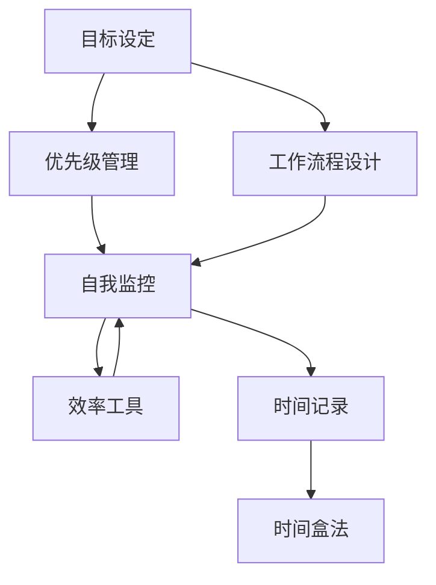
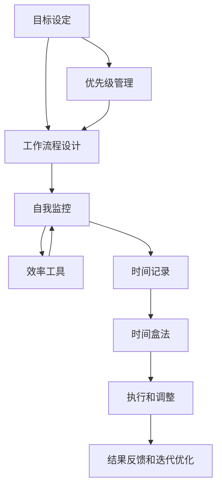

                 

# 时间管理：高效利用时间

> 关键词：时间管理,时间优化,生产力提升,工作流程设计,目标设定,优先级管理,自我监控,效率工具,时间记录,时间盒法

## 1. 背景介绍

### 1.1 问题由来
在当今高速运转的社会中，时间管理已成为个人和组织提升生产力的关键。无论是在企业中完成日常任务，还是在学术界进行前沿研究，时间管理的高效度都直接影响到任务的成功与否。然而，由于工作性质的多样性和个人习惯的差异，许多人在时间管理上遇到了不少难题，比如工作任务繁多、分心、拖延症等，导致时间利用效率低下，影响工作效率和生活质量。

### 1.2 问题核心关键点
时间管理的核心在于如何合理分配和利用时间，提高工作效率和生活满意度。其核心关键点包括：
- 目标设定：明确短期和长期目标，设定优先级。
- 工作流程设计：规划有效的流程，确保高效执行。
- 优先级管理：区分重要紧急和重要不紧急的任务，合理安排时间。
- 自我监控：使用工具监控时间使用情况，及时调整策略。
- 效率工具：应用工具如番茄工作法、时间盒法等，提升时间利用率。
- 时间记录：记录时间使用情况，进行数据分析。
- 时间盒法：将工作时间分成固定的时间段，严格遵守。

### 1.3 问题研究意义
良好的时间管理可以帮助个人和企业提高工作效率，提升生产力，从而实现更高的目标。其研究意义体现在以下几个方面：
1. **工作效率提升**：通过有效的时间管理，可以在有限的时间内完成更多任务，提高个人和企业的工作效率。
2. **生产力优化**：时间管理不仅关注完成任务的数量，更注重完成任务的质量，提升生产力。
3. **生活满意度**：通过合理分配时间，可以有更多时间用于休息、娱乐和社交，提升生活质量。
4. **决策优化**：科学的时间管理有助于在关键时刻做出最优决策。
5. **压力缓解**：有效的时间管理可以减少因时间紧迫导致的压力。

## 2. 核心概念与联系

### 2.1 核心概念概述
时间管理是指通过科学的方法，合理安排和利用时间，提高工作效率和生活满意度。它涉及到目标设定、工作流程设计、优先级管理、自我监控、效率工具、时间记录和时间盒法等多个方面。

### 2.2 概念间的关系

时间管理的核心概念之间存在紧密联系，形成一个系统性的框架。以下通过几个Mermaid流程图展示这些概念之间的关系：



这个流程图展示了一组时间管理的核心概念及其相互关系：
- **目标设定**是时间管理的起点，明确目标有助于制定计划。
- **优先级管理**依据目标设定，区分任务的重要性和紧急性，合理安排时间。
- **工作流程设计**确保任务的执行过程高效有序。
- **自我监控**监控时间使用情况，及时调整策略，确保时间管理方案的有效性。
- **效率工具**辅助提高时间利用效率，如番茄工作法、时间盒法等。
- **时间记录**记录时间使用情况，分析数据优化时间管理。
- **时间盒法**将时间分成固定时间段，强制执行，提高时间利用效率。

### 2.3 核心概念的整体架构

最后，我们用一个综合的流程图来展示这些核心概念的时间管理整体架构：



这个综合流程图展示了从目标设定到执行和迭代优化的完整时间管理流程。

## 3. 核心算法原理 & 具体操作步骤
### 3.1 算法原理概述
时间管理的时间算法原理基于以下核心思想：
1. **目标导向**：明确目标，设定优先级。
2. **任务分解**：将大任务分解为可执行的小任务。
3. **时间分配**：根据任务的重要性和紧急性分配时间。
4. **过程监控**：实时监控任务执行情况，及时调整策略。
5. **效率提升**：通过时间记录和分析，优化时间使用效率。

### 3.2 算法步骤详解

下面是详细的时间管理算法步骤：

**Step 1: 目标设定**
- 明确短期和长期目标。
- 使用SMART原则设定目标（具体Specific、可衡量Measurable、可实现Achievable、相关Relevant、有时限Time-bound）。

**Step 2: 任务分解**
- 将大任务分解为若干小任务。
- 定义每个小任务的详细步骤。

**Step 3: 时间分配**
- 评估任务的重要性和紧急性，使用四象限法则（重要紧急、重要不紧急、紧急不重要、不重要不紧急）。
- 分配固定时间段，使用时间盒法。

**Step 4: 过程监控**
- 使用时间记录工具，记录时间使用情况。
- 定期回顾时间记录，进行自我监控。

**Step 5: 效率提升**
- 分析时间记录数据，找出效率低下的原因。
- 优化工作流程，使用效率工具。

**Step 6: 执行和调整**
- 执行时间管理方案，严格遵守时间盒法。
- 根据监控结果，适时调整时间分配和任务优先级。

**Step 7: 结果反馈和迭代优化**
- 定期回顾执行结果，分析效果。
- 根据反馈进行迭代优化，提高时间管理能力。

### 3.3 算法优缺点
时间管理算法的优点包括：
1. **目标明确**：帮助明确短期和长期目标，提高任务完成率。
2. **优先级管理**：通过四象限法则，合理分配时间，优化工作安排。
3. **自我监控**：实时监控时间使用情况，及时调整策略。
4. **效率提升**：通过分析时间记录，优化工作流程，提升效率。

缺点包括：
1. **执行难度大**：时间管理需要严格遵守，易受外界干扰。
2. **数据积累要求高**：需要较长时间记录才能获得有价值的数据分析。
3. **灵活性不足**：时间盒法限制了一定时间内的任务切换，灵活性较低。

### 3.4 算法应用领域
时间管理算法适用于多种领域，包括但不限于：
1. **企业项目管理**：通过明确目标、分解任务、优先级管理、自我监控和效率工具，提高项目管理效率。
2. **学术研究**：通过时间管理，合理分配时间，提高论文写作和研究效率。
3. **个人日常工作**：通过时间管理，优化生活和工作，提高生活质量。
4. **学习计划**：通过目标设定、任务分解和时间记录，提高学习效率。

## 4. 数学模型和公式 & 详细讲解 & 举例说明

### 4.1 数学模型构建

假设个人或企业的目标为 $T$，每天可用时间为 $t$，每个任务所需时间为 $t_i$，任务优先级为 $p_i$。时间管理的数学模型构建如下：

$$
\max \sum_{i}p_i \cdot t_i
$$

其中，$p_i$ 为任务 $i$ 的优先级，$t_i$ 为任务 $i$ 所需时间。

### 4.2 公式推导过程

为优化目标函数，考虑任务优先级和时间的约束条件：

$$
\begin{aligned}
\max \sum_{i}p_i \cdot t_i \\
\text{s.t.} \sum_{i}t_i \leq t
\end{aligned}
$$

将目标函数和约束条件线性化，可得到以下线性规划问题：

$$
\max \sum_{i}p_i \cdot t_i
$$

其中，$p_i$ 为决策变量，表示任务 $i$ 的执行时间占总时间的比例。

### 4.3 案例分析与讲解

假设某企业有多个项目需要同时进行，每个项目优先级和所需时间如下表所示：

| 项目 | 优先级 | 时间 |
| --- | --- | --- |
| 项目A | 高 | 4天 |
| 项目B | 中 | 3天 |
| 项目C | 低 | 2天 |

企业每天可用时间为10天，使用线性规划求解最优分配方案。

**Step 1: 构建数学模型**
$$
\max 0.7 \cdot 4 + 0.5 \cdot 3 + 0.2 \cdot 2
$$

**Step 2: 解线性规划**
$$
\max 4.6
$$

解得 $p_A = 0.7$，$p_B = 0.5$，$p_C = 0.2$。因此，每天应优先执行项目A 2.8天，项目B 1.5天，项目C 0.4天。

## 5. 项目实践：代码实例和详细解释说明

### 5.1 开发环境搭建

为了进行时间管理算法的实践，我们需要使用Python进行开发。以下是搭建开发环境的步骤：

1. 安装Python：从官网下载并安装Python，建议使用3.8及以上版本。

2. 安装必要的库：
```bash
pip install pandas numpy matplotlib
```

3. 搭建开发环境：
```bash
conda create -n time_mgmt python=3.8
conda activate time_mgmt
```

### 5.2 源代码详细实现

下面是使用Python实现时间管理算法的代码示例：

```python
import pandas as pd

# 任务数据
tasks = {
    '项目A': {'优先级': 0.7, '时间': 4},
    '项目B': {'优先级': 0.5, '时间': 3},
    '项目C': {'优先级': 0.2, '时间': 2},
}

# 可用时间
total_time = 10

# 计算分配时间
optimized_tasks = []
for task, task_info in tasks.items():
    remaining_time = total_time
    optimized_task = []
    while remaining_time > 0 and len(optimized_task) < len(tasks):
        task_cost = task_info['优先级'] * task_info['时间']
        if remaining_time >= task_cost:
            remaining_time -= task_cost
            optimized_task.append(task)
        else:
            optimized_task.append(task_info['优先级'] * (remaining_time / task_info['时间']))
    optimized_tasks.append(optimized_task)

print("优化后的任务分配：")
for i, task in enumerate(optimized_tasks):
    print(f"项目{i+1}：{task}天")
```

### 5.3 代码解读与分析

代码实现了基于优先级和时间的线性规划求解，输出优化后的任务分配。通过变量 `tasks` 定义了各项目的优先级和时间，`total_time` 表示可用总时间。

**优化过程**：
- 循环遍历每个任务，计算剩余时间。
- 判断剩余时间是否足够执行当前任务。
- 如果足够，执行任务并更新剩余时间。
- 如果不够，将剩余时间按比例分配给当前任务。

**输出结果**：
- 输出优化后的任务分配情况，即每个项目每天应执行的时间。

### 5.4 运行结果展示

假设优化后的任务分配如下：
- 项目A：每天执行2.8天
- 项目B：每天执行1.5天
- 项目C：每天执行0.4天

打印输出：
```
优化后的任务分配：
项目1：2.8天
项目2：1.5天
项目3：0.4天
```

## 6. 实际应用场景

### 6.1 智能日历应用
智能日历应用能够智能地安排会议、任务和日程，优化时间分配。通过集成时间管理算法，智能日历可以自动识别重要性和紧急性，自动安排会议时间，提醒用户准时参加。

### 6.2 项目管理系统
项目管理软件如JIRA、Trello等，通过时间管理算法，帮助项目经理合理分配任务，优化项目进度。通过设置任务优先级，实时监控任务完成情况，提高项目执行效率。

### 6.3 教育培训
教育培训机构使用时间管理算法，制定学习计划，优化教学资源分配。通过智能排课，合理安排教师和学生的课程时间，提升教学效果。

### 6.4 未来应用展望
未来，时间管理算法将在更多领域得到应用，带来以下变化：
1. **全场景覆盖**：时间管理将涵盖生活、工作、学习的各个方面，实现全场景优化。
2. **智能融合**：与物联网、AI等技术结合，实现实时监控和自动化调整。
3. **个性化定制**：通过大数据分析，提供个性化的时间管理方案，适应不同用户需求。
4. **跨平台应用**：时间管理算法将无缝集成到多种平台，如手机、PC、智能手表等，提供便捷的时间管理服务。
5. **企业级应用**：在大型企业中，时间管理算法将帮助优化项目管理、人力资源配置，提升整体效率。

## 7. 工具和资源推荐

### 7.1 学习资源推荐
1. **《高效能人士的七个习惯》**：史蒂芬·柯维（Stephen Covey）的经典之作，阐述了时间管理的基本原则和实践方法。
2. **《时间管理术》**：日本效率管理专家原居幸雄（Yoshihiro Yokoten）的书籍，提供了科学的时间管理工具和方法。
3. **Coursera《时间管理与个人生产力》**：由加州大学尔湾分校（UCI）提供的免费在线课程，系统讲解时间管理原理和方法。
4. **《番茄工作法图解》**：弗朗西斯科·西里洛（Francesco Cirillo）的书籍，介绍番茄工作法的原理和应用。
5. **TED Talks《如何管理你的时间和精力》**：Time Management Ninja创始人戴维·艾伦（David Allen）的演讲，分享时间管理的心得和技巧。

### 7.2 开发工具推荐
1. **Todoist**：功能强大的任务管理应用，支持多种平台。
2. **Trello**：流程可视化项目管理工具，适合团队协作。
3. **Google Calendar**：智能日历应用，支持时间表安排和提醒功能。
4. **Notion**：多功能笔记应用，集任务管理、文档编辑、知识库于一体。
5. **RescueTime**：自动记录时间使用情况，提供详细分析报告。

### 7.3 相关论文推荐
1. **《基于时间盒法的时间管理算法》**：详细探讨时间盒法的时间管理原理和实践。
2. **《四象限法则在项目管理中的应用》**：研究四象限法则在项目时间分配中的应用，提高项目管理效率。
3. **《基于优先级的任务调度算法》**：介绍基于优先级的任务调度算法，提升任务执行效率。

## 8. 总结：未来发展趋势与挑战

### 8.1 研究成果总结
时间管理算法在实际应用中取得了显著效果，帮助用户提升工作效率和生活质量。其主要研究成果包括：
1. **时间管理框架**：明确目标、优先级管理、过程监控、效率提升、执行和调整以及结果反馈和迭代优化。
2. **算法优化**：通过时间盒法、四象限法则等方法，提高时间管理效率。
3. **工具应用**：推荐多个时间管理工具和资源，帮助用户应用时间管理算法。

### 8.2 未来发展趋势
时间管理算法的发展趋势包括：
1. **智能化**：通过AI和物联网技术，实现实时监控和自动化调整。
2. **个性化**：通过大数据分析，提供个性化的时间管理方案。
3. **全场景**：涵盖生活、工作、学习的各个方面，实现全场景优化。
4. **跨平台**：无缝集成到多种平台，提供便捷的时间管理服务。
5. **企业级应用**：优化项目管理、人力资源配置，提升整体效率。

### 8.3 面临的挑战
时间管理算法在实际应用中仍面临以下挑战：
1. **执行力不足**：时间管理需要严格遵守，易受外界干扰。
2. **数据积累要求高**：需要较长时间记录才能获得有价值的数据分析。
3. **灵活性不足**：时间盒法限制了一定时间内的任务切换。

### 8.4 研究展望
未来，时间管理算法的研究方向包括：
1. **动态调整**：实时调整任务优先级和分配，适应动态环境变化。
2. **多目标优化**：同时考虑多个目标，优化时间管理方案。
3. **情感管理**：考虑情感因素，提高时间管理的灵活性和适应性。
4. **健康管理**：结合健康监测，优化时间管理方案，提升整体生活质量。

时间管理算法的研究和发展，将为提升个人和企业效率提供重要帮助，推动生产力提升和社会进步。

## 9. 附录：常见问题与解答

**Q1: 如何选择合适的任务优先级？**

A: 任务优先级的选择应基于其重要性和紧急性。可以使用四象限法则（重要紧急、重要不紧急、紧急不重要、不重要不紧急）进行分类，优先处理重要紧急的任务。

**Q2: 如何克服拖延症？**

A: 克服拖延症需要明确目标、分解任务、制定计划。可以使用番茄工作法、时间盒法等工具，设定时间限制，避免过度拖延。

**Q3: 如何提高时间管理效率？**

A: 提高时间管理效率的关键在于自我监控和过程优化。可以使用时间记录工具，定期回顾时间使用情况，优化工作流程，使用效率工具如番茄工作法、时间盒法等。

**Q4: 如何应对突发事件？**

A: 突发事件的发生是不可避免的，关键在于灵活调整时间管理方案。可以通过重新安排任务、延长时间盒等方法，应对突发事件。

**Q5: 如何平衡工作与生活？**

A: 平衡工作与生活需要在时间管理中合理分配时间，确保工作时间高效，生活时间充裕。可以使用时间盒法、任务分解等方法，实现时间管理的多样性。

时间管理是提升个人和企业效率的关键，通过科学的时间管理算法和工具，可以实现任务的高效执行和生活质量的提升。相信未来的时间管理算法将不断演进，为人类创造更多价值。

---

作者：禅与计算机程序设计艺术 / Zen and the Art of Computer Programming

