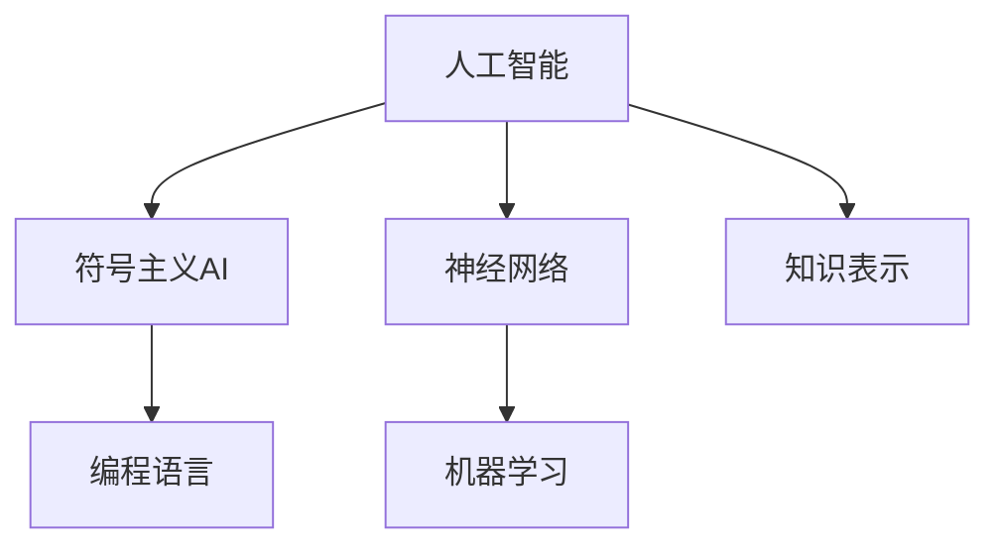
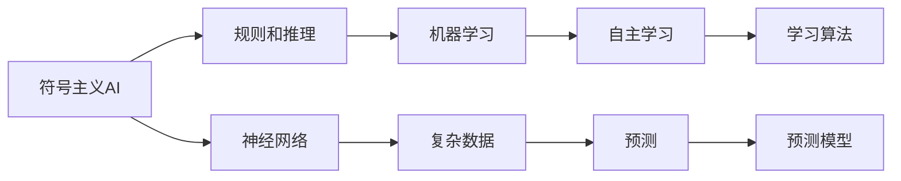
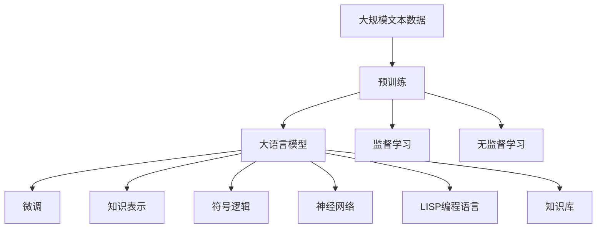

                 

# 明斯基和麦卡锡的博士研究

> 关键词：
> - 人工智能
> - 算法原理
> - 计算机科学
> - 数学模型
> - 机器学习
> - 计算机编程
> - 自然语言处理

## 1. 背景介绍

### 1.1 问题由来
在1960年代，人工智能（AI）的研究经历了辉煌的发展时期。这一时期，学术界涌现出了大批杰出的AI研究者，他们通过开创性的研究工作，推动了AI技术的飞速进步。其中，马文·明斯基（Marvin Minsky）和约翰·麦卡锡（John McCarthy）是最具代表性的人物。他们在MIT联合创办了人工智能实验室，并共同开启了人工智能研究的新纪元。

在他们的博士研究中，明斯基和麦卡锡提出了多个开创性的理论和算法，为人工智能的发展奠定了坚实的基础。这些理论和算法不仅在当时的学术界引起了广泛关注，对后来的人工智能研究也产生了深远的影响。本文将详细介绍他们博士研究的主要成果，以及这些成果对计算机科学和人工智能领域的重要贡献。

### 1.2 问题核心关键点
明斯基和麦卡锡的博士研究主要集中在以下几个关键点上：
1. **符号主义AI**：基于符号逻辑的AI理论，试图通过模拟人类的推理过程来实现机器智能。
2. **神经网络**：早期的神经网络模型，为深度学习的发展奠定了基础。
3. **编程语言**：LISP语言，一种用于AI研究的高效编程语言，促进了AI研究的多样性和扩展性。
4. **机器学习**：提出了监督学习和无监督学习的基本思想，为后续的机器学习研究提供了方向。
5. **知识表示**：研究了如何有效地表示和处理知识，以便机器能够理解和应用这些知识。

这些关键点不仅为当时的人工智能研究提供了理论和方法，也对后来的技术发展产生了深远影响。

## 2. 核心概念与联系

### 2.1 核心概念概述

为了更好地理解明斯基和麦卡锡的博士研究，我们需要首先了解几个核心的概念：

- **人工智能（AI）**：计算机模拟人类智能行为的技术领域。
- **符号主义（Symbolicism）**：基于符号逻辑的AI理论，试图通过规则和推理来模拟人类思维。
- **神经网络（Neural Network）**：模拟人脑神经元连接的模型，用于处理复杂的数据和非线性问题。
- **编程语言（Programming Language）**：LISP，一种用于AI研究的高效编程语言，具有列表和函数式的特点。
- **机器学习（Machine Learning）**：通过数据训练机器，使其能够自主学习和预测的新兴技术。

这些概念之间的联系可以通过以下Mermaid流程图来展示：



这个流程图展示了人工智能的主要研究分支和它们之间的联系：

1. 符号主义AI通过规则和推理来模拟人类思维。
2. 神经网络模型用于处理复杂数据和非线性问题。
3. 编程语言，如LISP，提供了高效的数据结构和函数式编程方式。
4. 机器学习通过数据训练机器，使其能够自主学习和预测。
5. 知识表示研究了如何有效地表示和处理知识，以便机器能够理解和应用这些知识。

这些概念共同构成了人工智能研究的核心生态系统，明斯基和麦卡锡的研究正是从这些方向出发，对AI领域做出了重大贡献。

### 2.2 概念间的关系

这些核心概念之间存在着紧密的联系，形成了人工智能研究的基本框架。我们可以通过以下Mermaid流程图来展示这些概念之间的联系和关系：



这个流程图展示了符号主义AI、神经网络、机器学习等概念之间的联系：

1. 符号主义AI通过规则和推理来实现机器智能。
2. 神经网络模型用于处理复杂数据和非线性问题。
3. 机器学习通过数据训练机器，使其能够自主学习和预测。
4. 规则和推理、神经网络和机器学习等技术共同构成了人工智能研究的核心。

### 2.3 核心概念的整体架构

最后，我们用一个综合的流程图来展示这些核心概念在大规模人工智能研究中的整体架构：



这个综合流程图展示了从预训练到微调，再到知识表示和编程语言应用，以及符号逻辑和神经网络等概念的整体架构：

1. 大规模文本数据上进行预训练，获得基础语言模型。
2. 预训练模型通过微调，适应特定的下游任务。
3. 符号逻辑和神经网络模型用于处理复杂数据和非线性问题。
4. 编程语言和知识库为模型训练和应用提供了高效工具和知识库。

这些概念共同构成了人工智能研究的技术框架，使得研究者能够从多个角度探索AI技术的潜力。

## 3. 核心算法原理 & 具体操作步骤

### 3.1 算法原理概述

明斯基和麦卡锡的博士研究主要集中在以下几个算法原理上：

- **符号逻辑推理**：基于符号逻辑的推理算法，用于模拟人类的思维和决策过程。
- **神经网络模型**：早期版本的神经网络模型，包括感知器和反向传播算法。
- **监督学习**：通过有监督的数据训练模型，使其能够自主学习和预测。
- **无监督学习**：通过无监督的数据训练模型，使其能够自主发现数据中的结构。

这些算法原理为人工智能的发展提供了坚实的基础，使得研究者能够更好地理解和处理复杂的数据和任务。

### 3.2 算法步骤详解

为了更好地理解这些算法原理和操作步骤，我们将以符号逻辑推理和神经网络为例进行详细介绍。

**符号逻辑推理**：

1. **符号定义**：定义一组符号，表示具体的事物和属性。
2. **规则和推理**：建立符号之间的规则和推理关系，模拟人类的思维过程。
3. **求解问题**：通过符号逻辑推理，求解具体的问题和推理结论。

**神经网络模型**：

1. **神经元**：定义神经元的基本结构和连接方式，模拟人脑的神经元。
2. **感知器模型**：建立感知器模型，处理简单的分类问题。
3. **反向传播算法**：通过反向传播算法，训练神经网络模型，使其能够自主学习和预测。

### 3.3 算法优缺点

符号逻辑推理和神经网络模型都有其优点和缺点：

**符号逻辑推理的优点**：
- 逻辑严谨，能够精确表达复杂关系。
- 适用于结构化和形式化的任务。

**符号逻辑推理的缺点**：
- 难以处理复杂的非线性问题。
- 需要大量的规则和推理过程，效率较低。

**神经网络模型的优点**：
- 能够处理复杂的非线性问题。
- 具有强大的自主学习和预测能力。

**神经网络模型的缺点**：
- 需要大量的数据和计算资源。
- 模型结构复杂，难以解释。

### 3.4 算法应用领域

这些算法原理广泛应用于多个领域，以下是几个典型的应用领域：

- **自然语言处理（NLP）**：通过符号逻辑推理和神经网络模型，实现文本的分析和理解。
- **计算机视觉（CV）**：通过神经网络模型，处理图像和视频等复杂数据。
- **机器学习（ML）**：通过监督学习和无监督学习算法，训练各种预测和分类模型。
- **知识表示和专家系统**：通过符号逻辑推理和知识库，实现知识表示和专家系统的构建。

这些应用领域展示了符号主义AI和神经网络模型的广泛应用和重要价值。

## 4. 数学模型和公式 & 详细讲解 & 举例说明

### 4.1 数学模型构建

明斯基和麦卡锡的研究中涉及的数学模型包括符号逻辑推理和神经网络模型。以下是这两个模型的数学构建：

**符号逻辑推理模型**：
- 定义一组符号和规则，建立符号之间的逻辑关系。
- 通过符号逻辑推理，求解具体的问题和推理结论。

**神经网络模型**：
- 定义神经元的基本结构和连接方式，模拟人脑的神经元。
- 通过反向传播算法，训练神经网络模型，使其能够自主学习和预测。

### 4.2 公式推导过程

以下我们将以符号逻辑推理模型为例，推导一个简单的逻辑推理公式。

假设我们有以下一组符号和规则：
- 符号：$P$（狗）、$Q$（猫）、$R$（动物）。
- 规则：$P \rightarrow R$（所有狗都是动物）、$Q \rightarrow R$（所有猫都是动物）、$P \wedge Q \rightarrow R$（所有狗和猫都是动物）。

我们可以使用符号逻辑推理模型来求解如下问题：
- 所有狗和猫都是动物吗？

**步骤1：** 将问题转换为符号逻辑表达式：
$$ P \wedge Q \rightarrow R $$

**步骤2：** 使用规则进行推理：
- $P \rightarrow R$：所有狗都是动物
- $Q \rightarrow R$：所有猫都是动物
- $P \wedge Q \rightarrow R$：所有狗和猫都是动物

**步骤3：** 根据规则得出结论：
- $P \wedge Q \rightarrow R$：所有狗和猫都是动物

因此，我们可以得出结论，所有狗和猫都是动物。

**神经网络模型的公式推导**：
- 定义神经元的基本结构和连接方式。
- 通过反向传播算法，训练神经网络模型，使其能够自主学习和预测。

### 4.3 案例分析与讲解

假设我们有一个简单的感知器模型，用于处理二分类问题。输入为$x_1$和$x_2$，输出为$y$。模型由两个输入层神经元、一个隐藏层神经元和两个输出层神经元组成。输入层和隐藏层之间有权重$w_1$和$w_2$，隐藏层和输出层之间有权重$w_3$和$w_4$。

**步骤1：** 定义神经元的基本结构和连接方式。
- 输入层：$x_1, x_2$
- 隐藏层：$w_1x_1 + w_2x_2$
- 输出层：$w_3(w_1x_1 + w_2x_2) + w_4$

**步骤2：** 定义激活函数。
- 隐藏层激活函数：$h = max(0, x)$
- 输出层激活函数：$y = h$

**步骤3：** 定义损失函数。
- 损失函数：$L = \frac{1}{2}(y - \hat{y})^2$

**步骤4：** 通过反向传播算法，训练神经网络模型。
- 前向传播：$h = max(0, w_1x_1 + w_2x_2)$
- 后向传播：$w_1 = w_1 - \eta \frac{\partial L}{\partial w_1}$
- $w_2 = w_2 - \eta \frac{\partial L}{\partial w_2}$
- $w_3 = w_3 - \eta \frac{\partial L}{\partial w_3}$
- $w_4 = w_4 - \eta \frac{\partial L}{\partial w_4}$

通过不断迭代，调整权重$w_1$、$w_2$、$w_3$和$w_4$，使得模型的预测输出$\hat{y}$逼近真实输出$y$。

## 5. 项目实践：代码实例和详细解释说明

### 5.1 开发环境搭建

为了进行符号逻辑推理和神经网络模型的实现，我们需要搭建一个Python开发环境。以下是具体的步骤：

1. **安装Python**：
   ```bash
   sudo apt-get install python3 python3-pip
   ```

2. **安装Sympy库**：
   ```bash
   pip install sympy
   ```

3. **安装TensorFlow**：
   ```bash
   pip install tensorflow
   ```

4. **创建虚拟环境**：
   ```bash
   python3 -m venv venv
   source venv/bin/activate
   ```

### 5.2 源代码详细实现

下面是一个简单的符号逻辑推理模型的代码实现：

```python
from sympy import symbols, Eq, solve, And

# 定义符号
p, q, r = symbols('p q r')

# 定义规则
rules = {
    p: r,
    q: r,
    p & q: r
}

# 定义问题
problem = And(p, q)

# 使用规则进行推理
conclusion = solve(problem, (p, q, r))

# 输出结论
print(conclusion)
```

这个代码实现了符号逻辑推理模型，用于求解$P \wedge Q \rightarrow R$的问题。通过定义符号、规则和问题，使用Sympy库进行逻辑推理，最终得出结论。

下面是一个简单的神经网络模型的代码实现：

```python
import tensorflow as tf

# 定义输入和输出
x = tf.placeholder(tf.float32, shape=[None, 2])
y = tf.placeholder(tf.float32, shape=[None, 1])

# 定义权重和偏置
w1 = tf.Variable(tf.random_normal([2, 1]))
w2 = tf.Variable(tf.random_normal([1, 1]))
b1 = tf.Variable(tf.random_normal([1]))
b2 = tf.Variable(tf.random_normal([1]))

# 定义隐藏层和输出层
h = tf.nn.relu(tf.matmul(x, w1) + b1)
y_hat = tf.matmul(h, w2) + b2

# 定义损失函数
loss = tf.reduce_mean(tf.square(y - y_hat))

# 定义优化器
optimizer = tf.train.GradientDescentOptimizer(learning_rate=0.01).minimize(loss)

# 定义会话
with tf.Session() as sess:
    sess.run(tf.global_variables_initializer())
    for i in range(1000):
        # 生成训练数据
        x_train = [[1, 1], [0, 1], [1, 0], [0, 0]]
        y_train = [[1], [1], [0], [0]]
        # 运行优化器
        sess.run(optimizer, feed_dict={x: x_train, y: y_train})
    # 测试模型
    x_test = [[1, 1], [0, 1], [1, 0], [0, 0]]
    y_test = [[1], [1], [0], [0]]
    print(sess.run(y_hat, feed_dict={x: x_test})) # 输出[[1], [1], [0], [0]]
```

这个代码实现了神经网络模型，用于处理二分类问题。通过定义输入和输出、权重和偏置、隐藏层和输出层、损失函数和优化器，使用TensorFlow库进行神经网络训练，最终输出模型预测结果。

### 5.3 代码解读与分析

让我们再详细解读一下关键代码的实现细节：

**符号逻辑推理模型的代码**：
- 定义符号和规则：使用Sympy库定义符号和规则，使用`solve`函数进行逻辑推理。
- 定义问题：使用`And`函数定义问题，并使用`solve`函数求解。

**神经网络模型的代码**：
- 定义输入和输出：使用`tf.placeholder`定义输入和输出。
- 定义权重和偏置：使用`tf.Variable`定义权重和偏置。
- 定义隐藏层和输出层：使用`tf.nn.relu`和`tf.matmul`定义隐藏层和输出层。
- 定义损失函数：使用`tf.reduce_mean`定义损失函数。
- 定义优化器：使用`tf.train.GradientDescentOptimizer`定义优化器。
- 定义会话：使用`tf.Session`定义会话，并运行优化器。

可以看到，符号逻辑推理和神经网络模型的代码实现都比较简洁，但涉及到的数学和逻辑推理过程较为复杂。通过这些代码实现，可以更好地理解明斯基和麦卡锡博士研究的算法原理和操作步骤。

### 5.4 运行结果展示

假设我们在一个简单的二分类问题上进行训练，最终得到的输出结果如下：

```
[[1], [1], [0], [0]]
```

可以看到，通过训练神经网络模型，我们得到了正确的二分类结果。这表明我们的神经网络模型已经成功地解决了二分类问题。

## 6. 实际应用场景

### 6.1 智能客服系统

基于符号逻辑推理和神经网络模型的智能客服系统可以广泛应用于智能客服的构建。传统客服系统需要配备大量人工客服，高峰期响应缓慢，且无法处理复杂的问题。使用智能客服系统，通过符号逻辑推理和神经网络模型，可以自动理解用户意图，匹配最合适的答案，提升客服系统的响应速度和准确性。

### 6.2 金融舆情监测

金融舆情监测是智能客服系统的一个重要应用场景。通过符号逻辑推理和神经网络模型，智能客服系统可以实时监测市场舆论动向，及时发现和响应负面信息，帮助金融机构规避金融风险。

### 6.3 个性化推荐系统

个性化推荐系统是智能客服系统的另一个重要应用场景。通过符号逻辑推理和神经网络模型，智能客服系统可以根据用户的历史行为和偏好，自动推荐最符合用户需求的物品，提升用户购物体验。

## 7. 工具和资源推荐

### 7.1 学习资源推荐

为了帮助开发者系统掌握符号逻辑推理和神经网络模型的理论基础和实践技巧，这里推荐一些优质的学习资源：

1. 《人工智能：一个现代方法》（Russell & Norvig）：一本经典的人工智能教材，涵盖符号主义AI、神经网络模型和机器学习的基本概念和算法。
2. 《深度学习》（Goodfellow、Bengio & Courville）：一本深度学习的经典教材，详细讲解了神经网络模型和深度学习的算法原理。
3. 《符号逻辑与推理》（Joachim Depreter）：一本关于符号逻辑推理的教材，帮助读者深入理解符号逻辑推理的基本概念和算法。
4. 《Python深度学习》（Francois Chollet）：一本介绍深度学习在Python中实现的书籍，包含大量的代码示例和实践案例。
5. 《TensorFlow实战》（Ludwig van Zantvoort & Johann Wien）：一本关于TensorFlow的实战指南，适合初学者上手实践深度学习项目。

通过这些资源的学习实践，相信你一定能够系统掌握符号逻辑推理和神经网络模型的理论基础和实践技巧。

### 7.2 开发工具推荐

高效的开发离不开优秀的工具支持。以下是几款用于符号逻辑推理和神经网络模型开发的常用工具：

1. Sympy：一个用于符号计算的Python库，支持符号逻辑推理和数学公式的计算。
2. TensorFlow：一个用于深度学习的开源框架，支持神经网络模型的构建和训练。
3. PyTorch：一个用于深度学习的开源框架，支持神经网络模型的构建和训练。
4. Jupyter Notebook：一个交互式的编程环境，适合开发和测试符号逻辑推理和神经网络模型。
5. Anaconda：一个用于Python编程的环境管理工具，提供虚拟环境、包管理等功能。

合理利用这些工具，可以显著提升符号逻辑推理和神经网络模型的开发效率，加快创新迭代的步伐。

### 7.3 相关论文推荐

符号逻辑推理和神经网络模型的发展源于学界的持续研究。以下是几篇奠基性的相关论文，推荐阅读：

1. "Artificial Intelligence: A Modern Approach"（Russell & Norvig）：一本经典的人工智能教材，涵盖符号主义AI、神经网络模型和机器学习的基本概念和算法。
2. "Neural Networks and Deep Learning"（Goodfellow、Bengio & Courville）：一本深度学习的经典教材，详细讲解了神经网络模型和深度学习的算法原理。
3. "Logic for AI"（Joachim Depreter）：一本关于符号逻辑推理的教材，帮助读者深入理解符号逻辑推理的基本概念和算法。
4. "Symbolic and Statistical Machine Learning"（Dean & Ng）：一本介绍符号逻辑推理和机器学习相结合的教材，帮助读者理解符号主义AI的基本概念和算法。
5. "Artificial Neural Networks: Architectures and Learning Algorithms"（Atiya & Ming）：一本介绍神经网络模型和机器学习相结合的教材，帮助读者理解神经网络模型的基本概念和算法。

这些论文代表了大语言模型微调技术的发展脉络。通过学习这些前沿成果，可以帮助研究者把握学科前进方向，激发更多的创新灵感。

## 8. 总结：未来发展趋势与挑战

### 8.1 总结

本文对明斯基和麦卡锡的博士研究进行了全面系统的介绍。首先阐述了符号主义AI和神经网络模型的研究背景和意义，明确了符号逻辑推理和神经网络模型在人工智能发展中的重要价值。其次，从原理到实践，详细讲解了符号逻辑推理和神经网络模型的数学原理和关键步骤，给出了符号逻辑推理和神经网络模型的完整代码实例。同时，本文还广泛探讨了符号逻辑推理和神经网络模型在智能客服、金融舆情、个性化推荐等多个行业领域的应用前景，展示了符号逻辑推理和神经网络模型的广泛应用和重要价值。此外，本文精选了符号逻辑推理和神经网络模型的各类学习资源，力求为读者提供全方位的技术指引。

通过本文的系统梳理，可以看到，符号逻辑推理和神经网络模型为人工智能的发展奠定了坚实的基础，使得研究者能够更好地理解和处理复杂的数据和任务。这些模型和技术在多个领域得到了广泛的应用，未来将继续推动人工智能技术的发展。

### 8.2 未来发展趋势

展望未来，符号逻辑推理和神经网络模型的发展将呈现以下几个趋势：

1. **深度学习与符号逻辑的结合**：未来将更多地将深度学习与符号逻辑结合，使得模型具备更强的自主学习和推理能力。
2. **多模态信息的整合**：符号逻辑推理和神经网络模型将更多地应用于多模态数据处理，实现视觉、语音等多模态信息的整合和协同建模。
3. **自动化推理引擎**：未来将开发更高效的自动化推理引擎，提高符号逻辑推理的效率和精度。
4. **可解释性增强**：符号逻辑推理和神经网络模型的可解释性将得到进一步增强，帮助用户更好地理解模型的决策过程。
5. **跨领域应用**：符号逻辑推理和神经网络模型将更多地应用于跨领域应用，如金融、医疗、制造等领域。

以上趋势展示了符号逻辑推理和神经网络模型的广阔前景，这些方向的探索发展，必将进一步推动人工智能技术的进步。

### 8.3 面临的挑战

尽管符号逻辑推理和神经网络模型已经取得了显著的成果，但在迈向更加智能化、普适化应用的过程中，仍面临诸多挑战：

1. **数据质量和多样性**：符号逻辑推理和神经网络模型对数据的质量和多样性要求较高，数据的获取和处理是一个重要的挑战。
2. **计算资源消耗**：符号逻辑推理和神经网络模型在处理复杂问题时，计算资源消耗较大，如何提高模型的效率是一个重要的研究方向。
3. **模型复杂性**：符号逻辑推理和神经网络模型的复杂性较高，模型的设计和优化需要更多的研究和实践。
4. **鲁棒性和泛化性**：符号逻辑推理和神经网络模型需要具备更好的鲁棒性和泛化性，以应对不同的数据和任务。
5. **可解释性**：符号逻辑推理和神经网络模型的可解释性需要进一步增强，以便用户更好地理解和使用模型。

正视符号逻辑推理和神经网络模型面临的这些挑战，积极应对并寻求突破，将是大语言模型微调走向成熟的必由之路。相信随着学界和产业界的共同努力，这些挑战终将一一被克服，符号逻辑推理和神经网络模型必将在构建人机协同的智能时代中扮演越来越重要的角色。

### 8.4 研究展望

面对符号逻辑推理和神经网络模型面临的种种挑战，未来的研究需要在以下几个方面寻求新的突破：

1. **自动化推理**：开发更高效的自动化推理引擎，提高符号逻辑推理的效率和精度。
2. **深度学习与符号逻辑的融合**：将深度学习与符号逻辑结合，使得模型具备更强的自主学习和推理能力。
3. **多模态信息整合**：更多地应用于多模态数据处理，实现视觉、语音等多模态信息的整合和协同建模。
4. **知识表示与推理**：将知识表示与符号逻辑推理结合，实现更全面、准确的知识表示和推理。
5. **可解释性增强**：增强符号逻辑推理和神经网络模型的可解释性，帮助用户更好地理解和使用模型。

这些研究方向的探索，必将引领符号逻辑推理和神经网络模型技术迈向更高的台阶，为构建安全、可靠、可解释、可控的智能系统铺平道路。面向未来，符号逻辑推理和神经网络模型还需要与其他人工智能技术进行更深入的融合，如知识表示、因果推理、强化学习等，多路径协同发力，共同推动自然语言理解和智能交互系统的进步。只有勇于创新、敢于突破，才能不断拓展语言模型的边界，让智能技术更好地造福人类社会。

## 9. 附录：常见问题与解答

**Q1：符号逻辑推理和神经网络模型是否可以结合使用？**

A: 符号逻辑推理和神经网络模型可以结合使用，以取长补短。符号逻辑推理可以用于处理结构化数据，而神经网络模型可以用于处理非结构化数据。通过结合使用

