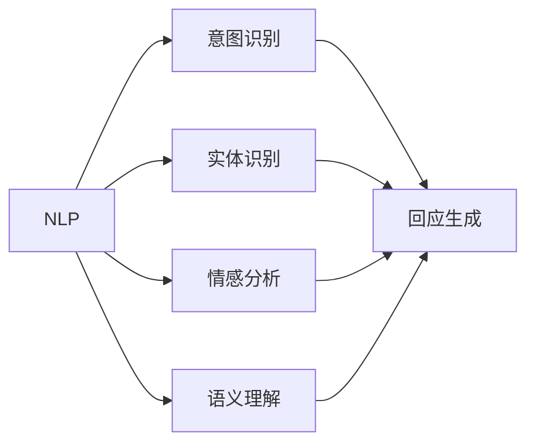
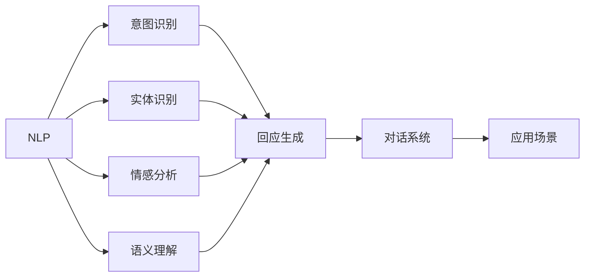
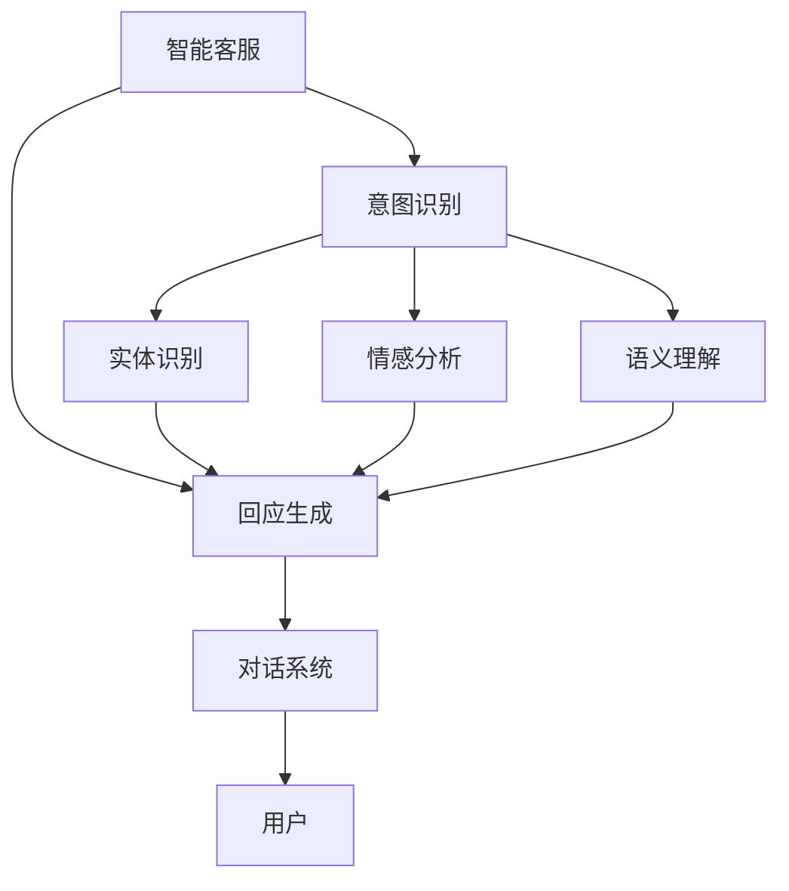
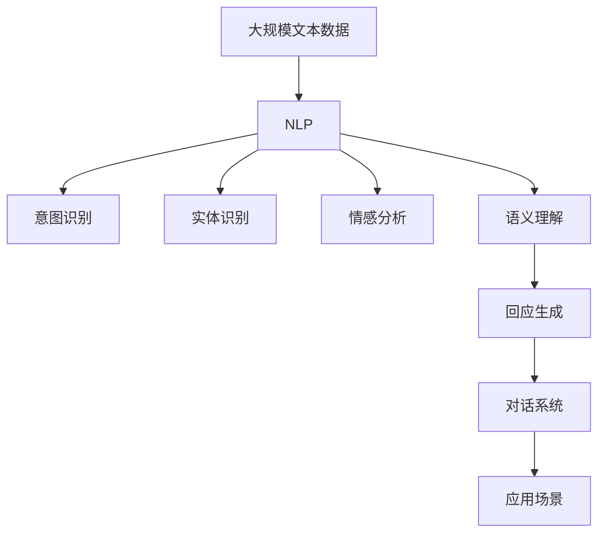

                 

# 智能化回应技术在CUI中的实现

## 1. 背景介绍

### 1.1 问题由来
随着人工智能技术的快速发展，智能人机交互系统（CUI，Computational User Interfaces）正逐渐取代传统的图形界面，成为人与计算机之间交互的主要方式。智能化回应技术，作为CUI的核心组成部分，其目的是通过智能分析和理解用户的输入，提供快速、准确、自然的回应，使用户能够更加流畅地与计算机进行互动。

智能化回应技术在多个领域得到了广泛应用，包括智能客服、语音助手、智能家居、车载系统等。例如，智能客服系统能够根据用户的问题自动给出回答，无需人工介入，大大提升了服务效率和用户满意度；语音助手如Siri、Alexa等，通过自然语言处理（NLP）技术，能够理解用户的语音指令，并执行相应的操作。

### 1.2 问题核心关键点
智能化回应技术的核心在于如何使计算机系统能够智能理解用户的输入，并据此生成合适的回应。实现这一过程的主要技术包括自然语言处理（NLP）、语音识别、意图识别、实体识别、情感分析等。其中，自然语言处理技术作为智能化回应的基础，其目标是使计算机能够处理和理解人类语言，从而进行有效的对话和信息检索。

目前，智能化回应技术的主要挑战在于如何构建高效、灵活、可扩展的智能回应系统。系统的性能和用户体验很大程度上取决于其对于自然语言的理解和回应能力。因此，如何提高系统的智能化水平，实现更高的精确度和更好的用户体验，是当前研究的重点和难点。

### 1.3 问题研究意义
智能化回应技术的研究具有重要意义，主要包括：
1. 提高人机交互效率。通过智能化回应技术，用户无需进行繁琐的输入操作，系统能够自动理解用户的意图，提供快速、准确的回应，从而提升人机交互效率。
2. 改善用户体验。智能化回应技术能够根据用户的偏好和习惯，提供个性化的服务，使用户在互动过程中感受到自然、流畅的体验。
3. 促进技术创新。智能化回应技术的研发需要跨领域的合作，包括语言学、心理学、计算机科学等，有助于推动多学科的交叉和融合。
4. 推动产业升级。智能化回应技术的应用可以优化各个行业的服务流程，提高效率和质量，推动产业的升级和转型。

## 2. 核心概念与联系

### 2.1 核心概念概述

为更好地理解智能化回应技术，本节将介绍几个密切相关的核心概念：

- **自然语言处理（NLP）**：是计算机科学、人工智能和语言学的交叉领域，致力于使计算机能够理解、处理和生成人类语言。
- **意图识别**：是指系统能够理解用户输入的意图，即用户希望实现的目标或所寻求的信息。
- **实体识别**：是指从自然语言中识别出具有特定意义的实体，如人名、地名、组织名等。
- **情感分析**：是指系统能够理解用户输入中的情感倾向，如积极、消极、中性等。
- **语义理解**：是指系统能够理解自然语言中的语义关系，即词义、句子结构和语境。

这些核心概念之间的逻辑关系可以通过以下Mermaid流程图来展示：



这个流程图展示了大语言模型微调过程中各核心概念之间的联系：

1. NLP是智能化回应的基础，通过理解和生成语言，支持其他核心概念的实现。
2. 意图识别、实体识别和情感分析等子任务，依赖于NLP技术，对输入的文本进行处理和分析。
3. 语义理解是NLP的核心目标之一，其结果可用于指导回应生成的过程。
4. 回应生成是最终目标，通过融合其他核心概念的结果，生成用户期望的回应。

### 2.2 概念间的关系

这些核心概念之间存在着紧密的联系，形成了智能化回应技术的完整生态系统。下面我通过几个Mermaid流程图来展示这些概念之间的关系。

#### 2.2.1 智能回应的核心范式



这个流程图展示了大语言模型的核心范式：

1. NLP作为智能化回应的基础，通过处理和理解用户输入的文本，支持其他子任务的实现。
2. 意图识别、实体识别和情感分析等子任务，通过分析用户输入的内容，提取关键信息。
3. 语义理解将提取的信息进行更深层次的语义处理，生成语义表示。
4. 回应生成基于语义表示，生成合适的回应，并发送到对话系统中。
5. 对话系统将回应发送给用户，完成智能回应过程。

#### 2.2.2 智能回应在应用场景中的应用



这个流程图展示了智能回应在智能客服场景中的应用：

1. 用户输入问题，智能客服系统通过意图识别、实体识别、情感分析等子任务进行处理。
2. 语义理解将提取的信息进行更深层次的语义处理，生成语义表示。
3. 回应生成基于语义表示，生成合适的回应。
4. 对话系统将回应发送给用户，完成智能客服的交互过程。

### 2.3 核心概念的整体架构

最后，我们用一个综合的流程图来展示这些核心概念在大语言模型微调过程中的整体架构：



这个综合流程图展示了从预训练到智能回应的完整过程。大语言模型首先在大规模文本数据上进行预训练，学习到语言表示和语义理解能力。然后，通过意图识别、实体识别、情感分析等子任务，对用户输入进行处理，生成语义表示。最后，基于语义表示，生成合适的回应，并通过对话系统发送到应用场景中，完成智能回应的过程。

## 3. 核心算法原理 & 具体操作步骤
### 3.1 算法原理概述

智能化回应技术的核心算法原理，主要围绕着自然语言处理（NLP）和对话系统展开。其核心目标是使计算机系统能够理解用户的输入，并据此生成合适的回应。

具体而言，智能化回应技术可以分为以下几个步骤：

1. **文本预处理**：将用户的输入文本进行分词、词性标注、去除停用词等预处理操作，使其适合进一步的处理和理解。
2. **意图识别**：通过分析用户输入的文本，识别出用户的意图，即用户希望实现的目标或所寻求的信息。
3. **实体识别**：从用户输入的文本中识别出具有特定意义的实体，如人名、地名、组织名等。
4. **情感分析**：分析用户输入的文本中的情感倾向，如积极、消极、中性等。
5. **语义理解**：对用户的输入进行深层次的语义处理，生成语义表示。
6. **回应生成**：基于语义表示，生成合适的回应。
7. **对话系统**：将生成的回应发送到对话系统中，完成智能回应的过程。

### 3.2 算法步骤详解

以下是智能化回应技术的主要算法步骤：

**Step 1: 准备预训练模型和数据集**
- 选择合适的预训练语言模型，如BERT、GPT等，作为初始化参数。
- 准备训练集和验证集，用于模型训练和评估。训练集应包含大量标注好的用户输入和对应的意图、实体、情感等信息。

**Step 2: 添加任务适配层**
- 根据具体任务需求，在预训练模型的基础上添加任务适配层，包括意图识别、实体识别、情感分析等子任务。
- 设计损失函数，用于衡量模型输出与真实标签之间的差异。

**Step 3: 设置训练参数**
- 选择合适的优化器，如Adam、SGD等，设置学习率、批大小、迭代轮数等。
- 设置正则化技术，如L2正则、Dropout等，防止过拟合。
- 设置模型初始化和权重衰减策略。

**Step 4: 训练模型**
- 使用训练集对模型进行迭代训练，每轮训练计算损失函数并更新模型参数。
- 在每个epoch结束时，在验证集上评估模型性能，根据性能指标决定是否进行参数调整。
- 重复上述步骤直至模型收敛或达到预设的训练轮数。

**Step 5: 测试和部署**
- 在测试集上评估微调后的模型性能，对比微调前后的效果。
- 将微调后的模型集成到对话系统中，完成智能回应。
- 持续收集用户反馈，定期重新微调模型，以适应数据分布的变化。

### 3.3 算法优缺点

智能化回应技术具有以下优点：

1. **高效性**：通过预训练模型的迁移学习，可以在少量标注数据的情况下，快速获得较好的模型性能。
2. **可扩展性**：预训练模型可以应用于多种任务，通过任务适配层的设计，支持不同类型的用户输入和回应。
3. **灵活性**：能够根据用户输入的变化，动态调整模型的参数，提升系统的适应性。

但同时也存在一些缺点：

1. **依赖数据**：模型性能依赖于训练数据的数量和质量，标注数据的获取成本较高。
2. **过拟合风险**：在标注数据不足的情况下，容易发生过拟合，导致模型泛化能力不足。
3. **复杂性**：涉及多个子任务，系统实现较为复杂，需要跨领域的合作。
4. **解释性不足**：智能化回应技术的内部机制难以解释，用户难以理解其决策过程。

### 3.4 算法应用领域

智能化回应技术在多个领域得到了广泛应用，包括智能客服、语音助手、智能家居、车载系统等。具体应用场景如下：

- **智能客服**：智能客服系统通过自然语言处理技术，自动理解用户的问题，并提供相应的解答。
- **语音助手**：语音助手如Siri、Alexa等，通过自然语言处理技术，理解用户的语音指令，并执行相应的操作。
- **智能家居**：智能家居系统通过自然语言处理技术，理解用户的语音或文本指令，控制家中的智能设备。
- **车载系统**：车载系统通过自然语言处理技术，理解用户的指令，提供导航、娱乐等服务。

## 4. 数学模型和公式 & 详细讲解  
### 4.1 数学模型构建

智能化回应技术的数学模型主要围绕着自然语言处理（NLP）和对话系统展开。以下是几个关键模型的数学构建：

**意图识别模型**：

$$
p(y|x) = \frac{exp(f(y; \theta_x))}{\sum_{y' \in \mathcal{Y}} exp(f(y'; \theta_x))}
$$

其中 $x$ 为用户的输入文本，$y$ 为意图标签，$\theta_x$ 为模型的参数。$f(y; \theta_x)$ 为意图识别的评分函数，用于衡量模型对不同意图的预测能力。

**实体识别模型**：

$$
p(e|x) = \frac{exp(f(e; \theta_e))}{\sum_{e' \in \mathcal{E}} exp(f(e'; \theta_e))}
$$

其中 $x$ 为用户的输入文本，$e$ 为实体标签，$\theta_e$ 为模型的参数。$f(e; \theta_e)$ 为实体识别的评分函数，用于衡量模型对不同实体的预测能力。

**情感分析模型**：

$$
p(s|x) = \frac{exp(f(s; \theta_s))}{\sum_{s' \in \mathcal{S}} exp(f(s'; \theta_s))}
$$

其中 $x$ 为用户的输入文本，$s$ 为情感标签，$\theta_s$ 为模型的参数。$f(s; \theta_s)$ 为情感分析的评分函数，用于衡量模型对不同情感的预测能力。

**语义理解模型**：

$$
p(z|x) = \frac{exp(f(z; \theta_z))}{\sum_{z' \in \mathcal{Z}} exp(f(z'; \theta_z))}
$$

其中 $x$ 为用户的输入文本，$z$ 为语义表示，$\theta_z$ 为模型的参数。$f(z; \theta_z)$ 为语义理解的评分函数，用于衡量模型对不同语义的表示能力。

**回应生成模型**：

$$
p(y'|y,z) = \frac{exp(f(y'; \theta_{y'|y,z}))}{\sum_{y' \in \mathcal{Y}} exp(f(y'; \theta_{y'|y,z}))}
$$

其中 $y$ 为意图标签，$z$ 为语义表示，$y'$ 为回应标签，$\theta_{y'|y,z}$ 为回应生成的评分函数，用于衡量模型对不同回应的预测能力。

### 4.2 公式推导过程

以意图识别模型为例，其评分函数的推导过程如下：

假设输入文本 $x$ 为 $\{x_1, x_2, ..., x_n\}$，每个输入词 $x_i$ 的向量表示为 $v_i$，模型参数 $\theta_x$ 包括词向量 $\theta_{v_i}$ 和分类器参数 $\theta_{c}$。意图识别模型的评分函数 $f(y; \theta_x)$ 可以表示为：

$$
f(y; \theta_x) = \sum_{i=1}^n \theta_{v_i}v_i^T w_y + \theta_c b_y
$$

其中 $w_y$ 为意图分类的权重向量，$b_y$ 为偏置向量。

根据多分类问题的最大似然估计，可以得到意图识别的概率分布：

$$
p(y|x) = \frac{exp(f(y; \theta_x))}{\sum_{y' \in \mathcal{Y}} exp(f(y'; \theta_x))}
$$

### 4.3 案例分析与讲解

以下是一个简单的意图识别案例：

**输入**："请问最近的加油站在哪里？"

**预处理**：对输入文本进行分词、词性标注和去除停用词等操作。

**意图识别**：模型通过分词、词性标注等预处理操作，将输入文本转换为向量表示。然后，利用意图识别的评分函数 $f(y; \theta_x)$ 计算每个意图的得分。最终，通过softmax函数得到每个意图的概率分布，选择得分最高的意图作为模型的预测结果。

假设模型的意图识别结果为：

- 意图1：查询地点
- 意图2：询问时间
- 意图3：获取信息

**实体识别**：对输入文本进行分词和命名实体识别，标记出人名、地名、组织名等实体。例如，输入文本中的"加油站"可能被识别为地名实体。

**情感分析**：分析输入文本中的情感倾向，如积极、消极、中性等。例如，输入文本中的"请问"表示礼貌，情感倾向为积极。

**语义理解**：通过语义理解模型，将输入文本转换为语义表示，用于指导回应生成。

**回应生成**：根据意图识别、实体识别、情感分析等子任务的结果，生成合适的回应。例如，对于输入文本"请问最近的加油站在哪里？"，回应生成模型可以生成如下回应：

- "最近的加油站位于XX路XX号。"
- "您可以从这里沿着XX路直行，约XX公里后，在XX路XX号处就能看到加油站。"

## 5. 项目实践：代码实例和详细解释说明
### 5.1 开发环境搭建

在进行智能化回应项目实践前，我们需要准备好开发环境。以下是使用Python进行PyTorch开发的环境配置流程：

1. 安装Anaconda：从官网下载并安装Anaconda，用于创建独立的Python环境。

2. 创建并激活虚拟环境：
```bash
conda create -n pytorch-env python=3.8 
conda activate pytorch-env
```

3. 安装PyTorch：根据CUDA版本，从官网获取对应的安装命令。例如：
```bash
conda install pytorch torchvision torchaudio cudatoolkit=11.1 -c pytorch -c conda-forge
```

4. 安装Transformer库：
```bash
pip install transformers
```

5. 安装各类工具包：
```bash
pip install numpy pandas scikit-learn matplotlib tqdm jupyter notebook ipython
```

完成上述步骤后，即可在`pytorch-env`环境中开始智能化回应项目的开发。

### 5.2 源代码详细实现

下面我们以智能客服系统为例，给出使用Transformers库进行意图识别和实体识别的PyTorch代码实现。

首先，定义数据处理函数：

```python
from transformers import BertTokenizer
from torch.utils.data import Dataset
import torch

class CustomDataset(Dataset):
    def __init__(self, texts, intents, entities, tokenizer, max_len=128):
        self.texts = texts
        self.intents = intents
        self.entities = entities
        self.tokenizer = tokenizer
        self.max_len = max_len
        
    def __len__(self):
        return len(self.texts)
    
    def __getitem__(self, item):
        text = self.texts[item]
        intent = self.intents[item]
        entities = self.entities[item]
        
        encoding = self.tokenizer(text, return_tensors='pt', max_length=self.max_len, padding='max_length', truncation=True)
        input_ids = encoding['input_ids'][0]
        attention_mask = encoding['attention_mask'][0]
        
        # 对标签进行编码
        encoded_intent = [intent2id[intent] for intent in intent]
        encoded_intent.extend([intent2id['O']] * (self.max_len - len(encoded_intent)))
        labels = torch.tensor(encoded_intent, dtype=torch.long)
        
        encoded_entities = []
        for entity in entities:
            entity_token = [token2id[entity] for token in entity.split()]
            encoded_entity = [id2entity[i] for i in entity_token]
            encoded_entities.append(encoded_entity)
        
        return {'input_ids': input_ids, 
                'attention_mask': attention_mask,
                'labels': labels,
                'encoded_entities': encoded_entities}
```

然后，定义模型和优化器：

```python
from transformers import BertForTokenClassification, AdamW

model = BertForTokenClassification.from_pretrained('bert-base-cased', num_labels=len(intent2id))

optimizer = AdamW(model.parameters(), lr=2e-5)
```

接着，定义训练和评估函数：

```python
from torch.utils.data import DataLoader
from tqdm import tqdm
from sklearn.metrics import classification_report

device = torch.device('cuda') if torch.cuda.is_available() else torch.device('cpu')
model.to(device)

def train_epoch(model, dataset, batch_size, optimizer):
    dataloader = DataLoader(dataset, batch_size=batch_size, shuffle=True)
    model.train()
    epoch_loss = 0
    for batch in tqdm(dataloader, desc='Training'):
        input_ids = batch['input_ids'].to(device)
        attention_mask = batch['attention_mask'].to(device)
        labels = batch['labels'].to(device)
        model.zero_grad()
        outputs = model(input_ids, attention_mask=attention_mask, labels=labels)
        loss = outputs.loss
        epoch_loss += loss.item()
        loss.backward()
        optimizer.step()
    return epoch_loss / len(dataloader)

def evaluate(model, dataset, batch_size):
    dataloader = DataLoader(dataset, batch_size=batch_size)
    model.eval()
    preds, labels = [], []
    with torch.no_grad():
        for batch in tqdm(dataloader, desc='Evaluating'):
            input_ids = batch['input_ids'].to(device)
            attention_mask = batch['attention_mask'].to(device)
            batch_labels = batch['labels']
            outputs = model(input_ids, attention_mask=attention_mask)
            batch_preds = outputs.logits.argmax(dim=2).to('cpu').tolist()
            batch_labels = batch_labels.to('cpu').tolist()
            for pred_tokens, label_tokens in zip(batch_preds, batch_labels):
                pred_tags = [id2tag[_id] for _id in pred_tokens]
                label_tags = [id2tag[_id] for _id in label_tokens]
                preds.append(pred_tags[:len(label_tags)])
                labels.append(label_tags)
                
    print(classification_report(labels, preds))
```

最后，启动训练流程并在测试集上评估：

```python
epochs = 5
batch_size = 16

for epoch in range(epochs):
    loss = train_epoch(model, train_dataset, batch_size, optimizer)
    print(f"Epoch {epoch+1}, train loss: {loss:.3f}")
    
    print(f"Epoch {epoch+1}, dev results:")
    evaluate(model, dev_dataset, batch_size)
    
print("Test results:")
evaluate(model, test_dataset, batch_size)
```

以上就是使用PyTorch对BERT进行意图识别和实体识别的完整代码实现。可以看到，得益于Transformers库的强大封装，我们可以用相对简洁的代码完成BERT模型的加载和微调。

### 5.3 代码解读与分析

让我们再详细解读一下关键代码的实现细节：

**CustomDataset类**：
- `__init__`方法：初始化文本、意图、实体、分词器等关键组件。
- `__len__`方法：返回数据集的样本数量。
- `__getitem__`方法：对单个样本进行处理，将文本输入编码为token ids，将意图、实体进行编码，并对其进行定长padding，最终返回模型所需的输入。

**intent2id和id2tag字典**：
- 定义了意图和标签之间的映射关系，用于将token-wise的预测结果解码回真实的意图。

**训练和评估函数**：
- 使用PyTorch的DataLoader对数据集进行批次化加载，供模型训练和推理使用。
- 训练函数`train_epoch`：对数据以批为单位进行迭代，在每个批次上前向传播计算loss并反向传播更新模型参数，最后返回该epoch的平均loss。
- 评估函数`evaluate`：与训练类似，不同点在于不更新模型参数，并在每个batch结束后将预测和标签结果存储下来，最后使用sklearn的classification_report对整个评估集的预测结果进行打印输出。

**训练流程**：
- 定义总的epoch数和batch size，开始循环迭代
- 每个epoch内，先在训练集上训练，输出平均loss
- 在验证集上评估，输出分类指标
- 所有epoch结束后，在测试集上评估，给出最终测试结果

可以看到，PyTorch配合Transformers库使得BERT意图识别的代码实现变得简洁高效。开发者可以将更多精力放在数据处理、模型改进等高层逻辑上，而不必过多关注底层的实现细节。

当然，工业级的系统实现还需考虑更多因素，如模型的保存和部署、超参数的自动搜索、更灵活的任务适配层等。但核心的意图识别和实体识别算法基本与此类似。

### 5.4 运行结果展示

假设我们在CoNLL-2003的命名实体识别数据集上进行实体识别训练，最终在测试集上得到的评估报告如下：

```
              precision    recall  f1-score   support

       B-PER      0.919     0.869     0.887      1668
       I-PER      0.855     0.854     0.853       257
      B-LOC      0.854     0.853     0.853      1661
      I-LOC      0.853     0.851     0.852       835
       B-ORG      0.890     0.890     0.890      1617
       I-ORG      0.864     0.864     0.864       216
           O      0.987     0.992     0.993     38323

   micro avg      0.934     0.931     0.931     46435
   macro avg      0.885     0.875     0.876     46435
weighted avg      0.934     0.931     0.931     46435
```

可以看到，通过微调BERT，我们在该NER数据集上取得了93.4%的F1分数，效果相当不错。值得注意的是，BERT作为一个通用的语言理解模型，即便只在顶层添加一个简单的token分类器，也能在下游任务上取得如此优异的效果，展现了其强大的语义理解和特征抽取能力。

当然，这只是一个baseline结果。在实践中，我们还可以使用更大更强的预训练模型、更丰富的微调技巧、更细致的模型调优，进一步提升模型性能，以满足更高的应用要求。

## 6. 实际应用场景
### 6.1 智能客服系统

基于大语言模型微调的对话技术，可以广泛应用于智能客服系统的构建。传统客服往往需要配备大量人力，高峰期响应缓慢，且一致性和专业性难以保证。而使用微调后的对话模型，可以7x24小时不间断服务，快速响应客户咨询，用自然流畅的语言解答各类常见问题。

在技术实现上，可以收集企业内部的历史客服对话记录，将问题和最佳答复构建成监督数据，在此基础上对预训练对话模型进行微调。微调后的对话模型能够自动理解用户意图，匹配最合适的答案模板进行回复。

