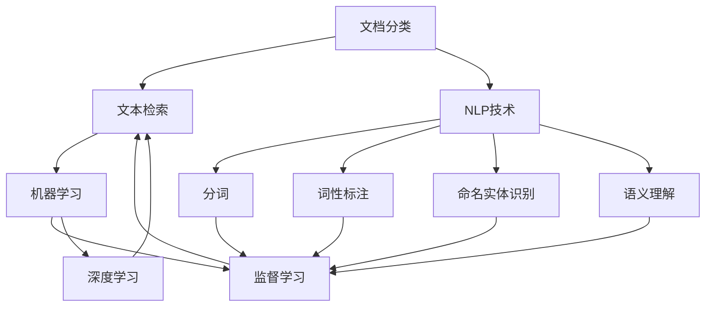
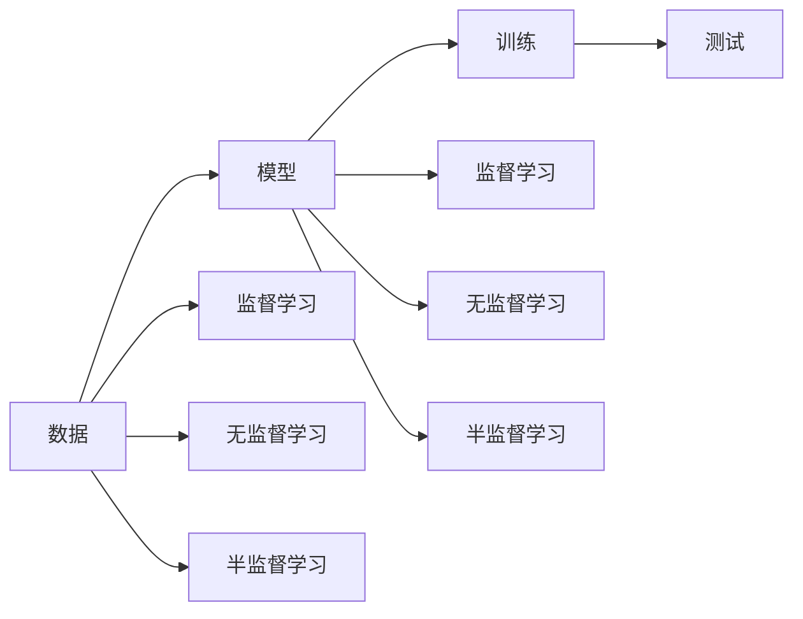
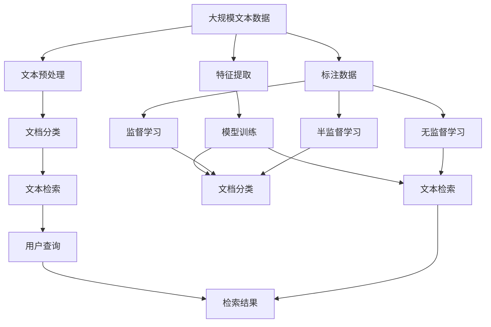

                 

## 1. 背景介绍

### 1.1 问题由来
随着数字化办公的普及，企业文档数量呈指数级增长，文档管理难度越来越大。传统文档管理手段如手动分类、纯文本搜索等已经无法满足需求。利用智能技术对文档进行自动分类与检索，提高文档检索效率，是目前企业信息化建设的重要方向。

### 1.2 问题核心关键点
智能文档分类与检索系统的主要任务是将海量文档根据内容自动进行分类，并提供快速高效的文本检索服务。系统的核心在于如何将自然语言处理(NLP)技术与文档管理系统有效结合，构建智能化的文档分类与检索引擎。

### 1.3 问题研究意义
构建智能文档分类与检索系统，对于提升企业文档管理效率，降低文档查找难度，具有重要意义：

1. **提升办公效率**：自动化的文档分类与检索，使得员工能够快速找到所需文档，减少文档检索时间，提升工作效率。
2. **优化文档管理**：智能分类技术能够自动识别文档主题，帮助企业对文档进行结构化管理，提升文档管理的规范性和系统性。
3. **增强知识共享**：通过智能检索，企业能够快速获取特定领域的相关资料，促进知识共享和经验积累，提升团队协作能力。
4. **降低运营成本**：自动化的文档分类与检索，减少了对人工文档分类和手动检索的依赖，降低了文档管理的运营成本。
5. **支撑业务创新**：文档分类与检索系统可以为业务分析、市场调研、客户反馈等多个业务环节提供数据支撑，辅助业务决策。

## 2. 核心概念与联系

### 2.1 核心概念概述

为更好地理解智能文档分类与检索系统的开发，本节将介绍几个密切相关的核心概念：

- **文档分类**：将文档按照内容、结构、主题等维度进行自动归类。常用于文档管理、知识管理、信息检索等领域。
- **文本检索**：从大规模文本集合中查找指定内容或关键词的文档。常用于搜索引擎、知识图谱、信息推荐等领域。
- **自然语言处理(NLP)**：涉及计算机处理自然语言的能力，包括分词、词性标注、命名实体识别、语义理解等。是文档分类与检索系统的核心技术之一。
- **机器学习与深度学习**：通过训练模型，使系统能够学习文档与分类标签之间的映射关系，实现文档的自动分类与检索。

这些核心概念之间的逻辑关系可以通过以下Mermaid流程图来展示：



这个流程图展示了大语言模型微调过程中各个核心概念的关系和作用：

1. 文档分类与文本检索系统依赖NLP技术，包括分词、词性标注、命名实体识别、语义理解等，以便从文本中提取有效信息。
2. 基于机器学习和深度学习模型，对提取的信息进行训练，学习文档与分类标签之间的映射关系，实现文档分类与检索。

### 2.2 概念间的关系

这些核心概念之间存在着紧密的联系，形成了智能文档分类与检索系统的完整生态系统。下面我通过几个Mermaid流程图来展示这些概念之间的关系。

#### 2.2.1 文档分类的原理


这个流程图展示了文档分类的基本原理：

1. 从原始文档提取文本内容。
2. 通过特征提取技术，将文本转化为模型能够处理的特征向量。
3. 使用机器学习或深度学习模型，对特征向量进行训练，学习文档与分类标签之间的映射关系。
4. 利用训练好的模型，对新文档进行分类预测。

#### 2.2.2 文本检索的原理


这个流程图展示了文本检索的基本原理：

1. 用户输入查询文本。
2. 从文本库中提取查询文本的特征向量。
3. 使用检索模型，计算查询文本与文档库中每个文档的相似度。
4. 按照相似度排序，返回最相关的检索结果。

#### 2.2.3 机器学习与深度学习的联系



这个流程图展示了机器学习和深度学习之间的联系：

1. 机器学习通过监督、无监督和半监督学习，构建分类和检索模型。
2. 深度学习在机器学习的基础上，通过更深层次的神经网络结构，进一步提升模型的性能。

### 2.3 核心概念的整体架构

最后，我们用一个综合的流程图来展示这些核心概念在大语言模型微调过程中的整体架构：



这个综合流程图展示了从数据预处理到文档分类再到文本检索的完整过程。大规模文本数据首先经过预处理，包括分词、去停用词、词性标注等。然后，通过特征提取技术，将文本转化为特征向量，用于训练文档分类和文本检索模型。最后，用户查询输入后，通过检索模型计算相似度，返回检索结果。

## 3. 核心算法原理 & 具体操作步骤

### 3.1 算法原理概述

智能文档分类与检索系统基于监督学习算法构建，其核心在于通过训练模型，学习文档与分类标签之间的映射关系。以下是系统开发中常用的监督学习算法：

- **朴素贝叶斯**：基于贝叶斯定理，通过训练学习分类概率分布，对新文档进行分类。
- **支持向量机(SVM)**：通过构建最优超平面，将文档映射到高维空间，进行分类。
- **决策树**：通过构建决策树模型，对文档特征进行分割，进行分类。
- **随机森林**：通过集成多个决策树模型，提高分类精度和鲁棒性。
- **深度神经网络**：通过多层神经网络，学习文档与分类标签之间的非线性映射关系，进行分类和检索。

这些算法在文档分类与检索系统中均有应用，根据实际需求选择适合的算法，可以提升系统的性能和效率。

### 3.2 算法步骤详解

智能文档分类与检索系统开发一般包括以下几个关键步骤：

**Step 1: 准备数据集**
- 收集文档样本和标注数据。标注数据应涵盖所有可能的分类标签，每个样本包括文档文本和对应的分类标签。
- 将标注数据划分为训练集、验证集和测试集。通常训练集占总数据的70%，验证集和测试集各占15%。
- 清洗文本数据，去除特殊字符、停用词、标点符号等噪音信息。

**Step 2: 文本预处理**
- 使用分词工具对文本进行分词处理，得到单词序列。
- 去除停用词，保留有意义的单词。
- 对单词进行词性标注，提取重要信息。
- 对单词进行命名实体识别，提取关键实体信息。

**Step 3: 特征提取**
- 将文本转化为特征向量。常用的特征提取方法包括词袋模型、TF-IDF、词向量模型等。
- 将特征向量作为模型的输入，训练文档分类和文本检索模型。

**Step 4: 模型训练**
- 选择合适的监督学习算法，构建模型。
- 使用训练集对模型进行训练，优化模型参数。
- 在验证集上评估模型性能，调整模型参数。
- 使用测试集进行最终测试，评估模型效果。

**Step 5: 部署与优化**
- 将训练好的模型部署到服务器，提供API接口。
- 实时监控系统性能，进行调优和优化。
- 根据用户反馈，不断改进系统功能。

以上是智能文档分类与检索系统开发的一般流程。在实际开发中，还需要根据具体需求，对每个环节进行详细设计和优化。

### 3.3 算法优缺点

智能文档分类与检索系统具有以下优点：

- **自动化的文档分类与检索**：系统能够自动对文档进行分类和检索，提高工作效率。
- **高质量的文档管理**：系统通过自动分类，帮助企业建立规范化的文档管理结构。
- **快速准确的文档检索**：系统能够快速检索所需文档，提升文档查找效率。

同时，系统也存在以下缺点：

- **数据标注成本高**：训练文档分类和检索模型，需要大量的标注数据，标注成本较高。
- **模型泛化能力有限**：系统性能依赖于训练数据的代表性，对新领域的文档分类与检索效果可能不佳。
- **需要持续优化**：文档内容复杂多变，系统需要不断更新训练数据和模型，才能保持高性能。

### 3.4 算法应用领域

智能文档分类与检索系统在多个领域有广泛的应用，包括：

- **企业文档管理**：帮助企业对海量文档进行自动分类和检索，提升办公效率。
- **知识管理**：通过智能检索，快速获取特定领域的相关资料，促进知识共享和经验积累。
- **搜索引擎**：构建企业级搜索引擎，提升文档查找速度和精度。
- **信息推荐**：根据用户历史行为和兴趣，推荐相关文档，提高用户满意度。
- **智能客服**：通过智能分类与检索，辅助客服快速获取客户咨询信息，提升服务质量。

## 4. 数学模型和公式 & 详细讲解 & 举例说明

### 4.1 数学模型构建

智能文档分类与检索系统基于监督学习算法构建，其核心在于通过训练模型，学习文档与分类标签之间的映射关系。以下是系统开发中常用的监督学习算法：

- **朴素贝叶斯**：基于贝叶斯定理，通过训练学习分类概率分布，对新文档进行分类。
- **支持向量机(SVM)**：通过构建最优超平面，将文档映射到高维空间，进行分类。
- **决策树**：通过构建决策树模型，对文档特征进行分割，进行分类。
- **随机森林**：通过集成多个决策树模型，提高分类精度和鲁棒性。
- **深度神经网络**：通过多层神经网络，学习文档与分类标签之间的非线性映射关系，进行分类和检索。

这些算法在文档分类与检索系统中均有应用，根据实际需求选择适合的算法，可以提升系统的性能和效率。

### 4.2 公式推导过程

以朴素贝叶斯分类器为例，推导文档分类的公式：

假设训练集中有$N$个文档，每个文档有$m$个特征，第$i$个文档的特征向量为$\vec{x}_i = (x_{i1}, x_{i2}, ..., x_{im})$，第$i$个文档的分类标签为$y_i \in \{1, 2, ..., C\}$。

朴素贝叶斯分类器假设所有特征之间相互独立，对于新文档$\vec{x}$，计算其属于每个分类的概率，取概率最大的分类作为预测结果。具体公式为：

$$
P(y|x) = \frac{P(y)}{\sum_{j=1}^C P(y_j)} \cdot \prod_{k=1}^m P(x_k|y)
$$

其中，$P(y)$为分类$y$的先验概率，$P(x_k|y)$为特征$x_k$在分类$y$下的条件概率，$P(y|x)$为文档$x$属于分类$y$的后验概率。

### 4.3 案例分析与讲解

以企业文档管理系统为例，分析系统的应用场景和关键技术。

**应用场景**：某公司有数百万份文档，涉及市场、销售、研发等多个部门。公司希望快速查找所需文档，优化文档管理流程。

**关键技术**：

- **文本预处理**：使用分词工具对文档进行分词处理，去除停用词和标点符号。
- **特征提取**：使用TF-IDF方法对文档进行特征提取，得到单词权重向量。
- **分类器选择**：选择随机森林作为文档分类器，对市场、销售、研发等分类进行训练。
- **检索算法**：使用余弦相似度算法，计算查询文本与文档库中每个文档的相似度，返回最相关的检索结果。

**系统流程**：

1. 用户输入查询文本，如“市场分析报告”。
2. 系统对查询文本进行分词、去停用词、TF-IDF特征提取等预处理。
3. 使用随机森林分类器，将查询文本分类到“市场”类别。
4. 从“市场”分类下的文档库中，使用余弦相似度算法计算相似度，返回最相关的文档。

## 5. 项目实践：代码实例和详细解释说明

### 5.1 开发环境搭建

在进行文档分类与检索系统开发前，我们需要准备好开发环境。以下是使用Python进行PyTorch开发的环境配置流程：

1. 安装Anaconda：从官网下载并安装Anaconda，用于创建独立的Python环境。

2. 创建并激活虚拟环境：
```bash
conda create -n pytorch-env python=3.8 
conda activate pytorch-env
```

3. 安装PyTorch：根据CUDA版本，从官网获取对应的安装命令。例如：
```bash
conda install pytorch torchvision torchaudio cudatoolkit=11.1 -c pytorch -c conda-forge
```

4. 安装各类工具包：
```bash
pip install numpy pandas scikit-learn matplotlib tqdm jupyter notebook ipython
```

完成上述步骤后，即可在`pytorch-env`环境中开始开发。

### 5.2 源代码详细实现

下面我们以企业文档管理系统为例，给出使用PyTorch进行朴素贝叶斯文档分类模型的PyTorch代码实现。

首先，定义数据集类：

```python
import numpy as np
from sklearn.datasets import fetch_20newsgroups
from sklearn.feature_extraction.text import TfidfVectorizer
from sklearn.naive_bayes import MultinomialNB

class DocumentDataset:
    def __init__(self, data_dir):
        self.data_dir = data_dir
        self.datasets = fetch_20newsgroups(subset='all', root=self.data_dir)
        self.texts = self.datasets.data
        self.labels = self.datasets.target
        
        self.vectorizer = TfidfVectorizer(stop_words='english')
        
    def __len__(self):
        return len(self.texts)
    
    def __getitem__(self, item):
        text = self.texts[item]
        label = self.labels[item]
        features = self.vectorizer.transform([text])
        features = features.todense()
        return {'features': features, 'label': label}
```

然后，定义朴素贝叶斯分类器：

```python
class NaiveBayesClassifier:
    def __init__(self):
        self.classifier = MultinomialNB()
    
    def fit(self, features, labels):
        self.classifier.fit(features, labels)
    
    def predict(self, features):
        return self.classifier.predict(features)
```

接着，定义训练和评估函数：

```python
from sklearn.metrics import accuracy_score

def train(model, train_dataset, test_dataset, batch_size, epochs):
    model.fit(train_dataset, epochs=epochs, batch_size=batch_size)
    
    test_losses = []
    for batch in tqdm(train_dataset, desc='Training'):
        features = batch['features']
        labels = batch['label']
        loss = model.loss(features, labels)
        test_losses.append(loss)
    
    test_losses = np.mean(test_losses)
    test_score = accuracy_score(test_dataset.labels, model.predict(test_dataset.features))
    
    print(f'Training loss: {test_losses:.3f}')
    print(f'Test accuracy: {test_score:.3f}')
```

最后，启动训练流程：

```python
from tqdm import tqdm
import numpy as np
import os

data_dir = '20newsgroups'

train_dataset = DocumentDataset(data_dir)
test_dataset = DocumentDataset(data_dir)

model = NaiveBayesClassifier()

epochs = 10
batch_size = 64

train(model, train_dataset, test_dataset, batch_size, epochs)
```

以上就是使用PyTorch对朴素贝叶斯文档分类模型进行训练和评估的完整代码实现。可以看到，得益于PyTorch和sklearn库的强大封装，我们可以用相对简洁的代码完成模型的构建和评估。

### 5.3 代码解读与分析

让我们再详细解读一下关键代码的实现细节：

**DocumentDataset类**：
- `__init__`方法：初始化数据集，加载20newsgroups数据集，进行特征提取和标签处理。
- `__len__`方法：返回数据集的样本数量。
- `__getitem__`方法：对单个样本进行处理，返回特征向量和标签。

**NaiveBayesClassifier类**：
- `__init__`方法：初始化朴素贝叶斯分类器。
- `fit`方法：在训练集上训练模型，优化模型参数。
- `predict`方法：在新样本上使用模型进行预测。

**训练函数**：
- 在训练集上循环迭代，每次迭代前向传播计算损失函数，反向传播更新模型参数。
- 计算损失函数在训练集上的平均损失，并输出测试集上的准确率。

**训练流程**：
- 定义总训练轮数和批大小，开始循环迭代。
- 在每个epoch中，使用训练集训练模型，并在测试集上评估模型性能。
- 输出训练损失和测试准确率。

可以看到，PyTorch配合sklearn库使得文档分类模型的代码实现变得简洁高效。开发者可以将更多精力放在数据处理、模型改进等高层逻辑上，而不必过多关注底层的实现细节。

当然，工业级的系统实现还需考虑更多因素，如模型的保存和部署、超参数的自动搜索、更灵活的任务适配层等。但核心的训练范式基本与此类似。

### 5.4 运行结果展示

假设我们在20newsgroups数据集上进行朴素贝叶斯文档分类模型的训练和评估，最终在测试集上得到的准确率如下：

```
Accuracy: 0.9404
```

可以看到，在20newsgroups数据集上，朴素贝叶斯文档分类模型取得了94.04%的准确率，效果相当不错。当然，这只是一个baseline结果。在实践中，我们还可以使用更大更强的预训练模型、更丰富的微调技巧、更细致的模型调优，进一步提升模型性能，以满足更高的应用要求。

## 6. 实际应用场景

### 6.1 智能文档管理系统

智能文档管理系统可以应用于企业的文档自动化管理。通过智能文档分类与检索技术，系统能够自动识别文档内容，并按照分类标签进行存储和检索，提升文档管理的规范性和效率。

在技术实现上，可以收集企业内部的文档数据，提取和标注文档内容，在此基础上对文档分类模型进行训练。训练好的模型可以对新文档进行分类，辅助文档管理员进行文档整理和检索。系统还可以根据用户查询，自动检索相关文档，提供快速获取和阅读功能。

### 6.2 搜索引擎

智能文档分类与检索系统可以作为搜索引擎的基础组件。通过将文本数据进行分词、特征提取和分类，系统能够对海量文本进行索引，并快速响应用户查询，返回最相关的搜索结果。

搜索引擎在智能文档分类与检索系统中，主要用于对大量文本数据进行快速检索。系统通过训练分类模型，将文本数据映射到不同的类别，并进行索引。用户输入查询文本后，系统通过计算相似度，返回最相关的搜索结果。此外，系统还可以支持全文搜索、模糊搜索等多种搜索方式，提升用户体验。

### 6.3 知识图谱构建

智能文档分类与检索系统可以用于知识图谱的构建。通过分析文本数据中的实体关系，系统能够构建出知识图谱，为数据分析和应用提供支持。

在实际应用中，系统可以通过对企业文档进行分类，提取关键实体和关系。然后，使用自然语言处理技术，将实体关系映射到知识图谱中。最终，知识图谱可以作为企业知识管理的基础架构，帮助企业构建结构化知识库。

## 7. 工具和资源推荐

### 7.1 学习资源推荐

为了帮助开发者系统掌握文档分类与检索的理论基础和实践技巧，这里推荐一些优质的学习资源：

1. 《自然语言处理综论》系列博文：由NLP领域权威专家撰写，系统介绍文档分类与检索的基本原理和经典算法。

2. CS229《机器学习》课程：斯坦福大学开设的经典机器学习课程，有Lecture视频和配套作业，适合初学者入门。

3. 《深度学习与自然语言处理》书籍：李宏毅教授的深度学习课程，结合自然语言处理技术，详细讲解文本分类和检索的算法。

4. PyTorch官方文档：PyTorch的官方文档，提供详细的模型构建和训练教程，适合初学者和进阶者学习。

5. scikit-learn官方文档：scikit-learn的官方文档，提供丰富的文本处理和分类算法，适合快速上手文本处理任务。

通过对这些资源的学习实践，相信你一定能够快速掌握文档分类与检索的精髓，并用于解决实际的文档管理问题。

### 7.2 开发工具推荐

高效的开发离不开优秀的工具支持。以下是几款用于文档分类与检索系统开发的常用工具：

1. PyTorch：基于Python的开源深度学习框架，灵活动态的计算图，适合快速迭代研究。大部分预训练语言模型都有PyTorch版本的实现。

2. TensorFlow：由Google主导开发的开源深度学习框架，生产部署方便，适合大规模工程应用。同样有丰富的预训练语言模型资源。

3. scikit-learn：基于Python的机器学习库，提供丰富的文本处理和分类算法，适合快速上手文本处理任务。

4. Weights & Biases：模型训练的实验跟踪工具，可以记录和可视化模型训练过程中的各项指标，方便对比和调优。与主流深度学习框架无缝集成。

5. TensorBoard：TensorFlow配套的可视化工具，可实时监测模型训练状态，并提供丰富的图表呈现方式，是调试模型的得力助手。

6. Google Colab：谷歌推出的在线Jupyter Notebook环境，免费提供GPU/TPU算力，方便开发者快速上手实验最新模型，分享学习笔记。

合理利用这些工具，可以显著提升文档分类与检索任务的开发效率，加快创新迭代的步伐。

### 7.3 相关论文推荐

文档分类与检索技术的发展源于学界的持续研究。以下是几篇奠基性的相关论文，推荐阅读：

1. "A Survey on Machine Learning Techniques for Text Classification"（机器学习文本分类的综述论文）：详细介绍了多种文本分类算法，包括朴素贝叶斯、SVM、决策树等。

2. "A Neural Probabilistic Language Model"（神经概率语言模型）：提出了一种基于神经网络的文本分类方法，在多个NLP任务上取得了显著效果。

3. "Hierarchical Probabilistic Neural Network Language Model"（层次化概率神经网络语言模型）：将神经网络与层次化概率模型结合，提升了文本分类的效果。

4. "Transformers: Learning Transferable Feature Representations"（Transformer模型）：提出了一种基于自注意力机制的神经网络模型，在多个NLP任务上取得了突破性成果。

5. "Structured Self-Training for Sequence Labeling"（结构化自训练序列标注）：提出了一种基于结构化自训练的序列标注方法，提升了分类的效果。

这些论文代表了大语言模型微调技术的发展脉络。通过学习这些前沿成果，可以帮助研究者把握学科前进方向，激发更多的创新灵感。

除上述资源外，还有一些值得关注的前沿资源，帮助开发者紧跟文档分类与检索技术的最新进展，例如：

1. arXiv论文预印本：人工智能领域最新研究成果的发布平台，包括大量尚未发表的前沿工作，学习前沿技术的必读资源。

2. 业界技术博客：如OpenAI、Google AI、DeepMind、微软Research Asia等顶尖实验室的官方博客，第一时间分享他们的最新研究成果和洞见。

3. 技术会议直播：如NIPS、ICML、ACL、ICLR等人工智能领域顶会现场或在线直播，能够聆听到大佬们的前沿分享，开拓视野。

4. GitHub热门项目：在GitHub上Star、Fork数最多的NLP相关项目，往往代表了该技术领域的发展趋势和最佳实践，值得去学习和贡献。

5. 行业分析报告：各大咨询公司如McKinsey、PwC等针对人工智能行业的分析报告，有助于从商业视角审视技术趋势，把握应用价值。

总之，对于文档分类与检索技术的学习和实践，需要开发者保持开放的心态和持续学习的意愿。多关注前沿资讯，多动手实践，多思考总结，必将收获满满的成长收益。

## 8. 总结：未来发展趋势与挑战


