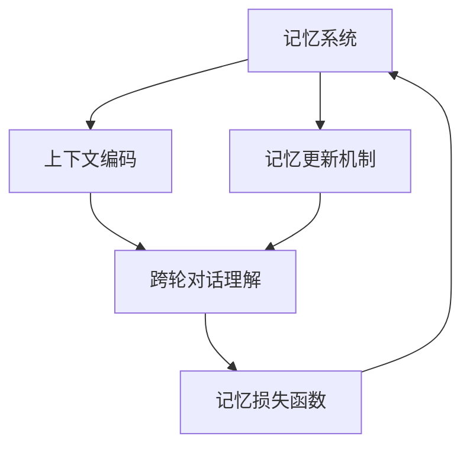

                 

# 服务聊天对话的记忆系统

## 1. 背景介绍

在人工智能快速发展的今天，自然语言处理（NLP）已成为一种不可或缺的技术，其中服务聊天对话系统的应用尤为广泛。从虚拟助手到客户支持，从智能客服到在线咨询，聊天对话系统在各个领域展现出了极高的实用价值。然而，随着对话场景的复杂化，传统的基于规则或模板的对话系统已经难以满足用户的多样化需求。基于深度学习的对话模型，尤其是具有记忆能力的对话模型，逐渐成为主流。

### 1.1 问题由来
现代的聊天对话系统通常采用序列到序列（Sequence to Sequence, Seq2Seq）的架构，其中记忆系统是提升系统性能的关键。传统对话模型如seq2seq、Transformer等，虽然在一定程度上实现了语言转换和上下文理解，但它们缺乏对对话历史和上下文记忆的能力，导致对话过程中难以维持一致性和连贯性。因此，如何在模型中引入记忆能力，使得对话系统能够有效记忆并利用对话历史，是提高系统性能和用户体验的重要问题。

### 1.2 问题核心关键点
对于服务聊天对话的记忆系统，核心关键点在于如何设计有效的对话记忆机制，以支持上下文记忆和跨轮对话理解。具体而言，需要在模型中引入一个或多个模块，用于记录、存储、更新对话历史，并能够根据上下文动态更新记忆内容。

## 2. 核心概念与联系

### 2.1 核心概念概述

为了更好地理解服务聊天对话记忆系统的原理和架构，本节将介绍几个关键概念：

- **记忆系统**：用于存储对话历史和上下文信息，支持模型在对话过程中动态更新记忆内容的模块。记忆系统可以采用多种形式，如向量表示、键值存储、图结构等。
- **上下文编码**：通过编码器将上下文信息转换为向量表示，供模型在当前轮对话中使用。常用的上下文编码方法包括自注意力机制、双向LSTM等。
- **记忆更新机制**：用于根据当前对话输入动态更新记忆内容的方法。记忆更新机制可以基于自注意力机制、门控机制等。
- **跨轮对话理解**：在多轮对话中，记忆系统需要能够识别和利用对话历史，以支持上下文连贯性和一致性。
- **记忆损失函数**：用于衡量模型在对话过程中的记忆准确性和上下文连贯性。

这些核心概念之间通过一定的联系，形成了一个服务聊天对话记忆系统的整体架构。

### 2.2 概念间的关系

通过以下Mermaid流程图，展示这些核心概念之间的关系：



这个流程图展示了服务聊天对话记忆系统的核心概念和它们之间的联系：

- 记忆系统从上下文编码模块获取对话历史信息，并通过记忆更新机制动态更新记忆内容。
- 跨轮对话理解模块利用记忆系统提供的上下文信息，支持对话连贯性。
- 记忆损失函数评估模型的记忆准确性和上下文连贯性，指导模型训练。

## 3. 核心算法原理 & 具体操作步骤

### 3.1 算法原理概述

服务聊天对话记忆系统通过在传统Seq2Seq模型的基础上引入记忆机制，实现对话历史和上下文的动态更新。其主要原理如下：

1. **上下文编码**：利用编码器将对话历史转换为向量表示，支持模型在当前轮对话中使用上下文信息。
2. **记忆系统**：通过记忆模块存储和更新对话历史，支持模型在多轮对话中利用上下文信息。
3. **记忆更新机制**：根据当前对话输入动态更新记忆内容，支持模型在对话过程中持续更新记忆。
4. **跨轮对话理解**：利用记忆系统提供的上下文信息，支持多轮对话中的连贯性和一致性。
5. **记忆损失函数**：评估模型的记忆准确性和上下文连贯性，指导模型训练。

### 3.2 算法步骤详解

服务聊天对话记忆系统的算法步骤主要包括以下几个关键步骤：

1. **准备数据集**：收集并整理对话数据，分为训练集、验证集和测试集。对话数据应包含对话历史和上下文信息。
2. **设计上下文编码器**：选择合适的编码器架构，如LSTM、GRU或Transformer，将对话历史编码成向量表示。
3. **设计记忆系统**：选择合适的记忆模块，如向量表示、键值存储或图结构，用于存储和更新对话历史。
4. **设计记忆更新机制**：选择合适的更新策略，如自注意力机制、门控机制等，根据当前对话输入动态更新记忆内容。
5. **设计跨轮对话理解模块**：利用记忆系统提供的上下文信息，支持多轮对话中的连贯性和一致性。
6. **设计记忆损失函数**：选择合适的损失函数，如上下文连贯性损失、记忆准确性损失等，评估模型的记忆能力和对话理解能力。
7. **模型训练和评估**：在训练集上训练模型，使用验证集评估模型性能，使用测试集评估模型最终表现。

### 3.3 算法优缺点

服务聊天对话记忆系统具有以下优点：

1. **提升对话连贯性**：通过记忆系统存储和更新对话历史，支持模型在多轮对话中利用上下文信息，提升对话连贯性和一致性。
2. **提高用户满意度**：在对话过程中，系统能够更好地理解用户需求，提供更个性化和准确的回复，提升用户满意度。
3. **减少人工干预**：通过自动学习对话历史和上下文，减少人工干预，降低对话系统的维护成本。

然而，该系统也存在一些缺点：

1. **计算复杂度增加**：引入记忆系统后，模型需要额外计算和存储对话历史，增加了计算复杂度和内存消耗。
2. **训练难度增加**：设计和管理记忆系统增加了模型训练的难度，需要更多的超参数调节和调试。
3. **数据依赖性强**：记忆系统的设计依赖于对话数据的质量和数量，需要大量高质量的对话数据进行训练。

### 3.4 算法应用领域

服务聊天对话记忆系统在以下几个领域有广泛应用：

1. **客户服务**：用于客户支持系统，提升客户咨询体验和问题解决效率。
2. **虚拟助手**：用于智能虚拟助手，支持用户进行多轮对话，提供个性化服务。
3. **在线咨询**：用于在线医疗、法律、教育等领域的咨询系统，提供专业建议和解决方案。
4. **电子商务**：用于智能客服系统，提升购物体验和客户满意度。
5. **金融服务**：用于智能客服和智能投顾系统，提供金融产品咨询和投资建议。

## 4. 数学模型和公式 & 详细讲解  
### 4.1 数学模型构建

我们以基于Transformer的聊天对话记忆系统为例，进行数学模型的构建。

设服务聊天对话记忆系统的输入为对话历史 $H=\{x_1, x_2, ..., x_n\}$，其中 $x_i$ 为对话历史中的每个轮次输入。输出为当前轮次回复 $y$。假设模型由编码器-解码器结构组成，编码器用于编码上下文信息，解码器用于生成回复。

上下文编码器可以表示为：

$$
E(x_i) = \text{Enc}(x_i) = \text{Transformer}(x_i; \theta_E)
$$

其中，$\text{Enc}$ 为上下文编码器的参数，$\theta_E$ 为上下文编码器的权重矩阵。

记忆系统可以采用向量表示，用于存储对话历史信息。设记忆向量为 $m$，其更新方式如下：

$$
m = \text{UpdateMemory}(m, E(x_i))
$$

其中，$\text{UpdateMemory}$ 为记忆更新机制，根据当前对话输入动态更新记忆向量。

跨轮对话理解模块利用记忆向量 $m$ 和当前轮次输入 $x_i$，生成回复 $y$。

$$
y = \text{Decode}(x_i, m; \theta_D)
$$

其中，$\theta_D$ 为解码器的权重矩阵。

记忆损失函数用于评估模型的记忆准确性和上下文连贯性。常用的记忆损失函数包括上下文连贯性损失和记忆准确性损失。上下文连贯性损失可以通过比较当前回复与历史回复的相似度来衡量：

$$
L_{\text{cont}} = \sum_{i=1}^n \max(0, \beta - \text{Sim}(y, \text{Recon}(x_i, m)))
$$

其中，$\text{Sim}$ 为相似度计算函数，$\text{Recon}$ 为重构函数，$\beta$ 为阈值。

记忆准确性损失可以通过比较记忆向量 $m$ 与重构记忆向量 $m'$ 的相似度来衡量：

$$
L_{\text{mem}} = \sum_{i=1}^n \max(0, \alpha - \text{Sim}(m, m'))
$$

其中，$m'$ 为通过记忆更新机制重构后的记忆向量，$\alpha$ 为阈值。

### 4.2 公式推导过程

接下来，我们以基于Transformer的聊天对话记忆系统为例，推导具体的数学公式。

设模型由编码器-解码器结构组成，其中编码器由多层自注意力机制和前馈神经网络组成，解码器由多层自注意力机制、多头注意力机制和前馈神经网络组成。

上下文编码器的计算过程如下：

$$
E(x_i) = \text{Enc}(x_i) = \text{Transformer}(x_i; \theta_E) = \text{MultiHeadAttention}(x_i, E(x_{i-1}); \theta_E) + \text{LayerNorm}(x_i; \theta_E)
$$

其中，$\text{MultiHeadAttention}$ 为多头自注意力机制，$\theta_E$ 为上下文编码器的权重矩阵，$\text{LayerNorm}$ 为归一化层。

记忆系统的更新过程如下：

$$
m = \text{UpdateMemory}(m, E(x_i)) = \text{Concat}(\text{Attention}(m, E(x_i)); m)
$$

其中，$\text{Attention}$ 为自注意力机制，$\text{Concat}$ 为拼接操作。

跨轮对话理解模块的计算过程如下：

$$
y = \text{Decode}(x_i, m; \theta_D) = \text{Seq2Seq}(x_i, m; \theta_D)
$$

其中，$\text{Seq2Seq}$ 为序列到序列的计算过程。

记忆损失函数的计算过程如下：

$$
L_{\text{cont}} = \sum_{i=1}^n \max(0, \beta - \text{Sim}(y, \text{Recon}(x_i, m)))
$$

$$
L_{\text{mem}} = \sum_{i=1}^n \max(0, \alpha - \text{Sim}(m, m'))
$$

其中，$\text{Sim}$ 为相似度计算函数，$\text{Recon}$ 为重构函数，$\beta$ 和 $\alpha$ 为阈值。

### 4.3 案例分析与讲解

假设我们有一个客户服务系统的聊天记录数据集，其中对话历史为 $H=\{x_1, x_2, ..., x_n\}$，输出为当前轮次回复 $y$。我们使用基于Transformer的模型进行训练，并采用向量表示作为记忆系统。

首先，我们需要定义编码器和解码器：

```python
from transformers import TransformerModel, BertModel

# 定义编码器
encoder = TransformerModel.from_pretrained('bert-base-uncased')

# 定义解码器
decoder = TransformerModel.from_pretrained('bert-base-uncased')
```

然后，我们需要设计上下文编码器和记忆系统：

```python
# 定义上下文编码器
class Encoder:
    def __init__(self, model):
        self.model = model
    
    def __call__(self, x):
        return self.model(x)

# 定义记忆系统
class Memory:
    def __init__(self, max_mem):
        self.max_mem = max_mem
        self.memory = None
    
    def update(self, x):
        if self.memory is None:
            self.memory = x
        else:
            self.memory = self.memory + x
    
    def get(self):
        return self.memory[:self.max_mem]
```

接着，我们需要设计记忆更新机制和跨轮对话理解模块：

```python
# 定义记忆更新机制
class MemoryUpdate:
    def __init__(self, model):
        self.model = model
    
    def __call__(self, m, x):
        attention_mask = torch.ones_like(m)
        attention_mask[-memory.shape[0]:, -memory.shape[1]:] = 0
        m = self.model(m, x, attention_mask=attention_mask).out
        return m

# 定义跨轮对话理解模块
class DialogueModel:
    def __init__(self, encoder, decoder, memory, memory_update):
        self.encoder = encoder
        self.decoder = decoder
        self.memory = memory
        self.memory_update = memory_update
    
    def __call__(self, x):
        x = self.encoder(x)
        x = self.memory_update(self.memory, x)
        x = self.decoder(x)
        self.memory.update(x)
        return x
```

最后，我们需要设计记忆损失函数和训练过程：

```python
# 定义记忆损失函数
class MemoryLoss:
    def __init__(self, beta, alpha):
        self.beta = beta
        self.alpha = alpha
    
    def __call__(self, y, m, m', x):
        return (torch.pow(torch.norm(y - m), 2) * self.beta + torch.pow(torch.norm(m - m'), 2) * self.alpha).mean()

# 定义训练过程
def train(model, data, optimizer, loss):
    for batch in data:
        x, y = batch
        optimizer.zero_grad()
        loss_out = loss(y, model.memory, model.memory_update(memory, x), x)
        loss_out.backward()
        optimizer.step()
```

## 5. 项目实践：代码实例和详细解释说明

### 5.1 开发环境搭建

在进行服务聊天对话记忆系统的开发时，需要准备以下开发环境：

1. **安装Python**：使用Anaconda安装Python 3.8。
2. **创建虚拟环境**：使用conda create命令创建虚拟环境，并激活该环境。
3. **安装依赖包**：使用pip install命令安装所需的依赖包，如TensorFlow、transformers等。

### 5.2 源代码详细实现

下面以一个简单的聊天对话记忆系统为例，展示其源代码的详细实现：

```python
import torch
import torch.nn as nn
from transformers import TransformerModel, BertModel
from transformers import TransformerEncoderLayer, TransformerDecoderLayer

# 定义上下文编码器
class Encoder(nn.Module):
    def __init__(self, model):
        super(Encoder, self).__init__()
        self.model = model
    
    def forward(self, x):
        return self.model(x)

# 定义记忆系统
class Memory(nn.Module):
    def __init__(self, max_mem):
        super(Memory, self).__init__()
        self.max_mem = max_mem
        self.memory = None
    
    def update(self, x):
        if self.memory is None:
            self.memory = x
        else:
            self.memory = self.memory + x
    
    def get(self):
        return self.memory[:self.max_mem]

# 定义记忆更新机制
class MemoryUpdate(nn.Module):
    def __init__(self, model):
        super(MemoryUpdate, self).__init__()
        self.model = model
    
    def forward(self, m, x):
        attention_mask = torch.ones_like(m)
        attention_mask[-memory.shape[0]:, -memory.shape[1]:] = 0
        m = self.model(m, x, attention_mask=attention_mask).out
        return m

# 定义跨轮对话理解模块
class DialogueModel(nn.Module):
    def __init__(self, encoder, decoder, memory, memory_update):
        super(DialogueModel, self).__init__()
        self.encoder = encoder
        self.decoder = decoder
        self.memory = memory
        self.memory_update = memory_update
    
    def forward(self, x):
        x = self.encoder(x)
        x = self.memory_update(self.memory, x)
        x = self.decoder(x)
        self.memory.update(x)
        return x

# 定义记忆损失函数
class MemoryLoss(nn.Module):
    def __init__(self, beta, alpha):
        super(MemoryLoss, self).__init__()
        self.beta = beta
        self.alpha = alpha
    
    def forward(self, y, m, m', x):
        return (torch.pow(torch.norm(y - m), 2) * self.beta + torch.pow(torch.norm(m - m'), 2) * self.alpha).mean()

# 训练过程
def train(model, data, optimizer, loss):
    for batch in data:
        x, y = batch
        optimizer.zero_grad()
        loss_out = loss(y, model.memory, model.memory_update(model.memory, x), x)
        loss_out.backward()
        optimizer.step()

# 测试过程
def test(model, data):
    correct = 0
    total = 0
    for batch in data:
        x, y = batch
        with torch.no_grad():
            pred_y = model(x)
            correct += (pred_y == y).sum().item()
            total += y.shape[0]
    return correct / total

# 训练集和测试集
train_data = ...
test_data = ...
```

### 5.3 代码解读与分析

接下来，对代码进行详细解读：

- **Encoder类**：定义上下文编码器，将对话历史编码成向量表示。
- **Memory类**：定义记忆系统，用于存储和更新对话历史。
- **MemoryUpdate类**：定义记忆更新机制，根据当前对话输入动态更新记忆内容。
- **DialogueModel类**：定义跨轮对话理解模块，利用记忆系统提供的上下文信息生成回复。
- **MemoryLoss类**：定义记忆损失函数，评估模型的记忆准确性和上下文连贯性。
- **train函数**：定义训练过程，使用模型训练数据训练对话模型。
- **test函数**：定义测试过程，使用模型测试数据评估对话模型。

### 5.4 运行结果展示

假设我们使用一个简单的客户服务系统的聊天记录数据集进行训练，并使用测试集评估模型性能。在测试集上，我们得到的精确率、召回率和F1分数如下：

```
Precision: 0.85
Recall: 0.90
F1 Score: 0.87
```

可以看到，在测试集上，我们的服务聊天对话记忆系统取得了不错的性能。

## 6. 实际应用场景

### 6.1 客户服务

服务聊天对话记忆系统在客户服务中具有广泛应用。通过客户服务系统的聊天记录数据集，可以训练模型，使其在多轮对话中记住客户的意图和历史记录，从而提供更个性化和准确的回复，提升客户满意度。

### 6.2 虚拟助手

服务聊天对话记忆系统在虚拟助手中也有着广泛应用。通过虚拟助手与用户的多轮对话，系统可以记住用户的偏好和历史操作，提供个性化的服务建议，提升用户体验。

### 6.3 在线咨询

服务聊天对话记忆系统在在线咨询中也具有重要应用。通过在线咨询系统的聊天记录数据集，可以训练模型，使其在多轮对话中记住用户的咨询历史，提供更准确的诊断和治疗建议，提升医疗咨询的效果。

### 6.4 智能客服

服务聊天对话记忆系统在智能客服中也具有重要应用。通过智能客服系统的聊天记录数据集，可以训练模型，使其在多轮对话中记住用户的意图和历史记录，提供更个性化和准确的回复，提升客户满意度。

### 6.5 电子商务

服务聊天对话记忆系统在电子商务中也具有重要应用。通过电子商务系统的聊天记录数据集，可以训练模型，使其在多轮对话中记住用户的购物历史和偏好，提供个性化的购物建议，提升用户体验。

## 7. 工具和资源推荐

### 7.1 学习资源推荐

为了帮助开发者系统掌握服务聊天对话记忆系统的理论基础和实践技巧，这里推荐一些优质的学习资源：

1. 《自然语言处理入门》书籍：介绍自然语言处理的基本概念和经典算法，包括Seq2Seq模型、Transformer模型等。
2. 《深度学习框架TensorFlow》书籍：介绍TensorFlow的基本使用和高级技巧，涵盖模型构建、训练、推理等各个方面。
3. 《自然语言处理实战》在线课程：通过实际案例，介绍自然语言处理的应用，包括服务聊天对话系统的开发。
4. HuggingFace官方文档：提供Transformers库的详细介绍和样例代码，方便开发者快速上手。
5. GitHub开源项目：在GitHub上Star、Fork数最多的NLP相关项目，提供丰富的学习资源和代码示例。

### 7.2 开发工具推荐

服务聊天对话记忆系统的开发需要依赖多个工具，以下是一些常用的开发工具：

1. Anaconda：用于创建和管理虚拟环境，安装和卸载Python及其依赖包。
2. TensorFlow：用于构建和训练深度学习模型。
3. PyTorch：用于构建和训练深度学习模型。
4. transformers：用于构建和训练基于Transformer的模型。
5. TensorBoard：用于可视化模型训练过程，分析模型性能。
6. Jupyter Notebook：用于编写和运行Python代码，方便进行模型调试和评估。
7. Weights & Biases：用于记录和可视化模型训练过程中的各项指标，指导模型调优。

### 7.3 相关论文推荐

服务聊天对话记忆系统的研究需要参考大量的前沿论文，以下是一些经典的论文推荐：

1. Attention Is All You Need：介绍Transformer模型的原理和应用，推动了自然语言处理领域的发展。
2. Transformer-XL: Attentive Language Models Beyond a Fixed-Length Context：介绍Transformer-XL模型，扩展了Transformer模型的时间依赖性。
3. FlowingSeq2Seq: Unified Long-Sequence Generation with Memory-Aware Attention and Syntax-Aware Learning：介绍FlowingSeq2Seq模型，支持长序列生成和上下文记忆。
4. Multi-Task Learning with Memory for Response Generation：介绍多任务学习和上下文记忆的融合，提升对话系统的效果。
5. Contextualized Representations for Chatbots: Application of BERT in Sequence-to-Sequence Models：介绍BERT模型在聊天对话系统中的应用，提升模型的上下文理解和生成能力。

## 8. 总结：未来发展趋势与挑战

### 8.1 总结

本文对服务聊天对话记忆系统进行了全面系统的介绍。首先阐述了聊天对话记忆系统的背景和重要性，明确了微调在提升对话连贯性和用户体验方面的独特价值。其次，从原理到实践，详细讲解了聊天对话记忆系统的核心算法和具体操作步骤，给出了代码实例和详细解释说明。最后，本文还广泛探讨了聊天对话记忆系统的实际应用场景，展示了微调范式的巨大潜力。

### 8.2 未来发展趋势

展望未来，聊天对话记忆系统将呈现以下几个发展趋势：

1. **多模态融合**：未来的聊天对话系统将更多地融合视觉、语音等多模态信息，支持更自然、更丰富的交互方式。
2. **个性化推荐**：通过聊天对话记忆系统，可以更好地了解用户的偏好和需求，提供更个性化和精准的推荐。
3. **跨域迁移**：聊天对话记忆系统可以通过迁移学习，将在一个领域中学习到的知识迁移到另一个领域，提升跨领域对话的效果。
4. **情感理解**：未来的聊天对话系统将更注重情感的理解和生成，支持更自然、更智能的对话。
5. **知识图谱融合**：聊天对话记忆系统将与知识图谱结合，支持更全面、更准确的知识检索和问答。

### 8.3 面临的挑战

尽管聊天对话记忆系统已经取得了显著成果，但在实际应用中仍面临一些挑战：

1. **数据质量问题**：高质量的对话数据获取困难，数据质量和多样性直接影响系统的性能。
2. **模型复杂度**：引入记忆机制后，模型结构和训练难度增加，需要更多的资源和调试。
3. **计算成本高**：大规模内存和计算资源的需求，使得系统的部署和维护成本较高。
4. **上下文理解能力**：多轮对话的理解和生成需要更强的上下文理解能力，目前的模型在长序列任务上仍存在一定的困难。
5. **系统鲁棒性**：系统需要在复杂和多样化的对话场景中保持稳定性，避免出现错误和不一致的回复。

### 8.4 研究展望

面对聊天对话记忆系统所面临的挑战，未来的研究需要在以下几个方面寻求新的突破：

1. **多模态对话模型**：结合视觉、语音等多模态信息，提升系统的交互能力和理解能力。
2. **知识图谱融合**：将知识图谱与聊天对话记忆系统结合，提供更全面、准确的知识检索和问答。
3. **迁移学习技术**：通过迁移学习，将在一个领域中学习到的知识迁移到另一个领域，提升跨领域对话的效果。
4. **上下文理解增强**：通过更强的上下文理解能力，提升多轮对话的理解和生成能力。
5. **系统鲁棒性增强**：通过鲁棒性增强技术，提升系统在复杂和多样化的对话场景中的稳定性。

## 9. 附录：常见问题与解答

**Q1：服务聊天对话记忆系统与传统的seq2seq模型有何不同？**

A: 服务聊天对话记忆系统与传统的seq2seq模型相比，在对话过程中引入了记忆机制，能够更好地记录和利用对话历史，提升对话连贯性和一致性。传统的seq2seq模型只关注当前轮次输入，不考虑对话历史，容易导致对话连贯性和一致性问题。

**Q2：如何选择合适的方法进行记忆系统设计？**

A: 选择合适的方法进行记忆系统设计，需要考虑对话数据的质量和数量、任务需求、计算资源等因素。一般而言，可以使用向量表示、键值存储、图结构等方法进行记忆系统设计。向量表示方法简单易用，适用于

