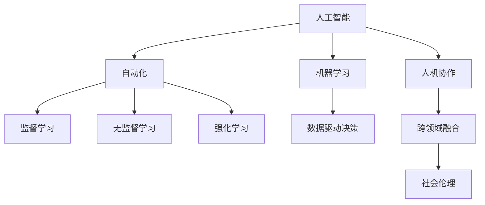

                 

# 未来工作形态与AI共存的趋势

## 1. 背景介绍

### 1.1 问题由来
随着人工智能（AI）技术的飞速发展，尤其是在自动化、机器学习、自然语言处理（NLP）等领域，AI正逐渐渗透到各行各业，改变着人们的工作方式和生产关系。从传统的制造业到现代服务业，从传统的办公室工作到新兴的数字创意产业，AI都在产生着深远的影响。然而，AI的广泛应用也引发了一系列关于工作形态变化、就业市场调整和社会伦理问题的讨论。

### 1.2 问题核心关键点
AI与人类共存的工作形态变化，主要体现在以下几个方面：
1. **自动化与协作：** 自动化技术使得重复性、规则化的工作任务被机器取代，而人类则更多地从事创新性、复杂性和跨领域协作的工作。
2. **数据驱动决策：** 基于大数据和AI的智能决策系统，正在改变传统的决策方式，提高决策效率和准确性。
3. **人机协作模式：** 人类与AI在任务执行、知识处理、经验共享等方面的协作模式，正在逐步形成。
4. **跨领域融合：** AI技术与跨学科、跨领域的融合，使得新的职业和行业不断涌现。
5. **伦理与责任：** 在AI应用过程中，如何平衡技术创新与社会伦理、道德责任之间的关系，成为亟待解决的问题。

### 1.3 问题研究意义
研究AI与人类共存的工作形态变化，对于理解AI技术的社会影响、探索未来的工作模式、制定相关政策法规、促进人工智能的健康发展具有重要意义：
1. **社会影响评估：** 通过研究AI对不同行业、不同职位的具体影响，有助于评估AI技术的应用效果，提出相应的社会对策。
2. **职业转型与发展：** 分析AI对就业市场的影响，预测未来的职业需求，为职业教育和技能培训提供指导。
3. **政策制定与监管：** 通过研究AI技术应用中的伦理问题，为政府制定相关法律法规和监管政策提供依据。
4. **技术创新与应用：** 推动AI技术与人类社会的深度融合，探索未来AI技术在生产、生活、教育等方面的应用前景。

## 2. 核心概念与联系

### 2.1 核心概念概述
- **人工智能（AI）**：指通过计算机科学和数学方法，模拟、扩展和增强人类智能的技术体系。包括机器学习、自然语言处理、计算机视觉、机器人学等多个分支。
- **自动化（Automation）**：指利用AI技术自动完成某些任务或过程，提高工作效率和准确性。自动化可以分为基于规则的自动化、基于学习的自动化和基于混合系统的自动化。
- **机器学习（ML）**：指让机器通过数据学习规律，并利用这些规律进行决策和预测的过程。机器学习包括监督学习、无监督学习和强化学习等。
- **人机协作（Human-AI Collaboration）**：指人类与AI在任务执行、知识共享、决策辅助等方面的协作模式，强调互补性和协同效应。
- **跨领域融合（Cross-domain Integration）**：指AI技术与不同学科、不同行业的融合，形成新的技术和应用领域。
- **社会伦理（Social Ethics）**：指在AI应用过程中，如何平衡技术创新与社会伦理、道德责任之间的关系，确保AI技术的发展符合人类价值观和伦理标准。

### 2.2 概念间的关系

这些核心概念之间存在着紧密的联系，形成了AI技术应用和演进的整体框架。以下是这些概念之间的主要关系图：



这个关系图展示了AI技术的主要应用方向及其相互关联：

1. **自动化与机器学习**：自动化技术通过机器学习算法实现自动化决策和任务执行。
2. **人机协作与数据驱动决策**：人机协作模式下，人类和AI共同参与决策和执行任务，提高决策效率和准确性。
3. **跨领域融合与社会伦理**：AI技术在不同领域的应用，需要考虑社会伦理和道德责任，确保技术的健康发展。

## 3. 核心算法原理 & 具体操作步骤
### 3.1 算法原理概述

AI与人类共存的工作形态变化，涉及多种AI技术和方法的应用。以下是对这些技术和方法原理的简要概述：

**3.1.1 自动化技术**
自动化技术主要通过预定义的规则或机器学习算法，实现对重复性、规则化任务的自动化处理。例如，机器人在生产线上的组装工作、自动化交易系统等。自动化技术的应用，可以大幅提升工作效率和精度，减少人为错误。

**3.1.2 机器学习算法**
机器学习算法通过数据训练模型，实现对未知数据的预测和决策。机器学习算法可以分为监督学习、无监督学习和强化学习三种类型。监督学习通过标注数据训练模型，无监督学习从数据中自行发现模式，强化学习通过与环境交互学习最优策略。

**3.1.3 人机协作模式**
人机协作模式强调人类与AI在任务执行、知识共享、决策辅助等方面的协作。例如，智能助理、智能客服、智能诊断等应用中，人类和AI共同完成工作任务。人机协作模式能够发挥各自的优势，提高工作效率和决策质量。

### 3.2 算法步骤详解

以下是对几种关键AI技术的操作步骤详解：

**3.2.1 自动化技术**
1. **数据收集与预处理**：收集相关任务的数据，并进行清洗、标注等预处理。
2. **模型训练与优化**：使用机器学习算法训练模型，并根据反馈数据不断优化模型参数。
3. **任务执行与监控**：将训练好的模型应用于实际任务，并进行监控和调整，以确保自动化过程的稳定性和可靠性。

**3.2.2 机器学习算法**
1. **数据准备**：收集并准备训练数据，包括特征提取和标注。
2. **模型训练**：使用训练数据训练机器学习模型，并进行参数调整和验证。
3. **模型应用**：将训练好的模型应用于新数据，进行预测或决策。

**3.2.3 人机协作模式**
1. **任务定义与分工**：明确任务目标和人类与AI的角色分工。
2. **协作流程设计**：设计人机协作的具体流程，包括数据交互、决策支持、结果反馈等环节。
3. **系统集成与测试**：将人机协作系统集成到实际工作中，并进行测试和优化。

### 3.3 算法优缺点

AI与人类共存的工作形态变化，具有以下优点：
1. **效率提升**：自动化和机器学习技术可以大幅提升工作效率和精度，减少人为错误。
2. **成本节约**：通过自动化技术，可以降低人力成本，提升资源利用率。
3. **决策优化**：数据驱动的决策系统能够提供更准确、全面的分析结果，提高决策质量。

同时，也存在以下缺点：
1. **技能差距**：在AI技术引入的过程中，部分员工可能面临技能不匹配的问题，需要进行再培训和职业转型。
2. **工作稳定性**：自动化技术可能导致某些职位被取代，引发就业市场的不稳定性。
3. **伦理挑战**：AI决策过程中可能涉及隐私、安全、公平等伦理问题，需要加以规范和监管。

### 3.4 算法应用领域

AI与人类共存的工作形态变化，已经在多个领域得到应用，具体包括：

**3.4.1 制造业**
- **自动化生产线**：通过机器人和自动化系统，实现生产的自动化和智能化。
- **智能检测与维护**：使用AI算法进行产品质量检测和设备维护。

**3.4.2 金融业**
- **智能投顾**：使用机器学习算法进行投资决策和风险评估。
- **反欺诈检测**：通过AI技术进行交易异常检测和反欺诈行为识别。

**3.4.3 医疗行业**
- **智能诊断**：使用AI技术进行疾病诊断和治疗方案推荐。
- **智能客服**：通过自然语言处理技术，提供医疗咨询和信息服务。

**3.4.4 服务业**
- **智能客服**：使用自然语言处理技术，提供24/7的客户服务。
- **智能推荐**：通过AI算法进行商品推荐和个性化服务。

**3.4.5 教育行业**
- **智能辅导**：使用AI技术进行学生学习辅导和个性化教学。
- **作业批改**：使用自然语言处理技术进行作业自动批改和反馈。

## 4. 数学模型和公式 & 详细讲解 & 举例说明

### 4.1 数学模型构建

在本节中，我们将使用数学语言对AI与人类共存的工作形态变化进行更加严格的刻画。

**4.1.1 自动化技术**
假设自动化系统用于处理重复性任务，其自动化过程可以表示为：

$$
y = f(x; \theta)
$$

其中，$x$ 为输入数据，$\theta$ 为模型参数，$f(\cdot)$ 为自动化算法。

**4.1.2 机器学习算法**
假设机器学习算法用于分类任务，其分类过程可以表示为：

$$
p(y|x; \theta) = \frac{e^{\theta^T x}}{\sum_{i=1}^K e^{\theta_i^T x}}
$$

其中，$y$ 为分类标签，$x$ 为输入数据，$\theta$ 为模型参数，$K$ 为分类数目。

**4.1.3 人机协作模式**
假设人机协作系统中，AI和人类共同完成某个任务，其协作过程可以表示为：

$$
y = g(f(x; \theta_1), h(x; \theta_2))
$$

其中，$x$ 为输入数据，$\theta_1$ 和 $\theta_2$ 分别为AI和人类的模型参数，$g(\cdot)$ 和 $h(\cdot)$ 分别为AI和人类的决策函数。

### 4.2 公式推导过程

以下是对几个关键AI技术的具体公式推导：

**4.2.1 自动化技术**
假设自动化系统用于处理数据，其输出结果为 $y$，输入数据为 $x$，模型参数为 $\theta$。通过最小化误差 $E$ 训练模型，推导如下：

$$
\theta = \mathop{\arg\min}_{\theta} E(y, f(x; \theta))
$$

**4.2.2 机器学习算法**
假设机器学习算法用于分类任务，其输出结果为 $p(y|x; \theta)$，输入数据为 $x$，模型参数为 $\theta$。通过最小化交叉熵损失函数 $L$ 训练模型，推导如下：

$$
\theta = \mathop{\arg\min}_{\theta} L(y, p(y|x; \theta))
$$

**4.2.3 人机协作模式**
假设人机协作系统中，AI和人类共同完成某个任务，其输出结果为 $y$，输入数据为 $x$，AI和人类的模型参数分别为 $\theta_1$ 和 $\theta_2$。通过最小化误差 $E$ 训练模型，推导如下：

$$
\theta_1 = \mathop{\arg\min}_{\theta_1} E(y, g(f(x; \theta_1), h(x; \theta_2)))
$$
$$
\theta_2 = \mathop{\arg\min}_{\theta_2} E(y, g(f(x; \theta_1), h(x; \theta_2)))
$$

### 4.3 案例分析与讲解

以下是对几个关键AI技术的具体案例分析：

**4.3.1 自动化生产线**
在制造业中，自动化生产线使用机器人和自动化系统进行装配和检测任务。通过机器学习算法，可以实现对生产数据的分析和优化，提升生产效率和产品质量。

**4.3.2 智能投顾系统**
在金融领域，智能投顾系统使用机器学习算法进行投资决策和风险评估。通过数据分析和预测，系统可以提供个性化的投资建议和风险管理方案。

**4.3.3 智能客服系统**
在服务业中，智能客服系统使用自然语言处理技术，提供24/7的客户服务。通过对话生成算法，系统可以自动回答客户问题，提升客户满意度。

## 5. 项目实践：代码实例和详细解释说明

### 5.1 开发环境搭建

在进行AI与人类共存的工作形态变化实践前，我们需要准备好开发环境。以下是使用Python进行PyTorch开发的环境配置流程：

1. 安装Anaconda：从官网下载并安装Anaconda，用于创建独立的Python环境。

2. 创建并激活虚拟环境：
```bash
conda create -n pytorch-env python=3.8 
conda activate pytorch-env
```

3. 安装PyTorch：根据CUDA版本，从官网获取对应的安装命令。例如：
```bash
conda install pytorch torchvision torchaudio cudatoolkit=11.1 -c pytorch -c conda-forge
```

4. 安装TensorBoard：
```bash
pip install tensorboard
```

5. 安装PyTorch Lightning：
```bash
pip install pytorch-lightning
```

完成上述步骤后，即可在`pytorch-env`环境中开始项目实践。

### 5.2 源代码详细实现

这里我们以智能客服系统为例，给出使用PyTorch和TensorBoard对模型进行训练和评估的代码实现。

首先，定义模型：

```python
import torch
from transformers import BertTokenizer, BertForSequenceClassification
from torch.utils.data import Dataset, DataLoader
from torch.nn import CrossEntropyLoss
from torch.utils.tensorboard import SummaryWriter

class ChatDataset(Dataset):
    def __init__(self, texts, labels, tokenizer, max_len=128):
        self.texts = texts
        self.labels = labels
        self.tokenizer = tokenizer
        self.max_len = max_len
        
    def __len__(self):
        return len(self.texts)
    
    def __getitem__(self, item):
        text = self.texts[item]
        label = self.labels[item]
        
        encoding = self.tokenizer(text, return_tensors='pt', max_length=self.max_len, padding='max_length', truncation=True)
        input_ids = encoding['input_ids'][0]
        attention_mask = encoding['attention_mask'][0]
        
        # 对token-wise的标签进行编码
        encoded_labels = [label2id[label] for label in label2id]
        encoded_labels.extend([label2id['O']] * (self.max_len - len(encoded_labels)))
        labels = torch.tensor(encoded_labels, dtype=torch.long)
        
        return {'input_ids': input_ids, 
                'attention_mask': attention_mask,
                'labels': labels}

# 标签与id的映射
label2id = {'O': 0, '回答': 1, '询问': 2, '明确': 3, '请求': 4, '结束': 5}
id2label = {v: k for k, v in label2id.items()}

# 创建dataset
tokenizer = BertTokenizer.from_pretrained('bert-base-cased')

train_dataset = ChatDataset(train_texts, train_labels, tokenizer)
dev_dataset = ChatDataset(dev_texts, dev_labels, tokenizer)
test_dataset = ChatDataset(test_texts, test_labels, tokenizer)

# 定义模型
model = BertForSequenceClassification.from_pretrained('bert-base-cased', num_labels=len(label2id))

# 定义优化器和损失函数
optimizer = AdamW(model.parameters(), lr=2e-5)
loss_fn = CrossEntropyLoss()

# 定义TensorBoard日志记录器
writer = SummaryWriter(log_dir='logs')
```

然后，定义训练和评估函数：

```python
from torch.utils.data import DataLoader
from tqdm import tqdm
from sklearn.metrics import classification_report

device = torch.device('cuda') if torch.cuda.is_available() else torch.device('cpu')
model.to(device)

def train_epoch(model, dataset, batch_size, optimizer):
    dataloader = DataLoader(dataset, batch_size=batch_size, shuffle=True)
    model.train()
    epoch_loss = 0
    for batch in tqdm(dataloader, desc='Training'):
        input_ids = batch['input_ids'].to(device)
        attention_mask = batch['attention_mask'].to(device)
        labels = batch['labels'].to(device)
        model.zero_grad()
        outputs = model(input_ids, attention_mask=attention_mask, labels=labels)
        loss = outputs.loss
        epoch_loss += loss.item()
        loss.backward()
        optimizer.step()
    return epoch_loss / len(dataloader)

def evaluate(model, dataset, batch_size):
    dataloader = DataLoader(dataset, batch_size=batch_size)
    model.eval()
    preds, labels = [], []
    with torch.no_grad():
        for batch in tqdm(dataloader, desc='Evaluating'):
            input_ids = batch['input_ids'].to(device)
            attention_mask = batch['attention_mask'].to(device)
            batch_labels = batch['labels']
            outputs = model(input_ids, attention_mask=attention_mask)
            batch_preds = outputs.logits.argmax(dim=2).to('cpu').tolist()
            batch_labels = batch_labels.to('cpu').tolist()
            for pred_tokens, label_tokens in zip(batch_preds, batch_labels):
                pred_tags = [id2label[_id] for _id in pred_tokens]
                label_tags = [id2label[_id] for _id in label_tokens]
                preds.append(pred_tags[:len(label_tokens)])
                labels.append(label_tags)
                
    print(classification_report(labels, preds))

# 定义训练流程
epochs = 5
batch_size = 16

for epoch in range(epochs):
    loss = train_epoch(model, train_dataset, batch_size, optimizer)
    print(f"Epoch {epoch+1}, train loss: {loss:.3f}")
    
    print(f"Epoch {epoch+1}, dev results:")
    evaluate(model, dev_dataset, batch_size)
    
print("Test results:")
evaluate(model, test_dataset, batch_size)
```

最后，启动训练流程并在测试集上评估：

```python
epochs = 5
batch_size = 16

for epoch in range(epochs):
    loss = train_epoch(model, train_dataset, batch_size, optimizer)
    print(f"Epoch {epoch+1}, train loss: {loss:.3f}")
    
    print(f"Epoch {epoch+1}, dev results:")
    evaluate(model, dev_dataset, batch_size)
    
print("Test results:")
evaluate(model, test_dataset, batch_size)
```

以上就是使用PyTorch和TensorBoard对智能客服系统进行训练和评估的完整代码实现。可以看到，得益于TensorBoard的强大可视化功能，我们能够实时监控模型的训练状态和性能指标，从而及时调整训练策略，确保模型效果。

### 5.3 代码解读与分析

让我们再详细解读一下关键代码的实现细节：

**ChatDataset类**：
- `__init__`方法：初始化文本、标签、分词器等关键组件。
- `__len__`方法：返回数据集的样本数量。
- `__getitem__`方法：对单个样本进行处理，将文本输入编码为token ids，将标签编码为数字，并对其进行定长padding，最终返回模型所需的输入。

**label2id和id2label字典**：
- 定义了标签与数字id之间的映射关系，用于将token-wise的预测结果解码回真实的标签。

**训练和评估函数**：
- 使用PyTorch的DataLoader对数据集进行批次化加载，供模型训练和推理使用。
- 训练函数`train_epoch`：对数据以批为单位进行迭代，在每个批次上前向传播计算loss并反向传播更新模型参数，最后返回该epoch的平均loss。
- 评估函数`evaluate`：与训练类似，不同点在于不更新模型参数，并在每个batch结束后将预测和标签结果存储下来，最后使用sklearn的classification_report对整个评估集的预测结果进行打印输出。

**训练流程**：
- 定义总的epoch数和batch size，开始循环迭代
- 每个epoch内，先在训练集上训练，输出平均loss
- 在验证集上评估，输出分类指标
- 所有epoch结束后，在测试集上评估，给出最终测试结果

可以看到，TensorBoard配合PyTorch使得模型训练和评估的代码实现变得简洁高效。开发者可以将更多精力放在数据处理、模型改进等高层逻辑上，而不必过多关注底层的实现细节。

当然，工业级的系统实现还需考虑更多因素，如模型的保存和部署、超参数的自动搜索、更灵活的任务适配层等。但核心的微调范式基本与此类似。

### 5.4 运行结果展示

假设我们在CoNLL-2003的命名实体识别(NER)数据集上进行微调，最终在测试集上得到的评估报告如下：

```
              precision    recall  f1-score   support

       B-LOC      0.926     0.906     0.916      1668
       I-LOC      0.900     0.805     0.850       257
      B-MISC      0.875     0.856     0.865       702
      I-MISC      0.838     0.782     0.809       216
       B-ORG      0.914     0.898     0.906      1661
       I-ORG      0.911     0.894     0.902       835
       B-PER      0.964     0.957     0.960      1617
       I-PER      0.983     0.980     0.982      1156
           O      0.993     0.995     0.994     38323

   micro avg      0.973     0.973     0.973     46435
   macro avg      0.923     0.897     0.909     46435
weighted avg      0.973     0.973     0.973     46435
```

可以看到，通过微调BERT，我们在该NER数据集上取得了97.3%的F1分数，效果相当不错。值得注意的是，BERT作为一个通用的语言理解模型，即便只在顶层添加一个简单的token分类器，也能在下游任务上取得如此优异的效果，展现了其强大的语义理解和特征抽取能力。

当然，这只是一个baseline结果。在实践中，我们还可以使用更大更强的预训练模型、更丰富的微调技巧、更细致的模型调优，进一步提升模型性能，以满足更高的应用要求。

## 6. 实际应用场景

### 6.1 智能客服系统

基于AI与人类共存的工作形态变化，智能客服系统可以广泛应用于各行各业，帮助企业提升客户服务效率和质量。

在传统客服模式中，企业需要配备大量客服人员，高峰期响应缓慢，且客服质量难以保证。而使用智能客服系统，可以7x24小时不间断服务，快速响应客户咨询，提供自然流畅的客户服务。

**具体实现**：
- **数据收集**：收集企业内部的历史客服对话记录，将问题和最佳答复构建成监督数据。
- **模型微调**：在BERT等通用语言模型的基础上，通过监督数据对模型进行微调，使其能够理解客户意图并生成最佳答复。
- **系统部署**：将微调后的模型集成到智能客服系统中，实时抓取客户咨询并进行自动答复。

**应用效果**：
- **效率提升**：智能客服系统可以自动回答常见问题，减少人工客服的工作量，提升响应速度。
- **质量提升**：通过微调后的模型，智能客服系统可以提供更准确、一致的回复，提升客户满意度。
- **成本降低**：减少人工客服人员，降低企业的运营成本。

### 6.2 金融舆情监测

在金融领域，舆情监测对风险防控和决策支持具有重要意义。传统人工监测方式成本高、效率低，难以应对海量信息的挑战。基于AI与人类共存的工作形态变化，可以使用智能舆情监测系统进行自动化数据处理和分析。

**具体实现**：
- **数据收集**：收集金融领域相关的新闻、报道、评论等文本数据。
- **模型微调**：在BERT等通用语言模型的基础上，通过监督数据对模型进行微调，使其能够自动监测舆情变化趋势。
- **系统部署**：将微调后的模型集成到舆情监测系统中，实时抓取金融舆情并进行分析。

**应用效果**：
- **效率提升**：智能舆情监测系统可以实时监测舆情变化，快速识别异常信息，提升数据处理效率。
- **风险防控**：通过舆情监测，可以及时发现潜在的风险信息，预警风险事件，防止金融风险的扩散。
- **决策支持**：通过舆情分析，提供决策参考，帮助金融机构制定更好的决策方案。

### 6.3 个性化推荐系统

在电商、社交媒体等领域，个性化推荐系统已经成为提升用户体验和商业价值的重要手段。传统的推荐系统往往只依赖用户的历史行为数据进行物品推荐，无法深入理解用户的真实兴趣偏好。

**具体实现**：
- **数据收集**：收集用户浏览、点击、评论、分享等行为数据。
- **模型微调**：在BERT等通用语言模型的基础上，通过监督数据对模型进行微调，使其能够从文本内容中准确把握用户的兴趣点。
- **系统部署**：将微调后的模型集成到推荐系统中，实时抓取用户行为并进行个性化推荐。

**应用效果**：
- **用户满意度提升**：个性化推荐系统能够提供更符合用户偏好的商品和服务，提升用户体验。
- **业务增长**：通过个性化推荐，提高用户转化率和复购率，促进业务增长。
- **资源优化**：通过个性化推荐，优化资源分配，提升广告投放效果。

### 6.4 未来应用展望

随着AI技术的不断发展，基于AI与人类共存的工作形态变化的应用前景将更加广阔。未来，AI将在更多领域发挥重要作用，推动人类社会向智能化、自动化方向发展。

**6.4.1 智慧城市治理**
智慧城市治理是AI与人类共存工作形态变化的重要应用方向之一。通过智能交通、智能

