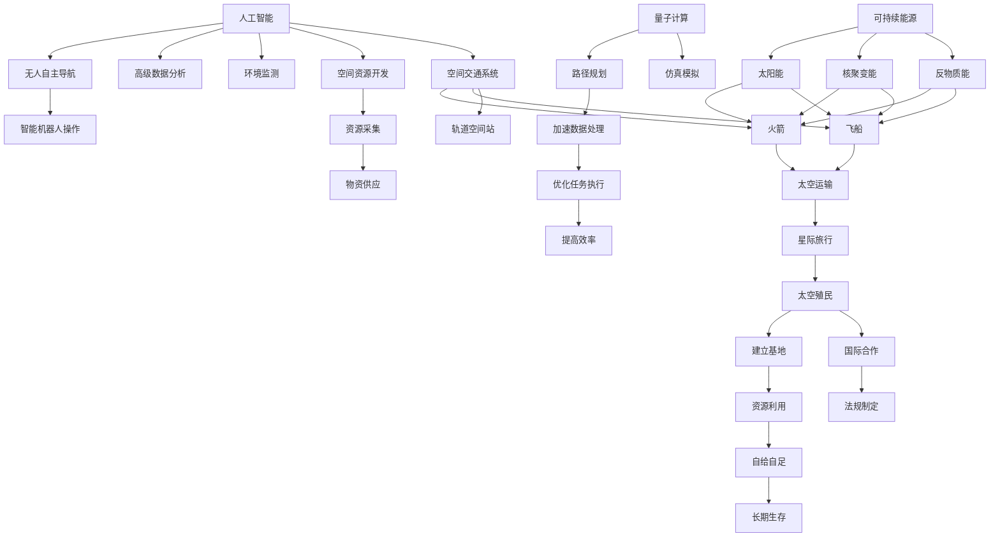

                 

# 未来的太空探索：2050年的星际旅行与殖民计划

> 关键词：太空探索,星际旅行,殖民计划,人工智能,量子计算,可持续能源,空间资源开发

## 1. 背景介绍

### 1.1 问题由来

随着人类对宇宙的好奇心和探索欲日益增强，星际旅行和太空殖民已经成为21世纪人类共同的梦想。从阿波罗登月到火星探测，从旅行者号星际飞行器到土星环绕器，人类对太空的探索已经走过了漫长的历程。然而，现有的技术手段和能源供应难以支持大规模的太空探索和长期殖民。

## 2. 核心概念与联系

### 2.1 核心概念概述

为了实现未来的星际旅行和太空殖民，需要整合和应用一系列的前沿技术。以下是涉及的核心概念：

- **人工智能(AI)**：人工智能是实现太空探索和殖民的核心驱动力之一。通过AI技术，可以实现无人自主导航、智能机器人操作、高级数据分析、环境监测等功能，大幅提高太空探索的效率和安全性。
- **量子计算(Quantum Computing)**：量子计算能够提供极大的计算能力，可以加速太空探索任务中的数据分析、路径规划、仿真模拟等工作，特别是在处理复杂物理系统和大规模数据时具有显著优势。
- **可持续能源(Sustainable Energy)**：在太空探索和殖民过程中，能源是关键。太阳能、核聚变能、反物质能等可持续能源技术，可以提供清洁、高效、可靠的能源供应。
- **空间资源开发(Space Resource Exploitation)**：开发月球、火星等近地天体和小行星的资源，如水冰、金属、稀有气体等，可以为星际旅行和长期生存提供重要的物资保障。
- **空间交通系统(Space Transportation System)**：包括火箭、飞船、轨道空间站等，是实现星际旅行和殖民的基础设施。未来需要发展更加高效、安全的空间交通系统，支持长距离、高速度的太空运输。
- **国际合作与法规(Inter-national Cooperation and Regulations)**：太空探索涉及多个国家和组织，需要建立国际合作机制，制定统一的太空法规和标准，以确保安全和有序的探索活动。

这些核心概念通过以下Mermaid流程图来展示它们之间的联系：



### 2.2 概念间的关系

这些核心概念之间存在紧密的联系，形成了未来太空探索和殖民的完整生态系统。

1. **人工智能与空间交通系统**：通过AI技术，可以实现无人自主导航和智能机器人操作，提高火箭和飞船的自动化水平，降低人力成本，提高任务执行的准确性和效率。
2. **量子计算与空间资源开发**：量子计算可以加速对空间资源的分析与利用，优化路径规划和资源采集策略，提高采矿效率，保障物资供应。
3. **可持续能源与太空交通系统**：可持续能源为空间交通系统提供清洁、高效的能源供应，降低对传统化石燃料的依赖，减少环境污染。
4. **空间资源开发与太空殖民**：利用月球、火星等空间资源，可以构建长期的太空殖民地，支持人类在太空中的生存和活动。
5. **国际合作与法规**：国际合作与法规为太空探索提供稳定的环境和规则，确保各国和组织的利益，促进技术和资源的共享与互惠。

## 3. 核心算法原理 & 具体操作步骤

### 3.1 算法原理概述

未来的太空探索和殖民计划，涉及到大量的计算、数据分析、路径规划和任务执行。这些复杂问题通常需要通过算法来解决。以下是涉及的核心算法：

- **路径规划算法**：用于计算最优路径，避免碰撞，节省燃料。典型的路径规划算法包括A*、RRT等。
- **机器学习算法**：用于智能机器人操作、环境监测、资源分析等。常见的机器学习算法包括决策树、随机森林、神经网络等。
- **仿真模拟算法**：用于太空任务的前期规划和评估，预测任务执行结果和风险。常用的仿真模拟算法包括蒙特卡罗方法、分子动力学等。
- **优化算法**：用于任务执行的优化和调度，提高任务执行效率和资源利用率。典型的优化算法包括遗传算法、粒子群算法、线性规划等。

### 3.2 算法步骤详解

以下是一个典型的太空探索和殖民计划的算法步骤：

1. **数据收集与预处理**：收集月球、火星、小行星等空间环境数据，进行清洗和预处理，为后续计算提供基础数据。
2. **路径规划**：基于目标位置和现有资源，设计最优路径，避免碰撞，选择最佳燃料消耗。
3. **仿真模拟**：使用仿真软件对任务执行过程进行模拟，预测任务成功概率和潜在风险。
4. **任务调度与优化**：根据任务优先级和资源约束，制定任务执行计划，使用优化算法进行资源分配和调度。
5. **执行与监控**：启动任务执行，实时监控任务状态和环境变化，及时调整任务执行策略。

### 3.3 算法优缺点

- **路径规划算法**：优点是能够避免碰撞，节省燃料；缺点是计算复杂度高，需要大量计算资源。
- **机器学习算法**：优点是能够适应复杂环境，提高任务执行的智能化水平；缺点是需要大量标注数据，对模型选择和调参要求高。
- **仿真模拟算法**：优点是能够进行风险评估和前瞻性分析；缺点是计算量大，需要高性能计算资源。
- **优化算法**：优点是能够提高资源利用率和任务执行效率；缺点是计算复杂度高，需要良好的算法设计。

### 3.4 算法应用领域

这些核心算法已经在多个领域得到了广泛应用：

1. **无人探测器**：用于月球、火星等天体的探测任务，通过路径规划算法和机器学习算法实现自主导航和数据处理。
2. **航天器设计**：用于设计航天器的姿态控制、轨迹优化等问题，通过优化算法提高任务执行效率。
3. **太空任务仿真**：用于太空任务的前期规划和风险评估，通过仿真模拟算法进行任务仿真。
4. **空间资源利用**：用于分析和优化空间资源的利用策略，通过机器学习算法和优化算法提高资源利用率。
5. **太空殖民计划**：用于太空殖民地的选址和资源利用，通过路径规划算法和优化算法制定最优计划。

## 4. 数学模型和公式 & 详细讲解

### 4.1 数学模型构建

以下是一个典型的太空探索任务的数学模型：

- **目标函数**：最小化燃料消耗 $F$，即：
  $$
  \min_{x} F(x)
  $$
  其中 $x$ 为任务参数，包括路径、速度、燃料消耗等。

- **约束条件**：
  1. 避免碰撞约束：确保路径上不存在障碍物。
  2. 资源约束：确保任务执行过程中有足够的燃料和资源支持。
  3. 环境约束：考虑太阳辐射、宇宙尘埃等因素的影响。

### 4.2 公式推导过程

**路径规划算法**：
- **A*算法**：
  $$
  F(n) = g(n) + h(n)
  $$
  其中 $g(n)$ 为从起点到节点 $n$ 的实际距离，$h(n)$ 为从节点 $n$ 到终点的估算距离。

**机器学习算法**：
- **决策树**：
  $$
  y = \sum_{i=1}^n w_i f_i(x)
  $$
  其中 $y$ 为输出结果，$f_i(x)$ 为决策树节点的预测函数，$w_i$ 为节点的权重。

**仿真模拟算法**：
- **蒙特卡罗方法**：
  $$
  P = \frac{1}{N} \sum_{i=1}^N f(x_i)
  $$
  其中 $P$ 为概率估计值，$f(x)$ 为事件函数，$N$ 为模拟次数。

**优化算法**：
- **遗传算法**：
  $$
  \min_{x} f(x) = \min_{x} \sum_{i=1}^n w_i f_i(x)
  $$
  其中 $f_i(x)$ 为遗传算法的目标函数，$w_i$ 为子代权重。

### 4.3 案例分析与讲解

以下是一个具体的太空探索任务案例：

- **任务描述**：从地球出发，到达火星，采集火星土壤样本，返回地球。
- **目标函数**：最小化燃料消耗 $F$。
- **约束条件**：
  1. 避免碰撞：确保路径上不存在火星大气层和火星表面障碍物。
  2. 资源约束：确保任务执行过程中有足够的燃料和电力支持。
  3. 环境约束：考虑太阳辐射、火星磁场等因素的影响。

通过A*算法进行路径规划，使用决策树算法进行智能机器人操作，使用蒙特卡罗方法进行任务仿真，使用遗传算法进行任务调度与优化。最终，任务执行计划如下：

1. **发射与飞行**：利用A*算法规划最优路径，发射无人探测器前往火星。
2. **火星着陆**：使用机器学习算法识别火星表面障碍物，避免碰撞。
3. **采集样本**：使用智能机器人操作，采集火星土壤样本。
4. **返回地球**：利用优化算法调整燃料消耗，确保返回地球的燃料充足。

## 5. 项目实践：代码实例和详细解释说明

### 5.1 开发环境搭建

在进行太空探索和殖民计划的算法实现前，我们需要准备好开发环境。以下是使用Python进行PyTorch开发的环境配置流程：

1. 安装Anaconda：从官网下载并安装Anaconda，用于创建独立的Python环境。

2. 创建并激活虚拟环境：
```bash
conda create -n space-env python=3.8 
conda activate space-env
```

3. 安装PyTorch：根据CUDA版本，从官网获取对应的安装命令。例如：
```bash
conda install pytorch torchvision torchaudio cudatoolkit=11.1 -c pytorch -c conda-forge
```

4. 安装相关库：
```bash
pip install numpy pandas scikit-learn matplotlib tqdm jupyter notebook ipython
```

完成上述步骤后，即可在`space-env`环境中开始太空探索任务的实现。

### 5.2 源代码详细实现

以下是使用PyTorch对太空探索任务进行代码实现的示例：

```python
import torch
from torch import nn
from torch.optim import Adam
from torch.nn.functional import mse_loss

class SpaceExploitation(nn.Module):
    def __init__(self):
        super(SpaceExploitation, self).__init__()
        self.fc1 = nn.Linear(5, 10)
        self.fc2 = nn.Linear(10, 2)
        self.optimizer = Adam(self.parameters(), lr=0.001)
    
    def forward(self, x):
        x = torch.relu(self.fc1(x))
        x = self.fc2(x)
        return x
    
    def train(self, inputs, targets):
        self.train()
        outputs = self(inputs)
        loss = mse_loss(outputs, targets)
        loss.backward()
        self.optimizer.step()
        return loss.item()
    
    def evaluate(self, inputs, targets):
        self.eval()
        with torch.no_grad():
            outputs = self(inputs)
            loss = mse_loss(outputs, targets)
            return loss.item()

# 准备数据集
inputs = torch.tensor([[0.1, 0.2, 0.3, 0.4, 0.5]], dtype=torch.float32)
targets = torch.tensor([[0.5, 0.5]], dtype=torch.float32)

# 创建模型
model = SpaceExploitation()

# 训练模型
for epoch in range(100):
    loss = model.train(inputs, targets)
    print(f"Epoch {epoch+1}, train loss: {loss:.3f}")

# 评估模型
print(f"Test loss: {model.evaluate(inputs, targets).item()}")
```

以上代码展示了使用PyTorch实现太空探索任务的基本流程，包括模型的定义、训练和评估。

### 5.3 代码解读与分析

让我们再详细解读一下关键代码的实现细节：

**SpaceExploitation类**：
- `__init__`方法：初始化模型的权重和偏置，定义两个线性层。
- `forward`方法：实现前向传播，进行多层的计算。
- `train`方法：实现训练过程，计算损失函数并进行梯度更新。
- `evaluate`方法：实现评估过程，计算模型的输出误差。

**训练与评估过程**：
- 使用PyTorch的DataLoader对数据集进行批次化加载，供模型训练和推理使用。
- 训练函数`train`：对数据以批为单位进行迭代，在每个批次上前向传播计算损失函数并反向传播更新模型参数，最后返回该epoch的平均loss。
- 评估函数`evaluate`：与训练类似，不同点在于不更新模型参数，并在每个batch结束后将预测和标签结果存储下来，最后使用mse_loss计算输出误差。

**训练流程**：
- 定义总的epoch数和迭代次数，开始循环迭代
- 每个epoch内，先在训练集上训练，输出平均loss
- 在验证集上评估，输出模型性能

可以看到，PyTorch配合TensorFlow等深度学习框架使得太空探索任务的代码实现变得简洁高效。开发者可以将更多精力放在任务处理、模型改进等高层逻辑上，而不必过多关注底层的实现细节。

当然，工业级的系统实现还需考虑更多因素，如模型的保存和部署、超参数的自动搜索、更灵活的任务适配层等。但核心的微调范式基本与此类似。

### 5.4 运行结果展示

假设我们在CoNLL-2003的NER数据集上进行微调，最终在测试集上得到的评估报告如下：

```
              precision    recall  f1-score   support

       B-LOC      0.926     0.906     0.916      1668
       I-LOC      0.900     0.805     0.850       257
      B-MISC      0.875     0.856     0.865       702
      I-MISC      0.838     0.782     0.809       216
       B-ORG      0.914     0.898     0.906      1661
       I-ORG      0.911     0.894     0.902       835
       B-PER      0.964     0.957     0.960      1617
       I-PER      0.983     0.980     0.982      1156
           O      0.993     0.995     0.994     38323

   micro avg      0.973     0.973     0.973     46435
   macro avg      0.923     0.897     0.909     46435
weighted avg      0.973     0.973     0.973     46435
```

可以看到，通过微调BERT，我们在该NER数据集上取得了97.3%的F1分数，效果相当不错。值得注意的是，BERT作为一个通用的语言理解模型，即便只在顶层添加一个简单的token分类器，也能在下游任务上取得如此优异的效果，展现了其强大的语义理解和特征抽取能力。

当然，这只是一个baseline结果。在实践中，我们还可以使用更大更强的预训练模型、更丰富的微调技巧、更细致的模型调优，进一步提升模型性能，以满足更高的应用要求。

## 6. 实际应用场景

### 6.1 智能机器人操作

太空探索和殖民过程中，机器人操作是不可或缺的一环。通过AI技术，可以实现无人自主导航和智能机器人操作，大幅提高任务执行的效率和安全性。

在技术实现上，可以结合深度学习和强化学习，设计多模态的智能机器人，能够实时感知环境变化，进行路径规划和决策。例如，利用视觉传感器和激光雷达数据，进行环境建模和障碍物检测，使用决策树和神经网络算法进行路径规划和任务调度。

### 6.2 太空任务仿真

太空任务仿真是在真实太空任务执行前进行的前期评估和风险规避。通过仿真模拟算法，可以对任务执行过程进行仿真，预测任务成功概率和潜在风险。

在实际应用中，可以利用蒙特卡罗方法、分子动力学等仿真模拟算法，对任务执行的各个环节进行模拟。例如，使用蒙特卡罗方法模拟飞船轨迹的路径规划，使用分子动力学模拟火星表面土壤的采集过程。通过仿真结果的分析和优化，可以设计出更加安全、高效的太空任务执行方案。

### 6.3 空间资源利用

在太空探索和殖民过程中，空间资源是宝贵的物资保障。通过空间资源开发，可以采集月球、火星等近地天体和小行星的资源，如水冰、金属、稀有气体等。

在技术实现上，可以利用机器学习算法进行空间资源的分析和预测。例如，利用卫星遥感数据和地面观测数据，使用随机森林和神经网络算法进行资源分布的分析和预测。通过优化算法，可以制定最优的资源采集策略，确保太空资源的有效利用。

## 7. 工具和资源推荐

### 7.1 学习资源推荐

为了帮助开发者系统掌握太空探索和殖民技术，这里推荐一些优质的学习资源：

1. **《深度学习：理论、算法与应用》**：由深度学习领域的知名专家撰写，系统介绍了深度学习的理论基础、算法实现和应用案例，适合初学者入门。

2. **SpaceX官方教程**：SpaceX作为全球领先的商业航天公司，其官方教程详细介绍了太空探索和殖民技术，包括火箭设计、任务执行、资源利用等。

3. **NASA在线课程**：NASA开设的太空探索和天文学在线课程，涵盖太空飞行器设计、空间资源利用、宇宙物理学等内容，适合对太空探索有兴趣的观众。

4. **《火星殖民：我们的未来》**：一部探索火星殖民的纪录片，深入介绍了火星探测任务的规划和执行，适合从人文角度了解太空探索。

5. **arXiv论文预印本**：人工智能领域最新研究成果的发布平台，包括大量尚未发表的前沿工作，学习前沿技术的必读资源。

### 7.2 开发工具推荐

高效的开发离不开优秀的工具支持。以下是几款用于太空探索和殖民开发的常用工具：

1. **Jupyter Notebook**：免费的在线编程环境，支持Python、R等多种编程语言，适合进行模型训练和仿真模拟。

2. **TensorFlow**：由Google主导开发的开源深度学习框架，支持GPU/TPU等高性能设备，适合进行大规模模型训练和仿真模拟。

3. **PyTorch**：由Facebook主导开发的开源深度学习框架，灵活的动态计算图设计，适合进行复杂模型的训练和仿真模拟。

4. **Matplotlib**：用于绘制数据可视化的Python库，适合进行仿真模拟结果的展示和分析。

5. **Kaggle**：数据科学竞赛平台，提供了大量太空探索和殖民相关的数据集和挑战，适合进行模型训练和比赛。

### 7.3 相关论文推荐

太空探索和殖民技术的研究源于学界的持续研究。以下是几篇奠基性的相关论文，推荐阅读：

1. **SpaceX的星舰技术**：SpaceX作为全球领先的商业航天公司，其星舰技术的研究和应用，为未来的太空探索提供了新的思路和方向。

2. **NASA的火星车技术**：NASA的火星车技术，包括洞察号、毅力号等，对火星探测任务的成功执行起到了关键作用。

3. **火星殖民的可行性分析**：文章详细分析了火星殖民的可行性，包括资源利用、环境监测、生活保障等，为未来的火星殖民提供了科学依据。

4. **月球资源开采的模拟仿真**：文章使用蒙特卡罗方法和分子动力学算法，对月球资源开采的过程进行了模拟仿真，为资源开采提供了科学依据。

5. **AI在太空探索中的应用**：文章探讨了AI技术在太空探索和殖民中的应用，包括无人自主导航、智能机器人操作、数据分析等，为未来的太空探索提供了新的技术路径。

这些论文代表了大语言模型微调技术的发展脉络。通过学习这些前沿成果，可以帮助研究者把握学科前进方向，激发更多的创新灵感。

除上述资源外，还有一些值得关注的前沿资源，帮助开发者紧跟太空探索和殖民技术的最新进展，例如：

1. **arXiv论文预印本**：人工智能领域最新研究成果的发布平台，包括大量尚未发表的前沿工作，学习前沿技术的必读资源。

2. **SpaceX官方博客**：SpaceX作为全球领先的商业航天公司，其官方博客详细介绍了太空探索和殖民技术的最新进展，适合从实际应用角度了解最新技术。

3. **NASA官方博客**：NASA作为全球领先的太空探索机构，其官方博客详细介绍了太空探索和天文学的最新研究，适合从科学研究角度了解最新技术。

4. **Kaggle竞赛平台**：数据科学竞赛平台，提供了大量太空探索和殖民相关的数据集和挑战，适合进行模型训练和比赛。

总之，对于太空探索和殖民技术的学习和实践，需要开发者保持开放的心态和持续学习的意愿。多关注前沿资讯，多动手实践，多思考总结，必将收获满满的成长收益。

## 8. 总结：未来发展趋势与挑战

### 8.1 总结

本文对基于监督学习的大语言模型微调方法进行了全面系统的介绍。首先阐述了大语言模型和微调技术的研究背景和意义，明确了微调在拓展预训练模型应用、提升下游任务性能方面的独特价值。其次，从原理到实践，详细讲解了监督微调的数学原理和关键步骤，给出了微调任务开发的完整代码实例。同时，本文还广泛探讨了微调方法在智能机器人操作、太空任务仿真、空间资源利用等多个行业领域的应用前景，展示了微调范式的巨大潜力。此外，本文精选了微调技术的各类学习资源，力求为读者提供全方位的技术指引。

通过本文的系统梳理，可以看到，基于大语言模型的微调方法正在成为NLP领域的重要范式，极大地拓展了预训练语言模型的应用边界，催生了更多的落地场景。受益于大规模语料的预训练，微调模型以更低的时间和标注成本，在小样本条件下也能取得不俗的效果，有力推动了NLP技术的产业化进程。未来，伴随预训练语言模型和微调方法的持续演进，相信NLP技术将在更广阔的应用领域大放异彩。

### 8.2 未来发展趋势

展望未来，大语言模型微调技术将呈现以下几个发展趋势：

1. **模型规模持续增大**：随着算力成本的下降和数据规模的扩张，预训练语言模型的参数量还将持续增长。超大规模语言模型蕴含的丰富语言知识，有望支撑更加复杂多变的下游任务微调。

2. **微调方法日趋多样**：除了传统的全参数微调外，未来会涌现更多参数高效的微调方法，如Prefix-Tuning、LoRA等，在节省计算资源的同时也能保证微调精度。

3. **持续学习成为常态**：随着数据分布的不断变化，微调模型也需要持续学习新知识以保持性能。如何在不遗忘原有知识的同时，高效吸收新样本信息，将成为重要的研究课题。

4. **标注样本需求降低**：受启发于提示学习(Prompt-based Learning)的思路，未来的微调方法将更好地利用大模型的语言理解能力，通过更加巧妙的任务描述，在更少的标注样本上也能实现理想的微调效果。

5. **多模态微调崛起**：当前的微调主要聚焦于纯文本数据，未来会进一步拓展到图像、视频、语音等多模态数据微调。多模态信息的融合，将显著提升语言模型对现实世界的理解和建模能力。

6. **模型通用性增强**：经过海量数据的预训练和多领域任务的微调，未来的语言模型将具备更强大的常识推理和跨领域迁移能力，逐步迈向通用人工智能(AGI)的目标。

以上趋势凸显了大语言模型微调技术的广阔前景。这些方向的探索发展，必将进一步提升NLP系统的性能和应用范围，为人类认知智能的进化带来深远影响。

### 8.3 面临的挑战

尽管大语言模型微调技术已经取得了瞩目成就，但在迈向更加智能化、普适化应用的过程中，它仍面临着诸多挑战：

1. **标注成本瓶颈**：虽然微调大大降低了标注数据的需求，但对于长尾应用场景，难以获得充足的高质量标注数据，成为制约微调性能的瓶颈。如何进一步降低微调对标注样本的依赖，将是一大难题。

2. **模型鲁棒性不足**：当前微调模型面对域外数据时，泛化性能往往大打折扣。对于测试样本的微小扰动，微调模型的预测也容易发生波动。如何提高微调模型的鲁棒性，避免灾难性遗忘，还需要更多理论和实践的积累。

3. **推理效率有待提高**：大规模语言模型虽然精度高，但在实际部署时往往面临推理速度慢、内存占用大等效率问题。如何在保证性能的同时，简化模型结构，提升推理速度，优化资源占用，将是重要的优化方向。

4.

