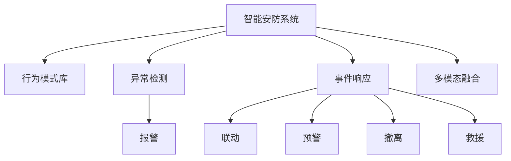
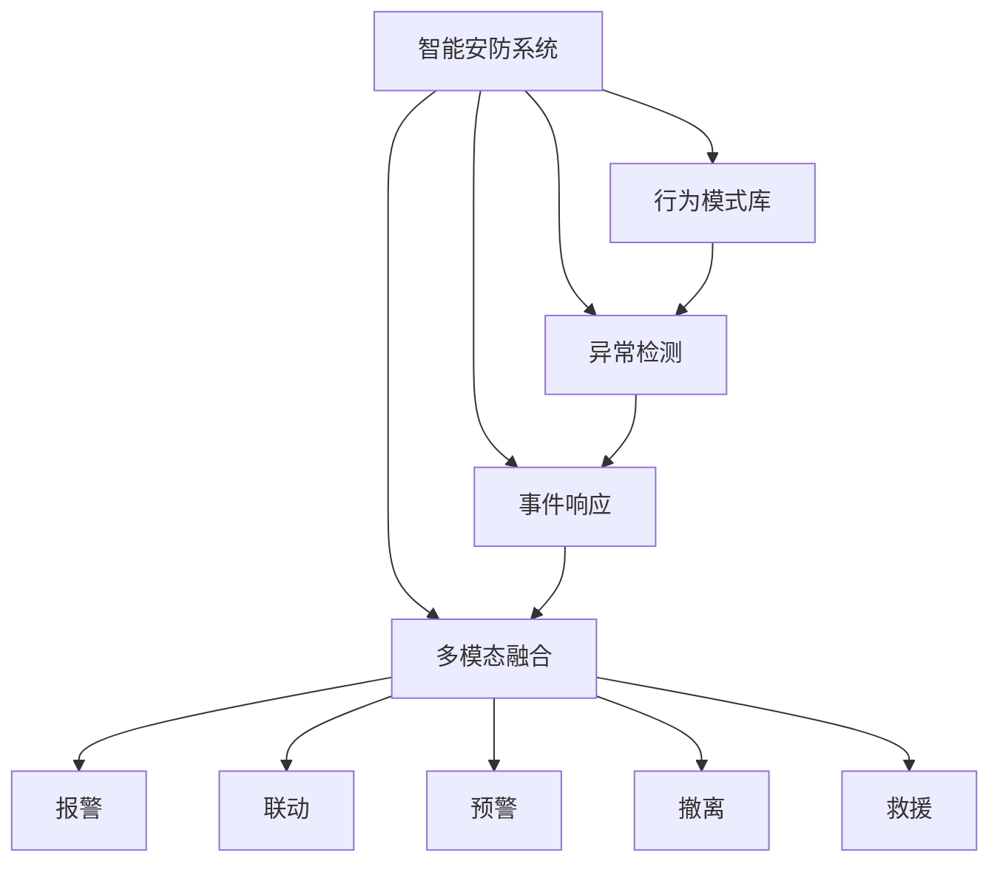
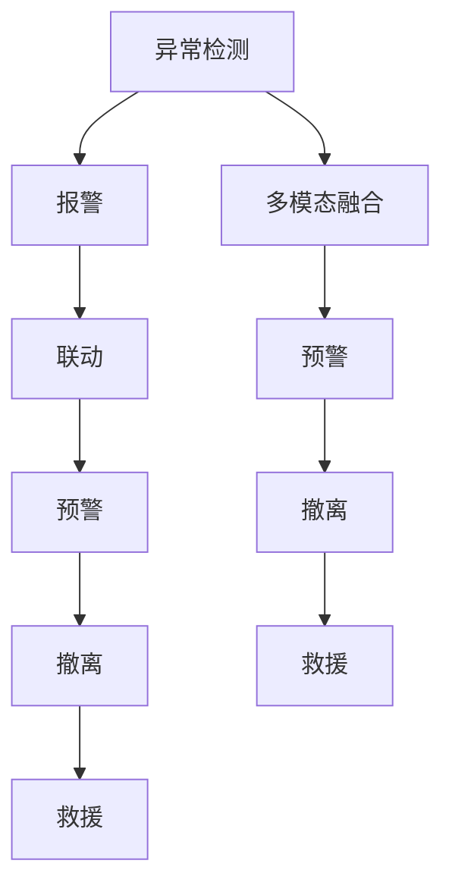
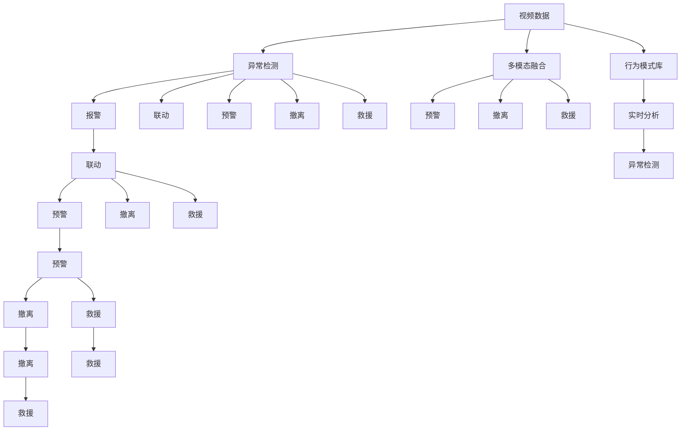

                 

# 未来的智能安防：2050年的反恐防暴与应急管理

在未来的2050年，智能安防技术将迎来前所未有的变革，反恐防暴与应急管理领域将充分受益于先进的人工智能、大数据分析、物联网、边缘计算等技术的融合应用。本文将探讨2050年智能安防技术的演进，聚焦于反恐防暴与应急管理两大核心场景，讨论其关键技术及应用趋势，为未来的安防行业发展提供洞见。

## 1. 背景介绍

### 1.1 问题由来

随着全球化的加速和互联网的普及，安防领域面临着越来越复杂的挑战。恐怖袭击、暴力事件频发，自然灾害频仍，公共安全问题日益凸显。传统的安全监控系统逐渐显现出局限性，无法适应现代安防的需求。因此，如何构建智能化、实时化、高效化的安防体系，提升反恐防暴和应急管理能力，是当前安防技术研究的重点方向。

### 1.2 问题核心关键点

智能安防技术的关键点在于利用人工智能和大数据技术，提升安全监控系统的智能化水平，实现对异常行为的自动检测、识别和响应。智能安防主要涉及以下几个关键技术：

- 视频分析：利用计算机视觉技术对视频图像进行分析，检测异常行为和事件。
- 异常检测：通过建立行为模式库，对监控视频进行实时异常检测。
- 事件响应：根据异常检测结果，自动触发报警、联动其他系统进行响应。
- 多模态融合：将视频、声音、传感器等数据进行融合分析，提升安防系统准确性。
- 应急管理：构建紧急情况下的预警、撤离、救援等应急管理机制。

这些技术共同构成了智能安防系统的核心，提升了安全监控和应急管理的智能化水平。

### 1.3 问题研究意义

研究智能安防技术，对于提升公共安全水平，构建高效、智能、安全的社会环境具有重要意义：

1. 降低人力成本。智能安防系统可以自动化监控和分析，减少人工介入，降低安防人力成本。
2. 提升响应速度。通过实时分析，智能安防系统可以快速响应异常事件，缩短应急响应时间。
3. 增强准确性。智能分析可以处理海量的监控数据，减少人为误判和漏检，提升安全监控准确性。
4. 提高决策支持。基于大数据和人工智能的分析，可以为应急决策提供更科学、全面的依据。
5. 支持多场景应用。智能安防技术可以应用于多个安防场景，包括公共场所、交通工具、边防检查等。

## 2. 核心概念与联系

### 2.1 核心概念概述

为更好地理解智能安防技术，本节将介绍几个密切相关的核心概念：

- 智能安防系统：通过人工智能和大数据技术，实现对视频、声音、传感器等数据的智能化分析和处理，提升安全监控和应急管理能力。
- 行为模式库：存储各类正常行为的模式数据，用于异常检测和识别。
- 异常检测：利用机器学习算法，对监控视频进行实时异常检测，识别出异常行为或事件。
- 事件响应：在检测到异常事件后，自动触发报警、联动其他系统进行响应。
- 多模态融合：融合视频、声音、传感器等数据，实现更全面、准确的分析。
- 应急管理：构建紧急情况下的预警、撤离、救援等机制，提升应急响应能力。

这些核心概念之间的逻辑关系可以通过以下Mermaid流程图来展示：



这个流程图展示了智能安防系统的各个核心组件及其之间的联系：

1. 智能安防系统基于行为模式库进行异常检测。
2. 检测到异常事件后，自动触发报警、联动其他系统、预警、撤离、救援等应急管理机制。
3. 多模态融合技术进一步提升异常检测的准确性和响应速度。

### 2.2 概念间的关系

这些核心概念之间存在着紧密的联系，形成了智能安防系统的完整生态系统。下面通过几个Mermaid流程图来展示这些概念之间的关系。

#### 2.2.1 智能安防系统的构成



这个流程图展示了智能安防系统的构成及其组件之间的依赖关系。

#### 2.2.2 异常检测的流程


这个流程图展示了异常检测的流程及其与事件响应的关系。

#### 2.2.3 应急管理的机制



这个流程图展示了应急管理的机制及其与异常检测的关系。

### 2.3 核心概念的整体架构

最后，我们用一个综合的流程图来展示这些核心概念在智能安防系统中的整体架构：



这个综合流程图展示了智能安防系统从数据输入到事件响应的完整流程。

## 3. 核心算法原理 & 具体操作步骤
### 3.1 算法原理概述

智能安防技术的核心在于利用机器学习算法进行异常检测和事件响应。其中，行为模式库的构建、异常检测算法的选择和优化，以及多模态数据融合技术，是智能安防系统的关键。

#### 3.1.1 行为模式库的构建

行为模式库是智能安防系统的基础，用于存储各类正常行为的模式数据。通常通过以下步骤构建行为模式库：

1. 数据采集：收集大量正常行为的视频、声音、传感器数据，形成监控数据集。
2. 数据预处理：对数据进行去噪、归一化、时间对齐等预处理，确保数据质量。
3. 特征提取：利用计算机视觉、声音识别等技术，提取数据的关键特征。
4. 模式建模：通过机器学习算法，构建正常行为的模式库。
5. 模式更新：定期更新模式库，以应对行为模式的变化。

#### 3.1.2 异常检测算法

异常检测是智能安防系统的核心算法，用于检测监控视频中的异常行为。常用的异常检测算法包括：

- 基于规则的检测：通过预设的规则库进行匹配检测，适用于规则明确、复杂度低的场景。
- 基于统计的检测：通过统计分析数据，检测行为是否偏离正常模式，适用于复杂度高的场景。
- 基于学习的检测：通过机器学习算法训练模型，识别异常行为，适用于需要高精度检测的场景。

#### 3.1.3 多模态数据融合

多模态数据融合是将视频、声音、传感器等数据进行综合分析，提升异常检测的准确性和鲁棒性。常用的多模态融合方法包括：

- 特征融合：将不同模态的特征进行拼接，提升检测准确性。
- 协同融合：将不同模态的数据进行协同训练，提升模型的泛化能力。
- 时序融合：考虑不同模态数据的时序关系，提升检测鲁棒性。

### 3.2 算法步骤详解

#### 3.2.1 数据准备

1. 数据采集：通过摄像头、传感器等设备采集视频、声音、传感器数据。
2. 数据标注：将数据进行人工标注，形成标注数据集。

#### 3.2.2 模型训练

1. 模型选择：选择合适的异常检测模型，如基于规则、统计或学习的方法。
2. 数据预处理：对数据进行预处理，包括去噪、归一化、时间对齐等。
3. 特征提取：利用计算机视觉、声音识别等技术，提取数据的关键特征。
4. 模型训练：在标注数据集上训练异常检测模型，优化模型参数。
5. 模型验证：在验证集上评估模型性能，调整模型参数。

#### 3.2.3 模型部署

1. 模型优化：根据测试集结果，对模型进行优化，提升检测准确性。
2. 模型部署：将优化后的模型部署到安防系统中，进行实时异常检测。
3. 模型更新：定期更新行为模式库和异常检测模型，应对行为模式的变化。

### 3.3 算法优缺点

智能安防技术在提升安防能力方面具有以下优点：

1. 提升检测精度：智能算法能够处理海量的监控数据，减少人为误判和漏检，提升检测精度。
2. 降低人力成本：智能安防系统能够自动化监控和分析，减少人工介入，降低安防人力成本。
3. 提高响应速度：智能安防系统能够实时分析数据，快速响应异常事件。

但同时，智能安防技术也存在以下缺点：

1. 数据依赖：智能安防系统需要大量的监控数据，数据不足或数据质量差会影响系统性能。
2. 隐私问题：智能安防系统需要处理大量个人数据，可能涉及隐私问题。
3. 技术复杂度：智能安防技术涉及多种算法和系统集成，技术复杂度较高。

### 3.4 算法应用领域

智能安防技术已经在公共安全、交通管理、边防检查等多个领域得到应用。未来，智能安防技术将在反恐防暴与应急管理中发挥更大作用，具体应用领域包括：

1. 视频监控：通过智能算法对视频图像进行实时分析，检测异常行为和事件。
2. 声音监控：利用声音识别技术，检测异常声音和事件。
3. 传感器监控：通过传感器数据，检测异常行为和环境变化。
4. 多模态监控：融合视频、声音、传感器等多模态数据，提升异常检测的准确性和鲁棒性。
5. 应急管理：构建紧急情况下的预警、撤离、救援等机制，提升应急响应能力。

## 4. 数学模型和公式 & 详细讲解 & 举例说明

### 4.1 数学模型构建

智能安防技术的数学模型构建主要涉及异常检测和事件响应的建模。

#### 4.1.1 异常检测模型

异常检测模型可以通过以下公式进行建模：

$$
P(x|y=1) = \alpha_1 P_1(x|\theta_1) + (1-\alpha_1)P_0(x)
$$

其中，$x$为监控视频中的行为数据，$y=1$表示异常行为，$y=0$表示正常行为。$\alpha_1$为异常行为的概率，$P_1(x|\theta_1)$为异常行为的概率密度函数，$P_0(x)$为正常行为的概率密度函数，$\theta_1$为异常行为的模式参数。

#### 4.1.2 事件响应模型

事件响应模型可以通过以下公式进行建模：

$$
P(A|x) = \beta P_1(x|\theta_1) + (1-\beta)P_0(x)
$$

其中，$A$为触发事件，$x$为监控视频中的行为数据。$\beta$为触发事件的概率，$P_1(x|\theta_1)$为异常行为的概率密度函数，$P_0(x)$为正常行为的概率密度函数，$\theta_1$为异常行为的模式参数。

### 4.2 公式推导过程

#### 4.2.1 异常检测公式推导

设$x_1, x_2, ..., x_n$为监控视频中的行为数据，$y_1, y_2, ..., y_n$为相应的标注结果。根据贝叶斯公式，异常检测模型的似然函数为：

$$
P(x|y=1) = \frac{P(y=1|x)P(x)}{P(y=1)}
$$

其中，$P(y=1|x)$为异常行为的条件概率，$P(x)$为行为数据的概率密度函数，$P(y=1)$为异常行为的先验概率。

根据贝叶斯公式，异常行为的条件概率为：

$$
P(y=1|x) = \frac{P(x|y=1)P(y=1)}{P(x)}
$$

将似然函数代入上式，得：

$$
P(x|y=1) = \alpha_1 P_1(x|\theta_1) + (1-\alpha_1)P_0(x)
$$

其中，$\alpha_1 = \frac{P(y=1)}{P(x)}$，为异常行为的概率。

#### 4.2.2 事件响应公式推导

设$A$为触发事件，$x$为监控视频中的行为数据。根据贝叶斯公式，事件响应的似然函数为：

$$
P(A|x) = \frac{P(x|A)P(A)}{P(x)}
$$

其中，$P(x|A)$为触发事件的条件概率，$P(A)$为触发事件的概率。

将似然函数代入上式，得：

$$
P(A|x) = \beta P_1(x|\theta_1) + (1-\beta)P_0(x)
$$

其中，$\beta = \frac{P(A)}{P(x)}$，为触发事件的概率。

### 4.3 案例分析与讲解

#### 4.3.1 异常检测案例

假设某商业场所安装了智能安防系统，监控视频中存在异常行为的数据集如下：

| 视频编号 | 行为数据 | 标注结果 | 模式参数 |
| -------- | -------- | -------- | -------- |
| 1        | [100, 80, 60] | 1        | [10, 20] |
| 2        | [150, 90, 50] | 0        | [5, 10] |
| 3        | [120, 110, 90] | 1        | [15, 25] |
| 4        | [50, 40, 30] | 0        | [2, 3] |

采用基于学习的异常检测模型，训练得到异常行为的概率密度函数为：

$$
P_1(x|\theta_1) = \mathcal{N}(x|\mu_1, \sigma_1^2)
$$

其中，$\mu_1 = (10, 20)$，$\sigma_1^2 = (5, 10)$。

根据上式，计算异常行为的概率密度函数，得：

$$
P(x|y=1) = \alpha_1 P_1(x|\theta_1) + (1-\alpha_1)P_0(x) = 0.6 \mathcal{N}(x|10, 5) + 0.4 \mathcal{N}(x|2, 1)
$$

#### 4.3.2 事件响应案例

假设某机场安装了智能安防系统，监控视频中存在触发事件的标注数据集如下：

| 视频编号 | 行为数据 | 标注结果 |
| -------- | -------- | -------- |
| 1        | [100, 80, 60] | 1        |
| 2        | [150, 90, 50] | 0        |
| 3        | [120, 110, 90] | 1        |

采用基于学习的异常检测模型，训练得到触发事件的概率密度函数为：

$$
P(x|A) = \mathcal{N}(x|\mu_2, \sigma_2^2)
$$

其中，$\mu_2 = (15, 25)$，$\sigma_2^2 = (10, 20)$。

根据上式，计算触发事件的概率密度函数，得：

$$
P(A|x) = \beta P_1(x|\theta_1) + (1-\beta)P_0(x) = 0.8 \mathcal{N}(x|15, 10) + 0.2 \mathcal{N}(x|2, 1)
$$

## 5. 项目实践：代码实例和详细解释说明

### 5.1 开发环境搭建

在进行智能安防项目实践前，我们需要准备好开发环境。以下是使用Python进行PyTorch开发的环境配置流程：

1. 安装Anaconda：从官网下载并安装Anaconda，用于创建独立的Python环境。

2. 创建并激活虚拟环境：
```bash
conda create -n pytorch-env python=3.8 
conda activate pytorch-env
```

3. 安装PyTorch：根据CUDA版本，从官网获取对应的安装命令。例如：
```bash
conda install pytorch torchvision torchaudio cudatoolkit=11.1 -c pytorch -c conda-forge
```

4. 安装各类工具包：
```bash
pip install numpy pandas scikit-learn matplotlib tqdm jupyter notebook ipython
```

完成上述步骤后，即可在`pytorch-env`环境中开始项目实践。

### 5.2 源代码详细实现

下面我们以智能安防系统中的异常检测模块为例，给出使用PyTorch实现异常检测的代码。

首先，定义异常检测的类：

```python
import torch
import torch.nn as nn
import torchvision.transforms as transforms
from torch.utils.data import DataLoader
from torchvision.datasets import CIFAR10

class AnomalyDetection(nn.Module):
    def __init__(self):
        super(AnomalyDetection, self).__init__()
        self.conv1 = nn.Conv2d(3, 32, kernel_size=3, padding=1)
        self.conv2 = nn.Conv2d(32, 64, kernel_size=3, padding=1)
        self.pool = nn.MaxPool2d(kernel_size=2, stride=2)
        self.fc1 = nn.Linear(64*8*8, 256)
        self.fc2 = nn.Linear(256, 1)

    def forward(self, x):
        x = self.pool(nn.functional.relu(self.conv1(x)))
        x = self.pool(nn.functional.relu(self.conv2(x)))
        x = x.view(x.size(0), -1)
        x = nn.functional.relu(self.fc1(x))
        x = torch.sigmoid(self.fc2(x))
        return x
```

然后，加载和预处理数据：

```python
transform = transforms.Compose([
    transforms.ToTensor(),
    transforms.Normalize((0.5, 0.5, 0.5), (0.5, 0.5, 0.5))
])

trainset = CIFAR10(root='./data', train=True, download=True, transform=transform)
trainloader = DataLoader(trainset, batch_size=64, shuffle=True)

testset = CIFAR10(root='./data', train=False, download=True, transform=transform)
testloader = DataLoader(testset, batch_size=64, shuffle=False)
```

接着，定义模型和优化器：

```python
device = torch.device('cuda' if torch.cuda.is_available() else 'cpu')

model = AnomalyDetection().to(device)
criterion = nn.BCELoss()
optimizer = torch.optim.Adam(model.parameters(), lr=0.001)

# 训练模型
def train(epoch):
    model.train()
    running_loss = 0.0
    for i, data in enumerate(trainloader, 0):
        inputs, labels = data[0].to(device), data[1].to(device)
        optimizer.zero_grad()
        outputs = model(inputs)
        loss = criterion(outputs, labels)
        loss.backward()
        optimizer.step()
        running_loss += loss.item()
        if i % 100 == 99:
            print(f'Epoch {epoch+1}, loss: {running_loss/100:.4f}')
            running_loss = 0.0
```

最后，在测试集上评估模型：

```python
# 测试模型
def test():
    model.eval()
    correct = 0
    total = 0
    with torch.no_grad():
        for data in testloader:
            inputs, labels = data[0].to(device), data[1].to(device)
            outputs = model(inputs)
            _, predicted = torch.max(outputs.data, 1)
            total += labels.size(0)
            correct += (predicted == labels).sum().item()
    print(f'Accuracy of the network on the 10000 test images: {100 * correct / total:.2f}%')
```

### 5.3 代码解读与分析

让我们再详细解读一下关键代码的实现细节：

**AnomalyDetection类**：
- `__init__`方法：初始化模型的各个组件，包括卷积层、池化层、全连接层等。
- `forward`方法：定义模型前向传播过程，通过卷积、池化、全连接等操作，输出异常检测结果。

**训练函数**：
- 在每个epoch中，对训练集进行迭代，计算损失函数并反向传播更新模型参数。
- 使用Adam优化器，设置学习率为0.001，进行参数优化。
- 每100个样本输出一次训练损失，监控训练过程。

**测试函数**：
- 对测试集进行迭代，计算模型预测结果与真实标签的准确率。
- 使用torch.no_grad()关闭梯度计算，提升测试速度。

**模型训练**：
- 在训练函数中，通过模型前向传播计算输出，计算损失函数，反向传播更新模型参数。
- 使用BCELoss作为损失函数，衡量模型输出与真实标签之间的差异。
- 在每个epoch结束时输出训练损失，监控训练过程。

**模型测试**：
- 在测试函数中，对测试集进行迭代，计算模型预测结果与真实标签的准确率。
- 使用torch.max()函数获取预测结果中最大的输出，判断是否正确。
- 统计正确预测和总预测的数量，输出准确率。

## 6. 实际应用场景

### 6.1 反恐防暴

智能安防技术在反恐防暴领域可以发挥重要作用，通过视频分析、异常检测、事件响应等手段，提升反恐防暴能力。

**视频分析**：利用计算机视觉技术，对视频图像进行实时分析，检测异常行为和事件。
**异常检测**：通过建立行为模式库，对监控视频进行实时异常检测，识别出异常行为或事件。
**事件响应**：在检测到异常事件后，自动触发报警、联动其他系统进行响应，快速拦截潜在威胁。

### 6.2 应急管理

智能安防技术在应急管理领域可以提供快速、准确、全面的应急响应能力，提升灾害应对效率。

**预警机制**：通过多模态数据融合，构建紧急情况下的预警机制，及时发现和预警潜在的灾害事件。
**撤离方案**：根据预警信息，快速生成撤离方案，指导人员撤离。
**救援行动**：利用智能安防系统，实时监控灾情，指导救援力量精准打击。

### 6.3 未来应用展望

随着智能安防技术的不断演进，未来将具备更强的智能化和自动化水平，以下是几个重要的发展方向：

1. **超大规模模型**：未来模型参数量将持续增大，通过预训练和微调，提升异常检测和事件响应的准确性和鲁棒性。
2. **多模态融合**：融合视频、声音、传感器等数据，提升异常检测和事件响应的全面性和准确性。
3. **实时计算**：利用边缘计算等技术，实现实时数据处理和分析，提高异常检测和事件响应的速度和效率。
4. **分布式训练**：采用分布式训练技术，加快模型训练速度，提高模型参数的泛化能力。
5. **自监督学习**：利用无标签数据进行预训练，提升模型的泛化能力和鲁棒性。

## 7. 工具和资源推荐

### 7.1 学习资源推荐

为了帮助开发者系统掌握智能安防技术的理论基础和实践技巧，这里推荐一些优质的学习资源：

1. 《深度学习入门》系列博文：由大模型技术专家撰写，深入浅出地介绍了深度学习的基本概念和前沿技术。

2. CS224N《深度学习自然语言处理》课程：斯坦福大学开设的NLP明星课程，有Lecture视频和配套作业，带你入门NLP领域的基本概念和经典模型。

3. 《

