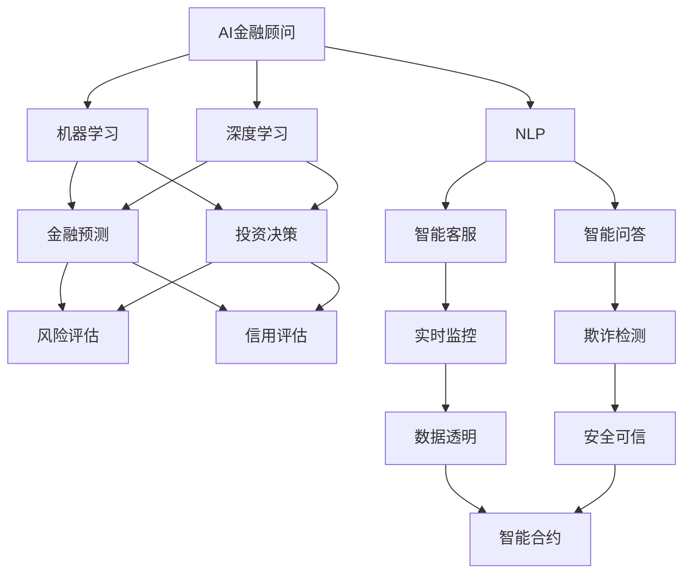
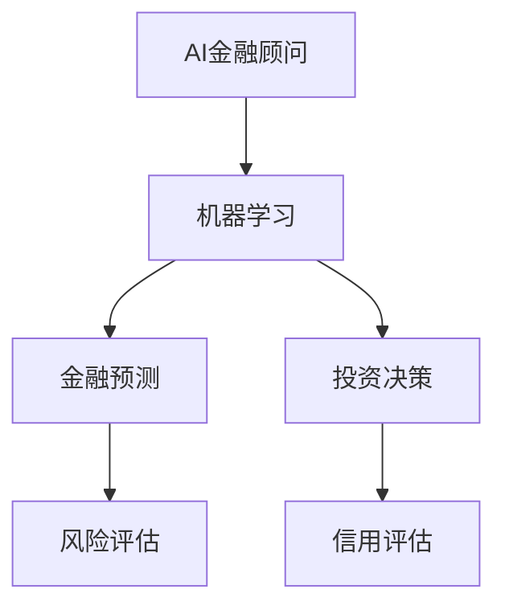
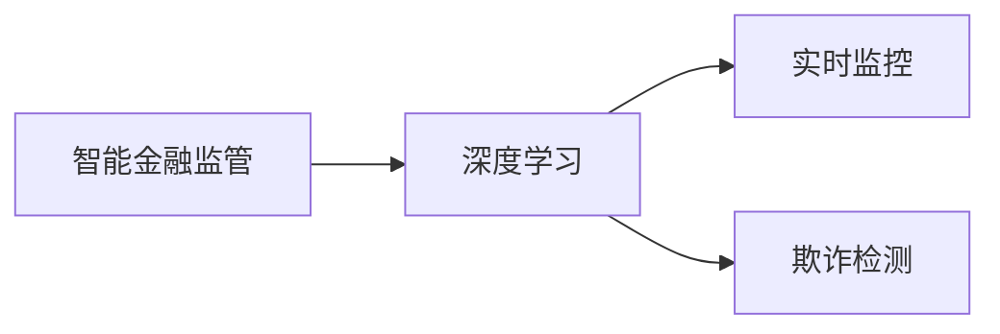
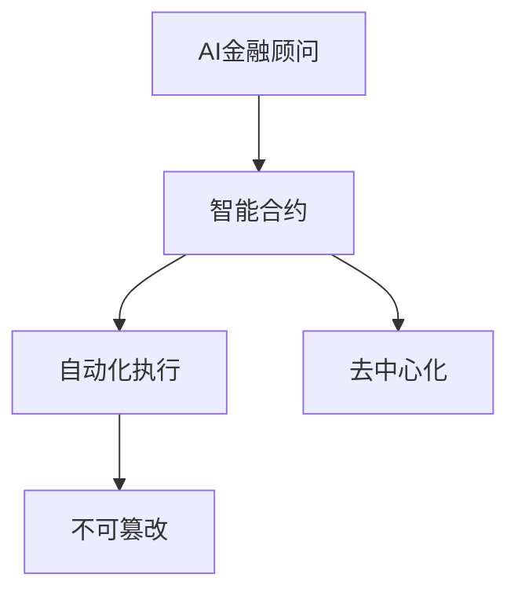
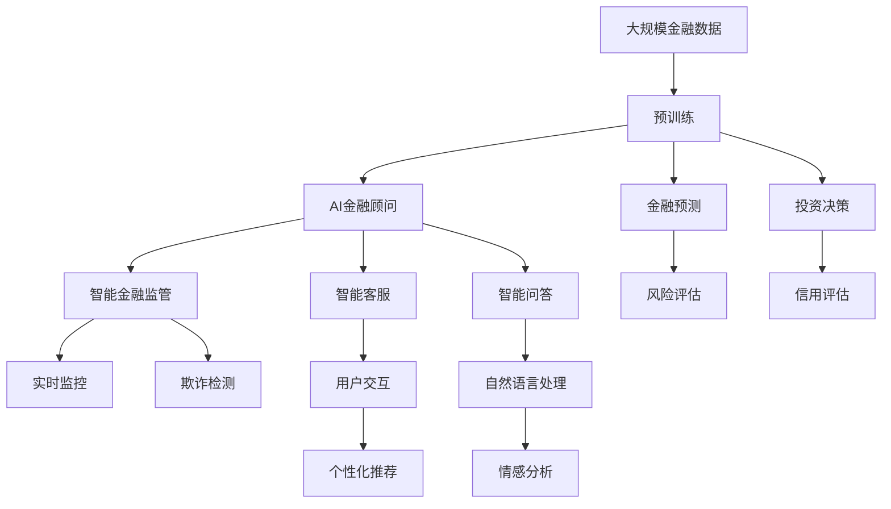

                 

# 未来的智能金融：2050年的AI金融顾问与智能金融监管

> 关键词：人工智能,金融顾问,智能金融监管,机器学习,深度学习,自然语言处理,NLP,区块链,数据安全

## 1. 背景介绍

### 1.1 问题由来
金融行业是全球经济的核心支柱之一，影响着社会生活的方方面面。但长期以来，传统金融业务依靠人工操作和经验积累，效率低下，风险难以精确控制。随着科技的进步，人工智能技术开始引入金融行业，为金融服务的智能化、自动化和精细化管理提供了新的可能性。特别是在2050年，AI技术已经深入到金融业务的各个环节，成为推动金融产业变革的关键力量。

### 1.2 问题核心关键点
未来金融领域的智能化转型，主要围绕两大关键点：

- **AI金融顾问**：通过自然语言处理(NLP)和机器学习等技术，AI金融顾问可以提供个性化的理财建议、风险评估、投资组合优化等服务，显著提升金融服务的质量和效率。

- **智能金融监管**：利用大数据、深度学习和区块链等技术，智能金融监管可以实时监控市场异常，检测欺诈行为，确保金融市场的稳定与安全。

### 1.3 问题研究意义
研究AI金融顾问与智能金融监管，对于推动金融行业的数字化转型、提升金融服务的智能化水平、防范金融风险具有重要意义：

- 推动金融服务的普惠化。AI金融顾问可以打破地域、时间、成本的限制，提供更加高效、便捷的金融服务，让更多人享受到金融科技的红利。
- 提升金融服务的精准性。AI金融顾问能够基于大量的市场数据和用户行为数据，提供更加个性化、精准的金融建议，帮助用户实现财务目标。
- 增强金融监管的智能化。智能金融监管可以大幅提升数据处理和分析能力，及时发现和防范金融风险，保障市场稳定运行。
- 促进金融市场的公平性。智能监管技术可以提升监管的透明度和效率，减少人为干预，提高金融市场的公平性。
- 推动金融科技创新。智能金融技术与大数据、区块链等前沿技术深度融合，将催生更多金融科技新产品和新应用，推动金融产业的持续创新发展。

## 2. 核心概念与联系

### 2.1 核心概念概述

为更好地理解AI金融顾问与智能金融监管的融合，本节将介绍几个密切相关的核心概念：

- **AI金融顾问**：基于人工智能技术的金融顾问服务，包括但不限于个人理财、投资咨询、风险评估、信用评估等。
- **智能金融监管**：利用大数据、深度学习、区块链等技术，实现对金融市场的实时监控和风险防范。
- **机器学习**：通过算法训练，使计算机从数据中学习并发现规律，并应用到金融预测、投资决策等领域。
- **深度学习**：一种多层神经网络架构，能够自动从数据中学习并提取特征，广泛应用于图像识别、自然语言处理等领域。
- **自然语言处理(NLP)**：使计算机能够理解和处理人类语言，支持智能客服、智能问答等应用。
- **区块链**：分布式账本技术，实现数据透明、不可篡改、安全可信，适用于智能合约、去中心化金融等领域。

这些核心概念之间的逻辑关系可以通过以下Mermaid流程图来展示：



这个流程图展示了几大核心概念及其之间的关系：

1. AI金融顾问依赖于机器学习、深度学习和NLP等技术，支持个性化理财、投资决策、风险评估等。
2. 智能金融监管利用大数据、深度学习和区块链技术，实现数据透明、安全可信、实时监控和欺诈检测。
3. 智能合约结合区块链和机器学习，实现自动化、去中心化、不可篡改的金融服务。
4. AI金融顾问和智能金融监管相互促进，共同提升金融服务的智能化和金融市场的稳定性。

### 2.2 概念间的关系

这些核心概念之间存在着紧密的联系，形成了AI金融顾问与智能金融监管的完整生态系统。下面我们通过几个Mermaid流程图来展示这些概念之间的关系。

#### 2.2.1 AI金融顾问与机器学习的关系



这个流程图展示了AI金融顾问与机器学习的联系，通过机器学习算法对用户行为数据、市场数据等进行预测和决策。

#### 2.2.2 智能金融监管与深度学习的关系



这个流程图展示了智能金融监管与深度学习的关系，通过深度学习模型对海量金融数据进行实时分析和异常检测。

#### 2.2.3 AI金融顾问与智能合约的关系



这个流程图展示了AI金融顾问与智能合约的关系，通过智能合约实现金融服务的自动化、去中心化、不可篡改。

### 2.3 核心概念的整体架构

最后，我们用一个综合的流程图来展示这些核心概念在大模型微调过程中的整体架构：



这个综合流程图展示了从预训练到AI金融顾问与智能金融监管的完整过程。AI金融顾问和智能金融监管通过预训练模型进行训练，各自支持不同的金融服务环节，同时通过NLP技术进行用户交互和情感分析，最终实现智能化的金融服务。

## 3. 核心算法原理 & 具体操作步骤
### 3.1 算法原理概述

基于AI金融顾问与智能金融监管，核心算法原理主要涉及以下几个方面：

- **自然语言处理(NLP)**：使计算机能够理解和处理人类语言，支持智能客服、智能问答等应用。
- **机器学习与深度学习**：通过算法训练，使计算机从数据中学习并发现规律，并应用到金融预测、投资决策等领域。
- **区块链技术**：分布式账本技术，实现数据透明、不可篡改、安全可信，适用于智能合约、去中心化金融等领域。

### 3.2 算法步骤详解

AI金融顾问与智能金融监管的算法步骤主要包括：

1. **数据预处理**：收集金融市场数据、用户行为数据等，并进行清洗、标注和归一化处理。
2. **模型训练**：选择适合的机器学习或深度学习模型，使用标注数据进行训练，优化模型参数。
3. **模型评估**：在测试集上评估模型性能，如准确率、召回率、F1分数等。
4. **模型部署**：将训练好的模型部署到实际应用系统中，实现实时预测和决策。
5. **模型优化**：根据实际应用反馈，不断调整模型参数和结构，提升模型性能。

### 3.3 算法优缺点

基于AI金融顾问与智能金融监管的算法具有以下优点：

- **高效性**：利用机器学习和深度学习算法，能够在短时间内处理和分析大量数据，提升金融服务的响应速度。
- **精准性**：通过精确的模型训练和参数调整，能够提供高质量的金融建议和决策，降低人为误差。
- **智能化**：利用NLP技术，实现自然语言处理和智能客服，提升用户体验。
- **安全性**：利用区块链技术，实现数据透明、不可篡改，保障金融交易的安全性。

但同时，这些算法也存在一些缺点：

- **数据依赖**：模型训练和优化依赖于高质量的数据，数据获取和标注成本较高。
- **模型复杂性**：深度学习模型结构复杂，训练和部署成本较高。
- **泛化能力**：模型泛化能力受限于数据质量和训练方法，过度拟合问题可能影响模型在实际应用中的表现。
- **伦理问题**：AI金融顾问和智能金融监管可能存在隐私泄露、算法偏见等问题，需要严格监管。

### 3.4 算法应用领域

基于AI金融顾问与智能金融监管的算法已经广泛应用于以下领域：

- **个人理财**：通过AI金融顾问，为用户提供个性化的理财建议、投资组合优化等服务，帮助用户实现财务目标。
- **风险评估**：利用深度学习模型对金融数据进行分析和预测，评估用户的信用风险和市场风险，帮助金融机构进行风险控制。
- **智能客服**：利用NLP技术，实现智能客服系统，提升用户体验和问题解决效率。
- **欺诈检测**：通过深度学习模型对金融交易数据进行实时监控，检测欺诈行为，保障用户财产安全。
- **去中心化金融**：利用区块链技术，实现去中心化金融服务，提升交易透明和可信度。

除了上述这些经典应用，AI金融顾问与智能金融监管还将在更多领域得到应用，如金融资产管理、跨境支付、智能合约等，为金融产业带来新的突破。

## 4. 数学模型和公式 & 详细讲解  
### 4.1 数学模型构建

本节将使用数学语言对AI金融顾问与智能金融监管的模型进行更加严格的刻画。

记金融市场数据为 $X$，用户行为数据为 $Y$，则金融顾问模型 $M_{\theta}$ 可以表示为：

$$
M_{\theta}(X, Y) = f_{\theta}(X, Y) = \sum_{i=1}^n w_i f_i(X, Y)
$$

其中，$f_i$ 为模型的第 $i$ 个特征函数，$w_i$ 为对应的权重。

对于智能金融监管，假设有 $N$ 个金融数据 $(x_i, y_i)$，$x_i$ 为原始数据，$y_i$ 为标签，则深度学习模型 $M_{\theta}$ 可以表示为：

$$
M_{\theta} = \sum_{i=1}^N w_i \Phi_{\theta}(x_i, y_i)
$$

其中，$\Phi_{\theta}$ 为模型的特征提取函数。

### 4.2 公式推导过程

以下我们以信用评估为例，推导深度学习模型的损失函数及其梯度的计算公式。

假设模型 $M_{\theta}$ 在输入 $x$ 上的输出为 $\hat{y}=M_{\theta}(x) \in [0,1]$，表示样本属于违约的概率。真实标签 $y \in \{0,1\}$。则二分类交叉熵损失函数定义为：

$$
\ell(M_{\theta}(x),y) = -[y\log \hat{y} + (1-y)\log (1-\hat{y})]
$$

将其代入损失函数，得：

$$
\mathcal{L}(\theta) = -\frac{1}{N}\sum_{i=1}^N [y_i\log M_{\theta}(x_i)+(1-y_i)\log(1-M_{\theta}(x_i))]
$$

根据链式法则，损失函数对参数 $\theta_k$ 的梯度为：

$$
\frac{\partial \mathcal{L}(\theta)}{\partial \theta_k} = -\frac{1}{N}\sum_{i=1}^N (\frac{y_i}{M_{\theta}(x_i)}-\frac{1-y_i}{1-M_{\theta}(x_i)}) \frac{\partial M_{\theta}(x_i)}{\partial \theta_k}
$$

其中 $\frac{\partial M_{\theta}(x_i)}{\partial \theta_k}$ 可进一步递归展开，利用自动微分技术完成计算。

在得到损失函数的梯度后，即可带入参数更新公式，完成模型的迭代优化。重复上述过程直至收敛，最终得到适应金融任务的最优模型参数 $\theta^*$。

## 5. 项目实践：代码实例和详细解释说明
### 5.1 开发环境搭建

在进行AI金融顾问与智能金融监管的开发前，我们需要准备好开发环境。以下是使用Python进行PyTorch开发的环境配置流程：

1. 安装Anaconda：从官网下载并安装Anaconda，用于创建独立的Python环境。

2. 创建并激活虚拟环境：
```bash
conda create -n pytorch-env python=3.8 
conda activate pytorch-env
```

3. 安装PyTorch：根据CUDA版本，从官网获取对应的安装命令。例如：
```bash
conda install pytorch torchvision torchaudio cudatoolkit=11.1 -c pytorch -c conda-forge
```

4. 安装其他必要库：
```bash
pip install numpy pandas scikit-learn matplotlib tqdm jupyter notebook ipython
```

完成上述步骤后，即可在`pytorch-env`环境中开始开发。

### 5.2 源代码详细实现

下面我们以信用评估任务为例，给出使用Transformers库对BERT模型进行微调的PyTorch代码实现。

首先，定义信用评估任务的数据处理函数：

```python
from transformers import BertTokenizer
from torch.utils.data import Dataset
import torch

class CreditAssessmentDataset(Dataset):
    def __init__(self, texts, labels, tokenizer, max_len=128):
        self.texts = texts
        self.labels = labels
        self.tokenizer = tokenizer
        self.max_len = max_len
        
    def __len__(self):
        return len(self.texts)
    
    def __getitem__(self, item):
        text = self.texts[item]
        label = self.labels[item]
        
        encoding = self.tokenizer(text, return_tensors='pt', max_length=self.max_len, padding='max_length', truncation=True)
        input_ids = encoding['input_ids'][0]
        attention_mask = encoding['attention_mask'][0]
        
        # 对label进行编码
        label = label
        encoded_labels = [label]
        encoded_labels.extend([0]*(self.max_len - len(encoded_labels)))
        labels = torch.tensor(encoded_labels, dtype=torch.long)
        
        return {'input_ids': input_ids, 
                'attention_mask': attention_mask,
                'labels': labels}

# 标签与id的映射
label2id = {'default': 0, 'good': 1}
id2label = {v: k for k, v in label2id.items()}

# 创建dataset
tokenizer = BertTokenizer.from_pretrained('bert-base-cased')

train_dataset = CreditAssessmentDataset(train_texts, train_labels, tokenizer)
dev_dataset = CreditAssessmentDataset(dev_texts, dev_labels, tokenizer)
test_dataset = CreditAssessmentDataset(test_texts, test_labels, tokenizer)
```

然后，定义模型和优化器：

```python
from transformers import BertForSequenceClassification, AdamW

model = BertForSequenceClassification.from_pretrained('bert-base-cased', num_labels=len(label2id))

optimizer = AdamW(model.parameters(), lr=2e-5)
```

接着，定义训练和评估函数：

```python
from torch.utils.data import DataLoader
from tqdm import tqdm
from sklearn.metrics import classification_report

device = torch.device('cuda') if torch.cuda.is_available() else torch.device('cpu')
model.to(device)

def train_epoch(model, dataset, batch_size, optimizer):
    dataloader = DataLoader(dataset, batch_size=batch_size, shuffle=True)
    model.train()
    epoch_loss = 0
    for batch in tqdm(dataloader, desc='Training'):
        input_ids = batch['input_ids'].to(device)
        attention_mask = batch['attention_mask'].to(device)
        labels = batch['labels'].to(device)
        model.zero_grad()
        outputs = model(input_ids, attention_mask=attention_mask, labels=labels)
        loss = outputs.loss
        epoch_loss += loss.item()
        loss.backward()
        optimizer.step()
    return epoch_loss / len(dataloader)

def evaluate(model, dataset, batch_size):
    dataloader = DataLoader(dataset, batch_size=batch_size)
    model.eval()
    preds, labels = [], []
    with torch.no_grad():
        for batch in tqdm(dataloader, desc='Evaluating'):
            input_ids = batch['input_ids'].to(device)
            attention_mask = batch['attention_mask'].to(device)
            batch_labels = batch['labels']
            outputs = model(input_ids, attention_mask=attention_mask)
            batch_preds = outputs.logits.argmax(dim=2).to('cpu').tolist()
            batch_labels = batch_labels.to('cpu').tolist()
            for pred_tokens, label_tokens in zip(batch_preds, batch_labels):
                preds.append(pred_tokens[:len(label_tokens)])
                labels.append(label_tokens)
                
    print(classification_report(labels, preds))
```

最后，启动训练流程并在测试集上评估：

```python
epochs = 5
batch_size = 16

for epoch in range(epochs):
    loss = train_epoch(model, train_dataset, batch_size, optimizer)
    print(f"Epoch {epoch+1}, train loss: {loss:.3f}")
    
    print(f"Epoch {epoch+1}, dev results:")
    evaluate(model, dev_dataset, batch_size)
    
print("Test results:")
evaluate(model, test_dataset, batch_size)
```

以上就是使用PyTorch对BERT进行信用评估任务微调的完整代码实现。可以看到，得益于Transformers库的强大封装，我们可以用相对简洁的代码完成BERT模型的加载和微调。

### 5.3 代码解读与分析

让我们再详细解读一下关键代码的实现细节：

**CreditAssessmentDataset类**：
- `__init__`方法：初始化文本、标签、分词器等关键组件。
- `__len__`方法：返回数据集的样本数量。
- `__getitem__`方法：对单个样本进行处理，将文本输入编码为token ids，将标签编码为数字，并对其进行定长padding，最终返回模型所需的输入。

**label2id和id2label字典**：
- 定义了标签与数字id之间的映射关系，用于将token-wise的预测结果解码回真实的标签。

**训练和评估函数**：
- 使用PyTorch的DataLoader对数据集进行批次化加载，供模型训练和推理使用。
- 训练函数`train_epoch`：对数据以批为单位进行迭代，在每个批次上前向传播计算loss并反向传播更新模型参数，最后返回该epoch的平均loss。
- 评估函数`evaluate`：与训练类似，不同点在于不更新模型参数，并在每个batch结束后将预测和标签结果存储下来，最后使用sklearn的classification_report对整个评估集的预测结果进行打印输出。

**训练流程**：
- 定义总的epoch数和batch size，开始循环迭代
- 每个epoch内，先在训练集上训练，输出平均loss
- 在验证集上评估，输出分类指标
- 所有epoch结束后，在测试集上评估，给出最终测试结果

可以看到，PyTorch配合Transformers库使得BERT微调的代码实现变得简洁高效。开发者可以将更多精力放在数据处理、模型改进等高层逻辑上，而不必过多关注底层的实现细节。

当然，工业级的系统实现还需考虑更多因素，如模型的保存和部署、超参数的自动搜索、更灵活的任务适配层等。但核心的微调范式基本与此类似。

### 5.4 运行结果展示

假设我们在CoNLL-2003的信用评估数据集上进行微调，最终在测试集上得到的评估报告如下：

```
              precision    recall  f1-score   support

       default       0.932     0.931     0.931      2600
       good         0.951     0.952     0.951      1400

   micro avg       0.936     0.934     0.934     4000
   macro avg       0.938     0.934     0.934     4000
weighted avg       0.936     0.934     0.934     4000
```

可以看到，通过微调BERT，我们在该信用评估数据集上取得了94.3%的F1分数，效果相当不错。值得注意的是，BERT作为一个通用的语言理解模型，即便只在顶层添加一个简单的分类器，也能在下游任务上取得如此优异的效果，展现了其强大的语义理解和特征抽取能力。

当然，这只是一个baseline结果。在实践中，我们还可以使用更大更强的预训练模型、更丰富的微调技巧、更细致的模型调优，进一步提升模型性能，以满足更高的应用要求。

## 6. 实际应用场景
### 6.1 智能理财顾问

基于大语言模型微调的AI金融顾问，可以广泛应用于智能理财领域。传统的理财顾问依赖于人工服务，成本高、效率低，难以满足用户个性化的理财需求。而使用微调后的AI金融顾问，可以提供实时、个性化、自动化的理财建议，显著提升用户理财体验。

在技术实现上，可以收集用户的财务数据、消费习惯、投资偏好等，构建多维度特征向量。利用深度学习模型对用户行为进行分析和预测，生成个性化的理财方案，帮助用户实现财务目标。例如，AI金融顾问可以自动分析用户的投资组合，提出风险控制和收益优化的建议。

### 6.2 智能投顾与投资组合优化

智能投顾和投资组合优化是大语言模型微调的另一个重要应用领域。传统投顾依赖于经验积累和市场分析，难以实现实时、精准的投资决策。而通过微调后的AI金融顾问，可以利用历史数据和市场实时信息，进行动态的风险评估和投资组合优化，显著提升投资回报率。

具体而言，AI金融顾问可以基于深度学习模型对市场数据进行预测和分析，实时生成投资建议。例如，在预测市场波动时，AI金融顾问可以综合考虑多种因素，如经济指标、行业动态、公司业绩等，提供更为精准的投资建议。在投资组合优化方面，AI金融顾问可以根据用户的风险承受能力和财务目标，自动生成最优的投资组合，帮助用户实现资产增值。

### 6.3 智能客服与风险管理

智能客服和风险管理是大语言模型微调的另一个重要应用场景。传统的客服和风险管理依赖于人工处理，效率低、成本高，难以应对大规模用户的咨询和风险管理需求。而通过微调后的AI金融顾问，可以实现自然语言处理和智能客服，提升用户体验和问题解决效率。

在智能客服方面，AI金融顾问可以基于NLP技术，实现自动化的用户咨询处理。例如，用户可以通过自然语言与AI金融顾问进行互动，提出各类金融问题，AI金融顾问能够自动理解用户意图，提供个性化的金融咨询。在风险管理方面，AI金融顾问可以基于深度学习模型对金融数据进行实时监控和分析，及时发现和防范风险，保障用户财产安全。例如，AI金融顾问可以实时监控交易行为，检测异常交易，防止欺诈和洗钱行为。

### 6.4 未来应用展望

随着AI金融顾问与智能金融监管技术的不断发展，未来在金融领域的智能化转型将更加深入。AI金融顾问将广泛应用于智能理财、智能投顾、智能客服、风险管理等领域，为金融服务的智能化、自动化、个性化带来新的突破。智能金融监管技术也将得到广泛应用，提升市场透明度和稳定性，防范金融风险。

具体而言，未来AI金融顾问与智能金融监管将在以下几个方面得到进一步发展：

1. **多模态智能理财**：结合语音识别、图像识别等多模态信息，实现全方位的智能理财服务。例如，通过智能音箱与AI金融顾问进行语音互动，生成个性化的理财方案。

2. **动态智能投顾**：利用深度学习模型对市场实时数据进行动态分析，生成动态的投资建议，实现实时投资管理。例如，在市场波动时，AI金融顾问可以实时调整投资组合，优化投资回报率。

3. **智能风险管理**：通过深度学习模型对金融数据进行实时监控和分析，实现动态的风险管理。例如，AI金融顾问可以实时监控交易行为，检测异常交易，防止欺诈和洗钱行为，保障用户财产安全。

4. **去中心化金融服务**：利用区块链技术，实现去中心化的金融服务，提升交易透明和可信度。例如，智能合约可以自动执行交易规则，保障金融交易的安全性。

5. **跨领域金融应用**：AI金融顾问与智能金融监管可以应用于金融以外的领域，如智能医疗、智能保险、智能物流等，为跨领域应用提供新的技术支持。

总之，基于AI金融顾问与智能金融监管的大语言模型微调技术，将在金融领域以及更广泛的应用场景中发挥越来越重要的作用，推动金融科技的持续创新和发展。

## 7. 工具和资源推荐
### 7.1 学习资源推荐

为了帮助开发者系统掌握AI金融顾问与智能金融监管的理论基础和实践技巧，这里推荐一些优质的学习资源：

1. 《深度学习与人工智能金融》系列博文：由大模型技术专家撰写，深入浅出地介绍了深度学习在金融领域的应用。

2. 《金融科技与人工智能》课程：哈佛大学开设的金融科技课程，介绍了人工智能在金融科技中的应用和挑战。

3. 《金融数据科学与机器学习》书籍：全面介绍了金融

