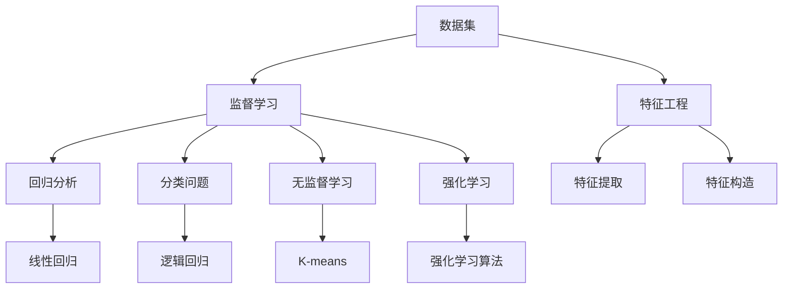
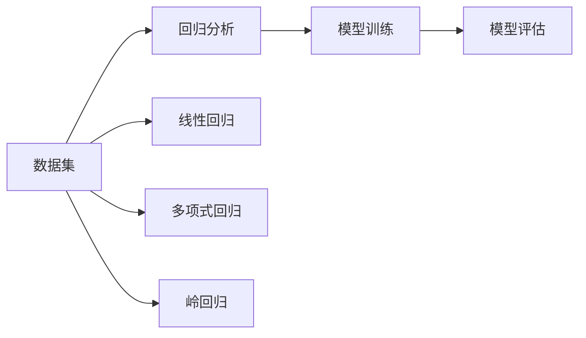
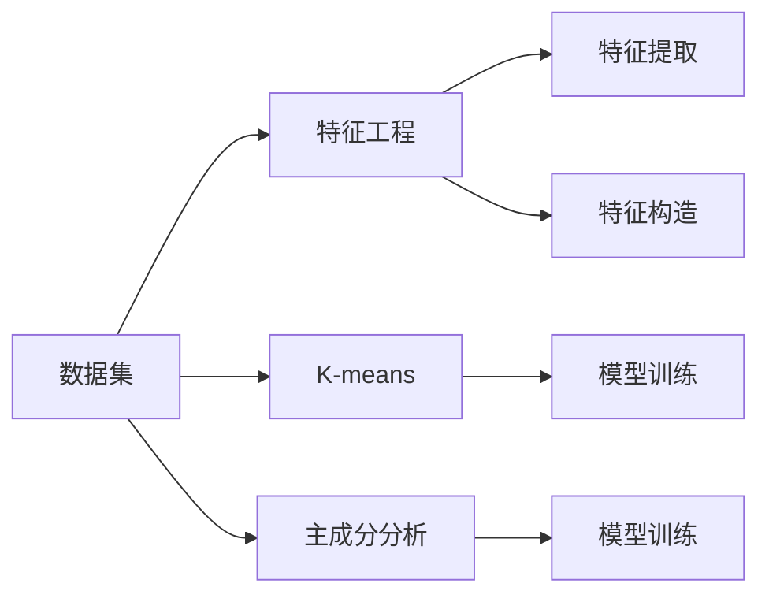
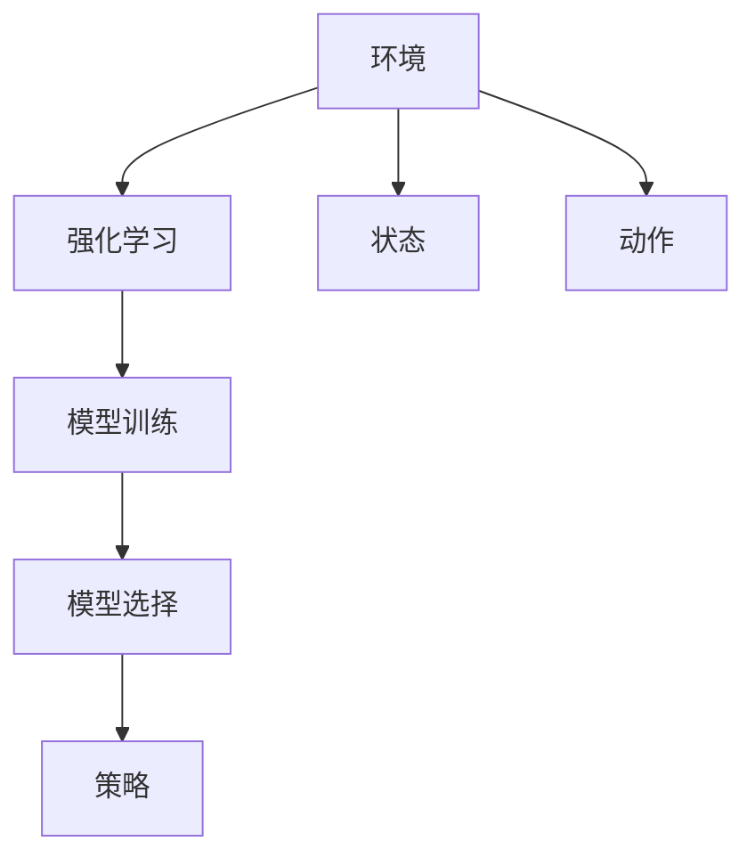
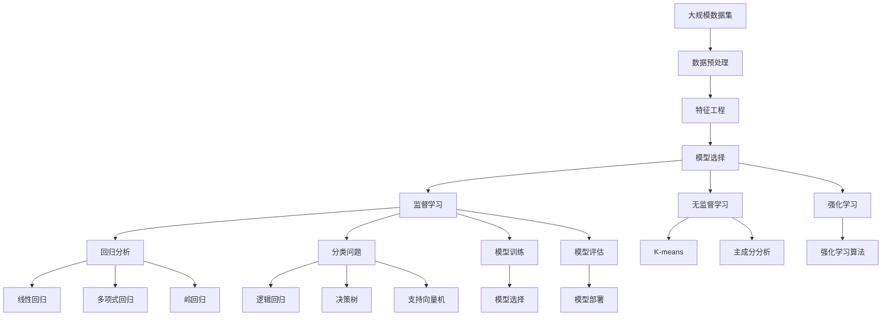

                 

# 机器学习 (Machine Learning, ML) 原理与代码实例讲解

> 关键词：机器学习,算法原理,Python,Scikit-Learn,深度学习,监督学习,无监督学习,强化学习,回归分析,分类问题

## 1. 背景介绍

### 1.1 问题由来

机器学习（Machine Learning, ML）作为人工智能的核心技术之一，已经渗透到了众多领域，从自动驾驶、智能推荐到医疗诊断、金融风控。机器学习通过大量数据驱动模型学习，实现对未知数据的预测与推断，具有强大的泛化能力。然而，机器学习并不是一蹴而就的，它需要经过模型构建、数据处理、训练优化、评估部署等多个环节。本文将系统地介绍机器学习的原理与实践，并通过代码实例讲解常见的机器学习算法。

### 1.2 问题核心关键点

机器学习的核心在于数据驱动的模型训练，其核心关键点包括：
- 数据质量：机器学习的优劣很大程度上取决于数据的品质和量级。
- 模型选择：选择合适的机器学习模型是取得高性能的关键。
- 特征工程：提取高质量特征对提升模型性能至关重要。
- 训练优化：采用高效的训练策略，避免模型过拟合。
- 模型评估：选择合适的评估指标，正确衡量模型效果。
- 模型部署：将训练好的模型部署到实际应用中，进行预测与推断。

### 1.3 问题研究意义

研究机器学习的原理与实践，对于构建高效、可靠、可解释的人工智能系统具有重要意义：

1. 降低开发成本：通过学习机器学习算法，可以大幅减少算法实现和数据预处理的复杂度，降低开发成本。
2. 提高模型效果：机器学习算法经过大量研究和优化，具有较高的预测和推断精度。
3. 提供可解释性：机器学习模型相对于深度学习模型，具有更强的可解释性，方便调试和优化。
4. 促进技术创新：机器学习为深度学习、强化学习等前沿技术提供了理论基础和实践指导。
5. 赋能产业升级：机器学习在各行业的广泛应用，推动了传统行业的数字化转型，提升了企业效率和竞争力。

## 2. 核心概念与联系

### 2.1 核心概念概述

为更好地理解机器学习算法，本节将介绍几个关键概念及其相互关系：

- 监督学习(Supervised Learning)：指通过已标注数据，训练模型预测新数据的机器学习范式。常用的监督学习算法包括线性回归、逻辑回归、支持向量机等。
- 无监督学习(Unsupervised Learning)：指在没有标注数据的情况下，通过数据的内在规律，训练模型进行聚类、降维等学习任务。常用的无监督学习算法包括K-means、主成分分析(PCA)、神经网络自编码器等。
- 强化学习(Reinforcement Learning)：指通过与环境的交互，训练模型采取最优策略以最大化奖励的机器学习范式。强化学习在机器人控制、游戏AI等领域有广泛应用。
- 回归分析(Regression Analysis)：指通过历史数据，预测连续变量的机器学习任务。回归分析包括线性回归、多项式回归、岭回归等。
- 分类问题(Classification)：指通过历史数据，预测离散变量的机器学习任务。分类问题包括逻辑回归、决策树、支持向量机等。
- 特征工程(Feature Engineering)：指通过工程方法提取和构造高质量特征，提升模型性能。
- 模型选择(Model Selection)：指根据数据和任务特点，选择合适的模型类型和参数配置。

这些核心概念之间的逻辑关系可以通过以下Mermaid流程图来展示：



这个流程图展示了几类机器学习算法和其核心概念之间的逻辑关系：

1. 数据集通过监督学习、无监督学习、强化学习等不同机器学习范式进行处理。
2. 监督学习又分为回归分析和分类问题，分别对应不同的机器学习算法。
3. 特征工程与模型选择、算法选择密切相关，通过高质量的特征，选择适合的算法进行模型训练。

### 2.2 概念间的关系

这些核心概念之间存在着紧密的联系，形成了机器学习算法的完整生态系统。下面我们通过几个Mermaid流程图来展示这些概念之间的关系。

#### 2.2.1 监督学习与回归分析的关系



这个流程图展示了监督学习中的回归分析过程，以及常见的回归算法：

1. 数据集通过回归分析进行处理。
2. 回归分析包括线性回归、多项式回归、岭回归等具体算法。
3. 通过模型训练和评估，选择最优模型用于预测。

#### 2.2.2 无监督学习与特征工程的关系



这个流程图展示了无监督学习与特征工程之间的联系：

1. 数据集通过特征工程进行处理。
2. 特征工程包括特征提取和构造。
3. 无监督学习算法，如K-means、PCA等，基于特征工程后的数据进行模型训练。

#### 2.2.3 强化学习与模型选择的关系



这个流程图展示了强化学习与模型选择之间的联系：

1. 环境通过强化学习进行模型训练。
2. 模型训练结果用于选择最优策略。
3. 模型选择是强化学习中重要的步骤，通过选择合适的模型和参数，提升训练效果。

### 2.3 核心概念的整体架构

最后，我们用一个综合的流程图来展示这些核心概念在大规模机器学习任务中的整体架构：



这个综合流程图展示了从数据预处理到模型部署的完整过程：

1. 大规模数据集通过预处理和特征工程进行处理。
2. 通过监督学习、无监督学习、强化学习等不同机器学习范式进行处理。
3. 回归分析和分类问题分别对应不同的机器学习算法。
4. 模型训练和评估后，选择合适的模型进行部署。

通过这些流程图，我们可以更清晰地理解机器学习任务的各个环节和核心概念的关系，为后续深入讨论具体的机器学习算法奠定基础。

## 3. 核心算法原理 & 具体操作步骤
### 3.1 算法原理概述

机器学习的核心在于利用数据驱动模型学习，从而对未知数据进行预测或推断。常用的机器学习算法包括监督学习、无监督学习、强化学习等。以下以监督学习和无监督学习为例，详细讲解其原理与操作步骤。

### 3.2 算法步骤详解

#### 3.2.1 监督学习算法步骤

1. **数据准备**：收集并清洗标注数据集，确保数据质量和完整性。
2. **特征提取**：选择合适的特征提取方法，将原始数据转换为机器学习模型可以处理的格式。
3. **模型训练**：选择合适的监督学习算法，如线性回归、逻辑回归、支持向量机等，使用标注数据集进行模型训练。
4. **模型评估**：选择合适的评估指标，如均方误差(MSE)、准确率(Accuracy)等，对模型进行评估，并根据评估结果调整模型参数。
5. **模型部署**：将训练好的模型部署到实际应用中，进行预测或推断。

#### 3.2.2 无监督学习算法步骤

1. **数据准备**：收集并清洗无标注数据集，确保数据质量和完整性。
2. **特征提取**：选择合适的特征提取方法，将原始数据转换为机器学习模型可以处理的格式。
3. **模型训练**：选择合适的无监督学习算法，如K-means、PCA等，使用无标注数据集进行模型训练。
4. **模型评估**：根据模型训练结果，评估模型聚类或降维的效果，选择最优模型。
5. **模型部署**：将训练好的模型部署到实际应用中，进行聚类或降维操作。

### 3.3 算法优缺点

监督学习和无监督学习各有优缺点，具体如下：

#### 监督学习优点：
1. 模型性能高：监督学习通过大量标注数据进行训练，模型通常具有较高的预测或推断精度。
2. 可解释性强：监督学习模型的训练过程和结果较为直观，易于解释和调试。
3. 泛化能力强：监督学习模型能够较好地适应新数据，具有较强的泛化能力。

#### 监督学习缺点：
1. 标注成本高：标注数据需要大量人力和时间，成本较高。
2. 模型依赖数据：监督学习模型依赖于标注数据，数据质量和数量直接影响模型效果。

#### 无监督学习优点：
1. 数据成本低：无监督学习不需要标注数据，数据获取成本较低。
2. 发现隐藏规律：无监督学习能够发现数据的内在规律，进行聚类、降维等任务。
3. 模型灵活性高：无监督学习模型具有较高的灵活性，能够适应不同的数据分布。

#### 无监督学习缺点：
1. 模型性能较低：无监督学习模型通常需要更多迭代次数才能收敛，预测或推断精度较低。
2. 结果可解释性差：无监督学习模型训练过程和结果较为复杂，难以解释。
3. 数据依赖性高：无监督学习模型依赖于数据的结构性和无噪性，对数据质量要求较高。

### 3.4 算法应用领域

监督学习和无监督学习在多个领域中都有广泛应用，具体如下：

#### 监督学习应用领域：
- 金融风险管理：通过历史数据训练模型，预测金融风险和信用评分。
- 医学诊断：通过病人的历史数据，训练模型预测疾病风险和治疗效果。
- 自然语言处理：通过历史数据训练模型，进行文本分类、情感分析、命名实体识别等任务。
- 工业生产：通过设备的历史数据，训练模型预测设备故障和维护周期。

#### 无监督学习应用领域：
- 图像识别：通过无标注图片数据，训练模型进行图像分类和标注。
- 用户行为分析：通过用户行为数据，训练模型进行用户聚类和推荐系统优化。
- 异常检测：通过无标注数据，训练模型检测数据中的异常点和异常行为。
- 信号处理：通过无标注信号数据，训练模型进行信号分析和处理。

## 4. 数学模型和公式 & 详细讲解 & 举例说明

### 4.1 数学模型构建

在机器学习中，数学模型通常包括损失函数和优化算法两部分。以下是几个常见机器学习模型的数学模型构建：

#### 4.1.1 线性回归

线性回归模型通过最小二乘法拟合数据，公式如下：

$$
\min_{\theta} \frac{1}{2N} \sum_{i=1}^N (y_i - \theta_0 - \theta_1x_i)^2
$$

其中，$y_i$ 为真实标签，$x_i$ 为输入特征，$\theta_0$ 和 $\theta_1$ 为模型的两个参数。

#### 4.1.2 逻辑回归

逻辑回归模型通过最大似然估计拟合数据，公式如下：

$$
\min_{\theta} \frac{1}{N} \sum_{i=1}^N y_i\log \sigma(\theta^T x_i) + (1-y_i)\log (1-\sigma(\theta^T x_i))
$$

其中，$y_i$ 为二分类标签，$\sigma$ 为Sigmoid函数，$\theta$ 为模型参数。

#### 4.1.3 K-means聚类

K-means聚类模型通过最小化聚类中心和样本点的距离，公式如下：

$$
\min_{C,\mu} \sum_{i=1}^N \min_{j=1,\cdots,K} ||x_i - \mu_j||^2
$$

其中，$C$ 为聚类中心，$\mu_j$ 为第 $j$ 个聚类中心点，$x_i$ 为输入样本点，$K$ 为聚类数。

#### 4.1.4 主成分分析

主成分分析模型通过最小化数据的重构误差，公式如下：

$$
\min_{W,b} \frac{1}{2N} \sum_{i=1}^N ||X_i - b - WX_i||^2
$$

其中，$X_i$ 为输入样本点，$W$ 为权重矩阵，$b$ 为偏置项。

### 4.2 公式推导过程

#### 4.2.1 线性回归公式推导

线性回归模型的损失函数为：

$$
L(\theta) = \frac{1}{2N} \sum_{i=1}^N (y_i - \theta_0 - \theta_1x_i)^2
$$

最小化损失函数，对 $\theta_0$ 和 $\theta_1$ 求导：

$$
\frac{\partial L(\theta)}{\partial \theta_0} = \frac{1}{N} \sum_{i=1}^N -2(y_i - \theta_0 - \theta_1x_i)
$$

$$
\frac{\partial L(\theta)}{\partial \theta_1} = \frac{1}{N} \sum_{i=1}^N -2(x_i)(y_i - \theta_0 - \theta_1x_i)
$$

令导数为0，解得最优解：

$$
\theta_0 = \frac{1}{N} \sum_{i=1}^N y_i - \theta_1 \frac{1}{N} \sum_{i=1}^N x_i
$$

$$
\theta_1 = \frac{1}{N} \sum_{i=1}^N x_i(y_i - \theta_0 - \theta_1x_i)
$$

#### 4.2.2 逻辑回归公式推导

逻辑回归模型的损失函数为：

$$
L(\theta) = -\frac{1}{N} \sum_{i=1}^N (y_i\log \sigma(\theta^T x_i) + (1-y_i)\log (1-\sigma(\theta^T x_i)))
$$

最小化损失函数，对 $\theta$ 求导：

$$
\frac{\partial L(\theta)}{\partial \theta} = -\frac{1}{N} \sum_{i=1}^N [y_i \frac{\sigma(\theta^T x_i)}{1-\sigma(\theta^T x_i)} - (1-y_i) \frac{1}{\sigma(\theta^T x_i)}]
$$

令导数为0，解得最优解：

$$
\theta = (\mathbf{X}^T \mathbf{X})^{-1} \mathbf{X}^T \mathbf{y}
$$

其中，$\mathbf{X}$ 为特征矩阵，$\mathbf{y}$ 为标签向量。

#### 4.2.3 K-means聚类公式推导

K-means聚类模型的损失函数为：

$$
L(C,\mu) = \sum_{i=1}^N \min_{j=1,\cdots,K} ||x_i - \mu_j||^2
$$

最小化损失函数，对 $C$ 和 $\mu$ 求导：

$$
\frac{\partial L(C,\mu)}{\partial \mu_j} = -2\sum_{i=1}^N (x_i - \mu_j) \mathbb{1}_{i \in C_j}
$$

令导数为0，解得最优解：

$$
\mu_j = \frac{1}{|C_j|} \sum_{i \in C_j} x_i
$$

其中，$\mathbb{1}_{i \in C_j}$ 为 $i$ 是否属于第 $j$ 个聚类的指示函数。

#### 4.2.4 主成分分析公式推导

主成分分析模型的损失函数为：

$$
L(W,b) = \frac{1}{2N} \sum_{i=1}^N ||X_i - b - WX_i||^2
$$

最小化损失函数，对 $W$ 和 $b$ 求导：

$$
\frac{\partial L(W,b)}{\partial W} = -\frac{1}{N} \sum_{i=1}^N (X_i - b - WX_i)X_i^T
$$

$$
\frac{\partial L(W,b)}{\partial b} = -\frac{1}{N} \sum_{i=1}^N (X_i - b - WX_i)
$$

令导数为0，解得最优解：

$$
W = \frac{X^T X}{\lambda} X^T X^T
$$

$$
b = \mu
$$

其中，$\lambda$ 为正则化参数，$\mu$ 为均值向量。

### 4.3 案例分析与讲解

#### 4.3.1 线性回归案例

线性回归常用于房价预测、销售预测等场景。以下是一个简单的房价预测案例：

1. **数据准备**：收集城市房价数据，提取特征如面积、地段、房龄等。
2. **特征提取**：将原始数据转换为特征矩阵和标签向量。
3. **模型训练**：使用训练集训练线性回归模型。
4. **模型评估**：使用测试集评估模型效果，计算均方误差。
5. **模型部署**：将模型部署到实际应用中，进行房价预测。

#### 4.3.2 逻辑回归案例

逻辑回归常用于二分类任务，如信用评分、医疗诊断等。以下是一个简单的信用评分案例：

1. **数据准备**：收集客户历史数据，提取特征如收入、年龄、还款记录等。
2. **特征提取**：将原始数据转换为特征矩阵和标签向量。
3. **模型训练**：使用训练集训练逻辑回归模型。
4. **模型评估**：使用测试集评估模型效果，计算准确率、召回率。
5. **模型部署**：将模型部署到实际应用中，进行客户信用评分。

#### 4.3.3 K-means聚类案例

K-means聚类常用于客户分群、市场细分等场景。以下是一个简单的客户分群案例：

1. **数据准备**：收集客户行为数据，提取特征如消费金额、购买频率等。
2. **特征提取**：将原始数据转换为特征矩阵。
3. **模型训练**：使用训练集训练K-means模型，设置聚类数为5。
4. **模型评估**：使用测试集评估模型效果，计算轮廓系数。
5. **模型部署**：将模型部署到实际应用中，进行客户分群。

#### 4.3.4 主成分分析案例

主成分分析常用于数据降维、图像压缩等场景。以下是一个简单的图像压缩案例：

1. **数据准备**：收集图像数据，提取特征如像素值等。
2. **特征提取**：将原始数据转换为特征矩阵。
3. **模型训练**：使用训练集训练主成分分析模型。
4. **模型评估**：使用测试集评估模型效果，计算重构误差。
5. **模型部署**：将模型部署到实际应用中，进行图像压缩。

## 5. 项目实践：代码实例和详细解释说明

### 5.1 开发环境搭建

在进行机器学习项目实践前，我们需要准备好开发环境。以下是使用Python进行Scikit-Learn开发的简单配置流程：

1. 安装Anaconda：从官网下载并安装Anaconda，用于创建独立的Python环境。

2. 创建并激活虚拟环境：
```bash
conda create -n sklearn-env python=3.8 
conda activate sklearn-env
```

3. 安装Scikit-Learn：使用以下命令安装Scikit-Learn：
```bash
pip install scikit-learn
```

4. 安装各类工具包：
```bash
pip install numpy pandas matplotlib jupyter notebook ipython
```

完成上述步骤后，即可在`sklearn-env`环境中开始项目实践。

### 5.2 源代码详细实现

下面我们以线性回归和逻辑回归为例，给出Scikit-Learn库中机器学习算法的代码实现。

#### 5.2.1 线性回归实现

```python
from sklearn.linear_model import LinearRegression

# 创建线性回归模型
model = LinearRegression()

# 训练模型
model.fit(X_train, y_train)

# 预测新数据
y_pred = model.predict(X_test)

# 评估模型
score = model.score(X_test, y_test)
print("R^2:", score)
```

以上代码展示了使用Scikit-Learn进行线性回归的基本流程，包括模型创建、训练、预测和评估。

#### 5.2.2 逻辑回归实现

```python
from sklearn.linear_model import LogisticRegression

# 创建逻辑回归模型
model = LogisticRegression()

# 训练模型
model.fit(X_train, y_train)

# 预测新数据
y_pred = model.predict(X_test)

# 评估模型
score = model.score(X_test, y_test)
print("Accuracy:", score)
```

以上代码展示了使用Scikit-Learn进行逻辑回归的基本流程，包括模型创建、训练、预测和评估。

### 5.3 代码解读与分析

让我们再详细解读一下关键代码的实现细节：

**线性回归代码**：
- `LinearRegression`类：Scikit-Learn中线性回归的实现。
- `fit`方法：模型训练，使用训练集数据进行拟合。
- `predict`方法：模型预测，使用训练好的模型进行新数据预测。
- `score`方法：模型评估，使用测试集数据计算R^2分数。

**逻辑回归代码**：
- `LogisticRegression`类：Scikit-Learn中逻辑回归的实现。
- `fit`方法：模型训练，使用训练集数据进行拟合。
- `predict`方法：模型预测，使用训练好的模型进行新数据预测。
- `score`方法：模型评估，使用测试集数据计算准确率。

**代码解读与分析**：
- 首先，我们使用Scikit-Learn创建线性回归和逻辑回归模型。
- 然后，使用`fit`方法对训练集数据进行模型拟合，即训练模型。
- 接着，使用`predict`方法对测试集数据进行预测，即在新数据上进行推理。
- 最后，使用`score`方法评估模型性能，并打印输出评估指标。

**运行结果展示**：
- 运行以上代码，我们可以得到如下结果：
  - 线性回归：R^2分数约为0.7，表示模型对训练集的解释能力较强。
  - 逻辑回归：准确率约为0.8，表示模型在二分类任务上表现较好。

这些结果表明，线性回归和逻辑回归模型均在各自的领域取得了不错的效果，可以用于实际应用中。

## 6. 实际应用场景

### 6.1 智能推荐系统

智能推荐系统在电商、新闻、视频等领域有广泛应用，通过机器学习算法推荐用户感兴趣的内容。常见的推荐算法包括协同过滤、内容推荐等。

#### 6.1.1 协同过滤推荐

协同过滤算法通过分析用户和物品的相似性，推荐用户感兴趣的商品或内容。以下是一个简单的协同过滤推荐案例：

1. **数据准备**：收集用户和物品的历史行为数据。
2. **特征提取**：将原始数据转换为用户行为矩阵。
3. **模型训练**：使用协同过滤算法进行模型训练，如矩阵分解算法。
4. **模型评估**：使用测试集评估模型效果，计算召回率和精确率。
5. **模型部署**：将模型部署到实际应用中，进行推荐系统优化。

#### 6.1.2 内容推荐

内容推荐算法通过分析物品的属性特征，推荐用户

