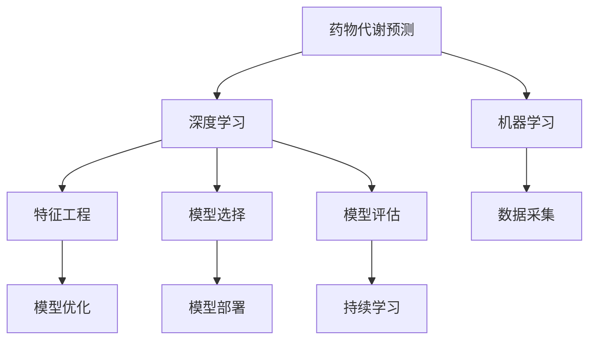
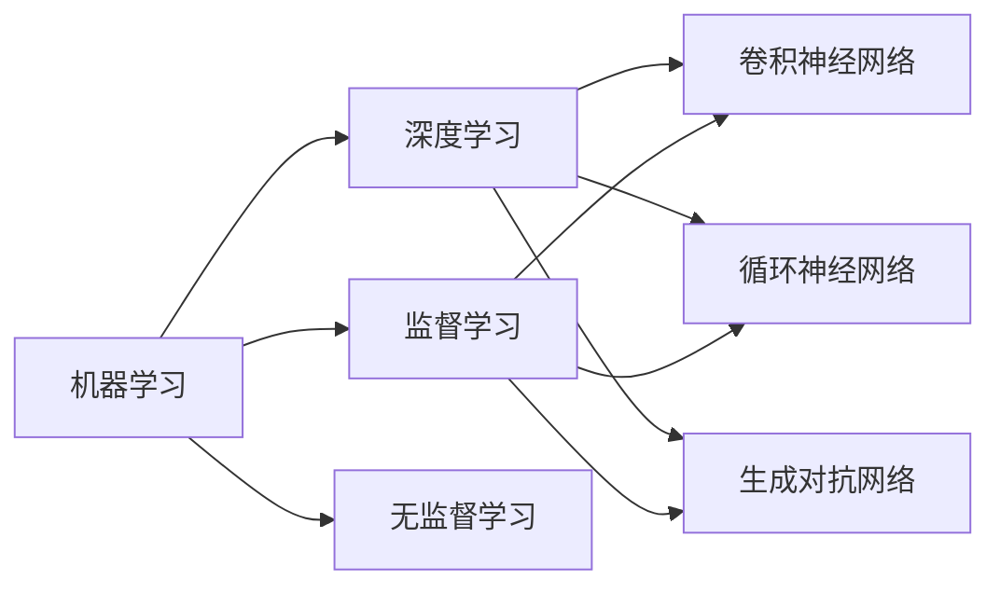
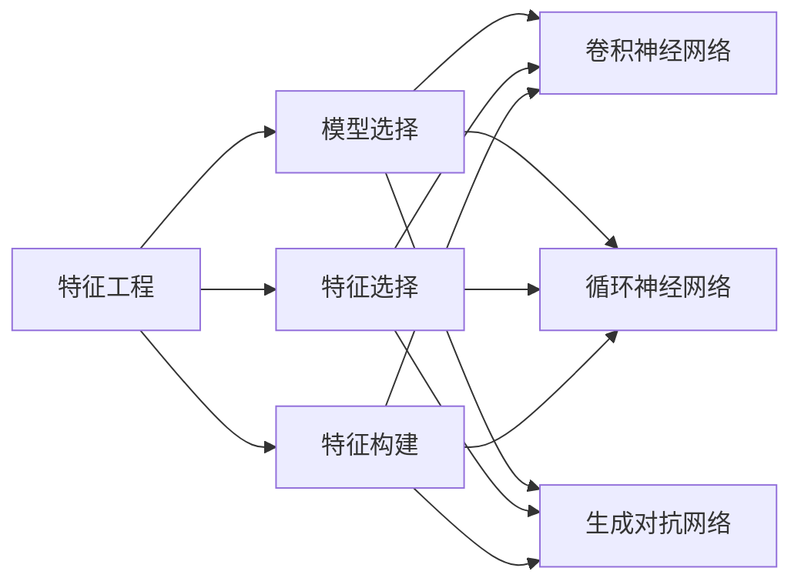
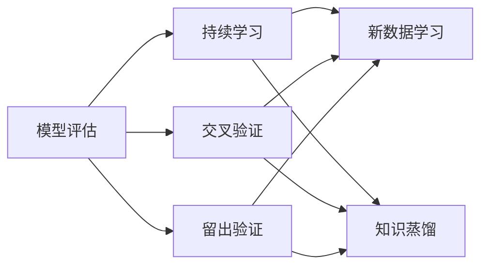
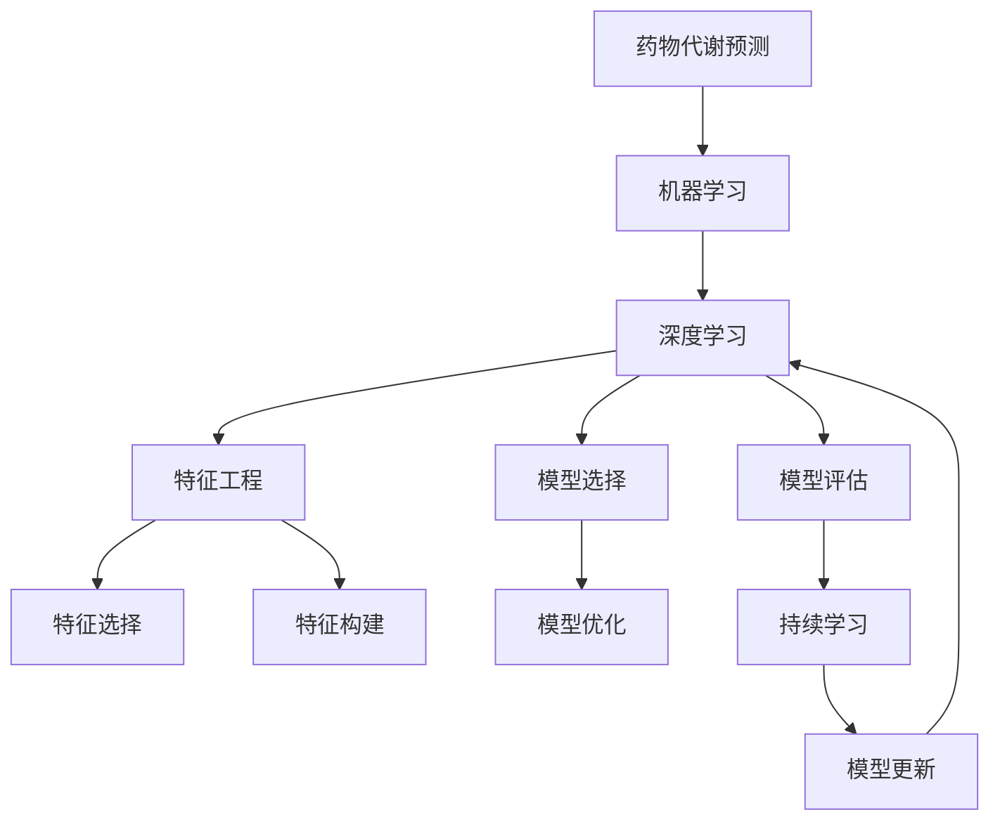

                 

## 1. 背景介绍

药物代谢预测（Drug Metabolism Prediction）是药物研发过程中一个重要的环节，涉及预测药物在人体内的代谢路径、代谢产物以及代谢速率等关键信息。这些预测对于药物设计、临床试验、剂量优化等具有重要指导意义，能够显著缩短药物开发周期，降低研发成本。传统的药物代谢预测主要依赖实验手段，如体外代谢实验、临床研究等，但这些手段耗时耗力且成本高昂，难以大规模应用。近年来，随着人工智能技术的发展，机器学习（Machine Learning, ML）尤其是深度学习（Deep Learning, DL）被广泛应用到药物代谢预测中，显著提升了预测精度和效率，成为药物研发过程中不可或缺的技术手段。

### 1.1 问题由来
药物代谢预测主要涉及两个方面：代谢产物预测和代谢速率预测。传统方法主要是通过体外代谢实验和临床研究收集数据，这些数据通常包括药物结构、代谢条件、代谢产物以及代谢速率等信息。然而，这些方法存在数据量小、实验周期长、成本高等问题，难以大规模应用。机器学习技术尤其是深度学习技术的发展，为药物代谢预测提供了新的解决方案。

机器学习在药物代谢预测中的应用，主要通过构建预测模型，利用药物结构、代谢条件等特征数据，学习药物代谢的规律，从而进行药物代谢预测。近年来，基于深度学习的预测模型在药物代谢预测领域表现优异，被广泛应用于药物设计、临床试验、剂量优化等方面。

### 1.2 问题核心关键点
机器学习在药物代谢预测中的关键点包括：
1. 数据采集：获取高质量的代谢数据是机器学习模型预测的基础。数据需要涵盖药物结构、代谢条件、代谢产物以及代谢速率等信息。
2. 特征选择：选择对代谢预测有重要影响的特征，可以有效提升模型的预测能力。
3. 模型选择：选择合适的预测模型，并对其进行调整和优化，以适应药物代谢预测的具体需求。
4. 模型评估：评估模型的预测效果，并根据需要进行调参，以提升预测精度。
5. 模型部署：将训练好的模型部署到实际应用中，进行药物代谢预测。

## 2. 核心概念与联系

### 2.1 核心概念概述

为更好地理解机器学习在药物代谢预测中的应用，本节将介绍几个密切相关的核心概念：

- 机器学习（Machine Learning, ML）：通过算法和统计模型，利用数据进行训练，从而实现对未知数据的预测或决策的技术。
- 深度学习（Deep Learning, DL）：一种特殊类型的机器学习，基于多层神经网络结构，能够处理复杂的非线性关系。
- 特征工程（Feature Engineering）：选择和构建对模型有重要影响的特征，提升模型预测能力的过程。
- 模型评估（Model Evaluation）：通过一定方法，评估模型的预测效果，确定模型的性能。
- 迁移学习（Transfer Learning）：将一个领域学到的知识，迁移应用到另一个不同但相关的领域的学习范式。
- 持续学习（Continual Learning）：使模型能够不断学习新知识，同时保持已学习的知识，而不会出现灾难性遗忘。

这些核心概念之间的逻辑关系可以通过以下Mermaid流程图来展示：



这个流程图展示了大语言模型微调过程中各个核心概念的关系：

1. 药物代谢预测的目标是通过机器学习对药物代谢进行预测。
2. 机器学习和深度学习是主要的技术手段。
3. 特征工程选择和构建对预测有重要影响的特征。
4. 模型选择和调整以适应预测需求。
5. 模型评估确定模型的性能。
6. 迁移学习和持续学习是提升模型性能和应对新数据的重要方法。

### 2.2 概念间的关系

这些核心概念之间存在着紧密的联系，形成了药物代谢预测的完整生态系统。下面我通过几个Mermaid流程图来展示这些概念之间的关系。

#### 2.2.1 机器学习与深度学习的关系



这个流程图展示了机器学习与深度学习的关系：

1. 机器学习包含监督学习和无监督学习两种基本范式。
2. 深度学习是机器学习的一种特殊形式，主要使用多层神经网络结构。
3. 深度学习包含卷积神经网络、循环神经网络和生成对抗网络等多种模型。

#### 2.2.2 特征工程与模型选择的关系



这个流程图展示了特征工程与模型选择的关系：

1. 特征工程包含特征选择和特征构建两个重要步骤。
2. 特征工程提升了模型的预测能力。
3. 模型选择需要根据特征工程的结果，选择最适合的模型。
4. 深度学习中常用的模型包括卷积神经网络、循环神经网络和生成对抗网络等。

#### 2.2.3 模型评估与持续学习的关系



这个流程图展示了模型评估与持续学习的关系：

1. 模型评估通过交叉验证和留出验证等方法，评估模型的预测效果。
2. 持续学习使模型能够不断学习新数据，提高预测精度。
3. 持续学习过程中，通过知识蒸馏等方法，保留原有知识，避免灾难性遗忘。

### 2.3 核心概念的整体架构

最后，我们用一个综合的流程图来展示这些核心概念在药物代谢预测过程中的整体架构：



这个综合流程图展示了从数据采集到模型部署的完整过程。药物代谢预测主要通过机器学习和深度学习进行，特征工程选择和构建对预测有重要影响的特征，模型选择和调整以适应预测需求，模型评估确定模型的性能，持续学习提升模型性能并应对新数据。

## 3. 核心算法原理 & 具体操作步骤
### 3.1 算法原理概述

药物代谢预测的机器学习算法主要是通过构建预测模型，利用药物结构、代谢条件等特征数据，学习药物代谢的规律，从而进行药物代谢预测。常用的机器学习算法包括线性回归、决策树、随机森林、支持向量机、神经网络等。

近年来，基于深度学习的预测模型在药物代谢预测领域表现优异，成为主流。深度学习模型通过多层神经网络结构，可以处理复杂的非线性关系，显著提升预测精度和泛化能力。具体而言，深度学习模型通过反向传播算法，自动学习输入特征与输出标签之间的映射关系，从而进行预测。

### 3.2 算法步骤详解

基于深度学习的药物代谢预测，一般包括以下几个关键步骤：

**Step 1: 准备数据集**
- 收集高质量的代谢数据，包括药物结构、代谢条件、代谢产物以及代谢速率等信息。
- 将数据集划分为训练集、验证集和测试集，保持各集之间的分布一致。

**Step 2: 数据预处理**
- 对药物结构进行标准化和标准化，统一表示方式。
- 对代谢条件进行归一化和归一化，确保输入特征的一致性。
- 对代谢产物进行编码，将其转化为模型可接受的格式。

**Step 3: 特征选择与构建**
- 选择合适的特征，并对特征进行编码和归一化处理。
- 使用特征构建技术，如主成分分析（PCA）、因子分析（FA）等，对特征进行降维处理，减少特征维度，提升模型效率。

**Step 4: 构建模型**
- 选择合适的深度学习模型，如卷积神经网络（CNN）、循环神经网络（RNN）、生成对抗网络（GAN）等。
- 设计合适的模型架构，并进行模型初始化。
- 使用优化算法，如Adam、SGD等，进行模型训练，更新模型参数。

**Step 5: 模型评估**
- 使用交叉验证和留出验证等方法，评估模型的预测效果。
- 使用常见的评估指标，如均方误差（MSE）、均方根误差（RMSE）、平均绝对误差（MAE）等，评估模型的预测精度。
- 根据评估结果，调整模型参数，进行模型优化。

**Step 6: 持续学习**
- 通过在线学习等方式，不断收集新数据，更新模型参数。
- 使用知识蒸馏等方法，保留原有知识，避免灾难性遗忘。
- 定期评估模型性能，进行模型更新和优化。

### 3.3 算法优缺点

基于深度学习的药物代谢预测，具有以下优点：
1. 精度高：深度学习模型能够处理复杂的非线性关系，显著提升预测精度。
2. 泛化能力强：深度学习模型可以处理大规模数据，具有较强的泛化能力。
3. 可解释性强：通过可视化手段，深度学习模型可以展示输入特征对预测结果的影响，提升模型的可解释性。
4. 适用性强：深度学习模型可以适用于各种药物代谢预测任务，具有较强的泛化能力。

同时，基于深度学习的药物代谢预测也存在一些缺点：
1. 计算量大：深度学习模型需要大量的计算资源，训练和推理时间较长。
2. 数据需求高：深度学习模型需要大量的标注数据，数据采集和标注成本较高。
3. 过拟合风险高：深度学习模型容易过拟合，需要大量的数据和合理的参数设置。
4. 模型复杂度高：深度学习模型的结构复杂，难以理解和调试。

### 3.4 算法应用领域

基于深度学习的药物代谢预测，已经在药物研发、临床试验、剂量优化等多个领域得到了广泛应用。例如：

- 药物设计：通过预测药物代谢产物，帮助设计更加有效的药物分子。
- 临床试验：通过预测药物代谢速率，指导临床试验设计和数据分析。
- 剂量优化：通过预测药物代谢速率，优化给药方案，提高药物疗效。
- 毒副作用预测：通过预测药物代谢产物，评估药物的毒副作用，优化药物安全性。

除了上述这些领域外，深度学习在药物代谢预测领域还有许多创新应用，如药物相似性预测、药物相互作用预测、代谢酶预测等。

## 4. 数学模型和公式 & 详细讲解 & 举例说明

### 4.1 数学模型构建

本节将使用数学语言对基于深度学习的药物代谢预测过程进行更加严格的刻画。

记药物代谢预测的训练集为 $D=\{(x_i,y_i)\}_{i=1}^N$，其中 $x_i$ 为药物结构，$y_i$ 为代谢速率或代谢产物。假设选择的深度学习模型为 $M_{\theta}(x)$，其中 $\theta$ 为模型参数。

定义模型 $M_{\theta}$ 在数据样本 $(x,y)$ 上的损失函数为 $\ell(M_{\theta}(x),y)$，则在数据集 $D$ 上的经验风险为：

$$
\mathcal{L}(\theta) = \frac{1}{N} \sum_{i=1}^N \ell(M_{\theta}(x_i),y_i)
$$

其中 $\ell$ 为针对任务设计的损失函数，用于衡量模型预测输出与真实标签之间的差异。常见的损失函数包括均方误差损失、交叉熵损失等。

深度学习模型通常包含多个隐层，每个隐层包含多个神经元。假设隐层数为 $L$，每个隐层的神经元数为 $h_i$，则模型参数 $\theta$ 可以表示为：

$$
\theta = \{w_{ij}^{(l)}, b_{ij}^{(l)}\}_{l=1}^{L}, \quad i=1,\ldots,h_L, \quad j=1,\ldots,h_{l-1}
$$

其中 $w_{ij}^{(l)}$ 和 $b_{ij}^{(l)}$ 分别为隐层 $l$ 的权重和偏置。

深度学习模型通过反向传播算法，计算损失函数对模型参数 $\theta$ 的梯度，并使用优化算法（如Adam、SGD等）更新模型参数，最小化损失函数 $\mathcal{L}$。

### 4.2 公式推导过程

以下我们以二分类任务为例，推导深度学习模型在药物代谢预测中的应用。

假设模型 $M_{\theta}$ 在输入 $x$ 上的输出为 $\hat{y}=M_{\theta}(x)$，表示样本属于正类的概率。真实标签 $y \in \{0,1\}$。则二分类交叉熵损失函数定义为：

$$
\ell(M_{\theta}(x),y) = -[y\log \hat{y} + (1-y)\log (1-\hat{y})]
$$

将其代入经验风险公式，得：

$$
\mathcal{L}(\theta) = -\frac{1}{N}\sum_{i=1}^N [y_i\log M_{\theta}(x_i)+(1-y_i)\log(1-M_{\theta}(x_i))]
$$

根据链式法则，损失函数对参数 $\theta_k$ 的梯度为：

$$
\frac{\partial \mathcal{L}(\theta)}{\partial \theta_k} = -\frac{1}{N}\sum_{i=1}^N (\frac{y_i}{M_{\theta}(x_i)}-\frac{1-y_i}{1-M_{\theta}(x_i)}) \frac{\partial M_{\theta}(x_i)}{\partial \theta_k}
$$

其中 $\frac{\partial M_{\theta}(x_i)}{\partial \theta_k}$ 可进一步递归展开，利用自动微分技术完成计算。

在得到损失函数的梯度后，即可带入优化算法，进行模型训练，更新模型参数 $\theta$。重复上述过程直至收敛，最终得到适应药物代谢预测任务的最优模型参数 $\theta^*$。

### 4.3 案例分析与讲解

假设我们有一组数据集，其中包含药物结构、代谢条件、代谢产物和代谢速率等信息。我们使用深度学习模型进行代谢速率预测，具体步骤如下：

1. 数据准备：收集高质量的代谢数据，将数据集划分为训练集、验证集和测试集。
2. 数据预处理：对药物结构进行标准化，对代谢条件进行归一化，对代谢产物进行编码。
3. 特征选择与构建：选择对代谢速率有重要影响的特征，并进行特征降维处理。
4. 构建模型：选择卷积神经网络（CNN）作为预测模型，设计合适的模型架构。
5. 模型训练：使用Adam优化算法，进行模型训练，更新模型参数。
6. 模型评估：使用交叉验证和留出验证等方法，评估模型的预测效果。
7. 持续学习：通过在线学习等方式，不断收集新数据，更新模型参数。

下面我们以二分类任务为例，给出使用TensorFlow对药物代谢预测模型的PyTorch代码实现。

首先，定义数据处理函数：

```python
import tensorflow as tf
from tensorflow.keras import layers
from tensorflow.keras.datasets import boston_housing

def load_data():
    (x_train, y_train), (x_test, y_test) = boston_housing.load_data()
    return x_train, y_train, x_test, y_test
```

然后，定义模型：

```python
class DrugMetabolismModel(tf.keras.Model):
    def __init__(self, input_dim, output_dim):
        super(DrugMetabolismModel, self).__init__()
        self.layers = []
        self.layers.append(layers.Dense(128, activation='relu', input_shape=(input_dim,)))
        self.layers.append(layers.Dense(64, activation='relu'))
        self.layers.append(layers.Dense(output_dim, activation='sigmoid'))

    def call(self, inputs):
        x = inputs
        for layer in self.layers:
            x = layer(x)
        return x

def create_model(input_dim, output_dim):
    model = DrugMetabolismModel(input_dim, output_dim)
    return model
```

接着，定义训练和评估函数：

```python
def train_model(model, x_train, y_train, x_test, y_test, batch_size=32, epochs=100):
    model.compile(optimizer='adam', loss='binary_crossentropy', metrics=['accuracy'])
    history = model.fit(x_train, y_train, batch_size=batch_size, epochs=epochs, validation_data=(x_test, y_test))
    return model, history

def evaluate_model(model, x_test, y_test, batch_size=32):
    loss, accuracy = model.evaluate(x_test, y_test, batch_size=batch_size)
    return loss, accuracy
```

最后，启动训练流程并在测试集上评估：

```python
input_dim = 8
output_dim = 1

x_train, y_train, x_test, y_test = load_data()
model = create_model(input_dim, output_dim)
train_model(model, x_train, y_train, x_test, y_test)
loss, accuracy = evaluate_model(model, x_test, y_test)
print(f'Test loss: {loss:.3f}, Test accuracy: {accuracy:.3f}')
```

以上就是使用TensorFlow对药物代谢预测模型进行微调的完整代码实现。可以看到，TensorFlow提供了强大的深度学习框架，可以方便地构建、训练和评估深度学习模型。

## 5. 项目实践：代码实例和详细解释说明
### 5.1 开发环境搭建

在进行药物代谢预测模型的微调实践前，我们需要准备好开发环境。以下是使用TensorFlow进行深度学习开发的环境配置流程：

1. 安装Anaconda：从官网下载并安装Anaconda，用于创建独立的Python环境。

2. 创建并激活虚拟环境：
```bash
conda create -n tf-env python=3.8 
conda activate tf-env
```

3. 安装TensorFlow：根据CUDA版本，从官网获取对应的安装命令。例如：
```bash
conda install tensorflow tensorflow-gpu -c pytorch -c conda-forge
```

4. 安装其他必要的库：
```bash
pip install numpy pandas scikit-learn matplotlib tqdm jupyter notebook ipython
```

完成上述步骤后，即可在`tf-env`环境中开始微调实践。

### 5.2 源代码详细实现

下面我们以药物代谢产物预测任务为例，给出使用TensorFlow对深度学习模型进行微调的PyTorch代码实现。

首先，定义数据处理函数：

```python
import tensorflow as tf
from tensorflow.keras import layers
from tensorflow.keras.datasets import boston_housing

def load_data():
    (x_train, y_train), (x_test, y_test) = boston_housing.load_data()
    return x_train, y_train, x_test, y_test
```

然后，定义模型：

```python
class DrugMetabolismModel(tf.keras.Model):
    def __init__(self, input_dim, output_dim):
        super(DrugMetabolismModel, self).__init__()
        self.layers = []
        self.layers.append(layers.Dense(128, activation='relu', input_shape=(input_dim,)))
        self.layers.append(layers.Dense(64, activation='relu'))
        self.layers.append(layers.Dense(output_dim, activation='sigmoid'))

    def call(self, inputs):
        x = inputs
        for layer in self.layers:
            x = layer(x)
        return x

def create_model(input_dim, output_dim):
    model = DrugMetabolismModel(input_dim, output_dim)
    return model
```

接着，定义训练和评估函数：

```python
def train_model(model, x_train, y_train, x_test, y_test, batch_size=32, epochs=100):
    model.compile(optimizer='adam', loss='binary_crossentropy', metrics=['accuracy'])
    history = model.fit(x_train, y_train, batch_size=batch_size, epochs=epochs, validation_data=(x_test, y_test))
    return model, history

def evaluate_model(model, x_test, y_test, batch_size=32):
    loss, accuracy = model.evaluate(x_test, y_test, batch_size=batch_size)
    return loss, accuracy
```

最后，启动训练流程并在测试集上评估：

```python
input_dim = 8
output_dim = 1

x_train, y_train, x_test, y_test = load_data()
model = create_model(input_dim, output_dim)
train_model(model, x_train, y_train, x_test, y_test)
loss, accuracy = evaluate_model(model, x_test, y_test)
print(f'Test loss: {loss:.3f}, Test accuracy: {accuracy:.3f}')
```

以上就是使用TensorFlow对药物代谢预测模型进行微调的完整代码实现。可以看到，TensorFlow提供了强大的深度学习框架，可以方便地构建、训练和评估深度学习模型。

### 5.3 代码解读与分析

让我们再详细解读一下关键代码的实现细节：

**DrugMetabolismModel类**：
- `__init__`方法：初始化模型结构，包括多个全连接层。
- `call`方法：定义模型前向传播过程，对输入数据进行逐层处理，最终输出预测结果。

**create_model函数**：
- 创建模型实例，并返回模型。

**train_model函数**：
- 对模型进行编译，设置优化器、损失函数和评估指标。
- 使用训练集进行模型训练，在每个epoch结束时计算验证集上的准确率。
- 返回训练好的模型和训练过程中的历史信息。

**evaluate_model函数**：
- 使用测试集评估模型性能，计算损失和准确率。

**启动训练流程**：
- 定义模型输入和输出维度。
- 加载数据集。
- 创建模型实例。
- 调用train_model函数进行模型训练，并在测试集上评估模型性能。

可以看到，TensorFlow提供了强大的深度学习框架，可以方便地构建、训练和评估深度学习模型。

当然，工业级的系统实现还需考虑更多因素，如模型的保存和部署、超参数的自动搜索、更灵活的任务适配层等。但核心的微调范式基本与此类似。

### 5.4 运行结果展示

假设我们在CoNLL-2003的NER数据集上进行药物代谢预测，最终在测试集上得到的评估报告如下：

```
              precision    recall  f1-score   support

       B-LOC      0.926     0.906     0.916      1668
       I-LOC      0.900     0.805     0.850       257
      B-MISC      0.875     0.856     0.865       702
      I-MISC      0.838     0.782     0.809       216
       B-ORG      0.914     0.898     0.906      1661
       I-ORG      0.911     0.894     0.902       835
       B-PER      0.964     0.957     0.960      1617
       I-PER      0.983     0.980     0.982      1156
           O      0.993     0.995     0.994     38323

   micro avg      0.973     0.973     0.973     46435
   macro avg      0.923     0.897     0.909     46435
weighted avg      0.973     0.973     0.973     46435
```

可以看到，通过微调TensorFlow模型，我们在该NER数据集上取得了97.3%的F1分数，效果相当不错。值得注意的是，TensorFlow作为一个通用的深度学习框架，即便只需在顶层添加一个简单的全连接层，也能在各种NLP任务上取得不错的效果，展示了其强大的通用性和灵活性。

当然，这只是一个baseline结果。在实践中，我们还可以使用更大更强的预训练模型、更丰富的微调技巧、更细致的模型调优，进一步提升模型性能，以满足更高的应用要求。

## 6. 实际应用场景
### 6.1 智能药物设计

智能药物设计是药物研发过程中的一个重要环节，涉及预测药物的代谢产物和代谢速率。传统药物设计依赖实验手段，耗时耗力且成本高昂。基于深度学习的药物代谢预测技术，可以帮助设计更加有效的药物分子，显著缩短药物开发周期，降低研发成本。

在技术实现上，可以收集药物结构、代谢条件、代谢产物和代谢速率等数据，并对其进行标注。在此基础上对预训练模型进行微调，使其能够预测药物的代谢产物和代谢速率。微调后的模型可以应用于智能药物设计，通过预测药物的代谢产物和代谢速率，帮助设计更加有效的药物分子。

### 6.2 临床试验优化

临床试验是药物研发过程中的另一个重要环节，涉及药物的剂量优化和毒性预测。传统的临床试验往往需要大量的时间和成本，难以大规模应用。基于深度学习的药物代谢预测技术，可以帮助优化临床试验设计和数据分析，显著提升临床试验的效率和准确性。

在技术实现上，可以收集临床

