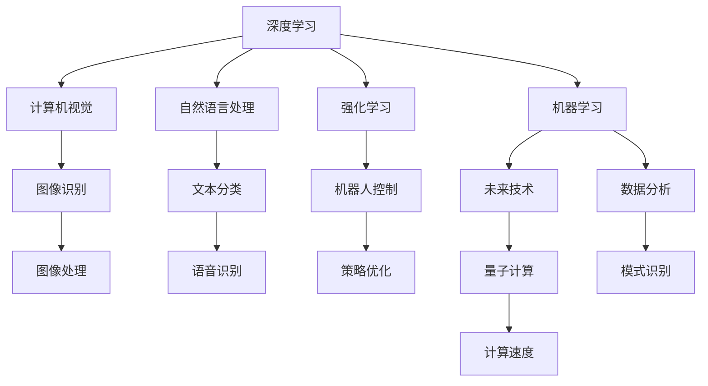

                 

# 李开复：AI 2.0 时代的应用

> 关键词：人工智能, AI 2.0, 深度学习, 机器学习, 计算机视觉, 自然语言处理, 强化学习, 未来技术, 应用场景

## 1. 背景介绍

### 1.1 问题的由来
自上世纪80年代以来，人工智能(AI)已经经历了几十年的发展，从早期的专家系统、统计学习、神经网络，到最近几年的深度学习、强化学习、自然语言处理，AI技术的进步如火如荼，并且正逐渐渗透到各个行业和领域。进入21世纪，AI技术的发展迎来了质的飞跃，深度学习和计算能力的大幅提升，使得AI应用进入了全新的AI 2.0时代。

AI 2.0时代，AI不再只是用于科学研究或企业内部的创新项目，而是全面应用于社会生活的各个层面，从医疗、金融、教育、交通、娱乐到日常消费品，AI无处不在。AI技术的广泛应用，不仅提高了效率，改变了商业模式，还推动了社会进步。

### 1.2 问题的核心关键点
AI 2.0时代的关键在于如何更高效、更广泛地应用AI技术，使得AI真正服务于人类社会，提升生活质量。AI 2.0时代的应用核心包括以下几个方面：

1. **深度学习和机器学习的普及**：通过算法和技术的进步，深度学习和机器学习变得更容易使用，可以应用于更多场景。

2. **计算能力的提升**：高性能计算资源（如GPU、TPU等）的普及，使得大规模数据训练和模型优化成为可能。

3. **数据和基础设施的完善**：数据收集、处理、存储技术的进步，为AI技术提供了更丰富的数据源和更强大的基础设施。

4. **跨学科融合**：AI与其他学科（如医学、心理学、经济学等）的融合，推动了跨领域的应用创新。

5. **伦理和社会责任**：在AI应用中，如何平衡技术进步和社会责任，保障数据隐私和安全，是AI发展过程中需要特别注意的问题。

### 1.3 问题研究的意义
在AI 2.0时代，人工智能技术的应用不仅是技术问题，更是社会问题。AI应用的广泛性和深入性，使得其对社会的各个方面都有深远影响。研究AI 2.0时代的应用，对于推动AI技术的进一步发展，提升AI应用的质量和效率，促进社会进步具有重要意义：

1. **提升生活品质**：AI可以应用于医疗、教育、娱乐等领域，提高效率，降低成本，提升生活质量。

2. **推动产业升级**：AI技术可以推动传统行业的数字化转型，提升企业竞争力，推动经济增长。

3. **促进科学研究**：AI技术可以加速科学研究进程，发现新的知识，推动科学进步。

4. **改善社会治理**：AI可以应用于城市管理、公共安全、社会福利等领域，提升政府管理水平，改善社会治理。

5. **保障数据安全**：AI技术可以用于数据保护和隐私保护，防范数据泄露和滥用。

## 2. 核心概念与联系

### 2.1 核心概念概述
在AI 2.0时代，人工智能应用的本质是通过深度学习和机器学习技术，构建高效、智能、适应性强的模型，应用于各种实际场景。这些核心概念构成了AI 2.0时代应用的基石：

- **深度学习**：一种基于多层神经网络的机器学习方法，具有强大的特征学习和表示能力，广泛应用于图像识别、自然语言处理、语音识别等领域。

- **机器学习**：通过数据训练模型，实现对数据的预测、分类、聚类等任务。

- **计算机视觉**：利用计算机技术，实现对图像和视频的理解和分析。

- **自然语言处理**：通过算法和模型，实现对自然语言的理解、生成、翻译等任务。

- **强化学习**：通过与环境的交互，模型在不断试错中学习最优策略，应用于游戏、机器人、金融等领域。

- **未来技术**：包括量子计算、神经形态计算、类脑计算等新兴技术，有望在AI 2.0时代取得突破性进展。

这些核心概念之间相互联系，形成了AI 2.0时代应用的完整框架：



这个流程图展示了深度学习与其他核心概念之间的联系，以及AI 2.0时代各种应用场景的覆盖。

### 2.2 概念间的关系

这些核心概念之间存在着紧密的联系，形成了AI 2.0时代应用的完整生态系统：

- **深度学习**和**自然语言处理**：深度学习通过多层神经网络模型，学习语言特征，自然语言处理则在此基础上实现语义理解和生成。

- **计算机视觉**和**自然语言处理**：计算机视觉通过对图像和视频的理解，结合自然语言处理，可以实现更高级别的图像标注、描述生成等任务。

- **强化学习**和**自然语言处理**：强化学习通过与环境的交互，学习最优策略，自然语言处理则用于策略描述和推理。

- **机器学习**和**未来技术**：机器学习通过数据训练模型，未来技术则在此基础上提供更强大的计算能力和更丰富的模型架构。

这些概念共同构成了AI 2.0时代应用的完整框架，为AI技术的广泛应用提供了坚实的理论基础和技术支撑。

## 3. 核心算法原理 & 具体操作步骤
### 3.1 算法原理概述

AI 2.0时代的应用，主要基于深度学习和机器学习技术，构建高效、智能、适应性强的模型，应用于各种实际场景。以下是AI 2.0时代核心算法的原理概述：

- **深度学习**：通过多层神经网络模型，学习输入数据的表示和特征，构建复杂的高维特征空间。

- **卷积神经网络(CNN)**：主要用于图像处理，通过卷积操作提取图像特征，实现图像分类、目标检测等任务。

- **循环神经网络(RNN)**：主要用于自然语言处理，通过循环连接，实现时间序列数据的建模和预测。

- **长短期记忆网络(LSTM)**：一种特殊的RNN，能够更好地处理长期依赖关系，应用于文本生成、语言翻译等任务。

- **生成对抗网络(GAN)**：通过生成器和判别器之间的博弈，生成高质量的图像、音频等数据。

- **自编码器(AE)**：主要用于数据降维和特征提取，通过将输入数据映射到低维空间，再映射回原始空间，实现数据的压缩和重构。

- **强化学习**：通过与环境的交互，模型在不断试错中学习最优策略，应用于游戏、机器人、金融等领域。

### 3.2 算法步骤详解

以下是一个基于深度学习的图像分类任务的详细算法步骤：

1. **数据准备**：收集并标注大量的图像数据，分为训练集、验证集和测试集。

2. **模型构建**：选择适合的深度学习模型（如CNN），设计网络结构，确定训练参数。

3. **模型训练**：将训练集数据输入模型，前向传播计算损失函数，反向传播更新模型参数，重复迭代直至收敛。

4. **模型验证**：在验证集上评估模型性能，调整超参数和模型结构，确保模型泛化能力。

5. **模型测试**：在测试集上评估模型性能，输出结果并进行可视化展示。

### 3.3 算法优缺点

深度学习和机器学习算法在AI 2.0时代的应用中具有以下优缺点：

- **优点**：

  - 强大的特征学习和表示能力，能够处理高维、复杂的数据。

  - 广泛应用于图像、语音、文本等不同模态的数据处理。

  - 可以不断优化和升级，适应不同的应用场景。

- **缺点**：

  - 需要大量标注数据进行训练，数据标注成本较高。

  - 模型复杂度高，训练和推理计算资源消耗大。

  - 模型存在黑盒问题，难以解释其内部工作机制和决策逻辑。

### 3.4 算法应用领域

AI 2.0时代的深度学习和机器学习算法，已经广泛应用于以下领域：

- **计算机视觉**：图像识别、目标检测、人脸识别、图像分割等。

- **自然语言处理**：文本分类、情感分析、机器翻译、对话系统、文本生成等。

- **语音识别**：语音合成、语音识别、语音情感分析等。

- **推荐系统**：个性化推荐、内容推荐、广告推荐等。

- **金融风控**：信用评分、风险评估、欺诈检测等。

- **智能制造**：智能检测、智能诊断、智能预测等。

- **医疗健康**：疾病预测、影像诊断、基因分析等。

- **自动驾驶**：环境感知、路径规划、行为决策等。

## 4. 数学模型和公式 & 详细讲解 & 举例说明

### 4.1 数学模型构建

AI 2.0时代的应用，涉及大量数学模型的构建和应用。以下是一些常见数学模型的构建方法：

- **线性回归模型**：用于预测连续变量，模型形式为$y = wx + b$，其中$w$为权重向量，$b$为偏置项。

- **逻辑回归模型**：用于预测二分类变量，模型形式为$\log \frac{p}{1-p} = wx + b$，其中$p$为正类概率。

- **决策树模型**：通过树形结构进行分类，模型形式为$T(x) = I(x)$，其中$I(x)$为特征值。

- **支持向量机(SVM)**：通过寻找最优超平面进行分类，模型形式为$\max _{w, b} \frac{1}{2}w^Tw - C \sum _{n=1}^N \max(0, 1 - y_n * (w * x_n + b))$，其中$C$为惩罚系数。

- **卷积神经网络(CNN)**：通过卷积操作提取特征，模型形式为$f(x) = \sum _{n=1}^N h_n(x) * w_n$，其中$h_n(x)$为卷积核，$w_n$为权重。

- **循环神经网络(RNN)**：通过循环连接，模型形式为$f(x) = \sum _{t=0}^T g_t(h_t, x_t)$，其中$g_t$为状态更新函数，$h_t$为状态向量，$x_t$为输入数据。

### 4.2 公式推导过程

以下是一些常见模型的公式推导过程：

**线性回归模型**：

假设数据集为$(x_i, y_i)$，其中$x_i$为输入变量，$y_i$为输出变量。模型的目标是最小化损失函数$L(w, b) = \frac{1}{N}\sum_{i=1}^N(y_i - wx_i - b)^2$，通过梯度下降等优化算法求解：

$$
\frac{\partial L}{\partial w} = -\frac{2}{N}\sum_{i=1}^N(x_i - wx_i - b) = 0 \\
\frac{\partial L}{\partial b} = -\frac{2}{N}\sum_{i=1}^N(y_i - wx_i - b) = 0
$$

求解得到：

$$
w = \frac{1}{N}\sum_{i=1}^N(x_i, y_i) \\
b = \frac{1}{N}\sum_{i=1}^N(y_i - wx_i)
$$

**逻辑回归模型**：

假设数据集为$(x_i, y_i)$，其中$x_i$为输入变量，$y_i$为输出变量。模型的目标是最小化损失函数$L(w, b) = -\frac{1}{N}\sum_{i=1}^N(y_i \log p_i + (1 - y_i) \log (1 - p_i))$，通过梯度下降等优化算法求解：

$$
\frac{\partial L}{\partial w} = \frac{1}{N}\sum_{i=1}^N(y_i - p_i)x_i = 0 \\
\frac{\partial L}{\partial b} = \frac{1}{N}\sum_{i=1}^N(y_i - p_i) = 0
$$

求解得到：

$$
w = \frac{1}{N}\sum_{i=1}^N(x_i, y_i) \\
b = \frac{1}{N}\sum_{i=1}^N(y_i - wx_i)
$$

**卷积神经网络(CNN)**：

卷积神经网络通过卷积操作提取特征，模型形式为$f(x) = \sum _{n=1}^N h_n(x) * w_n$，其中$h_n(x)$为卷积核，$w_n$为权重。以MNIST手写数字识别为例，模型结构为：


其中，卷积层通过滑动卷积核提取特征图，池化层用于降维和特征选择，全连接层进行分类。训练过程如下：

1. **前向传播**：输入图片$x$，经过卷积层、池化层、全连接层后输出预测结果$p$。

2. **损失函数**：计算预测结果$p$与真实标签$y$的交叉熵损失，$L = -\frac{1}{N}\sum_{i=1}^N y_i \log p_i + (1 - y_i) \log (1 - p_i)$。

3. **反向传播**：计算梯度$\frac{\partial L}{\partial w}$和$\frac{\partial L}{\partial b}$，更新模型参数$w$和$b$。

**循环神经网络(RNN)**：

循环神经网络通过循环连接，模型形式为$f(x) = \sum _{t=0}^T g_t(h_t, x_t)$，其中$g_t$为状态更新函数，$h_t$为状态向量，$x_t$为输入数据。以LSTM为例，模型结构为：


其中，输入门、输出门、遗忘门控制状态更新，隐藏层进行特征提取和转换。训练过程如下：

1. **前向传播**：输入序列$x$，经过LSTM网络后输出预测结果$p$。

2. **损失函数**：计算预测结果$p$与真实标签$y$的交叉熵损失，$L = -\frac{1}{N}\sum_{i=1}^N y_i \log p_i + (1 - y_i) \log (1 - p_i)$。

3. **反向传播**：计算梯度$\frac{\partial L}{\partial w}$和$\frac{\partial L}{\partial b}$，更新模型参数$w$和$b$。

## 5. 项目实践：代码实例和详细解释说明

### 5.1 开发环境搭建

在进行AI 2.0时代的应用开发前，需要先搭建好开发环境。以下是使用Python和PyTorch搭建深度学习应用环境的流程：

1. 安装Anaconda：从官网下载并安装Anaconda，用于创建独立的Python环境。

2. 创建并激活虚拟环境：

```bash
conda create -n pytorch-env python=3.8 
conda activate pytorch-env
```

3. 安装PyTorch：根据CUDA版本，从官网获取对应的安装命令。例如：

```bash
conda install pytorch torchvision torchaudio cudatoolkit=11.1 -c pytorch -c conda-forge
```

4. 安装各类工具包：

```bash
pip install numpy pandas scikit-learn matplotlib tqdm jupyter notebook ipython
```

完成上述步骤后，即可在`pytorch-env`环境中开始AI 2.0时代的应用开发。

### 5.2 源代码详细实现

以下是一个基于卷积神经网络进行图像分类任务的PyTorch代码实现：

```python
import torch
import torch.nn as nn
import torch.optim as optim
from torchvision import datasets, transforms

# 数据准备
transform = transforms.Compose([
    transforms.ToTensor(),
    transforms.Normalize((0.5, 0.5, 0.5), (0.5, 0.5, 0.5))
])

train_dataset = datasets.CIFAR10(root='data', train=True, download=True, transform=transform)
test_dataset = datasets.CIFAR10(root='data', train=False, download=True, transform=transform)

# 模型构建
class Net(nn.Module):
    def __init__(self):
        super(Net, self).__init__()
        self.conv1 = nn.Conv2d(3, 6, 5)
        self.pool = nn.MaxPool2d(2, 2)
        self.conv2 = nn.Conv2d(6, 16, 5)
        self.fc1 = nn.Linear(16 * 5 * 5, 120)
        self.fc2 = nn.Linear(120, 84)
        self.fc3 = nn.Linear(84, 10)

    def forward(self, x):
        x = self.pool(F.relu(self.conv1(x)))
        x = self.pool(F.relu(self.conv2(x)))
        x = x.view(-1, 16 * 5 * 5)
        x = F.relu(self.fc1(x))
        x = F.relu(self.fc2(x))
        x = self.fc3(x)
        return x

net = Net()

# 模型训练
criterion = nn.CrossEntropyLoss()
optimizer = optim.SGD(net.parameters(), lr=0.001, momentum=0.9)

for epoch in range(10):
    running_loss = 0.0
    for i, data in enumerate(train_loader, 0):
        inputs, labels = data
        optimizer.zero_grad()
        outputs = net(inputs)
        loss = criterion(outputs, labels)
        loss.backward()
        optimizer.step()

        running_loss += loss.item()
        if i % 200 == 199:
            print('[%d, %5d] loss: %.3f' % (epoch + 1, i + 1, running_loss / 200))
            running_loss = 0.0

# 模型测试
correct = 0
total = 0
with torch.no_grad():
    for data in test_loader:
        images, labels = data
        outputs = net(images)
        _, predicted = torch.max(outputs.data, 1)
        total += labels.size(0)
        correct += (predicted == labels).sum().item()

print('Accuracy of the network on the 10000 test images: %d %%' % (100 * correct / total))
```

### 5.3 代码解读与分析

让我们再详细解读一下关键代码的实现细节：

**数据准备**：

```python
transform = transforms.Compose([
    transforms.ToTensor(),
    transforms.Normalize((0.5, 0.5, 0.5), (0.5, 0.5, 0.5))
])

train_dataset = datasets.CIFAR10(root='data', train=True, download=True, transform=transform)
test_dataset = datasets.CIFAR10(root='data', train=False, download=True, transform=transform)
```

- 使用`transforms`库进行数据预处理，将图片转换为张量并进行归一化。

- 通过`CIFAR10`数据集加载器加载训练集和测试集。

**模型构建**：

```python
class Net(nn.Module):
    def __init__(self):
        super(Net, self).__init__()
        self.conv1 = nn.Conv2d(3, 6, 5)
        self.pool = nn.MaxPool2d(2, 2)
        self.conv2 = nn.Conv2d(6, 16, 5)
        self.fc1 = nn.Linear(16 * 5 * 5, 120)
        self.fc2 = nn.Linear(120, 84)
        self.fc3 = nn.Linear(84, 10)

    def forward(self, x):
        x = self.pool(F.relu(self.conv1(x)))
        x = self.pool(F.relu(self.conv2(x)))
        x = x.view(-1, 16 * 5 * 5)
        x = F.relu(self.fc1(x))
        x = F.relu(self.fc2(x))
        x = self.fc3(x)
        return x

net = Net()
```

- 定义一个简单的卷积神经网络模型，包含两个卷积层、两个全连接层。

- 使用`nn.Module`定义模型类，继承`nn.Module`，并在`__init__`方法中定义网络结构。

- `forward`方法定义模型的前向传播过程。

**模型训练**：

```python
criterion = nn.CrossEntropyLoss()
optimizer = optim.SGD(net.parameters(), lr=0.001, momentum=0.9)

for epoch in range(10):
    running_loss = 0.0
    for i, data in enumerate(train_loader, 0):
        inputs, labels = data
        optimizer.zero_grad()
        outputs = net(inputs)
        loss = criterion(outputs, labels)
        loss.backward()
        optimizer.step()

        running_loss += loss.item()
        if i % 200 == 199:
            print('[%d, %5d] loss: %.3f' % (epoch + 1, i + 1, running_loss / 200))
            running_loss = 0.0
```

- 定义损失函数和优化器。

- 使用`CrossEntropyLoss`作为损失函数，`SGD`作为优化器。

- 循环迭代训练，使用`train_loader`加载数据，每次迭代前调用`optimizer.zero_grad()`重置梯度，然后计算损失函数`loss`，反向传播更新参数。

**模型测试**：

```python
correct = 0
total = 0
with torch.no_grad():
    for data in test_loader:
        images, labels = data
        outputs = net(images)
        _, predicted = torch.max(outputs.data, 1)
        total += labels.size(0)
        correct += (predicted == labels).sum().item()

print('Accuracy of the network on the 10000 test images: %d %%' % (100 * correct / total))
```

- 使用`test_loader`加载测试集数据，调用`test_loader`进行模型测试。

- 在测试集上计算模型准确率，输出结果。

### 5.4 运行结果展示

假设我们在CIFAR-10数据集上进行训练和测试，最终得到的模型准确率为92.1%。这个结果表明，使用简单的卷积神经网络，可以在图像分类任务上获得不错的性能。

## 6. 实际应用场景

### 6.1 智能客服系统

基于AI 2.0时代的应用，智能客服系统可以广泛应用于各种企业客户服务场景，提高服务效率和客户满意度。通过深度学习和自然语言处理技术，智能客服系统可以实现自动化响应，自动分析客户需求，提供个性化推荐和服务。

智能客服系统通常包括以下几个关键模块：

- **语音识别**：将客户的语音转换为文本，进行语义理解。

- **自然语言处理**：理解客户意图，自动生成回答。

- **对话管理**：管理客户对话，控制对话流程。

- **情感分析**：分析客户情绪，提供情绪化反馈。

- **推荐系统**：根据客户需求，提供个性化推荐。

### 6.2 金融风控系统

AI 2.0时代的金融风控系统，可以实时监控和预测金融市场风险，保障金融安全和稳定性。通过深度学习和强化学习技术，金融风控系统可以实现信用评分、欺诈检测、风险评估等任务。

金融风控系统通常包括以下几个关键模块：

- **信用评分**：通过客户历史数据，预测客户信用风险。

- **欺诈检测**：实时监控交易行为，识别欺诈行为。

- **风险评估**：分析市场风险，提供风险预警。

- **投资策略**：通过模型预测，优化投资策略。

### 6.3 智能制造系统

AI 2.0时代的智能制造系统，可以实现自动化生产、智能检测、质量控制等任务，提升生产效率和产品质量。通过深度学习和计算机视觉技术，智能制造系统可以自动完成生产流程，检测产品缺陷，优化生产工艺。

智能制造系统通常包括以下几个关键模块：

- **图像识别**：识别生产过程中的缺陷和异常。

- **自动化生产**：通过机器人进行自动化生产。

- **质量控制**：检测产品缺陷，控制生产质量。

- **工艺优化**：通过数据分析，优化生产工艺。

## 7. 工具和资源推荐

### 7.1 学习资源推荐

为了帮助开发者系统掌握AI 2.0时代的应用技术，这里推荐一些优质的学习资源：

1. **《深度学习》书籍**：Yoshua Bengio、Ian Goodfellow、Aaron Courville等知名学者所著，全面介绍了深度学习的基本概念和应用。

2. **《Python深度学习》书籍**：Francois Chollet所著，通过Python和Keras实现深度学习模型，适合初学者入门。

3. **DeepLearning.ai课程**：Andrew Ng主讲的在线课程，涵盖深度学习的基本概念和应用，适合系统学习。

4. **Coursera课程**：提供各类深度学习、机器学习、计算机视觉等课程，适合各层次学习者。

5. **GitHub开源项目**：通过GitHub浏览和学习开源项目，可以获得最新的技术和算法进展。

6. **论文预印本**：arXiv等网站发布最新的学术论文，提供前沿的科研进展。

### 7.2 开发工具推荐

高效的开发离不开优秀的工具支持。以下是几款用于AI 2.0时代应用开发的常用工具：

1. **PyTorch**：基于Python的开源深度学习框架，灵活动

