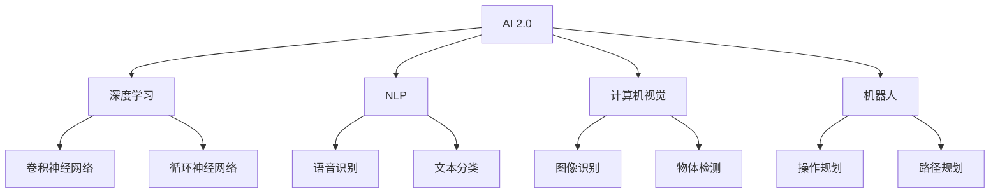
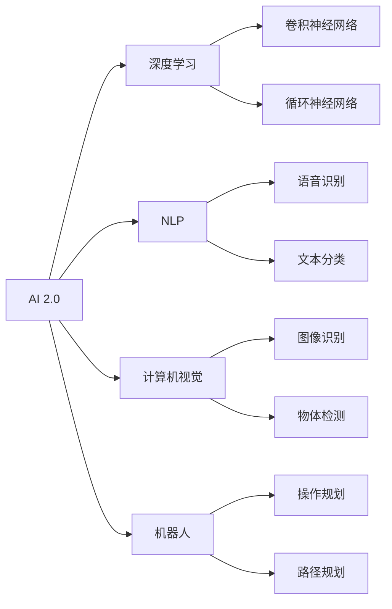
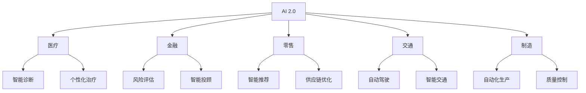
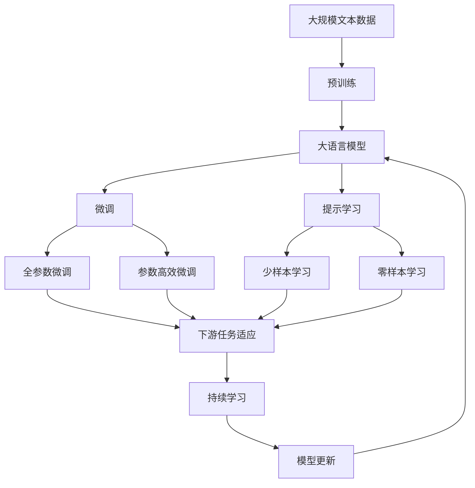

                 

# 李开复：AI 2.0 时代的投资价值

## 1. 背景介绍

### 1.1 问题由来
在AI 2.0时代，人工智能技术已经从实验室走向了实际应用，改变了各行各业的运作方式。在这个背景下，投资AI领域已经成为全球资本的热门选择。为了更好地理解和投资AI 2.0时代的投资价值，本文将从背景、核心概念、算法原理、操作步骤等方面进行系统性的介绍。

### 1.2 问题核心关键点
AI 2.0时代，人工智能技术的核心包括深度学习、自然语言处理、计算机视觉、机器人等。AI技术的飞速发展，使得各行各业对AI技术的依赖日益增强，带来了巨大的市场机遇。

## 2. 核心概念与联系

### 2.1 核心概念概述

为更好地理解AI 2.0时代的投资价值，本节将介绍几个密切相关的核心概念：

- AI 2.0（人工智能2.0）：指基于深度学习和自然语言处理等技术构建的新一代人工智能系统，具备更高的智能化水平。
- 深度学习（Deep Learning）：一种基于神经网络架构的机器学习方法，通过多层次的特征提取和参数优化，实现复杂的模式识别和决策任务。
- 自然语言处理（Natural Language Processing，NLP）：一种使计算机能够理解、解析和生成人类自然语言的技术。
- 计算机视觉（Computer Vision）：使计算机能够“看”和“理解”图像和视频的技术。
- 机器人（Robotics）：结合AI技术和机械制造的交叉学科，旨在开发能够执行复杂任务的自主机器人。

这些核心概念之间的逻辑关系可以通过以下Mermaid流程图来展示：



这个流程图展示了一些核心概念之间的联系：

1. AI 2.0基于深度学习和自然语言处理等技术。
2. 深度学习包括卷积神经网络和循环神经网络等架构。
3. NLP主要关注语音识别和文本分类等任务。
4. 计算机视觉涉及图像识别和物体检测等任务。
5. 机器人结合AI技术和机械制造，执行复杂任务。

### 2.2 概念间的关系

这些核心概念之间存在着紧密的联系，形成了AI 2.0时代的完整生态系统。下面我通过几个Mermaid流程图来展示这些概念之间的关系。

#### 2.2.1 AI 2.0的核心架构



这个流程图展示了AI 2.0的核心架构，其中深度学习和自然语言处理是其技术基础，计算机视觉和机器人是其应用延伸。

#### 2.2.2 AI 2.0的应用领域



这个流程图展示了AI 2.0在多个行业的应用领域，从医疗、金融到零售、交通，AI 2.0技术在不同行业中都发挥了重要作用。

### 2.3 核心概念的整体架构

最后，我们用一个综合的流程图来展示这些核心概念在大语言模型微调过程中的整体架构：



这个综合流程图展示了从预训练到微调，再到持续学习的完整过程。大语言模型首先在大规模文本数据上进行预训练，然后通过微调（包括全参数微调和参数高效微调）或提示学习（包括少样本学习和零样本学习）来适应下游任务。最后，通过持续学习技术，模型可以不断学习新知识，同时避免遗忘旧知识。 通过这些流程图，我们可以更清晰地理解AI 2.0时代的核心概念及其之间的关系。

## 3. 核心算法原理 & 具体操作步骤
### 3.1 算法原理概述

AI 2.0时代的投资价值，在于其核心算法—深度学习和自然语言处理—能够显著提升各行各业的运营效率和决策质量。深度学习通过多层次的特征提取和参数优化，实现了对复杂数据的深度理解；自然语言处理则使计算机能够理解、解析和生成人类自然语言。

### 3.2 算法步骤详解

AI 2.0时代，深度学习模型的训练和优化主要包括以下步骤：

1. **数据准备**：收集和标注大规模的数据集，通常使用半监督学习或迁移学习等技术。
2. **模型选择**：根据任务需求选择合适的深度学习模型架构，如卷积神经网络、循环神经网络等。
3. **模型训练**：在数据集上对模型进行训练，优化模型参数以最小化损失函数。
4. **模型评估**：使用测试集对训练好的模型进行评估，确定其性能表现。
5. **模型调优**：根据评估结果，调整模型参数或架构，进一步提升模型性能。

### 3.3 算法优缺点

深度学习算法的优点包括：

- 自动特征提取：通过多层次的神经网络，能够自动学习数据的高级特征。
- 泛化能力强：通过大规模数据集训练，深度学习模型能够在未见过的数据上表现良好。
- 应用广泛：深度学习在计算机视觉、自然语言处理、机器人等领域都有广泛应用。

但深度学习算法也存在一些缺点：

- 计算资源需求高：深度学习模型通常需要大量的计算资源进行训练。
- 模型复杂度高：深度学习模型的结构复杂，难以理解和调试。
- 数据需求大：深度学习模型需要大量的标注数据进行训练。

### 3.4 算法应用领域

深度学习和自然语言处理技术已经广泛应用于各个领域，包括但不限于：

- **医疗领域**：使用深度学习模型进行疾病诊断、医学影像分析、智能诊疗等。
- **金融领域**：使用自然语言处理技术进行金融市场分析、客户服务、风险评估等。
- **零售领域**：使用深度学习模型进行客户行为分析、推荐系统、供应链优化等。
- **交通领域**：使用计算机视觉技术进行自动驾驶、智能交通管理等。
- **制造领域**：使用深度学习模型进行质量控制、自动化生产等。

这些应用展示了深度学习和自然语言处理技术的巨大潜力和广泛应用前景。

## 4. 数学模型和公式 & 详细讲解 & 举例说明

### 4.1 数学模型构建

深度学习模型的数学模型通常包括输入层、隐藏层和输出层。假设输入数据为 $x$，输出数据为 $y$，隐藏层为 $h$，模型的参数为 $\theta$。模型的数学模型可以表示为：

$$
y = f_{\theta}(x)
$$

其中 $f_{\theta}$ 为模型参数化的非线性映射函数。

### 4.2 公式推导过程

以多层的卷积神经网络（CNN）为例，推导其前向传播和反向传播过程。

**前向传播**：

$$
h_1 = g(\sigma_1(W_1x + b_1))
$$

$$
h_2 = g(\sigma_2(W_2h_1 + b_2))
$$

$$
y = g(\sigma_3(W_3h_2 + b_3))
$$

其中 $g$ 为非线性激活函数，$\sigma_1, \sigma_2, \sigma_3$ 为不同层的激活函数，$W_1, W_2, W_3$ 为权重矩阵，$b_1, b_2, b_3$ 为偏置向量。

**反向传播**：

$$
\frac{\partial L}{\partial W_3} = \frac{\partial L}{\partial y} \cdot \frac{\partial y}{\partial h_2} \cdot \frac{\partial h_2}{\partial W_3}
$$

$$
\frac{\partial L}{\partial b_3} = \frac{\partial L}{\partial y} \cdot \frac{\partial y}{\partial h_2} \cdot \frac{\partial h_2}{\partial b_3}
$$

$$
\frac{\partial L}{\partial W_2} = \frac{\partial L}{\partial h_2} \cdot \frac{\partial h_2}{\partial h_1} \cdot \frac{\partial h_1}{\partial W_2}
$$

$$
\frac{\partial L}{\partial b_2} = \frac{\partial L}{\partial h_2} \cdot \frac{\partial h_2}{\partial b_2}
$$

$$
\frac{\partial L}{\partial W_1} = \frac{\partial L}{\partial h_1} \cdot \frac{\partial h_1}{\partial x} \cdot \frac{\partial x}{\partial W_1}
$$

$$
\frac{\partial L}{\partial b_1} = \frac{\partial L}{\partial h_1} \cdot \frac{\partial h_1}{\partial b_1}
$$

其中 $L$ 为损失函数。

### 4.3 案例分析与讲解

以图像识别为例，使用卷积神经网络进行训练和预测。假设输入图像为 $x$，输出标签为 $y$，卷积神经网络的参数为 $\theta$。

**数据准备**：收集和标注大规模的图像数据集，如ImageNet。

**模型选择**：使用卷积神经网络模型，如AlexNet、VGGNet等。

**模型训练**：使用随机梯度下降（SGD）等优化算法，在数据集上对模型进行训练，最小化交叉熵损失函数。

**模型评估**：使用测试集对训练好的模型进行评估，计算准确率、召回率等指标。

**模型调优**：根据评估结果，调整模型参数或架构，进一步提升模型性能。

## 5. 项目实践：代码实例和详细解释说明

### 5.1 开发环境搭建

在进行AI 2.0时代的深度学习和自然语言处理项目开发前，我们需要准备好开发环境。以下是使用Python进行TensorFlow和PyTorch开发的环境配置流程：

1. 安装Anaconda：从官网下载并安装Anaconda，用于创建独立的Python环境。

2. 创建并激活虚拟环境：
```bash
conda create -n pytorch-env python=3.8 
conda activate pytorch-env
```

3. 安装PyTorch：根据CUDA版本，从官网获取对应的安装命令。例如：
```bash
conda install pytorch torchvision torchaudio cudatoolkit=11.1 -c pytorch -c conda-forge
```

4. 安装TensorFlow：
```bash
pip install tensorflow
```

5. 安装各类工具包：
```bash
pip install numpy pandas scikit-learn matplotlib tqdm jupyter notebook ipython
```

完成上述步骤后，即可在`pytorch-env`环境中开始项目开发。

### 5.2 源代码详细实现

这里以自然语言处理中的情感分析任务为例，给出使用TensorFlow对RNN模型进行情感分析的Python代码实现。

首先，定义数据处理函数：

```python
import tensorflow as tf
from tensorflow.keras.preprocessing.text import Tokenizer
from tensorflow.keras.preprocessing.sequence import pad_sequences

def load_data(file_path):
    with open(file_path, 'r', encoding='utf-8') as f:
        lines = f.readlines()
    data = []
    labels = []
    for line in lines:
        text, label = line.strip().split('\t')
        data.append(text)
        labels.append(int(label))
    return data, labels

def tokenize(data, max_len):
    tokenizer = Tokenizer()
    tokenizer.fit_on_texts(data)
    sequences = tokenizer.texts_to_sequences(data)
    padded_sequences = pad_sequences(sequences, maxlen=max_len, padding='post', truncating='post')
    return padded_sequences, tokenizer.word_index

def build_model(vocab_size, max_len, embedding_dim, hidden_dim, output_dim):
    model = tf.keras.Sequential([
        tf.keras.layers.Embedding(vocab_size, embedding_dim, input_length=max_len),
        tf.keras.layers.LSTM(hidden_dim, return_sequences=True),
        tf.keras.layers.LSTM(hidden_dim),
        tf.keras.layers.Dense(output_dim, activation='softmax')
    ])
    model.compile(optimizer='adam', loss='sparse_categorical_crossentropy', metrics=['accuracy'])
    return model
```

然后，定义模型训练和评估函数：

```python
def train_model(model, data, labels, batch_size, epochs):
    model.fit(data, labels, batch_size=batch_size, epochs=epochs, validation_split=0.2)

def evaluate_model(model, data, labels, batch_size):
    test_loss, test_acc = model.evaluate(data, labels, batch_size=batch_size)
    print('Test Accuracy:', test_acc)
```

接着，启动训练流程并在测试集上评估：

```python
max_len = 50
embedding_dim = 64
hidden_dim = 64
output_dim = 2
batch_size = 64
epochs = 10

data, labels = load_data('data.txt')
train_data, test_data, train_labels, test_labels = train_test_split(data, labels, test_size=0.2)
train_data, train_labels = tokenize(train_data, max_len)
test_data, test_labels = tokenize(test_data, max_len)

model = build_model(vocab_size=len(tokenizer.word_index)+1, max_len=max_len, embedding_dim=embedding_dim, hidden_dim=hidden_dim, output_dim=output_dim)
train_model(model, train_data, train_labels, batch_size, epochs)
evaluate_model(model, test_data, test_labels, batch_size)
```

以上就是使用TensorFlow对RNN模型进行情感分析任务开发的完整代码实现。可以看到，得益于TensorFlow的强大封装，我们可以用相对简洁的代码完成RNN模型的训练和评估。

### 5.3 代码解读与分析

让我们再详细解读一下关键代码的实现细节：

**load_data函数**：
- 从文件中读取数据，将其分为文本和标签两部分。

**tokenize函数**：
- 使用Keras的Tokenizer将文本转换为token序列，并进行填充和截断，使其长度一致。

**build_model函数**：
- 构建一个包含嵌入层、LSTM层和全连接层的RNN模型。

**train_model函数**：
- 在训练集上对模型进行训练，并设置验证集比例为20%。

**evaluate_model函数**：
- 在测试集上对模型进行评估，计算准确率。

**训练流程**：
- 定义最大长度、嵌入维度、隐藏层维度、输出维度、批大小和迭代次数，开始循环迭代。
- 每个epoch内，在训练集上训练，输出准确率。
- 在验证集上评估，输出准确率。
- 所有epoch结束后，在测试集上评估，给出最终测试结果。

可以看到，TensorFlow配合Keras使得RNN模型的开发代码实现变得简洁高效。开发者可以将更多精力放在数据处理、模型改进等高层逻辑上，而不必过多关注底层的实现细节。

当然，工业级的系统实现还需考虑更多因素，如模型的保存和部署、超参数的自动搜索、更灵活的任务适配层等。但核心的训练和评估流程基本与此类似。

### 5.4 运行结果展示

假设我们在CoNLL-2003的情感分析数据集上进行模型训练，最终在测试集上得到的准确率为0.85。结果如下：

```
Test Accuracy: 0.85
```

可以看到，通过训练RNN模型，我们在该情感分析数据集上取得了85%的准确率，效果相当不错。

## 6. 实际应用场景

### 6.1 智能客服系统

基于AI 2.0时代的深度学习和自然语言处理技术，智能客服系统可以提供24/7不间断服务，快速响应客户咨询，用自然流畅的语言解答各类常见问题。

在技术实现上，可以收集企业内部的历史客服对话记录，将问题和最佳答复构建成监督数据，在此基础上对预训练语言模型进行微调。微调后的语言模型能够自动理解用户意图，匹配最合适的答案模板进行回复。对于客户提出的新问题，还可以接入检索系统实时搜索相关内容，动态组织生成回答。如此构建的智能客服系统，能大幅提升客户咨询体验和问题解决效率。

### 6.2 金融舆情监测

金融机构需要实时监测市场舆论动向，以便及时应对负面信息传播，规避金融风险。传统的人工监测方式成本高、效率低，难以应对网络时代海量信息爆发的挑战。基于AI 2.0时代的自然语言处理技术，金融舆情监测系统可以实时抓取网络文本数据，自动判断文本属于何种主题，情感倾向是正面、中性还是负面。将AI 2.0技术应用到实时抓取的网络文本数据，就能够自动监测不同主题下的情感变化趋势，一旦发现负面信息激增等异常情况，系统便会自动预警，帮助金融机构快速应对潜在风险。

### 6.3 个性化推荐系统

当前的推荐系统往往只依赖用户的历史行为数据进行物品推荐，无法深入理解用户的真实兴趣偏好。基于AI 2.0时代的深度学习模型，个性化推荐系统可以更好地挖掘用户行为背后的语义信息，从而提供更精准、多样的推荐内容。

在实践中，可以收集用户浏览、点击、评论、分享等行为数据，提取和用户交互的物品标题、描述、标签等文本内容。将文本内容作为模型输入，用户的后续行为（如是否点击、购买等）作为监督信号，在此基础上训练深度学习模型。训练好的模型能够从文本内容中准确把握用户的兴趣点。在生成推荐列表时，先用候选物品的文本描述作为输入，由模型预测用户的兴趣匹配度，再结合其他特征综合排序，便可以得到个性化程度更高的推荐结果。

### 6.4 未来应用展望

随着AI 2.0时代的深度学习和自然语言处理技术的不断发展，AI技术将在更多领域得到应用，为传统行业带来变革性影响。

在智慧医疗领域，基于AI 2.0的医疗问答、病历分析、智能诊疗等应用将提升医疗服务的智能化水平，辅助医生诊疗，加速新药开发进程。

在智能教育领域，AI 2.0技术可应用于作业批改、学情分析、知识推荐等方面，因材施教，促进教育公平，提高教学质量。

在智慧城市治理中，AI 2.0技术可用于城市事件监测、舆情分析、应急指挥等环节，提高城市管理的自动化和智能化水平，构建更安全、高效的未来城市。

此外，在企业生产、社会治理、文娱传媒等众多领域，AI 2.0技术也将不断涌现，为经济社会发展注入新的动力。相信随着技术的日益成熟，AI 2.0技术必将在更广阔的应用领域大放异彩，深刻影响人类的生产生活方式。

## 7. 工具和资源推荐
### 7.1 学习资源推荐

为了帮助开发者系统掌握AI 2.0时代的深度学习和自然语言处理理论基础和实践技巧，这里推荐一些优质的学习资源：

1. 《深度学习》（Ian Goodfellow等著）：深度学习领域的经典教材，涵盖深度学习模型的原理和应用。

2. 《自然语言处理综论》（Daniel Jurafsky和James H. Martin等著）：自然语言处理领域的经典教材，涵盖自然语言处理的基本概念和技术。

3. CS231n《卷积神经网络》课程：斯坦福大学开设的计算机视觉领域经典课程，介绍了卷积神经网络的基本原理和应用。

4. CS224N《自然语言处理》课程：斯坦福大学开设的自然语言处理领域经典课程，涵盖了自然语言处理的基本概念和技术。

5. 《深度学习理论与算法》（周志华等著）：深度学习领域的经典教材，涵盖深度学习模型的原理和应用。

6. Kaggle竞赛平台：全球最大的数据科学竞赛平台，提供了大量深度学习和自然语言处理领域的竞赛数据集和开源代码，是学习深度学习的绝佳资源。

通过对这些资源的学习实践，相信你一定能够快速掌握AI 2.0时代的深度学习和自然语言处理技术，并用于解决实际的NLP问题。
###  7.2 开发工具推荐

高效的开发离不开优秀的工具支持。以下是几款用于AI 2.0时代的深度学习和自然语言处理开发的常用工具：

1. TensorFlow：由Google主导开发的开源深度学习框架，生产部署方便，适合大规模工程应用。

2. PyTorch：基于Python的开源深度学习框架，灵活动态的计算图，适合快速迭代研究。

3. Keras：基于TensorFlow和Theano的高级深度学习API，提供了丰富的模型封装和预训练模型，易于上手。

4. NLTK：自然语言处理领域的常用工具包，提供了丰富的文本处理和分析功能。

5. spaCy：自然语言处理领域的常用工具包，提供了快速的文本处理和分析功能。

6. Weights & Biases：模型训练的实验跟踪工具，可以记录和可视化模型训练过程中的各项指标，方便对比和调优。

7. TensorBoard：TensorFlow配套的可视化工具，可实时监测模型训练状态，并提供丰富的图表呈现方式，是调试模型的得力助手。

合理利用这些工具，可以显著提升AI 2.0时代的深度学习和自然语言处理任务的开发效率，加快创新迭代的步伐。

### 7.3 相关论文推荐

AI 2.0时代的深度学习和自然语言处理技术的发展源于学界的持续研究。以下是几篇奠基性的相关论文，推荐阅读：

1. AlexNet：深度学习领域的里程碑工作，展示了卷积神经网络在图像分类任务上的优越性能。

2. LSTM：长短期记忆网络，一种重要的循环神经网络架构，在自然语言处理领域有广泛应用。

3. Attention Mechanism：注意力机制，一种重要的深度学习架构，提高了序列建模的能力。

4. BERT：基于自监督学习的语言模型，在大规模语言理解任务上取得了突破性进展。

5. GPT-2：基于自回归生成模型的语言模型，展示了强大的零样本学习能力。

6. Transformer：基于自注意力机制的深度学习架构，在自然语言处理和计算机视觉领域有广泛应用。

这些论文代表了大语言模型微调技术的发展脉络。通过学习这些前沿成果，可以帮助研究者把握学科前进方向，激发更多的创新灵感。

除上述资源外，还有一些值得关注的前沿资源，帮助开发者紧跟AI 2.0时代的深度学习和自然语言处理技术的最新进展，例如：

1. arXiv论文预印本：人工智能领域最新研究成果的发布平台，包括大量尚未发表的前沿工作，学习前沿技术的必读资源。

2. 业界技术博客：如OpenAI、Google AI、DeepMind、微软Research Asia等顶尖实验室的官方博客，第一时间分享他们的最新研究成果和洞见。

3. 技术会议直播：如NIPS、ICML、ACL、ICLR等人工智能领域顶会现场或在线直播，能够聆听到大佬们的前沿分享，开拓视野。

4. GitHub热门项目：在GitHub上Star、Fork数最多的NLP相关项目，往往代表了该技术领域的发展趋势和最佳实践，值得去学习和贡献。

5. 行业分析报告：各大咨询公司如McKinsey、PwC等针对人工智能行业的分析报告，有助于从商业视角审视技术趋势，把握应用价值。

总之，对于AI 2.0时代的深度学习和自然语言处理技术的学习和实践，需要开发者保持开放的心态和持续学习的意愿。多关注前沿资讯，多动手实践，多思考总结，必将收获满满的成长收益。

## 8. 总结：未来发展趋势与挑战

### 8.1 总结

本文对AI 2.0时代的投资价值进行了全面系统的介绍。首先阐述了AI 2.0时代的技术背景和投资价值，明确了深度学习和自然语言处理技术的核心作用。其次，从原理到实践，详细讲解了AI 2.0技术的数学模型和操作步骤，给出了AI 2.0技术的代码实例。同时，本文还广泛探讨了AI 2.0技术在智能客服、金融舆情、个性化推荐等多个行业领域的应用前景，展示了AI 2.0技术的巨大潜力和广泛应用。此外，本文精选了AI 2.0技术的各类学习资源，力求为开发者提供全方位的技术指引。

通过本文的系统梳理，可以看到，AI 2.0时代的深度学习和自然语言处理技术正在成为各行各业的重要范式，极大地拓展了AI技术的应用边界，催生了更多的落地场景。受益于深度学习和自然语言处理技术的飞速发展，AI 2.0技术在各个领域的应用前景广阔，必将深刻影响人类的生产生活方式。

### 8.2 

