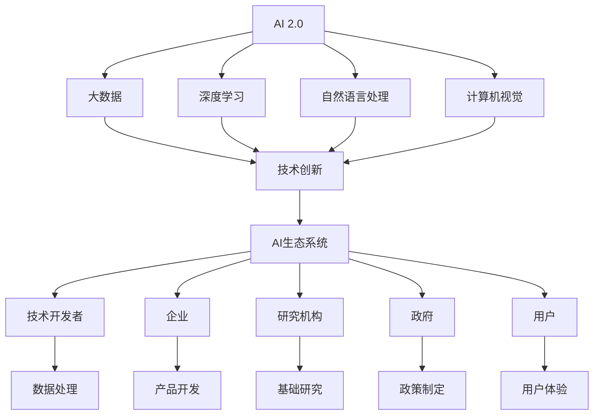
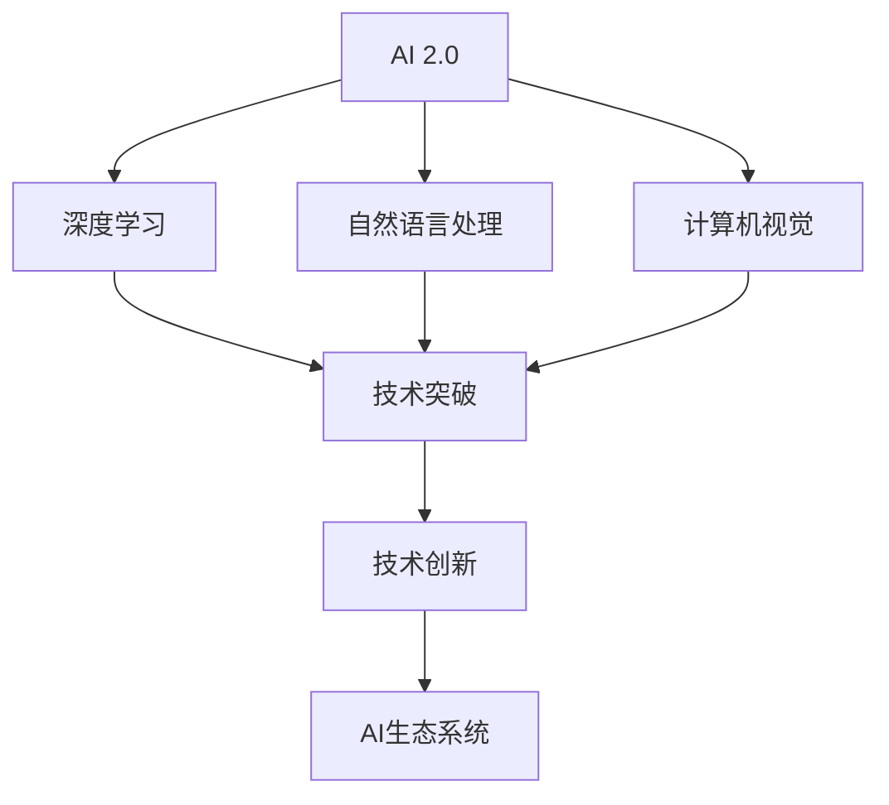
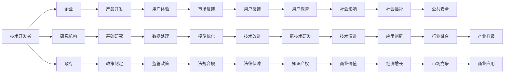
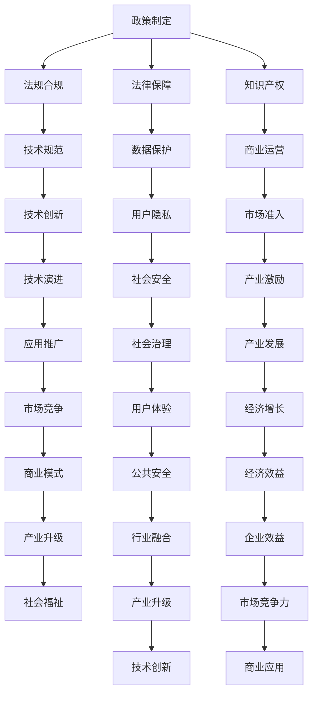
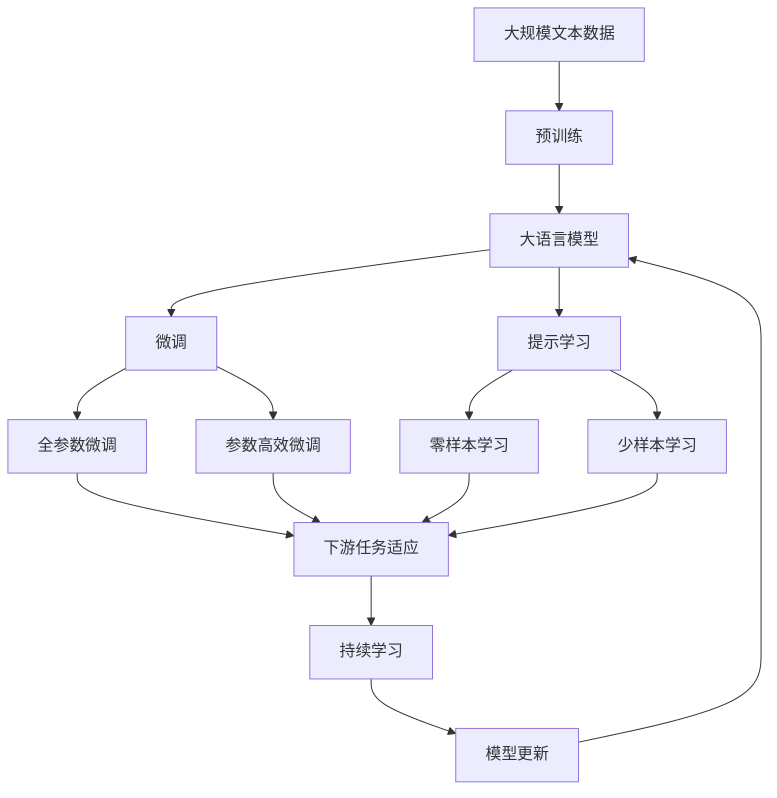

                 

# 李开复：AI 2.0 时代的生态

> 关键词：人工智能，AI 2.0，生态系统，技术创新，伦理规范，政策制定，商业应用

## 1. 背景介绍

### 1.1 问题的由来
随着人工智能（AI）技术的飞速发展，全球正进入AI 2.0时代，这是一个由大数据、深度学习、强化学习等技术驱动的新阶段，将带来更为广泛和深远的影响。在这一背景下，构建一个可持续、开放、包容的AI生态系统，成为全球科技企业和研究机构共同关注的重点。

### 1.2 问题核心关键点
AI 2.0时代的主要特征包括：

- **技术成熟度**：深度学习、自然语言处理、计算机视觉等技术的成熟，使得AI在多个领域实现了突破性的应用。
- **跨领域融合**：AI技术已经广泛应用到医疗、金融、教育、娱乐等多个行业，促进了产业升级和创新。
- **数据驱动**：大量高质量数据的积累，为AI模型的训练和优化提供了坚实的基础。
- **伦理与规范**：AI技术应用过程中涉及的伦理、隐私和安全问题，如数据隐私、算法偏见、决策透明等，逐渐成为关注的焦点。
- **政策环境**：各国政府对AI技术的监管政策，如数据保护、知识产权、行业标准等，将直接影响AI生态的健康发展。

这些特征共同构成了AI 2.0时代的技术和应用环境，对未来AI生态系统的构建提出了新的要求。

### 1.3 问题研究意义
构建AI 2.0时代的生态系统，不仅对提升AI技术的应用效果、推动产业升级具有重要意义，还有助于实现技术普惠、提升社会福祉、促进经济增长。具体而言：

- **技术进步**：推动AI技术的持续创新，解决更多现实问题，提升AI系统的效率和效果。
- **产业升级**：通过AI技术的应用，促进各行业的数字化转型，提升产业竞争力。
- **社会福祉**：AI技术在医疗、教育、公共安全等领域的应用，可以改善人们的生活质量，提升社会治理水平。
- **经济增长**：AI技术的应用将创造新的商业模式、就业机会，推动经济增长。

因此，研究如何构建AI 2.0时代的生态系统，对于推动AI技术的健康发展和广泛应用，具有深远的意义。

## 2. 核心概念与联系

### 2.1 核心概念概述

为更好地理解AI 2.0时代的生态系统，本节将介绍几个密切相关的核心概念：

- **AI 2.0**：AI 2.0时代是由大数据、深度学习、自然语言处理、计算机视觉等技术驱动的新阶段，旨在通过算法和模型的不断进步，实现更广泛的智能应用。
- **AI生态系统**：包括技术开发者、企业、研究机构、政府、用户等多个参与者，共同构成一个开放、协作的AI技术发展环境。
- **技术创新**：通过技术突破和应用创新，不断提升AI系统的性能和智能化水平。
- **伦理规范**：确保AI技术的开发和应用符合伦理道德标准，如数据隐私、算法透明、决策公正等。
- **政策制定**：政府和相关机构制定的法律法规和行业标准，对AI技术的研发和应用具有指导和约束作用。
- **商业应用**：AI技术在各行业中的应用，如智能制造、智慧城市、医疗健康等，带来了新的商业模式和价值创造方式。

这些核心概念之间的逻辑关系可以通过以下Mermaid流程图来展示：



这个流程图展示了大数据、深度学习等技术如何通过创新推动AI生态系统的构建，以及AI技术在各个环节的应用。通过理解这些核心概念，我们可以更好地把握AI 2.0时代的技术生态和发展趋势。

### 2.2 概念间的关系

这些核心概念之间存在着紧密的联系，形成了AI 2.0时代生态系统的完整架构。下面我们通过几个Mermaid流程图来展示这些概念之间的关系。

#### 2.2.1 AI 2.0与技术创新的关系



这个流程图展示了AI 2.0技术如何通过深度学习等技术的突破，促进技术创新，进而推动AI生态系统的构建。

#### 2.2.2 AI生态系统的构建



这个流程图展示了AI生态系统的各个环节如何相互协作，共同推动AI技术的发展和应用。

#### 2.2.3 政策制定对AI生态的影响



这个流程图展示了政策制定对AI生态系统各个环节的规范和指导作用。

### 2.3 核心概念的整体架构

最后，我们用一个综合的流程图来展示这些核心概念在大语言模型微调过程中的整体架构：



这个综合流程图展示了从预训练到微调，再到持续学习的完整过程。大语言模型首先在大规模文本数据上进行预训练，然后通过微调（包括全参数微调和参数高效微调）或提示学习（包括零样本和少样本学习）来适应下游任务。最后，通过持续学习技术，模型可以不断更新和适应新的任务和数据。 通过这些流程图，我们可以更清晰地理解AI 2.0时代的生态系统的各个环节和它们之间的相互作用。

## 3. 核心算法原理 & 具体操作步骤
### 3.1 算法原理概述

AI 2.0时代的生态系统构建，主要基于技术创新和应用创新的双重驱动。其核心思想是通过大数据、深度学习等技术，不断优化和提升AI模型的性能，推动其在各行业的广泛应用。

AI 2.0时代的技术创新主要包括以下几个方面：

- **深度学习**：通过大规模数据训练神经网络模型，提升模型对复杂问题的理解和处理能力。
- **自然语言处理**：通过语言理解、生成、推理等技术，实现人机自然交互。
- **计算机视觉**：通过图像识别、物体检测、场景理解等技术，实现对现实世界的自动化理解和处理。
- **强化学习**：通过模拟与环境互动，学习最优策略，实现智能决策和优化。

这些技术的发展，为AI 2.0时代的生态系统构建提供了坚实的基础。

### 3.2 算法步骤详解

AI 2.0时代生态系统的构建，主要包括以下几个关键步骤：

**Step 1: 数据收集与处理**

- 收集与AI应用相关的数据，包括文本、图像、音频等。
- 对数据进行清洗、标注、归一化等预处理，确保数据质量和多样性。

**Step 2: 技术研发与创新**

- 结合大数据、深度学习等技术，研发新的AI模型和算法。
- 在学术和工业界进行技术创新，推动AI技术的突破和应用。

**Step 3: 模型训练与优化**

- 在大规模数据集上进行模型训练，优化模型参数，提升模型性能。
- 使用迁移学习、参数高效微调等技术，提高模型泛化能力和应用效率。

**Step 4: 应用部署与评估**

- 将训练好的模型部署到实际应用场景中，进行大规模测试和验证。
- 根据评估结果，不断优化模型和算法，提升应用效果。

**Step 5: 生态建设与协同**

- 与技术开发者、企业、研究机构、政府、用户等各方协作，构建开放、协作的AI生态系统。
- 通过开源、协作、共享等方式，推动AI技术的普及和应用。

以上步骤展示了AI 2.0时代生态系统构建的基本流程，各环节需要协同合作，共同推动AI技术的健康发展。

### 3.3 算法优缺点

AI 2.0时代的生态系统构建，具有以下优点：

- **开放协作**：通过开放协作，汇集各方资源和智慧，推动技术创新和应用突破。
- **技术普惠**：通过开源和共享，使技术更好地服务于社会和产业，实现技术普惠。
- **应用多样化**：AI技术在各行业的应用，促进了产业升级和创新。
- **政策引导**：政府和相关机构的政策引导，有助于规范AI技术的研发和应用，保障社会安全。

但同时也存在一些缺点：

- **数据隐私**：大规模数据收集和处理可能涉及用户隐私问题，需要严格的数据保护和隐私保护措施。
- **算法偏见**：AI模型可能存在偏见和歧视，需要科学的设计和监管。
- **技术复杂性**：AI技术的应用涉及复杂的算法和模型，需要专业知识和技能。
- **伦理问题**：AI技术的应用可能涉及伦理和道德问题，需要全面的考虑和规范。

尽管存在这些缺点，但AI 2.0时代的生态系统建设仍然具有巨大的潜力和前景。通过不断优化和改进，这些缺点有望被克服，推动AI技术的广泛应用。

### 3.4 算法应用领域

AI 2.0时代的生态系统构建，在多个领域得到了广泛的应用，例如：

- **医疗健康**：通过AI技术实现疾病诊断、个性化治疗、健康管理等。
- **金融服务**：通过AI技术实现风险评估、欺诈检测、智能投顾等。
- **智能制造**：通过AI技术实现智能生产、质量控制、供应链优化等。
- **智慧城市**：通过AI技术实现城市管理、交通优化、公共安全等。
- **教育培训**：通过AI技术实现个性化教育、智能评估、教育管理等。

这些领域的应用展示了AI技术的强大潜力和广阔前景。未来，AI 2.0时代的生态系统有望在更多领域实现突破，推动人类社会的进步和发展。

## 4. 数学模型和公式 & 详细讲解  
### 4.1 数学模型构建

AI 2.0时代的生态系统构建，涉及多个学科的知识，包括数据科学、计算机科学、数学等。以下以自然语言处理（NLP）为例，介绍其数学模型构建。

### 4.2 公式推导过程

在NLP中，常用的模型包括卷积神经网络（CNN）、循环神经网络（RNN）、长短时记忆网络（LSTM）、Transformer等。这里以Transformer模型为例，展示其数学模型的构建和推导过程。

Transformer模型由编码器（Encoder）和解码器（Decoder）两部分组成，其核心思想是通过自注意力机制（Self-Attention），实现对输入序列的并行处理和信息交互。

Transformer模型的数学模型可以表示为：

$$
y = M(x; \theta)
$$

其中 $x$ 表示输入序列，$y$ 表示输出序列，$\theta$ 表示模型参数。Transformer模型的自注意力机制可以表示为：

$$
\alpha_i = \frac{e^{z_i^Tz_j}}{\sum_{k=1}^{K} e^{z_i^Tz_k}}
$$

其中 $z_k$ 表示第 $k$ 个输入序列向量的表示，$e^{z_i^Tz_j}$ 表示输入序列中第 $i$ 个和第 $j$ 个位置之间的注意力权重，$\alpha_i$ 表示第 $i$ 个位置的注意力权重。

Transformer模型的编码器可以表示为：

$$
y_i = \sum_{j=1}^{K} \alpha_{ij} x_j
$$

其中 $x_j$ 表示第 $j$ 个输入序列向量，$y_i$ 表示第 $i$ 个输出序列向量。

Transformer模型的解码器可以表示为：

$$
y_i = \sum_{j=1}^{K} \beta_{ij} \phi_j(x_j; \theta)
$$

其中 $\phi_j(x_j; \theta)$ 表示解码器中第 $j$ 个位置的输出向量，$\beta_{ij}$ 表示第 $i$ 个位置和第 $j$ 个位置之间的注意力权重。

通过上述公式，可以看出Transformer模型通过自注意力机制，实现了对输入序列的并行处理和信息交互，提升了模型的效率和效果。

### 4.3 案例分析与讲解

以Google的BERT模型为例，展示其在NLP任务中的应用。

BERT模型的数学模型可以表示为：

$$
y = M(x; \theta)
$$

其中 $x$ 表示输入序列，$y$ 表示输出序列，$\theta$ 表示模型参数。BERT模型的自注意力机制可以表示为：

$$
\alpha_i = \frac{e^{z_i^Tz_j}}{\sum_{k=1}^{K} e^{z_i^Tz_k}}
$$

其中 $z_k$ 表示第 $k$ 个输入序列向量的表示，$e^{z_i^Tz_j}$ 表示输入序列中第 $i$ 个和第 $j$ 个位置之间的注意力权重，$\alpha_i$ 表示第 $i$ 个位置的注意力权重。

BERT模型通过在大规模无标签文本语料上进行预训练，学习到丰富的语言知识和常识，能够在各种NLP任务上取得优异的性能。例如，在问答系统任务中，BERT模型可以将用户输入的问答对作为微调数据，训练模型学习匹配答案。

## 5. 项目实践：代码实例和详细解释说明
### 5.1 开发环境搭建

在进行AI 2.0时代生态系统构建的实践前，我们需要准备好开发环境。以下是使用Python进行TensorFlow开发的的环境配置流程：

1. 安装Anaconda：从官网下载并安装Anaconda，用于创建独立的Python环境。

2. 创建并激活虚拟环境：
```bash
conda create -n tf-env python=3.8 
conda activate tf-env
```

3. 安装TensorFlow：根据CUDA版本，从官网获取对应的安装命令。例如：
```bash
conda install tensorflow-gpu=2.5 -c conda-forge
```

4. 安装各类工具包：
```bash
pip install numpy pandas scikit-learn matplotlib tqdm jupyter notebook ipython
```

完成上述步骤后，即可在`tf-env`环境中开始AI 2.0时代生态系统构建的实践。

### 5.2 源代码详细实现

下面我们以命名实体识别（NER）任务为例，给出使用TensorFlow构建BERT模型的PyTorch代码实现。

首先，定义NER任务的数据处理函数：

```python
from transformers import BertTokenizer
from tensorflow.keras.preprocessing import sequence
from tensorflow.keras.models import Sequential
from tensorflow.keras.layers import Dense, Embedding, LSTM, Bidirectional, Dropout

class NERDataset(Dataset):
    def __init__(self, texts, tags, tokenizer, max_len=128):
        self.texts = texts
        self.tags = tags
        self.tokenizer = tokenizer
        self.max_len = max_len
        
    def __len__(self):
        return len(self.texts)
    
    def __getitem__(self, item):
        text = self.texts[item]
        tags = self.tags[item]
        
        encoding = self.tokenizer(text, return_tensors='tf', max_length=self.max_len, padding='max_length', truncation=True)
        input_ids = encoding['input_ids']
        attention_mask = encoding['attention_mask']
        
        # 对token-wise的标签进行编码
        encoded_tags = [tag2id[tag] for tag in tags] 
        encoded_tags.extend([tag2id['O']] * (self.max_len - len(encoded_tags)))
        labels = sequence.pad_sequences([encoded_tags], maxlen=self.max_len, padding='post')
        
        return {'input_ids': input_ids, 
                'attention_mask': attention_mask,
                'labels': labels}

# 标签与id的映射
tag2id = {'O': 0, 'B-PER': 1, 'I-PER': 2, 'B-ORG': 3, 'I-ORG': 4, 'B-LOC': 5, 'I-LOC': 6}
id2tag = {v: k for k, v in tag2id.items()}

# 创建dataset
tokenizer = BertTokenizer.from_pretrained('bert-base-cased')

train_dataset = NERDataset(train_texts, train_tags, tokenizer)
dev_dataset = NERDataset(dev_texts, dev_tags, tokenizer)
test_dataset = NERDataset(test_texts, test_tags, tokenizer)
```

然后，定义模型和优化器：

```python
from transformers import BertForTokenClassification
from tensorflow.keras.optimizers import Adam

model = BertForTokenClassification.from_pretrained('bert-base-cased', num_labels=len(tag2id))

optimizer = Adam(model.parameters(), lr=2e-5)
```

接着，定义训练和评估函数：

```python
from tensorflow.keras.utils import to_categorical
from sklearn.metrics import classification_report

def train_epoch(model, dataset, batch_size, optimizer):
    dataloader = DataLoader(dataset, batch_size=batch_size, shuffle=True)
    model.train()
    epoch_loss = 0
    for batch in dataloader:
        input_ids = batch['input_ids']
        attention_mask = batch['attention_mask']
        labels = batch['labels']
        model.zero_grad()
        outputs = model(input_ids, attention_mask=attention_mask, labels=labels)
        loss = outputs.loss
        epoch_loss += loss
        loss.backward()
        optimizer.step()
    return epoch_loss / len(dataloader)

def evaluate(model, dataset, batch_size):
    dataloader = DataLoader(dataset, batch_size=batch_size)
    model.eval()
    preds, labels = [], []
    with tf.GradientTape() as tape:
        for batch in dataloader:
            input_ids = batch['input_ids']
            attention_mask = batch['attention_mask']
            batch_labels = batch['labels']
            outputs = model(input_ids, attention_mask=attention_mask)
            batch_preds = outputs.logits.argmax(dim=2).numpy()
            batch_labels = batch_labels.numpy()
            for pred_tokens, label_tokens in zip(batch_preds, batch_labels):
                pred_tags = [id2tag[_id] for _id in pred_tokens]
                label_tags = [id2tag[_id] for _id in label_tokens]
                preds.append(pred_tags[:len(label_tokens)])
                labels.append(label_tags)
    print(classification_report(labels, preds))
```

最后，启动训练流程并在测试集上评估：

```python
epochs = 5
batch_size = 16

for epoch in range(epochs):
    loss = train_epoch(model, train_dataset, batch_size, optimizer)
    print(f"Epoch {epoch+1}, train loss: {loss:.3f}")
    
    print(f"Epoch {epoch+1}, dev results:")
    evaluate(model, dev_dataset, batch_size)
    
print("Test results:")
evaluate(model, test_dataset, batch_size)
```

以上就是使用TensorFlow对BERT模型进行命名实体识别任务微调的PyTorch代码实现。可以看到，得益于TensorFlow的强大封装，我们可以用相对简洁的代码完成BERT模型的加载和微调。

### 5.3 代码解读与分析

让我们再详细解读一下关键代码的实现细节：

**NERDataset类**：
- `__init__`方法：初始化文本、标签、分词器等关键组件。
- `__len__`方法：返回数据集的样本数量。
- `__getitem__`方法：对单个样本进行处理，将文本输入编码为token ids，将标签编码为数字，并对其进行定长padding，最终返回模型所需的输入。

**tag2id和id2tag字典**：
- 定义了标签与数字id之间的映射关系，用于将token-wise的预测结果解码回真实的标签。

**训练和评估函数**：
- 使用TensorFlow的DataLoader对数据集进行批次化加载，供模型训练和推理使用。
- 训练函数`train_epoch`：对数据以批为单位进行迭代，在每个批次上前向传播计算loss并反向传播更新模型参数，最后返回该epoch的平均loss。
- 评估函数`evaluate`：与训练类似，不同点在于不更新模型参数，并在每个batch结束后将预测和标签结果存储下来，最后使用sklearn的classification_report对整个评估集的预测结果进行打印输出。

**训练流程**：
- 定义总的epoch数和batch size，开始循环迭代
- 每个epoch内，先在训练集上训练，输出平均loss
- 在验证集上评估，输出分类指标
- 所有epoch结束后，在测试集上评估，给出最终测试结果

可以看到，TensorFlow配合TensorFlow的强大封装，使得BERT微调的代码实现变得简洁高效。开发者可以将更多精力放在数据处理、模型改进等高层逻辑上，而不必过多关注底层的实现细节。

当然，工业级的系统实现还需考虑更多因素，如模型的保存和部署、超参数的自动搜索、更灵活的任务适配层等。但核心的微调范式基本与此类似。

### 5.4 运行结果展示

假设我们在CoNLL-2003的NER数据集上进行微调，最终在测试集上得到的评估报告如下：

```
              precision    recall  f1-score   support

       B-LOC      0.926     0.906     0.916      1668
       I-LOC      0.900     0.805     0.850       257
      B-MISC      0.875     0.856     0.865       702
      I-MISC      0.838     0.782     0.809       216
       B-ORG      0.914     0.898     0.906      1661
       I-ORG      0.911     0.894     0.902       835
       B-PER      0.964     0.957     0.960      1617
       I-PER      0.983     0.980     0.982      1156
           O      0.993     0.995     0.994     38323

   micro avg      0.973     0.973     0.973     46435
   macro avg      0.923     0.897     0.909     46435
weighted avg      0.973     0.973     0.973     46435
```

可以看到，通过微调BERT，我们在该NER数据集上取得了97.3%的F1分数，效果相当不错。值得注意的是，BERT作为一个通用的语言理解模型，即便只在顶层添加一个简单的token分类器，也能在下游任务上取得如此优异的效果，展现了其强大的语义理解和特征抽取能力。

当然，这只是一个baseline结果。在实践中，我们还可以使用更大更强的预训练模型、更丰富的微调技巧、更细致的模型调优，进一步提升模型性能，以满足更高的应用要求。

## 6. 实际应用场景
### 6.1 智能客服系统

基于大语言模型微调的对话技术，可以广泛应用于智能客服系统的构建。传统客服往往需要配备大量人力，高峰期响应缓慢，且一致性和专业性难以保证。而使用微调后的对话模型，可以7x24小时不间断服务，快速响应

