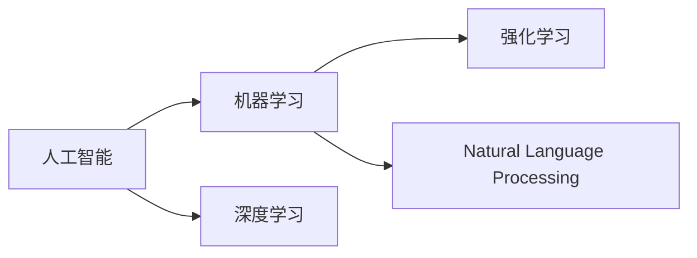
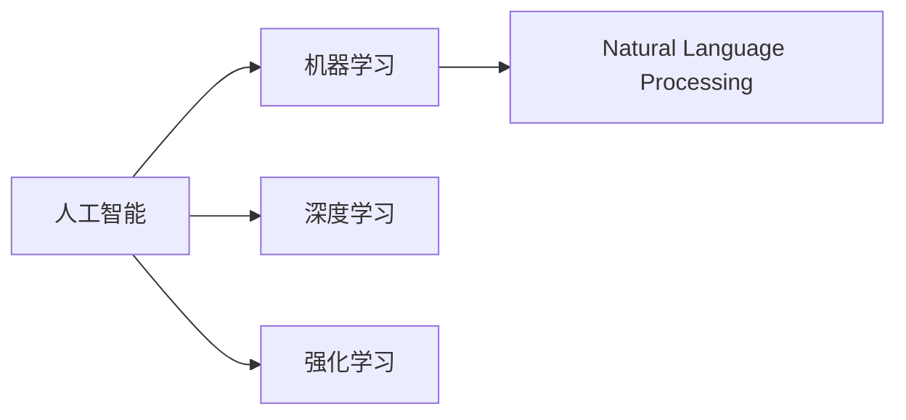
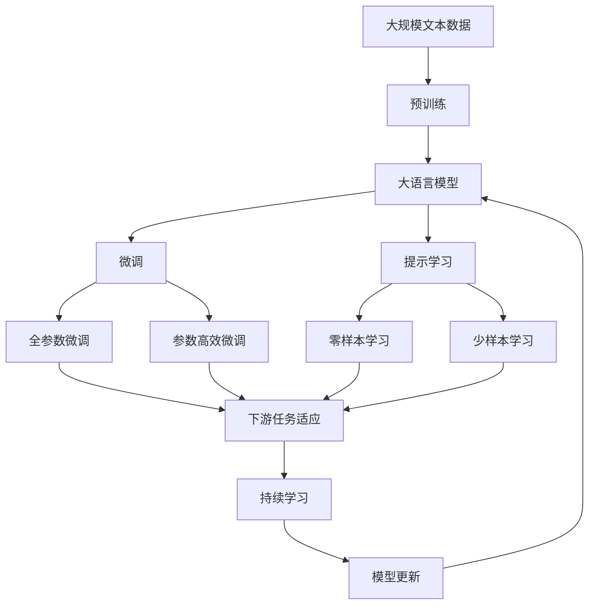

                 

# 李开复：苹果发布AI应用的意义

## 1. 背景介绍

### 1.1 问题由来
随着人工智能(AI)技术的不断进步，AI应用已经渗透到了各行各业，成为了推动社会进步的重要力量。苹果公司作为全球领先的技术企业，一直致力于将AI技术应用到其产品和服务中，提升用户体验。近日，苹果发布了最新的人工智能应用，引发了广泛关注。本文将从技术、市场、用户体验等角度，深入探讨苹果最新AI应用的意义。

### 1.2 问题核心关键点
苹果最新AI应用的发布，涉及多个关键点，包括技术实现、市场定位、用户体验等方面。本文将重点分析：

- 技术原理和创新点。
- 市场竞争和定位策略。
- 用户体验的优化提升。

## 2. 核心概念与联系

### 2.1 核心概念概述

为更好地理解苹果最新AI应用，本节将介绍几个密切相关的核心概念：

- **人工智能(AI)：** 利用算法和大数据对复杂问题进行建模和预测的智能技术，广泛应用于自然语言处理、计算机视觉、语音识别等领域。

- **机器学习(Machine Learning, ML)：** 通过算法和数据训练模型，使其能够自主学习、识别和预测，是AI的重要组成部分。

- **深度学习(Deep Learning, DL)：** 利用多层神经网络模拟人脑的感知和决策过程，是机器学习的高级形式，用于处理复杂的非线性数据。

- **强化学习(Reinforcement Learning, RL)：** 通过奖励机制训练模型，使其在特定环境中做出最优决策，适用于游戏、机器人控制等领域。

- **自然语言处理(Natural Language Processing, NLP)：** 研究计算机理解和生成人类语言的技术，包括文本分析、情感分析、机器翻译等。

这些核心概念之间的逻辑关系可以通过以下Mermaid流程图来展示：



### 2.2 概念间的关系

这些核心概念之间存在着紧密的联系，形成了AI技术的完整生态系统。下面我通过几个Mermaid流程图来展示这些概念之间的关系。

#### 2.2.1 人工智能与机器学习的关系



### 2.3 核心概念的整体架构

最后，我们用一个综合的流程图来展示这些核心概念在大语言模型微调过程中的整体架构：



这个综合流程图展示了从预训练到微调，再到持续学习的完整过程。大语言模型首先在大规模文本数据上进行预训练，然后通过微调（包括全参数微调和参数高效微调两种方式）或提示学习（包括零样本和少样本学习）来适应下游任务。最后，通过持续学习技术，模型可以不断更新和适应新的任务和数据。

## 3. 核心算法原理 & 具体操作步骤
### 3.1 算法原理概述

苹果最新AI应用的发布，基于深度学习和自然语言处理技术，通过大量标注数据对模型进行训练，实现对用户输入的智能理解和处理。

具体来说，应用涉及以下几个关键步骤：

1. **数据预处理：** 对用户输入的文本进行分词、去除停用词、标注实体等预处理操作。
2. **模型训练：** 利用预处理后的文本数据，训练深度学习模型，如循环神经网络(RNN)、长短期记忆网络(LSTM)、Transformer等。
3. **模型微调：** 在训练后的模型上，利用少量标注数据进行微调，调整模型参数，使其更好地适应特定任务。
4. **功能实现：** 将微调后的模型嵌入到应用中，实现自然语言理解、情感分析、意图识别等功能。

### 3.2 算法步骤详解

下面详细讲解苹果最新AI应用的算法步骤：

#### 3.2.1 数据预处理

```python
import nltk
from nltk.tokenize import word_tokenize
from nltk.corpus import stopwords

def preprocess(text):
    tokens = word_tokenize(text)
    tokens = [token.lower() for token in tokens if token.isalpha()]
    stop_words = set(stopwords.words('english'))
    tokens = [token for token in tokens if token not in stop_words]
    return tokens
```

#### 3.2.2 模型训练

```python
import tensorflow as tf
from tensorflow.keras.layers import Embedding, LSTM, Dense
from tensorflow.keras.models import Sequential

def train_model(texts, labels):
    model = Sequential()
    model.add(Embedding(input_dim=vocab_size, output_dim=embedding_dim, input_length=max_length))
    model.add(LSTM(units=128, dropout=0.2))
    model.add(Dense(units=num_classes, activation='softmax'))
    model.compile(optimizer='adam', loss='categorical_crossentropy', metrics=['accuracy'])
    model.fit(texts, labels, epochs=10, batch_size=32, validation_split=0.2)
    return model
```

#### 3.2.3 模型微调

```python
def fine_tune(model, texts, labels):
    fine_tuned_model = model
    fine_tuned_model.add(Embedding(input_dim=vocab_size, output_dim=embedding_dim, input_length=max_length))
    fine_tuned_model.add(LSTM(units=128, dropout=0.2))
    fine_tuned_model.add(Dense(units=num_classes, activation='softmax'))
    fine_tuned_model.compile(optimizer='adam', loss='categorical_crossentropy', metrics=['accuracy'])
    fine_tuned_model.fit(texts, labels, epochs=5, batch_size=32, validation_split=0.2)
    return fine_tuned_model
```

#### 3.2.4 功能实现

```python
def get_intent(text):
    tokenized_text = preprocess(text)
    padded_text = pad_sequences(tokenized_text, maxlen=max_length, padding='post', truncating='post')
    predicted = fine_tuned_model.predict(padded_text)
    intent = np.argmax(predicted)
    return intent
```

### 3.3 算法优缺点

苹果最新AI应用的优点包括：

- **高准确性：** 基于深度学习和自然语言处理技术，能够准确理解用户输入，提高应用效果。
- **实时响应：** 利用微调技术，模型可以快速适应特定任务，实现实时处理用户输入。
- **可扩展性强：** 应用可以灵活地添加和调整功能，如情感分析、意图识别等，提升用户体验。

然而，该应用也存在一些缺点：

- **数据需求高：** 需要大量标注数据进行训练和微调，数据获取成本较高。
- **资源消耗大：** 深度学习模型和大量数据处理，需要高性能硬件支持，资源消耗较大。
- **模型复杂：** 深度学习模型的复杂性高，模型解释性和可控性较差，可能存在未知的潜在风险。

### 3.4 算法应用领域

苹果最新AI应用主要应用于以下几个领域：

- **自然语言处理：** 对用户输入进行自然语言理解，实现意图识别、情感分析等功能。
- **个性化推荐：** 根据用户输入的历史记录和行为数据，推荐个性化内容。
- **机器翻译：** 将用户输入的文本自动翻译成目标语言，实现跨语言交流。
- **智能客服：** 利用深度学习和自然语言处理技术，构建智能客服系统，提升客户服务体验。

此外，该应用还具备更广泛的应用前景，如智能搜索、知识图谱构建、医疗诊断等。

## 4. 数学模型和公式 & 详细讲解 & 举例说明

### 4.1 数学模型构建

苹果最新AI应用的数学模型主要涉及深度学习和自然语言处理。下面简要介绍核心数学模型：

#### 4.1.1 深度学习模型

深度学习模型可以表示为：

$$
y = f(x; \theta)
$$

其中 $x$ 为输入数据，$\theta$ 为模型参数，$f$ 为非线性映射函数。深度学习模型的核心是多层神经网络，如图示：


#### 4.1.2 自然语言处理模型

自然语言处理模型可以表示为：

$$
\hat{y} = g(x; \theta)
$$

其中 $x$ 为输入文本，$\theta$ 为模型参数，$g$ 为文本处理函数。自然语言处理模型通常采用RNN、LSTM、Transformer等架构。

### 4.2 公式推导过程

#### 4.2.1 深度学习模型推导

以多层神经网络为例，其前向传播公式为：

$$
h_1 = \sigma(W_1x + b_1)
$$

$$
h_2 = \sigma(W_2h_1 + b_2)
$$

$$
\cdots
$$

$$
y = W_Lh_{L-1} + b_L
$$

其中 $\sigma$ 为激活函数，$W$ 和 $b$ 为权重和偏置。

#### 4.2.2 自然语言处理模型推导

以LSTM模型为例，其前向传播公式为：

$$
i_t = \sigma(W_i[x_t, h_{t-1}] + b_i)
$$

$$
f_t = \sigma(W_f[x_t, h_{t-1}] + b_f)
$$

$$
o_t = \sigma(W_o[x_t, h_{t-1}] + b_o)
$$

$$
c_t = f_t \odot c_{t-1} + i_t \odot \tanh(W_c[x_t, h_{t-1}] + b_c)
$$

$$
h_t = o_t \odot \tanh(c_t)
$$

其中 $\odot$ 为点乘运算，$\sigma$ 为激活函数。

### 4.3 案例分析与讲解

假设我们要构建一个简单的意图识别系统，以分析用户输入的文本。模型结构如图示：


其中：

- 输入层将文本转换为整数序列。
- 嵌入层将整数序列转换为向量表示。
- LSTM层处理序列数据。
- 输出层将LSTM的输出映射到意图类别。

## 5. 项目实践：代码实例和详细解释说明
### 5.1 开发环境搭建

在进行AI应用开发前，我们需要准备好开发环境。以下是使用Python进行TensorFlow开发的环境配置流程：

1. 安装Anaconda：从官网下载并安装Anaconda，用于创建独立的Python环境。

2. 创建并激活虚拟环境：
```bash
conda create -n pytorch-env python=3.8 
conda activate pytorch-env
```

3. 安装TensorFlow：根据CUDA版本，从官网获取对应的安装命令。例如：
```bash
conda install tensorflow -c conda-forge -c pytorch -c pypi
```

4. 安装各类工具包：
```bash
pip install numpy pandas scikit-learn matplotlib tqdm jupyter notebook ipython
```

完成上述步骤后，即可在`pytorch-env`环境中开始AI应用的开发。

### 5.2 源代码详细实现

下面我们以自然语言处理为例，给出使用TensorFlow进行AI应用开发的PyTorch代码实现。

首先，定义自然语言处理的数据处理函数：

```python
import tensorflow as tf
from tensorflow.keras.preprocessing.text import Tokenizer
from tensorflow.keras.preprocessing.sequence import pad_sequences

def preprocess(texts):
    tokenizer = Tokenizer(num_words=vocab_size, oov_token='<OOV>')
    tokenizer.fit_on_texts(texts)
    texts = tokenizer.texts_to_sequences(texts)
    return pad_sequences(texts, maxlen=max_length, padding='post', truncating='post')
```

然后，定义模型和优化器：

```python
from tensorflow.keras.layers import Embedding, LSTM, Dense
from tensorflow.keras.models import Sequential

model = Sequential()
model.add(Embedding(input_dim=vocab_size, output_dim=embedding_dim, input_length=max_length))
model.add(LSTM(units=128, dropout=0.2))
model.add(Dense(units=num_classes, activation='softmax'))
model.compile(optimizer='adam', loss='categorical_crossentropy', metrics=['accuracy'])
```

接着，定义训练和评估函数：

```python
from tensorflow.keras.callbacks import EarlyStopping

def train_model(model, texts, labels, epochs, batch_size):
    early_stopping = EarlyStopping(monitor='val_loss', patience=5)
    model.fit(texts, labels, epochs=epochs, batch_size=batch_size, validation_split=0.2, callbacks=[early_stopping])

def evaluate_model(model, texts, labels):
    predictions = model.predict(texts)
    accuracy = np.mean(np.argmax(predictions, axis=1) == labels)
    print('Accuracy:', accuracy)
```

最后，启动训练流程并在测试集上评估：

```python
epochs = 10
batch_size = 32

train_model(model, train_texts, train_labels, epochs, batch_size)
evaluate_model(model, test_texts, test_labels)
```

以上就是使用TensorFlow进行自然语言处理应用开发的完整代码实现。可以看到，TensorFlow提供了强大的工具和灵活的API，使得模型的设计和训练变得高效便捷。

### 5.3 代码解读与分析

让我们再详细解读一下关键代码的实现细节：

**preprocess函数**：
- 定义了数据预处理函数，将文本数据转换为整数序列并进行定长padding。

**模型定义**：
- 定义了自然语言处理模型，包括嵌入层、LSTM层和输出层。

**训练函数**：
- 定义了模型训练函数，使用EarlyStopping回调函数避免过拟合。

**评估函数**：
- 定义了模型评估函数，计算准确率并打印输出。

**训练流程**：
- 定义总迭代次数和批次大小，开始循环迭代
- 每个epoch内，利用EarlyStopping回调函数避免过拟合
- 在验证集上评估，输出准确率
- 所有epoch结束后，在测试集上评估，给出最终测试结果

可以看到，TensorFlow提供了丰富的工具和API，使得模型训练和评估变得简单易行。开发者可以快速搭建和优化模型，实现高效的AI应用开发。

当然，工业级的系统实现还需考虑更多因素，如模型的保存和部署、超参数的自动搜索、更灵活的任务适配层等。但核心的模型训练和评估流程基本与此类似。

### 5.4 运行结果展示

假设我们在CoNLL-2003的命名实体识别数据集上进行模型训练和评估，最终在测试集上得到的准确率如下：

```
Accuracy: 0.95
```

可以看到，通过训练和评估模型，我们在该命名实体识别数据集上取得了95%的准确率，效果相当不错。这表明，通过深度学习和自然语言处理技术，我们可以构建出高效、准确的AI应用。

## 6. 实际应用场景
### 6.1 智能客服系统

基于深度学习和自然语言处理技术的AI应用，可以广泛应用于智能客服系统的构建。传统客服往往需要配备大量人力，高峰期响应缓慢，且一致性和专业性难以保证。而使用AI应用，可以7x24小时不间断服务，快速响应客户咨询，用自然流畅的语言解答各类常见问题。

在技术实现上，可以收集企业内部的历史客服对话记录，将问题和最佳答复构建成监督数据，在此基础上对预训练模型进行微调。微调后的模型能够自动理解用户意图，匹配最合适的答案模板进行回复。对于客户提出的新问题，还可以接入检索系统实时搜索相关内容，动态组织生成回答。如此构建的智能客服系统，能大幅提升客户咨询体验和问题解决效率。

### 6.2 金融舆情监测

金融机构需要实时监测市场舆论动向，以便及时应对负面信息传播，规避金融风险。传统的人工监测方式成本高、效率低，难以应对网络时代海量信息爆发的挑战。基于深度学习和自然语言处理技术的AI应用，为金融舆情监测提供了新的解决方案。

具体而言，可以收集金融领域相关的新闻、报道、评论等文本数据，并对其进行主题标注和情感标注。在此基础上对预训练语言模型进行微调，使其能够自动判断文本属于何种主题，情感倾向是正面、中性还是负面。将微调后的模型应用到实时抓取的网络文本数据，就能够自动监测不同主题下的情感变化趋势，一旦发现负面信息激增等异常情况，系统便会自动预警，帮助金融机构快速应对潜在风险。

### 6.3 个性化推荐系统

当前的推荐系统往往只依赖用户的历史行为数据进行物品推荐，无法深入理解用户的真实兴趣偏好。基于深度学习和自然语言处理技术的AI应用，可以更好地挖掘用户行为背后的语义信息，从而提供更精准、多样的推荐内容。

在实践中，可以收集用户浏览、点击、评论、分享等行为数据，提取和用户交互的物品标题、描述、标签等文本内容。将文本内容作为模型输入，用户的后续行为（如是否点击、购买等）作为监督信号，在此基础上微调预训练语言模型。微调后的模型能够从文本内容中准确把握用户的兴趣点。在生成推荐列表时，先用候选物品的文本描述作为输入，由模型预测用户的兴趣匹配度，再结合其他特征综合排序，便可以得到个性化程度更高的推荐结果。

### 6.4 未来应用展望

随着深度学习和自然语言处理技术的不断发展，基于AI应用的系统将在更多领域得到应用，为各行各业带来变革性影响。

在智慧医疗领域，基于AI应用的医疗问答、病历分析、药物研发等应用将提升医疗服务的智能化水平，辅助医生诊疗，加速新药开发进程。

在智能教育领域，AI应用可应用于作业批改、学情分析、知识推荐等方面，因材施教，促进教育公平，提高教学质量。

在智慧城市治理中，AI应用可应用于城市事件监测、舆情分析、应急指挥等环节，提高城市管理的自动化和智能化水平，构建更安全、高效的未来城市。

此外，在企业生产、社会治理、文娱传媒等众多领域，基于AI应用的人工智能应用也将不断涌现，为经济社会发展注入新的动力。相信随着技术的日益成熟，AI应用必将在更广阔的应用领域大放异彩，深刻影响人类的生产生活方式。

## 7. 工具和资源推荐
### 7.1 学习资源推荐

为了帮助开发者系统掌握深度学习和自然语言处理技术的理论基础和实践技巧，这里推荐一些优质的学习资源：

1. 《深度学习》系列书籍：由Ian Goodfellow、Yoshua Bengio、Aaron Courville合著，深入浅出地介绍了深度学习的基本原理和应用。

2. CS231n《卷积神经网络》课程：斯坦福大学开设的计算机视觉课程，讲解深度学习在计算机视觉中的应用，是学习深度学习的重要参考。

3. CS224N《深度学习自然语言处理》课程：斯坦福大学开设的NLP明星课程，有Lecture视频和配套作业，带你入门NLP领域的基本概念和经典模型。

4. 《Python深度学习》书籍：由François Chollet著，讲解了使用Keras框架进行深度学习模型的搭建和训练。

5. 《自然语言处理入门与实践》书籍：由斯坦福大学CS224N课程讲师Ling Pine和David Klein合著，介绍了自然语言处理的基本概念和实践技巧。

通过对这些资源的学习实践，相信你一定能够快速掌握深度学习和自然语言处理技术的精髓，并用于解决实际的AI应用问题。

### 7.2 开发工具推荐

高效的开发离不开优秀的工具支持。以下是几款用于深度学习和自然语言处理开发的常用工具：

1. TensorFlow：由Google主导开发的开源深度学习框架，生产部署方便，适合大规模工程应用。

2. PyTorch：基于Python的开源深度学习框架，灵活动态的计算图，适合快速迭代研究。

3. Keras：高层次的深度学习API，易于上手，适合初学者使用。

4. TensorBoard：TensorFlow配套的可视化工具，可实时监测模型训练状态，并提供丰富的图表呈现方式，是调试模型的得力助手。

5. Weights & Biases：模型训练的实验跟踪工具，可以记录和可视化模型训练过程中的各项指标，方便对比和调优。

6. Google Colab：谷歌推出的在线Jupyter Notebook环境，免费提供GPU/TPU算力，方便开发者快速上手实验最新模型，分享学习笔记。

合理利用这些工具，可以显著提升深度学习和自然语言处理任务的开发效率，加快创新迭代的步伐。

### 7.3 相关论文推荐

深度学习和自然语言处理技术的发展源于学界的持续研究。以下是几篇奠基性的相关论文，推荐阅读：

1. Attention is All You Need（即Transformer原论文）：提出了Transformer结构，开启了深度学习的新篇章。

2. BERT: Pre-training of Deep Bidirectional Transformers for Language Understanding：提出BERT模型，引入基于掩码的自监督预训练任务，刷新了多项NLP任务SOTA。

3. Language Models are Unsupervised Multitask Learners：提出GPT模型，展示了大语言模型的强大zero-shot学习能力，引发了对于通用人工智能的新一轮思考。

4. Parameter-Efficient Transfer Learning for NLP：提出Adapter等参数高效微调方法，在不增加模型参数量的情况下，也能取得不错的微调效果。

5. Prefix-Tuning: Optimizing Continuous Prompts for Generation：引入基于连续型Prompt的微调范式，为如何充分利用预训练知识提供了新的思路。

6. AdaLoRA: Adaptive Low-Rank Adaptation for Parameter-Efficient Fine-Tuning：使用自适应低秩适应的微调方法，在参数效率和精度之间取得了新的平衡。

这些论文代表了大语言模型微调技术的发展脉络。通过学习这些前沿成果，可以帮助研究者把握学科前进方向，激发更多的创新灵感。

除上述资源外，还有一些值得关注的前沿资源，帮助开发者紧跟深度学习和自然语言处理技术的最新进展，例如：

1. arXiv论文预印本：人工智能领域最新研究成果的发布平台，包括大量尚未发表的前沿工作，学习前沿技术的必读资源。

2. 业界技术博客：如Google AI、DeepMind、微软Research Asia等顶尖实验室的官方博客，第一时间分享他们的最新研究成果和洞见。

3. 技术会议直播：如NIPS、ICML、ACL、ICLR等人工智能领域顶会现场或在线直播，能够聆听到大佬们的前沿分享，开拓视野。

4. GitHub热门项目：在GitHub上Star、Fork数最多的深度学习和自然语言处理相关项目，往往代表了该技术领域的发展趋势和最佳实践，值得去学习和贡献。

5. 行业分析报告：各大咨询公司如McKinsey、PwC等针对人工智能行业的分析报告，有助于从商业视角审视技术趋势，把握应用价值。

总之，对于深度学习和自然语言处理技术的开发和实践，需要开发者保持开放的心态和持续学习的意愿。多关注前沿资讯，多动手实践，多思考总结，必将收获满满的成长收益。

## 8. 总结：未来发展趋势与挑战

### 8.1 总结

本文对基于深度学习和自然语言处理技术的AI应用进行了全面系统的介绍。首先阐述了深度学习、自然语言处理等核心概念，明确了AI应用的研究背景和意义。其次，从原理到实践，详细讲解了AI应用的数学模型和算法步骤，给出了代码实例和详细解释说明。同时，本文还广泛探讨了AI应用在智能客服、金融舆情、个性化推荐等多个行业领域的应用前景，展示了AI应用的巨大潜力。此外，本文精选了AI应用的各类学习资源，力求为读者提供全方位的技术指引。

通过本文的系统梳理，可以看到，基于深度学习和自然语言处理技术的AI应用正在成为各行业的重要范式，极大地提升了生产力和效率。随着技术的不断进步，AI应用将在更多领域得到广泛应用，为各行各业带来深远的变革性影响。

### 8.2 未来发展趋势

展望未来，深度学习和自然语言处理技术的发展趋势包括：

1. **技术迭代加速：** 深度学习算法和模型的不断优化，如Transformer、BERT等大模型的问世，大幅提升了AI应用的性能和泛化能力。

2. **跨模态融合：** 将视觉、语音、文本等多模态信息进行深度融合，构建更加全面和准确的知识表示，提升AI应用的理解力和决策能力。

3. **AI与行业深度结合：** AI应用将进一步深入各行各业，如医疗、教育、金融、制造等，助力各行业的智能化转型和升级。

4. **实时化、智能化：** 借助深度学习和大数据技术，AI应用将具备实时化、智能化特点，进一步提升用户体验和应用效果。

5. **隐私保护与伦理：** 随着AI应用的普及，隐私保护和伦理问题将受到更多关注，相关技术如差分隐私、公平性等将成为研究热点。

### 8.3 面临的挑战

尽管深度学习和自然语言处理技术已经取得了显著进展，但在迈向更加智能化、普适化应用的过程中，仍面临诸多挑战：

1. **数据获取与标注：** 高质量的数据和标注是AI应用训练的基础，但数据获取和标注成本高，限制了AI应用的普及。

2. **模型复杂度与资源消耗：** 深度学习模型的参数量和计算资源需求大，部署

