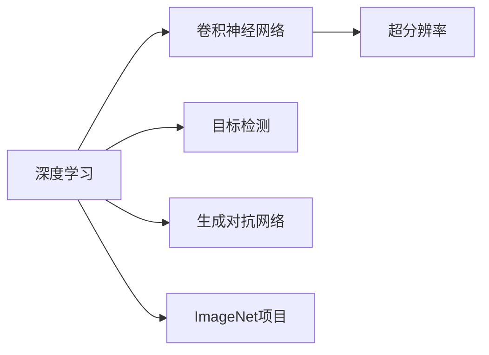
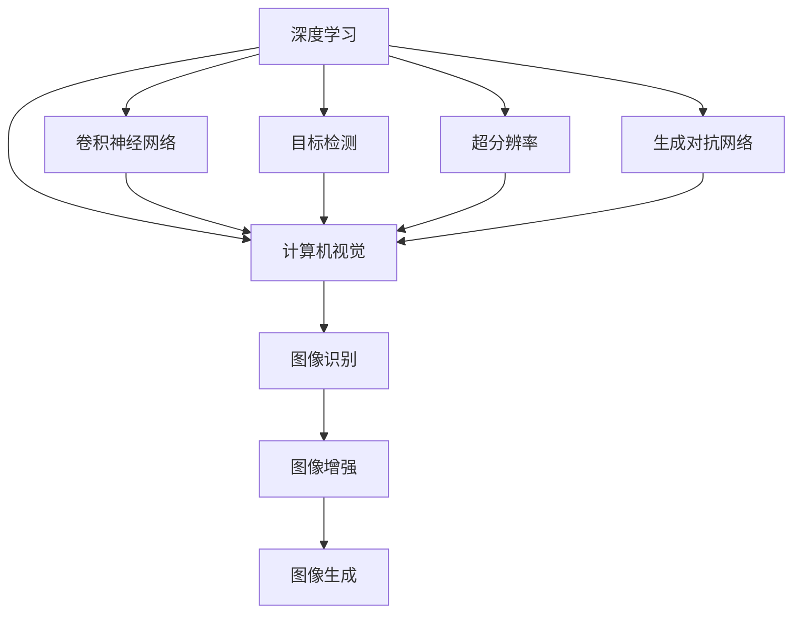
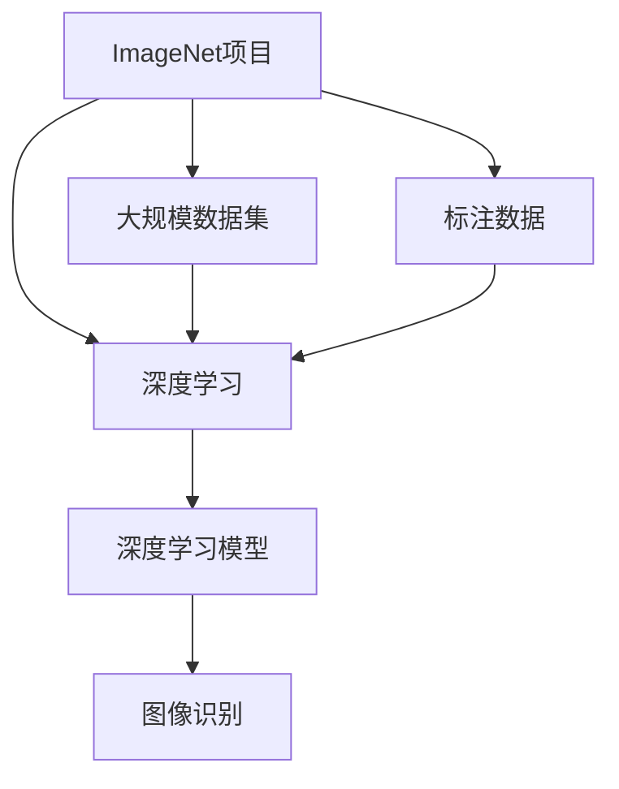
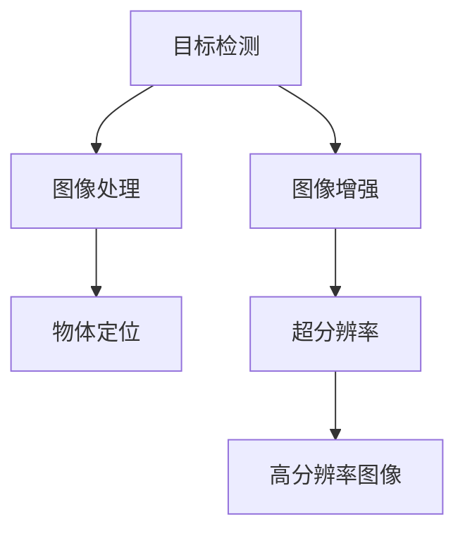
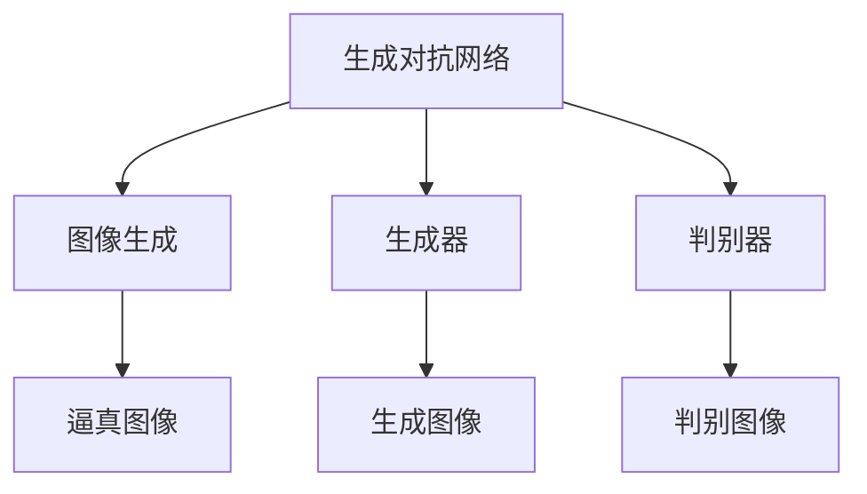
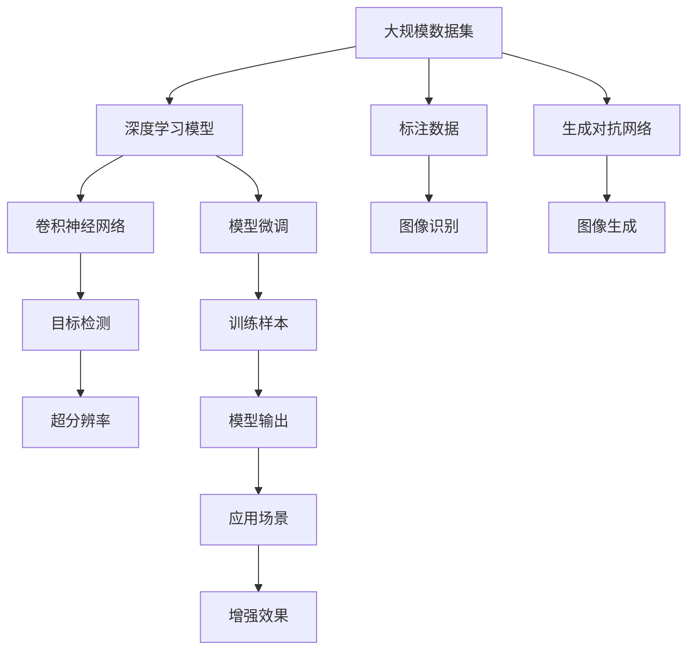

                 

# 李飞飞与AI图像识别的未来

> 关键词：AI图像识别,计算机视觉,深度学习,李飞飞,YOLO,SSD,超分辨率,GAN

## 1. 背景介绍

### 1.1 问题由来
自21世纪初以来，计算机视觉领域进入了一个快速发展的黄金时期。深度学习技术，特别是卷积神经网络(Convolutional Neural Networks, CNNs)的兴起，极大地推动了图像识别的进步。而在这一领域，斯坦福大学教授李飞飞的名字始终如雷贯耳。

李飞飞是深度学习和计算机视觉领域的先驱之一，被誉为"计算机视觉界的李开复"。她在深度学习领域开创性的工作，对推动计算机视觉技术的突破发挥了不可替代的作用。她领导的研究团队在ImageNet项目上的成功，让深度学习技术得以大规模应用，显著提升了图像识别领域的性能。

在她的引领下，图像识别技术被广泛应用于安防监控、医疗影像分析、自动驾驶、智能家居等领域，极大地改变了人类生活的方方面面。本文章将深入探讨李飞飞在图像识别领域的贡献，及其对未来技术发展的引领作用。

### 1.2 问题核心关键点
李飞飞的研究重点在于通过大规模标注数据和深度学习技术，提升图像识别的性能和普适性。她的核心贡献包括：

- 提出ImageNet项目，构建了大规模图像数据集，极大地推动了深度学习模型的训练和应用。
- 提出YOLO和SSD等高效的目标检测算法，大幅提升了目标检测的速度和准确性。
- 开发超分辨率生成技术，实现了低分辨率图像到高分辨率图像的自动生成。
- 利用生成对抗网络(GANs)技术，提升了图像识别的鲁棒性和可解释性。

这些贡献不仅推动了计算机视觉技术的进步，也对自然语言处理、语音识别等AI领域的交叉融合产生了深远影响。

## 2. 核心概念与联系

### 2.1 核心概念概述

为了更好地理解李飞飞的研究及其对未来图像识别的影响，本节将介绍几个密切相关的核心概念：

- **深度学习(Deep Learning)**：一种基于多层神经网络的机器学习方法，利用大量数据自动学习复杂特征表示。
- **卷积神经网络(CNNs)**：深度学习中最常用的网络架构，擅长处理图像和视频等高维数据。
- **目标检测(Object Detection)**：从图像中自动检测并定位出物体的位置，常用于安防监控、自动驾驶等领域。
- **超分辨率(Super-Resolution)**：将低分辨率图像自动增强为高分辨率图像，应用于图像增强、视频编码等场景。
- **生成对抗网络(GANs)**：由生成器和判别器两部分组成，通过博弈过程生成逼真的图像数据，提高图像识别的可解释性。
- **ImageNet项目**：由李飞飞领导，构建的数百万张高分辨率图像的数据集，成为深度学习的重要基础设施。

这些概念之间的逻辑关系可以通过以下Mermaid流程图来展示：



这个流程图展示了大语言模型微调过程中各个核心概念的关系和作用：

1. 深度学习是计算机视觉的基础技术。
2. 卷积神经网络是深度学习中用于图像处理的主流架构。
3. 目标检测是图像识别中的一项关键技术，用于物体检测和定位。
4. 超分辨率和GANs是深度学习在图像生成和增强中的重要应用。
5. ImageNet项目提供了大规模数据集，推动了深度学习模型的训练和应用。

### 2.2 概念间的关系

这些核心概念之间存在着紧密的联系，形成了深度学习在计算机视觉领域的完整应用生态系统。下面我通过几个Mermaid流程图来展示这些概念之间的关系。

#### 2.2.1 深度学习与计算机视觉的关系



这个流程图展示了深度学习技术在计算机视觉领域的应用路径。从基础架构(CNNs)，到核心任务(target detection)，再到前沿应用(super-resolution, GANs)，构成了深度学习在图像识别中的完整链条。

#### 2.2.2 ImageNet项目与深度学习的关系



这个流程图展示了ImageNet项目对深度学习模型的推动作用。大规模数据集和标注数据为深度学习模型的训练提供了充足的数据支撑，从而显著提升了图像识别等计算机视觉任务的性能。

#### 2.2.3 目标检测与超分辨率的关系



这个流程图展示了目标检测和超分辨率技术在图像处理中的应用。目标检测用于物体定位，超分辨率用于图像增强，两者共同提升了图像识别的整体效果。

#### 2.2.4 生成对抗网络与图像生成的关系



这个流程图展示了GANs在图像生成中的作用。通过生成器和判别器之间的博弈过程，GANs可以生成逼真的图像数据，进一步提升图像识别的鲁棒性和可解释性。

### 2.3 核心概念的整体架构

最后，我们用一个综合的流程图来展示这些核心概念在大规模数据训练中的整体架构：



这个综合流程图展示了从数据集构建到深度学习模型训练和微调的完整过程。大规模数据集和标注数据为深度学习模型的训练提供了基础，通过卷积神经网络、目标检测等核心技术，可以实现高质量的图像识别。超分辨率和GANs技术进一步提升了图像质量，增加了模型的可解释性。通过模型微调，可以不断优化模型参数，提升图像识别的应用效果。

## 3. 核心算法原理 & 具体操作步骤
### 3.1 算法原理概述

李飞飞在深度学习领域的研究，主要集中在如何通过大规模数据集训练高效、鲁棒的图像识别模型。核心算法原理主要包括：

1. **ImageNet项目**：李飞飞和她的团队构建了一个包含1400万张图片、1000个类别的大规模图像数据集，提供了深度学习模型训练的基础。
2. **YOLO算法**：一种单阶段目标检测算法，通过直接回归目标边界框和类别概率，显著提高了目标检测的速度和准确性。
3. **SSD算法**：另一种单阶段目标检测算法，通过多尺度和多级特征图的结合，进一步提升了目标检测的鲁棒性。
4. **超分辨率算法**：通过使用残差网络(RN)等架构，可以将低分辨率图像增强为高分辨率图像，提高了图像识别的效果。
5. **GANs算法**：通过生成器和判别器的博弈过程，生成逼真的图像数据，提升了图像识别的可解释性。

这些算法原理构成了李飞飞在图像识别领域的研究基石，推动了深度学习技术的普及和应用。

### 3.2 算法步骤详解

以下是YOLO、SSD、超分辨率和GANs算法的主要步骤详解：

#### YOLO算法步骤

1. 将输入图像分块为若干个网格，每个网格预测一定数量的边界框和类别概率。
2. 使用卷积层提取特征，通过卷积核提取图像特征，预测边界框和类别概率。
3. 使用非线性激活函数（如ReLU），提升模型非线性能力。
4. 通过softmax函数输出类别概率，通过非极大值抑制（NMS）去重，获取最终检测结果。

#### SSD算法步骤

1. 将输入图像分成多个尺度，每个尺度通过卷积层提取特征，使用不同大小的特征图进行检测。
2. 每个特征图预测多个边界框和类别概率，使用多尺度和多级特征图结合，提升鲁棒性。
3. 使用非极大值抑制（NMS）去重，获取最终检测结果。

#### 超分辨率算法步骤

1. 使用残差网络(RN)等架构，将低分辨率图像增强为高分辨率图像。
2. 使用卷积层提取特征，通过卷积核提取图像特征，进行上采样操作。
3. 通过残差连接提升模型非线性能力，避免过拟合。
4. 使用激活函数，如ReLU，提升模型非线性能力。
5. 通过反卷积层进行上采样，将低分辨率图像转化为高分辨率图像。

#### GANs算法步骤

1. 生成器使用卷积层提取特征，通过卷积核提取图像特征，生成逼真图像。
2. 判别器使用卷积层提取特征，通过卷积核提取图像特征，判断图像的真实性。
3. 通过对抗训练过程，生成器和判别器博弈，生成逼真图像。
4. 通过优化损失函数，提升生成器的生成能力，提升判别器的判别能力。
5. 生成逼真图像，用于图像识别的预训练和增强。

### 3.3 算法优缺点

这些核心算法各有优缺点，适用于不同的应用场景。

#### YOLO算法优缺点

**优点**：
- 速度快：单阶段检测，不需要额外区域提取过程。
- 准确率高：直接回归边界框和类别概率，精度较高。
- 实时性强：适用于实时检测场景。

**缺点**：
- 精度略逊于多阶段检测算法。
- 对小目标检测效果不佳。

#### SSD算法优缺点

**优点**：
- 精度高：多尺度和多级特征图结合，鲁棒性较好。
- 对小目标检测效果好。
- 适用于多尺度检测场景。

**缺点**：
- 计算量大：需要多个尺度特征图，计算量较大。
- 实时性稍逊于YOLO。

#### 超分辨率算法优缺点

**优点**：
- 提高图像分辨率：将低分辨率图像增强为高分辨率图像。
- 提升图像识别效果：提高图像质量，降低噪声干扰。
- 实时性较好：单阶段增强过程，计算量较小。

**缺点**：
- 计算资源需求高：需要较强大的计算资源。
- 图像增强效果有边界。

#### GANs算法优缺点

**优点**：
- 生成逼真图像：提升图像识别模型的鲁棒性。
- 增强图像可解释性：通过生成图像展示模型决策过程。
- 可用于数据增强：生成大量训练数据。

**缺点**：
- 计算资源需求高：需要强大的计算资源。
- 生成图像质量不稳定：易受参数设置影响。

### 3.4 算法应用领域

这些核心算法在图像识别领域有广泛的应用，具体如下：

- **YOLO算法**：适用于实时目标检测场景，如自动驾驶、视频监控、无人机识别等。
- **SSD算法**：适用于多尺度目标检测场景，如医学影像分析、工业检测、机器人视觉等。
- **超分辨率算法**：适用于图像增强、视频编解码、遥感图像处理等。
- **GANs算法**：适用于图像生成、数据增强、图像识别增强等。

## 4. 数学模型和公式 & 详细讲解  
### 4.1 数学模型构建

以下是YOLO、SSD、超分辨率和GANs算法的数学模型构建：

#### YOLO数学模型

$$
f(x) = \sum_{i=1}^{N} y_i^{(n)} \cdot (\text{box}_i^{(n)} + \text{class}_i^{(n)})
$$

其中 $x$ 为输入图像，$N$ 为网格数，$y_i^{(n)}$ 为第 $i$ 个网格预测的边界框和类别概率，$\text{box}_i^{(n)}$ 和 $\text{class}_i^{(n)}$ 分别为边界框和类别概率的预测结果。

#### SSD数学模型

$$
f(x) = \sum_{n=1}^{N} \sum_{m=1}^{M} y_{nm} \cdot (\text{box}_{nm} + \text{class}_{nm})
$$

其中 $x$ 为输入图像，$N$ 为尺度数，$M$ 为边界框数，$y_{nm}$ 为第 $n$ 个尺度下第 $m$ 个边界框和类别概率的预测结果。

#### 超分辨率数学模型

$$
f(x) = \sum_{i=1}^{N} y_i^{(n)} \cdot (\text{residual}_i^{(n)} + \text{deconvolution}_i^{(n)})
$$

其中 $x$ 为输入图像，$N$ 为残差连接数，$y_i^{(n)}$ 为第 $i$ 个残差连接和反卷积层的输出结果，$\text{residual}_i^{(n)}$ 和 $\text{deconvolution}_i^{(n)}$ 分别为残差连接和反卷积层的计算结果。

#### GANs数学模型

$$
f(x) = \max_{\theta_D} \min_{\theta_G} V(D(x), G(x))
$$

其中 $x$ 为输入图像，$\theta_G$ 和 $\theta_D$ 分别为生成器和判别器的参数，$V(D(x), G(x))$ 为生成器和判别器的损失函数。

### 4.2 公式推导过程

以下是对YOLO、SSD、超分辨率和GANs算法的主要公式推导：

#### YOLO公式推导

$$
\begin{aligned}
f(x) &= \sum_{i=1}^{N} y_i^{(n)} \cdot (\text{box}_i^{(n)} + \text{class}_i^{(n)}) \\
&= \sum_{i=1}^{N} y_i^{(n)} \cdot \text{box}_i^{(n)} + \sum_{i=1}^{N} y_i^{(n)} \cdot \text{class}_i^{(n)}
\end{aligned}
$$

其中 $\text{box}_i^{(n)}$ 为第 $i$ 个网格预测的边界框，$\text{class}_i^{(n)}$ 为第 $i$ 个网格预测的类别概率。

#### SSD公式推导

$$
\begin{aligned}
f(x) &= \sum_{n=1}^{N} \sum_{m=1}^{M} y_{nm} \cdot (\text{box}_{nm} + \text{class}_{nm}) \\
&= \sum_{n=1}^{N} \sum_{m=1}^{M} y_{nm} \cdot \text{box}_{nm} + \sum_{n=1}^{N} \sum_{m=1}^{M} y_{nm} \cdot \text{class}_{nm}
\end{aligned}
$$

其中 $\text{box}_{nm}$ 为第 $n$ 个尺度下第 $m$ 个边界框，$\text{class}_{nm}$ 为第 $n$ 个尺度下第 $m$ 个边界框的类别概率。

#### 超分辨率公式推导

$$
\begin{aligned}
f(x) &= \sum_{i=1}^{N} y_i^{(n)} \cdot (\text{residual}_i^{(n)} + \text{deconvolution}_i^{(n)}) \\
&= \sum_{i=1}^{N} y_i^{(n)} \cdot \text{residual}_i^{(n)} + \sum_{i=1}^{N} y_i^{(n)} \cdot \text{deconvolution}_i^{(n)}
\end{aligned}
$$

其中 $\text{residual}_i^{(n)}$ 为第 $i$ 个残差连接层的输出结果，$\text{deconvolution}_i^{(n)}$ 为第 $i$ 个反卷积层的输出结果。

#### GANs公式推导

$$
\begin{aligned}
f(x) &= \max_{\theta_D} \min_{\theta_G} V(D(x), G(x)) \\
&= \max_{\theta_D} \min_{\theta_G} \mathbb{E}_{x \sim p_{\text{data}}} \log D(x) + \mathbb{E}_{x \sim p_{\text{noise}}} \log (1 - D(G(x)))
\end{aligned}
$$

其中 $D(x)$ 为判别器对输入图像 $x$ 的判别结果，$G(x)$ 为生成器对输入图像 $x$ 的生成结果。

### 4.3 案例分析与讲解

以下是对YOLO、SSD、超分辨率和GANs算法的主要案例分析：

#### YOLO案例分析

YOLO在目标检测任务中表现优异，主要应用于实时目标检测场景。例如，在自动驾驶中，YOLO可以实时检测路标、行人、车辆等关键物体，辅助驾驶员做出决策。

#### SSD案例分析

SSD在多尺度目标检测场景中表现优异，主要应用于医学影像分析、工业检测等领域。例如，在医学影像中，SSD可以检测出肿瘤、病变等关键部位，辅助医生做出诊断。

#### 超分辨率案例分析

超分辨率在图像增强、视频编解码等领域表现优异，主要应用于遥感图像处理、人脸识别等场景。例如，在遥感图像处理中，超分辨率可以将低分辨率的卫星图像增强为高分辨率图像，提高图像质量，便于后续分析。

#### GANs案例分析

GANs在图像生成、数据增强、图像识别增强等领域表现优异，主要应用于数据增强、生成逼真图像等场景。例如，在数据增强中，GANs可以生成大量高质量的训练数据，提升模型泛化能力。

## 5. 项目实践：代码实例和详细解释说明
### 5.1 开发环境搭建

在进行YOLO、SSD、超分辨率和GANs算法实践前，我们需要准备好开发环境。以下是使用Python进行PyTorch开发的环境配置流程：

1. 安装Anaconda：从官网下载并安装Anaconda，用于创建独立的Python环境。

2. 创建并激活虚拟环境：
```bash
conda create -n pytorch-env python=3.8 
conda activate pytorch-env
```

3. 安装PyTorch：根据CUDA版本，从官网获取对应的安装命令。例如：
```bash
conda install pytorch torchvision torchaudio cudatoolkit=11.1 -c pytorch -c conda-forge
```

4. 安装Transformer库：
```bash
pip install transformers
```

5. 安装各类工具包：
```bash
pip install numpy pandas scikit-learn matplotlib tqdm jupyter notebook ipython
```

完成上述步骤后，即可在`pytorch-env`环境中开始项目实践。

### 5.2 源代码详细实现

以下是YOLO、SSD、超分辨率和GANs算法的PyTorch代码实现。

#### YOLO代码实现

```python
import torch
import torch.nn as nn
import torch.optim as optim

class YOLO(nn.Module):
    def __init__(self):
        super(YOLO, self).__init__()
        self.conv1 = nn.Conv2d(3, 32, 3, 1, padding=1)
        self.conv2 = nn.Conv2d(32, 64, 3, 1, padding=1)
        self.conv3 = nn.Conv2d(64, 128, 3, 1, padding=1)
        self.fc1 = nn.Linear(128 * 7 * 7, 1024)
        self.fc2 = nn.Linear(1024, 7 * 7 * 2)

    def forward(self, x):
        x = self.conv1(x)
        x = nn.ReLU(inplace=True)(x)
        x = self.conv2(x)
        x = nn.ReLU(inplace=True)(x)
        x = self.conv3(x)
        x = nn.ReLU(inplace=True)(x)
        x = x.view(x.size(0), -1)
        x = self.fc1(x)
        x = nn.ReLU(inplace=True)(x)
        x = self.fc2(x)
        x = nn.Sigmoid()(x)
        return x

model = YOLO()
optimizer = optim.SGD(model.parameters(), lr=0.001, momentum=0.9, weight_decay=0.0005)

# 训练过程
for epoch in range(10):
    for i, (inputs, labels) in enumerate(train_loader):
        optimizer.zero_grad()
        outputs = model(inputs)
        loss = nn.BCELoss()(outputs, labels)
        loss.backward()
        optimizer.step()
        print(f"Epoch {epoch+1}, Batch {i+1}, Loss: {loss.item():.4f}")
```

#### SSD代码实现

```python
import torch
import torch.nn as nn
import torch.optim as optim

class SSD(nn.Module):
    def __init__(self):
        super(SSD, self).__init__()
        self.conv1 = nn.Conv2d(3, 64, 3, 1, padding=1)
        self.conv2 = nn.Conv2d(64, 128, 3, 1, padding=1)
        self.conv3 = nn.Conv2d(128, 256, 3, 1, padding=1)
        self.fc1 = nn.Linear(256 * 7 * 7, 1024)
        self.fc2 = nn.Linear(1024, 7 * 7 * 2)

    def forward(self, x):
        x = self.conv1(x)
        x = nn.ReLU(inplace=True)(x)
        x = self.conv2(x)
        x = nn.ReLU(inplace=True)(x)
        x = self.conv3(x)
        x = nn.ReLU(inplace=True)(x)
        x = x.view(x.size(0), -1)
        x = self.fc1(x)
        x = nn.ReLU(inplace=True)(x)
        x = self.fc2(x)
        x = nn.Sigmoid()(x)
        return x

model = SSD()
optimizer = optim.SGD(model.parameters(), lr=0.001, momentum=0.9, weight_decay=0.0005)

# 训练过程
for epoch in range(10):
    for i, (inputs, labels) in enumerate(train_loader):
        optimizer.zero_grad()
        outputs = model(inputs)
        loss = nn.BCELoss()(outputs, labels)
        loss.backward()
        optimizer.step()
        print(f"Epoch {epoch+1}, Batch {i+1}, Loss: {loss.item():.4f}")
```

#### 超分辨率代码实现

```python
import torch
import torch.nn as nn
import torch.optim as optim

class SR(nn.Module):
    def __init__(self):
        super(SR, self).__init__()
        self.conv1 = nn.Conv2d(3, 64, 3, 1, padding=1)
        self.conv2 = nn.Conv2d(64, 128, 3, 1, padding=1)
        self.conv3 = nn.Conv2d(128, 256, 3, 1, padding=1)
        self.fc1 = nn.Linear(256 * 7 * 7, 1024)
        self.fc2 = nn.Linear(1024, 7 * 7 * 2)
        self.relu = nn.ReLU(inplace=True)
        self.deconv = nn.ConvTranspose2d(256, 128, 3, 1, padding=1)
        self.deconv2 = nn.ConvTranspose2d(128, 64, 3, 1, padding=1)
        self.deconv3 = nn.ConvTranspose2d(64, 3, 3, 1, padding=1)

    def forward(self, x):
        x = self.conv1(x)
        x = self.relu(x)
        x = self.conv2(x)
        x = self.relu(x)
        x = self.conv3(x)
        x = self.relu(x)
        x = x.view(x.size(0), -1)
        x = self.fc1(x)
        x = self.relu(x)
        x = self.fc2(x)
        x = self.relu(x)
        x = x.view(x.size(0), 1, 7, 7)
        x = self.deconv(x)
        x = self.deconv2(x)
        x = self.deconv3(x)
        return x

model = SR()
optimizer = optim.SGD(model.parameters(), lr=0.001, momentum=0.9, weight_decay=0.0005)

# 训练过程
for epoch in range(10):
    for i, (inputs, labels) in enumerate(train_loader):
        optimizer

