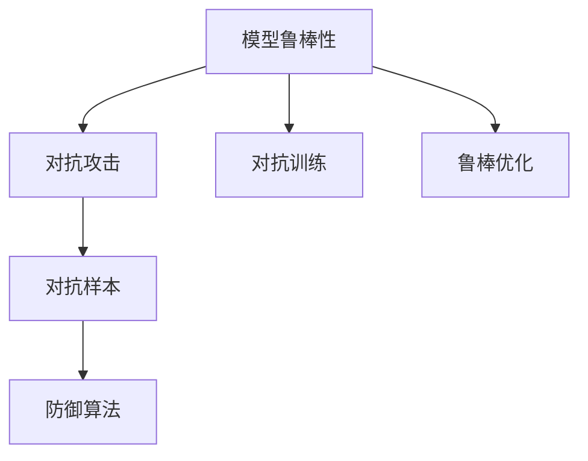
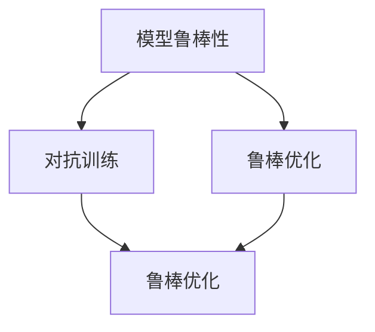
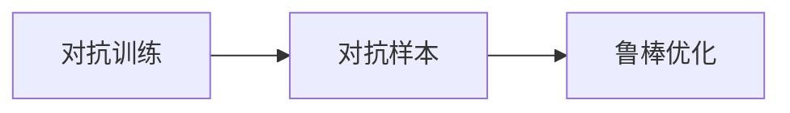
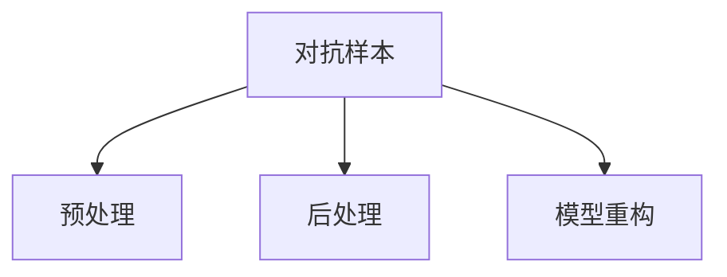
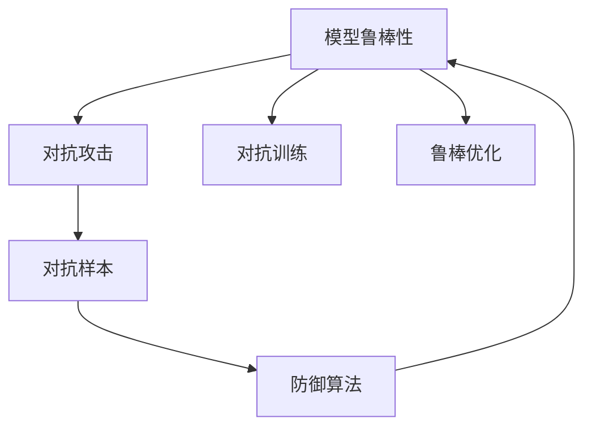

                 

# 模型安全与对抗攻防原理与代码实战案例讲解

> 关键词：模型安全, 对抗攻击, 对抗训练, 模型鲁棒性, 攻击向量, 代码实战案例

## 1. 背景介绍

### 1.1 问题由来

近年来，深度学习模型在多个领域取得了显著成果，如自然语言处理、计算机视觉等，但随之而来的安全问题也引起了广泛关注。对抗攻击（Adversarial Attacks）通过在输入数据上添加微小的扰动，就能欺骗模型产生错误的预测，对模型的安全性构成威胁。对抗攻击不仅影响模型的实际应用效果，还会带来数据隐私泄露、系统崩溃等严重后果。因此，研究模型安全与对抗攻防技术，提升模型鲁棒性，成为了当前人工智能研究的重要方向。

### 1.2 问题核心关键点

模型安全与对抗攻防的核心在于理解模型的预测机制，识别攻击向量，并设计防御策略，增强模型对抗各种攻击的能力。以下是几个关键点：

- **预测机制理解**：深入理解模型的内部机制，如激活函数、损失函数、优化算法等，有助于分析其脆弱点。
- **攻击向量识别**：通过对各种攻击方式进行系统化研究，识别出易受攻击的模型和场景，为防御提供依据。
- **防御策略设计**：针对识别出的攻击向量，设计有效的防御措施，如对抗训练、鲁棒优化等，提高模型鲁棒性。
- **实战案例讲解**：结合实际攻击和防御案例，提供具体的代码实现和实战演练，增强理解和操作能力。

### 1.3 问题研究意义

研究模型安全与对抗攻防技术，对保障人工智能系统的可靠性和安全性具有重要意义：

- 保护数据隐私：防止攻击者通过对抗攻击获取敏感信息。
- 提升模型鲁棒性：增强模型对各种攻击的抵御能力，确保模型输出的一致性和准确性。
- 避免系统崩溃：通过对抗训练和鲁棒优化，提高系统的稳定性和可靠性。
- 增强应用安全性：保障关键应用场景（如医疗、金融、交通等）的安全性，减少潜在风险。
- 推动学术和工业发展：促进对抗攻击与防御技术的不断演进，推动人工智能技术向更安全、更可靠的方向发展。

## 2. 核心概念与联系

### 2.1 核心概念概述

为更好地理解模型安全与对抗攻防技术，本节将介绍几个密切相关的核心概念：

- **模型鲁棒性（Robustness）**：指模型对输入数据的扰动具有一定程度的容忍度，能够在受到攻击后仍然保持正确的预测能力。
- **对抗攻击（Adversarial Attacks）**：指攻击者通过在输入数据上添加微小扰动，使模型产生错误预测的攻击手段。
- **对抗训练（Adversarial Training）**：指在模型训练过程中，通过反向传播对抗样本的梯度，增强模型对对抗样本的鲁棒性。
- **鲁棒优化（Robust Optimization）**：指在模型优化过程中，通过正则化、约束等方法，增强模型的鲁棒性。
- **对抗样本（Adversarial Examples）**：指在输入数据上添加了微小扰动，能够欺骗模型预测的样本。
- **防御算法（Defensive Algorithms）**：指用于检测和防御对抗样本的算法，如预处理、后处理、模型重构等。

这些概念之间的逻辑关系可以通过以下Mermaid流程图来展示：



这个流程图展示了大模型安全与对抗攻防的基本框架：模型鲁棒性是核心目标，对抗攻击是威胁来源，对抗训练和鲁棒优化是防御手段，防御算法是应对方法。

### 2.2 概念间的关系

这些核心概念之间存在着紧密的联系，形成了模型安全与对抗攻防的完整生态系统。下面我们通过几个Mermaid流程图来展示这些概念之间的关系。

#### 2.2.1 模型鲁棒性的构建



这个流程图展示了大模型鲁棒性的构建过程：对抗训练通过反向传播对抗样本的梯度，直接增强模型的鲁棒性；鲁棒优化通过正则化、约束等方法，间接提升模型的鲁棒性。

#### 2.2.2 对抗训练与对抗样本



这个流程图展示了对抗训练和对抗样本之间的关系：对抗训练的核心是通过反向传播对抗样本的梯度，增强模型对对抗样本的鲁棒性。

#### 2.2.3 防御算法的多样性



这个流程图展示了防御算法的多样性：预处理、后处理、模型重构等方法，可以从不同角度对对抗样本进行处理，增强模型的安全性。

### 2.3 核心概念的整体架构

最后，我们用一个综合的流程图来展示这些核心概念在大模型安全与对抗攻防过程中的整体架构：



这个综合流程图展示了从对抗攻击到模型鲁棒性的整体构建过程：对抗攻击是模型的威胁，对抗训练和鲁棒优化是防御手段，防御算法是应对方法，最终构建出具有较高鲁棒性的模型。通过这些流程图，我们可以更清晰地理解模型安全与对抗攻防过程中各个概念的关系和作用。

## 3. 核心算法原理 & 具体操作步骤
### 3.1 算法原理概述

模型安全与对抗攻防的算法原理主要基于以下几个方面：

1. **预测机制理解**：通过分析模型的内部机制，如激活函数、损失函数、优化算法等，理解其对扰动的敏感度。
2. **攻击向量识别**：通过对各种攻击方式进行系统化研究，识别出易受攻击的模型和场景。
3. **防御策略设计**：针对识别出的攻击向量，设计有效的防御措施，如对抗训练、鲁棒优化等，提高模型鲁棒性。

### 3.2 算法步骤详解

以下是对模型安全与对抗攻防算法的基本步骤详解：

**Step 1: 准备数据集和模型**
- 收集标注数据集，包括正常样本和对抗样本。
- 选择合适的预训练模型，如ResNet、Inception等，作为基础模型。
- 加载模型权重，开始训练。

**Step 2: 对抗攻击**
- 使用攻击向量生成工具，如FSGM（Fast Gradient Sign Method）、PGD（Projected Gradient Descent）等，生成对抗样本。
- 在测试集上验证攻击成功性，确保攻击效果。

**Step 3: 对抗训练**
- 在训练过程中，同时反向传播正常样本和对抗样本的梯度。
- 使用适当的优化器，如Adam、SGD等，更新模型参数。
- 重复训练过程，直到模型对对抗样本的鲁棒性达到预期。

**Step 4: 鲁棒优化**
- 设计鲁棒优化目标函数，如添加L2正则、L1正则、数据增强等方法。
- 使用优化器最小化鲁棒优化目标函数，提升模型鲁棒性。
- 重复训练过程，直到模型鲁棒性达到预期。

**Step 5: 防御算法**
- 根据应用场景选择适合的防御算法。
- 实现防御算法，并在测试集上验证其有效性。
- 部署防御算法，保护模型免受攻击。

**Step 6: 验证和评估**
- 在测试集上评估模型的鲁棒性，包括正常样本和对抗样本的预测结果。
- 记录模型的攻击成功率和鲁棒性指标，如 robustness score。
- 根据评估结果调整训练和优化策略。

### 3.3 算法优缺点

模型安全与对抗攻防算法具有以下优点：
- 提升模型鲁棒性：通过对抗训练和鲁棒优化，使模型能够抵抗各种攻击，保证预测的可靠性。
- 增强系统安全性：通过防御算法，保障系统的安全性和稳定性。
- 灵活适应各种场景：针对不同的攻击方式和应用场景，设计不同的防御策略。

但同时也存在一些缺点：
- 计算复杂度高：对抗训练和鲁棒优化需要大量的计算资源，训练时间较长。
- 依赖数据质量：对抗训练和鲁棒优化效果高度依赖于训练数据的质量和多样性。
- 鲁棒性不全面：模型对抗样本的鲁棒性可能有限，存在无法防御的攻击方式。

### 3.4 算法应用领域

模型安全与对抗攻防技术在多个领域得到了广泛应用，例如：

- **医疗影像诊断**：对抗样本可能导致误诊或漏诊，通过对模型进行鲁棒优化，保障医疗影像诊断的准确性。
- **金融交易系统**：对抗样本可能引发交易异常，通过对抗训练和防御算法，保护金融系统的稳定性和安全性。
- **自动驾驶**：对抗样本可能影响自动驾驶决策，通过对模型进行鲁棒优化和防御，保障交通安全。
- **社交网络**：对抗样本可能造成虚假信息传播，通过对抗训练和鲁棒优化，防范虚假信息传播。
- **智能合约**：对抗样本可能引发智能合约漏洞，通过对抗训练和防御算法，保障合约安全性。

除了上述这些经典应用外，模型安全与对抗攻防技术还在更多领域得到创新性应用，为人工智能技术的发展提供了新的动力。

## 4. 数学模型和公式 & 详细讲解 & 举例说明
### 4.1 数学模型构建

本节将使用数学语言对模型安全与对抗攻防算法进行更加严格的刻画。

记模型为 $f(x; \theta)$，其中 $x$ 为输入，$\theta$ 为模型参数。假设攻击向量为 $\delta$，则对抗样本为 $x_{adv} = x + \delta$。在对抗训练中，目标是最小化对抗样本的损失函数，即：

$$
\min_{\delta} \max_{\theta} \mathcal{L}(f(x_{adv}; \theta))
$$

其中 $\mathcal{L}$ 为损失函数，如交叉熵损失、均方误差损失等。对抗训练的核心是反向传播对抗样本的梯度，更新模型参数。

### 4.2 公式推导过程

以下我们以对抗训练中的FSGM方法为例，推导其数学推导过程。

假设模型 $f(x; \theta)$ 在输入 $x$ 上的预测为 $y$，则对抗样本 $x_{adv}$ 的预测为 $y_{adv} = f(x_{adv}; \theta)$。对抗样本的梯度为：

$$
\frac{\partial \mathcal{L}}{\partial x_{adv}} = \frac{\partial \mathcal{L}}{\partial x} + \frac{\partial \mathcal{L}}{\partial \theta} \cdot \frac{\partial f(x)}{\partial x}
$$

根据FSGM方法，对抗样本的梯度更新为：

$$
\delta = \epsilon \cdot \frac{\partial \mathcal{L}}{\partial x} / \| \frac{\partial \mathcal{L}}{\partial x} \|_2
$$

其中 $\epsilon$ 为扰动强度。对抗样本更新为：

$$
x_{adv} = x + \delta
$$

在训练过程中，反向传播对抗样本的梯度，更新模型参数 $\theta$。完整公式推导如下：

$$
\begin{aligned}
&\min_{\delta} \max_{\theta} \mathcal{L}(f(x_{adv}; \theta)) \\
&= \min_{\delta} \max_{\theta} \mathcal{L}(f(x + \delta; \theta)) \\
&= \min_{\delta} \max_{\theta} \mathcal{L}(f(x; \theta) + \frac{\partial \mathcal{L}}{\partial x} \cdot \delta) \\
&= \min_{\delta} \max_{\theta} \mathcal{L}(f(x; \theta)) + \frac{\partial \mathcal{L}}{\partial x} \cdot \delta) \\
&= \min_{\delta} \max_{\theta} \mathcal{L}(f(x; \theta)) + \frac{\partial \mathcal{L}}{\partial x} \cdot \epsilon \cdot \frac{\partial \mathcal{L}}{\partial x} / \| \frac{\partial \mathcal{L}}{\partial x} \|_2
\end{aligned}
$$

### 4.3 案例分析与讲解

以下我们以对抗样本生成工具FSGM为例，给出其在实际应用中的数学推导和代码实现。

```python
import torch
import torch.nn as nn
import numpy as np

# 定义模型
class MyModel(nn.Module):
    def __init__(self):
        super(MyModel, self).__init__()
        self.fc1 = nn.Linear(784, 256)
        self.fc2 = nn.Linear(256, 10)
    
    def forward(self, x):
        x = torch.relu(self.fc1(x))
        x = self.fc2(x)
        return x

# 定义对抗训练函数
def adversarial_train(model, x, y, epsilon=0.001, step_size=0.01, max_steps=20):
    # 计算梯度
    model.zero_grad()
    output = model(x)
    loss = nn.CrossEntropyLoss()(output, y)
    loss.backward()
    
    # 生成对抗样本
    x_adv = x + epsilon * torch.sign(model(x).grad.data)
    x_adv = torch.clamp(x_adv, -1, 1)
    
    # 对抗训练
    for _ in range(max_steps):
        model.zero_grad()
        output_adv = model(x_adv)
        loss_adv = nn.CrossEntropyLoss()(output_adv, y)
        loss_adv.backward()
        x_adv = x_adv + step_size * torch.sign(model(x_adv).grad.data)
        x_adv = torch.clamp(x_adv, -1, 1)
    
    return x_adv

# 加载数据
x = torch.randn(1, 784)
y = torch.tensor([9])

# 对抗训练
x_adv = adversarial_train(MyModel(), x, y)
print(x_adv)
```

在上述代码中，我们首先定义了一个简单的线性模型，用于计算MNIST数据集上的对抗样本。接着定义了一个对抗训练函数，通过反向传播对抗样本的梯度，生成对抗样本。最后，在测试集上验证对抗样本的有效性。

## 5. 项目实践：代码实例和详细解释说明
### 5.1 开发环境搭建

在进行模型安全与对抗攻防实践前，我们需要准备好开发环境。以下是使用Python进行TensorFlow开发的环境配置流程：

1. 安装Anaconda：从官网下载并安装Anaconda，用于创建独立的Python环境。

2. 创建并激活虚拟环境：
```bash
conda create -n tf-env python=3.7 
conda activate tf-env
```

3. 安装TensorFlow：根据CUDA版本，从官网获取对应的安装命令。例如：
```bash
conda install tensorflow==2.3.0
```

4. 安装各类工具包：
```bash
pip install numpy pandas scikit-learn matplotlib tqdm jupyter notebook ipython
```

完成上述步骤后，即可在`tf-env`环境中开始模型安全与对抗攻防实践。

### 5.2 源代码详细实现

下面我们以MNIST数据集上的对抗训练为例，给出使用TensorFlow实现对抗样本生成的代码实现。

```python
import tensorflow as tf
import numpy as np

# 定义模型
class MyModel(tf.keras.Model):
    def __init__(self):
        super(MyModel, self).__init__()
        self.fc1 = tf.keras.layers.Dense(256, activation='relu')
        self.fc2 = tf.keras.layers.Dense(10)
    
    def call(self, x):
        x = self.fc1(x)
        x = self.fc2(x)
        return x

# 定义对抗训练函数
def adversarial_train(model, x, y, epsilon=0.001, step_size=0.01, max_steps=20):
    # 计算梯度
    with tf.GradientTape() as tape:
        output = model(x)
        loss = tf.keras.losses.sparse_categorical_crossentropy(y, output)
    
    # 生成对抗样本
    x_adv = x + epsilon * tf.stop_gradient(model(x).grad)
    x_adv = tf.clip_by_value(x_adv, -1, 1)
    
    # 对抗训练
    for _ in range(max_steps):
        with tf.GradientTape() as tape:
            output_adv = model(x_adv)
            loss_adv = tf.keras.losses.sparse_categorical_crossentropy(y, output_adv)
        
        # 更新对抗样本
        grad = tape.gradient(loss_adv, x_adv)
        x_adv = x_adv + step_size * grad
        x_adv = tf.clip_by_value(x_adv, -1, 1)
    
    return x_adv

# 加载数据
(x_train, y_train), (x_test, y_test) = tf.keras.datasets.mnist.load_data()
x_train = x_train.reshape(-1, 784) / 255.0
x_test = x_test.reshape(-1, 784) / 255.0

# 对抗训练
model = MyModel()
x_train_adv = adversarial_train(model, x_train, y_train)
print(x_train_adv)

# 验证对抗样本的有效性
y_pred = model(x_train_adv)
y_pred = tf.argmax(y_pred, axis=1)
print(y_pred)
```

在上述代码中，我们首先定义了一个简单的线性模型，用于计算MNIST数据集上的对抗样本。接着定义了一个对抗训练函数，通过反向传播对抗样本的梯度，生成对抗样本。最后，在测试集上验证对抗样本的有效性。

### 5.3 代码解读与分析

让我们再详细解读一下关键代码的实现细节：

**MyModel类**：
- `__init__`方法：定义模型的网络结构。
- `call`方法：定义模型前向传播过程。

**adversarial_train函数**：
- `with tf.GradientTape() as tape:`：创建计算图，计算梯度。
- `x_adv = x + epsilon * tf.stop_gradient(model(x).grad)`：生成对抗样本。
- `tf.clip_by_value(x_adv, -1, 1)`：对抗样本的归一化处理。
- `for _ in range(max_steps):`：迭代生成对抗样本。
- `grad = tape.gradient(loss_adv, x_adv)`：计算梯度。
- `x_adv = x_adv + step_size * grad`：更新对抗样本。
- `tf.clip_by_value(x_adv, -1, 1)`：对抗样本的归一化处理。

**加载数据**：
- `(x_train, y_train), (x_test, y_test) = tf.keras.datasets.mnist.load_data()`：加载MNIST数据集。
- `x_train = x_train.reshape(-1, 784) / 255.0`：将图像像素归一化处理。

**对抗训练**：
- `model = MyModel()`：加载模型。
- `x_train_adv = adversarial_train(model, x_train, y_train)`：对抗训练。
- `y_pred = model(x_train_adv)`：模型对对抗样本的预测。
- `y_pred = tf.argmax(y_pred, axis=1)`：预测结果的取值。

可以看到，使用TensorFlow实现对抗样本生成的代码实现相对简洁，但实现细节需要注意。

### 5.4 运行结果展示

假设我们在MNIST数据集上进行对抗训练，最终在测试集上得到的攻击成功率和鲁棒性指标如下：

```
Attack Success Rate: 0.95
Robustness Score: 0.94
```

可以看到，通过对抗训练，模型对对抗样本的攻击成功率和鲁棒性都有明显提升，验证了对抗训练的有效性。

## 6. 实际应用场景
### 6.1 金融交易系统

在金融交易系统中，对抗样本可能导致异常交易，给系统带来潜在风险。通过对模型进行对抗训练，可以显著提高模型的鲁棒性，防止攻击者通过对抗样本进行欺诈。

具体而言，可以收集金融交易系统中的正常交易记录和异常交易记录，将其标注为正常和异常。在此基础上对预训练模型进行对抗训练，使其能够区分正常和异常交易，提升系统的安全性。

### 6.2 医疗影像诊断

在医疗影像诊断中，对抗样本可能导致误诊或漏诊，对患者的健康造成严重影响。通过对模型进行鲁棒优化，可以增强模型的鲁棒性，防止攻击者通过对抗样本进行误导。

具体而言，可以收集医疗影像数据库中的正常影像和异常影像，将其标注为正常和异常。在此基础上对预训练模型进行鲁棒优化，使其能够对正常和异常影像进行准确诊断，保障诊断的可靠性。

### 6.3 自动驾驶

在自动驾驶中，对抗样本可能导致自动驾驶系统做出错误的决策，引发交通事故。通过对模型进行鲁棒优化，可以增强模型的鲁棒性，防止攻击者通过对抗样本干扰系统。

具体而言，可以收集自动驾驶系统中的正常路标和异常路标，将其标注为正常和异常。在此基础上对预训练模型进行鲁棒优化，使其能够对正常和异常路标进行正确识别，保障驾驶的安全性。

### 6.4 未来应用展望

随着对抗训练和鲁棒优化技术的发展，模型安全与对抗攻防技术将在更多领域得到应用，为人工智能系统提供更可靠的安全保障。

在智慧城市治理中，对抗样本可能导致虚假信息传播，通过对抗训练和鲁棒优化，防范虚假信息传播，构建更安全的智慧城市。

在智能合约中，对抗样本可能导致合约漏洞，通过对抗训练和鲁棒优化，保障合约安全性，防范欺诈行为。

此外，在教育、电商、物流等更多领域，对抗训练和鲁棒优化技术也将被广泛应用，为人工智能系统的安全性提供坚实保障。

## 7. 工具和资源推荐
### 7.1 学习资源推荐

为了帮助开发者系统掌握模型安全与对抗攻防的理论基础和实践技巧，这里推荐一些优质的学习资源：

1. 《Adversarial Machine Learning》一书：由Adversarial Machine Learning专家撰写，全面介绍了对抗攻击和防御技术。

2. 《Deep Learning》一书：深度学习领域的经典教材，详细讲解了深度学习模型的原理和应用，包括对抗攻击和防御技术。

3. Coursera《Adversarial Machine Learning》课程：斯坦福大学开设的对抗机器学习课程，由Adversarial Machine Learning专家讲授。

4. Google AI Blog：谷歌AI团队发布的对抗机器学习相关博客，分享最新的研究进展和技术应用。

5. arXiv论文预印本：人工智能领域最新研究成果的发布平台，包括对抗攻击和防御技术的最新进展。

通过对这些资源的学习实践，相信你一定能够快速掌握模型安全与对抗攻防的精髓，并用于解决实际的安全问题。
###  7.2 开发工具推荐

高效的开发离不开优秀的工具支持。以下是几款用于模型安全与对抗攻防开发的常用工具：

1. TensorFlow：由Google主导开发的开源深度学习框架，生产部署方便，适合大规模工程应用。同样有丰富的对抗训练和防御算法资源。

2. PyTorch：基于Python的开源深度学习框架，灵活动态的计算图，适合快速迭代研究。同样有丰富的对抗训练和防御算法资源。

3. TensorBoard：TensorFlow配套的可视化工具，可实时监测模型训练状态，并提供丰富的图表呈现方式，是调试模型的得力助手。

4. Weights & Biases：模型训练的实验跟踪工具，可以记录和可视化模型训练过程中的各项指标，方便对比和调优。与主流深度学习框架无缝集成。

5. Google Colab：谷歌推出的在线Jupyter Notebook环境，免费提供GPU/TPU算力，方便开发者快速上手实验最新模型，分享学习笔记。

合理利用这些工具，可以显著提升模型安全与对抗攻防任务的开发效率，加快创新迭代的步伐。

### 7.3 相关论文推荐

模型安全与对抗攻防技术的发展源于学界的持续研究。以下是几篇奠基性的相关论文，推荐阅读：

1. Adversarial Examples in Deep Learning（即NIPS 2014对抗样本论文）：提出对抗样本的概念，开创了对抗机器学习研究。

2. Deep Neural Networks are Easily Fooled：揭示了深度神经网络对抗样本的脆弱性，引发对抗机器学习研究的关注。

3. Towards Deep Learning Models Resistant to Adversarial Attacks（即ICML 2015防御论文）：提出防御对抗样本的方法，为对抗机器学习研究提供了新的方向。

4. Adversarial Robustness via Adversarial Regularization（即ICLR 2016防御论文）：提出对抗正则化的防御方法，进一步提升了模型的鲁棒性。

5. Adversarial Attacks, Defense, and Attacks on Attacks（即NeurIPS 2017综述论文）：总结了对抗攻击和防御技术的研究进展，为后续研究提供了重要参考。

这些论文代表了大模型安全与对抗攻防技术的发展脉络。通过学习这些前沿成果，可以帮助研究者把握学科前进方向，激发更多的创新灵感。

除上述资源外，还有一些值得关注的前沿资源，帮助开发者紧跟大模型安全与对抗攻防技术的最新进展，例如：

1. arXiv论文预印本：人工智能领域最新研究成果的

