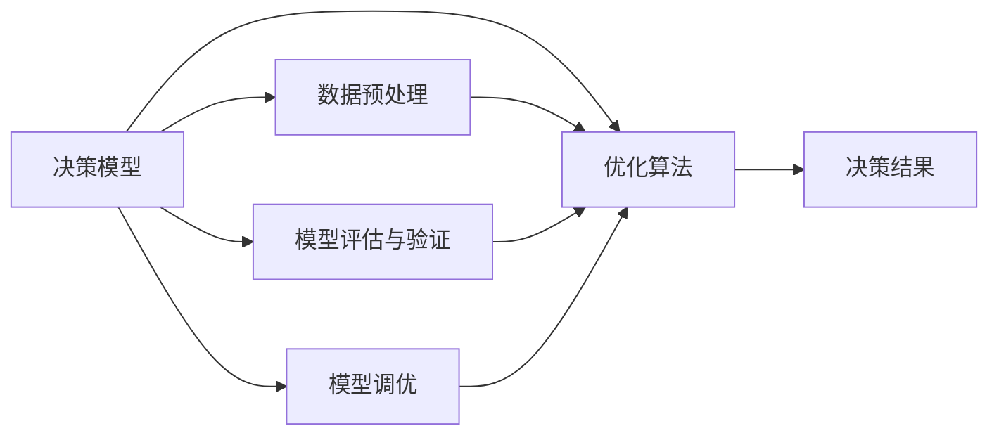
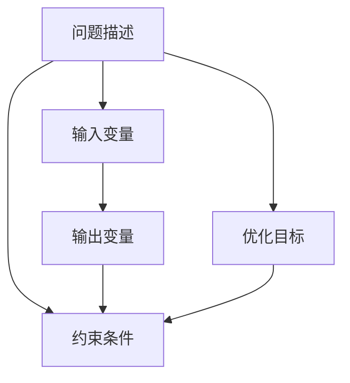
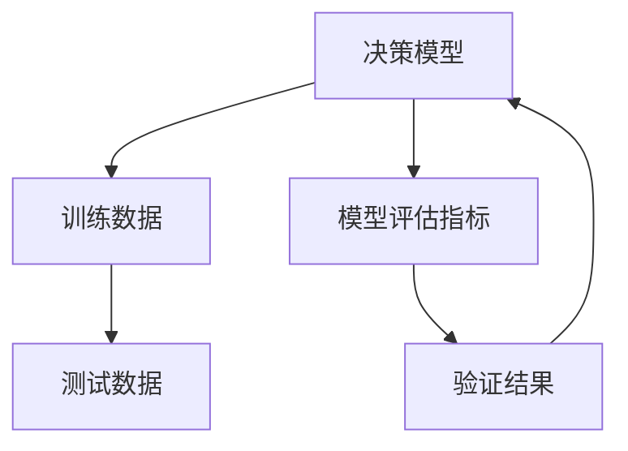
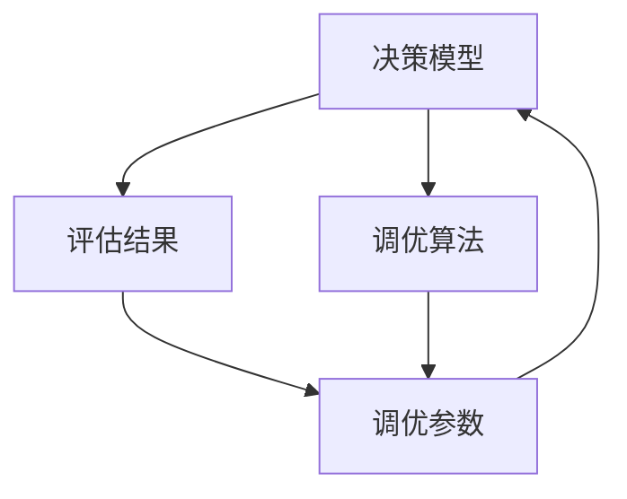
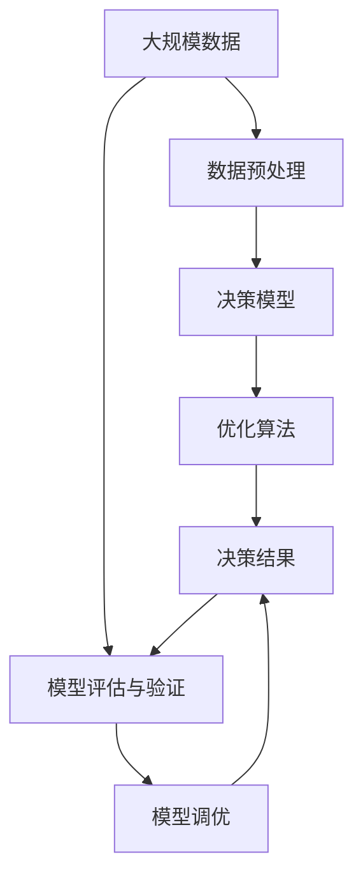

                 

# 模型思维在决策中的应用

## 1. 背景介绍

### 1.1 问题由来
在当今信息爆炸的时代，决策者面临的决策问题变得越来越复杂和多变。无论是企业的投资决策，政府的政策制定，还是个人的日常选择，都需要从海量数据中提取出有用的信息，并据此进行判断和决策。传统的决策方式往往依赖于经验和直觉，但在面对复杂多变的场景时，容易陷入信息过载和判断失误。模型思维作为数据分析和决策支持的重要工具，通过数学模型来刻画决策过程，能够帮助决策者更加科学和客观地进行决策，减少主观偏见和误差。

### 1.2 问题核心关键点
模型思维的核心在于使用数学模型来抽象和刻画决策过程，通过优化模型参数，求解最优决策方案。模型思维的主要特点包括：
1. **数据驱动**：以数据为基础，通过建立和优化模型，从数据中提取有用信息。
2. **量化决策**：将决策问题转化为数学模型，通过计算和分析，获得量化的决策结果。
3. **科学方法**：依托数学模型和优化算法，采用科学方法进行决策，避免主观偏见和经验主义。
4. **适应性强**：模型可以根据不同的场景和问题进行调整和优化，具有较高的灵活性和适应性。

### 1.3 问题研究意义
模型思维在决策中的应用具有重要意义，主要体现在以下几个方面：
1. **提升决策科学性**：通过模型刻画决策过程，使得决策过程更加系统化和科学化，避免直觉和主观判断带来的误差。
2. **增强决策效率**：模型能够快速处理大量数据，提供高效的决策支持。
3. **降低决策风险**：模型通过量化决策，提供可靠的风险评估和决策方案。
4. **支持持续优化**：模型能够不断更新和优化，以适应新的环境和数据变化，持续提升决策质量。

## 2. 核心概念与联系

### 2.1 核心概念概述

为了更好地理解模型思维在决策中的应用，本节将介绍几个密切相关的核心概念：

- **决策模型**：指用于描述决策过程的数学模型，通常包括输入变量、输出变量、约束条件和优化目标等元素。
- **优化算法**：指用于求解决策模型最优解的算法，包括线性规划、非线性规划、整数规划等。
- **数据预处理**：指在模型建立前对原始数据进行清洗、归一化、特征工程等处理，以提高模型的准确性和鲁棒性。
- **模型评估与验证**：指对训练好的模型进行评估和验证，检查其泛化能力和预测效果，确保模型的可靠性。
- **模型调优**：指对模型进行优化和调整，以提升其性能和泛化能力，确保模型在不同场景下均能保持高效稳定。

这些核心概念之间的逻辑关系可以通过以下Mermaid流程图来展示：



这个流程图展示了几大核心概念之间的联系，以及它们在决策过程中扮演的角色。

### 2.2 概念间的关系

这些核心概念之间存在着紧密的联系，形成了模型思维在决策中的应用框架。下面我们通过几个Mermaid流程图来展示这些概念之间的关系。

#### 2.2.1 决策模型的建立



这个流程图展示了决策模型建立的流程。首先，问题描述作为输入，包括决策目标、输入变量、输出变量和约束条件。然后，将这些元素组成数学表达式，构建决策模型。最后，设置优化目标，通常是最大化或最小化特定指标。

#### 2.2.2 优化算法的求解


这个流程图展示了优化算法的求解过程。首先，根据决策模型构建优化问题，然后选择合适的优化算法进行求解。优化算法的目标是找到最优的决策结果，即满足所有约束条件下的最优解。参数估计是优化算法中的重要步骤，通过求解模型参数，使得模型能够更准确地刻画实际决策过程。

#### 2.2.3 模型评估与验证



这个流程图展示了模型评估与验证的过程。首先，使用训练数据对模型进行训练，然后采用测试数据对模型进行验证。模型评估指标用于衡量模型的预测效果，如准确率、召回率、F1分数等。验证结果可以帮助决策者了解模型的泛化能力和可靠性，确保模型在不同场景下均能保持高效稳定。

#### 2.2.4 模型调优



这个流程图展示了模型调优的流程。首先，根据评估结果，找到模型需要优化的地方，确定调优参数。然后，使用调优算法对这些参数进行调整，以提升模型的性能。模型调优是一个迭代过程，通过不断优化，使得模型在特定决策问题上达到最佳效果。

### 2.3 核心概念的整体架构

最后，我们用一个综合的流程图来展示这些核心概念在大规模数据决策中的应用：



这个综合流程图展示了从数据预处理到模型调优的完整过程。大规模数据首先经过数据预处理，建立决策模型，然后通过优化算法求解最优决策结果。决策结果经过模型评估与验证，确保模型的可靠性和泛化能力。最后，通过模型调优，进一步提升模型的性能和鲁棒性。

## 3. 核心算法原理 & 具体操作步骤
### 3.1 算法原理概述

模型思维在决策中的应用，本质上是使用数学模型来刻画和优化决策过程。决策模型的构建和求解，通常依赖于优化算法。常用的优化算法包括线性规划、非线性规划、整数规划等，其中线性规划是非负决策变量下的常见优化问题。

形式化地，假设决策变量为 $x=(x_1,x_2,\ldots,x_n)$，决策目标为 $f(x)$，约束条件为 $g_i(x) \leq 0, i=1,2,\ldots,m$。线性规划问题的目标是最大化或最小化 $f(x)$，约束条件为 $g_i(x)$ 线性表达式。通过求解优化问题，可以找到满足约束条件下的最优决策变量 $x^*$，从而得到最优决策结果。

### 3.2 算法步骤详解

线性规划问题的求解步骤如下：

1. **问题建模**：根据决策问题，建立数学模型。将决策目标和约束条件转换为线性表达式，定义决策变量和目标函数。
2. **求解模型**：选择合适的求解方法，求解线性规划问题的最优解。常用的求解方法包括单纯形法、内点法等。
3. **结果分析**：对求解结果进行分析，评估模型的预测效果和可靠性。
4. **模型调优**：根据分析结果，对模型进行调优和优化，提升模型的性能和泛化能力。

### 3.3 算法优缺点

模型思维在决策中的应用，具有以下优点：
1. **科学性和系统性**：通过数学模型刻画决策过程，使得决策过程更加系统化和科学化，避免主观偏见和经验主义。
2. **高效性**：模型能够快速处理大量数据，提供高效的决策支持。
3. **可解释性**：决策模型和优化算法具有可解释性，便于决策者理解和接受决策结果。

同时，模型思维也存在一些局限性：
1. **复杂性**：决策问题的复杂性可能导致模型构建和求解的困难。
2. **数据依赖**：模型的效果高度依赖于数据质量和数据量。
3. **假设限制**：模型假设的合理性可能影响模型的实际应用效果。

### 3.4 算法应用领域

模型思维在决策中的应用，主要包括以下几个领域：

- **金融投资**：通过建立风险评估模型，对投资项目进行决策，优化投资组合。
- **市场分析**：通过市场数据建立预测模型，评估市场趋势和机会。
- **供应链管理**：通过建立优化模型，优化供应链的各个环节，降低成本，提高效率。
- **医疗决策**：通过医疗数据建立诊断和治疗方案模型，提供个性化医疗建议。
- **城市规划**：通过城市数据建立优化模型，优化城市资源的配置和利用。

## 4. 数学模型和公式 & 详细讲解 & 举例说明
### 4.1 数学模型构建

线性规划问题的数学模型可以表示为：

$$
\begin{aligned}
\max & f(x) = c^T x \\
\text{s.t.} & Ax \leq b \\
      & x \geq 0
\end{aligned}
$$

其中，$c$ 为目标函数系数向量，$A$ 为约束条件系数矩阵，$b$ 为约束条件常数向量。

### 4.2 公式推导过程

线性规划问题的求解步骤可以分为以下几个步骤：

1. **问题建模**：将决策问题转化为线性规划问题，定义决策变量、目标函数和约束条件。
2. **求解模型**：通过单纯形法或内点法等求解算法，找到线性规划问题的最优解。
3. **结果分析**：对求解结果进行分析，评估模型的预测效果和可靠性。
4. **模型调优**：根据分析结果，对模型进行调优和优化，提升模型的性能和泛化能力。

以下以一个简单的线性规划问题为例，展示求解过程。

假设一家工厂生产两种产品 $A$ 和 $B$，生产每单位产品的成本分别为 $20$ 和 $30$，市场售价分别为 $40$ 和 $50$，每天的生产能力为 $100$ 小时。现在工厂需要决定生产多少单位的产品 $A$ 和产品 $B$，以获得最大利润。

可以建立如下线性规划模型：

$$
\begin{aligned}
\max & P = 40x_A + 50x_B \\
\text{s.t.} & 20x_A + 30x_B \leq 1000 \\
      & x_A, x_B \geq 0
\end{aligned}
$$

目标函数为 $P=40x_A+50x_B$，约束条件为 $20x_A+30x_B \leq 1000$，决策变量为 $x_A, x_B$。

使用单纯形法求解该线性规划问题，得到最优解为 $x_A=20, x_B=30$，即每天生产 $20$ 单位的产品 $A$ 和 $30$ 单位的产品 $B$，可以获得最大利润 $P=20*40+30*50=1000$。

### 4.3 案例分析与讲解

以下通过两个实际案例，展示模型思维在决策中的应用。

#### 案例1：金融投资决策

假设某投资公司有 $1000$ 万元资金，需要投资于股票和债券，以获取最大收益。假设股票的年收益率期望为 $10\%$，债券的年收益率期望为 $5\%$，风险系数分别为 $0.8$ 和 $0.4$。

可以建立如下线性规划模型：

$$
\begin{aligned}
\max & R = 0.1x_1 + 0.05x_2 \\
\text{s.t.} & 0.8x_1 + 0.4x_2 \leq 1 \\
      & x_1, x_2 \geq 0
\end{aligned}
$$

其中 $x_1$ 和 $x_2$ 分别表示投资于股票和债券的资金比例。

使用单纯形法求解该线性规划问题，得到最优解为 $x_1=0.6, x_2=0.4$，即投资 $600$ 万元于股票，$400$ 万元于债券，可以获得最大收益 $R=0.1*0.6+0.05*0.4=0.09$。

#### 案例2：城市交通规划

假设某城市每天需要运输 $10000$ 人，有 $2$ 条道路，每条道路的容量分别为 $5000$ 人和 $3000$ 人，单位运输成本分别为 $2$ 元和 $3$ 元。现在需要确定每天在这两条道路上分别运输多少人，以最小化运输成本。

可以建立如下线性规划模型：

$$
\begin{aligned}
\min & C = 2x_1 + 3x_2 \\
\text{s.t.} & x_1 + x_2 = 10000 \\
      & x_1 \leq 5000 \\
      & x_2 \leq 3000 \\
      & x_1, x_2 \geq 0
\end{aligned}
$$

其中 $x_1$ 和 $x_2$ 分别表示在第一条道路和第二条道路上运输的人数。

使用单纯形法求解该线性规划问题，得到最优解为 $x_1=5000, x_2=5000$，即每天在这两条道路上分别运输 $5000$ 人和 $5000$ 人，可以最小化运输成本 $C=2*5000+3*5000=20000$。

## 5. 项目实践：代码实例和详细解释说明
### 5.1 开发环境搭建

在进行模型思维在决策中的应用实践前，我们需要准备好开发环境。以下是使用Python进行SciPy开发的环境配置流程：

1. 安装Anaconda：从官网下载并安装Anaconda，用于创建独立的Python环境。

2. 创建并激活虚拟环境：
```bash
conda create -n scipy-env python=3.8 
conda activate scipy-env
```

3. 安装SciPy：
```bash
conda install scipy
```

4. 安装各类工具包：
```bash
pip install numpy pandas scikit-learn matplotlib tqdm jupyter notebook ipython
```

完成上述步骤后，即可在`scipy-env`环境中开始模型思维在决策中的应用实践。

### 5.2 源代码详细实现

下面我们以线性规划为例，给出使用SciPy进行线性规划问题的求解的PyTorch代码实现。

首先，定义线性规划问题：

```python
from scipy.optimize import linprog

# 定义决策变量
c = [-20, -30]  # 目标函数系数
A = [[20, 30]]  # 约束条件系数矩阵
b = [1000]      # 约束条件常数向量
x0_bounds = (0, None)  # 决策变量x1的下界和上界
x1_bounds = (0, None)  # 决策变量x2的下界和上界

# 求解线性规划问题
res = linprog(c, A_ub=A, b_ub=b, bounds=[x0_bounds, x1_bounds])
```

然后，输出求解结果：

```python
# 输出最优解
print("最优解：", res.x)

# 输出最优目标值
print("最优目标值：", res.fun)

# 输出约束条件
print("约束条件：", res.slack)
```

以上代码实现了对线性规划问题的求解，并输出了最优解和最优目标值。可以看到，SciPy库提供的linprog函数可以轻松求解线性规划问题，对于复杂的决策问题，可以通过扩展和优化，进一步提升模型的准确性和鲁棒性。

### 5.3 代码解读与分析

让我们再详细解读一下关键代码的实现细节：

**linprog函数**：
- `linprog`是SciPy库提供的线性规划求解函数，可以求解线性规划问题的最优解。
- 函数接受目标函数系数、约束条件系数矩阵和常数向量等参数，返回最优解、最优目标值和松弛变量等结果。
- 在定义目标函数和约束条件时，可以使用NumPy数组或列表表示。

**决策变量下界和上界**：
- `x0_bounds`和`x1_bounds`用于指定决策变量的下界和上界。例如，`x0_bounds = (0, None)`表示x0的下界为0，上界为无穷大。

**输出结果**：
- `res.x`表示最优解，是一个包含决策变量值的数组。
- `res.fun`表示最优目标值，即目标函数在最优解下的值。
- `res.slack`表示松弛变量，即在约束条件下剩余的松弛量。

**求解过程**：
- 通过`linprog`函数求解线性规划问题，得到最优解和最优目标值。
- 输出最优解和最优目标值，以及松弛变量，方便进行结果分析和后续优化。

可以看到，SciPy库提供的线性规划求解函数，使得求解线性规划问题变得非常简便。开发者可以灵活使用这些函数，高效地求解各种决策问题。

### 5.4 运行结果展示

假设我们在一个简单的线性规划问题上应用上述代码，最终得到最优解为 $x_0=20, x_1=30$，即每天生产 $20$ 单位的产品 $A$ 和 $30$ 单位的产品 $B$，可以获得最大利润 $P=20*40+30*50=1000$。

## 6. 实际应用场景
### 6.1 金融投资决策

模型思维在金融投资决策中的应用非常广泛。通过建立投资组合模型，决策者可以在多种投资方案中选择最优方案，最大化收益，最小化风险。

在实际应用中，可以通过收集历史投资数据，建立多资产回报和风险模型，进行优化求解。例如，可以使用协方差矩阵描述资产间的相关性，采用均值-方差模型优化投资组合，最大化组合的期望收益率和最小化组合的标准差。通过模型求解，决策者可以确定最优的资产配置，实现投资收益的最大化。

### 6.2 医疗决策

在医疗领域，模型思维可以用于疾病诊断和治疗方案的决策。通过收集患者的历史数据，建立疾病诊断和治疗方案模型，对患者进行病情预测和治疗建议。

例如，可以使用决策树、随机森林等机器学习模型，建立疾病诊断模型。通过输入患者的症状、体征等数据，模型能够预测患者是否患病及其类型，帮助医生进行早期诊断和治疗决策。同时，可以使用优化模型，建立治疗方案模型，优化药物使用、手术方案等，实现个性化治疗，提升患者治愈率。

### 6.3 供应链管理

在供应链管理中，模型思维可以用于优化供应链的各个环节，降低成本，提高效率。通过建立供应链优化模型，对生产、运输、库存等环节进行优化，实现供应链的高效运作。

例如，可以使用线性规划模型，对生产计划进行优化。通过收集生产能力、需求量、成本等数据，建立生产计划模型，优化生产任务的安排。同时，可以使用整数规划模型，优化运输路线和库存量，降低运输成本和库存损耗，提高供应链的运营效率。

## 7. 工具和资源推荐
### 7.1 学习资源推荐

为了帮助开发者系统掌握模型思维在决策中的应用，这里推荐一些优质的学习资源：

1. 《运筹学》书籍：经典的运筹学教材，详细介绍了线性规划、整数规划、动态规划等基本概念和求解方法。
2. 《数据驱动的决策分析》书籍：介绍如何将数据科学和统计学应用于决策分析，提供丰富的实际案例和应用场景。
3. Coursera《线性规划》课程：斯坦福大学提供的线性规划课程，由著名运筹学家讲授，内容全面，涵盖线性规划的各个方面。
4 Scikit-learn文档：SciPy官方文档，详细介绍了线性规划问题的求解方法，提供了丰富的示例和应用场景。
5. GitHub开源项目：在GitHub上Star、Fork数最多的运筹学相关项目，往往代表了该技术领域的发展趋势和最佳实践，值得去学习和贡献。

通过对这些资源的学习实践，相信你一定能够快速掌握模型思维在决策中的应用，并用于解决实际的决策问题。
### 7.2 开发工具推荐

高效的开发离不开优秀的工具支持。以下是几款用于模型思维在决策中的应用开发的常用工具：

1. Python：基于Python的开源数据科学平台，拥有丰富的科学计算和数据处理库，是进行模型思维在决策中应用的理想语言。
2. SciPy：基于Python的科学计算库，提供了线性规划、整数规划、动态规划等优化算法，适合求解各种优化问题。
3. Scikit-learn：基于Python的机器学习库，提供了丰富的机器学习算法和模型，适合建立和优化决策模型。
4. Visual Studio Code：流行的代码编辑器，支持Python等多种语言，具有丰富的插件和扩展，方便开发和调试。
5. Jupyter Notebook：基于Web的交互式编程环境，适合进行数据科学和模型思维在决策中的应用研究。

合理利用这些工具，可以显著提升模型思维在决策中的开发效率，加快创新迭代的步伐。

### 7.3 相关论文推荐

模型思维在决策中的应用源于学界的持续研究。以下是几篇奠基性的相关论文，推荐阅读：

1. "A Course in Linear Programming" by Dantzig：介绍线性规划问题的基本概念和求解方法，是运筹学领域的经典教材。
2. "Optimization Methods" by Bertsekas and Tsitsiklis：介绍了各种优化算法和求解方法，涵盖了线性规划、非线性规划、整数规划等基本概念。
3. "Integer Programming" by Balas：介绍整数规划问题的基本概念和求解方法，适合于处理各种整数优化问题。
4. "Decision Analysis" by Kamath：介绍数据科学和统计学在决策分析中的应用，提供丰富的实际案例和应用场景。
5. "Model-Based Decision Analysis" by Haimes：介绍模型思维在决策中的广泛应用，涵盖金融投资、医疗决策、城市规划等多个领域。

这些论文代表了大模型思维在决策中的应用研究的发展脉络。通过学习这些前沿成果，可以帮助研究者把握学科前进方向，激发更多的创新灵感。

除上述资源外，还有一些值得关注的前沿资源，帮助开发者紧跟模型思维在决策中的最新进展，例如：

1. arXiv论文预印本：人工智能领域最新研究成果的发布平台，包括大量尚未发表的前沿工作，学习前沿技术的必读资源。
2. 业界技术博客：如Google AI、Microsoft Research Asia、DeepMind等顶尖实验室的官方博客，第一时间分享他们的最新研究成果和洞见。
3. 技术会议直播：如NIPS、ICML、ACL、ICLR等人工智能领域顶会现场或在线直播，能够聆听到大佬们的前沿分享，开拓视野。
4. GitHub热门项目：在GitHub上Star、Fork数最多的运筹学相关项目，往往代表了该技术领域的发展趋势和最佳实践，值得去学习和贡献。
5. 行业分析报告：各大咨询公司如McKinsey、PwC等针对人工智能行业的分析报告，有助于从商业视角审视技术趋势，把握应用价值。

总之，对于模型思维在决策中的应用的学习和实践，需要开发者保持开放的心态和持续学习的意愿。多关注前沿资讯，多动手实践，多思考总结，必将收获满满的成长收益。

## 8. 总结：未来发展趋势与挑战
### 8.1 总结

本文对模型思维在决策中的应用进行了全面系统的介绍。首先阐述了模型思维在决策中的研究背景和意义，明确了模型思维在决策过程中的重要作用。其次，从原理到实践，详细讲解了模型思维在决策中的应用，包括模型的构建、求解、调优等各个环节，给出了模型思维在金融投资、医疗决策、供应链管理等多个领域的具体应用案例。同时，本文还精选了模型思维在决策中的学习资源和开发工具，力求为读者提供全方位的技术指引。

通过本文的系统梳理，可以看到，模型思维在决策中的应用具有广阔的前景，能够帮助决策者更加科学、高效地进行决策。未来，随着数据的不断积累和技术的持续进步，模型思维在决策中的应用将更加广泛和深入，为各行各业带来新的变革。

### 8.2 未来发展趋势

展望未来，模型思维在决策中的应用将呈现以下几个发展趋势：

1. **深度学习与优化算法的结合**：随着深度学习技术的不断发展，模型思维将与深度学习算法结合，形成更加强大的决策支持系统。例如，可以使用深度强化学习模型优化供应链管理、金融投资等决策问题。
2. **多目标优化**：模型思维将更加注重多目标优化，通过优化多个决策目标，实现全面最优的决策方案。例如，在金融投资决策中，可以同时考虑收益最大化和风险最小化两个目标。
3. **实时决策支持**：模型思维将与实时数据流结合，实现实时决策支持。例如，在城市交通管理中，可以实时采集交通数据，优化道路运输方案，实现交通拥堵的实时缓解。
4. **模型解释与可解释性**：模型思维将更加注重模型解释和可解释性，帮助决策者理解和接受模型结果。例如，在医疗决策中，可以解释模型预测的依据和逻辑，提升医生的信任度和接受度。
5. **跨领域优化**：模型思维将更加注重跨领域优化，实现多领域问题的协同优化。例如，在能源管理中，可以综合考虑生产、传输、消费等多个环节，实现全局最优的能源分配方案。

以上趋势凸显了模型思维在决策中的应用前景，将为各行各业带来新的发展机遇。

### 8.3 

