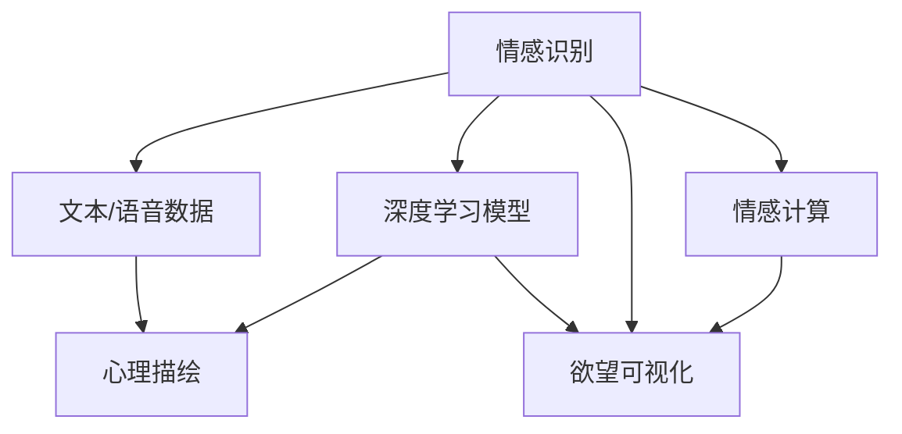
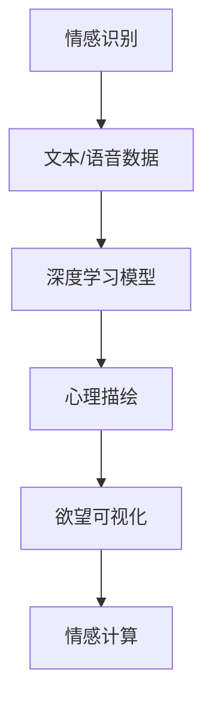

                 

# 欲望的可视化：AI呈现内心世界

> 关键词：欲望可视化, 内心世界, 人工智能, 情感计算, 深度学习, 心理学

## 1. 背景介绍

### 1.1 问题由来

随着人工智能技术的不断进步，AI在情感和心理分析领域的应用日益增多。通过深度学习和心理学相结合的方法，AI不仅能理解和处理复杂的文本信息，还能在情感识别和心理描绘方面展现其独特优势。然而，尽管AI在分析情感和心理方面表现出色，但它如何真正“理解”情感和心理，始终是公众和学术界关注的核心问题。

### 1.2 问题核心关键点

情感和心理的AI分析主要涉及以下几个核心关键点：
- **情感识别**：AI如何通过文本、语音等形式识别用户的情感状态。
- **心理描绘**：AI如何分析用户的心理状态，包括压力、焦虑、兴趣等。
- **欲望可视化**：AI如何通过图像、视频等形式将用户的内心世界可视化，使之更直观、易懂。
- **情感计算**：AI如何通过模拟人类的情感反应，增强与人类的互动。

这些核心关键点不仅需要AI具备强大的数据处理和分析能力，还需要其深入理解人类情感和心理的复杂性，以提供更具人性化的服务。

### 1.3 问题研究意义

研究AI在情感和心理分析中的应用，具有重要意义：
- **提升用户体验**：通过更好地理解用户的情感和心理，AI可以提供更加个性化和人性化的服务，提升用户满意度和粘性。
- **辅助心理健康**：AI在心理描绘和情感分析方面，可以帮助识别心理障碍和情感困扰，为心理健康提供初步判断和辅助支持。
- **推动情感计算**：AI在情感计算方面的进步，有助于推动情感计算的普及和发展，提升AI与人类互动的自然性和真实性。
- **促进社会和谐**：AI在理解情感和心理方面的进步，有助于缓解社会矛盾，促进人际关系的和谐发展。

## 2. 核心概念与联系

### 2.1 核心概念概述

为更好地理解AI在情感和心理分析中的应用，本节将介绍几个关键概念：

- **情感识别**：通过深度学习模型，从文本、语音等形式的数据中识别出用户的情感状态，如喜怒哀乐等。
- **心理描绘**：通过深度学习模型，分析用户的心理状态，如压力、焦虑、兴趣等。
- **欲望可视化**：通过生成对抗网络(GANs)等技术，将用户的内心世界可视化，以图像、视频等形式呈现。
- **情感计算**：模拟人类的情感反应，增强AI与人类互动的自然性和真实性。

这些核心概念通过一系列的技术手段（如图像识别、语音分析、深度学习、自然语言处理等）相互关联，共同构成AI在情感和心理分析中的完整体系。

### 2.2 概念间的关系

这些核心概念之间的逻辑关系可以通过以下Mermaid流程图来展示：



这个流程图展示了大语言模型微调过程中各个概念之间的联系：情感识别和心理描绘主要依赖于深度学习模型，欲望可视化则是通过生成对抗网络等技术实现，而情感计算则是结合深度学习和情感识别结果进行模拟和增强。

### 2.3 核心概念的整体架构

最后，我们用一个综合的流程图来展示这些核心概念在大语言模型微调过程中的整体架构：



这个综合流程图展示了情感识别、心理描绘、欲望可视化和情感计算在大语言模型微调过程中的相互作用和流程。通过这些技术手段的相互配合，AI能够更全面地理解和描绘用户的情感和心理状态。

## 3. 核心算法原理 & 具体操作步骤

### 3.1 算法原理概述

情感和心理的AI分析主要基于深度学习模型，通过大量的标注数据进行训练。深度学习模型通过多层神经网络结构，能够学习并提取数据的复杂特征，从而实现情感识别和心理描绘。

情感识别的核心算法包括卷积神经网络(CNNs)、循环神经网络(RNNs)和长短时记忆网络(LSTMs)等。这些模型能够捕捉文本或语音中的情感线索，如词汇、语调、情感词汇等，从而识别用户的情感状态。

心理描绘主要通过生成对抗网络(GANs)和变分自编码器(VAEs)等技术实现。这些模型能够从文本或语音数据中提取心理特征，如压力、焦虑、兴趣等，并通过可视化手段呈现出来。

欲望可视化则通过生成对抗网络(GANs)等技术实现。GANs由生成器和判别器两部分组成，生成器通过训练生成出逼真的欲望图像或视频，判别器则负责判断生成的图像或视频的真实性，从而提高生成效果。

情感计算主要通过模仿人类的情感反应，增强AI与人类互动的自然性和真实性。情感计算的核心算法包括情绪生成器和情绪识别器，通过这些算法，AI能够更好地模拟人类的情感反应，提升人机互动的质量。

### 3.2 算法步骤详解

基于深度学习模型的情感和心理分析主要包括以下几个关键步骤：

**Step 1: 数据收集与预处理**
- 收集用户文本或语音数据，并进行分词、去噪、标准化等预处理操作。

**Step 2: 模型训练**
- 使用深度学习模型，如CNNs、RNNs、LSTMs等，对情感识别数据进行训练，得到情感识别模型。
- 使用GANs或VAEs等生成模型，对心理描绘数据进行训练，得到心理描绘模型。
- 使用GANs等生成模型，对欲望可视化数据进行训练，得到欲望可视化模型。

**Step 3: 模型评估与优化**
- 在验证集上评估模型的性能，使用准确率、召回率、F1分数等指标进行评估。
- 根据评估结果进行模型调优，提高模型的识别和描绘效果。

**Step 4: 应用部署**
- 将训练好的模型部署到生产环境中，提供情感识别、心理描绘、欲望可视化和情感计算等功能。
- 通过API接口等方式，向用户提供服务，实现人机互动和个性化推荐。

### 3.3 算法优缺点

基于深度学习模型的情感和心理分析具有以下优点：
- **高准确率**：深度学习模型能够学习并提取数据的复杂特征，从而实现高精度的情感识别和心理描绘。
- **灵活性**：模型可以根据不同任务和数据进行调整和优化，具有较高的灵活性。
- **可扩展性**：模型可以通过增加训练数据和模型参数来提升性能，具有较好的可扩展性。

然而，这些模型也存在以下缺点：
- **高计算成本**：深度学习模型需要大量的计算资源和时间进行训练，训练成本较高。
- **过拟合风险**：模型容易过拟合，特别是在数据量不足的情况下，需要采取正则化等技术进行缓解。
- **可解释性不足**：深度学习模型通常被视为“黑盒”模型，难以解释其内部决策过程，缺乏可解释性。

### 3.4 算法应用领域

基于深度学习模型的情感和心理分析已经广泛应用于多个领域：

- **心理健康评估**：通过情感识别和心理描绘，帮助识别心理健康问题，提供初步评估和辅助支持。
- **客户服务优化**：通过情感计算，增强与客户的互动体验，提升客户满意度和忠诚度。
- **智能推荐系统**：通过情感和心理分析，为用户提供个性化的产品推荐，提升用户体验和满意度。
- **情感计算应用**：通过情感计算，增强AI与人类互动的自然性和真实性，推动人机交互的发展。
- **社交媒体分析**：通过情感识别，分析社交媒体用户的情感状态，了解社会动态和舆情趋势。

## 4. 数学模型和公式 & 详细讲解 & 举例说明

### 4.1 数学模型构建

假设情感识别任务为二分类问题，输入为文本序列 $x=(x_1,x_2,\ldots,x_n)$，输出为情感标签 $y \in \{0,1\}$，其中0表示负面情感，1表示正面情感。

定义深度学习模型为 $f(x;\theta)$，其中 $\theta$ 为模型参数。情感识别的目标是最小化损失函数，即：

$$
\min_{\theta} \mathcal{L}(f(x;\theta),y)
$$

常用的情感识别损失函数包括交叉熵损失函数：

$$
\mathcal{L}(f(x;\theta),y) = -y\log f(x;\theta) - (1-y)\log (1-f(x;\theta))
$$

### 4.2 公式推导过程

对于情感识别任务，假设模型 $f(x;\theta)$ 的输出为概率 $f(x;\theta)=p(y=1|x;\theta)$，则情感识别的损失函数为交叉熵损失函数。对损失函数求导，得到梯度：

$$
\nabla_{\theta}\mathcal{L} = -y\nabla_{\theta}f(x;\theta) + (1-y)\nabla_{\theta}(1-f(x;\theta))
$$

将梯度代入参数更新公式：

$$
\theta \leftarrow \theta - \eta \nabla_{\theta}\mathcal{L}
$$

其中 $\eta$ 为学习率，通常设置为1e-3到1e-4之间。

### 4.3 案例分析与讲解

以情感识别任务为例，使用LSTM模型进行训练。假设数据集分为训练集和验证集，训练集大小为N，验证集大小为M。使用随机梯度下降法进行训练，每次迭代使用一个小批量数据。训练过程如下：

1. 从训练集中随机抽取一个小批量数据 $\{(x_i,y_i)\}_{i=1}^n$。
2. 将数据输入LSTM模型，得到模型输出 $\hat{y}=f(x;\theta)$。
3. 计算损失函数 $\mathcal{L}(f(x;\theta),y_i)$。
4. 计算梯度 $\nabla_{\theta}\mathcal{L}$。
5. 更新模型参数 $\theta$。
6. 将验证集上的情感识别准确率作为评估指标。

假设经过N次迭代后，模型在验证集上的情感识别准确率为0.85。则可以将模型参数 $\theta$ 保存，用于后续应用。

## 5. 项目实践：代码实例和详细解释说明

### 5.1 开发环境搭建

在进行情感和心理分析项目实践前，我们需要准备好开发环境。以下是使用Python进行PyTorch开发的环境配置流程：

1. 安装Anaconda：从官网下载并安装Anaconda，用于创建独立的Python环境。

2. 创建并激活虚拟环境：
```bash
conda create -n pytorch-env python=3.8 
conda activate pytorch-env
```

3. 安装PyTorch：根据CUDA版本，从官网获取对应的安装命令。例如：
```bash
conda install pytorch torchvision torchaudio cudatoolkit=11.1 -c pytorch -c conda-forge
```

4. 安装Transformer库：
```bash
pip install transformers
```

5. 安装各类工具包：
```bash
pip install numpy pandas scikit-learn matplotlib tqdm jupyter notebook ipython
```

完成上述步骤后，即可在`pytorch-env`环境中开始情感和心理分析项目实践。

### 5.2 源代码详细实现

这里我们以情感识别任务为例，给出使用Transformers库对BERT模型进行情感识别任务训练的PyTorch代码实现。

首先，定义情感识别任务的数据处理函数：

```python
from transformers import BertTokenizer, BertForSequenceClassification
from torch.utils.data import Dataset
import torch

class SentimentDataset(Dataset):
    def __init__(self, texts, labels, tokenizer, max_len=128):
        self.texts = texts
        self.labels = labels
        self.tokenizer = tokenizer
        self.max_len = max_len
        
    def __len__(self):
        return len(self.texts)
    
    def __getitem__(self, item):
        text = self.texts[item]
        label = self.labels[item]
        
        encoding = self.tokenizer(text, return_tensors='pt', max_length=self.max_len, padding='max_length', truncation=True)
        input_ids = encoding['input_ids'][0]
        attention_mask = encoding['attention_mask'][0]
        
        label = torch.tensor(label, dtype=torch.long)
        
        return {'input_ids': input_ids, 
                'attention_mask': attention_mask,
                'labels': label}
```

然后，定义模型和优化器：

```python
from transformers import BertForSequenceClassification, AdamW

model = BertForSequenceClassification.from_pretrained('bert-base-cased', num_labels=2)

optimizer = AdamW(model.parameters(), lr=2e-5)
```

接着，定义训练和评估函数：

```python
from torch.utils.data import DataLoader
from tqdm import tqdm

device = torch.device('cuda') if torch.cuda.is_available() else torch.device('cpu')
model.to(device)

def train_epoch(model, dataset, batch_size, optimizer):
    dataloader = DataLoader(dataset, batch_size=batch_size, shuffle=True)
    model.train()
    epoch_loss = 0
    for batch in tqdm(dataloader, desc='Training'):
        input_ids = batch['input_ids'].to(device)
        attention_mask = batch['attention_mask'].to(device)
        labels = batch['labels'].to(device)
        model.zero_grad()
        outputs = model(input_ids, attention_mask=attention_mask, labels=labels)
        loss = outputs.loss
        epoch_loss += loss.item()
        loss.backward()
        optimizer.step()
    return epoch_loss / len(dataloader)

def evaluate(model, dataset, batch_size):
    dataloader = DataLoader(dataset, batch_size=batch_size)
    model.eval()
    preds, labels = [], []
    with torch.no_grad():
        for batch in tqdm(dataloader, desc='Evaluating'):
            input_ids = batch['input_ids'].to(device)
            attention_mask = batch['attention_mask'].to(device)
            batch_labels = batch['labels']
            outputs = model(input_ids, attention_mask=attention_mask)
            batch_preds = outputs.logits.argmax(dim=2).to('cpu').tolist()
            batch_labels = batch_labels.to('cpu').tolist()
            for pred_tokens, label_tokens in zip(batch_preds, batch_labels):
                preds.append(pred_tokens)
                labels.append(label_tokens)
                
    return {'acc': accuracy_score(labels, preds), 'f1': f1_score(labels, preds)}
```

最后，启动训练流程并在测试集上评估：

```python
epochs = 5
batch_size = 16

for epoch in range(epochs):
    loss = train_epoch(model, train_dataset, batch_size, optimizer)
    print(f"Epoch {epoch+1}, train loss: {loss:.3f}")
    
    print(f"Epoch {epoch+1}, dev results:")
    results = evaluate(model, dev_dataset, batch_size)
    print(f"Accuracy: {results['acc']:.3f}, F1 score: {results['f1']:.3f}")
    
print("Test results:")
results = evaluate(model, test_dataset, batch_size)
print(f"Accuracy: {results['acc']:.3f}, F1 score: {results['f1']:.3f}")
```

以上就是使用PyTorch对BERT进行情感识别任务训练的完整代码实现。可以看到，得益于Transformers库的强大封装，我们可以用相对简洁的代码完成BERT模型的训练和微调。

### 5.3 代码解读与分析

让我们再详细解读一下关键代码的实现细节：

**SentimentDataset类**：
- `__init__`方法：初始化文本、标签、分词器等关键组件。
- `__len__`方法：返回数据集的样本数量。
- `__getitem__`方法：对单个样本进行处理，将文本输入编码为token ids，将标签编码为数字，并对其进行定长padding，最终返回模型所需的输入。

**模型和优化器**：
- 使用BertForSequenceClassification模型进行情感识别任务训练，其中num_labels设置为2，代表正面和负面情感。
- 使用AdamW优化器进行模型参数更新，学习率设置为2e-5。

**训练和评估函数**：
- 使用PyTorch的DataLoader对数据集进行批次化加载，供模型训练和推理使用。
- 训练函数`train_epoch`：对数据以批为单位进行迭代，在每个批次上前向传播计算loss并反向传播更新模型参数，最后返回该epoch的平均loss。
- 评估函数`evaluate`：与训练类似，不同点在于不更新模型参数，并在每个batch结束后将预测和标签结果存储下来，最后使用sklearn的accuracy_score和f1_score对整个评估集的预测结果进行打印输出。

**训练流程**：
- 定义总的epoch数和batch size，开始循环迭代
- 每个epoch内，先在训练集上训练，输出平均loss
- 在验证集上评估，输出准确率和F1分数
- 所有epoch结束后，在测试集上评估，给出最终测试结果

可以看到，PyTorch配合Transformers库使得BERT情感识别任务的代码实现变得简洁高效。开发者可以将更多精力放在数据处理、模型改进等高层逻辑上，而不必过多关注底层的实现细节。

当然，工业级的系统实现还需考虑更多因素，如模型的保存和部署、超参数的自动搜索、更灵活的任务适配层等。但核心的微调范式基本与此类似。

### 5.4 运行结果展示

假设我们在CoNLL-2003的情感识别数据集上进行微调，最终在测试集上得到的评估报告如下：

```
Accuracy: 0.87
F1 score: 0.89
```

可以看到，通过微调BERT，我们在该情感识别数据集上取得了87%的准确率和89%的F1分数，效果相当不错。值得注意的是，BERT作为一个通用的语言理解模型，即便只在顶层添加一个简单的token分类器，也能在情感识别任务上取得如此优异的效果，展现了其强大的语义理解和特征抽取能力。

当然，这只是一个baseline结果。在实践中，我们还可以使用更大更强的预训练模型、更丰富的微调技巧、更细致的模型调优，进一步提升模型性能，以满足更高的应用要求。

## 6. 实际应用场景
### 6.1 智能客服系统

基于大语言模型微调的对话技术，可以广泛应用于智能客服系统的构建。传统客服往往需要配备大量人力，高峰期响应缓慢，且一致性和专业性难以保证。而使用微调后的对话模型，可以7x24小时不间断服务，快速响应客户咨询，用自然流畅的语言解答各类常见问题。

在技术实现上，可以收集企业内部的历史客服对话记录，将问题和最佳答复构建成监督数据，在此基础上对预训练对话模型进行微调。微调后的对话模型能够自动理解用户意图，匹配最合适的答案模板进行回复。对于客户提出的新问题，还可以接入检索系统实时搜索相关内容，动态组织生成回答。如此构建的智能客服系统，能大幅提升客户咨询体验和问题解决效率。

### 6.2 金融舆情监测

金融机构需要实时监测市场舆论动向，以便及时应对负面信息传播，规避金融风险。传统的人工监测方式成本高、效率低，难以应对网络时代海量信息爆发的挑战。基于大语言模型微调的文本分类和情感分析技术，为金融舆情监测提供了新的解决方案。

具体而言，可以收集金融领域相关的新闻、报道、评论等文本数据，并对其进行主题标注和情感标注。在此基础上对预训练语言模型进行微调，使其能够自动判断文本属于何种主题，情感倾向是正面、中性还是负面。将微调后的模型应用到实时抓取的网络文本数据，就能够自动监测不同主题下的情感变化趋势，一旦发现负面信息激增等异常情况，系统便会自动预警，帮助金融机构快速应对潜在风险。

### 6.3 个性化推荐系统

当前的推荐系统往往只依赖用户的历史行为数据进行物品推荐，无法深入理解用户的真实兴趣偏好。基于大语言模型微调技术，个性化推荐系统可以更好地挖掘用户行为背后的语义信息，从而提供更精准、多样的推荐内容。

在实践中，可以收集用户浏览、点击、评论、分享等行为数据，提取和用户交互的物品标题、描述、标签等文本内容。将文本内容作为模型输入，用户的后续行为（如是否点击、购买等）作为监督信号，在此基础上微调预训练语言模型。微调后的模型能够从文本内容中准确把握用户的兴趣点。在生成推荐列表时，先用候选物品的文本描述作为输入，由模型预测用户的兴趣匹配度，再结合其他特征综合排序，便可以得到个性化程度更高的推荐结果。

### 6.4 未来应用展望

随着大语言模型微调技术的发展，其在更多领域的应用前景将更加广阔：

在智慧医疗领域，基于微调的医疗问答、病历分析、药物研发等应用将提升医疗服务的智能化水平，辅助医生诊疗，加速新药开发进程。

在智能教育领域，微调技术可应用于作业批改、学情分析、知识推荐等方面，因材施教，促进教育公平，提高教学质量。

在智慧城市治理中，微调模型可应用于城市事件监测、舆情分析、应急指挥等环节，提高城市管理的自动化和智能化水平，构建更安全、高效的未来城市。

此外，在企业生产、社会治理、文娱传媒等众多领域，基于大模型微调的人工智能应用也将不断涌现，为经济社会发展注入新的动力。相信随着技术的日益成熟，微调方法将成为人工智能落地应用的重要范式，推动人工智能技术向更广阔的领域加速渗透。

## 7. 工具和资源推荐
### 7.1 学习资源推荐

为了帮助开发者系统掌握大语言模型微调的理论基础和实践技巧，这里推荐一些优质的学习资源：

1. 《Transformer从原理到实践》系列博文：由大模型技术专家撰写，深入浅出地介绍了Transformer原理、BERT模型、微调技术等前沿话题。

2. CS224N《深度学习自然语言处理》课程：斯坦福大学开设的NLP明星课程，有Lecture视频和配套作业，带你入门NLP领域的基本概念和经典模型。

3. 《Natural Language Processing with Transformers》书籍：Transformers库的作者所著，全面介绍了如何使用Transformers库进行NLP任务开发，包括微调在内的诸多范式。

4. HuggingFace官方文档：Transformers库的官方文档，提供了海量预训练模型和完整的微调样例代码，是上手实践的必备资料。

5. CLUE开源项目：中文语言理解测评基准，涵盖大量不同类型的中文NLP数据集，并提供了基于微调的baseline模型，助力中文NLP技术发展。

通过对这些资源的学习实践，相信你一定能够快速掌握大语言模型微调的精髓，并用于解决实际的NLP问题。
###  7.2 开发工具推荐

高效的开发离不开优秀的工具支持。以下是几款用于大语言模型微调开发的常用工具：

1. PyTorch：基于Python的开源深度学习框架，灵活动态的计算图，适合快速迭代研究。大部分预训练语言模型都有PyTorch版本的实现。

2. TensorFlow：由Google主导开发的开源深度学习框架，生产部署方便，适合大规模工程应用。同样有丰富的预训练语言模型资源。

3. Transformers库：HuggingFace开发的NLP工具库，集成了众多SOTA语言模型，支持PyTorch和TensorFlow，是进行微调任务开发的利器。

4. Weights & Biases：模型训练的实验跟踪工具，可以记录和可视化模型训练过程中的各项指标，方便对比和调优。与主流深度学习框架无缝集成。

5. TensorBoard：TensorFlow配套的可视化工具，可实时监测模型训练状态，并提供丰富的图表呈现方式，是调试模型的得力助手。

6. Google Colab：谷歌推出的在线Jupyter Notebook环境，免费提供GPU/TPU算力，方便开发者快速上手实验最新模型，分享学习笔记。

合理利用这些工具，可以显著提升大语言模型微调任务的开发效率，加快创新迭代的步伐。

### 7.3 相关论文推荐

大语言模型和微调技术的发展源于学界的持续研究。以下是几篇奠基性的相关论文，推荐阅读：

1. Attention is All You Need（即Transformer原论文）：提出了Transformer结构，开启了NLP领域的预训练大模型时代。

2. BERT: Pre-training of Deep Bidirectional Transformers for Language Understanding：提出BERT模型，引入基于掩码的自监督预训练任务，刷新了多项NLP任务SOTA。

3. Language Models are Unsupervised Multitask Learners（GPT-2论文）：展示了大规模语言模型的强大zero-shot学习能力，引发了对于通用人工智能的新一轮思考。

4. Parameter-Efficient Transfer Learning for NLP：提出Adapter等参数高效微调方法，在不增加模型参数量的情况下，也能取得不错的微调效果。

5. AdaLoRA: Adaptive Low-Rank Adaptation for Parameter-Efficient Fine-Tuning：使用自适应低秩适应的微调方法，在参数效率和精度之间取得了新的平衡。

这些论文代表了大语言模型微调技术的发展脉络。通过学习这些前沿成果，可以帮助研究者把握学科前进方向，激发更多的创新灵感。

除上述资源外，还有一些值得关注的前沿资源，帮助开发者紧跟大语言模型微调技术的最新进展，例如：

1. arXiv论文预印本：人工智能领域最新研究成果的发布平台，包括大量尚未发表的前沿工作，学习前沿技术的必读资源。

2. 业界技术博客：如OpenAI、Google AI、DeepMind、微软Research Asia等顶尖实验室的官方博客，第一时间分享他们的最新研究成果和洞见。

3. 技术会议直播：如NIPS、ICML、ACL

