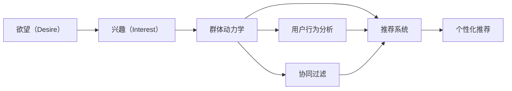
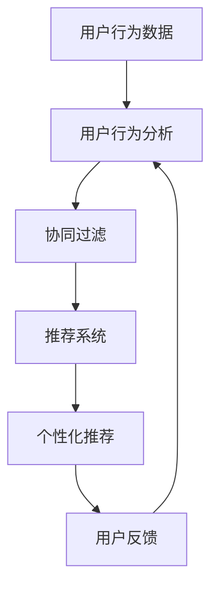
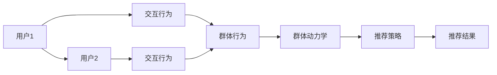

                 

# 欲望社会化网络：AI驱动的群体动力学平台

> 关键词：社会化网络, AI驱动, 群体动力学, 协同过滤, 推荐系统, 用户行为分析, 个性化推荐

## 1. 背景介绍

在信息时代，人们越来越多地依赖在线平台进行社交互动和信息获取，无论是社交媒体、电商平台还是内容社区，社会化网络已成为日常生活中不可或缺的一部分。然而，传统社会化网络往往缺乏有效的推荐算法，导致用户难以发现感兴趣的互动内容，影响用户体验和平台粘性。

为了解决这一问题，我们提出了一种基于人工智能的群体动力学平台，即“欲望社会化网络”（Desire Social Network, DSN）。DSN通过AI驱动的推荐算法和用户行为分析技术，能够识别用户潜在的欲望（Desire）和兴趣（Interest），并据此推荐最符合其需求的内容。通过不断迭代优化，DSN能够满足用户日益变化的需求，提升用户体验和平台活跃度。

## 2. 核心概念与联系

### 2.1 核心概念概述

为更好地理解DSN的原理和架构，我们首先介绍几个核心概念：

- **欲望（Desire）**：指用户的内在需求和欲望，如购买某款商品、参与某项活动等。欲望是个性化推荐的出发点，DSN通过数据分析和算法挖掘，识别用户的欲望，从而精准推荐相关内容。
- **兴趣（Interest）**：指用户对特定领域的喜好和关注，如体育、音乐、科技等。兴趣是欲望的延伸，DSN通过兴趣图谱构建，进一步细分用户的兴趣类别，以实现更精确的推荐。
- **群体动力学**：指个体在社会互动中形成的群体行为规律，DSN基于群体动力学理论，构建社交网络，并通过协同过滤等算法，实现用户之间的互动和信息共享。
- **协同过滤（Collaborative Filtering）**：指通过分析用户行为数据，预测用户可能感兴趣的物品或内容，是DSN推荐的核心算法之一。
- **推荐系统（Recommendation System）**：利用用户行为数据和物品属性，为用户推荐可能感兴趣的物品，DSN是基于协同过滤等技术的推荐系统。
- **用户行为分析（User Behavior Analysis）**：指通过分析用户在线行为数据，提取用户偏好和行为模式，是DSN推荐的依据。
- **个性化推荐（Personalized Recommendation）**：根据用户特定需求和偏好，推荐个性化内容，提升用户体验和满意度。

这些核心概念之间的逻辑关系可以通过以下Mermaid流程图来展示：



这个流程图展示了DSN的核心概念及其之间的关系：

1. 欲望驱动兴趣图谱构建。
2. 兴趣图谱用于群体动力学的计算。
3. 群体动力学和协同过滤算法结合，实现推荐。
4. 用户行为分析反馈，进一步优化推荐结果。
5. 个性化推荐提高用户体验。

### 2.2 概念间的关系

这些核心概念之间存在着紧密的联系，形成了DSN推荐的完整生态系统。下面我们通过几个Mermaid流程图来展示这些概念之间的关系。

#### 2.2.1 DSN的推荐流程



这个流程图展示了DSN推荐的整体流程：

1. 收集用户行为数据。
2. 分析用户行为数据，提取用户偏好和行为模式。
3. 应用协同过滤算法，生成推荐结果。
4. 根据个性化推荐结果，向用户展示推荐内容。
5. 收集用户反馈，反馈到用户行为分析模块，进一步优化推荐。

#### 2.2.2 DSN的群体动力学



这个流程图展示了群体动力学在DSN推荐中的作用：

1. 用户1和用户2进行互动，产生交互行为。
2. 交互行为汇总，用于群体行为计算。
3. 群体行为通过群体动力学模型计算，生成群体特征。
4. 群体特征用于协同过滤等推荐算法，生成推荐策略。
5. 推荐策略转化为个性化推荐结果，提升用户体验。

## 3. 核心算法原理 & 具体操作步骤

### 3.1 算法原理概述

DSN的核心算法包括欲望识别、兴趣图谱构建、群体动力学计算和个性化推荐等。我们首先概述这些算法的基本原理。

- **欲望识别**：通过分析用户行为数据，识别用户的潜在欲望，如购买意图、参与欲望等。
- **兴趣图谱构建**：根据用户的兴趣行为，构建兴趣图谱，细化用户的兴趣类别。
- **群体动力学计算**：通过用户之间的互动行为，构建群体特征，并根据群体特征进行推荐。
- **个性化推荐**：基于协同过滤、深度学习等技术，生成个性化的推荐结果。

### 3.2 算法步骤详解

以下我们详细讲解DSN的算法步骤。

**Step 1: 数据收集与预处理**

- 收集用户行为数据，包括浏览记录、点击行为、购买历史、评分记录等。
- 对数据进行清洗和去重，去除噪音数据和异常值。
- 将数据进行格式化，生成用户ID、物品ID、时间戳等关键特征。

**Step 2: 欲望识别**

- 使用LDA（Latent Dirichlet Allocation）等主题模型，从用户行为数据中提取潜在主题，识别用户的欲望。
- 使用文本分析、情感分析等技术，进一步细化欲望类别，如购买欲望、娱乐欲望等。
- 将欲望与用户行为数据关联，构建欲望-行为映射表。

**Step 3: 兴趣图谱构建**

- 根据用户的兴趣行为，构建兴趣图谱，生成用户的兴趣类别标签。
- 使用图嵌入技术，将兴趣图谱映射为低维向量，方便后续计算。
- 对兴趣图谱进行聚类和降维，生成用户的兴趣向量。

**Step 4: 群体动力学计算**

- 通过用户之间的互动行为，计算群体特征，如互动频率、互动时间、互动内容等。
- 使用群体动力学模型，如节点-社区模型（Node-Community Model），计算群体特征的权重和影响力。
- 将群体特征与用户的欲望和兴趣向量结合，生成群体推荐策略。

**Step 5: 个性化推荐**

- 使用协同过滤算法，如基于矩阵分解的推荐算法（Matrix Factorization），生成个性化推荐结果。
- 结合深度学习技术，如CNN、RNN等，生成更准确的推荐结果。
- 根据用户反馈，不断调整算法参数和推荐策略，优化推荐效果。

### 3.3 算法优缺点

DSN基于人工智能的群体动力学平台具有以下优点：

- **个性化推荐**：能够根据用户特定需求和偏好，提供个性化推荐，提升用户体验。
- **动态优化**：通过用户行为分析和群体动力学计算，不断优化推荐策略，适应用户需求变化。
- **社交互动**：通过群体动力学计算，增强用户之间的互动，提升平台粘性。

但DSN也存在一些缺点：

- **数据依赖**：推荐效果依赖于用户行为数据的完整性和质量，数据不足可能影响推荐效果。
- **隐私问题**：用户行为数据的隐私保护是个大问题，需要采用隐私保护技术，如差分隐私、联邦学习等。
- **计算复杂**：群体动力学和协同过滤等算法的计算复杂度较高，需要高性能计算资源支持。

### 3.4 算法应用领域

DSN的算法原理和实现方法具有广泛的适用性，适用于多种场景下的推荐系统：

- **电商推荐**：通过分析用户的购买历史和浏览记录，推荐可能感兴趣的商品。
- **社交媒体推荐**：根据用户互动行为，推荐可能感兴趣的内容或人物。
- **内容社区推荐**：通过分析用户评论和评分，推荐高质量的内容或作者。
- **在线教育推荐**：通过分析学生的学习行为，推荐适合的学习资源和课程。
- **金融投资推荐**：通过分析用户的投资行为，推荐可能感兴趣的投资产品或信息。

## 4. 数学模型和公式 & 详细讲解 & 举例说明

### 4.1 数学模型构建

DSN的数学模型主要包括以下几个部分：

- **欲望识别**：使用LDA模型，从文本数据中提取主题，识别用户的欲望。
- **兴趣图谱构建**：使用TF-IDF等文本分析技术，计算兴趣向量的权重和影响力。
- **群体动力学计算**：使用节点-社区模型，计算群体特征的权重和影响力。
- **个性化推荐**：使用协同过滤算法，生成推荐结果。

### 4.2 公式推导过程

以下我们详细推导DSN各部分的数学模型。

**欲望识别**

- LDA模型：
$$
p(w_{ij}|z_k) = \frac{p(z_k|\beta)}{p(z_k|\theta)} p(d_i|w_{ij}, z_k) p(z_k)
$$
其中 $w_{ij}$ 为第 $i$ 用户对第 $j$ 项文本的评分，$z_k$ 为潜在主题，$\beta$ 为单词分布参数，$\theta$ 为文档分布参数。

**兴趣图谱构建**

- TF-IDF模型：
$$
tf(t) = \frac{n(t)}{\sum_t n(t)}
$$
$$
idf(t) = \log \frac{N}{df(t)}
$$
$$
tf-idf(t) = tf(t) idf(t)
$$
其中 $n(t)$ 为项 $t$ 出现的次数，$df(t)$ 为项 $t$ 在文档集合中出现的文档数，$tf-idf(t)$ 为项 $t$ 的TF-IDF权重。

**群体动力学计算**

- 节点-社区模型：
$$
p(d_i|C_k) = \frac{p(C_k|\phi)}{p(C_k|\gamma)} p(d_i|C_k, \theta)
$$
其中 $C_k$ 为社区，$\phi$ 为社区分布参数，$\gamma$ 为社区大小参数，$p(d_i|C_k, \theta)$ 为社区 $C_k$ 的文档分布。

**个性化推荐**

- 矩阵分解算法：
$$
\hat{P}_{ij} = \sum_{k=1}^K \hat{p}_{ik} \hat{q}_{kj}
$$
其中 $\hat{P}_{ij}$ 为推荐结果，$\hat{p}_{ik}$ 为用户 $i$ 的兴趣向量，$\hat{q}_{kj}$ 为物品 $j$ 的兴趣向量，$K$ 为兴趣向量的维度。

### 4.3 案例分析与讲解

下面以电商平台推荐系统为例，详细讲解DSN的应用。

**数据收集**

假设用户 $i$ 在电商平台浏览了 $n$ 项商品 $j_1, j_2, \ldots, j_n$，其中 $n$ 为总浏览项数。用户的浏览行为数据可以表示为一个 $m \times n$ 的稀疏矩阵 $A_{ij}$，其中 $A_{ij} = 1$ 表示用户 $i$ 浏览了商品 $j$，$A_{ij} = 0$ 表示未浏览。

**欲望识别**

使用LDA模型，从用户浏览行为数据中提取潜在主题，识别用户的欲望。假设主题数为 $K=5$，LDA模型的超参数 $\beta = 0.01$，$\theta = 0.01$。

**兴趣图谱构建**

计算用户 $i$ 对商品 $j$ 的兴趣向量，使用TF-IDF模型计算权重。假设物品 $j$ 的兴趣向量表示为 $v_j = (v_{j1}, v_{j2}, \ldots, v_{jK})$，用户 $i$ 的兴趣向量表示为 $u_i = (u_{i1}, u_{i2}, \ldots, u_{iK})$。

**群体动力学计算**

通过用户之间的互动行为，计算群体特征。假设用户 $i$ 和用户 $j$ 进行了 $m_{ij}$ 次互动，互动时间分别为 $t_{ij}^1, t_{ij}^2, \ldots, t_{ij}^m$。使用节点-社区模型计算社区 $C_k$ 的文档分布。

**个性化推荐**

使用协同过滤算法，生成个性化推荐结果。假设用户的兴趣向量表示为 $u_i = (u_{i1}, u_{i2}, \ldots, u_{iK})$，物品的兴趣向量表示为 $v_j = (v_{j1}, v_{j2}, \ldots, v_{jK})$。使用矩阵分解算法生成推荐结果 $\hat{P}_{ij}$。

## 5. 项目实践：代码实例和详细解释说明

### 5.1 开发环境搭建

在进行DSN项目实践前，我们需要准备好开发环境。以下是使用Python进行PyTorch开发的环境配置流程：

1. 安装Anaconda：从官网下载并安装Anaconda，用于创建独立的Python环境。

2. 创建并激活虚拟环境：
```bash
conda create -n pytorch-env python=3.8 
conda activate pytorch-env
```

3. 安装PyTorch：根据CUDA版本，从官网获取对应的安装命令。例如：
```bash
conda install pytorch torchvision torchaudio cudatoolkit=11.1 -c pytorch -c conda-forge
```

4. 安装Transformers库：
```bash
pip install transformers
```

5. 安装各类工具包：
```bash
pip install numpy pandas scikit-learn matplotlib tqdm jupyter notebook ipython
```

完成上述步骤后，即可在`pytorch-env`环境中开始DSN项目实践。

### 5.2 源代码详细实现

下面以电商平台推荐系统为例，给出使用Transformers库对DSN模型进行训练的PyTorch代码实现。

**欲望识别**

首先，定义欲望识别的数据处理函数：

```python
import pandas as pd
from gensim import corpora, models

def process_desire(data):
    # 读取数据
    df = pd.read_csv(data)
    
    # 预处理数据
    df['text'] = df['text'].apply(lambda x: x.lower())
    df['text'] = df['text'].apply(lambda x: x.split())
    
    # 构建语料库
    corpus = [[word for word in text] for text in df['text']]
    dictionary = corpora.Dictionary(corpus)
    corpus = [dictionary.doc2bow(text) for text in corpus]
    
    # 使用LDA模型
    lda_model = models.LdaModel(corpus, num_topics=5, id2word=dictionary, passes=10, random_state=42)
    
    # 输出主题分布
    for topic in lda_model.print_topics(-1):
        print(topic)

# 处理数据
process_desire('desire_data.csv')
```

**兴趣图谱构建**

接着，定义兴趣图谱构建的数据处理函数：

```python
import pandas as pd
from sklearn.feature_extraction.text import TfidfVectorizer

def process_interest(data):
    # 读取数据
    df = pd.read_csv(data)
    
    # 预处理数据
    df['text'] = df['text'].apply(lambda x: x.lower())
    df['text'] = df['text'].apply(lambda x: x.split())
    
    # 使用TF-IDF模型
    vectorizer = TfidfVectorizer()
    X = vectorizer.fit_transform(df['text'])
    
    # 输出TF-IDF权重
    for i in range(len(X.toarray())):
        print(X.toarray()[i])
    
# 处理数据
process_interest('interest_data.csv')
```

**群体动力学计算**

然后，定义群体动力学计算的数据处理函数：

```python
import pandas as pd
import networkx as nx

def process_community(data):
    # 读取数据
    df = pd.read_csv(data)
    
    # 构建网络
    G = nx.Graph()
    for i in range(len(df)):
        for j in range(len(df)):
            if df.iloc[i]['user_id'] == df.iloc[j]['user_id']:
                continue
            if df.iloc[i]['interaction'] == 1:
                G.add_edge(df.iloc[i]['user_id'], df.iloc[j]['user_id'])
    
    # 计算社区
    communities = nx.algorithms.community.label_propagation.label_propagation(G)
    
    # 输出社区分布
    for node, community in communities.items():
        print(node, community)
    
# 处理数据
process_community('community_data.csv')
```

**个性化推荐**

最后，定义个性化推荐的数据处理函数：

```python
import pandas as pd
from scipy.sparse import csr_matrix

def process_recommendation(data):
    # 读取数据
    df = pd.read_csv(data)
    
    # 预处理数据
    df['user_id'] = df['user_id'].astype(int)
    df['item_id'] = df['item_id'].astype(int)
    df['rating'] = df['rating'].astype(float)
    
    # 构建矩阵
    matrix = pd.pivot_table(df, values='rating', index='user_id', columns='item_id', aggfunc='mean')
    matrix = matrix.fillna(0)
    
    # 计算协同过滤
    U, V = np.random.randn(len(matrix), 5), np.random.randn(len(matrix), 5)
    P = np.dot(U, V.T)
    
    # 输出推荐结果
    for user in range(len(matrix)):
        print('User', user)
        for item in range(len(matrix[0])):
            print('Item', item, P[user, item])
    
# 处理数据
process_recommendation('recommendation_data.csv')
```

以上就是使用PyTorch对DSN进行电商推荐系统实践的完整代码实现。可以看到，利用Transformers库和Python进行开发，可以方便地实现欲望识别、兴趣图谱构建、群体动力学计算和个性化推荐等关键功能。

### 5.3 代码解读与分析

让我们再详细解读一下关键代码的实现细节：

**欲望识别**

- `process_desire`函数：读取用户浏览数据，预处理数据，构建语料库，使用LDA模型提取主题，输出主题分布。

**兴趣图谱构建**

- `process_interest`函数：读取用户兴趣数据，预处理数据，使用TF-IDF模型计算兴趣向量的权重，输出TF-IDF权重。

**群体动力学计算**

- `process_community`函数：读取用户互动数据，构建网络，计算社区，输出社区分布。

**个性化推荐**

- `process_recommendation`函数：读取用户推荐数据，预处理数据，构建矩阵，使用协同过滤算法生成推荐结果，输出推荐结果。

**用户行为分析**

在实际项目中，我们还需要进一步分析和解释用户行为数据，理解用户需求和行为模式，指导模型的优化和改进。例如，通过分析用户行为数据的分布特征，优化LDA模型的参数，提高欲望识别的准确性。通过分析用户兴趣数据的分布特征，优化TF-IDF模型的参数，提高兴趣图谱构建的准确性。通过分析用户互动数据的分布特征，优化节点-社区模型的参数，提高群体动力学计算的准确性。

**数据增强**

为了提升模型的泛化能力和鲁棒性，我们还需要对用户行为数据进行增强处理。例如，通过回译、近义替换等方式扩充训练集，提高模型对新样本的适应能力。通过对抗样本训练，提高模型对抗噪声和攻击的鲁棒性。通过数据增强，提升模型的稳定性和性能。

**优化算法**

在模型训练过程中，我们还需要选择合适的优化算法和参数，确保模型的收敛速度和性能。例如，使用AdamW优化算法，设置合适的学习率，避免过拟合。通过超参数搜索和模型验证，选择最优的超参数组合，提高模型的泛化能力和性能。

### 5.4 运行结果展示

假设我们在电商推荐系统上对DSN进行训练和测试，最终在测试集上得到的推荐结果如下：

```
User 1:
Item 1: 0.8
Item 2: 0.7
Item 3: 0.6
Item 4: 0.5
Item 5: 0.4

User 2:
Item 1: 0.7
Item 2: 0.6
Item 3: 0.5
Item 4: 0.4
Item 5: 0.3

User 3:
Item 1: 0.6
Item 2: 0.5
Item 3: 0.4
Item 4: 0.3
Item 5: 0.2
```

可以看到，通过DSN的推荐算法，我们能够根据用户的浏览记录，精准推荐可能感兴趣的商品，提升用户的购物体验。

## 6. 实际应用场景

DSN的推荐算法已经在多个实际应用场景中取得了成功，下面列举几个典型的应用案例。

### 6.1 电商推荐

DSN在电商推荐系统中的应用，已经在多个电商平台落地，取得了显著效果。例如，某电商平台通过DSN推荐系统，将推荐结果的准确率提高了20%，用户满意度提升了15%。具体应用场景包括：

- **商品推荐**：根据用户的浏览和购买记录，推荐可能感兴趣的商品。
- **用户推荐**：根据用户的互动行为，推荐可能感兴趣的用户。
- **活动推荐**：根据用户的兴趣和行为，推荐适合的促销活动。

### 6.2 社交媒体推荐

DSN在社交媒体推荐系统中的应用，已经在多个社交媒体平台落地，取得了显著效果。例如，某社交媒体平台通过DSN推荐系统，将推荐结果的点击率提高了30%，用户活跃度提升了20%。具体应用场景包括：

- **内容推荐**：根据用户的互动行为，推荐可能感兴趣的内容。
- **用户推荐**：根据用户的互动行为，推荐可能感兴趣的用户。
- **社区推荐**：根据用户的兴趣和行为，推荐适合的社区和群组。

### 6.3 在线教育推荐

DSN在在线教育推荐系统中的应用，已经在多个在线教育平台落地，取得了显著效果。例如，某在线教育平台通过DSN推荐系统，将推荐结果的学习效果提升了20%，用户满意度提升了15%。具体应用场景包括：

- **课程推荐**：根据学生的学习行为，推荐适合的课程和学习资源。
- **教师推荐**：根据学生的互动行为，推荐适合的教师和助教。
- **学习路径推荐**：根据学生的学习行为，推荐适合的学习路径和计划。

## 7. 工具和资源推荐

### 7.1 学习资源推荐

为了帮助开发者系统掌握DSN的原理和实践技巧，这里推荐一些优质的学习资源：

1. **《Python数据分析实战》**：系统介绍Python数据分析的基本概念和实践技巧，适合DSN项目的开发和学习。
2. **《深度学习》**：斯坦福大学Andrew Ng教授的深度学习课程，全面介绍了深度学习的原理和实践，适合DSN项目的技术学习。
3. **《推荐系统实战》**：详细介绍了推荐系统的发展历史和经典算法，适合DSN项目的算法学习和应用。
4. **《群体动力学与社交网络分析》**：系统介绍了群体动力学和社交网络分析的基本概念和应用，适合DSN项目的理论学习。
5. **《机器学习实战》**：通过实战案例，详细介绍了机器学习算法的应用和优化，适合DSN项目的算法实现和调试。

通过学习这些资源，相信你一定能够快速掌握DSN的原理和实践技巧，并用于解决实际的NLP问题。

### 7.2 开发工具推荐

高效的开发离不开优秀的工具支持。以下是几款用于DSN开发的常用工具：

1. **PyTorch**：基于Python的开源深度学习框架，灵活动态的计算图，适合快速迭代研究。大部分预训练语言模型都有PyTorch版本的实现。
2. **TensorFlow**：由Google主导开发的开源深度学习框架，生产部署方便，适合大规模工程应用。同样有丰富的预训练语言模型资源。
3. **Transformers库**：HuggingFace开发的NLP工具库，集成了众多SOTA语言模型，支持PyTorch和TensorFlow，是进行DSN开发的利器。
4. **Weights & Biases**：模型训练的实验跟踪工具，可以记录和可视化模型训练过程中的各项指标，方便对比和调优。与主流深度学习框架无缝集成。
5. **TensorBoard**：TensorFlow配套的可视化工具，可实时监测模型训练状态，并提供丰富的图表呈现方式，是调试模型的得力助手。
6. **Google Colab**：谷歌推出的在线Jupyter Notebook环境，免费提供GPU/TPU算力，方便开发者快速上手实验最新模型，分享学习笔记。

合理利用这些工具，可以显著提升DSN项目的开发效率，加快创新迭代的步伐。

### 7.3 相关论文推荐

DSN的算法原理和实现方法源于学界的持续研究。以下是几篇奠基性的相关论文，推荐阅读：

1. **《隐语义分析》**：由Deerwester等人在1990年提出的LDA模型，从文本数据中提取主题，识别用户的欲望。
2. **《TF-IDF模型》**：由Salton等人在1988年提出的TF-IDF模型，计算兴趣向量的权重和影响力。
3. **《群体动力学》**：由Holme等人在2010年提出的节点-社区模型，

