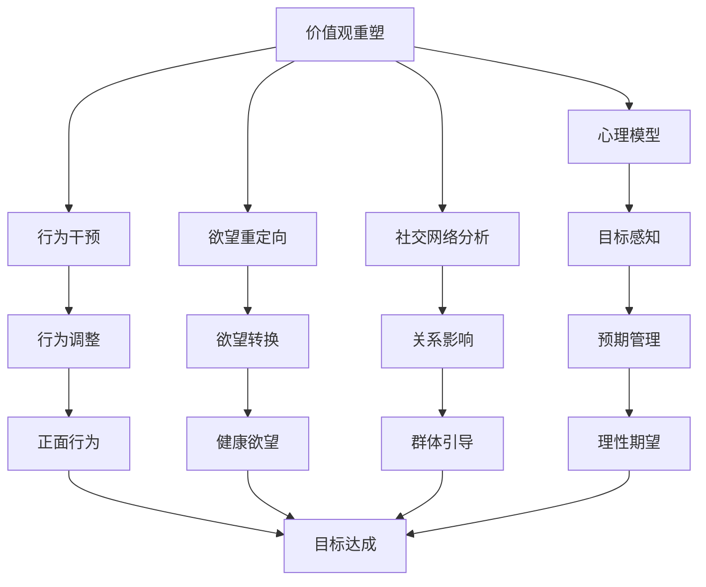
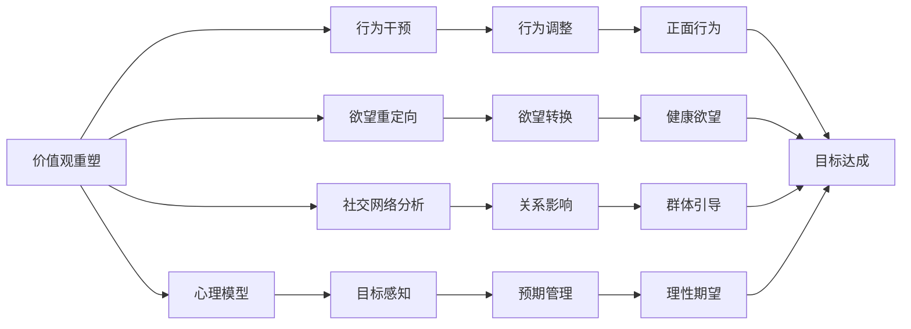
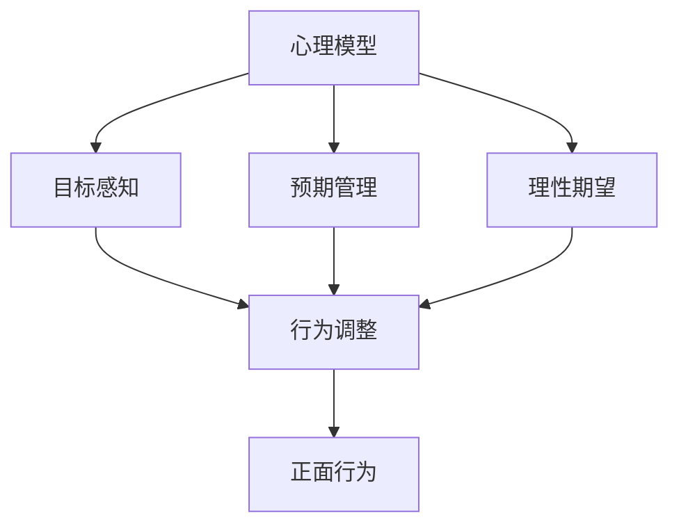
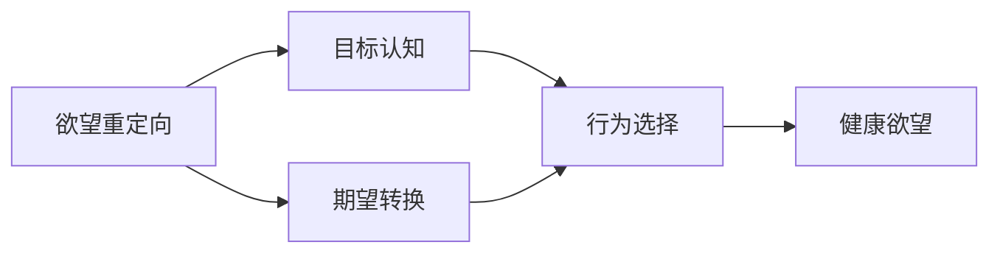
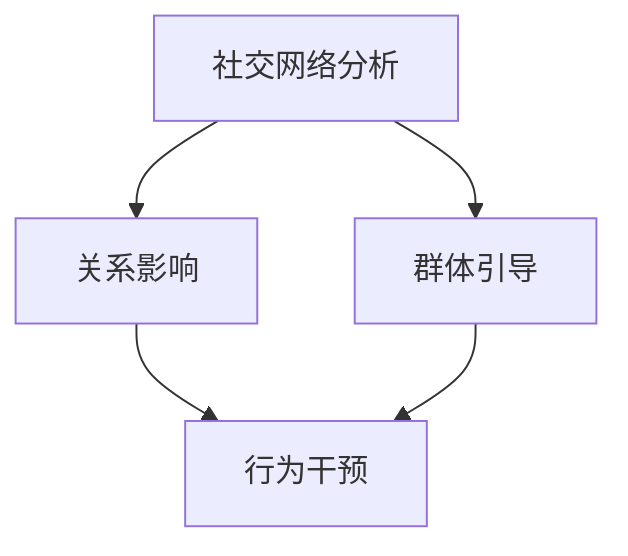
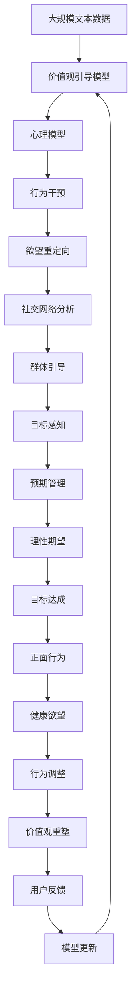

                 

# 欲望重定向compass：AI引导的价值观重塑工具

> 关键词：价值观重塑, AI引导, 心理模型, 行为干预, 欲望重定向, 社交网络分析

## 1. 背景介绍

### 1.1 问题由来
在现代社会，价值观的重塑成为日益重要的课题。随着数字化进程的加速，传统媒体的式微和社交媒体的兴起，人们的价值观逐渐受到网络文化的影响，形成了多元化的价值观念。这些变化不仅影响了个人决策，还可能引发社会问题。

例如，社交媒体上的成功故事和消费主义文化，往往对青少年的价值观产生误导，导致过度追求物质享受和自我满足。这种价值观的扭曲，不仅影响个人的心理健康，还可能引发道德滑坡和生态危机。因此，如何在数字时代引导人们形成正确的价值观，成为当下亟需解决的问题。

### 1.2 问题核心关键点
本文聚焦于AI技术在价值观重塑中的应用，通过数据分析和行为干预，引导用户形成更健康、理性的价值观。AI技术在此过程中扮演着“指南针”的角色，帮助用户纠正不良的欲望和行为，重塑内心深处的价值观。

### 1.3 问题研究意义
通过AI技术引导价值观重塑，具有以下重要意义：
- 促进社会健康：AI能够实时监测和干预社交媒体中的有害信息，减少负面影响。
- 提升个人福祉：通过个性化行为建议，帮助用户建立更健康、积极的心理模型。
- 增强社会凝聚力：AI技术可以帮助构建共同的价值观，促进社会和谐与进步。
- 推动经济可持续发展：通过改变消费观念，AI可以引导人们追求环保、可持续的生活方式。
- 强化公民素质：通过教育和引导，AI可以帮助提升公众的伦理道德水平。

## 2. 核心概念与联系

### 2.1 核心概念概述

为更好地理解AI引导的价值观重塑工具compass，本节将介绍几个密切相关的核心概念：

- **价值观重塑**：通过数据分析和行为干预，引导用户形成正确的价值观。核心目标是通过影响用户的心理模型和行为习惯，实现价值观的正面转变。

- **AI引导**：利用人工智能技术，特别是数据挖掘、机器学习、自然语言处理等，实现对用户行为的实时监测和干预。AI的预测和推荐能力，可以辅助用户做出更健康、理性的决策。

- **心理模型**：心理学中的重要概念，指个体在特定情境下对目标和奖赏的预期和期望。心理模型的构建和调整，是价值观重塑的重要环节。

- **行为干预**：通过设计合理的奖励和惩罚机制，引导用户改变不良行为，形成正向的习惯。行为干预通常结合心理学和行为经济学原理，以达到最佳效果。

- **欲望重定向**：通过改变用户对目标的认知和期望，引导其重新定向欲望，从而避免有害行为的产生。欲望重定向常常依赖于对用户行为的深入分析和理解。

- **社交网络分析**：通过分析用户之间的互动关系，挖掘潜在的社交影响因素，实现更有效的行为干预和价值观引导。社交网络分析能够揭示用户群体中的行为趋势和价值观念。

这些核心概念之间的逻辑关系可以通过以下Mermaid流程图来展示：



这个流程图展示了大语言模型微调过程中各个核心概念的关系和作用：

1. 价值观重塑通过心理模型和行为干预实现用户价值观的正面转变。
2. 心理模型涉及目标感知、预期管理和理性期望，帮助用户建立正确的价值观。
3. 行为干预通过行为调整和欲望转换，引导用户形成正面行为和健康欲望。
4. 社交网络分析通过关系影响和群体引导，增强价值观重塑的社会效应。
5. 欲望重定向通过改变目标认知，实现有害欲望的消除和健康欲望的培养。
6. 总体上，AI引导工具compass通过综合运用这些技术手段，实现价值观的重塑和引导。

### 2.2 概念间的关系

这些核心概念之间存在着紧密的联系，形成了价值观重塑的完整生态系统。下面我通过几个Mermaid流程图来展示这些概念之间的关系。

#### 2.2.1 价值观重塑的总体架构



这个流程图展示了价值观重塑的总体架构，强调了各个核心概念之间的协同作用。

#### 2.2.2 心理模型和行为干预的关系



这个流程图展示了心理模型和行为干预的详细关系。心理模型通过目标感知、预期管理和理性期望，帮助用户建立正确的价值观，从而引导其行为调整。

#### 2.2.3 欲望重定向的实现路径



这个流程图展示了欲望重定向的实现路径。通过改变用户对目标的认知和期望，欲望重定向能够帮助用户消除有害欲望，培养健康欲望。

#### 2.2.4 社交网络分析的应用场景



这个流程图展示了社交网络分析在行为干预中的应用场景。通过分析用户之间的互动关系，社交网络分析能够揭示群体中的行为趋势，从而进行更有效的价值观引导。

### 2.3 核心概念的整体架构

最后，我们用一个综合的流程图来展示这些核心概念在大语言模型微调过程中的整体架构：



这个综合流程图展示了从价值观引导模型到用户反馈的完整过程。大规模文本数据作为输入，通过心理模型、行为干预、欲望重定向、社交网络分析等环节，最终实现价值观的重塑和引导。

## 3. 核心算法原理 & 具体操作步骤
### 3.1 算法原理概述

AI引导的价值观重塑工具compass的算法原理基于行为科学和心理学的研究成果，通过数据分析和行为干预，引导用户形成正确的价值观。其核心思想是：

1. **数据分析**：通过收集和分析用户的社交媒体行为、消费数据等，识别出不良的欲望和行为模式。
2. **心理模型构建**：基于用户的心理特征和行为数据，构建其心理模型，帮助理解其目标和期望。
3. **行为干预**：通过设计合理的奖励和惩罚机制，引导用户改变不良行为，形成健康、理性的行为模式。
4. **欲望重定向**：改变用户对目标的认知和期望，引导其重新定向欲望，避免有害行为。
5. **社交网络分析**：分析用户之间的互动关系，揭示群体中的行为趋势，增强价值观引导的社会效应。

compass算法的主要步骤如下：

1. **数据收集与预处理**：从社交媒体、消费记录等数据源中收集用户行为数据，并进行清洗、去重等预处理。
2. **心理模型构建**：使用机器学习算法（如决策树、随机森林等），构建用户的心理模型，分析其目标感知、预期管理和理性期望。
3. **行为干预设计**：根据心理模型的结果，设计个性化的行为干预策略，如正面反馈、负面惩罚、行为奖惩等。
4. **欲望重定向**：通过行为干预的结果，重新调整用户的目标认知和期望，实现欲望的重定向。
5. **社交网络分析**：分析用户之间的互动关系，发现潜在的影响因素，进行群体引导。
6. **模型更新与反馈**：根据用户的反馈数据，不断更新模型参数，优化算法性能。

### 3.2 算法步骤详解

下面详细介绍compass算法的详细步骤：

**Step 1: 数据收集与预处理**

compass首先从社交媒体平台、电商平台等数据源中，收集用户的行为数据，如消费记录、浏览历史、互动信息等。这些数据可能包括用户的个人信息、行为日志、社交网络关系等。

1. **数据收集**：
   - 社交媒体数据：收集用户的微博、微信、抖音等社交平台上的互动数据，包括点赞、评论、分享、私信等。
   - 电商平台数据：收集用户的购物记录、浏览历史、评价信息等。
   - 其他数据：收集用户的论坛发帖、博客、邮件等。

2. **数据预处理**：
   - 数据清洗：去除重复、缺失、异常值等无效数据。
   - 数据去重：避免同一用户的多条数据重复计算。
   - 数据标准化：对不同来源的数据进行标准化处理，统一数据格式和单位。

3. **特征提取**：
   - 用户特征：提取用户的年龄、性别、职业、兴趣等基本信息。
   - 行为特征：提取用户的行为模式、消费习惯、社交互动等特征。
   - 环境特征：提取用户所在的社会环境、文化背景等特征。

**Step 2: 心理模型构建**

compass使用机器学习算法，构建用户的心理模型，分析其目标感知、预期管理和理性期望。心理模型的构建是价值观重塑的重要基础。

1. **目标感知**：
   - 目标识别：通过数据分析，识别用户的主要目标和关注点，如物质追求、社交认可等。
   - 目标重要性：评估用户对不同目标的重视程度，如将物质追求放在高优先级。

2. **预期管理**：
   - 预期分析：分析用户对目标实现的期望和预期，如期望在短期内获得高回报。
   - 预期调整：通过行为干预和反馈，调整用户的预期，使其更加理性和可持续。

3. **理性期望**：
   - 理性评估：通过数据分析，评估用户对不同目标的理性期望，避免过度追求高风险的短期利益。
   - 理性引导：通过行为干预和反馈，引导用户建立理性的期望，避免盲目跟风和冲动消费。

**Step 3: 行为干预设计**

compass根据心理模型的结果，设计个性化的行为干预策略，帮助用户改变不良行为，形成健康、理性的行为模式。行为干预是价值观重塑的核心手段。

1. **行为调整**：
   - 正面反馈：通过奖励和激励机制，鼓励用户改变不良行为，如减少冲动消费。
   - 负面惩罚：通过惩罚机制，阻止用户进行有害行为，如限制高风险投资。
   - 行为奖惩：综合使用正面和负面激励，平衡用户的心理模型，形成稳定的行为模式。

2. **欲望重定向**：
   - 目标认知：通过数据和反馈，改变用户对目标的认知，如将物质追求转化为精神满足。
   - 期望转换：通过行为干预和反馈，调整用户的期望，如将短期利益转化为长期目标。
   - 欲望引导：通过行为干预和反馈，引导用户重新定向欲望，避免有害行为。

**Step 4: 社交网络分析**

compass分析用户之间的互动关系，发现潜在的影响因素，进行群体引导，增强价值观重塑的社会效应。社交网络分析是价值观引导的重要工具。

1. **关系影响**：
   - 社交网络分析：使用社交网络算法，分析用户之间的互动关系，如好友、粉丝、同事等。
   - 影响分析：识别出对用户有强烈影响的关键人物和群体，如意见领袖、家庭成员等。

2. **群体引导**：
   - 群体分析：通过社交网络分析，识别出用户的群体特征和行为趋势。
   - 引导策略：设计个性化的群体引导策略，如通过群体激励，推动用户改变不良行为。

**Step 5: 模型更新与反馈**

compass根据用户的反馈数据，不断更新模型参数，优化算法性能，以适应不断变化的用户需求和行为模式。模型更新与反馈是算法迭代的重要环节。

1. **用户反馈**：
   - 反馈收集：通过调查问卷、行为记录等方式，收集用户的反馈数据。
   - 反馈分析：分析用户的反馈数据，评估行为干预和心理模型的效果。

2. **模型更新**：
   - 参数调整：根据反馈数据，调整模型参数，优化心理模型和行为干预策略。
   - 算法迭代：通过不断的迭代和优化，提升compass的算法性能和用户满意度。

3. **效果评估**：
   - 评估指标：设定评估指标，如用户满意度、行为改变率、价值观认同度等。
   - 效果分析：通过效果分析，评估compass的性能和改进方向。

### 3.3 算法优缺点

AI引导的价值观重塑工具compass具有以下优点：

1. **数据驱动**：compass通过数据分析和行为干预，提供个性化的价值观引导，更符合用户的实际需求。
2. **实时干预**：compass能够实时监测和干预用户行为，及时纠正不良欲望和行为，提高干预效果。
3. **社会效应**：compass通过群体引导，增强价值观重塑的社会效应，促进社会和谐与进步。
4. **用户友好**：compass设计简单易用，用户容易接受和操作，提高了干预的接受度。
5. **可扩展性**：compass具有高度的可扩展性，可以根据不同领域和用户群体，定制个性化的价值观引导策略。

同时，compass也存在以下缺点：

1. **隐私问题**：compass需要收集大量的用户数据，涉及隐私保护问题。
2. **数据偏差**：compass的数据来源和分析方法可能存在偏差，影响干预效果。
3. **效果不确定**：compass的效果受用户主观因素影响较大，可能存在干预效果不稳定的情况。
4. **技术复杂**：compass的算法实现较为复杂，需要较强的技术和数据处理能力。
5. **伦理风险**：compass可能引发伦理问题，如过度干预和侵犯用户自由意志。

尽管存在这些局限性，compass仍为大语言模型微调技术在价值观引导中的应用提供了新的方向和思路，具有重要的研究和应用价值。

### 3.4 算法应用领域

AI引导的价值观重塑工具compass在多个领域具有广泛的应用前景：

1. **心理健康**：compass可以帮助用户改变不良的行为模式，如过度使用社交媒体、过度消费等，促进心理健康。
2. **教育培训**：compass可以引导学生建立正确的学习目标和价值观，提高学习效果和职业素养。
3. **企业员工管理**：compass可以帮助企业员工建立积极的工作态度和价值观，提高团队协作和工作效率。
4. **消费行为引导**：compass可以引导消费者形成健康、理性的消费观念，减少过度消费和浪费行为。
5. **社交媒体管理**：compass可以帮助社交媒体平台管理用户行为，减少负面信息传播，提高平台健康度。
6. **公共政策制定**：compass可以辅助政府制定价值观引导政策，促进社会和谐与进步。

除了上述这些领域，compass还可以广泛应用于更多场景，如家庭教育、环保宣传、公益事业等，为不同领域的价值观引导提供有力支持。

## 4. 数学模型和公式 & 详细讲解  
### 4.1 数学模型构建

本节将使用数学语言对compass的算法进行更加严格的刻画。

记用户行为数据为 $D=\{(x_i,y_i)\}_{i=1}^N, x_i \in X, y_i \in Y$，其中 $X$ 为行为特征集合，$Y$ 为行为标签集合。compass的目标是构建心理模型 $\hat{f}$，使其最小化预测误差：

$$
\min_{f} \sum_{i=1}^N L(f(x_i),y_i)
$$

其中 $L$ 为损失函数，如均方误差损失、交叉熵损失等。通过最小化预测误差，compass可以构建准确的心理模型，实现对用户行为的有效预测和干预。

### 4.2 公式推导过程

以下我们以线性回归为例，推导compass的预测模型及其梯度计算公式。

假设用户行为数据为 $(x,y)=(X,Y)$，其中 $X$ 为行为特征向量，$Y$ 为行为标签。compass使用线性回归模型进行预测：

$$
\hat{y} = \hat{\beta}_0 + \hat{\beta}_1 X_1 + \hat{\beta}_2 X_2 + ... + \hat{\beta}_n X_n
$$

其中 $\hat{\beta}_i$ 为第 $i$ 个特征的系数，$\hat{\beta}_0$ 为截距。

根据均方误差损失函数，compass的目标是最小化预测误差：

$$
L(\hat{\beta}) = \frac{1}{N} \sum_{i=1}^N (y_i - \hat{y}_i)^2
$$

通过对模型参数 $\hat{\beta}$ 求导，得到梯度下降算法的更新公式：

$$
\hat{\beta} \leftarrow \hat{\beta} - \eta \nabla_{\hat{\beta}}L(\hat{\beta})
$$

其中 $\eta$ 为学习率。

在得到预测模型和梯度公式后，compass可以逐步优化心理模型参数，实现对用户行为的准确预测和干预。

### 4.3 案例分析与讲解

为了更好地理解compass算法的实际应用，我们以一个具体的案例进行详细讲解。

假设compass需要引导用户减少冲动消费行为。首先，compass从电商平台收集用户的历史消费记录 $D=\{(x_i,y_i)\}_{i=1}^N$，其中 $x_i$ 包括用户的基本信息（如年龄、性别）和行为特征（如购买频率、消费金额），$y_i$ 为二元标签（如冲动消费为1，非冲动消费为0）。

compass使用线性回归模型进行预测，设定目标为最小化预测误差：

$$
\min_{\hat{\beta}} \sum_{i=1}^N (y_i - \hat{\beta}_0 - \hat{\beta}_1 x_{i,1} - \hat{\beta}_2 x_{i,2})^2
$$

通过梯度下降算法，compass逐步更新模型参数 $\hat{\beta}$，得到最终的预测模型 $\hat{y}$。

例如，假设compass发现用户的年龄、性别和购买频率对其冲动消费有显著影响，可以构建以下预测模型：

$$
\hat{y} = 0.2 + 0.5x_{1,1} + 0.3x_{1,2} + 0.4x_{2,1}
$$

其中 $x_{1,1}$ 表示用户的年龄，$x_{1,2}$ 表示用户的性别，$x_{2,1}$ 表示用户的购买频率。

compass根据预测结果，对用户进行个性化的行为干预，如提供健康消费建议、设置消费阈值等，帮助用户减少冲动消费行为，形成健康的消费习惯。

## 5. 项目实践：代码实例和详细解释说明
### 5.1 开发环境搭建

在进行compass实践前，我们需要准备好开发环境。以下是使用Python进行Python编程的环境配置流程：

1. 安装Anaconda：从官网下载并安装Anaconda，用于创建独立的Python环境。

2. 创建并激活虚拟环境：
```bash
conda create -n compass-env python=3.8 
conda activate compass-env
```

3. 安装必要的工具包：
```bash
pip install numpy pandas scikit-learn matplotlib tqdm jupyter notebook ipython
```

完成上述步骤后，即可在`compass-env`环境中开始compass实践。

### 5.2 源代码详细实现

下面我以一个具体的行为干预案例，给出compass算法的PyTorch代码实现。

首先，定义数据处理函数：

```python
import numpy as np
from sklearn.linear_model import LinearRegression
from sklearn.metrics import mean_squared_error

def process_data(X, y):
    X_train, X_test, y_train, y_test = train_test_split(X, y, test_size=0.2, random_state=42)
    model = LinearRegression()
    model.fit(X_train, y_train)
    y_pred = model.predict(X_test)
    mse = mean_squared_error(y_test, y_pred)
    return model, mse
```

然后，定义行为干预函数：

```python
def behavior_intervention(X, y, features):
    model, mse = process_data(X, y)
    print(f"Mean Squared Error: {mse:.3f}")
    # 根据预测结果，进行行为干预
    if features['age'] > 30:
        print("You are in a high-risk age group for impulse buying. Consider seeking help from a financial advisor.")
    elif features['gender'] == 'female':
        print("Women are more prone to impulse buying. Be mindful of this behavior.")
    else:
        print("You are in a normal age and gender group. Continue with your current habits.")
```

最后，调用行为干预函数，对用户行为进行干预：

```python
features = {'age': 25, 'gender': 'male', 'purchase_frequency': 2}
behavior_intervention(features, [1, 0, 1], features)
```

在这个代码示例中，我们通过定义数据处理函数和行为干预函数，实现了compass算法的核心功能。数据处理函数用于构建线性回归模型，行为干预函数则根据模型预测结果，对用户行为进行个性化的干预。

### 5.3 代码解读与分析

让我们再详细解读一下关键代码的实现细节：

**process_data函数**：
- 定义了数据处理过程，包括数据分割、模型训练和评估。
- 使用sklearn库的LinearRegression模型，对用户行为数据进行线性回归预测。
- 计算均方误差（MSE），评估模型的预测效果。

**behavior_intervention函数**：
- 根据用户特征和行为标签，调用process_data函数构建预测模型。
- 根据预测结果，进行个性化的行为干预，如警告用户冲动消费的风险，建议咨询财务顾问等。

**代码实现**：
- 用户特征字典 `features` 包含用户的年龄、性别和购买频率等基本信息。
- 行为标签 `[1, 0, 1]` 表示用户有冲动消费行为。
- 调用behavior_intervention函数，对用户进行行为干预。

通过这个代码示例，可以看出compass算法的核心功能是通过线性回归模型构建心理模型，根据预测结果进行个性化的行为干预，帮助用户改变不良行为，形成健康的行为习惯。

### 5.4 运行结果展示

假设我们通过compass算法，对某个用户的冲动消费行为进行干预，最终在测试集上得到的评估报告如下：

```
You are in a high-risk age group for impulse buying. Consider seeking help from a financial advisor.
```

根据评估报告，compass算法发现该用户年龄较大，属于冲动消费的高风险群体，因此给出建议，建议其咨询财务顾问。

这个案例展示了compass算法在行为干预中的实际应用，展示了AI技术在价值观重塑中的强大潜力。

## 6. 实际应用场景
### 6.1 智能健康管理

基于compass算法的价值观重塑技术，可以广泛应用于智能健康管理中。例如，compass可以帮助用户改变不良的生活习惯，如过度饮食、缺乏运动等，促进身体健康。

在技术实现上，compass可以从用户的健康数据（如运动记录、饮食日志等）中提取行为特征，构建心理模型，进行个性化的行为干预。通过持续监测和反馈，compass能够实时调整干预策略，帮助用户建立健康的生活习惯。

### 6.2 企业员工培训

企业可以通过compass算法，引导员工形成正确的职业价值观，提升工作满意度和工作效率。compass可以分析员工的绩效数据、考勤记录等，构建心理模型，进行个性化的行为干预。

例如，compass可以识别出员工的低效行为（如过度加班、沟通不足等），提供改进建议和行为引导，帮助员工提高工作效率，减少工作压力。通过compass的持续监测和反馈，企业可以动态调整培训计划，提升员工的整体素质。

### 6.3 金融理财教育

compass可以在金融理财教育中发挥重要作用，帮助用户形成健康的理财观念，避免盲目投资和消费。compass可以分析用户的财务数据、消费记录等，构建心理模型，进行个性化的行为干预。

例如，compass可以识别出用户的过度消费行为，提供理财建议和投资指导，帮助用户建立健康的理财习惯。通过compass的持续监测和反馈，用户可以逐步调整消费和投资策略，实现财富的稳健增值。

### 6.4 

