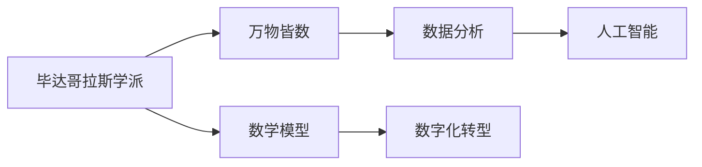
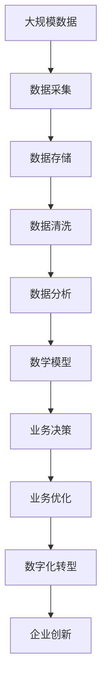

                 

# 毕达哥拉斯学派的“万物皆数”与数字化时代

> 关键词：毕达哥拉斯, 万物皆数, 数学模型, 人工智能, 数字化转型, 数学思维, 数据分析

## 1. 背景介绍

### 1.1 问题由来

在数字化时代，数据的爆炸式增长和信息技术的飞速发展，为各行各业带来了前所未有的变革机遇。特别是在金融、医疗、零售等依赖于大量数据驱动决策的领域，数字化转型成为了企业提升竞争力的关键。然而，数据驱动决策并非易事，它需要对海量数据进行收集、整理、分析，并从中提取有价值的信息和知识，这一过程对数学建模和数据分析能力提出了极高的要求。

### 1.2 问题核心关键点

要回答好如何在数字化时代有效利用数据，驱动业务决策，关键在于将数学模型融入数据分析过程中。而数学模型背后的核心理念，正是古希腊毕达哥拉斯学派提出的“万物皆数”。这一思想认为，所有事物都可通过数学关系来描述和理解，数学思维具有普遍性和逻辑性，能够揭示事物本质的内在规律。

## 2. 核心概念与联系

### 2.1 核心概念概述

为了更好地理解“万物皆数”与数字化转型的联系，我们将详细探讨以下几个核心概念：

- **毕达哥拉斯学派**：古希腊数学学派，强调数学在自然界中的普遍性和逻辑性，认为数学是描述和理解自然界的基本工具。
- **万物皆数**：毕达哥拉斯学派的核心思想，认为一切事物都可以通过数学关系来描述和理解，数学思维具有普遍性和逻辑性。
- **数学模型**：通过数学语言对现实世界进行抽象和简化，建立反映事物本质和规律的模型。
- **数字化转型**：企业利用信息技术，通过数据驱动的决策模式，实现业务流程的优化和创新。
- **数据分析**：通过统计、挖掘、可视化等方法，从数据中提取信息，支持业务决策。
- **人工智能**：利用机器学习、深度学习等技术，实现数据自动化的分析和处理。

### 2.2 概念间的关系

这些核心概念之间的逻辑关系可以通过以下Mermaid流程图来展示：



这个流程图展示了“万物皆数”思想在不同领域的应用和联系：

1. 毕达哥拉斯学派的“万物皆数”思想，推动了数学模型的发展，使数学成为描述和理解自然界的基本工具。
2. 数学模型通过数学语言对现实世界进行抽象和简化，揭示事物本质的内在规律。
3. 数据分析利用统计、挖掘等方法，从数据中提取信息，支持业务决策。
4. 数字化转型通过数据驱动的决策模式，实现业务流程的优化和创新。
5. 人工智能利用机器学习、深度学习等技术，实现数据自动化的分析和处理。

这些概念共同构成了数字化时代的核心框架，为数学在现代社会的广泛应用提供了理论基础。

### 2.3 核心概念的整体架构

最后，我们用一个综合的流程图来展示这些核心概念在大数据背景下的应用场景：



这个综合流程图展示了从数据采集到业务优化的全过程，以及数学模型在其中扮演的重要角色。

## 3. 核心算法原理 & 具体操作步骤
### 3.1 算法原理概述

数字化时代的核心算法原理，可以归结为以下几个方面：

1. **数据采集与存储**：通过传感器、网络等手段，收集大规模数据，并存储在数据库中。
2. **数据清洗与预处理**：清洗数据中的噪声和异常值，进行数据标准化和归一化，预处理为可用于分析的模型输入。
3. **数据分析与建模**：利用统计学、机器学习等方法，对数据进行分析，建立数学模型，揭示数据中的规律和趋势。
4. **业务决策与优化**：根据数学模型进行业务决策，优化业务流程，提升业务效率和效益。
5. **人工智能应用**：利用深度学习、强化学习等技术，实现自动化的数据分析和处理，提升业务决策的精准度和智能化水平。

### 3.2 算法步骤详解

以下是基于“万物皆数”思想，进行数字化转型的详细步骤：

**Step 1: 数据采集与存储**

- 收集大规模数据，包括文本、图像、音频、视频等不同类型的数据。
- 利用分布式存储技术，如Hadoop、Spark等，将数据存储在分布式集群中，支持大规模数据的存储和处理。

**Step 2: 数据清洗与预处理**

- 清洗数据中的噪声、缺失值和异常值，确保数据的完整性和准确性。
- 对数据进行标准化和归一化，使其适合用于数学模型训练。
- 利用数据增强技术，如数据扩增、回译等，丰富数据的多样性，提高模型的泛化能力。

**Step 3: 数据分析与建模**

- 利用统计学方法，对数据进行初步分析，了解数据的基本特征和分布情况。
- 利用机器学习模型，如线性回归、逻辑回归、决策树等，对数据进行建模，建立反映数据内在规律的数学模型。
- 利用深度学习模型，如神经网络、卷积神经网络、循环神经网络等，对复杂数据进行建模，揭示数据中的非线性关系和复杂规律。

**Step 4: 业务决策与优化**

- 根据数学模型，进行业务决策，如客户分类、风险评估、营销策略等。
- 利用优化算法，如遗传算法、模拟退火等，对业务流程进行优化，提升业务效率和效益。
- 利用预测模型，如时间序列预测、回归模型等，进行未来趋势预测，支持业务决策。

**Step 5: 人工智能应用**

- 利用深度学习、强化学习等技术，实现自动化的数据分析和处理，提升业务决策的精准度和智能化水平。
- 利用自然语言处理(NLP)技术，对文本数据进行情感分析、实体识别、摘要生成等，提升业务决策的信息利用效率。
- 利用计算机视觉技术，对图像和视频数据进行目标检测、图像分割、人脸识别等，提升业务决策的智能化水平。

### 3.3 算法优缺点

基于“万物皆数”思想，数字化转型的算法有以下优缺点：

**优点**：
1. 数据驱动决策，通过数学模型揭示数据中的规律和趋势，提升业务决策的精准度和科学性。
2. 数据自动化处理，利用机器学习、深度学习等技术，实现数据的自动分析和处理，提高业务效率和效益。
3. 模型泛化能力强，通过数据增强技术，提高模型的泛化能力，适应不同场景和数据分布。

**缺点**：
1. 数据质量和数据量要求高，需要高质量、大规模的数据支持，否则难以建立有效的数学模型。
2. 算法复杂度高，深度学习和机器学习模型的训练和优化需要大量的计算资源。
3. 模型解释性不足，深度学习等技术生成的模型往往是“黑盒”系统，难以解释其决策逻辑和过程。

### 3.4 算法应用领域

基于“万物皆数”思想的数字化转型，广泛应用于以下领域：

1. **金融领域**：通过数据分析和建模，进行风险评估、欺诈检测、投资策略优化等，提升金融决策的精准度和科学性。
2. **医疗领域**：通过数据分析和建模，进行疾病预测、药物研发、医疗资源优化等，提升医疗决策的科学性和效率。
3. **零售领域**：通过数据分析和建模，进行客户行为分析、库存优化、营销策略优化等，提升零售决策的精准度和效率。
4. **制造领域**：通过数据分析和建模，进行生产流程优化、设备维护、供应链管理等，提升制造决策的科学性和效率。
5. **物流领域**：通过数据分析和建模，进行路径规划、配送优化、需求预测等，提升物流决策的科学性和效率。
6. **农业领域**：通过数据分析和建模，进行作物生长监测、产量预测、病虫害防治等，提升农业决策的科学性和效率。

## 4. 数学模型和公式 & 详细讲解 & 举例说明

### 4.1 数学模型构建

基于“万物皆数”思想，数学模型构建分为以下步骤：

1. **问题建模**：明确需要解决的问题和目标，如风险评估、客户分类、营销策略优化等。
2. **数据准备**：收集相关数据，并进行预处理，确保数据的完整性和准确性。
3. **特征选择**：根据问题特性，选择相关的特征变量，构建特征向量。
4. **模型选择**：根据问题的复杂度和数据的特征，选择合适的数学模型，如线性回归、逻辑回归、决策树、神经网络等。
5. **模型训练**：利用数据进行模型训练，调整模型参数，使模型能够准确预测和解释目标变量。
6. **模型评估**：利用验证集和测试集评估模型性能，选择最优模型。

### 4.2 公式推导过程

以线性回归模型为例，其公式推导过程如下：

设目标变量为 $y$，特征变量为 $x_1, x_2, ..., x_n$，线性回归模型的形式为：

$$ y = \beta_0 + \beta_1 x_1 + \beta_2 x_2 + ... + \beta_n x_n + \epsilon $$

其中，$\beta_0$ 为截距，$\beta_1, \beta_2, ..., \beta_n$ 为回归系数，$\epsilon$ 为随机误差项。

根据最小二乘法，求解最优回归系数 $\beta_0, \beta_1, \beta_2, ..., \beta_n$，使得模型预测值与真实值之间的误差最小化。目标函数为：

$$ \sum_{i=1}^n (y_i - \beta_0 - \beta_1 x_{i1} - \beta_2 x_{i2} - ... - \beta_n x_{in})^2 $$

对目标函数求导，得：

$$ \frac{\partial \sum_{i=1}^n (y_i - \beta_0 - \beta_1 x_{i1} - \beta_2 x_{i2} - ... - \beta_n x_{in})^2}{\partial \beta_j} = 0 $$

化简后得：

$$ \sum_{i=1}^n (y_i - \hat{y}_i)(x_{ij} - \overline{x}_{ij}) = 0 $$

其中，$\hat{y}_i$ 为模型预测值，$\overline{x}_{ij}$ 为特征变量的均值。

求解上述方程组，即可得到最优回归系数 $\beta_0, \beta_1, \beta_2, ..., \beta_n$。

### 4.3 案例分析与讲解

假设我们需要对某银行的贷款申请进行信用评估，利用线性回归模型进行分析。我们可以收集贷款申请的特征变量，如收入、年龄、信用评分等，并设置目标变量为贷款是否批准。根据历史数据，建立线性回归模型，计算最优回归系数，进行贷款申请的信用评估。

## 5. 项目实践：代码实例和详细解释说明
### 5.1 开发环境搭建

在进行数字化转型和数学建模的实践前，我们需要准备好开发环境。以下是使用Python进行Scikit-learn和TensorFlow开发的环境配置流程：

1. 安装Anaconda：从官网下载并安装Anaconda，用于创建独立的Python环境。

2. 创建并激活虚拟环境：
```bash
conda create -n pythontest python=3.8 
conda activate pythontest
```

3. 安装Scikit-learn和TensorFlow：
```bash
pip install scikit-learn tensorflow
```

4. 安装各类工具包：
```bash
pip install numpy pandas matplotlib
```

完成上述步骤后，即可在`pythontest`环境中开始数字化转型和数学建模的实践。

### 5.2 源代码详细实现

下面我们以线性回归模型为例，给出使用Scikit-learn进行信用评估的Python代码实现。

首先，定义信用评估数据集：

```python
import pandas as pd

# 读取数据集
data = pd.read_csv('credit.csv')

# 数据预处理
features = data.drop('default', axis=1)
target = data['default']
```

然后，训练线性回归模型并进行预测：

```python
from sklearn.linear_model import LinearRegression

# 定义模型
model = LinearRegression()

# 训练模型
model.fit(features, target)

# 预测结果
predictions = model.predict(features)
```

接着，评估模型的性能：

```python
from sklearn.metrics import mean_squared_error, r2_score

# 评估模型
mse = mean_squared_error(target, predictions)
r2 = r2_score(target, predictions)

print(f'MSE: {mse:.2f}, R2: {r2:.2f}')
```

最后，展示模型预测结果：

```python
import matplotlib.pyplot as plt

# 可视化模型预测结果
plt.scatter(target, predictions)
plt.xlabel('Actual Values')
plt.ylabel('Predicted Values')
plt.show()
```

以上就是使用Scikit-learn进行信用评估的完整代码实现。可以看到，通过Scikit-learn库，我们可以用相对简洁的代码完成线性回归模型的训练和预测。

### 5.3 代码解读与分析

让我们再详细解读一下关键代码的实现细节：

**数据预处理**：
- 使用Pandas库读取CSV文件，并将其分为特征变量和目标变量。
- 使用`drop`方法删除目标变量，作为输入特征。

**模型训练**：
- 定义LinearRegression模型，并使用`fit`方法进行训练。
- 使用训练好的模型，对特征变量进行预测。

**模型评估**：
- 使用Scikit-learn的`mean_squared_error`和`r2_score`函数，分别计算预测值与真实值之间的均方误差和R2值。
- 输出模型评估结果，MSE为均方误差，R2为决定系数，衡量模型拟合的好坏。

**可视化预测结果**：
- 使用Matplotlib库绘制散点图，展示模型预测结果与真实值之间的对比。

## 6. 实际应用场景
### 6.1 智能金融

在智能金融领域，基于线性回归等数学模型的数据分析和建模，可以应用于风险评估、信用评分、投资策略优化等任务。通过历史数据的分析，可以揭示金融市场的内在规律和趋势，提高金融决策的科学性和效率。

**风险评估**：利用线性回归模型，对贷款申请的各项特征进行分析，评估其违约风险，支持贷款审批决策。

**信用评分**：通过信用评分模型，对客户的历史信用行为进行分析，预测其未来的信用风险，支持信贷审批和信用管理。

**投资策略优化**：利用回归模型，对市场数据进行分析，预测市场趋势和价格波动，支持投资策略的优化和调整。

### 6.2 智能医疗

在智能医疗领域，基于数学模型的数据分析和建模，可以应用于疾病预测、药物研发、医疗资源优化等任务。通过数据分析，可以揭示疾病的内在规律和趋势，提高医疗决策的科学性和效率。

**疾病预测**：利用回归模型，对患者的各项健康数据进行分析，预测其患病风险，支持疾病早期预警和干预。

**药物研发**：通过回归模型，对药物试验数据进行分析，预测药物的疗效和副作用，支持新药的研发和优化。

**医疗资源优化**：利用回归模型，对医院资源的使用情况进行分析，预测未来的需求和供应，支持医疗资源的优化配置。

### 6.3 智能制造

在智能制造领域，基于数学模型的数据分析和建模，可以应用于生产流程优化、设备维护、供应链管理等任务。通过数据分析，可以揭示制造过程的内在规律和趋势，提高制造决策的科学性和效率。

**生产流程优化**：利用回归模型，对生产数据进行分析，预测生产效率和产品质量，支持生产流程的优化和调整。

**设备维护**：通过回归模型，对设备运行数据进行分析，预测设备故障和维护需求，支持设备维护计划的制定和调整。

**供应链管理**：利用回归模型，对供应链数据进行分析，预测供应链的运行状态和风险，支持供应链管理的优化和调整。

### 6.4 未来应用展望

随着数学建模和数据分析技术的不断进步，基于“万物皆数”思想的数字化转型将呈现以下几个发展趋势：

1. **深度学习和大数据分析**：深度学习和大数据分析技术的结合，将进一步提高数学建模的精度和效率，揭示数据中的复杂规律和趋势。

2. **跨领域数据融合**：跨领域数据融合技术的应用，将使得不同领域的数学模型和数据分析方法得到有效整合，提升数据的综合利用效率。

3. **实时数据分析**：实时数据分析技术的发展，将使得数学建模和数据分析更加实时化，支持动态决策和优化。

4. **多模态数据融合**：多模态数据融合技术的应用，将使得不同类型的数据得到有效整合，提升数据分析的全面性和准确性。

5. **智能决策支持系统**：智能决策支持系统的构建，将使得数学建模和数据分析更加智能化，支持业务的全面优化和创新。

6. **自适应学习模型**：自适应学习模型的应用，将使得数学建模和数据分析更加自适应，支持模型的持续优化和升级。

总之，“万物皆数”的思想将继续推动数字化转型的发展，为各行各业提供科学、高效、智能的决策支持。未来，数学建模和数据分析技术将在更广泛的应用场景中发挥重要作用，推动人类社会不断进步。

## 7. 工具和资源推荐
### 7.1 学习资源推荐

为了帮助开发者系统掌握“万物皆数”与数字化转型的相关知识，这里推荐一些优质的学习资源：

1. **《Python机器学习》**：由著名机器学习专家Sebastian Raschka所著，全面介绍了Python在机器学习和数据分析中的应用，适合初学者入门。

2. **Coursera《机器学习》课程**：由斯坦福大学Andrew Ng教授主讲，是机器学习领域最受欢迎的在线课程之一，涵盖机器学习的基本概念和算法。

3. **Kaggle数据科学竞赛平台**：提供海量数据集和竞赛任务，适合实战练习和经验积累。

4. **《深度学习》**：由Ian Goodfellow等著，全面介绍了深度学习的基本概念和算法，是深度学习领域的经典教材。

5. **《数学建模与算法》**：由知名数学建模专家编写，涵盖数学建模的基本概念和方法，适合科研人员和工程师。

6. **Kaggle机器学习竞赛论坛**：提供机器学习竞赛的讨论和交流平台，适合分享学习经验和解决问题。

通过对这些资源的学习实践，相信你一定能够系统掌握“万物皆数”与数字化转型的相关知识，并用于解决实际问题。

### 7.2 开发工具推荐

高效的开发离不开优秀的工具支持。以下是几款用于数学建模和数据分析开发的常用工具：

1. **Scikit-learn**：Python机器学习库，提供了丰富的机器学习算法和工具，适合快速搭建机器学习模型。

2. **TensorFlow**：Google开发的深度学习框架，支持构建各种深度学习模型，适合复杂的数据分析任务。

3. **PyTorch**：Facebook开发的深度学习框架，支持动态计算图和GPU加速，适合高效的数据分析和建模。

4. **Pandas**：Python数据分析库，提供了强大的数据处理和分析功能，适合数据预处理和可视化。

5. **Matplotlib**：Python绘图库，提供了丰富的绘图功能，适合数据可视化和模型评估。

6. **Jupyter Notebook**：Python交互式笔记本，支持代码编写和可视化展示，适合快速迭代开发和分享。

合理利用这些工具，可以显著提升数学建模和数据分析的开发效率，加快创新迭代的步伐。

### 7.3 相关论文推荐

数学建模和数据分析的发展源于学界的持续研究。以下是几篇奠基性的相关论文，推荐阅读：

1. **《深度学习》（Goodfellow et al., 2016）**：深度学习领域的经典教材，介绍了深度学习的基本概念和算法。

2. **《机器学习》（Tom Mitchell, 1997）**：机器学习领域的经典教材，介绍了机器学习的基本概念和算法。

3. **《统计学习方法》（李航, 2006）**：机器学习领域的经典教材，介绍了统计学习的基本概念和方法。

4. **《大样本统计理论》（Wassily Le Cam, 1986）**：统计学领域的经典教材，介绍了大样本统计理论的基础概念和方法。

5. **《NIPS 2017最佳论文》**：机器学习领域的顶级会议论文，涵盖了机器学习的前沿研究方向和技术进展。

6. **《IEEE JSTSP：统计学习》**：统计学习领域的顶级期刊，涵盖统计学习的基本概念和方法。

这些论文代表了大数据时代数学建模和数据分析的发展脉络。通过学习这些前沿成果，可以帮助研究者把握学科前进方向，激发更多的创新灵感。

除上述资源外，还有一些值得关注的前沿资源，帮助开发者紧跟数学建模和数据分析技术的最新进展，例如：

1. **arXiv论文预印本**：人工智能领域最新研究成果的发布平台，包括大量尚未发表的前沿工作，学习前沿技术的必读资源。

2. **AI会议直播**：如NeurIPS、ICML、ACL、ICLR等人工智能领域顶会现场或在线直播，能够聆听到大佬们的前沿分享，开拓视野。

3. **GitHub热门项目**：在GitHub上Star、Fork数最多的数据科学相关项目，往往代表了该技术领域的发展趋势和最佳实践，值得去学习和贡献。

4. **科技博客**：如Towards Data Science、Machine Learning Mastery等知名科技博客，提供最新的人工智能技术和应用案例，适合学习借鉴。

5. **技术报告**：各大公司如Google、Facebook、Microsoft等发布的技术报告，涵盖最新的技术进展和应用案例，适合深入学习和参考。

总之，对于数学建模和数据分析的学习和实践，需要开发者保持开放的心态和持续学习的意愿。多关注前沿资讯，多动手实践，多思考总结，必将收获满满的成长收益。

## 8. 总结：未来发展趋势与挑战

### 8.1 总结

本文对“万物皆数”与数字化转型的相关知识进行了全面系统的介绍。首先阐述了“万物皆数”思想的核心理念及其在数字化时代的广泛应用，明确了数学模型在数据驱动决策中的关键作用。其次，从原理到实践，详细讲解了数字化转型的数学建模和数据分析过程，给出了基于Python的完整代码实例。同时，本文还探讨了“万物皆数”思想在不同领域的实际应用场景，展示了其广泛的应用前景。

通过本文的系统梳理，可以看到，基于“万物皆数”思想的数字化转型，正在成为各行各业的重要范式，极大地拓展了数据驱动决策的应用边界，为各领域的业务优化和创新提供了强有力的支持。未来，随着数学建模和数据分析技术的不断进步，基于“万物皆数”思想的数字化转型将进一步深入发展，为各行各业带来更加智能化、高效化的决策支持。

### 8.2 未来发展趋势

展望未来，基于“万物皆数”思想的数字化转型将呈现以下几个发展趋势：

1. **深度学习和大数据分析**：深度学习和大数据分析技术的结合，将进一步提高数学建模的精度和效率，揭示数据中的复杂规律和趋势。

2. **跨领域数据融合**：跨领域数据融合技术的应用，将使得不同领域的数学模型和数据分析方法得到有效整合，提升数据的综合利用效率。

3. **实时数据分析**：实时数据分析技术的发展，将使得数学建模和数据分析更加实时化，支持动态决策和优化。

4. **多模态数据融合**：多模态数据融合技术的应用，将使得不同类型的数据得到有效整合，提升数据分析的全面性和准确性。

5. **智能决策支持系统**：智能决策支持系统的构建，将使得数学建模和数据分析更加智能化，支持业务的全面优化和创新。

6. **自适应学习模型**：自适应学习模型的应用，将使得数学建模和数据分析更加自适应，支持模型的持续优化和升级。

以上趋势凸显了“万物皆数”思想在数字化时代的广泛应用和重要价值。这些方向的探索发展，必将进一步提升各领域的业务决策水平和创新能力，为构建智能化的未来社会奠定坚实基础。

### 8.3 面临的挑战

尽管基于“万物皆数”思想的数字化转型取得了显著成就，但在迈向更加智能化、普适化应用的过程中，仍面临诸多挑战：

1. **数据质量和数据量要求高**：需要高质量、大规模的数据支持，否则难以建立有效的数学模型。

2. **算法复杂度高**：深度学习和机器学习模型的训练和优化需要大量的计算资源。

3. **模型解释性不足**：深度学习等技术生成的模型往往是“黑盒”系统，难以解释其决策逻辑和过程。

4. **伦理和安全问题**：数据和模型可能涉及隐私、安全等伦理问题，需要建立相应的规范和机制。

5. **跨领域应用难度大**：不同领域的业务场景和数据特点差异较大，需要针对性地设计和优化数学模型。

6. **技术更新速度快**：新技术和算法的出现，要求快速学习和应用，保持技术的领先性。

面对这些挑战，未来需要在数据采集、算法优化、伦理规范、跨领域应用等方面进行持续改进和优化。只有在各环节协同发力，才能真正实现“万物皆数”思想在数字化转型中的广泛应用。

### 8.4 研究展望

面对“万物皆数”思想在数字化转型中面临的挑战，未来的研究需要在以下几个方面寻求新的突破：

1. **无监督和半监督学习**：摆脱对大规模标注

