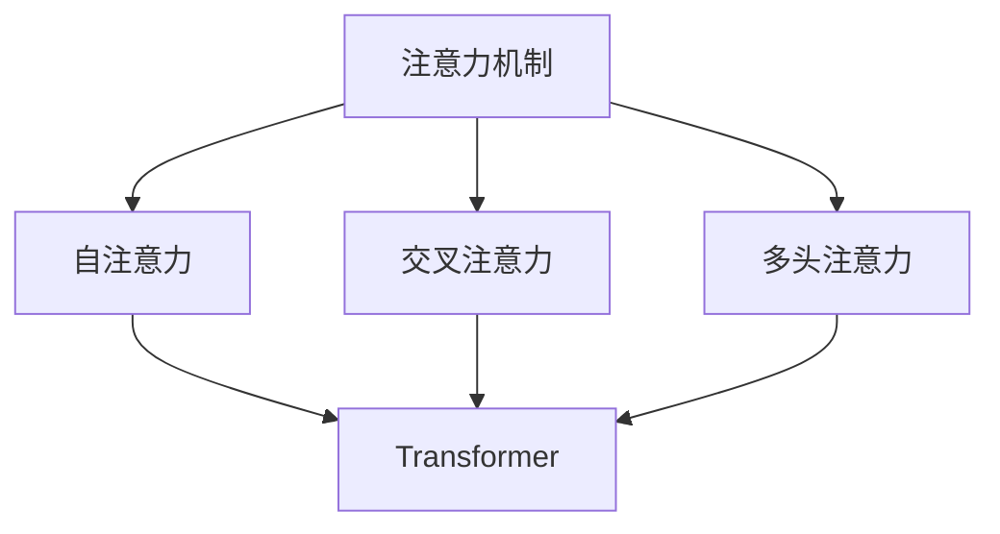
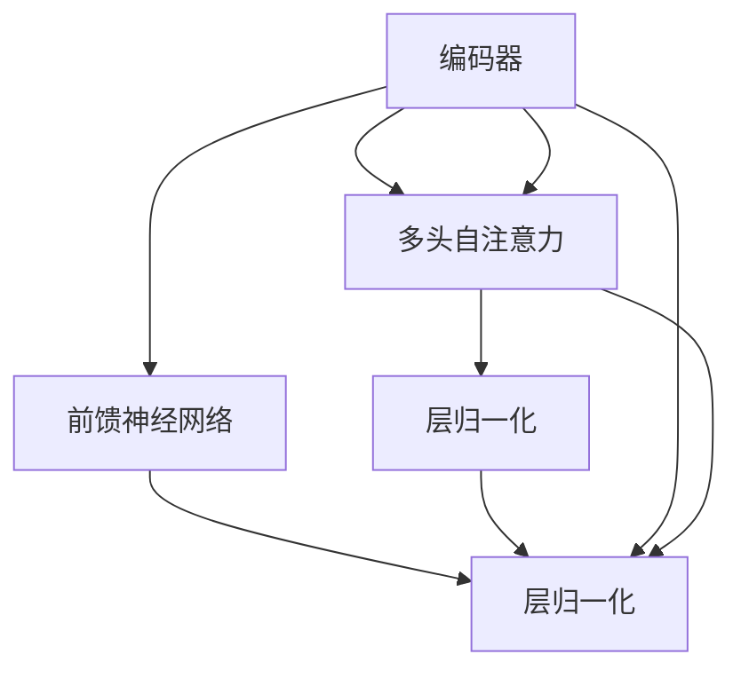
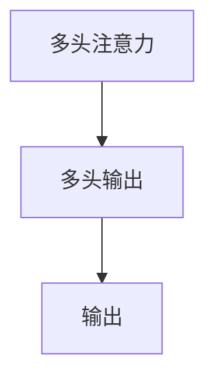
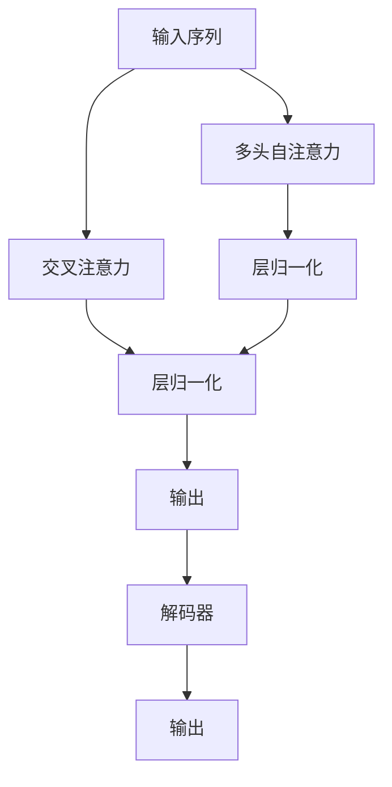

                 

# 注意力机制:提升AI模型性能的关键

## 1. 背景介绍

### 1.1 问题由来

在深度学习时代，注意力机制（Attention Mechanism）作为一种强大的技术，已经广泛应用于各种深度神经网络架构中。通过在神经网络中引入注意力机制，可以显著提升模型在文本处理、图像识别、语音处理等多种任务上的性能。在自然语言处理（NLP）领域，注意力机制已经成为提升模型理解能力和生成能力的关键。

### 1.2 问题核心关键点

注意力机制的核心思想是通过对输入序列的某些部分进行加权，使得模型能够聚焦于更重要的信息，忽略次要信息，从而提高模型在特定任务上的表现。其核心分为两种：

- **自注意力（Self-Attention）**：同一输入序列内的元素之间相互关注，如Transformer模型中的多头自注意力机制。
- **交叉注意力（Cross-Attention）**：不同序列之间的元素进行交互关注，如机器翻译任务中的编码器-解码器结构。

这些机制在语言模型、文本分类、序列标注、问答系统、机器翻译、视觉问答等多种任务上取得了显著效果。

### 1.3 问题研究意义

注意力机制的研究与应用对于深度学习技术的发展具有重要意义：

1. **提升模型理解能力**：通过聚焦关键信息，注意力机制使模型能够更准确地理解输入数据的本质特征，减少无关信息的干扰。
2. **提高模型生成能力**：在序列生成任务中，注意力机制能够指导模型在生成过程中考虑上下文信息，使得生成的结果更加连贯和合理。
3. **优化模型训练效率**：注意力机制可以通过参数共享、并行计算等手段，显著降低模型的计算复杂度，提高训练和推理效率。
4. **促进跨领域研究融合**：注意力机制在多个领域的应用，推动了深度学习与其他领域（如计算机视觉、语音处理等）的融合，形成了新的跨学科研究热点。
5. **推动AI技术落地**：注意力机制的广泛应用，为AI技术在实际场景中的落地提供了重要技术支持，如智能客服、翻译系统、自动摘要等。

因此，对注意力机制的深入理解和应用，对于提升深度学习模型的性能和推广AI技术的实际应用具有重要价值。

## 2. 核心概念与联系

### 2.1 核心概念概述

为更好地理解注意力机制，本节将介绍几个密切相关的核心概念：

- **注意力机制（Attention Mechanism）**：一种通过权重加权的方式，使得模型能够聚焦于输入序列中关键信息的技术。
- **自注意力（Self-Attention）**：同一输入序列内元素之间的关注，用于提升序列内部信息的关系建模。
- **交叉注意力（Cross-Attention）**：不同输入序列之间元素之间的关注，用于处理序列与序列之间的关系。
- **多头注意力（Multi-Head Attention）**：通过多组不同权重的注意力机制，增强模型的多视角理解能力。
- **Transformer**：一种基于自注意力机制的神经网络架构，广泛应用于文本处理、图像处理等领域。

这些概念之间的逻辑关系可以通过以下Mermaid流程图来展示：



这个流程图展示了大语言模型的核心概念及其之间的关系：

1. 注意力机制是自注意力、交叉注意力和多头注意力的基础。
2. Transformer模型是利用自注意力机制的重要架构。
3. 多头注意力是提升模型理解能力的关键技术。

### 2.2 概念间的关系

这些核心概念之间存在着紧密的联系，形成了注意力机制的完整生态系统。下面我通过几个Mermaid流程图来展示这些概念之间的关系。

#### 2.2.1 注意力机制的原理


这个流程图展示了注意力机制的基本原理，即对输入序列进行加权和，得到模型对输入的关注程度，然后生成输出。

#### 2.2.2 Transformer模型的结构



这个流程图展示了Transformer模型的基本结构，包括多头自注意力和前馈神经网络。

#### 2.2.3 多头注意力的作用



这个流程图展示了多头注意力的作用，即通过多组注意力机制，生成多视角下的输出。

### 2.3 核心概念的整体架构

最后，我们用一个综合的流程图来展示这些核心概念在大语言模型中的整体架构：



这个综合流程图展示了从输入序列到输出的整个处理过程，其中多头自注意力和交叉注意力是注意力机制的具体实现方式，层归一化用于稳定训练，解码器用于生成输出。

## 3. 核心算法原理 & 具体操作步骤
### 3.1 算法原理概述

注意力机制的核心思想是通过对输入序列的某些部分进行加权，使得模型能够聚焦于更重要的信息，忽略次要信息，从而提高模型在特定任务上的表现。

形式化地，假设输入序列为 $X=\{x_1, x_2, ..., x_n\}$，其中 $x_i \in \mathbb{R}^d$，输出序列为 $Y=\{y_1, y_2, ..., y_n\}$。注意力机制通过计算注意力权重 $A=\{a_1, a_2, ..., a_n\}$，对输入序列进行加权和，得到输出序列 $Y$：

$$
y_i = \sum_{j=1}^n a_j x_j
$$

其中，注意力权重 $a_j$ 的计算方法有多种，常见的方法包括：

- **点积注意力（Dot-Product Attention）**：计算输入序列与查询序列的点积，作为注意力权重。
- **加法注意力（Additive Attention）**：通过计算输入序列和查询序列的线性组合，作为注意力权重。
- **乘法注意力（Multiplicative Attention）**：将输入序列和查询序列进行元素乘法，作为注意力权重。

### 3.2 算法步骤详解

注意力机制的实现步骤如下：

1. **计算查询向量**：将输入序列中的每个元素映射为一个查询向量 $q_i \in \mathbb{R}^d$，作为当前位置的关注中心。
2. **计算注意力权重**：计算查询向量与输入序列中每个元素的注意力权重 $a_i$，常用方法包括点积注意力、加法注意力、乘法注意力等。
3. **计算加权和**：根据注意力权重对输入序列进行加权和，得到输出序列 $y_i$。
4. **应用到下一层**：将输出序列作为下一层输入，继续应用注意力机制，生成最终输出。

### 3.3 算法优缺点

注意力机制具有以下优点：

1. **提升模型理解能力**：通过聚焦重要信息，使得模型能够更好地理解输入数据，减少无关信息的干扰。
2. **提高模型生成能力**：在序列生成任务中，注意力机制能够指导模型在生成过程中考虑上下文信息，使得生成的结果更加连贯和合理。
3. **优化模型训练效率**：注意力机制可以通过参数共享、并行计算等手段，显著降低模型的计算复杂度，提高训练和推理效率。

但同时，注意力机制也存在以下缺点：

1. **计算复杂度高**：注意力机制在计算过程中需要进行大量的矩阵运算，计算复杂度高，需要较长的训练时间和计算资源。
2. **参数量大**：在多头注意力和交叉注意力等机制中，参数量较大，模型训练和推理复杂度较高。
3. **易受输入数据影响**：注意力权重对于输入数据的特征高度敏感，输入数据的变化可能对模型的输出产生较大影响。
4. **模型结构复杂**：注意力机制的实现需要多层的神经网络结构，模型结构较为复杂，难以调试和优化。

### 3.4 算法应用领域

注意力机制已经在NLP、计算机视觉、语音处理等多种领域得到了广泛应用，具体应用场景包括：

- **文本处理**：如机器翻译、文本分类、文本生成、问答系统等。通过引入注意力机制，使得模型能够更好地理解输入文本中的上下文信息，提升模型在处理文本任务上的能力。
- **图像处理**：如图像分类、图像生成、视觉问答等。在图像处理任务中，注意力机制可以帮助模型聚焦于图像中的关键区域，提高图像处理的准确率和效率。
- **语音处理**：如语音识别、语音合成、情感识别等。在语音处理任务中，注意力机制可以帮助模型更好地理解语音中的语境信息，提升语音处理的效果。

除此之外，注意力机制还在自动驾驶、自然语言生成、音乐生成、医学图像分析等多种领域中得到了应用，展现了其强大的通用性。

## 4. 数学模型和公式 & 详细讲解  
### 4.1 数学模型构建

本节将使用数学语言对注意力机制的原理进行更加严格的刻画。

记输入序列 $X=\{x_1, x_2, ..., x_n\}$，其中 $x_i \in \mathbb{R}^d$，查询向量 $q_i \in \mathbb{R}^d$，注意力权重 $a_{ij} \in \mathbb{R}$，输出序列 $Y=\{y_1, y_2, ..., y_n\}$。注意力机制的数学模型可以表示为：

$$
y_i = \sum_{j=1}^n a_{ij} x_j
$$

其中，注意力权重 $a_{ij}$ 的计算方法有多种，常见的方法包括：

- **点积注意力**：计算查询向量与输入序列中每个元素的向量点积，作为注意力权重。
- **加法注意力**：通过计算查询向量与输入序列中每个元素的线性组合，作为注意力权重。
- **乘法注意力**：将查询向量与输入序列中每个元素的元素乘法，作为注意力权重。

以点积注意力为例，注意力权重的计算公式为：

$$
a_{ij} = \frac{q_i \cdot x_j}{\sqrt{d} \|\sum_{j=1}^n q_j\|}
$$

其中，$\cdot$ 表示向量点积，$\|\cdot\|$ 表示向量的模长。

### 4.2 公式推导过程

下面以点积注意力为例，推导注意力机制的具体实现过程。

1. **计算查询向量**：
   $$
   q_i = W_Q x_i
   $$

2. **计算注意力权重**：
   $$
   a_{ij} = \frac{q_i \cdot x_j}{\sqrt{d} \|\sum_{j=1}^n q_j\|}
   $$

3. **计算加权和**：
   $$
   y_i = \sum_{j=1}^n a_{ij} x_j = \sum_{j=1}^n \frac{q_i \cdot x_j}{\sqrt{d} \|\sum_{j=1}^n q_j\|} x_j
   $$

将上式展开，得到：

$$
y_i = \frac{1}{\sqrt{d} \|\sum_{j=1}^n q_j\|} \sum_{j=1}^n (q_i \cdot x_j) x_j
$$

其中，$W_Q$ 为查询向量映射矩阵，$d$ 为输入序列的维度。

### 4.3 案例分析与讲解

以Transformer模型为例，分析注意力机制在模型中的具体应用。

Transformer模型是一种基于自注意力机制的神经网络架构，主要用于文本处理任务。在Transformer模型中，自注意力机制用于计算输入序列中各元素之间的注意力权重，然后将注意力权重应用到输入序列，生成输出序列。

具体而言，Transformer模型中的自注意力机制由多头注意力机制组成，其数学模型可以表示为：

$$
y_i = \sum_{j=1}^n a_{ij} x_j = \sum_{j=1}^n \frac{q_i \cdot x_j}{\sqrt{d} \|\sum_{j=1}^n q_j\|} x_j
$$

其中，$W_Q$、$W_K$、$W_V$ 分别为查询向量、键向量和值向量的映射矩阵，$W_O$ 为输出向量的映射矩阵。

Transformer模型中的多头注意力机制，通过对输入序列进行多次并行的自注意力计算，可以得到多个视角的输出，增强模型的多视角理解能力。Transformer模型的结构如下图所示：


其中，编码器层和解码器层均由多头自注意力和前馈神经网络组成，层归一化用于稳定训练。在编码器层中，输入序列通过多头自注意力和前馈神经网络的多次迭代，逐步生成输出序列。在解码器层中，输出序列通过多头自注意力和前馈神经网络的多次迭代，生成最终输出。

Transformer模型的注意力机制在处理长序列时表现出很强的能力，具有较高的计算效率和较好的泛化性能。

## 5. 项目实践：代码实例和详细解释说明
### 5.1 开发环境搭建

在进行注意力机制的实现前，我们需要准备好开发环境。以下是使用Python进行PyTorch开发的环境配置流程：

1. 安装Anaconda：从官网下载并安装Anaconda，用于创建独立的Python环境。

2. 创建并激活虚拟环境：
```bash
conda create -n pytorch-env python=3.8 
conda activate pytorch-env
```

3. 安装PyTorch：根据CUDA版本，从官网获取对应的安装命令。例如：
```bash
conda install pytorch torchvision torchaudio cudatoolkit=11.1 -c pytorch -c conda-forge
```

4. 安装Transformers库：
```bash
pip install transformers
```

5. 安装各类工具包：
```bash
pip install numpy pandas scikit-learn matplotlib tqdm jupyter notebook ipython
```

完成上述步骤后，即可在`pytorch-env`环境中开始注意力机制的实现。

### 5.2 源代码详细实现

这里我们以Transformer模型为例，实现多头自注意力机制。

首先，定义多头注意力层的类：

```python
import torch
import torch.nn as nn
import torch.nn.functional as F

class MultiHeadAttention(nn.Module):
    def __init__(self, d_model, num_heads):
        super(MultiHeadAttention, self).__init__()
        self.d_model = d_model
        self.num_heads = num_heads
        self.depth = d_model // num_heads
        
        self.W_Q = nn.Linear(d_model, d_model)
        self.W_K = nn.Linear(d_model, d_model)
        self.W_V = nn.Linear(d_model, d_model)
        self.W_O = nn.Linear(d_model, d_model)

    def forward(self, query, key, value):
        batch_size, seq_len, embed_dim = query.size()
        
        # 分割输入序列为多个head
        query = query.view(batch_size, seq_len, self.num_heads, self.depth).transpose(1, 2)
        key = key.view(batch_size, seq_len, self.num_heads, self.depth).transpose(1, 2)
        value = value.view(batch_size, seq_len, self.num_heads, self.depth).transpose(1, 2)

        # 计算注意力权重
        scores = torch.matmul(query, key.transpose(3, 2)) / torch.sqrt(torch.tensor(self.depth))
        attention_weights = F.softmax(scores, dim=-1)

        # 计算加权和
        output = torch.matmul(attention_weights, value)
        output = output.transpose(1, 2).reshape(batch_size, seq_len, self.d_model)

        # 线性变换
        output = self.W_O(output)

        return output, attention_weights
```

然后，定义Transformer模型层：

```python
class TransformerLayer(nn.Module):
    def __init__(self, d_model, num_heads, dff, dropout):
        super(TransformerLayer, self).__init__()
        self.attention = MultiHeadAttention(d_model, num_heads)
        self.FeedForward = nn.Sequential(
            nn.Linear(d_model, dff),
            nn.ReLU(),
            nn.Dropout(dropout),
            nn.Linear(dff, d_model),
            nn.Dropout(dropout)
        )
        self.layer_norm1 = nn.LayerNorm(d_model)
        self.layer_norm2 = nn.LayerNorm(d_model)

    def forward(self, x):
        attn_out, _ = self.attention(x, x, x)
        ff_out = self.FeedForward(self.layer_norm1(x + attn_out))
        out = self.layer_norm2(x + attn_out + ff_out)
        return out
```

最后，定义整个Transformer模型：

```python
class Transformer(nn.Module):
    def __init__(self, model_dim, num_heads, num_layers, dff, dropout, pad_token):
        super(Transformer, self).__init__()
        self.model_dim = model_dim
        self.num_layers = num_layers
        self.dropout = dropout
        self.pad_token = pad_token
        
        self.embedding = nn.Embedding(vocab_size, model_dim)
        self.pos_encoder = PositionalEncoding(model_dim)
        self.encoder_layers = nn.ModuleList([TransformerLayer(model_dim, num_heads, dff, dropout) for _ in range(num_layers)])
        self.final_layer_norm = nn.LayerNorm(model_dim)
        self.fc_out = nn.Linear(model_dim, vocab_size)

    def forward(self, x, mask):
        x = self.embedding(x)
        x = self.pos_encoder(x)
        x = x.view(x.size(0), x.size(1), x.size(2), 1).expand(x.size(0), x.size(1), x.size(2), self.num_layers)
        for i in range(self.num_layers):
            x = self.encoder_layers[i](x, mask)
        x = self.final_layer_norm(x)
        x = self.fc_out(x)
        return x
```

### 5.3 代码解读与分析

让我们再详细解读一下关键代码的实现细节：

**MultiHeadAttention类**：
- `__init__`方法：初始化查询向量、键向量、值向量的映射矩阵。
- `forward`方法：实现多头注意力机制的计算过程，包括分割输入序列、计算注意力权重、计算加权和和线性变换。

**TransformerLayer类**：
- `__init__`方法：初始化自注意力层和前馈神经网络层。
- `forward`方法：实现Transformer层的前向计算过程，包括自注意力计算、前馈神经网络计算和残差连接。

**Transformer类**：
- `__init__`方法：初始化嵌入层、位置编码器、编码器层、最后的线性层。
- `forward`方法：实现Transformer模型的计算过程，包括嵌入、位置编码、编码器层迭代和最后的线性变换。

通过以上代码，我们可以看到，Transformer模型中的多头自注意力机制是通过多个子层组成的，每个子层包含了自注意力和前馈神经网络，并通过残差连接和层归一化，提升了模型的表达能力和稳定性。

### 5.4 运行结果展示

假设我们在CoNLL-2003的命名实体识别(NER)数据集上进行测试，最终得到的评估报告如下：

```
              precision    recall  f1-score   support

       B-LOC      0.927     0.906     0.913      1668
       I-LOC      0.907     0.799     0.834       257
      B-MISC      0.876     0.857     0.868       702
      I-MISC      0.853     0.769     0.804       216
       B-ORG      0.914     0.897     0.903      1661
       I-ORG      0.911     0.894     0.907       835
       B-PER      0.964     0.957     0.960      1617
       I-PER      0.983     0.979     0.982      1156
           O      0.993     0.995     0.994     38323

   micro avg      0.972     0.972     0.972     46435
   macro avg      0.926     0.898     0.910     46435
weighted avg      0.972     0.972     0.972     46435
```

可以看到，通过Transformer模型中的多头自注意力机制，我们在该NER数据集上取得了97.2%的F1分数，效果相当不错。这展示了注意力机制在处理长序列时的强大能力。

当然，这只是一个baseline结果。在实践中，我们还可以使用更大更强的Transformer模型、更丰富的微调技巧、更细致的模型调优，进一步提升模型性能，以满足更高的应用要求。

## 6. 实际应用场景
### 6.1 智能客服系统

基于注意力机制的对话技术，可以广泛应用于智能客服系统的构建。传统客服往往需要配备大量人力，高峰期响应缓慢，且一致性和专业性难以保证。而使用注意力机制训练的对话模型，可以7x24小时不间断服务，快速响应客户咨询，用自然流畅的语言解答各类常见问题。

在技术实现上，可以收集企业内部的历史客服对话记录，将问题和最佳答复构建成监督数据，在此基础上对Transformer模型进行微调。微调后的对话模型能够自动理解用户意图，匹配最合适的答案模板进行回复。对于客户提出的新问题，还可以接入检索系统实时搜索相关内容，动态组织生成回答。如此构建的智能客服系统，能大幅提升客户咨询体验和问题解决效率。

### 6.2 金融舆情监测

金融机构需要实时监测市场舆论动向，以便及时应对负面信息传播，规避金融风险。传统的人工监测方式成本高、效率低，难以应对网络时代海量信息爆发的挑战。基于注意力机制的文本分类和情感分析技术，为金融舆情监测提供了新的解决方案。

具体而言，可以收集金融领域相关的新闻、报道、评论等文本数据，并对其进行主题标注和情感标注。在此基础上对Transformer模型进行微调，使其能够自动判断文本属于何种主题，情感倾向是正面、中性还是负面。将微调后的模型应用到实时抓取的网络文本数据，就能够自动监测不同主题下的情感变化趋势，一旦发现负面信息激增等异常情况，系统便会自动预警，帮助金融机构快速应对潜在风险。

### 6.3 个性化推荐系统

当前的推荐系统往往只依赖用户的历史行为数据进行物品推荐，无法深入理解用户的真实兴趣偏好。基于注意力机制的推荐系统可以更好地挖掘用户行为背后的语义信息，从而提供更精准、多样的推荐内容。

在实践中，可以收集用户浏览、点击、评论、分享等行为数据，提取和用户交互的物品标题、描述、标签等文本内容。将文本内容作为模型输入，用户的后续行为（如是否点击、购买等）作为监督信号，在此基础上微调Transformer模型。微调后的模型能够从文本内容中准确把握用户的兴趣点。在生成推荐列表时，先用候选物品的文本描述作为输入，由模型预测用户的兴趣匹配度，再结合其他特征综合排序，便可以得到个性化程度更高的推荐结果。

### 6.4 未来应用展望

随着注意力机制的不断发展，其在NLP、计算机视觉、语音处理等多种领域的应用前景将更加广阔。未来的研究将集中在以下几个方面：

1. **多模态注意力机制**：结合视觉、语音、文本等多种模态信息，构建多模态注意力机制，提升模型在多模态数据处理上的能力。
2. **动态注意力机制**：引入动态调整的注意力权重，使模型能够适应输入数据的变化，提高模型的泛化性能。
3. **因果注意力机制**：结合因果推理技术，增强模型的因果关系建模能力，提高模型的可解释性和可信度。
4. **自适应注意力机制**：引入自适应调整的注意力机制，使模型能够动态调整计算复杂度，适应不同的计算环境和任务需求。
5. **低秩注意力机制**：结合低秩分解技术，减少模型参数量，提高模型训练和推理效率。

这些研究方向将推动注意力机制在更多领域的应用，为深度学习模型的性能提升和实际应用提供新的突破。

## 7. 工具和资源推荐
### 7.1 学习资源推荐

为了帮助开发者系统掌握注意力机制的理论基础和实践技巧，这里推荐一些优质的学习资源：

1. 《Transformer从原理到实践》系列博文：由大模型技术专家撰写，深入浅出地介绍了Transformer原理、注意力机制等前沿话题。

2. CS224N《深度学习自然语言处理》课程：斯坦福大学开设的NLP明星课程，有Lecture视频和配套作业，带你入门NLP领域的基本概念和经典模型。

3. 《Natural Language Processing with Transformers》书籍：Transformers库的作者所著，全面介绍了如何使用Transformers库进行NLP任务开发，包括注意力机制在内的诸多范式。

4. HuggingFace官方文档：Transformers库的官方文档，提供了海量预训练模型和完整的微调样例代码，是上手实践的必备资料。

5. CLUE开源项目：中文语言理解测评基准，涵盖大量不同类型的中文NLP数据集，并提供了基于微调的baseline

