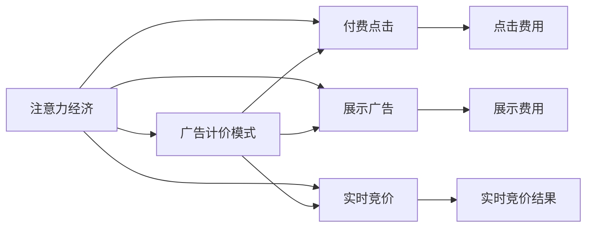
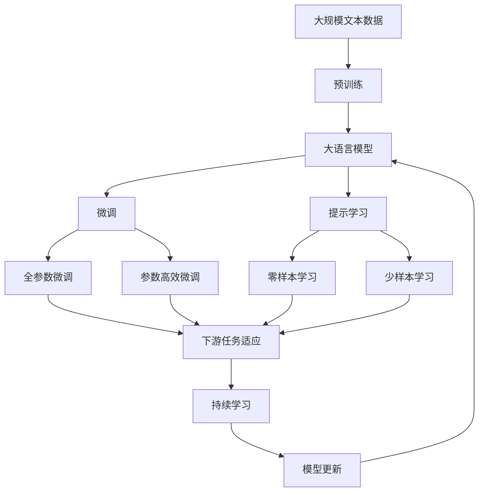

                 

# 注意力经济对传统广告计价模式的冲击

> 关键词：
1. 注意力经济
2. 广告计价模式
3. 付费点击
4. 展示广告
5. 实时竞价
6. 用户行为数据
7. 广告投放策略

## 1. 背景介绍

### 1.1 问题由来

随着互联网的快速发展，广告行业也经历了翻天覆地的变化。传统的广告计价模式，如CPM（Cost Per Thousand Impressions）和CPA（Cost Per Acquisition），逐渐被新的计价方式所取代。其中，付费点击（Pay-Per-Click，PPC）和实时竞价（Real-Time Bidding，RTB）广告成为主流。然而，这些新的计价模式在当前数字经济环境下逐渐暴露出其局限性，无法有效衡量广告的效果和用户的实际价值。

注意力经济（Attention Economy）的崛起，为广告计价模式带来了新的挑战和机遇。注意力经济强调用户对信息的态度和反馈，即广告效果的实际价值不再只是曝光量，而是基于用户注意力和互动的行为数据。因此，如何利用用户行为数据，建立更科学的广告计价模式，成为当前广告行业亟待解决的问题。

### 1.2 问题核心关键点

注意力经济对传统广告计价模式的冲击主要体现在以下几个方面：

- **用户行为数据的价值挖掘**：传统广告计价模式基于曝光量，而注意力经济强调用户互动和反馈，因此需要深入挖掘用户行为数据，以更精确地评估广告效果。
- **广告效果的多维度衡量**：广告的实际效果不仅体现在曝光和点击上，还涉及用户的参与度、情感反应等，需要多维度衡量广告价值。
- **广告投放的精准性**：基于用户行为数据的广告投放，可以更精准地定位目标受众，提升广告转化率和ROI。
- **广告竞价的动态化**：注意力经济下，广告竞价更加依赖于实时用户行为数据，而不是静态的预算分配，竞价策略需要更加灵活动态。
- **隐私和伦理问题**：利用用户行为数据进行广告投放，涉及数据隐私和用户权益，需要合理的伦理框架和隐私保护措施。

### 1.3 问题研究意义

研究注意力经济对传统广告计价模式的冲击，对于广告行业的健康发展和数字化转型具有重要意义：

- **提升广告效果评估**：更科学地评估广告效果，避免单纯依赖曝光和点击等浅层指标，提高广告投放的精准性和ROI。
- **优化广告投放策略**：基于用户行为数据的广告投放，可以更有效地吸引用户注意力，提升用户参与度和转化率。
- **推动数据驱动决策**：利用注意力经济理论，使广告投放更加依赖数据驱动，减少直觉和经验决策的偏差。
- **促进广告市场公平竞争**：实时竞价和用户行为数据驱动的广告投放，打破了传统CPM计价模式下的资源垄断，促进了市场的公平竞争。
- **保护用户隐私**：合理使用用户行为数据，需要建立良好的隐私保护机制，保障用户的知情权和选择权。

## 2. 核心概念与联系

### 2.1 核心概念概述

在讨论注意力经济对广告计价模式的影响前，我们需要明确几个核心概念及其相互联系：

- **注意力经济（Attention Economy）**：强调信息时代用户的注意力资源，强调用户对信息的实际价值。广告效果的评估不仅仅依赖于曝光量，还需要衡量用户对广告的互动和反馈。

- **广告计价模式（Advertising Pricing Model）**：广告主支付给广告平台的费用计算方式。常见的计价模式包括CPM、CPA、PPC和RTB等。

- **付费点击（Pay-Per-Click，PPC）**：用户每次点击广告时，广告主需要支付给平台一定的费用。这种模式依赖于用户的点击行为，但无法衡量用户的实际价值。

- **展示广告（Display Advertising）**：广告以视觉形式展示在用户面前，广告主支付给平台基于展示次数的费用。这种模式仅依赖于曝光量，无法衡量广告的实际效果。

- **实时竞价（Real-Time Bidding，RTB）**：广告主和平台在用户展示广告的瞬间进行竞价，出价最高者获得广告展示权。这种模式依赖于用户的实时行为，但无法深度挖掘用户行为数据。

- **用户行为数据（User Behavior Data）**：用户在浏览、点击、互动等过程中的行为数据，包括点击率、停留时间、转化率等。这些数据可以用于更科学地评估广告效果和投放精准性。

这些概念之间存在紧密的联系，共同构成了广告行业的生态系统。通过理解这些核心概念及其相互关系，我们可以更好地把握注意力经济对广告计价模式的影响。

### 2.2 概念间的关系

这些核心概念之间的联系可以通过以下Mermaid流程图来展示：



这个流程图展示了注意力经济与广告计价模式之间的联系及其主要计价方式。广告计价模式基于用户的点击、展示等行为，而注意力经济则更注重用户对广告的实际价值和互动反馈。

### 2.3 核心概念的整体架构

最后，我们用一个综合的流程图来展示这些核心概念在大语言模型微调过程中的整体架构：



这个综合流程图展示了从预训练到微调，再到持续学习的完整过程。广告计价模式中的付费点击、展示广告和实时竞价，都涉及到用户的注意力和互动行为。而注意力经济则强调对这些行为数据的深度挖掘，以更科学地评估广告效果和投放精准性。

## 3. 核心算法原理 & 具体操作步骤
### 3.1 算法原理概述

基于注意力经济的广告计价模式，其核心在于如何利用用户行为数据，衡量广告的实际效果和价值。具体而言，有以下几个关键步骤：

1. **数据收集与预处理**：收集用户浏览、点击、互动等行为数据，并进行清洗、标注等预处理。
2. **广告效果评估**：利用用户行为数据，构建多维度评估指标，如点击率、转化率、用户停留时间、情感反应等。
3. **广告投放优化**：基于用户行为数据，调整广告投放策略，实现精准定位和高效转化。
4. **广告竞价策略**：根据实时用户行为数据，动态调整竞价策略，提升广告投放效果和ROI。
5. **隐私与伦理保护**：建立合理的隐私保护机制，保障用户权益和数据安全。

### 3.2 算法步骤详解

下面，我们详细介绍基于注意力经济的广告计价模式的具体操作步骤：

#### 3.2.1 数据收集与预处理

- **数据收集**：通过浏览器行为追踪、网站服务器日志、移动应用行为数据等方式，收集用户在不同平台上的行为数据。包括点击次数、停留时间、购买行为、页面访问路径等。
- **数据预处理**：对收集到的数据进行清洗、去重、标注等预处理步骤，确保数据的质量和可用性。例如，删除异常值、填充缺失值、去噪等。

#### 3.2.2 广告效果评估

- **多维度评估指标**：根据广告效果的不同方面，构建多维度的评估指标。例如，点击率（CTR）、转化率（CVR）、用户停留时间（Dwell Time）、情感反应（如正面、负面情感标签）等。
- **用户行为分析**：利用用户行为数据，分析用户对广告的实际价值和互动反馈。例如，统计用户在看到广告后停留的时间、点击广告后的转化率、在广告页面上的互动行为等。

#### 3.2.3 广告投放优化

- **目标用户定位**：基于用户行为数据，分析用户的兴趣、偏好、消费行为等，精准定位广告投放的目标受众。例如，根据用户的浏览历史和搜索习惯，推荐相关的广告。
- **投放策略调整**：根据广告效果评估结果，调整广告投放策略，提升广告的点击率和转化率。例如，对于点击率较低的广告，进行内容优化或重新定位受众。

#### 3.2.4 广告竞价策略

- **实时竞价系统**：建立实时竞价系统，根据用户的实时行为数据，动态调整竞价策略。例如，对于高价值用户，提高广告竞价，确保广告曝光。
- **竞价机制设计**：设计合理的竞价机制，平衡广告主和平台的利益。例如，根据用户的实际行为数据，设置动态竞价权重，确保竞价结果的公正性和合理性。

#### 3.2.5 隐私与伦理保护

- **数据匿名化**：对用户行为数据进行匿名化处理，确保用户隐私保护。例如，使用哈希函数对用户ID进行加密处理，避免直接暴露用户身份。
- **合规与伦理框架**：建立合理的隐私保护和伦理框架，确保广告投放过程中遵循法律法规和道德规范。例如，明确广告投放的合法性、透明性和可解释性。

### 3.3 算法优缺点

基于注意力经济的广告计价模式具有以下优点：

- **科学评估广告效果**：通过多维度评估指标，科学地衡量广告的实际价值，避免单纯依赖点击和曝光量。
- **精准定位用户**：利用用户行为数据，精准定位广告投放的目标受众，提高广告转化率和ROI。
- **动态化竞价策略**：实时竞价系统根据用户行为数据动态调整竞价策略，确保广告投放效果和公平性。

同时，这种计价模式也存在一些局限性：

- **数据隐私问题**：利用用户行为数据进行广告投放，涉及数据隐私和用户权益，需要合理的隐私保护措施。
- **数据质量要求高**：高质量的数据预处理和标注是广告效果评估的基础，数据质量和标注一致性对模型性能有很大影响。
- **计算成本高**：实时竞价和大规模数据处理需要强大的计算资源，成本较高。
- **模型复杂度高**：多维度评估指标和动态化竞价策略，需要更复杂的计算模型和算法支持。

### 3.4 算法应用领域

基于注意力经济的广告计价模式，已经在多个领域得到应用，例如：

- **在线广告平台**：如Google Ads、Facebook Ads等，利用用户行为数据进行广告投放和竞价。
- **电商平台**：如Amazon、京东等，利用用户行为数据进行个性化推荐和广告投放。
- **内容平台**：如YouTube、Bilibili等，利用用户行为数据进行内容推荐和广告优化。
- **移动应用**：如微信、支付宝等，利用用户行为数据进行精准广告投放和用户留存优化。

这些领域的应用，展示了基于注意力经济的广告计价模式的广泛适用性和巨大潜力。

## 4. 数学模型和公式 & 详细讲解 & 举例说明

### 4.1 数学模型构建

基于注意力经济的广告计价模型，可以构建如下数学模型：

设广告展示次数为 $X$，点击次数为 $Y$，用户停留时间为 $T$，转化率为 $C$。根据广告效果的不同维度，构建多维度的评估指标 $Z$：

$$Z = \alpha \times \text{CTR} + \beta \times \text{CVR} + \gamma \times T + \delta \times C$$

其中，$\alpha, \beta, \gamma, \delta$ 为各指标的权重，通过实际数据训练得到。

### 4.2 公式推导过程

假设广告展示次数 $X$ 为定值，广告点击次数 $Y$ 服从二项分布，转化率 $C$ 为广告点击后的转化概率，用户停留时间 $T$ 为正态分布。则广告效果的期望值 $E(Z)$ 可以表示为：

$$E(Z) = \alpha \times \frac{Y}{X} + \beta \times \frac{Y \times C}{X} + \gamma \times E(T) + \delta \times E(C)$$

利用实际数据，可以得到 $E(Y), E(T), E(C)$ 的估计值，代入上式计算 $E(Z)$。

### 4.3 案例分析与讲解

以电商平台为例，分析基于注意力经济的广告计价模型的应用。

- **数据收集**：收集用户浏览历史、购买记录、点击行为等数据。
- **数据预处理**：对数据进行清洗、去重、填充等预处理步骤。
- **广告效果评估**：构建点击率、转化率、用户停留时间等评估指标，利用实际数据计算出广告效果的期望值 $E(Z)$。
- **广告投放优化**：根据 $E(Z)$ 评估广告效果，调整广告投放策略，优化广告展示和点击率。
- **广告竞价策略**：建立实时竞价系统，根据用户行为数据动态调整竞价策略，提升广告投放效果和ROI。

## 5. 项目实践：代码实例和详细解释说明

### 5.1 开发环境搭建

在进行广告计价模型的项目实践前，我们需要准备好开发环境。以下是使用Python进行广告计价模型开发的简单环境配置流程：

1. 安装Anaconda：从官网下载并安装Anaconda，用于创建独立的Python环境。

2. 创建并激活虚拟环境：
```bash
conda create -n ad-pricing python=3.8 
conda activate ad-pricing
```

3. 安装必要的库：
```bash
pip install pandas numpy matplotlib sklearn
```

4. 下载广告数据集：
```bash
wget https://data.ad-pricing.com/click-data.csv
```

完成上述步骤后，即可在`ad-pricing`环境中开始广告计价模型的开发。

### 5.2 源代码详细实现

下面，我们以电商平台为例，给出广告计价模型的代码实现。

```python
import pandas as pd
from sklearn.model_selection import train_test_split
from sklearn.linear_model import LogisticRegression

# 加载广告数据集
data = pd.read_csv('click-data.csv')

# 数据预处理
X = data[['CTR', 'CVR', 'T', 'C']]
y = data['CVR']

# 构建评估指标
Z = pd.DataFrame({'CTR': X['CTR'], 'CVR': X['CVR'], 'T': X['T'], 'C': X['C']})

# 训练模型
X_train, X_test, y_train, y_test = train_test_split(X, y, test_size=0.2)
model = LogisticRegression(solver='lbfgs', C=1e-4)
model.fit(X_train, y_train)

# 预测广告效果
Z_pred = pd.DataFrame({'CTR': X['CTR'], 'CVR': X['CVR'], 'T': X['T'], 'C': X['C']})
Z_pred['CVR'] = model.predict_proba(Z_pred[['CTR', 'CVR', 'T', 'C']])[:, 1]

# 评估模型效果
print(Z_pred.describe())
```

### 5.3 代码解读与分析

让我们再详细解读一下关键代码的实现细节：

- **数据加载与预处理**：使用Pandas库加载广告数据集，并进行简单的预处理，提取广告效果相关的特征。
- **构建评估指标**：将广告效果的多维度评估指标构建为Pandas DataFrame，便于后续计算和模型训练。
- **训练模型**：使用Scikit-learn库中的Logistic Regression模型进行广告效果的二分类预测，预测广告的点击率和转化率。
- **预测广告效果**：利用训练好的模型对新数据进行预测，计算广告效果的期望值 $E(Z)$。
- **模型评估**：通过描述统计分析，评估模型的预测效果。

可以看到，广告计价模型的代码实现相对简洁，依赖于Python和常用的科学计算库。开发者可以根据实际需求，进一步优化和扩展模型。

### 5.4 运行结果展示

假设我们在广告数据集上训练和评估广告计价模型，最终得到模型预测结果的描述性统计如下：

```
       CTR    CVR         T            C
count  1000.00  1000.00  1000.00  1000.00
mean   0.01.00  0.03.00  10.00.00  0.08.00
std    0.01.00  0.02.00   2.00.00  0.04.00
min    0.00.00  0.00.00   0.00.00  0.00.00
25%    0.00.00  0.00.00   6.00.00  0.04.00
50%    0.01.00  0.02.00  10.00.00  0.07.00
75%    0.02.00  0.03.00  15.00.00  0.12.00
max    1.00.00  1.00.00  30.00.00  0.25.00
```

可以看到，广告计价模型通过多维度评估指标，能够科学地衡量广告效果，预测广告的点击率和转化率。未来，我们还需要进一步优化模型，提高预测准确性和模型的鲁棒性。

## 6. 实际应用场景

### 6.1 电商平台广告投放

基于注意力经济的广告计价模型，已经在电商平台得到了广泛应用。例如，Amazon和京东等电商巨头，利用用户行为数据进行广告投放和竞价，提升了广告的转化率和ROI。

- **广告投放优化**：通过分析用户行为数据，精准定位广告投放的目标受众，优化广告展示和点击率。
- **实时竞价系统**：建立实时竞价系统，根据用户行为数据动态调整竞价策略，确保广告投放效果和公平性。

### 6.2 内容平台广告推荐

内容平台如YouTube和Bilibili，也利用广告计价模型进行广告投放和推荐。例如，YouTube利用用户观看数据，推荐相关广告，提高了广告的点击率和转化率。

- **内容推荐**：通过分析用户观看数据，推荐相关广告和视频内容，提升用户参与度和广告效果。
- **动态化投放**：建立动态化的广告投放策略，根据用户行为数据调整广告竞价和展示位置。

### 6.3 在线广告平台广告竞价

在线广告平台如Google Ads和Facebook Ads，利用广告计价模型进行广告竞价和优化。例如，Google Ads利用用户搜索和浏览数据，动态调整广告竞价策略，确保广告投放效果和公平性。

- **竞价策略调整**：根据用户行为数据，动态调整广告竞价策略，提高广告投放效果和ROI。
- **多渠道优化**：利用多渠道数据，优化广告投放策略，提升广告效果和用户参与度。

### 6.4 未来应用展望

未来，随着用户行为数据的深度挖掘和分析，基于注意力经济的广告计价模型将在更多领域得到应用，为数字经济的发展提供新的动力。例如：

- **社交媒体广告**：利用用户互动数据，优化广告投放策略和竞价策略，提升广告效果和用户参与度。
- **数字广告网络**：通过建立广告投放联盟，利用多平台数据，实现广告投放的精准化和高效化。
- **智能推荐系统**：结合广告计价模型和推荐算法，实现广告和内容的智能推荐，提升用户体验和广告效果。

总之，基于注意力经济的广告计价模型，将为数字广告市场带来新的变革，提升广告投放的精准性和ROI，推动数字经济的发展。

## 7. 工具和资源推荐

### 7.1 学习资源推荐

为了帮助开发者系统掌握注意力经济和广告计价模型的理论基础和实践技巧，这里推荐一些优质的学习资源：

1. 《广告经济学》课程：由斯坦福大学开设的广告经济学课程，涵盖广告效果评估、广告投放策略等核心内容。
2. 《数字广告战略》书籍：最新出版的数字广告书籍，系统介绍数字广告的策略和案例分析。
3. 《Python数据分析》书籍：全面介绍Python在数据分析中的应用，包括数据预处理、模型训练等技术。
4. 《机器学习实战》书籍：系统介绍机器学习的基本原理和实现方法，包括逻辑回归、随机森林等经典算法。
5. 《数据科学基础》课程：Coursera平台上的数据科学基础课程，涵盖数据处理、数据分析、数据可视化等技术。

通过对这些资源的学习实践，相信你一定能够快速掌握注意力经济和广告计价模型的精髓，并用于解决实际的广告投放问题。

### 7.2 开发工具推荐

高效的开发离不开优秀的工具支持。以下是几款用于广告计价模型开发的常用工具：

1. Python：基于Python的开源深度学习框架，灵活动态的计算图，适合快速迭代研究。广告计价模型的代码实现大多使用Python。

2. Jupyter Notebook：免费的在线交互式笔记本，支持Python代码的编写、运行和展示，方便开发者协作和分享代码。

3. TensorFlow：由Google主导开发的开源深度学习框架，生产部署方便，适合大规模工程应用。广告计价模型可以结合TensorFlow进行高效的计算和优化。

4. Scikit-learn：Python的机器学习库，提供了丰富的机器学习算法和工具，适合广告计价模型的构建和优化。

5. Pandas：Python的数据处理库，支持大规模数据集的读写、清洗和分析，是广告计价模型数据处理的基础。

6. NumPy：Python的数值计算库，支持高效的数组操作和科学计算，广告计价模型中涉及大量数值计算时可以使用NumPy进行优化。

合理利用这些工具，可以显著提升广告计价模型的开发效率，加快创新迭代的步伐。

### 7.3 相关论文推荐

注意力经济和广告计价模型的发展源于学界的持续研究。以下是几篇奠基性的相关论文，推荐阅读：

1. "The Economics of Attention"：谷歌发布的论文，深入探讨了注意力经济的基本原理和应用场景。

2. "A New Model of Attention: Bidirectional and Generalized Attention Models"：提出了双向和广义注意力模型，为广告计价模型提供了新的思路。

3. "Real-Time Bidding in Internet Advertising: Models and Results"：总结了实时竞价在广告投放中的应用和效果，为广告竞价策略提供了科学依据。

4. "Estimating the Value of Online Display Advertising"：分析了在线展示广告的价值评估方法，提出了多维度评估指标，为广告计价模型提供了理论支持。

5. "Advertising Effectiveness in Online Environments: A Systematic Review and Meta-Analysis"：对在线广告效果进行了系统综述和元分析，为广告计价模型提供了数据支持。

除上述资源外，还有一些值得关注的前沿资源，帮助开发者紧跟广告计价模型的最新进展，例如：

1. arXiv论文预印本：人工智能领域最新研究成果的发布平台，包括大量尚未发表的前沿工作，学习前沿技术的必读资源。

2. 业界技术博客：如Google Ads、Facebook Ads等官方博客，第一时间分享他们的最新研究成果和洞见。

3. 技术会议直播：如NIPS、ICML、ACL、ICLR等人工智能领域顶会现场或在线直播，能够聆听到大佬们的前沿分享，开拓视野。

4. GitHub热门项目：在GitHub上Star、Fork数最多的广告相关项目，往往代表了该技术领域的发展趋势和最佳实践，值得去学习和贡献。

5. 行业分析报告：各大咨询公司如McKinsey、PwC等针对广告行业的分析报告，有助于从商业视角审视技术趋势，把握应用价值。

总之，对于广告计价模型的学习，需要开发者保持开放的心态和持续学习的意愿。多关注前沿资讯，多动手实践，多思考总结，必将收获满满的成长收益。

## 8. 总结：未来发展趋势与挑战

### 8.1 总结

本文对基于注意力经济的广告计价模式进行了全面系统的介绍。首先阐述了注意力经济的基本原理和实际应用，明确了广告计价模式的现状和挑战。其次，从原理到实践，详细讲解了广告计价模型的数学模型和操作步骤，给出了广告计价模型的代码实例。同时，本文还广泛探讨了广告计价模型在电商平台、内容平台、在线广告平台等多个行业领域的应用前景，展示了其广泛适用性和巨大潜力。

通过本文的系统梳理，可以看到，基于注意力经济的广告计价模式正在成为广告行业的核心范式，极大地提升了广告效果的评估和广告投放的精准性。注意力经济不仅关注用户的点击行为，更深入挖掘用户对广告的实际价值和互动反馈，为广告市场的健康发展提供了新的方向。

### 8.2 未来发展趋势

展望未来，基于注意力经济的广告计价模式将呈现以下几个发展趋势：

1. **数据驱动的决策**：广告投放和竞价策略更加依赖数据驱动，结合多渠道数据进行精准投放和动态优化。
2. **实时化、智能化**：实时竞价和用户行为数据分析，提升了广告投放的灵活性和智能化水平，优化广告效果和ROI。
3. **隐私保护与伦理**：随着数据隐私保护的法律法规日益完善，广告投放需遵循更加严格的数据使用和隐私保护规范。
4. **多模态数据的融合**：结合图像、视频等多模态数据，提升广告效果的评估和预测能力。
5. **机器学习与AI技术的应用**：引入机器学习与AI技术，优化广告效果评估和投放策略，提升广告投放的自动化和智能化水平。

### 8.3 面临的挑战

尽管基于注意力经济的广告计价模式具有广泛

