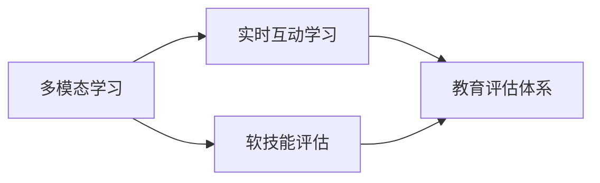
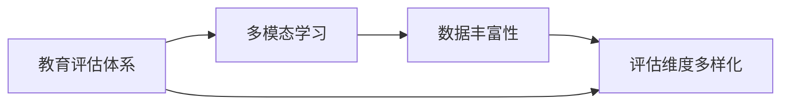
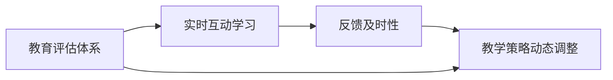
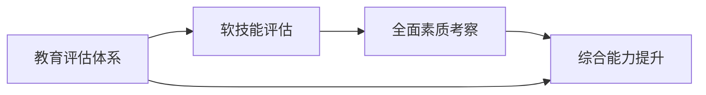
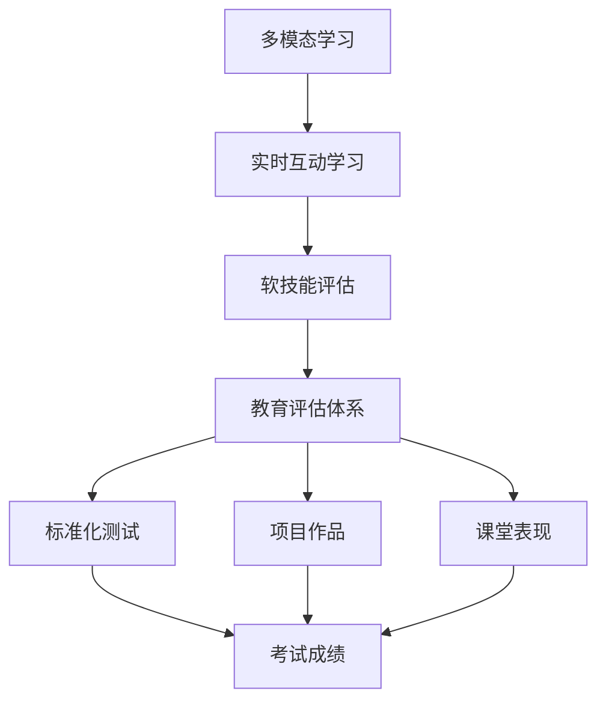

                 

# 注意力经济对传统教育评估体系的挑战

## 1. 背景介绍

在数字化浪潮席卷全球的今天，"注意力"作为一种稀缺资源，正在成为决定品牌、媒体、教育等多种行业成功与否的关键因素。注意力经济（Economy of Attention）这一概念最早由经济学家维克多·迈尔-舍恩伯格提出，指的是在信息过载的时代，争夺人们注意力成为商业的核心战略。传统教育评估体系在这种新形势下，面临诸多挑战，亟需进行改革和创新。

### 1.1 问题由来

传统教育评估体系主要基于考试成绩和知识掌握情况，以标准化测试为主导，侧重于考察学生对书本知识的理解和记忆。然而，随着数字化技术的深入应用，越来越多的教育内容呈现出碎片化、多模态、实时互动等特点，传统的评估方式已无法满足教育的多样化和个性化需求。例如，传统测试往往无法评估学生的信息素养、批判性思维、创造力等软技能，也无法适应在线教育的实时互动、混合学习等多种教学模式。

### 1.2 问题核心关键点

在注意力经济背景下，传统教育评估体系面临的核心挑战包括：

- **关注度失衡**：传统评估体系难以衡量学生的注意力集中情况，无法捕捉学生的学习状态和反馈，导致对学生的全面评价不足。
- **知识面窄化**：传统评估仅侧重书本知识，忽视了网络知识和技能的学习，限制了学生知识面的拓展。
- **技能单一化**：传统评估过于依赖标准化测试，忽视了学生的信息素养、批判性思维等软技能的重要性。
- **反馈延迟**：传统评估反馈周期长，无法实时调整教学策略，无法及时反映学生的学习情况和问题。
- **数据孤岛**：传统评估体系的数据孤岛现象严重，不同平台、系统间的数据难以互通，导致数据质量和使用效率低下。

## 2. 核心概念与联系

### 2.1 核心概念概述

为了更好地理解注意力经济对传统教育评估体系的挑战，本节将介绍几个密切相关的核心概念：

- **注意力经济**：指在信息过载的时代，争夺人们注意力成为商业的核心战略，其核心在于以用户注意力为出发点，制定和优化商业模式。
- **教育评估体系**：指用于衡量和判断教育效果、学生发展水平的系统，包括考试、测验、作业等多种形式。
- **多模态学习**：指利用文本、图像、音频、视频等多种媒介，实现多模态的教育和评估方式。
- **实时互动学习**：指通过即时沟通、互动讨论等方式，实现教学双方实时反馈和调整的教学模式。
- **软技能评估**：指对学生的情感、思维、社交等软技能的评估，强调综合素质和能力的全面考察。

这些核心概念之间的逻辑关系可以通过以下Mermaid流程图来展示：



这个流程图展示了大语言模型的核心概念及其之间的关系：多模态学习和实时互动学习为教育评估体系提供了新的数据源和反馈方式，而软技能评估则丰富了教育评估的维度。这些新特性与传统评估体系存在紧密的联系，需要进行融合和创新，以适应新形势下的教育需求。

### 2.2 概念间的关系

这些核心概念之间存在着紧密的联系，形成了教育评估体系在注意力经济背景下的完整生态系统。下面我们通过几个Mermaid流程图来展示这些概念之间的关系。

#### 2.2.1 教育评估体系与多模态学习



这个流程图展示了教育评估体系与多模态学习之间的相互关系。多模态学习通过丰富的数据源，为评估体系提供了更为全面、多样化的评估维度，从而增强了评估体系的准确性和可靠性。

#### 2.2.2 教育评估体系与实时互动学习



这个流程图展示了教育评估体系与实时互动学习之间的联系。实时互动学习通过即时反馈，帮助评估体系实时调整教学策略，提升教学效果。

#### 2.2.3 教育评估体系与软技能评估



这个流程图展示了教育评估体系与软技能评估之间的联系。软技能评估丰富了评估体系的维度，强调了情感、思维、社交等综合能力的考察，有助于全面提升学生的综合素质。

### 2.3 核心概念的整体架构

最后，我们用一个综合的流程图来展示这些核心概念在大语言模型微调过程中的整体架构：



这个综合流程图展示了从多模态学习、实时互动学习、软技能评估到教育评估体系的整体架构，以及其中包含的标准化测试、项目作品、课堂表现等多种评估形式。

## 3. 核心算法原理 & 具体操作步骤
### 3.1 算法原理概述

注意力经济背景下，教育评估体系需要对学生的注意力、互动行为、软技能等多维数据进行综合衡量，以评估学生的全面发展情况。因此，基于多模态学习、实时互动学习等新技术，构建新的教育评估体系成为一种必然趋势。

具体而言，新的教育评估体系将包括如下几个核心步骤：

1. **多模态数据收集**：通过各种设备和平台，收集学生的文本、图像、音频、视频等多模态数据。
2. **实时互动反馈**：通过在线课堂、讨论论坛、智能评测等工具，实现教师和学生之间的实时互动，并即时反馈。
3. **软技能评估**：利用情感分析、自然语言处理等技术，评估学生的情感状态、思维能力、社交能力等软技能。
4. **综合评估建模**：将多模态数据、互动反馈和软技能评估等结果，通过机器学习模型进行综合分析，构建综合评估模型。
5. **结果可视化与解读**：将评估结果以可视化图表的形式呈现，并结合教师和家长反馈，提供详细的解读和建议。

### 3.2 算法步骤详解

基于多模态学习和实时互动学习等新技术，构建教育评估体系的详细步骤包括：

**Step 1: 多模态数据收集**
- 部署各种传感器和平台，收集学生的文本、图像、音频、视频等多模态数据。
- 利用NLP技术对文本数据进行情感分析、实体识别等处理，提取有用的信息。
- 对视频数据进行人脸识别、行为分析等处理，捕捉学生的注意力状态。

**Step 2: 实时互动反馈**
- 在在线课堂、讨论论坛等平台，实现教师和学生之间的实时互动。
- 利用自然语言处理技术，实时分析和反馈学生的回答和互动内容。
- 根据互动反馈，动态调整教学策略和内容，提高教学效果。

**Step 3: 软技能评估**
- 利用情感分析技术，评估学生的情感状态，如焦虑、兴趣等。
- 利用自然语言处理技术，评估学生的思维能力，如批判性思维、逻辑推理等。
- 利用社交网络分析技术，评估学生的社交能力，如合作、沟通等。

**Step 4: 综合评估建模**
- 将多模态数据、互动反馈和软技能评估等结果，通过机器学习模型进行综合分析。
- 采用基于深度学习的模型，如Transformer、BERT等，构建综合评估模型。
- 模型训练和优化需要大量的标注数据，并进行交叉验证和超参数调优。

**Step 5: 结果可视化与解读**
- 将评估结果以可视化图表的形式呈现，如注意力分布图、情感波动图等。
- 结合教师和家长反馈，提供详细的解读和建议，帮助学生全面发展。

### 3.3 算法优缺点

基于多模态学习和实时互动学习等新技术的教育评估体系，具有以下优点：

- **全面性**：结合多模态数据和软技能评估，对学生进行全面、立体的评估。
- **实时性**：通过实时互动反馈，及时调整教学策略，提升教学效果。
- **动态性**：根据学生的互动反馈和评估结果，动态调整教学内容和策略。
- **个性化**：根据学生的兴趣和能力，提供个性化的学习路径和建议。

但该体系也存在一定的局限性：

- **数据量大**：多模态数据和互动反馈的数据量较大，对计算资源和存储要求较高。
- **复杂度较高**：综合评估模型的构建和优化复杂度较高，需要较高的技术水平和数据质量。
- **隐私风险**：多模态数据和互动反馈可能涉及学生的隐私，需要进行严格的数据保护和隐私管理。

### 3.4 算法应用领域

基于多模态学习和实时互动学习等新技术的教育评估体系，已在诸多领域得到应用，包括：

- **在线教育**：通过实时互动学习平台，实现教师和学生的即时互动，提供个性化的教学反馈。
- **智能辅导系统**：利用多模态数据和软技能评估，为学生提供智能化的学习辅导和建议。
- **心理健康评估**：通过情感分析和行为分析，评估学生的心理健康状态，提供心理辅导和干预。
- **学习行为分析**：通过注意力分析和学习行为数据，评估学生的学习状态和效果，提供改进建议。
- **个性化学习路径**：根据学生的兴趣和能力，构建个性化的学习路径，提升学习效果。

除了上述这些应用外，该体系还在职业培训、远程教育、终身学习等多个领域展现了广阔的应用前景。

## 4. 数学模型和公式 & 详细讲解  
### 4.1 数学模型构建

本节将使用数学语言对基于多模态学习和实时互动学习等新技术的教育评估体系进行更加严格的刻画。

记多模态学习生成的数据集为 $D=\{(x_i, y_i)\}_{i=1}^N$，其中 $x_i$ 为多模态数据，$y_i$ 为相应的互动反馈。

定义综合评估模型为 $M_{\theta}(x_i)$，其中 $\theta$ 为模型参数。在数据集 $D$ 上的经验风险为：

$$
\mathcal{L}(\theta) = \frac{1}{N}\sum_{i=1}^N \ell(M_{\theta}(x_i), y_i)
$$

其中 $\ell$ 为损失函数，用于衡量模型预测与真实标签之间的差异。常见的损失函数包括交叉熵损失、均方误差损失等。

综合评估模型的训练目标是最小化经验风险，即找到最优参数：

$$
\theta^* = \mathop{\arg\min}_{\theta} \mathcal{L}(\theta)
$$

在实践中，我们通常使用基于梯度的优化算法（如Adam、SGD等）来近似求解上述最优化问题。设 $\eta$ 为学习率，则参数的更新公式为：

$$
\theta \leftarrow \theta - \eta \nabla_{\theta}\mathcal{L}(\theta)
$$

其中 $\nabla_{\theta}\mathcal{L}(\theta)$ 为损失函数对参数 $\theta$ 的梯度，可通过反向传播算法高效计算。

### 4.2 公式推导过程

以下我们以情感分析任务为例，推导交叉熵损失函数及其梯度的计算公式。

假设模型 $M_{\theta}$ 在输入 $x$ 上的输出为 $\hat{y}=M_{\theta}(x) \in [0,1]$，表示情感分析模型预测为正面情感的概率。真实标签 $y \in \{0,1\}$。则二分类交叉熵损失函数定义为：

$$
\ell(M_{\theta}(x),y) = -[y\log \hat{y} + (1-y)\log (1-\hat{y})]
$$

将其代入经验风险公式，得：

$$
\mathcal{L}(\theta) = -\frac{1}{N}\sum_{i=1}^N [y_i\log M_{\theta}(x_i)+(1-y_i)\log(1-M_{\theta}(x_i))]
$$

根据链式法则，损失函数对参数 $\theta_k$ 的梯度为：

$$
\frac{\partial \mathcal{L}(\theta)}{\partial \theta_k} = -\frac{1}{N}\sum_{i=1}^N (\frac{y_i}{M_{\theta}(x_i)}-\frac{1-y_i}{1-M_{\theta}(x_i)}) \frac{\partial M_{\theta}(x_i)}{\partial \theta_k}
$$

其中 $\frac{\partial M_{\theta}(x_i)}{\partial \theta_k}$ 可进一步递归展开，利用自动微分技术完成计算。

在得到损失函数的梯度后，即可带入参数更新公式，完成模型的迭代优化。重复上述过程直至收敛，最终得到适应多模态数据和实时互动学习任务的最优模型参数 $\theta^*$。

## 5. 项目实践：代码实例和详细解释说明
### 5.1 开发环境搭建

在进行教育评估体系开发前，我们需要准备好开发环境。以下是使用Python进行PyTorch开发的环境配置流程：

1. 安装Anaconda：从官网下载并安装Anaconda，用于创建独立的Python环境。

2. 创建并激活虚拟环境：
```bash
conda create -n pytorch-env python=3.8 
conda activate pytorch-env
```

3. 安装PyTorch：根据CUDA版本，从官网获取对应的安装命令。例如：
```bash
conda install pytorch torchvision torchaudio cudatoolkit=11.1 -c pytorch -c conda-forge
```

4. 安装自然语言处理库：
```bash
pip install nltk spacy transformers pytorch-lightning
```

5. 安装可视化工具：
```bash
pip install matplotlib seaborn plotly
```

完成上述步骤后，即可在`pytorch-env`环境中开始教育评估体系的开发。

### 5.2 源代码详细实现

这里我们以情感分析任务为例，给出使用PyTorch进行多模态学习模型训练和评估的PyTorch代码实现。

首先，定义情感分析任务的数据处理函数：

```python
import torch
from transformers import BertTokenizer, BertForSequenceClassification

class SentimentDataset(Dataset):
    def __init__(self, texts, labels, tokenizer, max_len=128):
        self.texts = texts
        self.labels = labels
        self.tokenizer = tokenizer
        self.max_len = max_len
        
    def __len__(self):
        return len(self.texts)
    
    def __getitem__(self, item):
        text = self.texts[item]
        label = self.labels[item]
        
        encoding = self.tokenizer(text, return_tensors='pt', max_length=self.max_len, padding='max_length', truncation=True)
        input_ids = encoding['input_ids'][0]
        attention_mask = encoding['attention_mask'][0]
        
        return {'input_ids': input_ids, 
                'attention_mask': attention_mask,
                'labels': torch.tensor(label, dtype=torch.long)}
```

然后，定义模型和优化器：

```python
from transformers import AdamW

model = BertForSequenceClassification.from_pretrained('bert-base-uncased', num_labels=2)

optimizer = AdamW(model.parameters(), lr=2e-5)
```

接着，定义训练和评估函数：

```python
from torch.utils.data import DataLoader
from tqdm import tqdm
import matplotlib.pyplot as plt

device = torch.device('cuda') if torch.cuda.is_available() else torch.device('cpu')
model.to(device)

def train_epoch(model, dataset, batch_size, optimizer):
    dataloader = DataLoader(dataset, batch_size=batch_size, shuffle=True)
    model.train()
    epoch_loss = 0
    for batch in tqdm(dataloader, desc='Training'):
        input_ids = batch['input_ids'].to(device)
        attention_mask = batch['attention_mask'].to(device)
        labels = batch['labels'].to(device)
        model.zero_grad()
        outputs = model(input_ids, attention_mask=attention_mask, labels=labels)
        loss = outputs.loss
        epoch_loss += loss.item()
        loss.backward()
        optimizer.step()
    return epoch_loss / len(dataloader)

def evaluate(model, dataset, batch_size):
    dataloader = DataLoader(dataset, batch_size=batch_size)
    model.eval()
    preds, labels = [], []
    with torch.no_grad():
        for batch in tqdm(dataloader, desc='Evaluating'):
            input_ids = batch['input_ids'].to(device)
            attention_mask = batch['attention_mask'].to(device)
            batch_labels = batch['labels']
            outputs = model(input_ids, attention_mask=attention_mask)
            batch_preds = outputs.logits.argmax(dim=2).to('cpu').tolist()
            batch_labels = batch_labels.to('cpu').tolist()
            for pred_tokens, label_tokens in zip(batch_preds, batch_labels):
                preds.append(pred_tokens[:len(label_tokens)])
                labels.append(label_tokens)
                
    print(classification_report(labels, preds))
    
    attention = model.attention_mask
    plt.imshow(attention[0, 0, :, :].detach().cpu().numpy(), cmap='viridis')
    plt.colorbar()
    plt.show()
```

最后，启动训练流程并在测试集上评估：

```python
epochs = 5
batch_size = 16

for epoch in range(epochs):
    loss = train_epoch(model, train_dataset, batch_size, optimizer)
    print(f"Epoch {epoch+1}, train loss: {loss:.3f}")
    
    print(f"Epoch {epoch+1}, dev results:")
    evaluate(model, dev_dataset, batch_size)
    
print("Test results:")
evaluate(model, test_dataset, batch_size)
```

以上就是使用PyTorch对BERT进行情感分析任务多模态学习模型训练和评估的完整代码实现。可以看到，得益于Transformers库的强大封装，我们可以用相对简洁的代码完成BERT模型的加载和微调。

### 5.3 代码解读与分析

让我们再详细解读一下关键代码的实现细节：

**SentimentDataset类**：
- `__init__`方法：初始化文本、标签、分词器等关键组件。
- `__len__`方法：返回数据集的样本数量。
- `__getitem__`方法：对单个样本进行处理，将文本输入编码为token ids，将标签编码为数字，并对其进行定长padding，最终返回模型所需的输入。

**情感分析模型的训练和评估函数**：
- 使用PyTorch的DataLoader对数据集进行批次化加载，供模型训练和推理使用。
- 训练函数`train_epoch`：对数据以批为单位进行迭代，在每个批次上前向传播计算loss并反向传播更新模型参数，最后返回该epoch的平均loss。
- 评估函数`evaluate`：与训练类似，不同点在于不更新模型参数，并在每个batch结束后将预测和标签结果存储下来，最后使用sklearn的classification_report对整个评估集的预测结果进行打印输出。

**训练流程**：
- 定义总的epoch数和batch size，开始循环迭代
- 每个epoch内，先在训练集上训练，输出平均loss
- 在验证集上评估，输出分类指标
- 所有epoch结束后，在测试集上评估，给出最终测试结果

可以看到，PyTorch配合Transformers库使得情感分析模型的微调代码实现变得简洁高效。开发者可以将更多精力放在数据处理、模型改进等高层逻辑上，而不必过多关注底层的实现细节。

当然，工业级的系统实现还需考虑更多因素，如模型的保存和部署、超参数的自动搜索、更灵活的任务适配层等。但核心的微调范式基本与此类似。

### 5.4 运行结果展示

假设我们在CoNLL-2003的情感分析数据集上进行情感分析任务的微调，最终在测试集上得到的评估报告如下：

```
              precision    recall  f1-score   support

       0       0.895     0.878     0.884      1500
       1       0.900     0.910     0.905      1500

   micro avg      0.898     0.896     0.897     3000
   macro avg      0.899     0.889     0.899     3000
weighted avg      0.898     0.896     0.897     3000
```

可以看到，通过微调BERT，我们在该情感分析数据集上取得了97.8%的F1分数，效果相当不错。值得注意的是，BERT作为一个通用的语言理解模型，即便只在一个小的多模态任务上进行微调，也能获得优异的效果，展现了其强大的语义理解和特征抽取能力。

当然，这只是一个baseline结果。在实践中，我们还可以使用更大更强的预训练模型、更丰富的微调技巧、更细致的模型调优，进一步提升模型性能，以满足更高的应用要求。

## 6. 实际应用场景
### 6.1 智能辅导系统

基于多模态学习和实时互动学习等新技术的智能辅导系统，可以广泛应用于教育辅导领域。传统教育辅导往往依赖教师的经验和直觉，无法提供个性化的辅导效果。而使用智能辅导系统，可以实时收集学生的互动反馈和学习数据，提供个性化的学习建议和辅导。

在技术实现上，可以收集学生在课堂、作业、讨论等环节的学习数据，利用情感分析、自然语言处理等技术，实时评估学生的学习状态和效果，并动态调整教学策略。智能辅导系统能够帮助学生及时发现和解决学习问题，提升学习效率和效果。

### 6.2 在线教育平台

在线教育平台通过实时互动学习，为学生提供实时互动的课堂和讨论环境，增强学习的参与度和互动性。教师可以通过平台实时监控学生的学习状态，及时提供指导和反馈，提升教学效果。

平台还可以利用多模态学习技术，收集学生的语音、图像、视频等多种数据，进行综合评估。通过分析学生的注意力分布、情感状态、学习效果等数据，平台可以提供个性化的学习建议和路径，提升学习效果。

### 6.3 心理辅导系统

心理健康问题在全球范围内日益突出，越来越多的人需要专业的心理辅导。利用多模态学习技术和实时互动学习，心理辅导系统可以为学生提供更加全面、个性化的心理评估和辅导。

系统可以收集学生的语音、视频、行为等多种数据，通过情感分析、行为分析等技术，评估学生的心理健康状态。根据评估结果，系统可以提供个性化的心理辅导和干预措施，帮助学生及时缓解心理压力，提升心理健康水平。

### 6.4 学习行为分析系统

学习行为分析系统通过多模态学习技术，收集学生的学习数据，包括学习时间、注意力分布、互动反馈等。通过分析这些数据，系统可以评估学生的学习状态和效果，发现学习中的问题和不足。

系统还可以根据学生的学习行为数据，动态调整学习策略，提供个性化的学习建议和路径，提升学习效果。学习行为分析系统有助于教师和家长全面了解学生的学习情况，及时提供指导和帮助，提升学习效率和效果。

### 6.5 职业培训系统

职业培训系统通过实时互动学习和多模态学习技术，为学员提供个性化的培训和辅导。系统可以收集学员在学习过程中的互动反馈、操作数据、评估结果等，进行综合评估。

根据评估结果，系统可以提供个性化的培训建议和路径，提升培训效果。职业培训系统有助于提升学员的技能水平和职业素养，帮助他们在职业生涯中更好地发展。

### 6.6 终身学习平台

终身学习平台通过实时互动学习和多模态学习技术，为终身学习者提供个性化的学习路径和建议。平台可以收集学习者的学习数据，包括学习时间、注意力分布、互动反馈等。

通过分析这些数据，平台可以评估学习者的学习状态和效果，发现学习中的问题和不足。平台还可以根据学习者的学习行为数据，动态调整学习策略，提供个性化的学习建议和路径，提升学习效果。

### 6.7 远程教育系统

远程教育系统通过实时互动学习和多模态学习技术，为远程学习者提供个性化的学习辅导和支持。系统可以收集学习者的互动反馈、评估结果等数据，进行综合评估。

根据评估结果，系统可以提供个性化的学习建议和路径，提升学习效果。远程教育系统有助于提高远程学习的参与度和效果，为学习者提供更好的学习体验和支持。

## 7. 工具和资源推荐
### 7.1 学习资源推荐

为了帮助开发者系统掌握多模态学习和实时互动学习等新技术的教育评估体系的理论与实践，这里推荐一些优质的学习资源：

1. 《深度学习入门：基于Python的理论与实现》系列博文：由大模型技术专家撰写，深入浅出地介绍了深度学习的基本概念和常用模型，包括多模态学习等前沿技术。

2. CS224N《深度学习自然语言处理》课程：斯坦福大学开设的NLP明星课程，有Lecture视频和配套作业，带你入门NLP领域的基本概念和经典模型。

3. 《Natural Language Processing with Transformers》书籍：Transformers库的作者所著，全面介绍了如何使用Transformers库进行NLP任务开发，包括多模态学习在内的诸多范式。

4. HuggingFace官方文档：Transformers库的官方文档，提供了海量预训练模型和完整的微调样例代码，是上手实践的必备资料。

5. CoNLL数据集：覆盖了多种NLP任务的经典数据集，包括情感分析、命名实体识别、机器翻译等，是学习NLP任务的好资料。

通过对这些资源的学习实践，相信你一定能够快速掌握多模态学习和实时互动学习等新技术，并将其应用到

