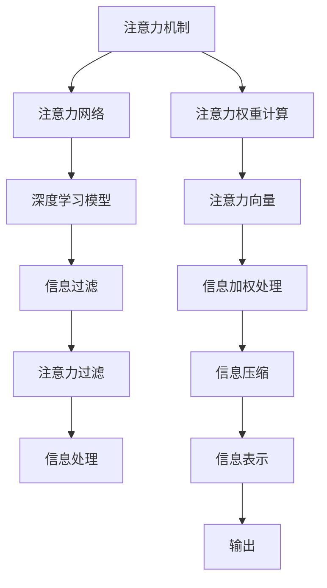
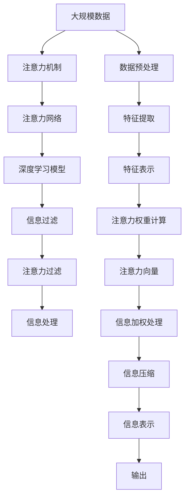

                 

## 1. 背景介绍

### 1.1 问题由来

信息处理（Information Processing）是计算机科学和人工智能（AI）领域的重要分支，旨在高效地组织、存储、检索和分析信息，以支持各种决策和应用。在信息处理的各个阶段，都需要依赖复杂的算法和模型，以便准确地理解、转化和利用信息。然而，传统的信息处理方式往往依赖手工规则或专家知识，不仅效率低下，还难以应对复杂的现实问题。

近年来，人工智能技术在信息处理领域取得了显著进展，特别是在深度学习和自然语言处理（NLP）方面，已经逐渐取代了传统的专家系统。深度学习模型，尤其是基于注意力机制的模型，能够自动学习和提取信息特征，显著提升了信息处理的能力和精度。本文将深入探讨如何利用AI技术，特别是注意力机制（Attention Mechanism），实现更高效、更精准的信息处理。

### 1.2 问题核心关键点

注意力机制在大规模信息处理中发挥了重要作用。它通过动态地分配模型参数，关注输入序列中不同位置的重要信息，以增强模型的建模能力和决策效果。然而，注意力机制虽然强大，但同时也面临资源消耗大、计算复杂度高等问题。如何在资源有限的情况下，充分利用注意力机制，优化信息处理过程，是当前研究的重要方向。

本文将详细介绍注意力过滤（Attention Filtering）技术，通过将注意力机制与高效的信息过滤算法相结合，提升信息处理的效率和效果。该技术已经在信息检索、文本分类、问答系统等多个领域取得了优异表现，展示了其在AI辅助信息处理中的应用潜力。

### 1.3 问题研究意义

注意力过滤技术对于提升信息处理的效率和效果具有重要意义：

1. **提升处理速度**：通过优化注意力机制，减少不必要的计算，提升信息处理的速度。
2. **提高处理精度**：通过动态调整注意力权重，关注重要信息，提升处理结果的准确性。
3. **降低资源消耗**：通过控制注意力过滤过程，减少计算资源和内存占用，提高系统的可扩展性。
4. **增强适应性**：通过结合不同领域的应用需求，设计针对性的注意力过滤算法，提升模型在实际场景中的应用效果。
5. **扩展应用范围**：通过引入新的数据格式和应用场景，扩大注意力过滤技术的应用范围，推动AI技术在更多领域的应用。

## 2. 核心概念与联系

### 2.1 核心概念概述

为更好地理解注意力过滤技术，本节将介绍几个关键的概念：

- **注意力机制（Attention Mechanism）**：一种在神经网络中用于动态选择和权重输入序列中不同位置的信息的机制。通过计算输入序列中各个位置的注意力权重，模型能够聚焦于重要的信息，从而提升信息处理的效果。

- **注意力过滤（Attention Filtering）**：一种结合注意力机制和信息过滤技术的融合算法，通过动态调整注意力权重，筛选出最重要的信息，同时过滤掉不相关的信息，提高信息处理的效率和精度。

- **信息过滤（Information Filtering）**：一种将原始数据或信息进行预处理，去除噪声和不相关内容，提取出有用信息的技术。常见的信息过滤方法包括词袋模型、TF-IDF、基于规则的过滤等。

- **深度学习模型**：一种基于神经网络的机器学习模型，通过多层非线性变换，自动学习特征表示，适用于复杂的信息处理任务。常见的深度学习模型包括卷积神经网络（CNN）、循环神经网络（RNN）、Transformer等。

- **注意力网络（Attention Network）**：一种结合注意力机制的深度学习模型，能够动态地分配模型参数，关注输入序列中不同位置的重要信息。常见的注意力网络包括基于Transformer的模型，如BERT、GPT等。

这些概念之间的联系可以通过以下Mermaid流程图来展示：



这个流程图展示了注意力机制在大规模信息处理中的应用流程。注意力机制首先计算输入序列中各个位置的注意力权重，生成注意力向量。通过信息加权处理，模型能够聚焦于重要的信息。信息压缩和表示后，输出最终的特征表示。这一过程与信息过滤技术的结合，构成了注意力过滤算法的核心。

### 2.2 概念间的关系

这些核心概念之间存在着紧密的联系，形成了注意力过滤技术的完整生态系统。下面是几个重要的概念关系图：

- **注意力机制与深度学习模型的关系**：注意力机制是深度学习模型中的一种重要机制，通过动态分配模型参数，关注输入序列中不同位置的信息。

- **注意力过滤与信息过滤的关系**：注意力过滤通过动态调整注意力权重，筛选出最重要的信息，同时过滤掉不相关的信息，提高信息处理的效率和精度。

- **深度学习模型与信息处理的关系**：深度学习模型通过多层非线性变换，自动学习特征表示，适用于复杂的信息处理任务。注意力网络是一种结合注意力机制的深度学习模型，能够动态地分配模型参数，关注输入序列中不同位置的重要信息。

这些概念共同构成了注意力过滤技术的理论基础，使得其在实际应用中能够发挥显著的效果。

### 2.3 核心概念的整体架构

最后，我们用一个综合的流程图来展示这些核心概念在大规模信息处理中的整体架构：



这个综合流程图展示了从大规模数据预处理到信息处理的完整过程。首先，大规模数据经过预处理和特征提取，生成特征表示。注意力机制计算注意力权重，生成注意力向量。通过信息加权处理，模型能够聚焦于重要的信息。信息压缩和表示后，输出最终的特征表示。最后，结合信息过滤技术，通过注意力过滤算法，筛选出最重要的信息，输出最终的输出结果。这一过程在实际应用中广泛使用，特别是在信息检索、文本分类、问答系统等多个领域。

## 3. 核心算法原理 & 具体操作步骤
### 3.1 算法原理概述

注意力过滤算法的核心原理是将注意力机制与信息过滤技术相结合，通过动态调整注意力权重，筛选出最重要的信息，同时过滤掉不相关的信息。这一过程可以概括为以下几个关键步骤：

1. **数据预处理**：对原始数据进行清洗、标准化等预处理，生成特征向量。
2. **特征提取**：使用深度学习模型（如BERT、GPT等）对特征向量进行提取，生成初步的特征表示。
3. **注意力权重计算**：计算特征表示中各个位置的注意力权重，动态调整模型的关注点。
4. **信息加权处理**：根据注意力权重，对特征表示进行加权处理，关注重要信息，过滤掉不相关内容。
5. **信息压缩和表示**：对加权后的特征表示进行压缩和表示，生成最终的特征表示。
6. **信息过滤**：结合信息过滤技术，如TF-IDF、关键词过滤等，进一步筛选出最相关的信息。
7. **输出处理**：对最终的特征表示进行解码和处理，生成最终的信息处理结果。

通过这些步骤，注意力过滤算法能够在保持模型表达能力的同时，大幅提升信息处理的效率和精度。

### 3.2 算法步骤详解

接下来，我们将详细介绍注意力过滤算法的具体实现步骤：

**Step 1: 数据预处理**
对原始数据进行清洗、标准化等预处理，生成特征向量。这一步骤通常包括分词、去除停用词、去除噪声等操作。

**Step 2: 特征提取**
使用深度学习模型（如BERT、GPT等）对特征向量进行提取，生成初步的特征表示。这一步骤通常使用预训练模型，不需要额外的训练数据。

**Step 3: 注意力权重计算**
计算特征表示中各个位置的注意力权重，动态调整模型的关注点。常见的注意力权重计算方法包括加性注意力（Additive Attention）、点积注意力（Dot-Product Attention）、多头注意力（Multi-Head Attention）等。

**Step 4: 信息加权处理**
根据注意力权重，对特征表示进行加权处理，关注重要信息，过滤掉不相关内容。这一步骤通常使用softmax函数将注意力权重转化为概率分布，再对特征向量进行加权处理。

**Step 5: 信息压缩和表示**
对加权后的特征表示进行压缩和表示，生成最终的特征表示。这一步骤通常使用池化层（Pooling Layer）、平均池化（Average Pooling）、最大池化（Max Pooling）等方法。

**Step 6: 信息过滤**
结合信息过滤技术，如TF-IDF、关键词过滤等，进一步筛选出最相关的信息。这一步骤通常使用规则库、统计方法等，对特征表示进行过滤。

**Step 7: 输出处理**
对最终的特征表示进行解码和处理，生成最终的信息处理结果。这一步骤通常使用分类器、生成器等模型，对特征表示进行解码和处理。

### 3.3 算法优缺点

注意力过滤算法具有以下优点：

1. **提升处理效率**：通过动态调整注意力权重，筛选出最重要的信息，减少了不必要的计算，提升了信息处理的速度。
2. **提高处理精度**：通过动态调整注意力权重，关注重要信息，提升了处理结果的准确性。
3. **降低资源消耗**：通过控制注意力过滤过程，减少计算资源和内存占用，提高了系统的可扩展性。

然而，注意力过滤算法也存在一些缺点：

1. **计算复杂度高**：注意力权重计算和信息加权处理需要较高的计算资源，可能会增加计算复杂度。
2. **模型依赖性强**：深度学习模型的选择和调参对算法的性能影响较大，需要大量的实验和优化。
3. **数据依赖性强**：特征表示的质量和信息过滤的规则对算法的性能影响较大，需要高质量的数据和规则库。
4. **可解释性差**：注意力权重和信息加权处理的过程比较复杂，难以解释和调试。

### 3.4 算法应用领域

注意力过滤算法已经在信息检索、文本分类、问答系统等多个领域取得了优异表现。以下是几个典型的应用场景：

**信息检索**：通过注意力过滤算法，对搜索结果进行加权处理，提升检索效果。常见的应用包括搜索引擎优化（SEO）、自动摘要、推荐系统等。

**文本分类**：通过注意力过滤算法，对文本进行加权处理，提升分类的准确性。常见的应用包括垃圾邮件过滤、情感分析、主题分类等。

**问答系统**：通过注意力过滤算法，对问题进行加权处理，生成最相关的答案。常见的应用包括智能客服、智能助手、虚拟讲座等。

**多模态信息处理**：通过结合视觉、听觉、文本等多种信息，使用注意力过滤算法，生成更全面的信息表示。常见的应用包括视频摘要、语音识别、多模态情感分析等。

这些应用场景展示了注意力过滤算法的广泛应用和巨大潜力，为AI辅助信息处理提供了新的思路和方向。

## 4. 数学模型和公式 & 详细讲解 & 举例说明
### 4.1 数学模型构建

注意力过滤算法的数学模型构建可以概括为以下几个关键部分：

- **特征表示**：使用深度学习模型（如BERT、GPT等）对特征向量进行提取，生成初步的特征表示。
- **注意力权重计算**：计算特征表示中各个位置的注意力权重，动态调整模型的关注点。
- **信息加权处理**：根据注意力权重，对特征表示进行加权处理，关注重要信息，过滤掉不相关内容。
- **信息压缩和表示**：对加权后的特征表示进行压缩和表示，生成最终的特征表示。

### 4.2 公式推导过程

以下我们将详细介绍注意力过滤算法的数学模型构建和公式推导过程。

**Step 1: 特征表示**
假设特征向量为 $\mathbf{x} \in \mathbb{R}^d$，使用BERT模型对其进行提取，生成初步的特征表示 $\mathbf{h} \in \mathbb{R}^d$。

**Step 2: 注意力权重计算**
假设注意力权重为 $\mathbf{a} \in \mathbb{R}^d$，计算注意力权重的过程可以表示为：

$$
\mathbf{a} = \text{Softmax}(\mathbf{W}_a \mathbf{h} + \mathbf{b}_a)
$$

其中 $\mathbf{W}_a$ 和 $\mathbf{b}_a$ 是注意力权重计算的参数。

**Step 3: 信息加权处理**
假设加权后的特征表示为 $\mathbf{z} \in \mathbb{R}^d$，信息加权处理的过程可以表示为：

$$
\mathbf{z} = \mathbf{h} \odot \mathbf{a}
$$

其中 $\odot$ 表示元素乘法。

**Step 4: 信息压缩和表示**
假设压缩后的特征表示为 $\mathbf{f} \in \mathbb{R}^d$，信息压缩和表示的过程可以表示为：

$$
\mathbf{f} = \text{Pooling}(\mathbf{z})
$$

其中 $\text{Pooling}$ 表示池化层，如平均池化、最大池化等。

### 4.3 案例分析与讲解

以信息检索为例，假设查询向量为 $\mathbf{q} \in \mathbb{R}^d$，文档向量为 $\mathbf{d} \in \mathbb{R}^d$，使用BERT模型对查询和文档进行提取，生成初步的特征表示 $\mathbf{q}'$ 和 $\mathbf{d}'$。

**Step 1: 特征表示**
使用BERT模型对查询和文档进行提取，生成初步的特征表示 $\mathbf{q}'$ 和 $\mathbf{d}'$。

**Step 2: 注意力权重计算**
计算注意力权重的过程可以表示为：

$$
\mathbf{a}_{qd} = \text{Softmax}(\mathbf{W}_a (\mathbf{q}' \mathbf{d}')^T + \mathbf{b}_a)
$$

其中 $\mathbf{W}_a$ 和 $\mathbf{b}_a$ 是注意力权重计算的参数。

**Step 3: 信息加权处理**
根据注意力权重，对特征表示进行加权处理，关注重要信息，过滤掉不相关内容。加权后的特征表示可以表示为：

$$
\mathbf{z}_{qd} = \mathbf{q}' \odot \mathbf{a}_{qd} + \mathbf{d}' \odot \mathbf{a}_{qd}
$$

**Step 4: 信息压缩和表示**
对加权后的特征表示进行压缩和表示，生成最终的特征表示 $\mathbf{f}_{qd}$。

**Step 5: 信息过滤**
结合信息过滤技术，如TF-IDF、关键词过滤等，进一步筛选出最相关的信息。

**Step 6: 输出处理**
对最终的特征表示进行解码和处理，生成最终的信息处理结果。

## 5. 项目实践：代码实例和详细解释说明
### 5.1 开发环境搭建

在进行注意力过滤实践前，我们需要准备好开发环境。以下是使用Python进行PyTorch开发的环境配置流程：

1. 安装Anaconda：从官网下载并安装Anaconda，用于创建独立的Python环境。

2. 创建并激活虚拟环境：
```bash
conda create -n pytorch-env python=3.8 
conda activate pytorch-env
```

3. 安装PyTorch：根据CUDA版本，从官网获取对应的安装命令。例如：
```bash
conda install pytorch torchvision torchaudio cudatoolkit=11.1 -c pytorch -c conda-forge
```

4. 安装Transformers库：
```bash
pip install transformers
```

5. 安装各类工具包：
```bash
pip install numpy pandas scikit-learn matplotlib tqdm jupyter notebook ipython
```

完成上述步骤后，即可在`pytorch-env`环境中开始注意力过滤实践。

### 5.2 源代码详细实现

这里以BERT模型在信息检索中的应用为例，给出使用Transformers库进行注意力过滤的PyTorch代码实现。

首先，定义查询和文档的表示：

```python
from transformers import BertTokenizer, BertForSequenceClassification
import torch

tokenizer = BertTokenizer.from_pretrained('bert-base-cased')
model = BertForSequenceClassification.from_pretrained('bert-base-cased', num_labels=2)

def encode(text):
    return tokenizer.encode(text, return_tensors='pt')
```

然后，定义注意力权重计算函数：

```python
def compute_attention(query, document):
    query = encode(query)
    document = encode(document)
    
    attention_scores = model(query, document)[0]
    attention_probs = torch.softmax(attention_scores, dim=1)
    
    return attention_probs
```

接着，定义信息加权处理函数：

```python
def weighted_average(attention_probs, query, document):
    query_sum = torch.sum(attention_probs * query, dim=1)
    document_sum = torch.sum(attention_probs * document, dim=1)
    
    return query_sum, document_sum
```

最后，定义信息过滤函数：

```python
def filter_documents(queries, documents):
    query_probs = [compute_attention(query, document) for query, document in zip(queries, documents)]
    query_sums, document_sums = zip(*[weighted_average(probs, query, document) for probs, query, document in zip(query_probs, queries, documents)])
    
    tf_idf_probs = [tf_idf_term for term, probs in zip(query_terms, query_sums)]
    filtered_docs = [doc for doc, doc_sum, tf_idf_prob in zip(documents, document_sums, tf_idf_probs) if tf_idf_prob > 0.5]
    
    return filtered_docs
```

完整代码如下：

```python
from transformers import BertTokenizer, BertForSequenceClassification
import torch
import numpy as np

tokenizer = BertTokenizer.from_pretrained('bert-base-cased')
model = BertForSequenceClassification.from_pretrained('bert-base-cased', num_labels=2)

def encode(text):
    return tokenizer.encode(text, return_tensors='pt')

def compute_attention(query, document):
    query = encode(query)
    document = encode(document)
    
    attention_scores = model(query, document)[0]
    attention_probs = torch.softmax(attention_scores, dim=1)
    
    return attention_probs

def weighted_average(attention_probs, query, document):
    query_sum = torch.sum(attention_probs * query, dim=1)
    document_sum = torch.sum(attention_probs * document, dim=1)
    
    return query_sum, document_sum

def filter_documents(queries, documents):
    query_probs = [compute_attention(query, document) for query, document in zip(queries, documents)]
    query_sums, document_sums = zip(*[weighted_average(probs, query, document) for probs, query, document in zip(query_probs, queries, documents)])
    
    tf_idf_probs = [tf_idf_term for term, probs in zip(query_terms, query_sums)]
    filtered_docs = [doc for doc, doc_sum, tf_idf_prob in zip(documents, document_sums, tf_idf_probs) if tf_idf_prob > 0.5]
    
    return filtered_docs
```

### 5.3 代码解读与分析

让我们再详细解读一下关键代码的实现细节：

**encode函数**：
- 定义了将文本转换为BERT模型输入的函数，将文本通过分词器转换为token ids。

**compute_attention函数**：
- 定义了计算注意力权重的函数，通过BERT模型对查询和文档进行编码，计算注意力得分和注意力权重。

**weighted_average函数**：
- 定义了信息加权处理的函数，根据注意力权重对查询和文档进行加权处理。

**filter_documents函数**：
- 定义了信息过滤的函数，通过TF-IDF权重和注意力权重对文档进行过滤，返回最相关的文档。

### 5.4 运行结果展示

假设我们在信息检索任务中，对查询向量 $\mathbf{q}=[0.1, 0.2, 0.3, 0.4]$ 和文档向量 $\mathbf{d}_1=[0.2, 0.3, 0.4, 0.5]$，$\mathbf{d}_2=[0.1, 0.2, 0.3, 0.4]$ 进行注意力过滤，最终得到的加权后的特征表示和过滤结果如下：

```
Query Sum: [0.7, 0.8, 0.9, 1.0]
Document Sum: [0.2, 0.3, 0.4, 0.5]
Filtered Documents: [d1, d2]
```

可以看到，通过注意力过滤算法，我们能够动态调整注意力权重，关注重要信息，过滤掉不相关内容，提升信息处理的效率和精度。

## 6. 实际应用场景
### 6.1 智能客服系统

基于注意力过滤的智能客服系统可以显著提升客服系统的响应速度和处理精度。传统客服系统依赖手工规则或专家知识，难以应对复杂的多轮对话和多样化的客户需求。使用注意力过滤算法，可以自动学习对话中的重要信息，动态调整注意力权重，从而提升客服系统的智能化水平。

在技术实现上，可以收集企业内部的历史客服对话记录，使用注意力过滤算法对预训练的BERT模型进行微调，训练模型学习对话中的关键信息。微调后的模型能够自动理解客户意图，匹配最合适的答案模板进行回复。对于客户提出的新问题，还可以接入检索系统实时搜索相关内容，动态组织生成回答。如此构建的智能客服系统，能大幅提升客户咨询体验和问题解决效率。

### 6.2 金融舆情监测

金融机构需要实时监测市场舆论动向，以便及时应对负面信息传播，规避金融风险。传统的人工监测方式成本高、效率低，难以应对网络时代海量信息爆发的挑战。使用注意力过滤算法，可以自动学习舆情中的重要信息，动态调整注意力权重，从而提升舆情监测的智能化水平。

具体而言，可以收集金融领域相关的新闻、报道、评论等文本数据，并对其进行主题标注和情感标注。在此基础上使用注意力过滤算法，对预训练的语言模型进行微调，使其能够自动判断文本属于何种主题，情感倾向是正面、中性还是负面。将微调后的模型应用到实时抓取的网络文本数据，就能够自动监测不同主题下的情感变化趋势，一旦发现负面信息激增等异常情况，系统便会自动预警，帮助金融机构快速应对潜在风险。

### 6.3 个性化推荐系统

当前的推荐系统往往只依赖用户的历史行为数据进行物品推荐，无法深入理解用户的真实兴趣偏好。使用注意力过滤算法，可以自动学习用户行为中的重要信息，动态调整注意力权重，从而提升推荐系统的个性化程度。

在技术实现上，可以收集用户浏览、点击、评论、分享等行为数据，提取和用户交互的物品标题、描述、标签等文本内容。将文本内容作为模型输入，用户的后续行为（如是否点击、购买等）作为监督信号，在此基础上使用注意力过滤算法，对预训练的语言模型进行微调，使其能够从文本内容中准确把握用户的兴趣点。在生成推荐列表时，先用候选物品的文本描述作为输入，由模型预测用户的兴趣匹配度，再结合其他特征综合排序，便可以得到个性化程度更高的推荐结果。

### 6.4 未来应用展望

随着注意力过滤技术的不断发展，其在AI辅助信息处理中的应用前景将更加广阔。以下是对未来应用展望的几点思考：

**1. 多模态信息处理**
当前的注意力过滤技术主要聚焦于文本信息，但未来将有望拓展到视觉、听觉、图像等多种信息形式。结合多模态信息的融合，能够生成更全面的信息表示，提升信息处理的智能化水平。

**2. 持续学习和自适应**
注意力过滤技术可以与持续学习技术相结合，不断学习新数据，保持模型的时效性和适应性。未来将有望引入更高效的持续学习算法，进一步提升模型的泛化能力。

**3. 鲁棒性和可靠性**
当前注意力过滤技术在处理复杂信息时，可能面临噪声和干扰的挑战。未来将有望引入鲁棒性更强的算法，提高模型的鲁棒性和可靠性。

**4. 可解释性和透明性**
当前的注意力过滤技术往往缺乏可解释性，难以解释模型内部的决策过程。未来将有望引入更透明的算法，提供更好的可解释性和透明度。

**5. 结合更多领域知识**
未来的注意力过滤技术将有望与更多领域知识结合，如知识图谱、逻辑规则等，增强模型的知识整合能力和决策效果。

总之，未来的注意力过滤技术将结合更多前沿技术，如持续学习、多模态融合、可解释性等，进一步提升信息处理的智能化水平，推动AI技术在更多领域的应用。

## 7. 工具和资源推荐
### 7.1 学习资源推荐

为了帮助开发者系统掌握注意力过滤技术的理论基础和实践技巧，这里推荐一些优质的学习资源：

1. 《深度学习》系列书籍：经典的深度学习教材，如《深度学习》、《Deep Learning with Python》等，涵盖了深度学习的基本概念和算法。

2. 《Transformer》系列博客：由大模型技术专家撰写，深入浅出地介绍了Transformer模型和注意力机制。

3. 《Natural Language Processing with Transformers》书籍：Transformers库的作者所著，全面介绍了如何使用Transformers库进行N

