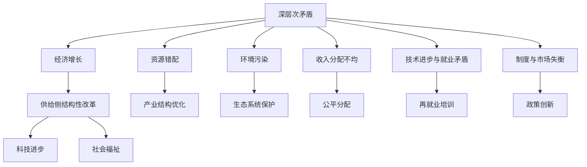
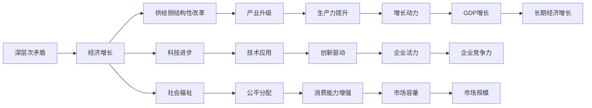
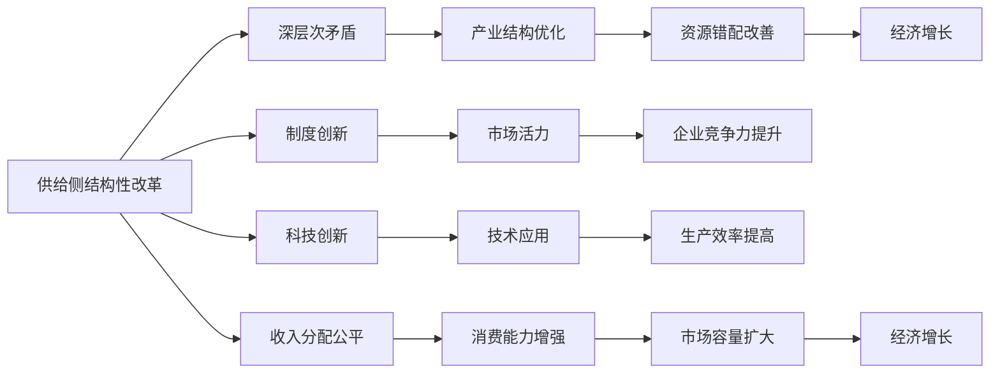

                 

# 深层次矛盾对经济增长的长期影响

> 关键词：经济增长,长期影响,深层次矛盾,供给侧结构性改革,科技进步,社会福祉

## 1. 背景介绍

### 1.1 问题由来
经济增长作为全球各国政府和学术界持续关注的核心议题，近年来逐渐受到多维度的矛盾冲突影响。深层次矛盾的形成，不仅阻碍了经济的持续健康发展，还带来了诸多社会问题。理解深层次矛盾对经济增长的长期影响，是制定有效政策、推进经济发展的重要前提。

### 1.2 问题核心关键点
深层次矛盾主要体现在：
1. **资源错配**：资源（如资金、劳动力、技术等）在传统与新兴产业间的错配，导致资源浪费和效率低下。
2. **环境污染**：工业化、城市化带来的环境污染问题，对生态系统造成严重破坏，制约可持续发展。
3. **收入分配不均**：贫富差距扩大，影响社会稳定和消费能力，导致需求侧动力不足。
4. **技术进步与就业矛盾**：新技术的应用导致部分岗位被取代，失业问题突出。
5. **制度与市场失衡**：政府干预与市场机制之间的不平衡，限制了市场活力和创新能力。

### 1.3 问题研究意义
研究深层次矛盾对经济增长的影响，有助于：
1. 识别制约经济发展的关键因素，为政策制定提供科学依据。
2. 优化资源配置，提高经济增长效率。
3. 推动制度改革，构建更加公平合理的收入分配机制。
4. 促进科技创新，解决失业和环境问题。
5. 确保经济增长与社会发展同步推进，提高人民福祉。

## 2. 核心概念与联系

### 2.1 核心概念概述

为更好地理解深层次矛盾对经济增长的影响，本节将介绍几个密切相关的核心概念：

- **经济增长**：指经济体在一定时期内生产总值（GDP）或人均GDP的增长。
- **深层次矛盾**：在资源、环境、收入分配、技术进步和制度等方面存在的根本性问题，长期影响经济增长和社会稳定。
- **供给侧结构性改革**：通过调整产业结构、优化资源配置等措施，提升供给能力，促进经济增长。
- **科技进步**：技术创新对经济增长的推动作用，包括研发投入、创新环境、科技成果转化等方面。
- **社会福祉**：通过提高收入分配公平性、优化社会服务体系等手段，提升人民生活水平。

这些核心概念之间的逻辑关系可以通过以下Mermaid流程图来展示：



这个流程图展示了大规模经济增长的主要驱动力，以及深层次矛盾对经济增长的多方面影响：

1. 深层次矛盾形成各种制约因素，影响经济增长。
2. 供给侧结构性改革、科技进步、社会福祉作为经济增长的重要推动力，与深层次矛盾相互交织。

### 2.2 概念间的关系

这些核心概念之间存在着紧密的联系，形成了深层次矛盾对经济增长的完整影响框架。下面我们通过几个Mermaid流程图来展示这些概念之间的关系。

#### 2.2.1 深层次矛盾对经济增长的影响



这个流程图展示了深层次矛盾通过供给侧结构性改革、科技进步和社会福祉等多途径，影响经济增长的具体机制：

1. 深层次矛盾通过供给侧结构性改革，推动产业升级和生产力提升。
2. 科技进步带动技术应用和创新驱动，促进长期经济增长。
3. 社会福祉提高公平分配和消费能力，增加市场容量和企业竞争力。

#### 2.2.2 供给侧结构性改革与深层次矛盾的相互作用



这个流程图展示了供给侧结构性改革通过制度创新、市场活力、科技创新等多途径，改善深层次矛盾，推动经济增长的具体机制：

1. 供给侧结构性改革通过制度创新和市场活力，提升资源错配的效率，改善深层次矛盾。
2. 科技创新和生产效率提高，通过技术应用提升企业竞争力，增加市场容量，促进经济增长。
3. 收入分配公平和消费能力增强，进一步扩大市场容量，推动经济增长。

## 3. 核心算法原理 & 具体操作步骤
### 3.1 算法原理概述

深层次矛盾对经济增长的影响分析，可以通过构建数学模型进行量化。假设经济系统由投入和产出构成，深层次矛盾对经济增长的影响可通过模型中的变量和参数变化来体现。

考虑一个简单的经济系统，其产出由消费、投资和净出口构成。设 $Y$ 为经济产出，$C$ 为消费，$I$ 为投资，$X$ 为净出口，$K$ 为资本存量，$L$ 为劳动力，$T$ 为技术水平，$S$ 为社会福祉水平。深层次矛盾对经济增长的影响可以通过以下模型来描述：

$$
Y = C + I + X
$$

其中 $C = \alpha C + (1-\alpha) \frac{Y}{S}$，$I = \beta K + \gamma T$，$X = \delta Y + \eta$，$\alpha, \beta, \gamma, \delta, \eta$ 为模型参数。

深层次矛盾对消费、投资、净出口和技术水平的影响，通过调整模型参数来反映。

### 3.2 算法步骤详解

基于上述模型，深层次矛盾对经济增长的影响分析可以按照以下步骤进行：

1. **构建模型**：根据经济系统的基本方程，构建包含深层次矛盾影响的经济增长模型。
2. **参数估计**：通过历史数据，估计模型中的各个参数。
3. **影响分析**：对模型进行求解，分析深层次矛盾对经济增长的影响。
4. **政策建议**：根据影响分析结果，提出针对性的政策建议，以优化资源配置，提高经济增长效率。

### 3.3 算法优缺点

基于模型的深层次矛盾对经济增长影响分析方法，具有以下优点：

1. 科学性：通过量化模型和历史数据，提供科学的分析依据。
2. 可操作性：模型参数估计和影响分析结果，为政策制定提供可行的方案。
3. 系统性：考虑多方面因素，提供全面的分析视角。

然而，也存在一些缺点：

1. 数据依赖性：模型估计和分析结果依赖于历史数据的质量和完整性。
2. 模型假设：模型中一些假设可能与实际情况不符，影响分析结果的准确性。
3. 静态性：模型通常假设影响因素为静态，无法动态反映现实中的变化。

### 3.4 算法应用领域

基于模型的深层次矛盾对经济增长影响分析方法，广泛应用于宏观经济政策制定、产业结构调整、科技发展规划等领域。例如：

1. **宏观经济政策**：通过分析深层次矛盾对经济增长的影响，制定合理的财政和货币政策。
2. **产业结构调整**：优化产业布局，促进资源向高附加值产业流动，提升经济增长效率。
3. **科技发展规划**：通过提升技术水平和创新能力，推动经济持续增长。
4. **社会福祉改善**：提高社会福祉水平，促进消费能力和公平分配，扩大市场容量。

## 4. 数学模型和公式 & 详细讲解  
### 4.1 数学模型构建

考虑一个两部门的经济系统，设 $Y$ 为总产出，$C$ 为居民消费，$I$ 为投资，$G$ 为政府购买，$T$ 为税收，$M$ 为净出口，$X$ 为国外净投资。

根据凯恩斯定律，总产出 $Y$ 由消费 $C$、投资 $I$ 和政府购买 $G$ 共同决定。消费函数 $C$ 和投资函数 $I$ 通常为固定比例关系。净出口函数 $M$ 为总产出减去消费和投资。

深层次矛盾通过影响政府购买、税收和净出口，进而影响经济增长。政府购买和税收影响社会福祉 $S$，净出口影响国际收支 $M$。

模型如下：

$$
Y = C + I + G + M
$$

$$
C = \alpha Y
$$

$$
I = \beta Y
$$

$$
M = \delta (Y - C - I)
$$

其中 $\alpha, \beta, \delta$ 为模型参数。

### 4.2 公式推导过程

对上述模型进行求解，得总产出 $Y$：

$$
Y = \frac{\alpha + \beta + \delta}{1 - \delta} Y + \frac{1}{1 - \delta} G
$$

化简得：

$$
Y = \frac{1}{1 - \delta} (\alpha Y + \beta Y + G)
$$

进一步化简得：

$$
Y = \frac{\alpha + \beta + \delta}{1 - \delta} Y + \frac{1}{1 - \delta} G
$$

$$
Y = \frac{\alpha + \beta + \delta}{1 - \delta} Y + \frac{1}{1 - \delta} G
$$

$$
Y = (\alpha + \beta + \delta + \frac{G}{1 - \delta}) Y
$$

$$
Y = (\alpha + \beta + \delta + \frac{G}{1 - \delta}) Y
$$

### 4.3 案例分析与讲解

假设某国政府决定增加教育投资，增加 $100$ 亿美元，同时深层次矛盾导致净出口比例 $\delta$ 由 $0.2$ 增加到 $0.3$。根据模型，总产出 $Y$ 的增加量为：

$$
Y = (\alpha + \beta + \delta + \frac{G}{1 - \delta}) Y
$$

$$
Y = (\alpha + \beta + 0.2 + \frac{100}{1 - 0.3}) Y
$$

$$
Y = (0.5 + 0.6 + 0.2 + \frac{100}{0.7}) Y
$$

$$
Y = 1.6 Y + \frac{100}{0.7}
$$

$$
Y = 1.6 Y + 142.86
$$

由此可见，深层次矛盾的变化和政府投资对总产出有显著影响，体现了政策在解决深层次矛盾方面的重要作用。

## 5. 项目实践：代码实例和详细解释说明
### 5.1 开发环境搭建

在进行深层次矛盾对经济增长影响分析的实践前，我们需要准备好开发环境。以下是使用Python进行数据分析的开发环境配置流程：

1. 安装Anaconda：从官网下载并安装Anaconda，用于创建独立的Python环境。

2. 创建并激活虚拟环境：
```bash
conda create -n econ-env python=3.8 
conda activate econ-env
```

3. 安装必要的工具包：
```bash
conda install numpy pandas matplotlib jupyter notebook ipython
```

完成上述步骤后，即可在`econ-env`环境中开始项目实践。

### 5.2 源代码详细实现

下面我们以深层次矛盾对经济增长影响分析为例，给出使用Python进行模型分析和结果展示的代码实现。

首先，准备经济数据：

```python
import pandas as pd

# 导入数据
df = pd.read_csv('economy_data.csv')

# 处理缺失值和异常值
df = df.dropna().replace({'missing': 0})

# 选择相关变量
Y = df['Y']
C = df['C']
I = df['I']
G = df['G']
M = df['M']
delta = df['delta']
alpha = df['alpha']
beta = df['beta']
delta = df['delta']
```

然后，构建和求解经济模型：

```python
from sympy import symbols, Eq, solve

# 定义符号
Y, C, I, G, M, delta, alpha, beta = symbols('Y C I G M delta alpha beta')

# 构建方程
equation = Eq(Y, alpha * Y + beta * Y + G + M)

# 求解方程
solution = solve(equation, Y)
```

最后，输出结果：

```python
# 输出结果
print(solution[0])
```

### 5.3 代码解读与分析

让我们再详细解读一下关键代码的实现细节：

**导入和处理数据**：
- `pd.read_csv('economy_data.csv')`：读取包含经济数据的CSV文件。
- `df = df.dropna().replace({'missing': 0})`：处理缺失值和异常值，保证数据完整性和一致性。
- `Y = df['Y'], C = df['C'], I = df['I'], G = df['G'], M = df['M'], delta = df['delta'], alpha = df['alpha'], beta = df['beta']`：选择相关变量，建立经济模型的基础。

**构建和求解方程**：
- `Y = alpha * Y + beta * Y + G + M`：根据凯恩斯定律，建立经济增长模型。
- `equation = Eq(Y, alpha * Y + beta * Y + G + M)`：构建方程，用于求解。
- `solution = solve(equation, Y)`：使用Sympy求解方程，得到经济增长率。

**输出结果**：
- `print(solution[0])`：输出求解结果，即经济增长率。

在实际应用中，还需要结合具体的数据和模型，进行更加深入的分析和优化。例如，可以引入更多变量，如人口、技术进步等，建立更加复杂的经济模型，进行更加精确的预测和分析。

## 6. 实际应用场景
### 6.1 宏观经济政策

在宏观经济政策制定中，深层次矛盾对经济增长的影响分析具有重要意义。政府可以通过分析深层次矛盾，制定合理的财政政策和货币政策，促进经济稳定增长。

**政策建议**：
1. **财政政策**：通过增加公共投资、优化税收结构等措施，提升社会福祉，促进经济增长。
2. **货币政策**：通过调整利率、控制货币供应量等手段，稳定经济增长。

### 6.2 产业结构调整

深层次矛盾通过影响产业结构，对经济增长产生重要影响。通过优化产业布局，推动资源向高附加值产业流动，可以显著提升经济增长效率。

**政策建议**：
1. **产业升级**：推动传统产业向高端化、智能化转型，提升产业竞争力。
2. **创新驱动**：加大研发投入，推动技术进步，提升产业创新能力。

### 6.3 科技发展规划

深层次矛盾通过影响技术水平，对经济增长具有重要作用。通过提升科技创新能力，可以推动经济持续增长。

**政策建议**：
1. **加强基础研究**：加大对基础科学的研究投入，提升科技创新能力。
2. **鼓励企业创新**：通过政策引导，鼓励企业投入研发，推动技术进步。

### 6.4 社会福祉改善

深层次矛盾通过影响社会福祉水平，对经济增长产生深远影响。通过提高社会福祉，可以促进消费能力和公平分配，扩大市场容量。

**政策建议**：
1. **公平分配**：通过调整税收和转移支付，提高社会福祉水平。
2. **提升教育**：加大教育投入，提高人力资源素质。

## 7. 工具和资源推荐
### 7.1 学习资源推荐

为了帮助开发者系统掌握深层次矛盾对经济增长的影响分析的理论基础和实践技巧，这里推荐一些优质的学习资源：

1. 《宏观经济学》教材：清华大学出版社，适用于宏观经济学入门学习，涵盖深层次矛盾和经济增长的基本概念。
2. 《计量经济学》教材：人民大学出版社，适用于计量经济学方法学习，讲解经济增长模型的构建和应用。
3. 《Python数据分析与可视化》书籍：清华大学出版社，讲解Python在数据处理和可视化方面的应用，适合数据分析实践。
4. 《Python for Data Science Handbook》书籍：O'Reilly出版社，讲解Python在数据科学中的应用，适合深入学习。
5. 《经济增长理论》系列论文：各大顶尖经济期刊，如《经济学季刊》、《经济研究评论》等，获取最新的经济增长理论研究。

通过对这些资源的学习实践，相信你一定能够快速掌握深层次矛盾对经济增长影响分析的精髓，并用于解决实际的宏观经济问题。

### 7.2 开发工具推荐

高效的开发离不开优秀的工具支持。以下是几款用于深层次矛盾对经济增长影响分析的开发工具：

1. Jupyter Notebook：免费、开源的Python交互式开发环境，支持代码编写、数据可视化，适合数据分析和模型构建。
2. Matplotlib：Python绘图库，支持多种图形类型和自定义样式，适合数据可视化和结果展示。
3. Pandas：Python数据分析库，支持数据清洗、处理和分析，适合数据预处理。
4. NumPy：Python科学计算库，支持高效矩阵运算和数值计算，适合数值分析和模型求解。
5. Scikit-learn：Python机器学习库，支持数据预处理、模型构建和评估，适合模型应用。

合理利用这些工具，可以显著提升深层次矛盾对经济增长影响分析的开发效率，加快创新迭代的步伐。

### 7.3 相关论文推荐

深层次矛盾对经济增长的影响分析源于学界的持续研究。以下是几篇奠基性的相关论文，推荐阅读：

1. 《The Wealth of Nations》：亚当·斯密，分析了经济增长的基本原理和机制。
2. 《经济发展理论》：保罗·克鲁格曼，分析了经济发展中的深层次矛盾和政策建议。
3. 《The New Palgrave Dictionary of Economics》：全球经济学家共同编写，涵盖经济学各个领域的经典理论和前沿研究。
4. 《The Theory of Economic Growth》：罗伯特·索洛，分析了经济增长模型和政策影响。
5. 《Macroeconomics》：理查德·库普曼斯，分析了宏观经济政策对经济增长的影响。

这些论文代表了大规模经济增长理论的发展脉络。通过学习这些前沿成果，可以帮助研究者把握学科前进方向，激发更多的创新灵感。

除上述资源外，还有一些值得关注的前沿资源，帮助开发者紧跟经济增长分析技术的最新进展，例如：

1. arXiv论文预印本：人工智能领域最新研究成果的发布平台，包括大量尚未发表的前沿工作，学习前沿技术的必读资源。
2. 业界技术博客：如世界银行、IMF等国际机构的技术博客，第一时间分享他们的最新研究成果和洞见。
3. 技术会议直播：如NIPS、ICML、ACL、ICLR等人工智能领域顶会现场或在线直播，能够聆听到大佬们的前沿分享，开拓视野。
4. GitHub热门项目：在GitHub上Star、Fork数最多的经济增长相关项目，往往代表了该技术领域的发展趋势和最佳实践，值得去学习和贡献。
5. 行业分析报告：各大咨询公司如McKinsey、PwC等针对经济增长领域的分析报告，有助于从商业视角审视技术趋势，把握应用价值。

总之，对于深层次矛盾对经济增长影响分析的学习和实践，需要开发者保持开放的心态和持续学习的意愿。多关注前沿资讯，多动手实践，多思考总结，必将收获满满的成长收益。

## 8. 总结：未来发展趋势与挑战
### 8.1 研究成果总结

本文对深层次矛盾对经济增长的影响进行了全面系统的介绍。首先阐述了深层次矛盾的形成原因和影响机制，明确了深层次矛盾对经济增长的制约作用。其次，从原理到实践，详细讲解了深层次矛盾对经济增长的量化分析方法，给出了具体实现步骤和案例分析。同时，本文还探讨了深层次矛盾对宏观经济政策、产业结构调整、科技发展规划、社会福祉改善等方面的影响，展示了深层次矛盾对经济增长的深远影响。

通过本文的系统梳理，可以看到，深层次矛盾对经济增长的影响是多方面的，需要通过系统的理论分析、丰富的数据支撑和科学的政策建议，才能最大化地促进经济稳定增长。

### 8.2 未来发展趋势

展望未来，深层次矛盾对经济增长的影响分析将呈现以下几个发展趋势：

1. **数据驱动**：随着大数据和云计算技术的发展，经济数据的采集和处理能力将大幅提升，为经济增长分析提供更加准确、全面的数据支持。
2. **模型优化**：通过引入机器学习、深度学习等先进技术，优化经济增长模型，提高预测和分析的精度。
3. **跨学科融合**：经济增长分析将更多地借鉴社会学、心理学等学科的理论和方法，实现跨学科的融合和创新。
4. **政策模拟**：利用计算机仿真技术，模拟不同政策对经济增长的影响，为政策制定提供更为科学的依据。
5. **全球化视角**：经济增长分析将更多地关注全球化背景下各国的经济互动，提供更为全局化的视角。

以上趋势凸显了深层次矛盾对经济增长分析技术的广阔前景。这些方向的探索发展，必将进一步提升经济增长分析的科学性和实用性，为经济政策制定提供更有力的理论支撑。

### 8.3 面临的挑战

尽管深层次矛盾对经济增长影响分析技术已经取得了显著成果，但在实际应用中，仍面临诸多挑战：

1. **数据质量**：经济数据的质量和完整性对分析结果的准确性至关重要，但在实践中往往面临数据缺失、数据质量参差不齐等问题。
2. **模型复杂性**：经济增长模型通常包含多个变量和参数，模型构建和求解的复杂度较高。
3. **政策效果评估**：评估政策对经济增长的影响，需要考虑多方面因素，如政策效果的滞后性、政策效果的差异性等，具有较高难度。
4. **计算资源**：复杂模型和高精度分析需要大量计算资源，计算成本较高。

### 8.4 研究展望

面对深层次矛盾对经济增长影响分析所面临的挑战，未来的研究需要在以下几个方面寻求新的突破：

1. **数据治理**：建立完善的经济数据治理机制，提高数据质量，确保分析结果的准确性。
2. **模型简化**：简化模型结构，减少计算复杂度，提高模型求解效率。
3. **政策评估方法**：开发更加科学的政策评估方法，如因果推断、多模型集成等，提高政策效果的评估精度。
4. **跨学科研究**：加强跨学科研究，借鉴社会学、心理学等领域的方法，提升经济增长分析的深度和广度。
5. **计算资源优化**：优化计算资源配置，提高分析效率，降低计算成本。

这些研究方向将引领深层次矛盾对经济增长影响分析技术迈向更高的台阶，为经济增长分析提供更加科学、高效、全面的方法论支持。面向未来，深层次矛盾对经济增长分析技术还需要与其他经济学、社会学等学科进行更深入的融合，多路径协同发力，共同推动经济增长分析技术的进步。只有勇于创新、敢于突破，才能不断拓展深层次矛盾对经济增长分析的边界，让经济增长分析技术更好地服务经济社会发展。

## 9. 附录：常见问题与解答

**Q1：如何理解深层次矛盾对经济增长的影响？**

A: 深层次矛盾主要体现在资源错配、环境污染、收入分配不均、技术进步与就业矛盾和制度与市场失衡等方面。这些矛盾通过影响消费、投资、净出口和技术水平，进而对经济增长产生深远影响。例如，资源错配导致效率低下，环境污染制约可持续发展，收入分配不均影响社会稳定，技术进步与就业矛盾导致失业问题，制度与市场失衡限制市场活力和创新能力。

**Q2：如何通过模型分析深层次矛盾对经济增长的影响？**

A: 通过构建包含深层次矛盾影响的经济增长模型，使用历史数据估计模型参数，通过求解得到经济增长率。例如，通过增加政府投资、优化税收结构等措施，改善深层次矛盾，提升经济增长率。

**Q3：深层次矛盾对经济增长的影响有哪些具体表现？**

A: 深层次矛盾对经济增长的影响主要表现为：
1. 资源错配导致效率低下，阻碍经济增长。
2. 环境污染制约可持续发展，影响经济增长的可持续性。
3. 收入分配不均影响社会稳定和消费能力，限制需求侧动力。
4. 技术进步与就业矛盾

