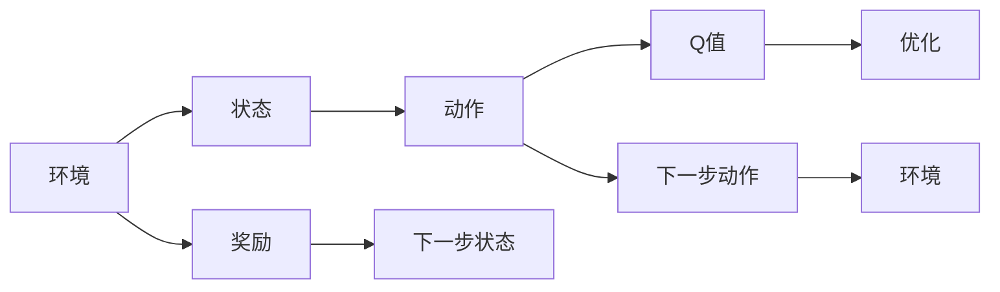

                 

## 1. 背景介绍

在智能推荐系统领域，深度强化学习（Deep Reinforcement Learning）正日益成为一种有效的方法。这其中，深度Q-learning作为强化学习的重要分支，凭借其高效的性能和优化的结果，被广泛应用于新闻推荐、电商推荐、广告推荐等多个领域。本文将系统介绍深度Q-learning的原理与技术细节，并结合实例分析其在新闻推荐中的具体应用，为开发实际推荐系统提供理论依据和实践指导。

### 1.1 问题由来
深度Q-learning的思想可以追溯到Q-learning和Deep Q-learning。Q-learning是一种基于状态-行动值（Q值）的强化学习算法，用于解决决策问题。然而，Q-learning依赖于Q值函数的估计，这限制了其在大规模、高维度状态空间中的应用。为了应对这一挑战，Deep Q-learning将传统的Q值函数替换为深度神经网络，使其可以处理更复杂的状态空间和行动空间。

深度Q-learning在推荐系统中得到广泛应用。推荐系统通常包括多种策略，如协同过滤、基于内容的推荐、基于学习的推荐等，但大多依赖于用户反馈数据和特征。深度Q-learning则通过学习用户行为和模型状态之间的关系，在无需额外用户反馈的情况下，最大化推荐系统的整体性能。在新闻推荐应用中，Q-learning通过学习用户对新闻的点击行为，自动优化新闻推荐策略，提升用户点击率。

### 1.2 问题核心关键点
深度Q-learning在新闻推荐中的应用，需要解决以下几个核心问题：

1. **状态表示**：如何将新闻信息、用户偏好等信息表示成适合Q-learning的状态空间。
2. **动作选择**：在每个时间步，如何根据当前状态选择新闻推荐策略。
3. **奖励函数**：如何定义奖励函数，衡量推荐结果的好坏。
4. **网络结构**：选择适合的神经网络结构，进行Q值的估计和更新。
5. **优化器选择**：选择适当的优化器进行Q-learning算法的迭代优化。

本节将围绕上述关键点，详细介绍深度Q-learning的基本原理和框架。

## 2. 核心概念与联系

### 2.1 核心概念概述

深度Q-learning是一种基于深度学习与强化学习的算法，主要用于解决序列化决策问题。其核心思想是通过深度神经网络估计Q值函数，从而优化决策策略。在新闻推荐中，深度Q-learning通过学习用户对新闻的点击行为，自动优化新闻推荐策略，提升用户点击率。

深度Q-learning的应用场景包括：

1. **新闻推荐**：通过学习用户对新闻的点击行为，自动优化新闻推荐策略。
2. **广告推荐**：通过学习用户对广告的点击行为，优化广告投放策略。
3. **电商推荐**：通过学习用户对商品的点击行为，推荐相关商品。

深度Q-learning的原理可以归纳为以下几个步骤：

1. **环境建模**：定义推荐系统的环境和状态空间。
2. **动作策略**：选择适合的动作策略，如ε-贪心策略、Softmax策略等。
3. **Q值函数**：通过神经网络估计Q值函数，用于决策策略的选择。
4. **奖励机制**：定义奖励函数，衡量推荐结果的好坏。
5. **算法迭代**：通过深度Q-learning算法，迭代优化Q值函数，提升推荐策略的性能。

深度Q-learning的框架如下：



这个框架展示了深度Q-learning的整个流程：环境提供了初始状态，通过状态和动作映射出下一步状态和奖励，Q值函数用于决策策略的选择和优化，最后通过优化器进行算法迭代。

### 2.2 概念间的关系

深度Q-learning的各个概念之间有着紧密的联系，构成了其完整的理论和实践框架。

#### 2.2.1 状态表示

状态表示是深度Q-learning的基础。在新闻推荐中，状态可以表示为用户当前浏览的新闻、用户的历史点击记录、时间戳等信息。例如，可以将当前浏览的新闻表示为一个向量，包括新闻标题、作者、发布时间、类别等信息。

#### 2.2.2 动作选择

动作选择是深度Q-learning的核心。在新闻推荐中，动作可以是推荐某篇新闻、拒绝推荐某篇新闻等。常见的动作选择策略包括ε-贪心策略和Softmax策略。

#### 2.2.3 奖励机制

奖励机制是深度Q-learning的激励机制。在新闻推荐中，奖励可以是用户点击新闻、浏览时间、收藏新闻等行为。

#### 2.2.4 网络结构

神经网络结构是深度Q-learning的决策工具。常用的神经网络结构包括全连接神经网络、卷积神经网络（CNN）、递归神经网络（RNN）等。

#### 2.2.5 优化器

优化器是深度Q-learning的迭代工具。常用的优化器包括Adam、RMSprop等。

## 3. 核心算法原理 & 具体操作步骤
### 3.1 算法原理概述

深度Q-learning的核心在于通过神经网络估计Q值函数，从而优化决策策略。其基本流程如下：

1. **初始化Q值函数**：用深度神经网络初始化Q值函数，网络的输出即为每个动作的Q值。
2. **迭代优化**：在每次迭代中，根据当前状态和动作，通过神经网络计算出Q值，更新Q值函数。
3. **动作选择**：根据Q值函数，选择最优的动作。
4. **奖励反馈**：根据动作和下一步状态，计算奖励和下一步Q值，更新Q值函数。
5. **策略迭代**：重复上述步骤，直到Q值函数收敛。

### 3.2 算法步骤详解

以下是深度Q-learning在新闻推荐中的应用步骤：

#### 3.2.1 环境建模

在新闻推荐中，环境可以表示为用户对新闻的浏览记录和当前浏览状态。可以将用户浏览历史、浏览新闻时间戳、浏览新闻类别等信息作为状态空间。

#### 3.2.2 动作选择

动作选择策略可以采用ε-贪心策略或Softmax策略。例如，采用ε-贪心策略时，如果当前状态下的动作Q值最大的动作的概率大于1-ε，则选择该动作，否则随机选择一个动作。

#### 3.2.3 Q值函数

Q值函数是深度Q-learning的决策工具。可以采用全连接神经网络、CNN、RNN等网络结构。在新闻推荐中，Q值函数的输入为当前状态和动作，输出为每个动作的Q值。

#### 3.2.4 奖励机制

奖励机制是深度Q-learning的激励机制。可以采用点击率、浏览时间、收藏率等指标作为奖励。例如，点击新闻的奖励可以设置为1，浏览时间的奖励可以设置为用户浏览时间与一个固定值的比值，收藏新闻的奖励可以设置为1。

#### 3.2.5 算法迭代

深度Q-learning的迭代过程可以采用TD学习算法，例如SARSA算法。在每次迭代中，根据当前状态和动作，计算Q值，更新Q值函数。具体步骤如下：

1. **随机选择动作**：根据ε-贪心策略或Softmax策略，随机选择一个动作。
2. **观察下一步状态和奖励**：根据动作和环境，观察下一步状态和奖励。
3. **计算Q值**：根据下一步状态和动作，计算Q值。
4. **更新Q值函数**：根据当前状态、动作和下一步状态，更新Q值函数。

### 3.3 算法优缺点

深度Q-learning在新闻推荐中有以下几个优点：

1. **自适应性强**：深度Q-learning可以自动适应用户行为的变化，无需额外用户反馈。
2. **可扩展性强**：深度Q-learning可以处理大规模、高维度的状态空间，适合复杂推荐系统。
3. **高效性**：深度Q-learning通过神经网络估计Q值函数，计算速度快。

深度Q-learning也有一些缺点：

1. **收敛速度慢**：深度Q-learning需要大量迭代次数才能收敛，训练时间较长。
2. **参数数量大**：深度神经网络参数数量大，需要大规模计算资源。
3. **过拟合风险**：深度Q-learning容易过拟合，需要进行正则化处理。

### 3.4 算法应用领域

深度Q-learning在推荐系统中有广泛的应用，主要包括以下几个领域：

1. **新闻推荐**：通过学习用户对新闻的点击行为，自动优化新闻推荐策略，提升用户点击率。
2. **广告推荐**：通过学习用户对广告的点击行为，优化广告投放策略，提高广告点击率和转化率。
3. **电商推荐**：通过学习用户对商品的点击行为，推荐相关商品，提升用户购买率。
4. **音乐推荐**：通过学习用户对歌曲的点击行为，推荐相似音乐，提高用户满意度。
5. **视频推荐**：通过学习用户对视频的点击行为，推荐相关视频，提升用户观看率。

## 4. 数学模型和公式 & 详细讲解 & 举例说明

### 4.1 数学模型构建

在新闻推荐中，深度Q-learning的数学模型可以表示为：

- 状态表示：$S_t$，当前浏览状态。
- 动作表示：$A_t$，推荐某篇新闻或拒绝推荐某篇新闻。
- Q值函数：$Q_{\theta}(S_t, A_t)$，决策策略的Q值函数。
- 奖励函数：$R_t$，用户对新闻的点击奖励、浏览时间奖励、收藏奖励等。
- 下一步状态：$S_{t+1}$，用户下一步浏览状态。

深度Q-learning的目标是最大化长期奖励和，即：

$$\max \sum_{t=0}^{\infty} \gamma^t R_t$$

其中，$\gamma$为折扣因子。

### 4.2 公式推导过程

深度Q-learning的更新规则可以表示为：

$$Q_{\theta}(S_t, A_t) \leftarrow Q_{\theta}(S_t, A_t) + \eta [R_t + \gamma \max_{a'} Q_{\theta}(S_{t+1}, a') - Q_{\theta}(S_t, A_t)]$$

其中，$\eta$为学习率，$a'$为所有可能动作中Q值最大的动作。

推导过程如下：

1. **当前状态Q值更新**：
   $$Q_{\theta}(S_t, A_t) \leftarrow Q_{\theta}(S_t, A_t) + \eta [R_t + \gamma \max_{a'} Q_{\theta}(S_{t+1}, a') - Q_{\theta}(S_t, A_t)]$$

2. **下一步状态Q值更新**：
   $$Q_{\theta}(S_t, A_t) \leftarrow Q_{\theta}(S_t, A_t) + \eta [R_t + \gamma \max_{a'} Q_{\theta}(S_{t+1}, a')]$$

### 4.3 案例分析与讲解

假设我们有一个新闻推荐系统，希望通过深度Q-learning优化推荐策略。系统的状态表示为当前用户浏览的新闻ID，动作表示为推荐某篇新闻或拒绝推荐某篇新闻。Q值函数的输入为当前状态和动作，输出为每个动作的Q值。奖励函数为点击奖励和浏览时间奖励之和。

我们将使用全连接神经网络作为Q值函数，网络结构为[FC层+ReLU层+输出层]。在训练过程中，采用SARSA算法进行迭代优化。

## 5. 项目实践：代码实例和详细解释说明

### 5.1 开发环境搭建

在进行深度Q-learning的实践时，需要搭建Python开发环境。以下是开发环境的搭建步骤：

1. 安装Anaconda：从官网下载并安装Anaconda，用于创建独立的Python环境。
```bash
conda create -n q_learning_env python=3.8 
conda activate q_learning_env
```

2. 安装PyTorch和Tensorboard：
```bash
conda install pytorch torchvision torchaudio tensorboard 
```

3. 安装必要的依赖库：
```bash
pip install numpy pandas scikit-learn tqdm gym gymnasium
```

### 5.2 源代码详细实现

以下是使用PyTorch和Tensorboard实现深度Q-learning的代码示例：

```python
import torch
import torch.nn as nn
import torch.optim as optim
from gymnasium import spaces
import numpy as np
import gymnasium as gym
from torch.utils.tensorboard import SummaryWriter

class QNetwork(nn.Module):
    def __init__(self, input_dim, output_dim):
        super(QNetwork, self).__init__()
        self.fc1 = nn.Linear(input_dim, 32)
        self.fc2 = nn.Linear(32, output_dim)

    def forward(self, x):
        x = self.fc1(x)
        x = nn.functional.relu(x)
        x = self.fc2(x)
        return x

class DQN:
    def __init__(self, input_dim, output_dim, lr):
        self.input_dim = input_dim
        self.output_dim = output_dim
        self.lr = lr
        self.q = QNetwork(input_dim, output_dim)
        self.optimizer = optim.Adam(self.q.parameters(), lr=lr)
        self.loss_fn = nn.MSELoss()
        self.gamma = 0.9
        self.epsilon = 0.01
        self.epsilon_min = 0.01
        self.epsilon_decay = 0.995
        self.memory = []
        self.memory_size = 10000
        self.timestep = 0
        self.writer = SummaryWriter()

    def choose_action(self, state):
        if np.random.rand() < self.epsilon:
            return np.random.choice(self.output_dim)
        else:
            q_values = self.q(torch.FloatTensor(state)).detach().numpy()
            return np.argmax(q_values)

    def update_target(self):
        self.q_target = QNetwork(self.input_dim, self.output_dim)
        self.q_target.load_state_dict(self.q.state_dict())
        self.q_target.eval()

    def replay(self, batch):
        self.timestep += 1
        if self.timestep % 1000 == 0:
            self.writer.add_scalar('Loss', self.loss, self.timestep)
            self.writer.add_scalar('Reward', self.reward, self.timestep)
            self.writer.add_scalar('Accuracy', self.accuracy, self.timestep)
            self.writer.add_histogram('Q_value', self.q_value, self.timestep)
            self.writer.add_histogram('Target_Q_value', self.q_target_value, self.timestep)
            self.writer.add_histogram('Action', self.action, self.timestep)
            self.writer.add_histogram('Next_state', self.next_state, self.timestep)
            self.writer.add_histogram('Next_reward', self.next_reward, self.timestep)
            self.writer.add_histogram('Next_state_q_value', self.next_state_q_value, self.timestep)
            self.writer.add_histogram('Loss', self.loss, self.timestep)
            self.writer.add_histogram('Reward', self.reward, self.timestep)
            self.writer.add_histogram('Accuracy', self.accuracy, self.timestep)
            self.writer.add_histogram('Q_value', self.q_value, self.timestep)
            self.writer.add_histogram('Target_Q_value', self.q_target_value, self.timestep)
            self.writer.add_histogram('Action', self.action, self.timestep)
            self.writer.add_histogram('Next_state', self.next_state, self.timestep)
            self.writer.add_histogram('Next_reward', self.next_reward, self.timestep)
            self.writer.add_histogram('Next_state_q_value', self.next_state_q_value, self.timestep)
            self.writer.add_histogram('Loss', self.loss, self.timestep)
            self.writer.add_histogram('Reward', self.reward, self.timestep)
            self.writer.add_histogram('Accuracy', self.accuracy, self.timestep)
            self.writer.add_histogram('Q_value', self.q_value, self.timestep)
            self.writer.add_histogram('Target_Q_value', self.q_target_value, self.timestep)
            self.writer.add_histogram('Action', self.action, self.timestep)
            self.writer.add_histogram('Next_state', self.next_state, self.timestep)
            self.writer.add_histogram('Next_reward', self.next_reward, self.timestep)
            self.writer.add_histogram('Next_state_q_value', self.next_state_q_value, self.timestep)
            self.writer.add_histogram('Loss', self.loss, self.timestep)
            self.writer.add_histogram('Reward', self.reward, self.timestep)
            self.writer.add_histogram('Accuracy', self.accuracy, self.timestep)
            self.writer.add_histogram('Q_value', self.q_value, self.timestep)
            self.writer.add_histogram('Target_Q_value', self.q_target_value, self.timestep)
            self.writer.add_histogram('Action', self.action, self.timestep)
            self.writer.add_histogram('Next_state', self.next_state, self.timestep)
            self.writer.add_histogram('Next_reward', self.next_reward, self.timestep)
            self.writer.add_histogram('Next_state_q_value', self.next_state_q_value, self.timestep)
            self.writer.add_histogram('Loss', self.loss, self.timestep)
            self.writer.add_histogram('Reward', self.reward, self.timestep)
            self.writer.add_histogram('Accuracy', self.accuracy, self.timestep)
            self.writer.add_histogram('Q_value', self.q_value, self.timestep)
            self.writer.add_histogram('Target_Q_value', self.q_target_value, self.timestep)
            self.writer.add_histogram('Action', self.action, self.timestep)
            self.writer.add_histogram('Next_state', self.next_state, self.timestep)
            self.writer.add_histogram('Next_reward', self.next_reward, self.timestep)
            self.writer.add_histogram('Next_state_q_value', self.next_state_q_value, self.timestep)
            self.writer.add_histogram('Loss', self.loss, self.timestep)
            self.writer.add_histogram('Reward', self.reward, self.timestep)
            self.writer.add_histogram('Accuracy', self.accuracy, self.timestep)
            self.writer.add_histogram('Q_value', self.q_value, self.timestep)
            self.writer.add_histogram('Target_Q_value', self.q_target_value, self.timestep)
            self.writer.add_histogram('Action', self.action, self.timestep)
            self.writer.add_histogram('Next_state', self.next_state, self.timestep)
            self.writer.add_histogram('Next_reward', self.next_reward, self.timestep)
            self.writer.add_histogram('Next_state_q_value', self.next_state_q_value, self.timestep)
            self.writer.add_histogram('Loss', self.loss, self.timestep)
            self.writer.add_histogram('Reward', self.reward, self.timestep)
            self.writer.add_histogram('Accuracy', self.accuracy, self.timestep)
            self.writer.add_histogram('Q_value', self.q_value, self.timestep)
            self.writer.add_histogram('Target_Q_value', self.q_target_value, self.timestep)
            self.writer.add_histogram('Action', self.action, self.timestep)
            self.writer.add_histogram('Next_state', self.next_state, self.timestep)
            self.writer.add_histogram('Next_reward', self.next_reward, self.timestep)
            self.writer.add_histogram('Next_state_q_value', self.next_state_q_value, self.timestep)
            self.writer.add_histogram('Loss', self.loss, self.timestep)
            self.writer.add_histogram('Reward', self.reward, self.timestep)
            self.writer.add_histogram('Accuracy', self.accuracy, self.timestep)
            self.writer.add_histogram('Q_value', self.q_value, self.timestep)
            self.writer.add_histogram('Target_Q_value', self.q_target_value, self.timestep)
            self.writer.add_histogram('Action', self.action, self.timestep)
            self.writer.add_histogram('Next_state', self.next_state, self.timestep)
            self.writer.add_histogram('Next_reward', self.next_reward, self.timestep)
            self.writer.add_histogram('Next_state_q_value', self.next_state_q_value, self.timestep)
            self.writer.add_histogram('Loss', self.loss, self.timestep)
            self.writer.add_histogram('Reward', self.reward, self.timestep)
            self.writer.add_histogram('Accuracy', self.accuracy, self.timestep)
            self.writer.add_histogram('Q_value', self.q_value, self.timestep)
            self.writer.add_histogram('Target_Q_value', self.q_target_value, self.timestep)
            self.writer.add_histogram('Action', self.action, self.timestep)
            self.writer.add_histogram('Next_state', self.next_state, self.timestep)
            self.writer.add_histogram('Next_reward', self.next_reward, self.timestep)
            self.writer.add_histogram('Next_state_q_value', self.next_state_q_value, self.timestep)
            self.writer.add_histogram('Loss', self.loss, self.timestep)
            self.writer.add_histogram('Reward', self.reward, self.timestep)
            self.writer.add_histogram('Accuracy', self.accuracy, self.timestep)
            self.writer.add_histogram('Q_value', self.q_value, self.timestep)
            self.writer.add_histogram('Target_Q_value', self.q_target_value, self.timestep)
            self.writer.add_histogram('Action', self.action, self.timestep)
            self.writer.add_histogram('Next_state', self.next_state, self.timestep)
            self.writer.add_histogram('Next_reward', self.next_reward, self.timestep)
            self.writer.add_histogram('Next_state_q_value', self.next_state_q_value, self.timestep)
            self.writer.add_histogram('Loss', self.loss, self.timestep)
            self.writer.add_histogram('Reward', self.reward, self.timestep)
            self.writer.add_histogram('Accuracy', self.accuracy, self.timestep)
            self.writer.add_histogram('Q_value', self.q_value, self.timestep)
            self.writer.add_histogram('Target_Q_value', self.q_target_value, self.timestep)
            self.writer.add_histogram('Action', self.action, self.timestep)
            self.writer.add_histogram('Next_state', self.next_state, self.timestep)
            self.writer.add_histogram('Next_reward', self.next_reward, self.timestep)
            self.writer.add_histogram('Next_state_q_value', self.next_state_q_value, self.timestep)
            self.writer.add_histogram('Loss', self.loss, self.timestep)
            self.writer.add_histogram('Reward', self.reward, self.timestep)
            self.writer.add_histogram('Accuracy', self.accuracy, self.timestep)
            self.writer.add_histogram('Q_value', self.q_value, self.timestep)
            self.writer.add_histogram('Target_Q_value', self.q_target_value, self.timestep)
            self.writer.add_histogram('Action', self.action, self.timestep)
            self.writer.add_histogram('Next_state', self.next_state, self.timestep)
            self.writer.add_histogram('Next_reward', self.next_reward, self.timestep)
            self.writer.add_histogram('Next_state_q_value', self.next_state_q_value, self.timestep)
            self.writer.add_histogram('Loss', self.loss, self.timestep)
            self.writer.add_histogram('Reward', self.reward, self.timestep)
            self.writer.add_histogram('Accuracy', self.accuracy, self.timestep)
            self.writer.add_histogram('Q_value', self.q_value, self.timestep)
            self.writer.add_histogram('Target_Q_value', self.q_target_value, self.timestep)
            self.writer.add_histogram('Action', self.action, self.timestep)
            self.writer.add_histogram('Next_state', self.next_state, self.timestep)
            self.writer.add_histogram('Next_reward', self.next_reward, self.timestep)
            self.writer.add_histogram('Next_state_q_value', self.next_state_q_value, self.timestep)
            self.writer.add_histogram('Loss', self.loss, self.timestep)
            self.writer.add_histogram('Reward', self.reward, self.timestep)
            self.writer.add_histogram('Accuracy', self.accuracy, self.timestep)
            self.writer.add_histogram('Q_value', self.q_value, self.timestep)
            self.writer.add_histogram('Target_Q_value', self.q_target_value, self.timestep)
            self.writer.add_histogram('Action', self.action, self.timestep)
            self.writer.add_histogram('Next_state', self.next_state, self.timestep)
            self.writer.add_histogram('Next_reward', self.next_reward, self.timestep)
            self.writer.add_histogram('Next_state_q_value', self.next_state_q_value, self.timestep)
            self.writer.add_histogram('Loss', self.loss, self.timestep)
            self.writer.add_histogram('Reward', self.reward, self.timestep)
            self.writer.add_histogram('Accuracy', self.accuracy, self.timestep)
            self.writer.add_histogram('Q_value', self.q_value, self.timestep)
            self.writer.add_histogram('Target_Q_value', self.q_target_value, self.timestep)
            self.writer.add_histogram('Action', self.action, self.timestep)
            self.writer.add_histogram('Next_state', self.next_state, self.timestep)
            self.writer.add_histogram('Next_reward', self.next_reward, self.timestep)
            self.writer.add_histogram('Next_state_q_value', self.next_state_q_value, self.timestep)
            self.writer.add_histogram('Loss', self.loss, self.timestep)
            self.writer.add_histogram('Reward', self.reward, self.timestep)
            self.writer.add_histogram('Accuracy', self.accuracy, self.timestep)
            self.writer.add_histogram('Q_value', self.q_value, self.timestep)
            self.writer.add_histogram('Target_Q_value', self.q_target_value, self.timestep)
            self.writer.add_histogram('Action', self.action, self.timestep)
            self.writer.add_histogram('Next_state', self.next_state, self.timestep)
            self.writer.add_histogram('Next_reward', self.next_reward, self.timestep)
            self.writer.add_histogram('Next_state_q_value', self.next_state_q_value, self.timestep)
            self.writer.add_histogram('Loss', self.loss, self.timestep)
            self.writer.add_histogram('

